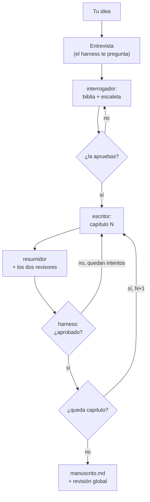

# Story Maker

Generador agéntico de novelas en castellano sobre **cómo será el mundo tras la revolución de la IA**. Das una idea; un harness la convierte en una novela completa, capítulo a capítulo, con continuidad verificada.

## Cómo funciona

Un orquestador (la skill `/novela`) coordina cinco agentes y **es el único que escribe ficheros**, guarda el estado, impone los límites y toma todas las decisiones de flujo.


| Agente | Qué hace |
|---|---|
| `interrogador` | Convierte idea + entrevista en biblia y escaleta; detalla la escaleta de cada arco |
| `escritor` | Escribe el capítulo (y lo reescribe con el informe de rechazo) |
| `resumidor` | Resume el capítulo y propone el libro de estado resultante |
| `revisor-encargo` | ¿El capítulo contiene lo que su escaleta pedía? ¿Mantiene voz y tono? |
| `revisor-continuidad` | ¿Se contradice algo contra la biblia, el libro de estado y los resúmenes? |

Los revisores **nunca editan**: devuelven un informe JSON y el harness recalcula el veredicto y decide (aprobar, ajustar longitud, reescribir o quedarse con el mejor intento).



Solo la entrevista y la aprobación de la escaleta necesitan a una persona. A partir de ahí el bucle corre solo —escribir, resumir, revisar, decidir— capítulo a capítulo, dejando todo en disco después de cada uno.

---

## Uso: generar una novela

Desde una sesión de Claude Code en este repositorio:

```
/novela nueva "<tu idea en una o dos frases>"
/novela continuar novelas/<slug>
/novela estado novelas/<slug>
/novela verificar novelas/<slug>
```

- **`nueva`** — entrevista al usuario (grilling), propone biblia y escaleta y, **tras tu confirmación**, escribe la novela entera sin más intervención.
- **`continuar`** — retoma desde el último punto consistente en disco. Puedes interrumpir cuando quieras: nada se pierde.
- **`estado`** — dónde va (solo lectura).
- **`verificar`** — inventario de artefactos y métricas de calidad de una carpeta ya generada (solo lectura).

### Variantes de entrada

```
/novela nueva "…" entrevista: pruebas/referencia/entrevista.md   # entrevista ya cerrada, no pregunta
/novela nueva "…" precarga: encargos/<slug>                       # arranca del formulario del estudio y sigue preguntando
/novela nueva modo-prueba: pruebas/referencia                     # caso de referencia, sin preguntar nada
```

### Sobreescribir configuración por comando

Cualquier clave de `config.json`, con ruta por puntos, solo para esa ejecución:

```
/novela nueva "…" perfil_activo=novela_corta modelos.escritor=sonnet limites.pausa_cada_capitulos=null
```

---

## Configuración (`config.json`)

Es **lo único que se edita a mano**. Cada variable está explicada en [specs/functional.md](specs/functional.md) §7. Lo que más se toca:

| Clave | Para qué |
|---|---|
| `perfil_activo` | `relato` (5 cap.), `novela_corta` (12), `novela` (30), `saga` (100–200) |
| `modelos.*` | Modelo de cada agente, y `escalado` para subir a un modelo mejor tras un rechazo |
| `limites.*` | Reescrituras máximas, reintentos, `pausa_cada_capitulos` (ponlo a `null` para no parar) |
| `memoria.*` | Cuánto contexto previo recibe el escritor |
| `veredicto.*` y `calidad.*` | Cuándo se rechaza un capítulo y qué se considera una ejecución buena |

El modelo del **orquestador** no se configura aquí: es el de tu sesión de Claude Code.

## Qué produce

Todo en `novelas/<slug>/`, que es el estado completo del sistema:

```
idea.md  entrevista.md  biblia.md  escaleta.md  config.json
arcos/arco-AA.md            escaleta detallada e informe por arco
capitulos/NN/intento-K.md   cada intento, su resumen y su informe
libro-estado.md             personajes, hilos, objetos y reglas vigentes
manuscrito.md               la novela ensamblada
erratas.md                  correcciones de una línea, listadas, nunca aplicadas
informe-cierre.md           EXITO o PARADA, volumen, métricas, cómo continuar
registro.md  estado.json    traza de cada evento y punto de reanudación
```

Nada aprobado se reescribe: un hook de Claude Code (`.claude/hooks/inmutables.sh`) bloquea editar biblia, escaletas validadas, intentos y manuscrito.

---

## Visor y estudio (`frontend/`)

```bash
cd frontend
pnpm dev        # http://localhost:5173/#/
```

- **Visor**: cruza los ficheros de una novela (capítulos, informes, hilos, métricas). **Solo lee** y no inventa datos.
- **Estudio**: recoge la idea y una entrevista previa en `encargos/<slug>/` y lanza el mismo `/novela`. Es una fachada, no un camino alternativo: no escribe en `novelas/`, no invoca agentes y no aprueba nada por ti.

Borrar `frontend/` no cambia el comportamiento del harness.

## Herramientas de medida

También fuera del harness, y también borrables. **Léete [herramientas/COMO-USAR.md](herramientas/COMO-USAR.md) antes de usarlas**: sus cinco reglas no son opcionales (la primera: el que genera nunca puntúa).

```
/validar novelas/<slug>                        # puntúa el manuscrito y da el delta contra la línea base
/validar novelas/<slug> --congelar-base        # fija esa medición como referencia
/optimizar <agente> --metrica <score> --vueltas N   # busca un prompt mejor para ese agente
/optimizar estado <carpeta>                    # resultado vuelta a vuelta
```

`/optimizar` deja un *candidato* y un informe; **promover un prompt a producción es un commit que haces tú**. Ninguna de las dos se ejecuta nunca dentro de `/novela`.

---

## Dónde está cada cosa

| Quiero… | Ir a |
|---|---|
| Saber qué hace el sistema y cómo (manda sobre todo lo demás) | [specs/functional.md](specs/functional.md) |
| Saber dónde está implementado y con qué datos se decidió (§9, evidencia E-n) | [specs/technical.md](specs/technical.md) |
| Ver el flujo en diagramas | [specs/architecture.md](specs/architecture.md) |
| Saber por qué se decidió así y qué se descartó | [CHANGELOG.md](CHANGELOG.md) |
| Saber qué falta por hacer | [TODO.md](TODO.md) |
| Cambiar el comportamiento | [config.json](config.json) |
| Leer el orquestador | [.claude/skills/novela/](.claude/skills/novela/SKILL.md) |
| Leer los contratos de los agentes | [.claude/agents/](.claude/agents/) |
| Reglas para trabajar en el repositorio con Claude | [CLAUDE.md](CLAUDE.md) |
