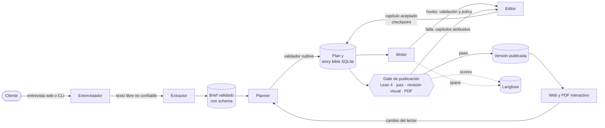

<p align="center">
  
</p>

<h1 align="center">Story Maker</h1>

<p align="center">
  <strong>Novelas personalizadas de regalo, escritas por un harness multiagente y verificadas formalmente.</strong><br>
  Ambientadas en un presente alternativo <em>post-IA</em>. 10 capítulos. El destinatario es el protagonista.
</p>

<p align="center">
  
  
  
  
  
  
  
  
</p>

---

## Qué es

El cliente cuenta en una entrevista quién es el destinatario, sus allegados, sus recuerdos, la ocasión, el tono y lo que **no** quiere que aparezca. Un harness de roles (planner, writer, editor, juez) escribe la novela capítulo a capítulo sobre una **story bible en SQLite**; los validadores —deterministas, semánticos, **Lean 4** para la cronología y **TLA+** para el propio harness— deciden si una versión se publica. Se lee en **web** y en **PDF interactivo**, y el lector puede pedir un cambio («el perro se llama Nala»): solo se reescriben los capítulos afectados y la versión anterior se conserva.

Proyecto del examen de Harness Engineering · encargo en [project-constraints.md](project-constraints.md) · spec inicial en [ADR 0006](docs/adr/0006-diseno-lean.md).

**Lo más destacable**

- 🧠 **Harness multiagente** con Claude Agent SDK: 8 roles con prompt propio, tools con schema, hooks de validación y de policy, reintentos acotados y reanudación desde checkpoint.
- 📐 **Verificación formal doble:** Lean 4 con cinco invariantes (T1–T5) y **demostraciones generales** para cualquier cronología; TLA+ con cuatro invariantes de seguridad, una de liveness y un segundo modelo de regeneraciones concurrentes, comprobados con TLC.
- 🔎 **Lean caza lo que nadie más ve:** en una eval real, un personaje excluido reaparecía en el mismo día; ni la rúbrica ni el juez lo detectaron ([caso](#resultados-reales)).
- 📊 **Evals medibles** sobre 5 briefs (adversarial y temporal incluidos), dos iteraciones de tuning con antes/después y coste real por novela desde Langfuse.
- 🛡️ **Guardrails:** palabras prohibidas en tres niveles con normalización (acentos, plurales, leetspeak), detector de inyección en el texto libre, audit log y techo de **100.000 tokens concurrentes** aplicado en código.
- ➕ **Opcionales:** login con SQLite y aislamiento entre clientes, servidor MCP con tools de lectura **y escritura**, linters de prosa, editor manual con linter en vivo, invariantes extra en Lean y TLA+ de la concurrencia.
- 🤖 **Desarrollo con Claude Code:** specs → plan → TDD, carriles en paralelo por worktree, subagentes, comandos, hooks, skills y browser MCP, todo en el repo y documentado.

## Arquitectura


```mermaid
flowchart LR
  Cliente([Cliente]) -->|entrevista web o CLI| Entrevistador
  Entrevistador -->|texto libre no confiable| Extractor
  Extractor --> Brief[(Brief validado<br/>con schema)]
  Brief --> Planner
  Planner -->|validador outline| Plan[(Plan y<br/>story bible SQLite)]
  Plan --> Writer
  Writer -->|hooks: validación y policy| Editor
  Editor -->|capítulo aceptado<br/>checkpoint| Plan
  Plan --> Gate{{Gate de publicación<br/>Lean 4 · juez · revisión visual · PDF}}
  Gate -->|falla: capítulos atribuidos| Editor
  Gate -->|pasa| Version[(Versión publicada)]
  Version --> Lectura[Web y PDF interactivo]
  Lectura -->|cambio del lector| Planner
  Gate -. scores .-> Langfuse[(Langfuse)]
  Writer -. spans .-> Langfuse
```

Diagramas completos en [docs/architecture.md](docs/architecture.md): harness §1.4 · máquina de estados §9.1 · esquema SQLite §15.6 · validadores y su punto de ejecución §11.2.

## Cómo cumple el encargo

| Bloque del encargo | Qué hay | Dónde comprobarlo |
|---|---|---|
| **1. Configuración** | Entrevistador (web y CLI) que detecta datos que faltan y contradicciones; texto libre tratado como no confiable, del que se extraen hechos con cita verificada; brief validado con schema; palabras prohibidas del cliente | specs 008, 024 · `interview/`, `policy/injection.py` · `uv run pytest tests/api/test_free_text_injection.py` |
| **2. Lectura** | Web: portada con dedicatoria, índice, ficha de personajes y lugares enlazada, versiones, marca de capítulos cambiados, pedir un cambio seleccionando un fragmento o un hecho. PDF interactivo con portada, índice, ficha enlazados y página de novedades | specs 013, 026, 027 · `render/` |
| **3. Harness** | Planner, writer, editor, juez, entrevistador, extractor, revisor visual y planner de cambios; `CLAUDE.md` de producto, skill `personalizacion-natural`, hooks de validación y de policy; tools con schema; `max_retries` | [backend/harness_workspace/](backend/harness_workspace/) · `agents/`, `pipeline/` · [config.json](config.json) |
| **4. Memoria** | Story bible en SQLite con uso de cada hecho por capítulo y tabla de cronología; resúmenes por capítulo; checkpoint por capítulo y `resume` | spec 009 · `store/models.py` · `docs/architecture.md` §15.6 |
| **5a. Programáticos** | `schema-brief`, `schema-salida`, `outline`, `longitud-capitulo`, `nombres-exactos`, `palabras-prohibidas`, `elementos-obligatorios`, `pdf-enlaces` y `revision-visual` con Playwright MCP | spec 011, 012, 017 · `docs/architecture.md` §11.2 |
| **5b. Semánticos** | `rubrica-capitulo` y `juez-novela` con rúbrica de 7 criterios, puntuación y justificación por criterio, regla no compensatoria; plantilla de revisión humana con la misma rúbrica | spec 012 · [ejemplos/revision-humana-brief1.md](ejemplos/revision-humana-brief1.md) |
| **5c. Lean 4** | Cronología generada desde SQLite; T1–T5 (orden temporal, edad coherente, nadie en dos lugares, exclusión definitiva, nadie antes de nacer); si falla, no se publica y vuelve al editor con testigos | [lean/](lean/) · spec 007 · CI `verificar-cronologia.yml` |
| **5d. TLA+** | Máquina de estados completa con retries, reanudación y cambio del lector; 4 invariantes + liveness; TLC con 5 capítulos y 2 reintentos; contraejemplo real documentado | [tla/](tla/) · `bash tla/verificar.sh` · [correspondencia con el código](#correspondencia-tla--código) |
| **Evals** | 5 briefs, tabla brief × validador, 2 iteraciones de tuning | [ejemplos/briefs/](ejemplos/briefs/) · `docs/verification.md` §4.2 |
| **6. Observabilidad** | Una sesión Langfuse por novela; spans por rol, tool, validador y capítulo; tokens, coste y latencia; validadores como scores; prompts versionados | spec 004 · `observability/` · `story-maker prompts push` |
| **7. Guardrails** | Prohibidas globales, de cliente y de novela en SQLite, normalizadas; devolución al writer con límite; audit log y Langfuse; tests por nivel y variante; techo de 100k tokens concurrentes | spec 005 · `uv run pytest tests/domain/test_banned_terms.py tests/policy` · `agents/ceiling.py` |

## Resultados reales

Capturados de la base real con `story-maker evals table` (detalle en [docs/verification.md](docs/verification.md) §4.2):

| | 1 ejemplo | 2 infantil | 3 boda | 4 adversarial | 5 temporal |
|---|---|---|---|---|---|
| `juez-novela` (media · mínimo) | 4,3 · 2 | 4,4 · 2 | 4,0 · 2 | 4,3 · 3 | — |
| `cronologia-lean` | pasa tras reescribir | falla (T1) | falla (T2, T4) | falla (T1) | — |
| Flags de inyección | 0 | 0 | 0 | **3** | 0 |
| Coste (precio de lista, Langfuse) | 4,64 $ | 4,83 $ | 3,94 $ | 3,31 $ | 3,25 $ |
| Pico de tokens concurrentes | 28,2k | 24,4k | 26,6k | 26,3k | 21,7k |

- **Los validadores bloqueantes cazan de verdad:** 42 intentos rechazados (`outline`, `longitud-capitulo`, `nombres-exactos`), todos devueltos con su defecto y corregidos dentro del límite.
- **Lean frente al resto:** en la eval de boda, Lean detectó que un personaje excluido de la historia reaparecía horas después (T4) y una edad incoherente (T2); la rúbrica aceptó el capítulo con 5/5 y el juez no lo mencionó. Ficheros reales en [ejemplos/cronologias/](ejemplos/cronologias/).
- **Tuning con efecto medido:** writer v2 → v3 subió las entregas en rango de 0 de 2 a 5 de 6 (+517 palabras de media) y llevó 4 de 5 ejecuciones al gate, desde 0.
- **El gate no cede:** prefiere detenerse con motivo registrado (`ReintentosAcotados`) a publicar una novela que se contradice. [ejemplos/novela-ejemplo.pdf](ejemplos/novela-ejemplo.pdf) es la candidata completa de 10 capítulos del brief de ejemplo (T1–T5 verdaderos tras la reescritura dirigida); candidatas de los briefs 2 y 3 en [ejemplos/novela/](ejemplos/novela/).

## Arranque rápido

**Requisitos:** Python 3.12 y [`uv`](https://docs.astral.sh/uv/) · Node 24 y pnpm 10.x (en Windows, `pnpm.cmd`) · Microsoft Edge (PDF y revisión visual) · Claude Code (`claude`) **con sesión iniciada**: los roles usan ese login, sin claves de pago · Langfuse Cloud (plan Hobby) · opcional: JDK 21 para TLC.

```sh
cp .env.example .env           # JWT_SECRET (≥ 32 caracteres) y FORMAL_VERIFIER (local | github)
cd backend && uv sync
uv run story-maker init-db     # crea la base; no pisa una existente sin --reset
uv run story-maker check-env   # una línea por comprobación de ajustes, config y base
cd ../frontend && pnpm.cmd install && pnpm.cmd build
cd ../backend && uv run story-maker serve     # API + SPA + worker, en STORY_MAKER_BASE_URL (sin --reload)
```

Abre la web, regístrate y crea una novela: entrevista → confirmación del brief → progreso capítulo a capítulo → lectura.

### Brief de ejemplo reproducible

Desde `backend/`, con el servidor parado (la orden monta su propio worker sobre la misma base):

```sh
uv run story-maker example ../ejemplos/briefs/01-ejemplo.json --email <cliente registrado>
# → ejemplos/novela-ejemplo.pdf (o --out <ruta>); del orden de 1–1,5 h con el login de Claude Code
```

### Entrevista por terminal

```sh
uv run story-maker interview --email <cliente registrado> [--novel <id>]
```

Cada línea es un turno. `/texto <fichero>` manda una carta o anécdota al extractor; `/hechos`, `/aceptar`, `/rechazar` y `/obligatorio` gobiernan los hechos extraídos; `/confirmar` cierra el brief y, con una segunda confirmación, lanza la generación; `/salir` termina.

<details>
<summary><strong>Todas las órdenes de la CLI</strong></summary>

| Orden | Qué hace |
|---|---|
| `init-db [--reset]` | Crea la base con el esquema completo; sin `--reset` no toca una existente |
| `check-env` | Una línea por comprobación: ajustes, config, base y observabilidad |
| `serve` | La API, la SPA compilada y el worker de la cola, en un proceso (sin `--reload`) |
| `interview --email <e> [--novel <id>]` | Entrevista por terminal con confirmación explícita del brief y de la generación |
| `resume <run_id>` | Vuelve a encolar una ejecución `interrupted` en su puesto |
| `export-pdf <novel> <v>` | Regenera el PDF de una versión |
| `example <brief.json> --email <e> [--out <ruta>]` | Brief → novela → su PDF |
| `change <novel_id> <petición> --email <e> [--fact <id> \| --chapter <n> --fragment <cita>]` | Propone un cambio del lector sobre un hecho o un fragmento y, tras confirmarlo, lo encola |
| `evals run --email <e>` | Importa los 5 briefs de `ejemplos/briefs/` y procesa una ejecución por brief; nunca en CI |
| `evals table` | Tabla brief × validador y resumen por brief, desde SQLite |
| `prompts push` | Sube a Langfuse el prompt de cada rol cuya huella cambió, con `LANGFUSE_PROMPT_LABEL` |
| `report metrics [--out <ruta>]` | Agrega sesiones de rol y resultados de validadores en un Markdown determinista |

</details>

### Langfuse

En `.env`: `LANGFUSE_PUBLIC_KEY`, `LANGFUSE_SECRET_KEY`, `LANGFUSE_BASE_URL` y `LANGFUSE_PROMPT_LABEL`. Una sesión por novela (entrevista, generación y regeneraciones); spans por rol, tool, validador y capítulo; los validadores, como scores de la traza.

## Pruebas y verificación

Ninguna prueba ni la CI llaman a un modelo: la suite usa un doble falso del puerto de agente.

| Qué | Orden |
|---|---|
| Backend (desde `backend/`) | `uv run pytest` · `uv run ruff check .` · `uv run ruff format --check .` · `uv run mypy src` |
| Frontend (desde `frontend/`) | `pnpm.cmd lint` · `pnpm.cmd typecheck` · `pnpm.cmd test` · `pnpm.cmd build` |
| TLA+ con TLC (5 capítulos, 2 reintentos) | `bash tla/verificar.sh` — configs e instrucciones en [tla/README.md](tla/README.md) |
| Lean 4 (T1–T5) | GitHub Actions: `.github/workflows/verificar-cronologia.yml` — detalle en [lean/README.md](lean/README.md) |
| Seguridad en cada push | `detect-secrets`, `pip-audit` y `pnpm audit` en `.github/workflows/ci.yml` |

Propiedades de TLA+ (`tla/Harness.tla`): `NuncaPublicaSinValidar`, `ReanudacionSinDuplicarNiPerder`, `VersionAnteriorConservada`, `ReintentosAcotados` y la liveness `TerminaSiempre`; `tla/Regenerations.tla` añade `VersionesLineales`. Cada una tiene una config de control que demuestra que TLC la rompe si se quita la guarda. Los contraejemplos encontrados durante el desarrollo y el cambio de código que provocaron están en `docs/verification.md` §8.

## Opcionales entregados

| Opcional | Qué hay | Evidencia |
|---|---|---|
| **Login con SQLite** | Registro e inicio de sesión con bcrypt y JWT; cada novela, brief y entrada del audit log tiene propietario; lo ajeno responde 404 | spec 002 · `tests/api/test_ownership.py`, `test_auth.py`, `test_audit_log.py` |
| **Servidor MCP con escritura** | Siete tools en `/mcp`: cinco de lectura y dos de escritura con confirmación; misma identidad JWT que la API; traza por llamada | spec 015 · [backend/src/story_maker/api/mcp/](backend/src/story_maker/api/mcp/) · [cómo conectarlo](#servidor-mcp) |
| **Linters de prosa** | Repetición y muletillas, legibilidad según el tono, estilo típico de IA, consistencia de narrador y tiempo verbal; en el bucle de escritura y en la edición manual | spec 018 · `backend/src/story_maker/lint/` |
| **Linter de edición manual** | El editor web señala en vivo prohibidas, formas no canónicas y avisos de prosa; un guardado que cambia un hecho actualiza la story bible y repasa los validadores, Lean incluido, antes de publicar | specs 019 y 028 · `pipeline/manual_edit/`, `frontend/src/pages/chapter-editor` |
| **Lean: invariantes extra y demostraciones generales** | Cinco invariantes (tres más de los exigidos) y teoremas que prueban cada comprobación correcta y completa **para cualquier cronología** | [lean/Chronology.lean](lean/Chronology.lean) |
| **TLA+ de regeneraciones concurrentes** | Cambios del lector simultáneos sobre la misma novela, invariante `VersionesLineales`, con su prueba en código | [tla/Regenerations.tla](tla/Regenerations.tla) · `tests/pipeline/changes/test_change_stale_base.py` |

## Límites del encargo, en código

- **100.000 tokens concurrentes:** `token_ceiling` en [config.json](config.json), con un techo de reservas y una cola FIFO para las sesiones de rol (`agents/ceiling.py`); un valor por encima se rechaza al arrancar. Pico medido en las evals: entre 21,7k y 28,2k.
- **Reintentos acotados:** `max_retries` por capítulo, plan, ciclo de gate y cambio, y `max_resumes`; al agotarlos la ejecución termina en `failed` con su motivo (`ReintentosAcotados` en TLA+).

## Correspondencia TLA+ ↔ código

Cada acción de `tla/Harness.tla` corresponde a una transición del orquestador o de la API (`docs/architecture.md` §9.1). `tla/Regenerations.tla` usa las mismas acciones —`PedirCambio`, `Regenerar` (con la revalidación de la base de §10.2), `Fallar` (también `stale_base`), `Publicar`, `Caer` y `Reanudar`— y remite a sus filas; su invariante es `VersionesLineales`. La columna Código se rellena al cerrar cada spec implementadora y la revisa el `verificador` (`docs/verification.md` §4.10).

| Acción TLA+ | Transición (§9.1, como la modela la 006) | Quién la dispara | Spec del código | Código |
|---|---|---|---|---|
| `Configurar` | → `queued` (generation, candidata vacía) | API: `POST /api/novels/{id}/runs` con el brief confirmado | 011 (API de ejecuciones) | `pipeline/queue.py:enqueue_generation`, `api/runs.py:launch_generation` |
| `Planificar` | `queued` → `running`, `planning`; relanzada: → `writing` (capítulo k+1) o `gate` | Worker: toma la primera de la cola y abre el planner o sigue desde el punto de control | 011 (worker), 010 (planner) | `composition.py:build_worker` (031: el worker que monta `serve`), `pipeline/worker.py:Worker.run_forever`, `pipeline/worker.py:Worker._take_first`, `pipeline/orchestrator.py:Orchestrator._advance`, `pipeline/planning/phase.py:run_plan_phase`, `pipeline/planning_seam.py` (031: brief confirmado → entrada del planner) |
| `Regenerar` | `queued` → `running`, `writing` del primer afectado, con la candidata copiada de la base revalidada; relanzada: como `Planificar`, revalidando la base | Worker | 014 (cambio) | `pipeline/orchestrator.py:Orchestrator._change`, `pipeline/changes/run.py:revalidate_base`, `pipeline/changes/run.py:start_change` (candidata copiada de la base en una transacción), `pipeline/changes/run.py:revise_affected` |
| `EscribirCapitulo` | `writing` o `rewriting`: entrega del capítulo en curso | Orquestador, sesión del writer (en un fallo de datos del gate, el editor vuelve a registrar sin writer) | 011; en `rewriting`, 012 | `pipeline/production.py:ChapterProducer._write`, `pipeline/production.py:ChapterProducer._accept`, `pipeline/gate/phase.py:Gate._rewrite`; el re-registro del editor sin writer, que dispara un fallo de datos de `revision-visual` (017): `pipeline/gate/phase.py:Gate._reregister`, `pipeline/gate/reregister.py:reregister_chapter` |
| `Validar` | pasa: plan aplicado (punto de control 0), capítulo aceptado (con punto de control en `writing`) o gate superado; falla: defectos, o `gate` → `rewriting` con los capítulos atribuidos | Validador `outline`; hooks, editor y veredicto; validadores del gate | 010 (`outline`), 011, 012 (gate) | `pipeline/planning/apply.py:apply_accepted_plan`, `pipeline/acceptance.py:accept_chapter`, `pipeline/gate/precedence.py:gate_precedence` |
| `Reintentar` | defectos → nuevo intento del mismo evaluable; `rewriting` → `gate` con los atribuidos aceptados | Orquestador, con la guarda de `max_retries.*` | 010, 011, 012 | `pipeline/planning/phase.py:run_plan_phase`, `pipeline/production.py:ChapterProducer.produce_chapter`, `pipeline/gate/phase.py:Gate.__call__` |
| `Gate` | `writing` → `gate`, sin capítulos por escribir | Orquestador | 012 | `pipeline/orchestrator.py:Orchestrator._advance`, `pipeline/gate/phase.py:Gate._start_pass` |
| `Publicar` | `gate` superado → `published`; versión siguiente; solicitud o edición `applied` | Transacción de publicación (§9.3) | 012 | `pipeline/gate/phase.py:Gate._publish`, `pipeline/gate/publication.py:publish_candidate`; la solicitud `applied`: `pipeline/gate/publication.py:mark_applied`, también para la edición manual (019) |
| `Fallar` | `running` (o `queued` con base obsoleta, en `Regenerations.tla`) → `failed`; candidata `discarded`; solicitud o edición `rejected` | Límite agotado, fallo no atribuible, `edit_rejected`, `stale_base`, caída con `max_resumes` agotado | 010, 011, 012, 014, según el motivo | `pipeline/runs.py:fail_run`, `pipeline/planning/phase.py:run_plan_phase`, `pipeline/production.py:ChapterProducer.produce_chapter`, `pipeline/gate/phase.py:Gate.__call__`; `stale_base`: `pipeline/changes/run.py:revalidate_base`, y la solicitud `rejected` en `pipeline/runs.py:fail_run`; `edit_rejected` (019): `pipeline/manual_edit/gate.py:edit_rejection` |
| `Caer` | `running` → `interrupted` | Error del proveedor, verificador inalcanzable o agotado, arranque con la ejecución en `running` | 011 (caída y arranque), 012 (verificador) | `pipeline/runs.py:interrupt_run`, `pipeline/runs.py:interrupt_running_at_startup` (vía `pipeline/worker.py:Worker.recover`, al arrancar el worker de `composition.py:build_app`, 031), `pipeline/runs.py:stop_run` |
| `Reanudar` | `interrupted` → `queued`, en su puesto original | `POST /api/runs/{id}/resume` o `story-maker resume` | 011 (API y CLI) | `pipeline/runs.py:resume_run`, `api/runs.py:resume`, `cli.py:resume_command` |
| `PedirCambio` | → `queued` (change_request o manual_edit, con la vigente como base) | API: confirmar un cambio con su código, o guardar una edición manual | 014, 019 | `pipeline/changes/confirm.py:confirm_change`, `api/change_requests.py:post_confirm`; `pipeline/manual_edit/save.py:save_edit`, `api/manual_edit.py:put_chapter` |


## Servidor MCP

**Del producto (spec 015).** `story-maker serve` monta un servidor MCP en `/mcp` con siete tools: cinco de lectura (`list_novels`, `list_versions`, `get_chapter`, `query_story_bible`, `download_novel`) y dos de escritura para pedir un cambio del lector (`request_change`, que solo propone, y `confirm_change`, que lo encola con el código de la propuesta).

Cómo conectarlo desde un cliente MCP (Claude Code, Claude Desktop o MCP Inspector):

1. Obtén un token con `POST /api/auth/login`.
2. Añade un servidor de tipo `http` (streamable-http) apuntando a `<STORY_MAKER_BASE_URL>/mcp`, con la cabecera `Authorization: Bearer <token>`.

Sin esa cabecera la petición recibe 401 antes de llegar al protocolo MCP; con ella, cada cliente solo ve sus novelas. Cada llamada deja una traza `mcp:<tool>` en Langfuse y las de escritura, además, una fila de auditoría.

**Para el desarrollo**, [.mcp.json](.mcp.json) trae Playwright MCP (Edge), el browser MCP con el que Claude Code inspecciona la lectura web, y el MCP de Langfuse, que lee su cabecera de la variable de entorno `LANGFUSE_MCP_AUTH`, nunca del repo. El mismo Playwright MCP lo usa en ejecución el validador `revision-visual` del gate (spec 017).

## Desarrollado con Claude Code

| Pieza | Qué hay | Uso documentado |
|---|---|---|
| Instrucciones | [CLAUDE.md](CLAUDE.md) y [AGENTS.md](AGENTS.md) (desarrollo); `backend/harness_workspace/CLAUDE.md` (producto) | — |
| Subagentes | `redactor-specs`, `implementador` y `verificador` en [.claude/agents/](.claude/agents/) | `docs/verification.md` §9.4 |
| Comandos | `/orquestar`, `/carril`, `/spec`, `/plan`, `/implementar`, `/integrar`, `/estado`, `/log-decision` | `docs/verification.md` §9.4 |
| Hooks | `guard-secretos` (bloquea claves reales) y `guard-plan` (bloquea código sin plan aprobado) | `docs/verification.md` §9.6 |
| Skills | FastAPI, FSD, React, SQLAlchemy, verificación, revisión, `grill-me`; la de producto, `personalizacion-natural` | `docs/verification.md` §9.1 |
| Memoria | espejo versionado en [.claude/memory/](.claude/memory/) | `docs/verification.md` §9.5 |
| Browser MCP | Playwright MCP en Edge | `docs/verification.md` §9.3 |

**Método:** cinco capas en orden —`docs/` → `specs/` → plan en `TODO.md` → test que falla → código—, 31 specs cerradas, cada una con su plan, TDD y cierre por `verificador`. El trabajo se reparte en **carriles paralelos**, un worktree hermano por carril (`../sm-<x>`, rama `carril-<x>`), y el checkout principal integra cada spec cerrada con `git merge --no-ff` y la suite completa. Para empezar: `/orquestar` en el checkout principal. Reglas en [AGENTS.md](AGENTS.md) › *Parallel lanes*.

## Mapa de entregables

| Entregable | Dónde |
|---|---|
| Spec inicial | [docs/adr/0006-diseno-lean.md](docs/adr/0006-diseno-lean.md) |
| Trade-offs (opciones, criterio, elección) | [docs/architecture.md](docs/architecture.md) §18 |
| Explainers, uno por concepto del curso | `docs/architecture.md` §16 |
| Diagramas | `docs/architecture.md` §1.4 (harness) · §9.1 (máquina de estados) · §15.6 (SQLite) · §11.2 (validadores) |
| Evals con resultados medibles e iteración de tuning | [docs/verification.md](docs/verification.md) §4.2 |
| Registro de iteraciones | `docs/verification.md` §8 |
| Red-team log | `docs/verification.md` §4.9 |
| Cinco briefs de prueba | [ejemplos/briefs/](ejemplos/briefs/) |
| Novela de ejemplo (PDF, 10 capítulos) | [ejemplos/novela-ejemplo.pdf](ejemplos/novela-ejemplo.pdf) |
| Caso real de Lean | [ejemplos/cronologias/](ejemplos/cronologias/) · `docs/verification.md` §4.2 (e) |
| Harness de producto | [backend/harness_workspace/](backend/harness_workspace/) · `docs/architecture.md` §7.3 y §7.5 |
| Verificación formal | [lean/](lean/) · [tla/](tla/) |
| Presentación y anexos | [presentacion/](presentacion/) |
| Sin claves en el repo | [.env.example](.env.example) con marcadores; `detect-secrets` en CI |
