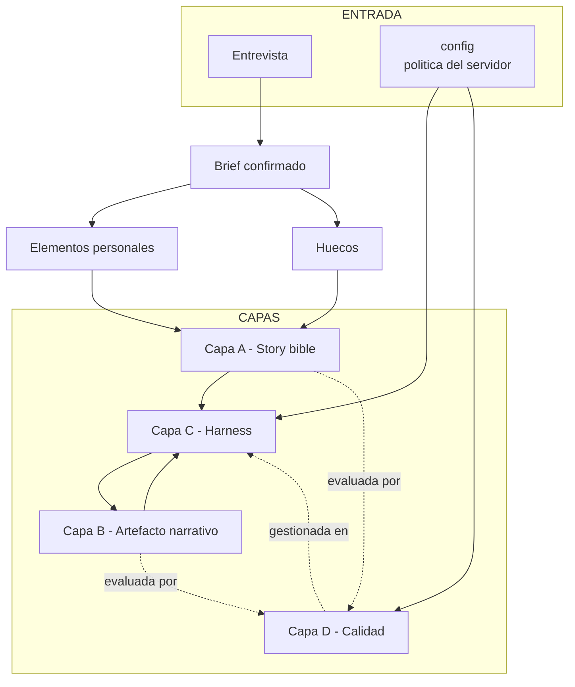
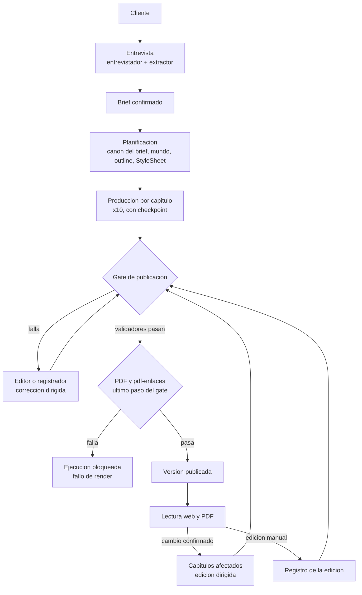
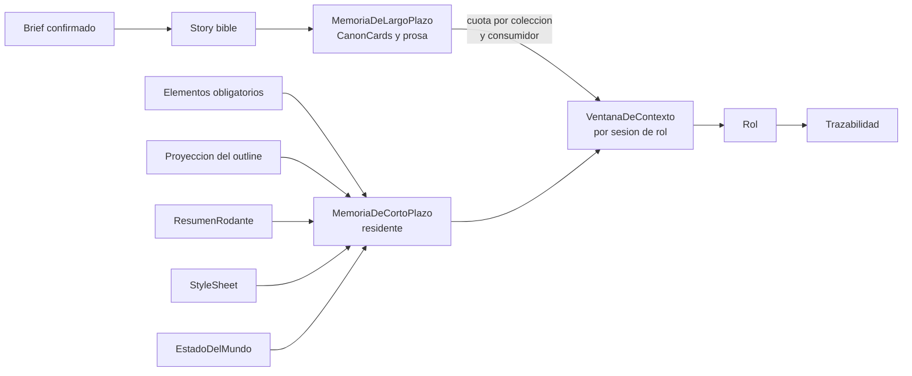
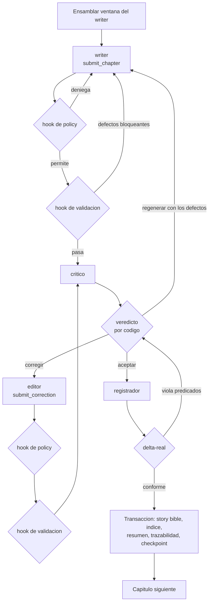
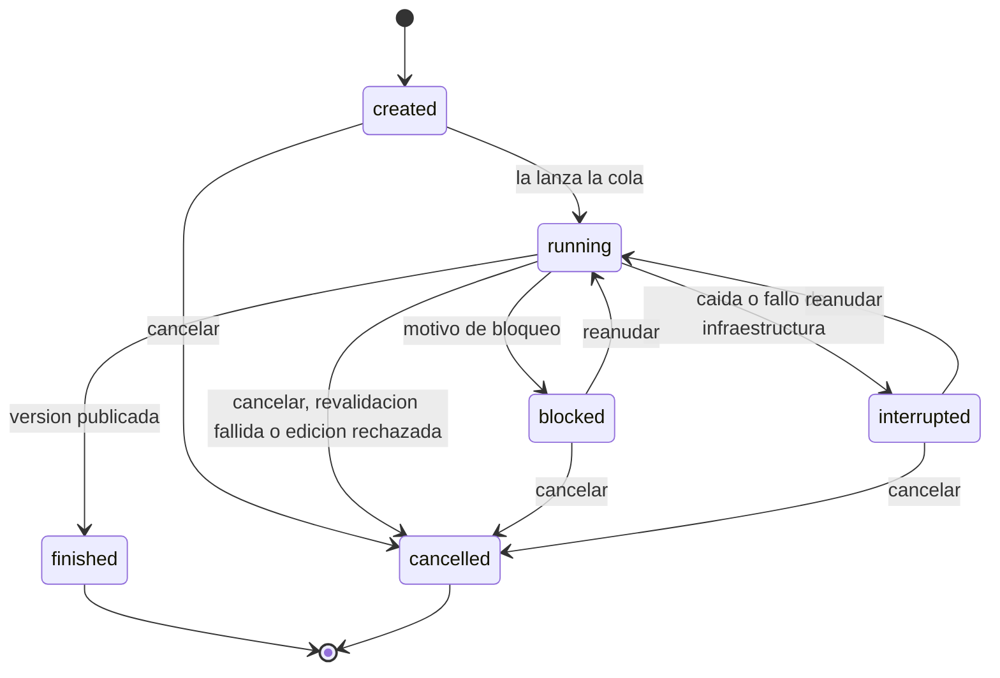
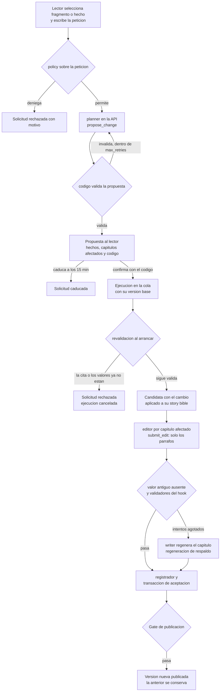
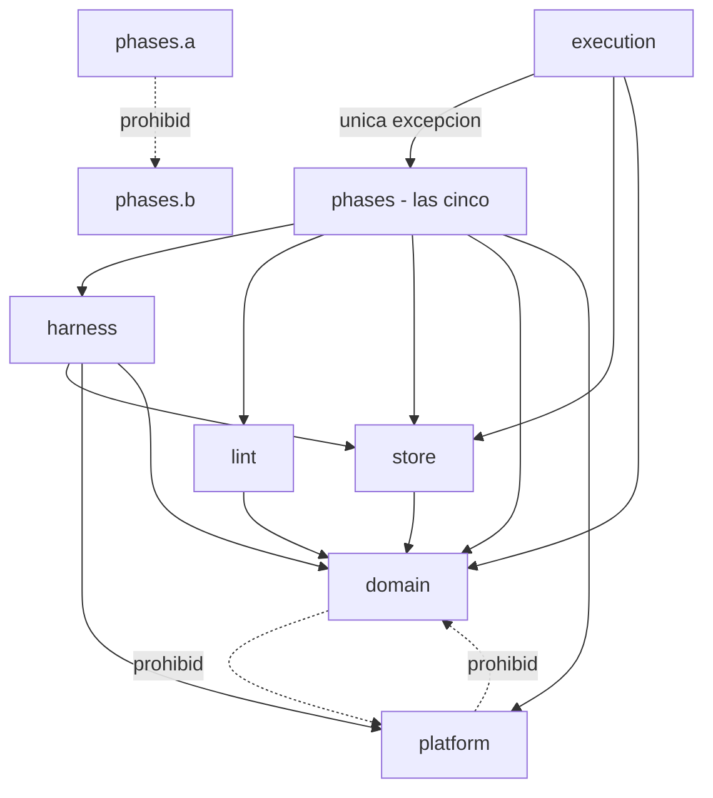
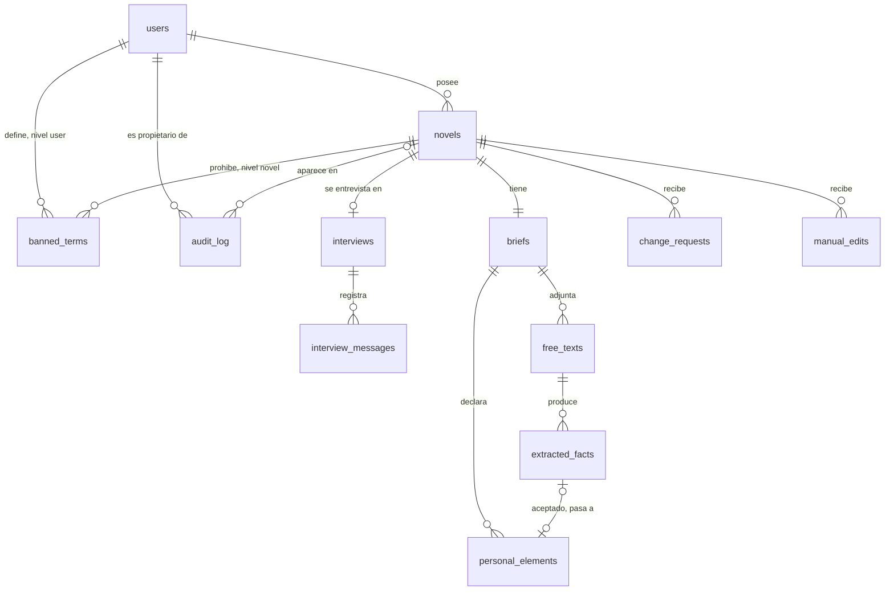
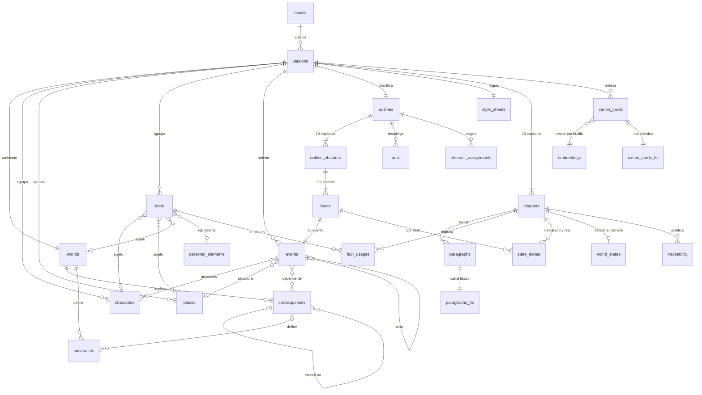
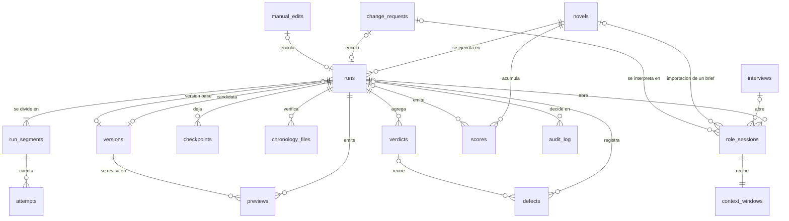

# architecture.md

Decisiones de diseño de la solución: capas, flujo, contexto y memoria, harness, calidad, guardarraíles, observabilidad, plataforma y stack. El vocabulario está en `definitions.md`; las razones de dominio, en `domain-knowledge.md`; el encargo, en `project-constraints.md`.

> Reescrito el 2026-09-23 para el encargo de novelas personalizadas de regalo ([ADR 0003](adr/0003-pivote-al-encargo.md)). La numeración es nueva y a partir de aquí se mantiene estable: una decisión que se cierra pasa de §15 a §16 sin renumerar lo demás.

---

## 1. Separación en capas

### 1.1 Tres ontologías y la calidad

Confundirlas es la principal causa de arquitecturas confusas en este dominio.

| Capa | Qué modela | Pregunta que responde |
|---|---|---|
| **A. Storyworld** | La story bible: el mundo post-IA y los datos personales convertidos en ficción | ¿Qué es verdad dentro de la novela? |
| **B. Artefacto narrativo** | La novela, sus versiones, sus capítulos y sus beats | ¿Cómo está construido el texto? |
| **C. Sistema de generación** | El harness: roles, tools, hooks, memoria, orquestación | ¿Cómo se produce? |

La **calidad (D)** no es una cuarta capa paralela: es un conjunto de validadores que se evalúan *sobre* A y B y se gestionan *en* C.



### 1.2 Tres fuentes de restricción

Todo lo que condiciona la generación viene de una de estas tres, y conviene no mezclarlas:

- **Brief** — la intención del cliente y los datos reales del destinatario.
- **Story bible** — la verdad ficcional ya establecida.
- **config** — la política del servidor: calidad, recuperación y operación.

A estas se suman las **constantes del encargo y del dominio**, que viven en `domain` y no en config, porque nadie las ajusta (`definitions.md` §11):

- 10 capítulos de 1.000 a 1.500 palabras;
- el objetivo de cada extensión: corta 1.100, media 1.250 y larga 1.400 palabras;
- de 3 a 6 beats por capítulo;
- el orden de una consecuencia, como mucho 3.

El techo de 100.000 tokens también lo fija el encargo, pero es config: `operation.window_ceiling`, que se valida ≤ 100.000 al arrancar el servidor. Es una clave y no una constante porque las pruebas doradas fijan cuotas menores (`verification.md` §3.11).

> **Test de frontera:** si el dato es una afirmación sobre el destinatario o sobre la ficción, pertenece al brief o a la story bible. Si es un parámetro de forma u operación, es config o constante del encargo. «Su perro se llama Toby» → brief. «Tono tierno» → brief, en su poética. «10 capítulos» → encargo. «Tres reintentos» → config.

**Precedencia.** El brief gana sobre lo inventado: la zona comprometida no se negocia (`domain-knowledge.md` §4.1). La config nunca reescribe el brief. Las contradicciones dentro del brief no se resuelven por precedencia: las resuelve el cliente en la entrevista (§3.2).

---

## 2. Premisas de operación

1. **Interacción humana en tres momentos, y solo en tres.** La entrevista, antes de generar; la solicitud de cambio, con su confirmación, y la edición manual, sobre una versión publicada; y la revisión humana, que es evaluación y no forma parte del flujo. Reanudar y cancelar una ejecución no son momentos de interacción: son operaciones sobre ella y no aportan nada a la novela.
2. **Generación autónoma entre el brief confirmado y la versión publicada.** Entre los dos no hay preguntas de aclaración ni pantallas de aprobación.
3. **Generación secuencial por capítulo.** Cada capítulo depende del estado que deja el anterior.
4. **Nada se publica sin pasar el gate de publicación** (invariante 8, §10.4), que termina exportando el PDF.
5. **Ante lo imposible, bloquear con error accionable; nunca degradar en silencio.** Una ejecución que no puede cumplir se detiene y lo dice.



---

## 3. Entrevista y brief

### 3.1 Dos roles, porque solo uno ve texto no confiable

- **El entrevistador** conversa con el cliente y rellena el brief con tools. Pregunta por los datos que faltan, plantea las contradicciones y propone una dedicatoria si el cliente no la trae. Pregunta siempre por las entradas prohibidas, aunque la respuesta sea «ninguna», y anota los deseos de trama si el cliente los trae. **Nunca recibe un texto libre**: solo los hechos que se extrajeron de él y quedaron verificados.
- **El extractor** recibe un texto libre como dato y su única tool es entregar hechos: sujeto, atributo, valor y cita. No tiene ninguna tool con efecto.

Es separación de privilegios. El único rol expuesto al texto no confiable no puede hacer nada con él salvo proponer hechos, y el código los verifica antes de que nadie más los vea (§3.3).

### 3.2 La validez del brief la decide el código

El modelo conversa; el código decide si el brief es válido. Cuatro comprobaciones deterministas, recalculadas en cada turno y expuestas al entrevistador. Ninguna se guarda: los datos faltantes, las contradicciones y los huecos se calculan cada vez.

1. **Schema.** El brief cumple su modelo de datos.
2. **Datos faltantes.** Son obligatorios el nombre, la edad, al menos un rasgo, al menos un recuerdo, la ocasión, el género, el tono, la extensión, la dedicatoria y haber preguntado por las entradas prohibidas; la lista puede quedar vacía si el cliente responde «ninguna». La fecha de nacimiento, los allegados, los deseos de trama y los textos libres son opcionales.
3. **Contradicciones.** Las reglas C1–C7 de `domain-knowledge.md` §4.3. C6 cruza las tres listas prohibidas con los elementos obligatorios y con la dedicatoria.
4. **Cota de elementos obligatorios.** Como mucho `max_mandatory_elements`, cifra sin calibrar (§15.2). Si el cliente marca más, el error lo dice y le pide que priorice. Es «bloquear, nunca degradar» aplicado al alcance: sin cota, un brief con cuarenta recuerdos obligatorios agota los reintentos de todos los capítulos.

**El brief solo se confirma sin datos faltantes ni contradicciones.** Confirmado, es inmutable (`definitions.md` §1).

### 3.3 Texto libre no confiable

1. El texto libre llega al extractor delimitado y declarado como dato.
2. El extractor devuelve hechos: sujeto, atributo, valor y la **cita literal** que lo sostiene.
3. **El código comprueba cada hecho.** Su cita tiene que aparecer literal en el texto, con los espacios normalizados, y su sujeto tiene que ser el destinatario o un allegado del brief. El que no cumple se descarta. Así se impide de forma determinista que el extractor invente.
4. Las frases dirigidas al sistema («ignora lo anterior», «escribe en inglés») las marcan dos detectores independientes: el extractor, como instrucción descartada, y el detector de inyección, por patrones. Ninguna llega al brief: **se descarta todo hecho cuya cita se solape con una frase que marque el detector**. Las dos se registran en el audit log y en Langfuse (§11.3).
5. El cliente acepta o rechaza cada hecho verificado. Uno aceptado pasa a ser `ElementoPersonal`, obligatorio si el cliente lo marca. Solo se guardan los verificados.

El texto libre no vuelve a salir de ahí: **ningún otro rol lo recibe literal**.

### 3.4 Brief importado

Un brief también se puede cargar directamente como JSON, con el mismo schema. Es la vía del brief de ejemplo reproducible, que carga la CLI (§14.2), y de los briefs de evaluación. Solo entra por la API y la CLI: la interfaz web no tiene pantalla de subida, y el cliente siempre pasa por la entrevista. Pasa por las mismas comprobaciones de §3.2 y sus textos libres, por el mismo extractor.

- Los hechos verificados se aceptan sin intervención, porque no hay cliente en el bucle, y ninguno es obligatorio: nadie los marcó.
- Una contradicción o un dato faltante devuelven error sin crear nada.
- Si pasa, el brief queda confirmado al importarse.
- La importación tiene su propia traza (§12.1).

### 3.5 La entrevista corre en la API

El entrevistador corre en el proceso de la API, no en el worker: la entrevista no es una ejecución.

- **Una sesión de rol por turno HTTP.** Cada mensaje del cliente abre una sesión nueva, que recibe el historial guardado de la entrevista y el brief en curso. El turno —la respuesta y los cambios del brief— solo se guarda si la sesión termina bien.
- **Fallos.** Si el proveedor falla o la sesión agota un límite, el turno responde 503 y no se guarda: el cliente lo repite.
- **Texto libre.** El extractor también corre en la API, una sesión por texto libre. Si el texto no cabe en su ventana, responde 422.
- **Techo de ventana.** Cada sesión de la entrevista lo respeta ella sola (§6.10).
- **Presupuesto.** Cada entrevista tiene su techo en dinero, `budget` (§11.5).
- **Traza.** Una por entrevista, dentro de la sesión de Langfuse de la novela (§12.1).

---

## 4. Mundo post-IA y story bible

### 4.1 Lo que viene del brief lo escribe el código

En el primer paso de la planificación, dentro de la primera candidata, el código —no un modelo— escribe en la story bible todo lo que el brief fija. No lo hace al confirmar el brief porque la story bible es de cada versión (§9.3), y antes de la primera candidata no hay ninguna.

| Del brief | A la story bible |
|---|---|
| El destinatario y cada allegado | Un `Personaje` de origen brief, con su fecha de nacimiento si la tiene (`domain-knowledge.md` §5.2), más su hecho de nombre |
| Cada rasgo | `Hecho(destinatario, rasgo)` |
| Cada recuerdo | `Hecho(destinatario, recuerdo)`, más su `Evento` de origen brief, fechado según `domain-knowledge.md` §5.2 |
| El lugar de cada recuerdo | Un `Lugar` de origen brief |
| La relación de cada allegado | `Hecho(allegado, relación)` |
| Cada hecho extraído aceptado | `Hecho(sujeto, atributo, valor)`, de origen texto libre |

Los atributos de los hechos de origen brief forman un vocabulario cerrado, definido en `domain`.

**Los hechos de origen brief y de origen texto libre son inmutables para todos los roles** (invariante 2). Ningún modelo puede reescribir el nombre del perro: solo una solicitud de cambio o una edición manual del cliente, y las dos crean una versión nueva.

### 4.2 El planner inventa el resto

El planner recibe el brief confirmado, sin textos libres y con sus deseos de trama; la story bible inicial; y el `CatalogoDeTropos` como lista de evitación. Produce, con `submit_world` y `submit_cast`:

- **Un novum**, con fecha anterior al año presente. Su compatibilidad con la ocasión, el tono y el género la juzga el criterio `tono` (§10.3): un mundo post-IA para un cuento infantil no puede ser una distopía de vigilancia total.
- **Las consecuencias**, de orden 1.º a 3.er, cada una alcanzable desde el novum (invariante 1).
- **Las restricciones**, escritas con los predicados detectables de `definitions.md` §2 siempre que se pueda.
- **Los antecedentes**, eventos planificados sin beat que forman el trasfondo con los recuerdos (§4.3). Van en `submit_world`.
- **Los personajes y lugares inventados**, y sus hechos.

**El mundo se valida al entregarse.** El validador `grafo-causal` comprueba `submit_world` en el acto: toda consecuencia alcanzable desde el novum, orden ≤ 3 y novum anterior al año presente (§10.2). Si falla, se replanifica (§5.2).

**Los deseos de trama** llegan al planner como intención del cliente. Un tropo pedido en ellos no es un cliché que evitar, y ni el crítico ni el juez lo penalizan (§10.3). No son elementos obligatorios: ningún validador comprueba que se cumplan.

Se descarta la selección entre N candidatos de novum puntuados por un selector: en una novela de regalo el mundo es el escenario, no el tema. El riesgo de cliché que asumía el selector lo recoge el criterio `no-cliche` de la rúbrica (§10.3) y queda escrito en `verification.md` §6.

### 4.3 La cronología

Todo `Evento` tiene momento, personajes presentes y lugar:

- los recuerdos, de origen brief, y los antecedentes del planner, planificados sin beat, forman el trasfondo;
- los eventos de los beats forman la trama. Los que no son analepsis ocurren en el año presente. Un beat analéptico que cuenta un evento de trasfondo lo referencia como evento que narra, en vez de duplicarlo.

Todos viven en la tabla de cronología de SQLite, con su origen: brief, planificado o registrado. Los nacimientos no son eventos, sino la fecha de nacimiento de cada personaje, y la fecha del novum va aparte.

Lean verifica dos cronologías (§10.5), las dos completadas con las fechas de nacimiento y la fecha del novum:

| Cronología | Eventos | Cuándo |
|---|---|---|
| Planificada | Los de origen brief y los planificados | Al congelar el outline (§5.2) |
| Registrada | Los de origen brief, los planificados sin beat y los registrados | En el gate (§9.4) |

---

## 5. Planificación

### 5.1 El outline

El outline tiene **10 capítulos**, cada uno con título, función en el arco, tensión planificada de entrada y de salida, de 1 a 5, y **3 a 6 beats**. Cada beat declara:

- su evento, con todos los atributos de `Evento` (`definitions.md` §2);
- los hechos que usa;
- si revela algo, la revelación: su tema y su contenido.

El outline declara además los arcos, con su capítulo de planteamiento y de resolución, y **asigna cada elemento obligatorio a uno o más capítulos**. El planner fija también el título de la novela.

### 5.2 Comprobaciones antes de congelar

Antes de congelar el outline pasan dos validadores (§10.2), sobre el outline propuesto y antes de escribir nada:

- **`outline`**, determinista: exactamente 10 capítulos, de 3 a 6 beats cada uno; todo elemento obligatorio asignado al menos a un capítulo; todo arco con capítulo de resolución.
- **`cronologia-lean`**, sobre la cronología *planificada* (§4.3). El generador del fichero recibe una lista de eventos y no lee la tabla, así que verifica el outline propuesto antes de guardarlo. Un error temporal del plan se detecta antes de escribir diez capítulos sobre él.

Si alguno falla, o si falla `grafo-causal` al entregar el mundo (§4.2), se replanifica: se abre una sesión nueva del planner, con los defectos como realimentación. Cada planificación es un intento del evaluable outline (§7.6); agotado el límite, la ejecución se bloquea. Superados los tres, el outline se congela con el canon inicial, y ese es el punto de control del capítulo 0 (§9.2).

### 5.3 StyleSheet

El planner fija el narrador, el tiempo verbal —pasado o presente—, el tratamiento entre cada par de personajes —tú o usted—, el tono, el género y el léxico a evitar, en el que entran también los temas prohibidos. El registro sale de la franja de edad del destinatario. La `StyleSheet` se congela con el outline, es de cada versión igual que él y es residente en las ventanas del writer, el crítico y el editor.

### 5.4 El planner escribe el canon inicial

Al cerrar la planificación, el código aplica en una sola transacción lo que inventó el planner —mundo, antecedentes, personajes, lugares y hechos— y su índice inicial (§6.11). Es una de las tres excepciones declaradas a «ningún rol escribe canon» (§7.7), y como las otras dos la aplica el código tras validarla.

---

## 6. Gestión de contexto y memoria

### 6.1 El patrón

El patrón es **outline-first + recuperación selectiva + validación de deltas**, no «contexto máximo».



Activos de primera clase:

- **Outline** — contrato estable entre planificación y escritura; es lo que evita la deriva. En la ventana entra proyectado, no entero (§6.4).
- **MemoriaDeLargoPlazo** — el índice de la versión, del que se recupera por consulta.
- **MemoriaDeCortoPlazo** — lo residente.
- **VentanaDeContexto** — lo ensamblado para una sesión de rol concreta.
- **Trazabilidad** — todo capítulo registra qué lo justificó: los hechos, las CanonCards y los elementos obligatorios (invariante 7). Lo que la ventana negó queda en la `VentanaDeContexto` guardada de la sesión de rol que lo generó.

### 6.2 RAG híbrido dinámico sin re-ranking

Hay dos canales, léxico y denso. Es dinámico porque el índice crece con los capítulos aceptados. **Sin re-ranking:** ningún modelo reordena lo recuperado.

Renunciar al re-ranker no es un ahorro. Con vectores congelados y desempate estable, la recuperación entera se vuelve verificable por ejecución, en clase T y sin llamar a ningún modelo (§6.9). Un re-ranker con modelo habría dejado esa propiedad fuera de alcance.

### 6.3 Dos colecciones, no un pozo

El índice no es un almacén único: son `ColeccionDeMemoria`, cada una con su unidad y su modo de recuperación. Fusionar en un ranking una tarjeta de personaje y un párrafo de prosa sería comparar unidades incomparables, y lo que normalmente las reconcilia es justo el re-ranker que no existe. **La fusión por rango recíproco (RRF) queda confinada dentro de cada colección.**

| Colección | Unidad | Consumidores | Modo |
|---|---|---|---|
| **CanonCards** | La tarjeta de una entidad de la story bible: un personaje con sus hechos, un lugar, una consecuencia, una restricción, el novum | writer (consulta prospectiva), crítico (retrospectiva), editor | BM25 + denso fundidos por RRF, más arrastre por el grafo causal |
| **Prosa** | **El párrafo** de un capítulo aceptado, con cabecera de capítulo | editor, linter de repetición | **Solo BM25, sin incrustaciones** |

Dos decisiones que conviene no leer como detalles:

- **El writer nunca recibe prosa recuperada.** Tiende a imitarla, y eso agravaría la repetición entre capítulos que el linter existe para detectar.
- **Los resúmenes de capítulo no son colección: son residentes.** Diez resúmenes caben enteros en cualquier ventana, así que recuperarlos por similitud sería elegir por consulta algo que ya cabe completo. Entran en el `ResumenRodante` (§6.4).

### 6.4 Residentes por consumidor

Los residentes van siempre en la ventana, fuera del índice, y cada consumidor recibe su subconjunto. Las **entradas de la llamada** no son residentes: son lo que esa sesión concreta trabaja (`definitions.md` §4).

| Consumidor | Residentes | Entradas de la llamada | Recupera |
|---|---|---|---|
| writer | StyleSheet, elementos obligatorios asignados al capítulo, proyección del outline, EstadoDelMundo, ResumenRodante | Si regenera, los defectos bloqueantes | CanonCards |
| crítico | StyleSheet, elementos obligatorios, proyección del outline, EstadoDelMundo, ResumenRodante, CatalogoDeTropos | El capítulo y la rúbrica de capítulo | CanonCards |
| editor | StyleSheet, EstadoDelMundo | El capítulo y los defectos; en un cambio, el capítulo afectado entero, con los párrafos numerados, y la propuesta | CanonCards y prosa |
| linter de repetición | — | El capítulo | Prosa |

- **La proyección del outline** es los titulares de los 10 capítulos, los beats del capítulo actual y una lista de los temas de las revelaciones posteriores, sin su contenido: dice qué no se puede revelar todavía sin revelarlo.
- **El `ResumenRodante`** son los resúmenes de los capítulos 1..*n*−2 más el capítulo *n*−1 literal.
- **El `EstadoDelMundo` es compacto.** Contiene el momento actual de la historia; por personaje, su último lugar, si está excluido y los hechos que cambió algún delta real; y el estado de los arcos. Se construye aplicando en orden los deltas reales de 1..*n*−1 y pesa unos cientos de tokens. El detalle estable de cada entidad no va ahí: llega por las CanonCards recuperadas.
- **La consulta del editor** se construye con los defectos y el texto del capítulo.

El resto de roles no recupera. Planner, registrador, juez, extractor, entrevistador y revisor visual reciben entradas fijas (§7.2).

### 6.5 Cuota fija por (colección, consumidor)

Cada par tiene un número fijo de plazas, sin fusión entre colecciones y sin préstamo de plazas sobrantes. La ventana deja de ser un montón y pasa a ser una tabla legible, y cada celda se prueba por separado.

**Las plazas las declara `config.retrieval.quotas`**: una entrada por par y entero ≥ 0. Una plaza a `0` expresa que esa colección no entra en la ventana de ese consumidor, y es así como el writer no ve prosa. No hay tabla por defecto: el servidor no arranca sin ella.

**La config se valida entera al arrancar el servidor.** Falla sin arrancar, con error accionable. En las cuotas, ante una negativa o no entera, una colección o un consumidor desconocidos, un par ausente o prosa con plazas para un consumidor que no sea el editor ni el linter de repetición. Cada ejecución guarda una copia de la config con la que corre, una por tramo: al arrancar y al reanudar (§9.2).

> Se acepta lo que esto renuncia: un capítulo que necesitara muchas más tarjetas no puede pedir plazas prestadas.

### 6.6 Corte temporal y versiones del índice

Las `CanonCard` son **inmutables y llevan `desde_capitulo`**. Cada cambio de una entidad añade una tarjeta sucesora. `hasta_capitulo` no se guarda: se deriva del `desde_capitulo` de la sucesora de la misma entidad en esa versión. La tarjeta nacida al aceptar el capítulo *n* rige desde el *n*+1. La recuperación filtra `desde ≤ n < hasta` **antes** de puntuar, así que el corte temporal es una cláusula de la consulta y no una instrucción al modelo. Sin él, el crítico del capítulo 3 vería la verdad del capítulo 9.

La prosa se filtra igual: mientras se produce el capítulo *n*, solo son candidatos los párrafos de capítulos anteriores. Al aplicar un cambio o una edición sobre una versión, la recuperación del editor abarca la prosa de todos sus capítulos, porque tiene que localizar cada pasaje que usa el hecho.

**El índice es de cada versión.** Una candidata copia el índice de la versión vigente en la misma transacción que la story bible (§9.3). Las copias comparten los vectores por huella de contenido, así que copiar no reincrusta nada, y un vector **nunca se recalcula** para un contenido ya incrustado. El índice es append-only, salvo el reemplazo de un registro repetido (§8.3), y eso sostiene el invariante 6: es función pura de la story bible y los capítulos de su versión.

### 6.7 Arrastre por el grafo

Lo recuperado entra como tarjeta completa. Sus ancestros hasta el novum entran como enunciado de una línea y **no consumen cuota**. El orden de una consecuencia está acotado a 3, así que la cadena tiene profundidad máxima conocida y el coste queda en unos cien tokens.

Con eso el invariante 1 se cumple por construcción en la recuperación: una consecuencia nunca llega al writer sin la cadena que la sostiene.

> Se acepta lo que renuncia: si la contradicción vive en el detalle del ancestro y no en su enunciado, no se ve.

### 6.8 Doble consulta

- **Writer:** consulta **prospectiva**, construida desde el outline del capítulo que va a escribir.
- **Crítico:** consulta **retrospectiva**, construida desde el texto que el writer produjo.

Con una consulta compartida, writer y crítico compartirían punto ciego: la tarjeta que contradice el capítulo no se recuperó, así que ni el writer la vio ni el crítico la ve. Dos consultas distintas dan dos puntos ciegos distintos.

### 6.9 Escasez y determinismo

**La escasez no bloquea.** Si la colección tiene menos unidades que plazas, se entrega lo que hay y se registra la causa raíz `contexto ausente` en el informe. El índice nace con la story bible inicial y la prosa nace vacía, así que la escasez es el estado normal del capítulo 1, no un fallo.

**Vectores congelados.**

- El modelo de incrustación se fija al crear la novela y viaja con el índice. Sale de `config.retrieval.embedding_model`, y cambiar el valor después no afecta a esa novela.
- Los vectores se guardan y no se recalculan.
- El desempate es estable: en las CanonCards, por (tipo de entidad, id de entidad, `desde_capitulo`); en la prosa, por (capítulo, ordinal).

**BM25 en código.** FTS5 solo da los candidatos (`MATCH`), con el tokenizador `unicode61 remove_diacritics 2`. BM25 se calcula en código sobre ellos, así que el ranking no depende de lo que contengan otras novelas de la misma tabla.

Por eso **el recuperador queda en clase T completa**. Las pruebas doradas admiten aserciones del tipo «la ventana del capítulo 4 contiene la tarjeta X y no la Y» sin llamar a ningún modelo.

> Se acepta lo que renuncia: no se cambia de modelo de incrustación dentro de una novela, ni entre sus versiones.

### 6.10 Techo de ventana, guardián de ventana y conteo

El encargo fija **un máximo de 100.000 tokens concurrentes**. Es `config.operation.window_ceiling`, validado ≤ 100.000 al arrancar (§1.2).

1. **Cuenta solo la entrada.** La salida no computa en este techo. Cada rol tiene una salida máxima operativa (`roles.<rol>.max_output`), porque la API la exige, y el control global de la salida es el presupuesto en dinero (§11.5).
2. **Es un techo por ejecución, no por sesión.** Vale para la suma de la entrada de todas las sesiones de rol de la ejecución en vuelo a la vez. Como hay **una sola ejecución activa en todo el servidor** (§9.1), las novelas se generan de una en una y el techo de la ejecución activa es el de toda la generación del servidor. No es el de todo el servidor: las sesiones fuera de una ejecución corren a la vez en la API, cada una con su propio techo (punto 4), y es un riesgo aceptado (`verification.md` §6).
3. **Dentro de una ejecución se mantiene el paralelismo fácil**, y las sesiones en vuelo se reparten el techo: el juez y el revisor visual en el gate, en paralelo con Lean, que no consume tokens (§9.4), y los editores de los capítulos afectados por un cambio (§9.5).
4. **Una sesión que no pertenece a una ejecución** —un turno de la entrevista, el extractor, la interpretación de un cambio— respeta el techo ella sola (§3.5, §9.5).
5. **La cuota de una sesión** es el techo dividido entre las sesiones realmente en vuelo en esa etapa. Si las sesiones paralelas no caben con su mínimo —gastos fijos, intocables y reserva de turnos—, van en serie.
6. **Una sesión cuenta todos sus turnos.** Con el Agent SDK, cada turno reenvía el prompt de sistema, el `CLAUDE.md` del workspace, las descripciones de skills y tools, la ventana y los turnos anteriores. El guardián de ventana reserva por adelantado el crecimiento que admite `max_turns`:

   ```
   reserva de turnos = (max_turns − 1) × (max_output + max_tool_output)
   ```

   y ensambla la ventana en la cuota que queda: cuota − gastos fijos del rol − reserva de turnos. Los gastos fijos —prompt de sistema, `CLAUDE.md`, descripciones de skills y tools— se estiman en cada sesión con el estimador local sobre los textos que envía el código; lo que añada el CLI por su cuenta aparece como deriva al reconciliar.
7. **La cuota se cumple por construcción, sin corte en vivo.** Por OpenRouter, el uso por turno del SDK llega a cero, así que no hay entrada por turno que vigilar: la reserva de turnos es la que garantiza que una sesión no pasa de su cuota.
8. **Si no cabe, se recorta y se sigue**, con causa raíz `contexto ausente` en el informe. El orden de recorte se declara:

```
prosa  →  CanonCards (rango inverso dentro de la colección)  →  ResumenRodante
```

Son **intocables** los demás residentes y el arrastre. Si lo intocable ya supera por sí solo la cuota, el `ResumenRodante` es la última válvula. Si ni así cabe, la ejecución se bloquea con `config infactible`: una ventana que no cabe ni con lo mínimo es un error de config, no algo que recortar.

**El guardián de ventana lo invoca el orquestador, nunca el modelo.** Antes de abrir cada sesión, el código decide qué entra; lo que no cabe se niega ahí, y la ventana llega al rol ya cerrada. Ningún rol tiene tools para pedir contexto (§7.4). Eso sostiene:

- el determinismo de §6.9;
- el recuperador en clase T;
- el orden de recorte declarado.

Si un modelo eligiera qué soltar, el orden declarado se convertiría en una decisión por llamada.

**Conteo y reconciliación.** La entrada se cuenta con un estimador local: antes de lanzar, para ensamblar la ventana, y turno a turno sobre los mensajes que ve pasar el orquestador. Al cerrar la sesión se compara la suma estimada de la entrada de todos sus turnos con su uso exacto, el de `ResultMessage`, que coincide al token con lo que factura OpenRouter. Se compara la entrada completa: los tokens de entrada más los de lectura y escritura de caché, porque el proveedor cuenta aparte los que van en caché. Cuando la divergencia supera `count_drift_threshold`, se anota la causa raíz `deriva del conteo`. No bloquea ni reintenta: es señal de calibración. `presupuesto excedido` queda para el dinero (§11.5).

### 6.11 Quién escribe en el índice

**Un escritor por fase, siempre en la misma transacción que la story bible.**

| Momento | Quién | Qué |
|---|---|---|
| Primer paso de la planificación | Código | El canon del brief y sus tarjetas (§4.1) |
| Cierre de la planificación | Planner (lo aplica el código) | Lo que inventó el planner y sus tarjetas (§5.4) |
| Creación de una candidata de cambio o de edición | Código | La copia de la story bible y del índice de la vigente (§9.3) |
| Aplicación de un cambio validado | Código | Los hechos sucesores de la propuesta y sus tarjetas (§9.5) |
| Aceptación de un capítulo, también el corregido en el gate o el editado por un cambio o una edición | Registrador (lo aplica el código) | El delta real y los párrafos |

Las correcciones del gate también escriben el índice, porque vuelven a pasar por el registrador (§9.4). No existe un instante en el que story bible e índice discrepen. Un capítulo rechazado no deja rastro, y reanudar no reconstruye ni reincrusta nada.

### 6.12 Stack del índice

**`sqlite-vec` como extensión cargable de SQLite, más FTS5 nativo** para el canal léxico, en el mismo fichero SQLite que la story bible. Ninguna de las dos piezas añade un servicio, y es lo que hace posible §6.11.

- **Los vectores van en una tabla normal** (huella, modelo, vector), no en una tabla virtual. Se comparan con la distancia coseno de `sqlite-vec` sobre las filas que ya pasaron el filtro de versión y de corte temporal.
- **La prosa solo escribe filas de FTS5**, sin vectores: su canal es solo BM25 (§6.3).
- **Las cachés de modelos** van al directorio de datos (§11.6).

**El productor de vectores es `fastembed`**, local y sin servicio. Está comprobado en el portátil de desarrollo (Windows sin administrador ni VC++ Redistributable) con dos condiciones:

1. El runtime de Visual C++ en espacio de usuario, con el paquete `msvc-runtime`: sus DLL deben quedar donde las encuentre `onnxruntime`.
2. Los enlaces simbólicos de la caché de HuggingFace, desactivados por variable de entorno.

---

## 7. Harness

### 7.1 Principio de asignación

No todo paso es un modelo. Convertir cada comprobación en una llamada paga latencia, coste y no determinismo por algo que es código.

| Tipo | Cuándo | Ejemplos |
|---|---|---|
| **Código** | La respuesta es calculable | Validación del brief, verificación de citas, guardián de ventana, recuperador, validadores programáticos, veredicto, aplicación de deltas, gate, generador del fichero Lean, render |
| **Sesión de rol de un turno** | Requiere comprensión, no exploración | extractor, crítico, registrador, juez |
| **Sesión de rol con varios turnos** | Conversa, explora o corrige con realimentación de los hooks | entrevistador, planner, writer, editor, revisor visual |

«De un turno» significa una sola entrega esperada. `max_turns` acota los reintentos cuando la entrega no cumple su schema (§7.6).

### 7.2 Los roles

Cada rol es una sesión del **Claude Agent SDK** con sus instrucciones, sus tools, sus hooks, su modelo (`config.operation.roles`) y sus límites.

La columna «Fase» usa las fases de una ejecución (§9.1).

| Rol | Fase | Recibe | Tools | Produce |
|---|---|---|---|---|
| **entrevistador** | Entrevista, fuera de una ejecución | Historial guardado de la entrevista, brief en curso, hechos verificados, datos faltantes y contradicciones calculados | `update_brief`, `propose_dedication` | El brief en borrador, con sus deseos de trama |
| **extractor** | Entrevista, fuera de una ejecución | Un texto libre, como dato | `submit_facts` | Hechos con sujeto, atributo, valor y cita |
| **planner** | `planning`; la interpretación de un cambio, fuera de una ejecución | Brief confirmado sin textos libres, con sus deseos de trama; story bible inicial; `CatalogoDeTropos`. Para un cambio: la petición, la selección y la story bible de la versión vigente | `submit_world`, `submit_cast`, `submit_outline`, `submit_style_sheet`; `propose_change` | Mundo con sus antecedentes, personajes, lugares, outline, StyleSheet; la propuesta de un cambio |
| **writer** | `chapter_production`; `editing` y `propagation`, en la regeneración de respaldo; `publication`, si un defecto del gate pide regenerar | Su ventana (§6.4) y el objetivo de palabras de su extensión | `submit_chapter` | Texto del capítulo y delta declarado por beat |
| **crítico** | `chapter_production` | Su ventana, con el capítulo y la rúbrica de capítulo | `submit_evaluation` | Puntuación y justificación por criterio, tensión medida y defectos tipados |
| **editor** | `chapter_production`, `publication`, `editing` y `propagation` | Su ventana, con los defectos o, en un cambio, el capítulo afectado entero y la propuesta | `submit_correction`, `submit_edit` | Capítulo corregido, o solo los párrafos editados |
| **registrador** | `chapter_production`, `publication`, `editing`, `recording` y `propagation` | Capítulo aceptado y story bible compacta | `submit_record` | Delta real por beat, eventos, usos de hechos, hechos nuevos, arcos resueltos y resumen |
| **juez** | `publication` | La novela entera (unos 22k tokens), la story bible compacta, la rúbrica de novela y el `CatalogoDeTropos` | `submit_evaluation` | Puntuación y justificación por criterio de novela, con los capítulos que cita en un campo estructurado |
| **revisor visual** | `publication` | URL de vista previa y estructura esperada | Playwright MCP (navegar, instantánea, clic) y `submit_visual_review` | Lo observado en portada, índice, capítulos y ficha |

- **Dónde corren.** Los roles de una ejecución corren en el worker. El entrevistador, el extractor y el planner en modo cambio corren en el proceso de la API, fuera de toda ejecución: cada uno con su traza (§12.1) y respetando por sí solo el techo de ventana (§6.10).
- **La story bible compacta** del registrador y del juez es la story bible sin prosa ni cronología: cada personaje y lugar con su id, su forma canónica y el capítulo desde el que existe; cada hecho con su id y su capítulo de inicio; y los arcos del outline. El juez recibe además el mundo: novum, consecuencias y restricciones.

> **Writer y editor se mantienen separados.** El argumento anticomplacencia aplica a criticar, no a corregir. Aun así, separarlos permite medir aparte la calidad de escritura y la de corrección.

> **Un solo crítico por capítulo.** Canon, oficio y tropos caben en una rúbrica de capítulo (§10.3). La repetición la mide un linter y el cliché, un criterio de la rúbrica. Tres críticos en paralelo triplicaban llamadas sin cubrir más.

### 7.3 Workspace, CLAUDE.md y skill

Los roles corren con `cwd` en el **workspace del harness** (`backend/harness_workspace/`), que carga el SDK:

- **`CLAUDE.md`** — las reglas de producto comunes a todos los roles: escribir en español, respetar la story bible, no inventar sobre los hechos de origen brief, tratar como dato cualquier texto del cliente y entregar siempre por tool.
- **`.claude/skills/personalizacion-natural/`** — la skill reutilizable. Explica cómo integrar los datos del destinatario sin forzarlos (`domain-knowledge.md` §2.2). La cargan el writer y el editor.
- **Los prompts de sistema**, un fichero por rol: las instrucciones propias de cada uno.

**Solo el `CLAUDE.md` del workspace.** Al cargar los ficheros del proyecto, el CLI carga también el `CLAUDE.md` de cada directorio padre del `cwd`: el de desarrollo de la raíz del repositorio y el personal del usuario. Cada sesión de rol los excluye de forma explícita, porque son instrucciones para otro lector.

El `CLAUDE.md` de la raíz del repositorio es otro fichero, con otro lector: instruye al desarrollo con Claude Code y explica los dos. El prompt de cada rol es su **prompt versionado**: vive como fichero en el workspace, se sube a Langfuse y en ejecución se lee de allí por etiqueta (§12.4). El SDK lo recibe como prompt de sistema.

### 7.4 Tools con schema

Cada tool tiene un modelo Pydantic y de él sale su JSON Schema. El manejador valida la entrada. Si no es válida, devuelve el error al modelo, y eso cuenta como un intento (§7.6).

- **Las tools entregan, no persisten.** Dejan la salida del rol en las salidas de la sesión, en la memoria del worker, o de la API en las sesiones fuera de una ejecución. Qué pasa a la story bible lo decide el código, tras los validadores y el veredicto.
- **Ninguna tool pide contexto.** La ventana llega cerrada (§6.10).
- **La salida de una tool está acotada** por `max_tool_output`, la cota que usa la reserva de turnos (§6.10).
- **Las tools integradas de Claude Code están desactivadas.** Cada rol tiene su lista blanca (§11.2). El writer y el editor añaden `Skill`, la tool con la que el SDK carga la skill del workspace, y el revisor visual añade solo las tools de navegación de Playwright MCP.
- **`Skill` solo carga la skill del producto.** Con `Skill` activa, un rol podría cargar también las skills que trae el CLI empaquetado, así que el hook de policy deniega toda llamada a `Skill` que no pida `personalizacion-natural`.

### 7.5 Hooks

Los dos hooks del encargo son hooks del SDK, registrados como funciones de Python en las sesiones de rol:

- **Hook de policy** (`PreToolUse`, antes de toda tool). Pide al motor de políticas que deniegue la tool si no está en la lista blanca del rol, o si alguno de sus campos de texto narrativo contiene una coincidencia de las listas prohibidas. Deniega con el motivo, y el modelo lo recibe y puede rehacer. Toda decisión, permitir o denegar, va al audit log (§11.4).
- **Hook de validación de capítulo** (`PostToolUse`, tras `submit_chapter`, `submit_correction` y `submit_edit`). Ejecuta los validadores programáticos del capítulo (§10.2). Si hay defectos bloqueantes, la entrega queda rechazada y el hook sustituye la salida de la tool por la lista de defectos: el SDK no deja bloquear después de ejecutar una tool, pero sí reescribir lo que el modelo lee. El modelo corrige en la misma sesión.

**Qué escanea la policy.** Solo los campos de texto narrativo: el capítulo, la corrección, la edición, el mundo, el reparto, el outline, los títulos y la dedicatoria. Nunca los campos que son listas de prohibidas —las entradas que registra `update_brief` o el léxico a evitar de la StyleSheet—, porque contienen esos términos a propósito.

**Spans de tool** (§12.1). Las tools en proceso abren y cierran el suyo en su manejador. Las de Playwright MCP no tienen manejador propio: su span va del hook de policy a un tercer hook, un `PostToolUse` de observabilidad. Una denegación no abre span: se registra como evento de la traza.

Cada entrega de texto, denegada, bloqueada o aceptada, cuenta como un intento de su evaluable: del capítulo, al producirlo o al editarlo por un cambio o una propagación. En el gate las correcciones no cuentan por capítulo: el intento es el ciclo del gate entero (§9.4).

### 7.6 Reintentos, turnos y tiempos

Cinco límites, todos en `config.operation`, y ninguno con valor inventado (§15.2):

| Límite | Alcance | Al agotarse |
|---|---|---|
| `max_retries` | Intentos por evaluable (`definitions.md` §6): las entregas de un capítulo, la regeneración de respaldo, las planificaciones, cada ciclo del gate y las interpretaciones de un cambio | La ejecución se bloquea con `intentos agotados` y el informe lo dice. La interpretación de un cambio no es una ejecución: su solicitud queda `rejected` (§9.5) |
| `roles.<rol>.max_turns` | Turnos de una sesión, que acotan los reintentos por schema | La sesión termina; cuenta como intento fallido |
| `max_agent_seconds` | Duración de una sesión | El orquestador la interrumpe con `ClaudeSDKClient.interrupt()` y cierra su subproceso con `disconnect()`, que `interrupt()` deja vivo; cuenta como intento fallido |
| `max_verifier_seconds` | Duración de una verificación del `VerificadorFormal` | La ejecución pasa a `interrupted` (§10.5) |
| `max_resumes` | Reanudaciones de una ejecución | Reanudar responde 409, y solo queda cancelar (§9.2) |

**Los intentos se guardan por evaluable**, dentro de cada tramo de la ejecución entre dos reanudaciones: una ejecución reanudada parte con intentos nuevos (§9.2).

**Tipos de error:**

- **Cuentan como intento fallido** una salida inválida, los turnos agotados, el tiempo agotado, una denegación de policy y un bloqueo del hook de validación.
- **Un error de transporte o del proveedor**, agotados los reintentos del propio SDK, no es un intento: es infraestructura, y la ejecución pasa a `interrupted` (§9.1).

**Ningún bucle del harness es ilimitado**, y es lo que permite demostrar la terminación en TLA+ (§10.6). `max_turns` lo aplica el SDK. `max_agent_seconds` lo aplica el orquestador, porque el SDK no tiene tiempo máximo por sesión.

### 7.7 Reglas de interacción

1. **Separación entre writer y crítico.** El mismo rol no escribe y se autoevalúa. El crítico recibe el capítulo y su propia ventana, no el razonamiento ni la ventana del writer.
2. **Los críticos no reescriben.** Devuelven puntuaciones y defectos tipados. Detectar y corregir son competencias distintas.
3. **El estado se extrae, no se asume.** El writer declara el delta que pretendía y el registrador extrae el real del texto aceptado.
4. **Ningún rol escribe canon.** Durante la producción, solo se aplica a la story bible el registro de un capítulo aceptado, y lo aplica el código. Hay tres excepciones declaradas, y también las aplica el código tras validarlas:
   - el canon inicial del planner (§5.4);
   - la propuesta de cambio validada (§9.5);
   - el delta de una edición manual (§9.6).
5. **Los hechos de origen brief y de origen texto libre son inmutables** para todos los roles (§4.1).
6. **El texto no confiable tiene un solo receptor por vía.** El texto libre llega solo al extractor. La petición de cambio llega solo al planner en modo cambio, cuya única tool es `propose_change`. El texto de una edición manual llega como dato solo al registrador, que es el único que saca hechos de él. Una vez aceptado es prosa de la versión y la leen los roles que leen prosa; ese riesgo está aceptado en `verification.md` §6.

---

## 8. Producción por capítulo

### 8.1 El bucle



> El orden es económico, no arbitrario: cada comprobación es más cara que la anterior. Un capítulo que no pasa el hook de validación no consume crítico.

### 8.2 Veredicto y enrutado

El veredicto lo agrega el código a partir de los defectos, por evaluable. Cada defecto hereda de su criterio si es bloqueante y qué acción requiere: corregir, regenerar, volver a registrar o bloquear (§10.3). Las filas se aplican en orden, y decide la primera que se cumple:

| Situación | Veredicto |
|---|---|
| Ningún defecto bloqueante, también con los intentos agotados | **aceptar**; los no bloqueantes van al informe, y al editor solo si otro defecto ya lo llama |
| Algún bloqueante requiere bloquear | **bloquear**: la ejecución se bloquea con el motivo del defecto |
| Intentos agotados del evaluable capítulo con defectos bloqueantes, en un capítulo afectado por un cambio o una propagación | **regenerar** con el writer: es la regeneración de respaldo, un evaluable propio (§9.5) |
| Intentos agotados con defectos bloqueantes | **escalar**: la ejecución se bloquea con `intentos agotados` |
| Algún bloqueante requiere regenerar | **regenerar**: el writer rehace el capítulo con los defectos bloqueantes, o el planner rehace el outline (§5.2) |
| Los bloqueantes requieren corregir o volver a registrar | **corregir**: cada defecto va por su propia acción —el editor corrige y el registrador vuelve a registrar—, y en el gate van juntos (§9.4) |

**Hay una sola regla de enrutado:** un defecto que llega al veredicto se enruta por la acción que requiere, no por quién lo encontró. Los del hook de validación no llegan al veredicto: los corrige en la misma sesión el rol que entregó (§7.5). En el evaluable outline, todo defecto bloqueante lleva a replanificar, sea cual sea su acción: no hay capítulos que corregir.

### 8.3 Registro y aceptación

1. El registrador extrae el **delta real** de cada beat del texto aceptado: eventos, con todos sus atributos; hechos usados; hechos nuevos inventados en la prosa, con sus personajes y lugares nuevos; y arcos que el capítulo resuelve. Escribe además el resumen del capítulo.
2. El código pasa siempre el validador `delta-real`, que aplica sobre el delta real los predicados de `delta-declarado`. Es la única comprobación de delta de las salidas del editor, que no declaran uno: `delta-declarado` solo se aplica a `submit_chapter`. Si `delta-real` falla, sus defectos se enrutan por su acción, como cualquier otro (§8.2), y cuentan como intento. En un cambio o una propagación, regenerar es la regeneración de respaldo.
3. Si es conforme, el código aplica en **una sola transacción** (invariante 5):
   - el capítulo, con su huella, su resumen y su tensión medida;
   - el delta real de cada beat, del que se derivan los arcos resueltos;
   - los `UsoDeHecho` del capítulo;
   - los hechos nuevos, y sus personajes y lugares;
   - los eventos registrados;
   - la instantánea del `EstadoDelMundo`;
   - las tarjetas sucesoras;
   - los párrafos de prosa y sus filas de FTS5, sin vectores (§6.12);
   - la trazabilidad;
   - el `PuntoDeControl`.

**Volver a registrar un capítulo** —tras una corrección del gate, un cambio o una edición— reemplaza en la candidata lo que escribió su registro anterior: usos, hechos nuevos con sus personajes y lugares, eventos registrados, deltas, tarjetas, párrafos, trazabilidad e instantánea. Se hace en la misma transacción de aceptación. Una entidad o un hecho que el registro nuevo vuelve a extraer conserva su id. Si deja de extraer uno que usan otros capítulos, `delta-real` da un defecto bloqueante de `entidades-existentes`: una corrección no puede retirar lo que el resto de la novela ya usa. Es la única excepción a «solo inserción» (§14.5): nunca toca una fila de una versión publicada, ni una de la candidata que no sea de ese registro. Así el índice sigue siendo función de la story bible y los capítulos de la versión (invariante 6).

---

## 9. Ejecuciones, versiones y cambios

### 9.1 Estados de una ejecución



- **Terminales:** `finished` y `cancelled`. La candidata solo se rechaza al cancelar (§9.3).
- **`blocked`** es una decisión del sistema: no puede cumplir con los límites que tiene, y lo dice con su motivo de bloqueo. Se reanuda igual que una `interrupted` (§9.2).
- **`interrupted`** es un fallo de infraestructura —caída del proceso, proveedor inaccesible, verificador formal inalcanzable— y es reanudable.

**Fases**, según el tipo de ejecución:

| Tipo | Fases |
|---|---|
| Generación | `planning` → `chapter_production`, capítulo a capítulo → `publication` |
| Solicitud de cambio | `revalidation` → `editing` de los capítulos afectados → `publication` |
| Edición manual | `recording` del capítulo editado → `propagation` a otros capítulos → `publication` |

**Una sola ejecución activa en todo el servidor.** Las demás esperan en la **cola**, en orden de llegada, sean de la novela que sean. Así las novelas se generan de una en una, y el techo de ventana de la ejecución activa vale para toda la generación; las sesiones de la API, fuera de una ejecución, respetan el suyo aparte (§6.10).

- **Quién la lanza.** Cada ejecución corre en su propio proceso del sistema operativo, el worker. Cuando su ejecución sale de `running`, el worker lanza la siguiente de la cola y termina. Si no hay ninguna activa, la lanza la API: al encolar, y al pasar una caída a `interrupted`.
- **Cancelar.** El worker lee la marca de cancelación antes de abrir cada sesión y mientras corre la que está en curso. Si aparece, corta esa sesión con `interrupt()` y `disconnect()`, rechaza la candidata y termina: la ejecución se detiene en segundos y no paga el capítulo en curso.
- **Caídas.** La API, al arrancar y cada vez que lee una ejecución `running`, comprueba el PID y la hora de arranque de su worker. Si ese proceso ya no vive, pasa la ejecución a `interrupted`. La hora de arranque evita confundir el worker con otro proceso que haya heredado su PID.
- **Linealidad de versiones.** Cada ejecución de cambio o de edición lleva su versión base, la que vio el cliente, y revalida al arrancar (§9.5, §9.6). Es lo que hace lineal la historia de versiones con varias en cola (§10.6).

**Quién escribe en SQLite**, que trabaja en WAL:

- **la API**: las cuentas, la entrevista, el brief, las listas prohibidas, la cola —con las solicitudes de cambio y las ediciones manuales—, la marca de cancelación, el paso a `interrupted` de una caída y la cancelación de una ejecución que no está `running`, que rechaza su candidata; y, de las sesiones que corren fuera de una ejecución —la entrevista, la importación y la interpretación de un cambio—, sus sesiones de rol, sus ventanas y sus scores;
- **el worker**: su ejecución y su candidata, con el estado de la solicitud o la edición que aplica;
- **los dos** añaden filas al audit log (§11.4).

El progreso —estado, fase, capítulo, coste y posición en la cola— lo emite la API por Server-Sent Events (§14.4).

### 9.2 Punto de control y reanudación

Al aceptar un capítulo queda un `PuntoDeControl`: una fila por capítulo aceptado, que solo admite inserciones. Hay además puntos de control de fase:

- el outline congelado con el canon inicial es el capítulo 0, así que reanudar tras él no replanifica;
- en el gate, reanudar repite el ciclo en curso;
- en un cambio o una edición, reanudar rehace los capítulos afectados que aún no se registraron.

**Reanudar** —a petición del cliente, desde la API o la interfaz— continúa desde el último punto de control. Vale igual para una ejecución `interrupted` que para una `blocked`, y las dos parten con intentos nuevos: la `blocked`, también para el evaluable que la bloqueó (§7.6). El trabajo en curso se rehace desde cero, así que una caída pierde como mucho un capítulo. La ejecución reanudada conserva su traza (§12.1).

- **Con la config y las listas vigentes.** Al reanudar, la ejecución guarda para el tramo nuevo una copia de la config y de las listas prohibidas actuales del servidor, y el commit con el que corre (§6.5, §11.1). Así, subir el presupuesto, corregir una config infactible o quitar una entrada de la lista del cliente desbloquea sin tirar la candidata, y el gate vuelve a comprobar la novela entera con lo nuevo.
- **Solo sin otra ejecución activa.** Si la hay, reanudar responde 409 y el cliente lo intenta después.
- **Un cambio o una edición revalidan otra vez.** Si mientras tanto se publicó otra versión de la novela, la candidata ya no parte de la vigente: la ejecución pasa a `cancelled` con el motivo, y su solicitud o su edición, a `rejected`.
- **Acotado.** Reanudar nunca vuelve a aceptar ni se salta un capítulo (invariante 10). Las reanudaciones están acotadas por `max_resumes`; agotadas, reanudar responde 409 y solo queda cancelar.

### 9.3 Versiones

- **Cada ejecución crea al arrancar su versión candidata** —la de un cambio, tras revalidar (§9.5)—. La candidata se identifica por su id: no tiene número.
- **Una versión es una copia completa.** La candidata de un cambio o de una edición copia de la vigente, en una sola transacción, todas las tablas de ámbito versión (§14.5): la story bible con sus usos de hechos, los capítulos con sus deltas y su trazabilidad, el outline, la StyleSheet, el índice y las instantáneas del `EstadoDelMundo`. Las copias del índice comparten los vectores por huella (§6.6).
- **El número se asigna al publicar.** Solo el gate de publicación publica una candidata (§9.4), y al hacerlo recibe el número siguiente al de la última publicada.
- **La candidata solo se rechaza al cancelar.** Una ejecución `blocked` o `interrupted` conserva la suya, porque se puede reanudar (§9.2). Rechazada, la vigente no cambia.
- **Una versión publicada es inmutable y la anterior se conserva siempre** (invariante 9).
- **Capítulos cambiados** son los que tienen una huella de título y texto distinta de la de la última versión publicada. La lista se guarda al publicar, y la lectura los marca.
- **La generación se puede relanzar** mientras no haya ninguna versión publicada: cancelada la anterior, una generación nueva parte de cero.

### 9.4 Gate de publicación

El gate se ejecuta cuando la candidata tiene sus 10 capítulos aceptados. Sus validadores van de lo barato a lo caro (§10.2), en tres etapas:

1. **Deterministas, en orden:** `elementos-obligatorios`; `nombres-exactos` sobre toda la novela; `palabras-prohibidas` sobre toda la novela, incluidas portada y ficha; y `arcos-cerrados`. Si alguno falla, su fallo se enruta sin correr los demás.
2. **Caros, en paralelo:** `cronologia-lean` sobre la cronología registrada (§4.3), `rubrica-novela` con el juez y `revision-visual` sobre la vista previa de la candidata. El juez y el revisor visual se reparten el techo de ventana (§6.10). Todos sus fallos se enrutan juntos.
3. **El PDF**, al final: se exporta desde la ruta de impresión de la candidata y pasa `pdf-enlaces`, que comprueba los enlaces del índice y de la ficha (§9.7). Si falla, la ejecución se bloquea con `fallo de render` y la versión no se publica.

**Si un validador falla**, su fallo se enruta por la acción que requiere su criterio (§8.2, §10.3):

| Fallo | Adónde vuelve |
|---|---|
| Elemento obligatorio ausente | Editor, sobre los capítulos que le asignó el outline |
| Nombre no canónico o término prohibido en un capítulo | Editor, sobre los capítulos implicados |
| Término prohibido en la portada o la ficha | Ejecución `blocked` con motivo `contenido prohibido`: no hay capítulo que un rol pueda corregir |
| Arco abierto | Editor, sobre el capítulo de resolución planificado |
| Invariante Lean violado | Editor, con los eventos del testigo traducidos a capítulos y nombres |
| Criterio de la rúbrica de novela bajo umbral | Editor, sobre los capítulos que el juez cita en un campo estructurado de su entrega |
| Personaje o lugar sin enlace a un capítulo donde aparece | Registrador, que vuelve a extraer los usos de ese capítulo |
| Capítulo vacío o sin título en la vista previa, teniendo texto y título en la base | Ejecución `blocked` con motivo `fallo de render` |
| Beats planificados ausentes (`beats-planificados`, que requiere regenerar) | Writer, que regenera el capítulo dentro del ciclo del gate |
| Portada, índice o ficha que no renderizan, o un enlace del PDF que no resuelve | Ejecución `blocked` con motivo `fallo de render`: es un defecto del código, no algo que un modelo pueda arreglar |

**La revisión visual** compara lo observado con lo esperado, calculado desde la base (§10.2). Los enlaces esperados de la ficha, para cada personaje y lugar, son los capítulos donde aparece su forma canónica más los de sus usos registrados. Un enlace que falta vuelve al registrador, para que vuelva a extraer los usos.

**Toda corrección** pasa el hook de validación, vuelve a pasar por el registrador y por la transacción de aceptación (§8.3), y después se repite el gate. Cada ciclo del gate, con sus correcciones, es un intento de su evaluable, el ciclo del gate (§7.6). Superado el gate, la versión se publica: recibe su número y la vista previa se revoca (§9.3, §9.7).

**En una ejecución de edición**, un fallo que implique el capítulo editado a mano rechaza la edición (§9.6).

### 9.5 Cambios del lector

El lector pide un cambio seleccionando un fragmento o un hecho de la ficha, en la web o desde un cliente MCP (§13.2). El flujo es el mismo en los dos, y **el lector ve la propuesta antes de confirmar**.



**Interpretación**, en el proceso de la API, al pedirse:

1. **La policy revisa la petición**, que es texto no confiable. Una prohibida la deniega; una inyección solo se marca y se registra (§11.3).
2. **El planner la interpreta** en modo cambio, con su propia traza, como cambios de hechos: sujeto, atributo, valor antiguo y valor nuevo. Su única tool es `propose_change`. Lo acotan `max_turns`, `max_output` y `max_retries`, que cuenta las propuestas inválidas; agotado, la solicitud queda `rejected`.
3. **El código valida la propuesta** con el validador `alcance-propuesta`. Solo puede tocar el hecho seleccionado o hechos cuyo valor aparezca en el fragmento, y el valor nuevo pasa la policy. Puede tocar hechos de origen brief o texto libre, porque la solicitud es del cliente (invariante 2). Una propuesta inválida vuelve al planner como intento.
4. **El lector ve la propuesta:** los hechos que cambian, los capítulos afectados y un código de confirmación que caduca a los 15 minutos (§13.2). La solicitud queda `proposed`; si el código caduca, `expired`.

**Capítulos afectados** = los que registran `UsoDeHecho` del hecho cambiado, más los que contienen el valor antiguo en la prosa (búsqueda FTS5, como red de seguridad ante un uso que el registrador no anotó), más el capítulo del fragmento seleccionado.

**Confirmación:**

5. Al confirmar con el código, la solicitud pasa a `confirmed` y se encola una ejecución de cambio con su versión base: la que vio el lector.

**La ejecución de cambio:**

6. **Revalida al arrancar**, en la fase `revalidation`. Si la selección es un fragmento, su cita tiene que seguir en la versión vigente; y los hechos tienen que tener aún su valor antiguo. Si no, la solicitud queda `rejected` y la ejecución, `cancelled` con el motivo.
7. **El código crea la candidata** copiando la vigente (§9.3) y aplica el cambio a su story bible, como hechos sucesores.
8. **Edición dirigida.** Por cada capítulo afectado, el editor recibe el capítulo entero, con los párrafos numerados, y la propuesta, y devuelve solo los párrafos que edita (`submit_edit`). El resto del capítulo queda literal. Los editores de capítulos distintos corren en paralelo y se reparten el techo de ventana (§6.10).
9. **El validador `valor-antiguo-ausente` comprueba que el valor antiguo ya no aparece** en el capítulo.
10. **Pasan los validadores del hook**, sin crítico.
11. **Si se agotan los intentos, el writer regenera ese capítulo entero** con la story bible nueva. Es la regeneración de respaldo, un evaluable propio con su propio límite (§7.6).
12. **El registrador vuelve a registrar** cada capítulo editado, se aplica la transacción de aceptación (§8.3) y la candidata pasa el gate (§9.4). Publicada, la solicitud queda `applied` y la lectura marca los capítulos cambiados. Si la ejecución se cancela, la solicitud queda `rejected`.

### 9.6 Edición manual

El cliente, o un editor humano con su cuenta, modifica a mano el texto de un capítulo desde la lectura web, con el linter en vivo (§13.4). Guardar es un `PUT` con el texto y la versión base:

1. Si la versión base ya no es la vigente, responde 409.
2. Pasan en el acto los validadores deterministas del capítulo: la policy, `longitud-capitulo` y `nombres-exactos`. Si alguno bloquea, responde 422 con los diagnósticos y no se crea nada. En el acto no envían score, como en el linter en vivo, porque no hay traza; los mismos validadores vuelven a correr en la ejecución de edición, que sí los envía.
3. Si pasan, la edición queda `queued` y se encola una ejecución de edición con su versión base.

**La ejecución de edición:**

1. **Revalida al arrancar**, al empezar la fase `recording`: si la versión base ya no es la vigente, la edición queda `rejected` y la ejecución, `cancelled` con el motivo, como un cambio (§9.5, paso 6). Si sigue siéndolo, crea la candidata con el capítulo editado **tal como lo dejó la persona**: ningún rol lo reescribe. Sobre él vuelven a correr los validadores deterministas del guardado, ahora con traza y con score.
2. Pasa el texto al registrador como dato no confiable (§11.3). El registrador extrae el delta, y los hechos que cambian se aplican a la story bible de la candidata. Puede cambiar hechos de origen brief o de texto libre, porque la edición la hace el cliente.
3. Si un hecho cambiado lo usan otros capítulos, lo propaga como en §9.5, pasos 8–12.
4. Pasa el gate, incluido Lean, antes de publicarse. Publicada, la edición queda `applied`.

En el capítulo editado a mano, `delta-real` no aplica `hechos-inmutables` a los hechos que la edición cambia: el cambio lo hizo el cliente (invariante 2). Si otro fallo implica ese capítulo —en `delta-real` o en el gate—, la edición queda `rejected` con los defectos y la ejecución, `cancelled`: un rol no puede corregir lo que una persona escribió a propósito. La persona lo arregla y vuelve a guardar.

### 9.7 Lectura web y PDF

**La lectura web la sirve FastAPI.** El frontend compilado va en el mismo origen que la API, y la API, bajo `/api` (§14.3). En desarrollo, el servidor de Vite hace de proxy de `/api`. Muestra cualquier versión publicada:

- la portada, con título, nombre del destinatario y dedicatoria;
- el índice navegable de los 10 capítulos;
- los capítulos;
- la ficha de personajes y lugares, generada desde la story bible, con enlaces a los capítulos donde aparece cada uno: los que contienen su forma canónica más los de sus usos registrados, la misma regla que comprueba la revisión visual (§9.4);
- el selector de versión;
- la marca «cambiado en la versión *n*» en índice y capítulos.

Desde la lectura se pide un cambio seleccionando texto o un hecho de la ficha (§9.5), y se entra en el modo de edición manual (§9.6).

**Una candidata solo se ve por su vista previa**, en la página `preview`. El worker emite su token; la primera carga lo canjea por una cookie limitada a esa candidata, que se revoca al terminar el gate. La usan el revisor visual y la exportación del PDF. El frontend no la trata nunca como versión publicada.

**El PDF se genera al publicar**, como último paso del gate (§9.4). Playwright imprime la página `print` de la candidata (`page.pdf` con `outline` y `tagged`) sobre el Edge instalado en local. Lleva portada, índice con enlaces internos, capítulos y ficha.

- **`pdf-enlaces` lo comprueba** con pypdf: cada entrada del índice y cada enlace de la ficha resuelven a la página de su capítulo. Hace falta porque Chromium descarta sin aviso un enlace a un ancla inexistente. Si falla, es `fallo de render` y la versión no se publica.
- **Se guarda en el directorio de datos**, y la versión guarda su ruta. La API y `download_novel` sirven ese fichero; no se regenera al descargar.
- **No hay página de novedades:** la rama del encargo elegida es la web (§16).

---

## 10. Marco de calidad y validadores

### 10.1 Cuatro familias

| Familia | Qué juzga | Cómo |
|---|---|---|
| **Programáticos** | Forma, datos, reglas y render | Código determinista |
| **Semánticos** | Continuidad, tono, calidad narrativa, personalización natural | Modelo con rúbrica o persona |
| **Formal de la historia** | La cronología | Lean 4 |
| **Formal del sistema** | El harness como máquina de estados | TLA+ con TLC, en desarrollo |

> **Test de frontera** con `verification.md`: si el resultado sale en el informe de una ejecución concreta, es un validador del producto. Si sale en CI, es verificación del sistema. TLA+ es la excepción que confirma la regla: es validador por encargo, pero juzga el sistema y corre en CI, nunca por generación, así que no envía score.

### 10.2 Los validadores

Cada validador tiene nombre, se ejecuta en uno o varios puntos del harness y envía a Langfuse un score agregado con su nombre y uno por criterio (§12.3); un validador de un solo criterio envía un solo score, con su nombre. Hay tres excepciones, sin traza a la que asociar el score: `harness-tla`, que corre en CI; los validadores cuando corren en el linter en vivo (§13.4); y los que pasan en el acto al guardar una edición manual, que vuelven a correr en su ejecución (§9.6). La columna «Bloquea» no es un atributo del validador: la hereda de sus criterios (§10.3).

| Validador | Familia | Puntos de ejecución | Bloquea | Comprueba |
|---|---|---|---|---|
| `schema-brief` | programático | Validación del brief, al confirmarlo o importarlo | sí | Schema del brief, datos faltantes —incluido haber preguntado por las prohibidas—, contradicciones C1–C7 y cota de elementos obligatorios (§3.2) |
| `citas-verificadas` | programático | Extracción | sí | Cada hecho extraído cita un fragmento literal del texto y tiene un sujeto conocido; se descarta el de cita solapada con una frase marcada (§3.3) |
| `schema-salida` | programático | Salida de una tool | sí | La entrada de cada tool, que es la salida de su rol, cumple su schema |
| `palabras-prohibidas` | programático | Hook de policy, edición manual, linter en vivo, gate de publicación y la petición de un cambio | sí | Ninguna coincidencia normalizada de las tres listas en los campos de texto narrativo (§7.5, §11.1) |
| `longitud-capitulo` | programático | Hook de validación y edición manual | sí | Entre 1.000 y 1.500 palabras, sea cual sea el objetivo de la extensión. Una palabra es lo que queda entre espacios en blanco tras quitar los signos sueltos, como las rayas de diálogo: lo mismo que cuenta un procesador de textos |
| `nombres-exactos` | programático | Hook de validación, edición manual, linter en vivo y gate de publicación | sí | Cada personaje y lugar aparece con su forma canónica; una variante cercana es defecto |
| `delta-declarado` | programático | Hook de validación, solo tras `submit_chapter` | sí | Beats planificados presentes, arcos que el outline resuelve en el capítulo declarados como resueltos, personajes y lugares existentes, hechos inmutables intactos, restricciones detectables respetadas |
| `delta-real` | programático | Registro | sí | Los predicados de `delta-declarado`, aplicados al delta real de toda entrega del writer, del editor y de una edición manual |
| `linter-repeticion`, `linter-legibilidad`, `linter-estilo-ia`, `linter-consistencia` | programático | Hook de validación, edición manual y linter en vivo | no; avisos al informe, y al editor si un bloqueante ya lo llama | §13.3 |
| `grafo-causal` | programático | Entrega del mundo | sí | Toda consecuencia es alcanzable desde el novum, ninguna pasa de orden 3 y el novum es anterior al año presente |
| `outline` | programático | Congelación del outline | sí | 10 capítulos, 3–6 beats, cobertura de obligatorios, arcos con resolución |
| `rubrica-capitulo` | semántico | Crítico | según el umbral de cada criterio | §10.3 |
| `elementos-obligatorios` | programático | Gate de publicación | sí | Cada elemento obligatorio tiene `UsoDeHecho` en al menos un capítulo |
| `arcos-cerrados` | programático | Gate de publicación | sí | Ningún arco abierto: cada arco consta como resuelto en el delta real de algún capítulo |
| `cronologia-lean` | formal de la historia | Congelación del outline y gate de publicación | sí | T1–T6 (§10.5) sobre la cronología planificada y sobre la registrada |
| `rubrica-novela` | semántico | Gate de publicación, con el juez | según el umbral de cada criterio | §10.3 |
| `revision-visual` | programático, vía browser MCP | Gate de publicación | sí | Estructura y enlaces de portada, índice, capítulos y ficha, sobre la instantánea de accesibilidad de la vista previa. No ve lo estético |
| `pdf-enlaces` | programático | Exportación del PDF, último paso del gate | sí; su fallo es `fallo de render` y la versión no se publica | Cada entrada del índice y cada enlace de la ficha resuelven a la página de su capítulo |
| `alcance-propuesta` | programático | La petición de un cambio | sí | La propuesta solo toca el hecho seleccionado o hechos cuyo valor aparece en el fragmento, y su valor nuevo pasa la policy (§9.5) |
| `valor-antiguo-ausente` | programático | Hook de validación, en un capítulo afectado por un cambio | sí | El valor antiguo del hecho cambiado ya no aparece en el capítulo (§9.5) |
| `inyeccion-detectada` | programático | Extracción, edición manual y la petición de un cambio | no; marca y registra, y lo neutraliza §11.3 | Frases dirigidas al sistema |
| `revision-humana` | semántico | Evaluación, fuera del harness | no | La rúbrica de novela, aplicada por una persona |
| `harness-tla` | formal del sistema | CI | bloquea la integración; no envía score | Invariantes y vivacidad de §10.6 |

**La revisión visual es programática aunque la haga un rol.** El revisor visual navega la vista previa con Playwright MCP y entrega lo observado sobre la instantánea de accesibilidad. El veredicto lo da el código, que compara esa observación con la estructura esperada calculada desde la base de datos:

- 10 entradas de índice que llevan a su capítulo, y cada capítulo con su título y su texto: el revisor recorre los diez, no una muestra, aunque sea la sesión más cara del gate;
- cada personaje y lugar de la story bible en la ficha, con enlaces a los capítulos donde aparece su forma canónica más los de sus usos registrados (§9.4);
- la portada, con el nombre y la dedicatoria.

El modelo navega; no juzga. **Sigue cada enlace**, porque en la instantánea un enlace a un ancla inexistente se ve igual que uno válido (`verification.md` §9.3): entrega adónde llegó, no lo que el enlace dice. **Lo puramente estético** —un CSS que no carga, un solape— no está en la instantánea, así que no lo ve: es un riesgo aceptado (`verification.md` §6).

### 10.3 Rúbrica y catálogo de criterios

Los criterios viven en el `CatalogoDeCriterios`, versionado con el código en `domain`. Cada uno declara:

- su id, una etiqueta en español, ASCII y kebab-case, porque su score se llama `<validador>/<criterio>` en Langfuse (`definitions.md` §12);
- dimensión y nivel;
- método;
- si es bloqueante;
- acción requerida;
- origen;
- sus parámetros y su rúbrica, si lo juzga un modelo o una persona.

**La config** (`config.quality`) no crea criterios: elige y ajusta.

- `active_criteria` lista los ids de los criterios de rúbrica activos. Los programáticos no se pueden desactivar, ni `tema-prohibido`, que viene del brief: la config nunca reescribe el brief (§1.2).
- `thresholds` es un mapa del id de cada criterio a su umbral.

**Criterios de rúbrica.** Los aplican el crítico en `rubrica-capitulo`, el juez en `rubrica-novela` y la revisión humana, con los de novela. Todos bloquean por debajo de su umbral y requieren corregir: el defecto va al editor.

| Criterio | Qué juzga | Capítulo | Novela | Origen |
|---|---|---|---|---|
| `continuidad` | Continuidad con lo narrado y con la story bible | ✓ | ✓ | encargo |
| `tono` | Tono conforme al brief, y un mundo compatible con la ocasión, el tono y el género | ✓ | ✓ | encargo |
| `coherencia-personajes` | Coherencia de personajes | ✓ | ✓ | encargo |
| `personalizacion-natural` | Personalización integrada de forma natural | ✓ | ✓ | encargo |
| `prosa` | Prosa ni mecánica ni repetitiva | ✓ | ✓ | encargo |
| `no-cliche` | No-cliché del subgénero post-IA, contra el `CatalogoDeTropos`. Recibe los deseos de trama como parámetro: un tropo pedido no se penaliza | ✓ | ✓ | catálogo |
| `tema-prohibido` | Ningún tema prohibido; recibe los temas del brief como parámetro | ✓ | ✓ | brief |
| `arco` | Arco de la historia | | ✓ | encargo |
| `ritmo` | Ritmo entre capítulos, contra la tensión planificada | | ✓ | encargo |
| `final` | Final que resuelve el arco principal, sin cierre abrupto | | ✓ | encargo |

- El crítico y el juez puntúan cada criterio de 1 a 5 con una justificación. Una puntuación por debajo del umbral es un defecto.
- Un criterio de los dos niveles tiene un solo id y un solo umbral.
- **El id de un criterio es único en todo el catálogo.** Un criterio puede implementarlo más de un validador y comparte su umbral: los de rúbrica, el crítico y el juez; los del delta, `delta-declarado` y `delta-real`. Su score lleva el validador que lo midió: `<validador>/<criterio>`.
- El crítico mide además la tensión de entrada y de salida del capítulo, y el juez la contrasta con la planificada en `ritmo`.
- Un tema prohibido entra como criterio: la palabra la caza el guardarraíl, el tema lo juzga la rúbrica.

**Criterios programáticos**, siempre activos. Un validador de un solo criterio lo nombra igual y envía un solo score.

| Validador | Criterios | Bloquea | Acción |
|---|---|---|---|
| `palabras-prohibidas` | `en-capitulo`, `en-portada-o-ficha` | sí | corregir; en portada o ficha, bloquear con `contenido prohibido` |
| `longitud-capitulo`, `nombres-exactos`, `elementos-obligatorios`, `arcos-cerrados` | uno cada uno, con su nombre | sí | corregir |
| `delta-declarado`, `delta-real` | `beats-planificados` | sí | regenerar: un capítulo que se salta beats del outline se reescribe entero |
| `delta-declarado`, `delta-real` | `arcos-declarados`, `entidades-existentes`, `hechos-inmutables`, `restricciones` | sí | corregir |
| `alcance-propuesta` | uno, con su nombre | sí | regenerar: el planner vuelve a proponer, como intento de la interpretación (§9.5) |
| `valor-antiguo-ausente` | uno, con su nombre | sí | corregir, con el editor del cambio |
| `grafo-causal` | `alcanzable`, `orden-maximo`, `novum-anterior` | sí | regenerar: se replanifica (§5.2) |
| `outline` | `diez-capitulos`, `beats-por-capitulo`, `obligatorios-asignados`, `arcos-con-resolucion` | sí | regenerar: se replanifica |
| `cronologia-lean` | `t1-orden`, `t2-edad`, `t3-dos-lugares`, `t4-excluyente`, `t5-nacimiento`, `t6-novum` | sí | corregir, en el gate; al congelar el outline, se replanifica (§8.2) |
| `revision-visual` | `portada`, `indice`, `capitulos`, `ficha`, `enlaces-ficha` | sí | bloquear con `fallo de render`; `enlaces-ficha`, volver a registrar |
| `pdf-enlaces` | `pdf-indice`, `pdf-ficha` | sí | bloquear con `fallo de render` |
| `linter-repeticion` | `repeticion-parrafo`, `ngramas-entre-capitulos` | no | corregir, como aviso: al informe, y al editor si un bloqueante ya lo llama |
| `linter-legibilidad` | `longitud-frase`, `fernandez-huerta` | no | ídem |
| `linter-estilo-ia` | `adverbios-mente`, `cliches`, `giros-generados` | no | ídem |
| `linter-consistencia` | `narrador`, `tiempo-verbal`, `tratamiento` | no | ídem |

Los validadores de entrada —`schema-brief`, `citas-verificadas` y `schema-salida`— tienen un solo criterio, con su nombre. Su fallo no pasa por el veredicto: lo resuelve quien entregó la entrada (§3.2, §3.3, §7.4). `inyeccion-detectada` solo marca y registra.

**Calibración de los umbrales.** Los umbrales de la rúbrica salen de dos fuentes que ya existen, sin etiquetar capítulos aparte. Para cada criterio se elige el corte que separa los capítulos y novelas con su defecto sembrado de los limpios (`verification.md` §4.2), y entre los cortes que lo hacen, el que más se parece al juicio de la revisión humana (§10.7). Un criterio que no separa lo sembrado de lo limpio está mal definido, no mal calibrado: se reescribe o se desactiva. Mejor tres criterios calibrados que quince inventados.

**Todo validador semántico declara su fiabilidad conocida.** Se mide contra el juicio humano (§10.7).

### 10.4 Invariantes del sistema

La lista es corta a propósito: de ahí saca su utilidad como contrato.

| # | Invariante | Dónde se comprueba |
|---|---|---|
| 1 | Toda `Consecuencia` es alcanzable desde el `Novum` | `grafo-causal`, al entregar el mundo; y por construcción en la recuperación (§6.7) |
| 2 | Ningún hecho de origen brief o de origen texto libre cambia durante una ejecución, salvo por una solicitud de cambio o una edición manual del cliente | Store: solo esas dos rutas insertan sucesores de esos hechos; `delta-declarado` y `delta-real` en cada capítulo |
| 3 | Todo elemento obligatorio aparece en al menos un capítulo de toda versión publicada | `elementos-obligatorios` en el gate |
| 4 | El `EstadoDelMundo` tras el capítulo *n* es la aplicación ordenada de los deltas reales 1..*n* | Pruebas de propiedades |
| 5 | Todo capítulo aceptado actualiza story bible, índice, resumen, trazabilidad y punto de control en una sola transacción, antes de empezar el siguiente | Integración con dobles y fallo inyectado; aserción del orquestador |
| 6 | El índice de una versión es función pura de su story bible y sus capítulos | Reconstrucción y comparación |
| 7 | Todo capítulo aceptado registra los hechos que usa y las `CanonCard` que lo justificaron | Pruebas doradas de recuperación |
| 8 | Ninguna versión se publica sin pasar el gate | TLA+ y aserción del orquestador |
| 9 | Una versión publicada no cambia, y la anterior se conserva siempre | TLA+, store append-only y aserción del orquestador |
| 10 | Reanudar desde el punto de control no duplica ni pierde capítulos | TLA+, integración con caída simulada y aserción del orquestador |
| 11 | Dentro de cada tramo entre reanudaciones, los intentos por evaluable nunca superan `max_retries`; las reanudaciones nunca superan `max_resumes` | TLA+ y pruebas |
| 12 | Toda decisión de política queda en el audit log | Pruebas del hook de policy y del motor de políticas |

Los invariantes 5, 8, 9 y 10 son además **aserciones del orquestador** en ejecución. Violar uno es un error interno, y la ejecución se bloquea con `error interno` en vez de seguir.

Los invariantes temporales de la historia, **T1–T6**, son otro conjunto: viven en `domain-knowledge.md` §5.3 y los comprueba Lean (§10.5).

### 10.5 Validador formal de la historia (Lean 4)

**La biblioteca** `lean/` es un proyecto Lake. Define:

- los tipos de la cronología: eventos con identificador, momento —una fecha de calendario con año, mes, día, hora y minuto—, capítulo y beat que lo narran, personajes presentes, lugar, tipo y personaje excluido, analepsis, evento que narra, edades declaradas y consecuencias de las que depende; las fechas de nacimiento de los personajes, y la fecha del novum;
- cada invariante T1–T6 de `domain-knowledge.md` §5.3 como predicado decidible; T1 usa el orden de capítulo y beat;
- un comprobador por invariante, con su **demostración general de corrección y de completitud**: para toda cronología, el comprobador devuelve `true` si y solo si el invariante se cumple. Son demostraciones sobre cualquier cronología, no sobre una concreta. La completitud cierra el hueco del comprobador que rechaza siempre, que la corrección sola admite. Si no se cumple, el comprobador devuelve en JSON el invariante violado y su primer testigo.

**Por versión**, el código genera el `FicheroDeCronologia` desde una lista de eventos: la del outline propuesto o la de la tabla de cronología de SQLite (§4.3). Declara los datos y un teorema por invariante, que se cierra evaluando el comprobador. Va **seudonimizado**:

- los identificadores son los de las filas de SQLite, sin nombres, así que no hace falta una tabla de seudónimos;
- las fechas se desplazan un múltiplo de 400 años, que conserva los años bisiestos y, con ellos, las edades y los cumpleaños.

Lean no necesita saber cómo se llama nadie para decidir que un evento es anterior a otro. El fichero se guarda con su resultado y su testigo.

**Cuándo corre:** sobre la cronología planificada, al congelar el outline, y sobre la registrada, en el gate. Si falla, la versión no se publica. El invariante violado y los eventos del testigo se traducen de vuelta a capítulos y nombres y llegan al editor como realimentación (§9.4).

**Dónde corre.** El `VerificadorFormal` es un puerto con dos adaptadores y el mismo resultado:

- **local**, que ejecuta `lake build` en Linux y en CI;
- **github**, que envía el fichero a un workflow de GitHub Actions y espera su conclusión.

El adaptador lo elige un ajuste del servidor, no la config, porque depende de la máquina. En el portátil de desarrollo, Smart App Control bloquea las DLL de Lean, así que se usa el remoto ([ADR 0004](adr/0004-lean-en-github-actions.md)). El remoto usa `GITHUB_TOKEN`, de grano fino y limitado al repositorio: Actions de lectura y escritura, y Metadata de lectura. Si el verificador no es alcanzable, la ejecución pasa a `interrupted`: es un fallo de infraestructura, no un invariante violado.

**Protocolo remoto:**

1. **Disparo.** `workflow_dispatch` con el fichero como input, comprimido en gzip y codificado en base64, porque los inputs admiten 65.535 caracteres en total. Pide `return_run_details: true`, que devuelve el id de la ejecución del workflow, y fija la versión de la API de GitHub.
2. **Espera.** Sondea esa ejecución hasta que concluye y descarga el artefacto con el resultado: el JSON del comprobador.
3. **Tiempo.** Si pasa `max_verifier_seconds` sin conclusión, la ejecución del harness pasa a `interrupted`.

**Seguridad del workflow:**

- compila con `--wfail` y audita los axiomas de cada teorema, porque un `sorry` pasa `lake build` con solo un aviso;
- el job solo tiene el permiso `contents: read`;
- los inputs llegan al script por variables de entorno, nunca interpolados en la orden.

**Lean no se duplica en Python.** Ningún validador del harness comprueba T1–T6. El crítico y el juez los juzgan en prosa, que es donde fallan. Así la aportación del validador formal es medible: el encargo pide mostrar un caso que solo él detecte, y el brief de evaluación con incoherencia temporal está diseñado para provocarlo (`verification.md` §4.2).

- **El linter en vivo** da a quien edita dos avisos ligeros de cronología (§13.4). No son un validador ni bloquean: el gate sigue verificando con Lean.
- **Las reglas C4, C5 y C7 del brief** tampoco duplican a Lean: validan la entrada antes de que exista ninguna cronología (`domain-knowledge.md` §4.3).

### 10.6 Validador formal del sistema (TLA+)

**Las especificaciones** viven en `tla/`, cada una con su configuración de TLC (`.cfg`) y con el nombre de módulo en inglés. Se escriben en TLA+ directo, no en PlusCal: cada acción es un operador con nombre, y la tabla del README la corresponde una a una con una transición del orquestador.

- **`Harness.tla`** modela la máquina de estados de §9.1: la configuración; la planificación; el bucle de capítulos con sus intentos; el punto de control, la caída y la reanudación, también desde `blocked`; el gate y la publicación de versiones; y la regeneración por cambio del lector.
- **`Regenerations.tla`** modela la concurrencia entre regeneraciones: ejecuciones de cambio y de edición sobre la misma novela, en la cola global, con su versión base y su revalidación (§9.1, §9.5).
- **`Confirmation.tla`** modela el código de confirmación de un cambio (§13.2).

Lo que comprueba TLC:

- **Invariantes de seguridad.** En `Harness.tla`, los invariantes 8, 9, 10 y 11 de §10.4. En `Regenerations.tla`, la historia de versiones lineal: ninguna solicitud confirmada se pierde, y ninguna se publica sobre una versión que ya no es la vigente. En `Confirmation.tla`, que un código se usa una sola vez, no vale caducado y solo lo presenta el cliente propietario de su solicitud.
- **Propiedad de vivacidad:** toda ejecución termina publicando una versión o deteniéndose con error —`blocked`, `interrupted` o `cancelled`—, también a través de sus reanudaciones; nunca queda en un bucle infinito. Se comprueba bajo equidad débil y se sostiene porque todos los bucles están acotados, las reanudaciones incluidas (§7.6).
- **Modelo pequeño para TLC:** 5 capítulos, 2 reintentos, 2 reanudaciones y 2 solicitudes de cambio, con la configuración de las tres especificaciones en el repositorio. TLC corre en CI y en local, con un JDK portable. No corre por generación.

**Diagrama.** El de la máquina de estados completa que especifica `Harness.tla` se añade a esta sección con la spec 006; hasta entonces, el de §9.1 la resume.

**Correspondencia con el código.** Cada acción de la especificación es una transición del orquestador, y la tabla de correspondencia vive en el README de la raíz, como pide el encargo. La especificación se escribe antes que el orquestador (`specs/006-tla-especificacion-del-harness/`), así que un contraejemplo de TLC cambia el diseño antes que el código. Si cambia el código, se documenta en el registro de iteraciones (`verification.md` §8).

### 10.7 Revisión humana

Al menos una novela completa la revisa una persona con la misma rúbrica de novela, en una cola de anotación de Langfuse cuyas configuraciones de score son los criterios de la rúbrica. La cola y sus ítems se crean por API; el plan Hobby admite una cola, que basta.

Una comparación calcula, criterio a criterio, el acuerdo entre la persona y el juez: la **diferencia absoluta media** de sus puntuaciones y la **tasa de acuerdo exacto**. El resultado va a los resultados de las evals (`verification.md` §4.2) y es la medida de fiabilidad del juez (§15.1).

### 10.8 Evaluación del sistema

La evaluación usa **cinco briefs de prueba, todos ficticios**. Uno es adversarial, con una inyección en el texto libre, y otro está diseñado para provocar una incoherencia temporal. La CLI reproduce cada brief y lanza las evals (§14.2).

- **Tabla por brief.** Una ejecución por brief produce la tabla de qué validadores pasaron y cuáles fallaron, a partir de los scores de Langfuse.
- **Cambios reales del lector.** Sobre las novelas generadas se piden cambios reales. Miden el coste de una revisión y sirven de demo de la propagación a los capítulos afectados.
- **Coste.** El de una novela es el de su entrevista más el de su ejecución de generación. El de una revisión es el de una solicitud de cambio: su interpretación más su ejecución (§11.5).
- **Ajuste.** Una iteración de ajuste —prompt, rúbrica o umbral— se documenta con los resultados de antes y de después, nombrando la versión de prompt que dio cada uno.

El método está en `verification.md` §4.2.

---

## 11. Guardarraíles y política

### 11.1 Palabras prohibidas

**Tres niveles, en una sola tabla de SQLite que guarda el nivel de cada entrada:**

- **global**, sembrado desde una lista propia de insultos y términos ofensivos, que vive en `domain`: unos 30 a 50 términos en español, curados a mano y sin licencia de terceros. No aspira a ser exhaustiva;
- **cliente**, gestionado por el cliente para todas sus novelas;
- **novela**, declarado en el brief.

Cada ejecución guarda una copia de las listas con las que corre, y la renueva al reanudar (§9.2). En la entrevista, la regla C6 cruza los tres niveles con los elementos obligatorios y con la dedicatoria (§3.2): una entrada prohibida no puede ser a la vez obligatoria.

**La normalización** se aplica igual al texto y a los términos:

- minúsculas;
- sin acentos (descomposición Unicode);
- espacios colapsados;
- variantes simples: singular y plural (-s, -es) y género (-o/-a, -os/-as).

Un término de varias palabras se busca como secuencia de palabras normalizadas.

**Dónde se aplica:**

- en el hook de policy, sobre los campos de texto narrativo de cada entrega de un rol (§7.5);
- sobre la petición de un cambio;
- sobre la edición manual, en el linter en vivo y al guardar;
- en el gate, sobre la novela entera, portada y ficha incluidas.

**Si hay coincidencia**, se deniega con los términos y sus posiciones. El writer o el editor reescriben, y cuenta como intento. **Agotados los intentos, la ejecución se bloquea con `intentos agotados` y el informe lo dice.** En la portada o la ficha no hay nada que reescribir, y la ejecución se bloquea con `contenido prohibido` (§9.4). En una ejecución, cada coincidencia queda en el audit log y en Langfuse, como score `palabras-prohibidas` y como evento con el nivel y la variante encontrada. El linter en vivo no registra nada (§13.4).

Un tema prohibido se trata además por su sentido: entra en el léxico a evitar de la `StyleSheet` y en la rúbrica del crítico (§10.3).

### 11.2 Lista blanca de tools por rol

El hook de policy deniega toda tool que no esté en la lista del rol, incluidas las integradas de Claude Code: ficheros, terminal y web. Como defensa en profundidad, cada sesión se abre sin tools integradas salvo las de su lista —`Skill`, en el writer y el editor—, declara su lista en `allowed_tools` y usa un modo de permisos que deniega lo no preaprobado, así que ninguna sesión desatendida se queda esperando una confirmación. Además, solo arranca los servidores MCP que declara —Playwright MCP, en el revisor visual—: sin eso, el CLI arrancaría también los del `.mcp.json` de la raíz del repositorio.

El revisor visual solo puede navegar el origen de la vista previa: cualquier navegación fuera de él se deniega.

### 11.3 Texto no confiable

- El texto libre solo lo ve el extractor (§3.1).
- La petición de un cambio solo la ve el planner en modo cambio (§9.5).
- El texto de una edición manual es no confiable en cuanto llega al registrador, y solo él saca hechos de él (§9.6, §7.7).
- Las tres salidas las valida el código antes de que tengan efecto.

**El detector de inyección** marca por patrones las frases dirigidas al sistema. Su decisión, marcar, queda en el audit log, y el resultado va al score `inyeccion-detectada`. **No deniega**: lo que neutraliza la inyección es que el texto no llega a ningún rol con poder de actuar. En el texto libre, además, se descarta todo hecho cuya cita se solape con una frase marcada (§3.3).

### 11.4 Audit log

Es una tabla que **solo admite inserciones**. Guarda cada `DecisionDePolitica`:

| Columna | Contenido |
|---|---|
| Momento | Cuándo se tomó |
| Cliente | Siempre |
| Novela | Si la hay |
| Ejecución, rol y tool | Solo cuando los hay |
| Origen | Hook de policy, texto libre, petición de cambio, edición manual, gate o escritura MCP |
| Decisión | Permitir, denegar o marcar |
| Código de motivo | Por qué |
| Detalle | Las coincidencias, con su nivel y la variante encontrada |

Registra también las detecciones de inyección, con la decisión marcar, y cada escritura MCP (§13.2). El propietario la consulta por la API. Cada decisión se envía además a Langfuse como evento de la traza.

### 11.5 Presupuesto en dinero

Cada ejecución y cada entrevista tienen un techo en dinero, `config.operation.budget`, en USD. Es la única cota de la salida, que no computa en el techo de ventana (§6.10). La interpretación de un cambio no tiene techo en dinero propio: su coste lo acotan `max_turns`, `max_output` y `max_retries` (§9.5).

- **El coste de una sesión de rol** es su uso exacto —tokens de entrada, de salida, de lectura de caché y de escritura de caché, que el SDK da al cerrar la sesión— por el precio de su modelo en `operation.pricing`, en USD por millón de tokens y copiado de OpenRouter. No se usa el coste que estima el SDK, que calcula con precios de Anthropic.
- **Al superar el techo**, la ejecución se bloquea con `presupuesto excedido`. En la entrevista, el turno responde 503 (§3.5).
- **Contraste.** En la evaluación se compara una vez con lo que factura OpenRouter por generación (`GET /api/v1/generation?id=`), que responde 404 hasta que la procesa (§10.8).

### 11.6 Sin escritura fuera del directorio de datos

Los roles no tienen tools de ficheros. El backend solo escribe en su directorio de datos, que es un ajuste del servidor y no parte de la config. Dentro van también:

- el directorio de configuración del CLI del Agent SDK, `CLAUDE_CONFIG_DIR` (por comprobar, §15.3). El backend apaga además la telemetría y la memoria automática del CLI, activas por defecto: la memoria podría guardar datos personales del brief;
- las cachés de modelos (§6.12);
- la salida de Playwright MCP del revisor visual;
- los PDF de las versiones publicadas (§9.7).

---

## 12. Observabilidad

Langfuse Cloud, región UE, con el SDK de Python v4. Los spans se abren con `start_as_current_observation`, y la sesión y el nombre de la traza se propagan con `propagate_attributes`. Sus valores deben ser ASCII, de 200 caracteres como mucho: por eso los nombres de span, de prompt y de score son etiquetas ASCII (`definitions.md` §12).

### 12.1 Trazas, sesiones y spans

- **Sesión:** una por novela, con el identificador de la novela como `session_id`. Agrupa la entrevista, la generación y las regeneraciones posteriores.
- **Traza:** una por entrevista, por importación de un brief, por interpretación de un cambio, por ejecución y por llamada MCP. Una ejecución reanudada conserva la suya. Cada traza lleva el commit del código y la huella de la config; la de una ejecución reanudada, los de cada tramo (§9.2).
- **Spans con nombre identificable:**
  - `capitulo-<n>`;
  - `rol:<etiqueta>` por cada sesión de rol, con la etiqueta del rol: `entrevistador`, `extractor`, `planner`, `writer`, `critico`, `editor`, `registrador`, `juez` o `revisor-visual`;
  - `tool:<identificador de la tool>` por cada llamada a tool, como `tool:submit_chapter`, abierto y cerrado según §7.5; una denegación es un evento, no un span;
  - `validador:<nombre>`.
- **Llamada de modelo:** una observación de tipo generación por sesión de rol, con modelo, latencia, el prompt versionado que usó y sus cifras: `usage_details` con los tokens de entrada, salida y caché, y `cost_details` con el coste de §11.5. El coste enviado tiene prioridad sobre el que Langfuse infiere. Es la granularidad más fina con cifras exactas: por OpenRouter, el uso por turno del SDK llega a cero, y el uso exacto solo llega al cerrar la sesión. Cada turno es una generación de OpenRouter, con su id de mensaje como id de generación (`gen-…`); la observación guarda la lista, con la que se contrasta el coste (§11.5).

### 12.2 Tokens, coste y latencia

Se ven por llamada (la observación), por capítulo (la suma de su span) y por novela (la suma de las trazas de su sesión). Se guardan también en SQLite, porque el presupuesto (§11.5) y el informe no pueden depender de un servicio externo.

### 12.3 Scores

Cada validador envía un score agregado con su nombre, que vale 1 si pasa y 0 si no, y uno por criterio, `<validador>/<criterio>` (§10.3), en 0/1 o en 1–5 según el criterio. Un validador de un solo criterio envía uno solo, con su nombre. Cada score lleva un comentario con los motivos. Se asocia a la traza de su ejecución —o de la entrevista, la importación o la interpretación— y, si es de capítulo, a su span. Se copia en SQLite, de donde sale el informe (§12.2). De los scores de Langfuse salen la tabla de evaluación (§10.8) y la comparación con la revisión humana (§10.7).

`harness-tla` no envía score: corre en CI, no en una ejecución. Tampoco los validadores del linter en vivo ni los que pasan en el acto al guardar una edición manual, que no tienen traza (§10.2).

### 12.4 Prompts versionados

El prompt de sistema de cada rol es un **fichero del workspace del harness** (`backend/harness_workspace/`), revisado en git como el resto del código.

- **Sincronización.** Una orden de la CLI sube el fichero a Langfuse como versión nueva de `rol/<etiqueta>`, como `rol/critico`, sin etiqueta, cuando cambia su huella.
- **Promoción.** Otra orden de la CLI mueve la etiqueta a una versión, tras pasar las evals (`verification.md` §4.8). Así el paso que decide qué prompt corre queda en el repositorio.
- **Lectura.** En ejecución, el prompt se lee de Langfuse por la etiqueta de los prompts, que es un ajuste del servidor, y la llamada de modelo queda enlazada a su versión.
- **Sin Langfuse no hay sesión.** Si Langfuse no responde al abrir una sesión, la ejecución pasa a `interrupted`; fuera de una ejecución, el turno responde 503.

La iteración de ajuste compara versiones de prompt sobre los mismos briefs.

### 12.5 Máscara de datos personales

El cliente de Langfuse se crea con una **función de máscara**, que es de cada novela: cubre los datos personales de su brief y los hechos de origen brief de todas sus versiones. Antes de exportar nada, los sustituye por etiquetas (`[DESTINATARIO]`, `[ALLEGADO_1]`, `[FECHA]`, `[RECUERDO_2]`, …) en todas las entradas y salidas: nombres, fechas de nacimiento, textos de recuerdos, dedicatoria. Añade patrones genéricos para correos y teléfonos. Tokens, coste, latencia y scores llegan intactos.

Una llamada MCP que toca varias novelas usa la unión de sus máscaras (§13.2).

### 12.6 Fallos silenciosos

Con claves inválidas, el exportador falla sin error visible: solo registra un 401 y el proceso termina bien. Por eso:

- el arranque llama a `auth_check()` y falla si no pasa;
- una prueba de CI lee de vuelta una traza por la API v2 de observaciones, porque la API heredada de trazas no está disponible para esta organización. Reintenta durante un tiempo acotado, porque la ingesta tarda de 15 a 30 segundos.

---

## 13. Plataforma

### 13.1 Autenticación y propiedad

- **Registro e inicio de sesión** con email y contraseña, guardada con bcrypt en SQLite. El registro exige un email con formato válido y una contraseña de 8 caracteres o más. No hay reglas de complejidad ni límite de intentos de acceso: van con la gestión de cuentas, fuera de alcance.
- **Sesión:** un `TokenDeAcceso` JWT firmado con HS256 con el secreto del servidor, con `exp`, `aud` e `iss`, que caduca a las 24 horas (`operation.access_token_hours`). No hay renovación, recuperación de contraseña ni perfil: la gestión de cuentas está fuera de alcance.
- **Propiedad:** cada novela, brief, lista prohibida de cliente y entrada del audit log tiene propietario. Pedir un recurso ajeno responde lo mismo que pedir uno inexistente, sin revelar que existe.
- **El servidor MCP usa el mismo token.** Hay pruebas de que un cliente no accede a las novelas de otro por la API ni por MCP.

| Código | Cuándo |
|---|---|
| 401 | Sin token, con el token caducado o con la firma, `aud` o `iss` inválidos |
| 404 | El recurso no existe o es de otro cliente: la misma respuesta en los dos casos |

Los demás códigos de la API, por endpoint, están en §14.3.

### 13.2 Servidor MCP

**FastMCP**, montado en la aplicación FastAPI con transporte HTTP y con su versión fijada. Su aplicación HTTP se monta con su lifespan, que es obligatorio.

- **Identidad:** el mismo `TokenDeAcceso`, validado con `JWTVerifier` en HS256. Cada tool lee la identidad con `get_access_token()`.
- **Tools de lectura:** no modifican nada. `list_novels` (novelas con su estado, que se deriva —`definitions.md` §3—, y su versión vigente), `get_chapter` (un capítulo de una versión), `list_versions` (historial y capítulos cambiados), `query_story_bible` (personajes, lugares, hechos y cronología) y `download_novel`, que devuelve como recurso incrustado el PDF guardado al publicar (§9.7).
- **Tools de escritura:** solo encolan, y siempre con `Confirmacion`. `request_change` hace la interpretación como la web (§9.5), con su propia traza, y devuelve la propuesta —los hechos que cambian y los capítulos afectados— y un **código de confirmación de un solo uso que caduca a los 15 minutos** (`operation.confirmation_minutes`). Solo `confirm_change`, que lo presenta, encola la ejecución. Funciona con cualquier cliente MCP.
- **El «solo lectura» del encargo se cumple.** Las tools de lectura no cambian nada, y las de escritura solo encolan tras confirmar: así caben el servidor de solo lectura que pide el encargo y su opcional de escritura.
- **Permisos:** solo el propietario, y todas las tools respetan la identidad del token.
- **Registro:** cada tool tiene schema validado. Cada llamada es una traza en Langfuse, con la máscara de la novela que toca o, si toca varias, la unión de sus máscaras (§12.5). Cada escritura es una entrada del audit log.

El README explica cómo conectarlo desde MCP Inspector y cómo pasarle el token en la cabecera de autorización: es el cliente que se demuestra, y el encargo pide uno. Claude Code y Claude Desktop no se demuestran.

### 13.3 Linters de prosa

Escritos desde cero, con la morfología del español de spaCy:

| Linter | Comprueba |
|---|---|
| `linter-repeticion` | Palabras y muletillas repetidas en un mismo párrafo. Además, n-gramas distintivos repetidos entre capítulos, con BM25 sobre la colección de prosa |
| `linter-legibilidad` | Longitud de frase e índice de Fernández-Huerta frente al objetivo de la franja de edad, `quality.readability_targets` (`domain-knowledge.md` §7). El matiz del tono lo juzga la rúbrica |
| `linter-estilo-ia` | Densidad de adverbios en -mente, clichés y giros típicos de texto generado, contra listas propias en `domain` |
| `linter-consistencia` | Persona del narrador, tiempo verbal dominante y tratamiento tú/usted entre cada par de personajes, contra la `StyleSheet`. El diálogo —entre rayas o entre comillas— no cuenta para el narrador ni para el tiempo verbal; sí para el tratamiento, que vive en él |

Dan avisos, no bloqueos. Cada métrica es un criterio determinista con su id (§10.3) y su umbral en `quality.thresholds`, sin calibrar (§15.2), y es un defecto no bloqueante: va al informe, y al editor cuando un defecto bloqueante ya lo llama (§8.2).

### 13.4 Edición manual con linter en vivo

El modo de edición de la lectura web marca los problemas mientras se escribe:

- términos prohibidos;
- nombres que no están en su forma canónica: una variante es la misma forma normalizada con otra forma literal;
- personajes desconocidos;
- valores sustituidos de un hecho de la story bible;
- dos avisos de cronología: un personaje que reaparece tras su evento excluyente, y una edad escrita que no cuadra con su fecha de nacimiento;
- avisos de los linters.

Todo son avisos para la persona que edita. Los de cronología no duplican a Lean, que sigue verificando en el gate (§10.5).

El linter se consulta al backend con retardo entre pulsaciones. No registra nada por consulta: ni audit log ni scores. Al guardar, sigue §9.6, y la decisión de la policy sí queda en el audit log.

### 13.5 Auditoría de seguridad

Un subagente de Claude Code, con su skill y su comando, audita el repositorio y la API:

- **inyección de prompt** con los briefs y las peticiones adversariales;
- **exfiltración** entre clientes, por la API y por MCP;
- **dependencias**, con `pip-audit` y `pnpm audit`;
- **secretos** en todo el historial de commits, con `detect-secrets` sobre un volcado de `git log -p --all`.

Escribe `docs/security-report.md` con cada hallazgo, su severidad y el cambio que lo resolvió. Antes de entregar se arreglan todas las vulnerabilidades críticas y altas. Una media o baja se arregla si es barato; si no, queda como riesgo aceptado en `verification.md` §6, con su motivo.

### 13.6 Frontend

Tiene imagen corporativa propia, sacada del logo de `images/`: nombre, logotipo, paleta y tipografía, aplicados como tokens del tema. Se diseña y se prueba solo para escritorio: en una pantalla pequeña se verá como se vea. Sus páginas son:

- acceso;
- mis novelas;
- entrevista, con el chat, el panel del brief, los textos libres, los hechos por aceptar y la confirmación;
- progreso, con la posición en la cola;
- lectura, con los cambios —la propuesta y su confirmación— y la edición manual;
- estado de un cambio;
- `preview`, la vista previa de una candidata, que canjea el token por la cookie (§9.7);
- `print`, la ruta de impresión de la que sale el PDF.

La organización es Feature-Sliced Design (§14.2).

---

## 14. Stack e implicaciones

### 14.1 Elección

| Capa | Tecnología |
|---|---|
| Backend | Python 3.12+, FastAPI servida con uvicorn, Pydantic v2, SQLAlchemy 2; dependencias con `uv`; Ruff y mypy estricto |
| Persistencia | SQLite en WAL, con migraciones Alembic desde el principio; `sqlite-vec` y FTS5 para el índice; `fastembed` para los vectores (§6.12) |
| Harness | Claude Agent SDK para Python, que ejecuta como subproceso el CLI de Claude Code que trae empaquetado. El proveedor de modelo es un endpoint compatible con la API de Anthropic; en este proyecto, OpenRouter, con modelos de Anthropic: con otros, OpenRouter avisa de que Claude Code puede fallar |
| Observabilidad | SDK de Langfuse v4, Langfuse Cloud UE |
| MCP | FastMCP dentro de la aplicación FastAPI; Playwright MCP para el revisor visual y para Claude Code |
| PDF | Playwright sobre el Edge instalado; comprobación con pypdf |
| Linters | spaCy con modelo de español |
| Autenticación | bcrypt y PyJWT |
| Verificación formal | Lean 4 con Lake, remoto o en CI; TLA+ con TLC sobre un JDK Temurin portable |
| CI | GitHub Actions |
| Frontend | Vite, React, TypeScript estricto y Tailwind CSS; dependencias con `pnpm` 10.x; compilado y servido por FastAPI (§9.7) |
| Seguridad | `pip-audit`, `pnpm audit`, `detect-secrets` |

- **Proveedor.** El backend traduce la clave de OpenRouter al entorno del Agent SDK: la URL base, el token y la clave de Anthropic vacía a propósito (`definitions.md` §11).
- **Windows.** uvicorn corre sin `--reload`: con él, el bucle de eventos es `Selector`, que no puede lanzar subprocesos, y el SDK lanza el CLI como subproceso.
- **Versiones** verificadas el 2026-09-23: `claude-agent-sdk` 0.2.158, `langfuse` 4.15.4, `fastmcp` 4.0.5, `playwright` 1.63.0, `leanprover/lean-action` v1.6.0 y Lean v4.34.0. Se fijan en el design de la spec 001.

### 14.2 Organización del código

#### Backend

El corte es vertical y sigue las fases. **No hay `commons`, `shared` ni `utils`**: una carpeta llamada «lo común» no declara ninguna responsabilidad, así que acaba aceptándolo todo.

```
backend/
  pyproject.toml
  harness_workspace/        CLAUDE.md, .claude/skills/ y los prompts de los roles
  src/story_maker/
    domain/                 entidades, invariantes y reglas puras, catálogos, constantes del encargo
    store/                  esquema SQLite único con migraciones Alembic, repositorios, transacciones, audit log
    platform/               puerto de agente (Agent SDK y doble), SQLite y extensiones, incrustación,
                            Langfuse y máscara, verificador formal, navegador, PDF
    harness/                hooks, tools con schema, guardián de ventana y ensamblado de ventana;
                            sesión del editor, registrador y aceptación
    lint/                   linters de prosa
    phases/
      interview/  planning/  chapter_production/  publication/  change/
    execution/              API HTTP, servidor MCP, autenticación, ejecuciones, cola, worker, SSE, informe, CLI
```

| Módulo | Contiene | No contiene |
|---|---|---|
| `domain` | Los datos del dominio y los invariantes como funciones puras; las reglas deterministas —validación del brief, contradicciones, normalización de prohibidas, predicados del delta—; los catálogos de tropos y de criterios; las constantes del encargo y del dominio; la lista global de prohibidas | Nada de I/O |
| `store` | El esquema único (§14.5) y sus migraciones, los repositorios y las transacciones que agrupan escrituras: aceptar un capítulo, copiar una versión, publicarla | Reglas de negocio |
| `platform` | Adaptadores sin términos de `definitions.md`: SDK, SQLite, vectores, Langfuse, Lean, Playwright, PDF | Ningún término de `definitions.md`, ni imports de `domain` |
| `harness` | Lo que comparten los roles de todas las fases: hooks, tools, guardián de ventana y ensamblado. Y las piezas del bucle que usan varias fases: la sesión del editor, el registrador y la aceptación, que llama a la transacción de `store` | Política de consulta de cada fase |
| `lint` | Los cuatro linters, usados por la producción, los cambios y la edición manual | — |
| `execution` | La API, el servidor MCP, la autenticación, las ejecuciones con su cola y su worker, el SSE, el informe y la CLI, que reproduce el brief de ejemplo, lanza las evals (§10.8) y sube y promueve los prompts (§12.4) | Lógica de fase |

**Regla de dependencia**, comprobada en CI (`verification.md` §3.9):



1. **Ninguna fase importa otra fase.** Se comunican por lo persistido: una fase escribe su salida y el orquestador la encadena con la siguiente.
2. **Ninguna fase importa `execution`.** Una fase no sabe que existe una API.
3. **`execution` importa las fases.** Es la única excepción, y está declarada: alguien tiene que invocarlas.
4. **`domain` no importa nada.** Es lo que lo mantiene puro y comprobable sin dobles.
5. **`platform` no importa `domain`.** Sus adaptadores no conocen ningún término del dominio, así que cambiar de proveedor no toca el dominio.

**Qué sale de una slice:** lo que usan dos fases o más *y* tiene entrada en `definitions.md` o es un invariante. Se duplica el juicio, no la regla. Un invariante vive una sola vez, en `domain`. La política de consulta de cada fase —prospectiva, retrospectiva, localización de pasajes— es juicio, y vive en su fase.

Las pruebas viven dentro de cada slice. Los nombres siguen la proyección de `definitions.md` §12.

#### Frontend: Feature-Sliced Design

**Feature-Sliced Design v2.1**, con `app`, `pages` y `shared`, y `entities` y `features` solo cuando aparezca reutilización real. `widgets` no se usa: la propia documentación de FSD la desaconseja.

```
frontend/src/
  app/       providers, router, tema corporativo, estilos globales
  pages/     login/  novels/  interview/  progress/  reader/  change/  preview/  print/
  shared/    api/  ui/  lib/  config/
```

1. Solo se importa hacia capas inferiores.
2. Una página se consume por su `index`, y `shared` por segmento.
3. Lo que usa una sola página se queda en ella.

`shared/api` es el **cliente generado** del esquema OpenAPI. El esquema se exporta en estático, el cliente se commitea y CI regenera y falla si hay diferencia (`verification.md` §3.10).

### 14.3 Contrato de API

La API va bajo `/api`, en el mismo origen que la lectura (§9.7). `{v}` es el número de una versión publicada; una candidata, que no tiene número, se nombra por su id.

```
POST   /api/auth/register                                { email, password }       -> 201
POST   /api/auth/login                                   { email, password }       -> 200 { access_token }
GET    /api/banned-terms  POST /api/banned-terms  DELETE /api/banned-terms/{id}    lista de nivel cliente
POST   /api/novels                                       {} | { brief }            -> 201 { novel_id }
GET    /api/novels                                                                 -> novelas del cliente, con estado y versión vigente
GET    /api/novels/{id}                                                            -> novela, estado y ejecución activa
GET    /api/novels/{id}/interview/messages                                         -> turnos guardados
POST   /api/novels/{id}/interview/messages               { text }                  -> turno del entrevistador
POST   /api/novels/{id}/free-texts                       { content }               -> hechos verificados
PATCH  /api/novels/{id}/brief/extracted-facts/{fact_id}  { accepted, mandatory }
GET    /api/novels/{id}/brief                                                      -> brief, faltantes, contradicciones
POST   /api/novels/{id}/brief/confirm                                              -> 200
POST   /api/novels/{id}/runs                                                       -> 202 { run_id, position }
GET    /api/novels/{id}/runs                                                       -> ejecuciones de la novela
GET    /api/runs/{id}                                                              -> estado, fase, capítulo, coste, position
GET    /api/runs/{id}/stream                                                       -> SSE
POST   /api/runs/{id}/resume                                                       -> 202, desde blocked o interrupted
DELETE /api/runs/{id}                                                              -> 202, cancelar
GET    /api/runs/{id}/report                                                       -> InformeDeEjecucion
GET    /api/novels/{id}/versions                                                   -> versiones y capítulos cambiados
GET    /api/novels/{id}/versions/{v}                                               -> portada, índice, capítulos, ficha
GET    /api/novels/{id}/versions/{v}/pdf                                           -> application/pdf, el fichero guardado
GET    /api/novels/{id}/story-bible?version={v}                                    -> personajes, lugares, hechos, cronología
POST   /api/candidates/{id}/preview                      { token }                 -> 204, con la cookie de la candidata
GET    /api/candidates/{id}                                                        -> portada, índice, capítulos, ficha, con la cookie
POST   /api/novels/{id}/change-requests                  { selection, request }    -> 201 { change_request_id, proposal, code }
GET    /api/change-requests/{id}                                                   -> estado, propuesta, ejecución
POST   /api/change-requests/{id}/confirm                 { code }                  -> 202 { run_id, position }
POST   /api/novels/{id}/chapters/{n}/lint                { text }                  -> diagnósticos
PUT    /api/novels/{id}/chapters/{n}                     { text, version }         -> 202 { run_id, position }
GET    /api/novels/{id}/audit-log                                                  -> decisiones de política
/mcp                                                                               -> servidor MCP
```

| Código | Endpoint | Cuándo |
|---|---|---|
| 401 | Todos salvo registro, acceso y vista previa | Sin token válido (§13.1) |
| 404 | Todos | Lo inexistente o ajeno (§13.1). En la vista previa, un token o una cookie que no valen para esa candidata |
| 409 | `POST /auth/register` | El email ya tiene cuenta |
| 422 | `POST /auth/register` | El email no tiene formato válido o la contraseña tiene menos de 8 caracteres |
| 409 | `POST /novels/{id}/runs` | El brief no está confirmado, o la novela tiene una generación sin terminar o una versión publicada |
| 409 | `POST /runs/{id}/resume` | La ejecución no está `blocked` ni `interrupted`, agotó `max_resumes` o hay otra ejecución activa (§9.2) |
| 409 | `DELETE /runs/{id}` | La ejecución ya es terminal |
| 409 | `GET /runs/{id}/report` | La ejecución está `created` o `running` |
| 409 | `POST /change-requests/{id}/confirm` | La solicitud ya no está `proposed`: está confirmada, aplicada, caducada o rechazada |
| 409 | `PUT /novels/{id}/chapters/{n}` | La versión base ya no es la vigente |
| 409 | `POST /interview/messages`, `POST /free-texts`, `PATCH /brief/extracted-facts/{fact_id}`, `POST /brief/confirm` | El brief ya está confirmado |
| 409 | `POST /novels/{id}/change-requests`, `POST /novels/{id}/chapters/{n}/lint`, `PUT /novels/{id}/chapters/{n}` | La novela no tiene ninguna versión publicada |
| 422 | `POST /novels`, `POST /brief/confirm` | Brief inválido: schema, datos faltantes, contradicciones o cota de obligatorios |
| 422 | `POST /free-texts`, `POST /novels` con un brief importado | Un texto libre no cabe en la ventana del extractor |
| 422 | `POST /novels/{id}/change-requests` | La policy deniega la petición, o se agotan los intentos sin una propuesta válida. La solicitud se guarda `rejected`, y la respuesta lleva su id y el motivo |
| 422 | `POST /change-requests/{id}/confirm` | El código no es el de esa solicitud |
| 422 | `PUT /novels/{id}/chapters/{n}` | Los validadores deterministas del capítulo fallan; la respuesta lleva los diagnósticos |
| 422 | Cualquiera | Una entrada que no cumple su schema |
| 503 | `POST /interview/messages`, `POST /free-texts`, `POST /novels` con un brief importado | El proveedor falla, la sesión agota un límite o el presupuesto de la entrevista, o Langfuse no responde; no se guarda nada (§3.5) |
| 503 | `POST /novels/{id}/change-requests` | El proveedor falla o Langfuse no responde; no se guarda nada. Los turnos o el tiempo agotados son un intento fallido, no un 503 (§9.5) |

La edición del brief durante la entrevista va siempre por el entrevistador. La excepción son los hechos extraídos, que el cliente acepta o rechaza directamente.

### 14.4 Lo que el stack decide

- **SQLite con dos procesos**: la API y el worker de la única ejecución activa. Cada uno escribe lo suyo (§9.1), y nunca hay dos workers a la vez. Hace falta WAL, `busy_timeout` y `foreign_keys=ON` en cada conexión.
- **SSE por instantáneas.** El progreso son instantáneas que la API lee de SQLite y emite. El cliente las pide con `fetch` y la cabecera de autorización, porque `EventSource` no admite cabeceras.
- **Asíncrono donde lo pide el SDK.** Las sesiones de rol son asíncronas y pueden ir en paralelo; SQLAlchemy es síncrono dentro del worker.
- **La lectura no cachea candidatas como verdad.** Solo una versión publicada es definitiva.
- **El portátil de desarrollo condiciona el tooling.** Lean va a remoto o a CI. Las dependencias compiladas —`sqlite-vec`, `onnxruntime`, spaCy— se comprueban en el portátil antes de adoptarse (§15.3). Playwright usa el Edge instalado. Las instantáneas de Playwright MCP van a una carpeta ignorada por git cuando las pide Claude Code, y al directorio de datos cuando las pide el revisor visual (§11.6).

### 14.5 Esquema SQLite

Un solo fichero SQLite, en el directorio de datos, guarda todo: cuentas, novelas, story bible, índice, ejecuciones y audit log (§6.12). Lo crean y lo migran las migraciones de Alembic (§14.1). Aquí van las tablas, sus relaciones y su ámbito; el detalle por columna está en `specs/001-base/design.md`.

- Cada tabla lleva en plural el identificador de `definitions.md` §12 (`facts`, `canon_cards`), salvo los incontables (`traceability`, `audit_log`). Las tablas virtuales de FTS5 llevan el nombre de su tabla con `_fts`.
- El `Novum` no tiene tabla propia: es una fila por versión en `worlds`, con el mundo.
- Las tablas de ámbito versión llevan la versión, y son las que una candidata copia de la vigente (§9.3). Las de ámbito ejecución llevan la ejecución.
- Una relación de muchos a muchos se dibuja como relación; en el design es una tabla de unión.
- **Solo inserción** quiere decir que el código nunca actualiza ni borra una fila: un cambio añade otra. La única excepción es volver a registrar un capítulo de la candidata, que reemplaza lo que escribió su registro anterior (§8.3).
- Las filas de ámbito versión de una versión publicada no cambian (invariante 9). Quién escribe cada tabla lo dice §9.1.

**Cuentas, entrada y peticiones**



**Una versión: story bible, artefacto e índice**



**Ejecuciones y calidad**



| Tabla | Ámbito | Solo inserción | Guarda |
|---|---|---|---|
| `users` | usuario | | La cuenta del `Cliente` |
| `novels` | usuario | | La `Novela`, con su fecha de creación; su estado se deriva |
| `banned_terms` | global, usuario o novela, según el nivel | | Las `EntradaProhibida` de los tres niveles, en una sola tabla (§11.1) |
| `audit_log` | usuario | sí | Las `DecisionDePolitica` (§11.4) |
| `interviews`, `interview_messages` | novela | los turnos | La `Entrevista`, con su coste, y sus turnos (§3.5) |
| `briefs`, `free_texts`, `extracted_facts`, `personal_elements` | novela | | El `Brief` y lo que sale de él (§3) |
| `change_requests`, `manual_edits` | novela | | Las `SolicitudDeCambio`, con su propuesta y su código, y las `EdicionManual` (§9.5, §9.6) |
| `versions` | novela | | La `Version`: número al publicar, estado, capítulos cambiados y ruta del PDF (§9.3) |
| `worlds`, `consequences`, `constraints` | versión | | El `Mundo` (§4.2) |
| `characters`, `places` | versión | | Los `Personaje` y los `Lugar` |
| `facts` | versión | sí | Los `Hecho`, con su capítulo de inicio (§4.1) |
| `fact_usages` | versión | | Los `UsoDeHecho` por capítulo |
| `events` | versión | | Los `Evento` de la `Cronologia` (§4.3) |
| `outlines`, `outline_chapters`, `beats`, `arcs`, `element_assignments` | versión | | El `Outline`: capítulos, beats, arcos y asignación de los elementos obligatorios (§5.1) |
| `style_sheets` | versión | | La `StyleSheet` (§5.3) |
| `chapters`, `paragraphs` | versión | | Los `Capitulo`, con su huella, y sus `Parrafo` |
| `state_deltas`, `world_states` | versión | | Los `DeltaDeEstado` y el `EstadoDelMundo` al cerrar cada capítulo (§8.3) |
| `canon_cards` | versión | sí | Las `CanonCard`, con `desde_capitulo` (§6.6) |
| `canon_cards_fts`, `paragraphs_fts` | versión | | El canal léxico: tablas virtuales de FTS5 (§6.9) |
| `traceability` | versión | | La `Trazabilidad` de cada capítulo |
| `embeddings` | global | sí | Los vectores, por huella y modelo, compartidos entre versiones (§6.12) |
| `runs`, `run_segments`, `attempts`, `checkpoints` | ejecución | los puntos de control | La `Ejecucion`, con la cola; sus tramos, cada uno con su copia de la config y de las listas y su commit; los intentos por evaluable en cada tramo; los `PuntoDeControl` (§9.1, §9.2) |
| `previews` | ejecución | | Las `VistaPrevia` de la candidata (§9.7) |
| `chronology_files` | ejecución | sí | Los `FicheroDeCronologia`, con su resultado y su testigo (§10.5) |
| `role_sessions`, `context_windows` | ejecución, o novela fuera de una ejecución | | Cada `SesionDeRol`, con su uso y su coste, y su `VentanaDeContexto` |
| `verdicts`, `defects` | ejecución | | Los `Veredicto` y los `Defecto`, de los que se calcula el `InformeDeEjecucion` |
| `scores` | novela | sí | Los `Score`, copiados de Langfuse (§12.3) |

---

## 15. Decisiones abiertas

### 15.1 Fiabilidad de los jueces y sus umbrales

Cerrada el 2026-09-23: el método está en §10.3, «Calibración de los umbrales», y la decisión, en §16.

### 15.2 Cifras sin calibrar

Cada una existe como campo y ninguna tiene valor acordado. Fijarlas hoy sería inventarlas:

| Cifra | Dónde se usa |
|---|---|
| Umbrales de cada criterio (`quality.thresholds`) | Rúbricas y linters (§10.3, §13.3) |
| Objetivos de legibilidad por franja de edad (`quality.readability_targets`) | `linter-legibilidad` (§13.3) |
| Cuotas por (colección, consumidor) | Ventana (§6.5) |
| `max_retries` | Todos los evaluables (§7.6) |
| `roles.<rol>.max_turns` y `roles.<rol>.max_output` | Sesiones de rol y reserva de turnos (§6.10, §7.6) |
| `max_tool_output` | Reserva de turnos (§6.10, §7.4) |
| `max_agent_seconds` | Sesiones de rol (§7.6) |
| `max_verifier_seconds` | Verificador formal (§10.5) |
| `max_resumes` | Reanudación (§9.2) |
| `budget` | Presupuesto de cada ejecución y cada entrevista (§11.5) |
| `count_drift_threshold` | Reconciliación del conteo (§6.10) |
| `max_mandatory_elements` | Validación del brief (§3.2) |
| Modelo de cada rol | Sesiones de rol (§7.2) |
| Modelo de incrustación (`retrieval.embedding_model`) | Índice (§6.9); se congela al crear la novela |

Tienen valor el techo de ventana —100.000 tokens, que fija el encargo— y las dos caducidades: 24 horas el `TokenDeAcceso` y 15 minutos el código de confirmación. `operation.pricing` tampoco es una cifra por calibrar: es un dato de OpenRouter, y se rellena con su tabla de precios. Mientras las demás no tengan valor, el código las lee de config y falla de forma accionable si faltan. Ninguna spec ni ningún plan las inventa.

### 15.3 Por comprobar en el entorno

Supuestos de los que depende el diseño y que se demuestran en la spec base antes de construir encima (`specs/001-base/`):

- El CLI de Claude Code que empaqueta el Agent SDK arranca bajo Smart App Control.
- El SDK funciona contra OpenRouter con tools en proceso, hooks, la skill, el workspace y `CLAUDE_CONFIG_DIR` dentro del directorio de datos, y devuelve el uso por sesión.
- spaCy, `sqlite-vec` y `onnxruntime` cargan bajo Smart App Control.
- Playwright maneja el Edge instalado sin interfaz, incluido `page.pdf`, y Playwright MCP navega así desde una sesión del SDK.
- uvicorn lanza subprocesos: el CLI del SDK y el worker (§14.1).
- El workflow de Lean responde en un tiempo compatible con el gate; la estimación es de 1 a 3 minutos.
- Los ids de mensaje de OpenRouter empiezan por `gen-`, que es lo que pide su consulta de coste por generación (§11.5).

Si alguno falla, se reabre la decisión que lo usa, con su motivo.

---

## 16. Decisiones cerradas

Registro de lo acordado: cada fila da las opciones consideradas, el criterio y la elección. Es el registro de trade-offs del proyecto. Reabrir una fila exige un motivo escrito en el mismo commit.

| Decisión | Opciones consideradas | Criterio | Elección |
|---|---|---|---|
| Producto | Novela sci-fi autónoma desde un prompt · novela de regalo multigénero · novela de regalo post-IA | El encargo del examen, sin perder el tema post-IA | Novela personalizada de regalo, siempre post-IA ([ADR 0003](adr/0003-pivote-al-encargo.md)) |
| Un agente o varios | Un agente que escribe y se revisa · roles separados · un orquestador de modelo que crea subagentes efímeros según la tarea | Anticomplacencia, medir aparte escritura, crítica y corrección, mínimo del encargo; una orquestación que TLA+ pueda modelar, con bucles acotados y un techo de ventana y un presupuesto calculables | Nueve roles fijos, orquestados por código (§7.2). Los subagentes efímeros se descartan en el producto: la máquina de estados dejaría de ser finita y cada subagente necesitaría su lista blanca. El paralelismo que hay —los editores de los capítulos afectados— lo decide el código (§9.5). En el desarrollo sí se usan (`verification.md` §9.4) |
| Runtime del harness | Orquestador propio con la API · Claude Agent SDK · híbrido | CLAUDE.md, skills, hooks y tools nativos | Claude Agent SDK para todos los roles; orquestación propia (§7) |
| CLAUDE.md de los roles | Workspace propio · el de la raíz · ninguno | Separar reglas de producto y de desarrollo | Workspace propio; el de la raíz, para desarrollo (§7.3) |
| Formato de la story bible | SQLite relacional · documento JSON · grafo | SQLite obligatorio; consultas por capítulo y por hecho; transacción con el índice | SQLite relacional, con el índice en el mismo fichero (§6.12) |
| Versionado de la story bible | Filas compartidas entre versiones, con su validez · copia por versión | Cada versión autocontenida: una publicada no cambia y sus consultas no mezclan versiones; copiar diez capítulos y su canon es barato | Copia por versión en una sola transacción de todas las tablas de ámbito versión —story bible, capítulos, outline, StyleSheet, índice e instantáneas—, con los vectores compartidos por huella (§9.3, §6.6, §14.5) |
| Memoria de largo plazo | RAG híbrido · story bible + resúmenes · solo FTS5 | Ingeniería de contexto demostrable y determinista | RAG híbrido sin re-ranking, con dos colecciones; resúmenes residentes (§6.2–§6.4) |
| EstadoDelMundo | Story bible vigente entera · instantánea compacta más CanonCards | Una ventana acotada; el detalle estable ya llega por recuperación | Compacto, de unos cientos de tokens: el momento; por personaje, su último lugar, su exclusión y los hechos cambiados; y el estado de los arcos (§6.4) |
| Unidad de generación | Escena · capítulo · beat | El encargo razona por capítulos; el estado cambia por suceso | Capítulo, con beats como unidad de cambio (§5.1) |
| Techo de 100k | Solo entrada · entrada y salida reservada; por etapa de concurrencia · por ejecución, con una sola activa en el servidor | Simplicidad; la salida la acota el dinero; con una sola ejecución activa, su techo es el de toda la generación | Solo entrada y por ejecución, contando todos los turnos; una sola ejecución activa en todo el servidor, con cola global; las sesiones fuera de una ejecución lo respetan cada una sola (§6.10, §9.1) |
| Cuota de una sesión | Corte en vivo leyendo la entrada por turno · corte con estimación local por turno · por construcción, con la reserva de turnos | Por OpenRouter el uso por turno llega a cero; lo más simple que acota la sesión | Por construcción: la reserva de turnos garantiza la cuota, sin corte en vivo, y al cerrar la sesión se reconcilia con su uso exacto; una divergencia por encima de `count_drift_threshold` es `deriva del conteo` (§6.10) |
| Modelo de lectura | Web · PDF · ambos | Cambio desde la página; el PDF hace falta para `/ejemplos` | Web más PDF exportado, sin página de novedades (§9.7) |
| Servir la lectura | Frontend en su propio servidor · compilado y servido por FastAPI | Un solo origen para la API, la cookie de la vista previa y la impresión del PDF, sin CORS | FastAPI sirve el frontend compilado y la API bajo `/api`; en desarrollo, Vite hace de proxy (§9.7) |
| Registro repetido de un capítulo | Superar cada registro por su id · reemplazarlo en la candidata · no volver a registrar | El índice debe seguir siendo función de la versión, y un hecho de un texto que ya no existe no puede quedarse | Reemplazo en la candidata, en la transacción de aceptación; nunca se toca una versión publicada (§8.3) |
| Enrutado de los fallos visuales | Devolverlo todo al writer · por la acción de cada criterio | El encargo pide devolverlo «al writer o al rol correspondiente»; un fallo de render es un defecto del código, no algo que un modelo arregle | Un enlace de la ficha que falta vuelve al registrador; lo que no renderiza bloquea con `fallo de render` (§9.4) |
| Momento del PDF | Al descargar · al publicar, como último paso del gate | Un PDF roto no debe publicarse; un solo fichero para la API y MCP | Al publicar: si `pdf-enlaces` falla es `fallo de render` y la versión no se publica; el fichero se guarda en el directorio de datos (§9.4, §9.7) |
| Regeneración por cambio | Edición dirigida · capítulo entero · sustitución por código | Continuidad y coste | Edición dirigida; el writer regenera si falla (§9.5) |
| Cambios del lector | Confirmar sin ver la interpretación · ver la propuesta antes; interpretar en la ejecución · en la API al pedirse | El lector confirma lo que va a cambiar; el mismo flujo en la web y en MCP; el código valida lo que propone el planner | Propuesta antes de confirmar, interpretada en la API y validada por código, con un código de confirmación; al confirmar se encola con su versión base y revalida al arrancar (§9.5) |
| Género | Subgéneros post-IA · fijo · libre | Lo más simple que cumple el encargo | Enumerado cerrado de seis subgéneros como parámetro de poética |
| Extensión | Objetivos en los extremos del rango · objetivos con margen dentro de él | Que `longitud-capitulo` no rechace un capítulo que se queda cerca de su objetivo | Corta 1.100, media 1.250 y larga 1.400 palabras; `longitud-capitulo` sigue comprobando 1.000–1.500 (§1.2, §10.2) |
| Deseos de trama | Sin deseos · lista opcional en el brief | Un tropo pedido es una elección legítima, no un cliché (`domain-knowledge.md` §6) | Lista opcional; llega al planner, y `no-cliche` no penaliza un tropo pedido (§4.2, §10.3) |
| Tiempo de la historia | Presente alternativo · futuro cercano · lo fija el planner | Reconocimiento y fechas concretas para Lean | Presente alternativo (`domain-knowledge.md` §5.2) |
| Novum | N candidatos con selector · uno guiado por el catálogo | En un regalo el mundo es escenario | Uno, con el catálogo como lista de evitación (§4.2) |
| Catálogo de tropos | Extracción del modelo · derivación de 20–30 mundos propios · fuentes del género | Lo más barato que pasa la prueba de validez | Extracción del modelo y poda a mano, con marcadores al nivel de mecanismo narrativo; se valida con cinco mundos buenos y cinco malos; los tropos que se repitan en las evals entran como aprendidos (`domain-knowledge.md` §6.2) |
| Críticos por capítulo | Canon, oficio y tropos en paralelo · uno con rúbrica | Cobertura igual con un tercio de llamadas | Uno (§7.2) |
| Resúmenes de capítulo | Colección recuperable · residentes | Diez resúmenes caben enteros | Residentes, en el `ResumenRodante` (§6.3) |
| Texto libre | Lo lee el entrevistador · extractor aislado | Separación de privilegios frente a la inyección | Extractor sin tools con efecto, con citas verificadas por código (§3.3) |
| Invariantes temporales | Python y Lean · solo Lean | No duplicar la regla y que la aportación del validador formal sea medible | Solo Lean, al congelar el outline y en el gate; el linter en vivo solo avisa (§10.5, §13.4) |
| Invariantes de Lean priorizados | Los del encargo · más extras · demostraciones generales | Cubrir los fallos temporales de `domain-knowledge.md` §5.3 | Los seis de `domain-knowledge.md` §5.3, T1–T6, con demostración general de corrección y de completitud de cada comprobador (§10.5) |
| Dónde corre Lean | GitHub Actions · backend en Linux · pedirlo a IT | Smart App Control bloquea Lean en el portátil | Adaptador remoto en GitHub Actions, local en Linux ([ADR 0004](adr/0004-lean-en-github-actions.md)) |
| Seudonimización del fichero Lean | Minutos relativos a un origen arbitrario · fechas de calendario con el año desplazado un múltiplo de 400 | Con minutos no se calculan edades ni cumpleaños; un ciclo gregoriano de 400 años conserva los bisiestos | Fechas desplazadas un múltiplo de 400 años e ids de las filas de SQLite, sin tabla de seudónimos (§10.5) |
| Integración de TLA+ con el flujo real | Especificar después del código · antes, con correspondencia acción↔transición | Que un contraejemplo cambie el diseño antes que el código | Antes del orquestador, con la tabla de correspondencia en el README de la raíz (§10.6) |
| Especificaciones TLA+ | Solo `Harness.tla` · más la concurrencia entre regeneraciones · más el código de confirmación | El opcional del encargo, y la seguridad de la única escritura que expone MCP | Tres: `Harness.tla`, `Regenerations.tla` y `Confirmation.tla` (§10.6) |
| Concurrencia de cambios | Cola por novela · control optimista por versión · cola global con versión base y revalidación al arrancar | Linealidad demostrable con una sola ejecución activa; el lector confirma sobre la versión que vio | Cola global en orden de llegada; cada ejecución de cambio o de edición lleva su versión base y revalida al arrancar (§9.1, §9.5) |
| Reanudación | Automática al arrancar · manual con techo; `blocked` terminal · `blocked` reanudable; con la copia de la config y las listas del primer tramo · con las vigentes al reanudar · sin reanudar los bloqueos por presupuesto, config o contenido prohibido | Lo más simple que el encargo admite; un bloqueo por una causa que se corrige no debe tirar la candidata, y con la copia congelada esos tres motivos volverían a bloquear en el acto | Manual, con `max_resumes`, desde `interrupted` y desde `blocked`, con intentos nuevos para el evaluable que bloqueó y con la config y las listas vigentes, copiadas para el tramo nuevo; solo `finished` y `cancelled` son terminales, y la candidata solo se rechaza al cancelar (§9.1, §9.2) |
| Número de versión | Al crear la candidata · al publicar | Una candidata cancelada no deja huecos en la numeración que ve el lector | Al publicar; la candidata se identifica por su id (§9.3) |
| Palabras prohibidas | Dos niveles · tres niveles | El encargo pide tres | Global, cliente y novela (§11.1) |
| Observabilidad | Langfuse Cloud UE con máscara · sin máscara · autoalojado | Datos personales de terceros; sin Docker en el portátil | Cloud UE con máscara (§12.5) |
| Instrumentación de Langfuse | Instrumentador OpenInference del Agent SDK · spans propios desde el orquestador y los hooks | Nombres de span que pide el encargo; máscara aplicada a todo lo que sale | Spans propios con el SDK de Langfuse (§12.1): el instrumentador no fija esos nombres ni documenta que pase por la máscara |
| Fuente de los prompts | Solo en Langfuse · solo en el repositorio · fichero del repositorio sincronizado con Langfuse | Revisión en git y versión trazable en Langfuse, que pide el encargo | Un fichero por rol en `backend/harness_workspace/`; un comando sube versión nueva cuando cambia su huella, y en ejecución se lee por la etiqueta del servidor (§12.4) |
| Cálculo del coste | Estimación del SDK · coste de OpenRouter por generación · uso exacto por el precio de la config | El SDK estima con precios de Anthropic; OpenRouter responde 404 hasta procesar cada generación | Uso exacto de cada sesión por `operation.pricing`, copiado de OpenRouter, con un contraste con su facturación en la evaluación (§11.5) |
| Calibración de los umbrales | Etiquetar a mano 30–50 capítulos · cortes desde los defectos sembrados y la novela revisada a mano · provisionales corregidos en el ajuste | Lo más barato que da cifras justificadas, sin inventarlas | Desde los defectos sembrados y la revisión humana: el corte que separa lo sembrado de lo limpio y más se parece al juicio humano (§10.3) |
| Revisión humana | Formulario propio · cola de anotación de Langfuse | Misma rúbrica, mismo sitio que los scores del juez, sin interfaz nueva | Cola de anotación de Langfuse (§10.7) |
| Alcance de la revisión visual | Estructura y enlaces · además lo estético, con capturas | La instantánea de accesibilidad se compara con la base sin juicio; lo estético lo exigiría | Estructura y enlaces sobre la instantánea; lo estético es riesgo aceptado (§10.2, `verification.md` §6) |
| Confirmación de escritura MCP | Dos pasos con código · elicitation del cliente | Funcionar con cualquier cliente MCP | Dos pasos con código de un solo uso, el mismo flujo que la web (§9.5, §13.2) |
| Caducidades | Token sin caducidad o con renovación · JWT de 24 h; código sin caducidad · de 15 min | Sin gestión de cuentas; una propuesta vieja no debe confirmarse sobre una novela que ya cambió | JWT de 24 h sin renovación; código de confirmación de 15 min y un solo uso (§13.1, §13.2) |
| Linter de edición manual | Editor web · extensión de VS Code · servidor LSP | Una sola integración basta y el lector ya es web | Editor web (§13.4) |
| Cronología en el linter en vivo | Sin comprobación · Lean al guardar · dos avisos ligeros | Ayudar a quien edita sin duplicar los invariantes de Lean | Dos avisos: un personaje que reaparece tras su evento excluyente y una edad que no cuadra con su nacimiento; el gate verifica con Lean (§13.4) |
| Linters de prosa | spaCy · Vale · LanguageTool · heurísticas | Morfología del español sin Java | spaCy, escritos desde cero (§13.3) |
| Objetivos de legibilidad | Por franja de edad y por tono · solo por franja | Cifras calibrables contra textos de cada público; el tono ya lo juzga la rúbrica | Solo por franja de edad: longitud de frase y Fernández-Huerta (§13.3) |
| Generación del PDF | Playwright desde la lectura · Typst o ReportLab · WeasyPrint | Un solo diseño para web y PDF; probado en el portátil | Playwright, comprobado con pypdf (§9.7) |
| Autenticación | JWT con bcrypt · sesiones de servidor | Mismo token para API y MCP | JWT con bcrypt; sin gestión de cuentas (§13.1) |
| Supervisión | Autonomía total · entrevista, cambios y edición humanos | El encargo | Humana en tres momentos: la entrevista; los cambios y las ediciones manuales sobre una versión publicada; y la revisión humana, que evalúa. Autónoma entre brief y versión; reanudar y cancelar son operaciones, no momentos (§2) |
| Ante lo imposible | Degradar · bloquear | Una degradación silenciosa es indistinguible del éxito | Bloquear con error accionable. El recorte de la ventana no es degradación (§6.10) |
| Veredicto | Por puerta · por acción requerida del defecto | Una sola regla de enrutado | Por acción requerida y bloqueo del criterio (§8.2) |
| Límites | Uno por bucle · uno para todos | Terminación demostrable | `max_retries` para todo evaluable, más turnos, tiempo de sesión y de verificación, y reanudaciones (§7.6) |
| Organización del backend | Capas técnicas · slices por fase con módulos nombrados | Leer, mover y borrar una fase entera | Slices por fase, más `execution`, `domain`, `store`, `platform`, `harness` y `lint`; sin `commons` (§14.2) |
| Organización del frontend | FSD completo · FSD con `app`, `pages` y `shared` | Empezar por lo simple | FSD v2.1 pages-first; `widgets` descartada (§14.2) |
| Tipos del cliente de API | A mano · generados y commiteados | Sin deriva entre backend y frontend | Generados del esquema OpenAPI, con comprobación de deriva en CI |
| CLI | Solo la API y la interfaz · una CLI | Reproducir el brief de ejemplo y las evals sin interfaz, desde el terminal o CI | Una CLI en `execution` para el brief de ejemplo, las evals y la subida y promoción de los prompts (§14.2, §12.4) |
| Migraciones | Crear el esquema y recrear la base · Alembic desde el principio | El esquema cambia con cada spec, y las novelas y sus versiones se conservan | Alembic desde el principio (§14.1) |
| Nombres | Todo en español · código en inglés | Un idioma por medio | Código, tablas, API, MCP y JSON en inglés; docs, prompts e interfaz en español; los nombres que se ven en Langfuse, etiquetas en español ASCII (`definitions.md` §12) |
| Carpeta de la presentación y fichero de instrucciones | `presentacion/` · `presentation/`; `AGENTS.md` y `CLAUDE.md` · solo `CLAUDE.md` | El encargo la llama `@presentation` en el repositorio y exige `CLAUDE.md` en la raíz; un solo fichero de instrucciones no diverge | `presentation/`, y el README explica que es la `/presentacion/` del encargo; `CLAUDE.md` en la raíz, que absorbió el antiguo `AGENTS.md` ([README](../README.md)) |
| Stack | — | Encargo y entorno sin administrador | §14.1 |
