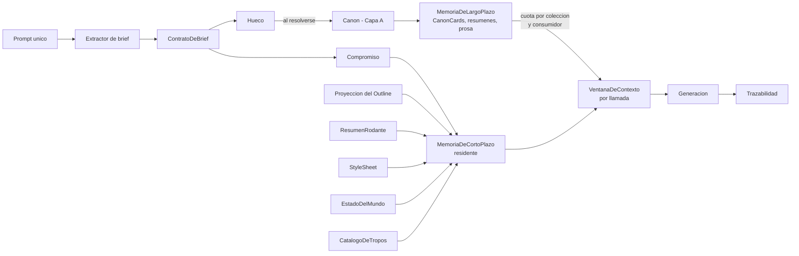
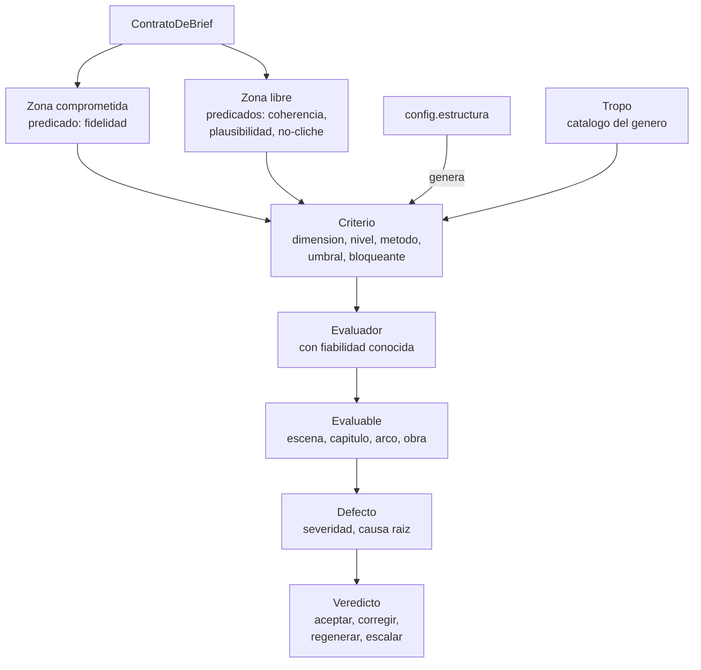
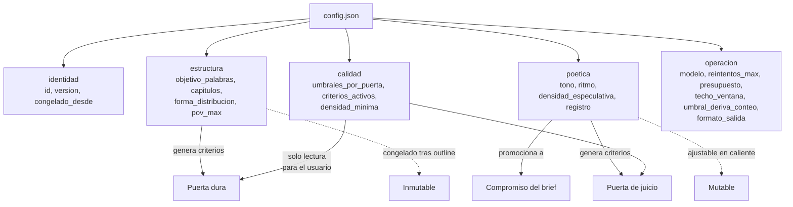
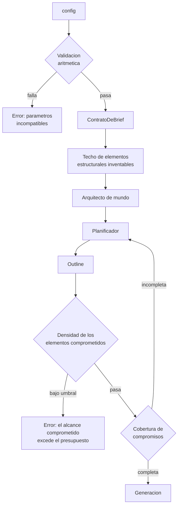
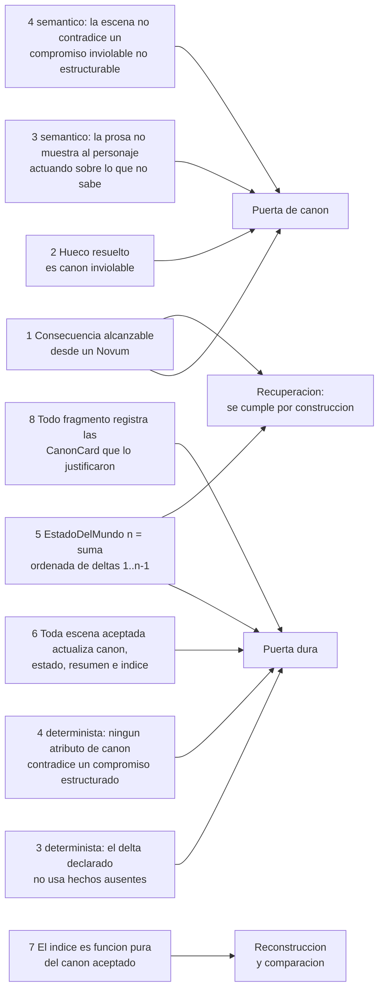
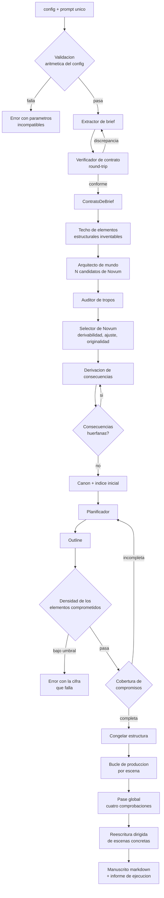
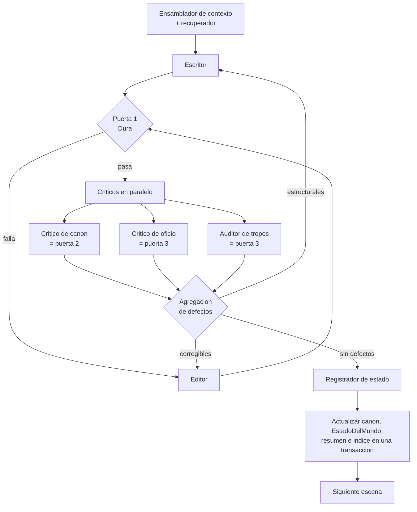
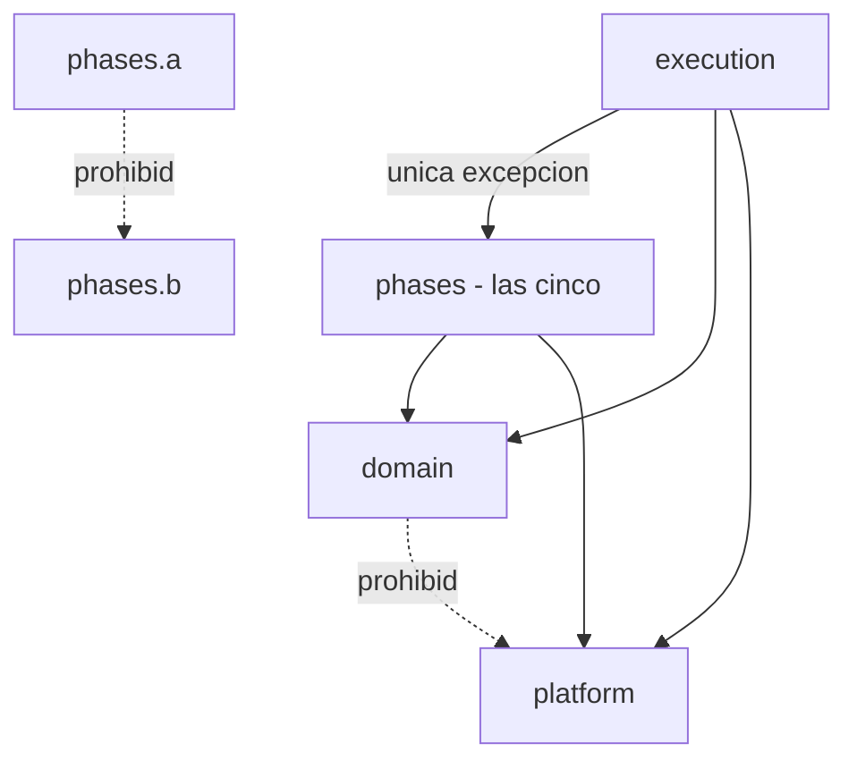

# architecture.md

Decisiones de diseño de la solución: cómo se separan las capas, cómo se gestiona el contexto, cómo se controla la calidad y cómo se configura. El vocabulario está en `definitions.md`; las razones de dominio, en `domain-knowledge.md`.

---

## 1. Separación en capas

### 1.1 Hay tres ontologías, no una

Confundirlas es la principal causa de arquitecturas confusas en este dominio.

| Capa | Qué modela | Pregunta que responde |
|---|---|---|
| **A. Storyworld** | El mundo ficticio y su canon | ¿Qué es verdad dentro de la ficción? |
| **B. Artefacto narrativo** | La novela como objeto estructurado | ¿Cómo está construido el texto? |
| **C. Sistema de generación** | Pipeline, contexto, agentes | ¿Cómo se produce? |

La **calidad (D)** no es una cuarta capa paralela: es un conjunto de predicados que se evalúan *sobre* A y B, y se gestionan *en* C.


### 1.2 Tres fuentes de restricción

Todo lo que condiciona la generación viene de una de estas tres, y conviene no mezclarlas:

- **Prompt / ContratoDeBrief** — la intención del usuario.
- **Canon** — la verdad ficcional ya establecida.
- **config** — los parámetros de forma y operación.

> **Test de frontera:** si el parámetro es una *afirmación sobre el mundo ficticio*, pertenece al ContratoDeBrief. Si no lo es, es config.
> «El protagonista es una IA» → brief. «12 capítulos» → config. «Tono sombrío» → vive en config, pero se *promociona* a Compromiso del contrato. El almacenamiento y la semántica no tienen por qué coincidir.

---

## 2. Extracción del ContratoDeBrief

El prompt del usuario es texto libre; el contrato es el objeto sobre el que el resto del sistema razona. La extracción convierte prosa en compromisos y huecos declarados.

Tres propiedades de diseño:

1. **La extracción no es fiable al 100 %.** Un modelo interpretando texto libre confundirá preferencias con requisitos. Al no haber revisión humana, la comprobación es el verificador de ida y vuelta (§8.10), y ante ambigüedad se clasifica como Hueco, no como Compromiso.
2. **Los compromisos no verificables son el punto débil.** «Final ambiguo» no se comprueba con una regla. O se convierte en criterio de la puerta de juicio con rúbrica concreta, o se descarta explícitamente del contrato. Dejarlo dentro sin método de verificación es autoengaño.
3. **Los huecos son de un solo uso.** El contrato registra la intención inicial; el canon registra lo ya decidido. Son objetos distintos y no deben fusionarse.

---

## 3. Gestión de contexto y memoria

### 3.1 El patrón

El patrón viable es **outline-first + recuperación selectiva + validación de deltas**, no «contexto máximo».



Activos de primera clase:

- **Outline** — contrato estable entre planificación y generación; es lo que evita la deriva. En la ventana entra proyectado, no entero (§3.5).
- **MemoriaDeLargoPlazo** — el índice del que se recupera por consulta.
- **MemoriaDeCortoPlazo** — lo residente: proyección del outline, `EstadoDelMundo`, `ResumenRodante`, `StyleSheet`, compromisos inviolables y `CatalogoDeTropos`.
- **VentanaDeContexto** — lo ensamblado para una llamada concreta.
- **Trazabilidad** — todo fragmento generado registra qué elementos lo justificaron. No es una aspiración: es el invariante 8 (§7), y la recuperación lo produce sin coste añadido.

### 3.2 La memoria de largo plazo es un RAG híbrido dinámico sin re-ranking

Híbrido: canal léxico y canal denso. Dinámico: el índice nace vacío y crece con el canon aceptado de la propia ejecución. **Sin re-ranking:** no hay un modelo que reordene lo recuperado.

Renunciar al re-ranker no es un ahorro, es lo que compra la propiedad de §3.11: con vectores congelados y desempate estable, la recuperación entera se vuelve verificable por ejecución, en clase T y sin llamar a ningún modelo. Un re-ranker con modelo habría dejado esa propiedad fuera de alcance.

### 3.3 Colecciones, no un pozo

**El índice no es un almacén único: son `ColeccionDeMemoria`, cada una con su unidad, su consumidor y su modo de recuperación.**

Sin esa premisa, «sin re-ranking» no se sostiene. Fusionar en un único ranking una tarjeta de entidad, un resumen de escena y un fragmento de prosa es comparar unidades incomparables, y lo que normalmente reconcilia eso es justamente el re-ranker que no va a existir.

**Consecuencia:** la fusión por rango recíproco (RRF) queda confinada **dentro** de cada colección y **nunca** fusiona entre colecciones.

### 3.4 Las tres colecciones

| Colección | Unidad | Consumidor | Modo de recuperación |
|---|---|---|---|
| **CanonCards** | tarjeta de entidad, versionada | escritor (consulta prospectiva) y crítico de canon (consulta retrospectiva) | BM25 + denso fundidos por RRF, más arrastre por el grafo causal |
| **Resúmenes de escena** | un resumen por escena aceptada | crítico de canon, comprobaciones del pase global | BM25 + denso por RRF, más arrastre de la escena anterior y la siguiente |
| **Prosa** | **el párrafo** | **solo el crítico de oficio** | **BM25 exclusivamente, sin incrustaciones** |

Dos decisiones dentro de la tabla que conviene no leer como detalles:

- **El escritor nunca recibe prosa lejana recuperada.** Tiende a imitarla, y eso agravaría la repetición léxica entre escenas distantes que §8.9 existe precisamente para detectar.
- **La unidad de la colección de prosa es el párrafo, no la escena.** BM25 sobre un documento de mil quinientas palabras diluye la señal hasta que una imagen repetida deja de puntuar, que es el único motivo por el que la colección existe. Cada fila lleva cabecera con su escena y su capítulo.

### 3.5 Residentes, nunca indexados

Van residentes en la ventana y **fuera del índice**: la proyección acotada del outline, el `CatalogoDeTropos`, los compromisos inviolables, el `EstadoDelMundo`, el `StyleSheet` y el `ResumenRodante`.

**La proyección del outline** son los capitulares de toda la obra, las escenas del capítulo actual y una lista explícita de lo que aún no puede revelarse.

La aritmética que justifica proyectar en vez de residir entero (supuestos: español ≈1,5 tokens/palabra; entrada de escena 90 tk, de capítulo 50 tk, de tropo 90 tk; **techo de 100k tokens de entrada por etapa**, repartido entre las llamadas en vuelo de esa etapa: con tres críticos en paralelo, **cuota de 33k de entrada por agente**, §3.13):

| | tokens | % de 100k | % de la cuota de un agente |
|---|---|---|---|
| Outline completo — 36 escenas | 3.840 | 3,8 % | 11,5 % |
| Outline completo — 96 escenas | 9.840 | 9,8 % | 29,5 % |
| Outline completo — 160 escenas | 16.400 | 16,4 % | **49,2 %** |
| **Proyección** | 870 – 2.360 | <2,4 % | **2,6 – 7,1 %** |
| Catálogo de tropos — 60 entradas | 5.400 | 5,4 % | 16,2 % |
| Catálogo de tropos — 120 entradas | 10.800 | 10,8 % | 32,4 % |

El outline completo no es residente seguro: en una novela larga se come la mitad de la cuota de cada crítico paralelo, y además es intocable en el recorte (§3.13), así que no hay válvula. La proyección cabe con holgura en cualquier tamaño, y eso hace que **el límite deje de depender del tamaño de la obra**.

**El catálogo de tropos no se indexa por calidad, no por tamaño.** `domain-knowledge.md` §3.1 fija el nivel útil del marcador en el **mecanismo narrativo**, formulado a propósito para cubrir variantes superficiales distintas. Recuperarlo por similitud léxica o densa es una máquina de falsos negativos: el tropo que sí está es justo el que no se recupera.

### 3.6 Cuota fija por (colección, consumidor)

Cada par (colección, consumidor) tiene un número fijo de plazas. **Sin fusión entre colecciones y sin préstamo** de plazas sobrantes. La ventana deja de ser un montón y pasa a ser una tabla legible, y cada celda se prueba por separado.

El consumidor determina qué colecciones ve: la prosa solo aparece en la fila del crítico de oficio.

> Se acepta lo que esto renuncia: una escena que necesitara diez tarjetas y ningún resumen no puede pedir plazas prestadas.

### 3.7 Corte temporal

Las `CanonCard` son **inmutables, con `desde_escena` y `hasta_escena`**. Cada cambio de una entidad cierra la tarjeta vigente y añade otra. La recuperación filtra `desde <= n < hasta` **antes** de puntuar, así que el corte temporal es una cláusula de la consulta y no una instrucción al modelo.

Sin esto, el crítico que evalúa la escena 12 ve la verdad de la escena 60: fabrica contradicciones que no existían, o valida como coherente algo que en su momento no lo era.

El índice queda **estrictamente append-only**. Es lo que hace cierto que el índice sea función pura del canon aceptado (invariante 7) y lo que permite reanudar desde punto de control sin lógica de recuperación propia.

Es además un refuerzo del invariante 5: la verdad vigente en la escena *n* se construye desde lo anterior a *n*, también cuando se recupera.

### 3.8 Arrastre por el grafo y arrastre temporal

Lo recuperado entra como tarjeta completa; **sus ancestros entran como enunciado de una línea**, no como tarjeta, y **no consumen cuota**. `definitions.md` acota el orden de una `Consecuencia` a 1.º, 2.º y 3.º, así que la cadena tiene profundidad máxima conocida y el coste queda en el orden de cien tokens.

**El efecto principal es que el invariante 1 pasa a cumplirse por construcción en la recuperación**, no solo a comprobarse en la puerta de canon. Una `Consecuencia` nunca llega al escritor sin la cadena que la sostiene hasta el `Novum`.

> Se acepta lo que renuncia: si la contradicción vive en el detalle del ancestro y no en su enunciado, no se ve.

El mismo principio se aplica a los resúmenes, como **arrastre temporal**: recuperar el resumen de la escena 34 suelto entrega un hecho sin antes ni después, igual que recuperar una `Consecuencia` sin su `Novum`. Cada acierto arrastra el resumen anterior y el siguiente, y consume tres plazas.

### 3.9 Doble consulta

- **Escritor:** consulta **prospectiva**, construida desde el outline de la escena que va a escribir.
- **Crítico de canon:** consulta **retrospectiva**, construida desde el texto que el escritor ya produjo.

Con una consulta compartida, escritor y crítico comparten punto ciego: la tarjeta que contradice la escena no se recuperó, así que ni el escritor la vio ni el crítico la ve, y la contradicción pasa la puerta 2 limpiamente. Es un fallo silencioso, la peor clase de fallo de este sistema (`verification.md` §4.9). Dos consultas distintas dan dos puntos ciegos distintos.

Encaja además con §8.8.1: el crítico no ve el razonamiento del escritor, y ahora tampoco su ventana.

### 3.10 La escasez de recuperación no bloquea

Si la recuperación devuelve poco o nada, **se genera igual con lo que haya y se registra causa raíz `contexto ausente`** en el informe de ejecución. No hay puerta nueva.

El motivo decisivo es que **un RAG dinámico nace vacío**. En la escena 1 el índice está prácticamente vacío por construcción: la escasez no es un fallo, es el estado normal del sistema al arrancar. Cualquier política de bloqueo por escasez bloquearía la primera escena de todas las novelas.

Es además la misma causa raíz que registra el recorte por techo de ventana (§3.13).

### 3.11 Vectores congelados y determinismo

- El **identificador del modelo de incrustación se fija al crear la ejecución** y viaja con el índice.
- Los vectores **se guardan y no se recalculan jamás**.
- El **desempate es estable por id**.

De ahí que **el recuperador quede en clase T completa**: las pruebas doradas usan un índice de fixture con vectores almacenados, así que admiten aserciones del tipo «la ventana de la escena 12 contiene la tarjeta X y no la Y» sin llamar a ningún modelo. Es el argumento que justifica no llevar re-ranker (§3.2).

> Se acepta lo que renuncia: no se puede cambiar de modelo de incrustación a mitad de ejecución, y una ejecución vieja no se reanuda si su modelo ya no existe sin reconstruir el índice.

### 3.12 Quién escribe en el índice

**Un escritor por fase, siempre en la misma transacción que el canon.**

| Fase | Quién indexa | Qué |
|---|---|---|
| Arquitectura de mundo | Arquitecto de mundo | El canon inicial, al cerrarlo |
| Producción por escena | Registrador de estado | El delta, al aceptar la escena |

Nunca existe una ventana de tiempo en la que canon e índice discrepen; una escena rechazada no deja rastro; y el índice se persiste junto al canon, así que **reanudar desde punto de control no reconstruye ni reincrusta nada**.

Esto obliga a acotar §8.8.6, que dice que ningún agente escribe en canon directamente: la excepción es el arquitecto de mundo, que escribe el canon inicial antes de que exista ninguna escena. La regla tenía esa excepción desde siempre y no estaba declarada.

### 3.13 Techo de ventana y orden de recorte

El techo de ventana es una cifra de `config.operacion`, no editable por el usuario final. Referencia de diseño: **100k tokens de entrada**.

1. **Cuenta solo la entrada.** El techo es de lo que se envía: prompt de sistema, residentes, arrastre y recuperado. **La salida no lleva techo en tokens.** No se puede acotar ex ante sin decidir por el modelo cuándo callarse, y un techo que solo se puede comprobar después de pagarlo no es un techo. Su único control es el presupuesto en dinero de la ejecución (§8.12).
2. **Es un techo por etapa de concurrencia, no por llamada.** Vale para la **suma de la entrada de todas las llamadas en vuelo a la vez**. Con tres críticos en paralelo, el orquestador reparte el techo entre ellos; no son tres techos.
3. **La cuota de un agente es el techo dividido entre las llamadas realmente en vuelo** en esa etapa: tres llamadas, 33k cada una; dos llamadas, 50k; una sola, 100k. El mecanismo está en §3.15.
4. **En desarrollo se razona por agente y por cuota**, que es la unidad en la que se escriben las pruebas.
5. **Si no cabe, se recorta y se sigue**, con registro en el informe de ejecución y causa raíz `contexto ausente` (§3.10). No se bloquea.

**Intocables:** todo lo residente de §3.5 salvo el `ResumenRodante`, y el arrastre comprimido de §3.8, que por tamaño no compensa recortar.

Si lo intocable **ya supera por sí solo la cuota del agente**, el `ResumenRodante` es la última válvula: se recorta y se sigue con la misma causa raíz `contexto ausente`. No hay bloqueo por esta vía.

**Orden de recorte.** Rango inverso **dentro** de cada colección; **entre** colecciones y frente al corto plazo, el orden es declarado:

```
prosa  →  resúmenes de escena  →  CanonCards  →  ResumenRodante
```

No hacen falta puntuaciones comparables entre colecciones, porque el orden no se calcula: se declara. Es la contrapartida coherente de §3.3.

> Esto acota la decisión cerrada «nunca degradar» (§11): se aplica a compromisos y a config —ahí se bloquea con error accionable—, no al presupuesto de recuperación, donde recortar y declararlo es la política.

### 3.14 Stack del índice

**`sqlite-vec` como extensión cargable de SQLite**, más **FTS5 nativo** para el canal léxico. Ninguna de las dos piezas añade un servicio: el índice vive en el mismo fichero SQLite que el canon, que es lo que hace posible §3.12.

Comprobado empíricamente en el entorno de desarrollo —Windows sin permisos de administrador ni VC++ Redistributable—: `sqlite3.Connection.enable_load_extension(True)` no lanza, `sqlite-vec` carga y responde a una consulta KNN, y FTS5 está disponible en la misma conexión.

### 3.15 Presupuesto de ventana por etapa

§3.13 declara el techo; esta sección dice quién lo hace cumplir.

**La cuota se calcula al abrir la etapa.** El orquestador sabe cuántas llamadas va a lanzar a la vez y divide el techo entre ellas. La cuota es de entrada y vale para esa etapa; no se acumula ni se presta entre etapas.

**El guardián de presupuesto lo invoca el orquestador, nunca el modelo.** Antes de emitir cada llamada, el código pregunta si el contexto recuperado de SQLite cabe en la cuota del agente. Lo que no cabe **se niega ahí**, y la ventana llega al modelo ya cerrada.

```
etapa: 3 criticos en paralelo  ->  cuota 33k de entrada cada uno
  ensamblar(agente, escena, cuota)
    residentes + arrastre   -> intocables (3.13)
    recuperado por cuota de coleccion (3.6)
    si no cabe -> recortar por el orden declarado de 3.13
  -> llamada con la ventana cerrada
el agente nunca ve su presupuesto ni decide que pedir
```

Que el invocador sea el código y no el modelo es lo que sostiene tres cosas ya cerradas:

- **El determinismo de §3.11.** Si el agente decidiera qué pedir, la misma escena daría ventanas distintas en dos ejecuciones y los vectores congelados dejarían de bastar.
- **El recuperador en clase T completa.** Se puede afirmar «la ventana de la escena 12 con cuota de 33k contiene la tarjeta X y no la Y» sin ningún modelo en el bucle.
- **El orden de recorte declarado de §3.13.** Un modelo que elige qué soltar convierte un orden declarado en una decisión por llamada.

**El tope es duro.** El agente no razona nunca sobre contexto que luego no va a ver: lo negado se descuenta antes de construir el prompt, no después. Lo contrario sería un fallo silencioso de los que `verification.md` §4.9 señala como la peor clase.

**Conteo y reconciliación.** Se cuenta con el **tokenizador del modelo declarado en `config.operacion`**, congelado al crear la ejecución igual que el modelo de incrustación (§3.11). Además se registra el uso de entrada real que devuelve el proveedor. Cuando la divergencia entre ambos supera `umbral_deriva_conteo`, se anota en el informe la causa raíz **`presupuesto excedido`** —que es la cuota de ventana, no el techo en dinero de §8.12—. No bloquea ni reintenta: es señal de calibración, y la cifra está sin valor (§10.2).

---

## 4. Marco de calidad

### 4.1 Las cuatro puertas

| Puerta | Método | Qué detecta | Coste |
|---|---|---|---|
| **0. Factibilidad** | Determinista | config inconsistente consigo mismo; densidad narrativa de los elementos comprometidos por debajo del mínimo (§6.3); compromisos sin cobertura en el outline | Muy bajo |
| **1. Dura** | Determinista | Violación de Restriccion, contradicción temporal, atributo alterado, y los **predicados deterministas** de los invariantes 3 y 4 (§7) | Bajo |
| **2. Canon** | Recuperación + modelo | Incoherencia con el grafo causal, consecuencia sin premisa, invención que contradice invención previa, y los **predicados semánticos** de los invariantes 3 y 4 (§7) | Medio |
| **3. Juicio** | Modelo con rúbrica | Prosa, ritmo, disciplina de POV, infodump, cliché, plausibilidad especulativa | Alto |

**La puerta 0 no está en el bucle por escena.** Se ejecuta una sola vez, sobre el outline, antes de congelar la estructura. Las puertas 1, 2 y 3 sí corren por escena.

```mermaid
graph LR
    OUT[Outline] --> P0{Puerta 0<br/>Factibilidad}
    P0 -->|falla| REP[Replanificar<br/>config u outline]
    P0 -->|pasa| CONG[Congelar estructura]

    CONG --> IN[Escena generada]
    IN --> P1{Puerta 1<br/>Dura}
    P1 -->|pasa| P2{Puerta 2<br/>Canon}
    P2 -->|pasa| P3{Puerta 3<br/>Juicio}
    P3 -->|pasa| ACE[Aceptada]

    P1 -->|falla| DEF[Defectos tipados]
    P2 -->|falla| DEF
    P3 -->|falla| DEF
    DEF -.enrutado en 8.7.-> IN

    ACE --> UPD[Actualizar canon, estado,<br/>resumen e indice]
    UPD -.siguiente escena.-> IN
```

> El orden es económico, no arbitrario: cada puerta es más cara que la anterior. Una escena que falla la puerta dura no debe consumir presupuesto de juicio. La mayoría de implementaciones invierte este orden y paga de más.

**Qué pasa cuando una puerta falla no se decide aquí.** Este diagrama declara el orden de las puertas y nada más; el enrutado de los defectos es uno solo y vive en §8.7, por naturaleza del defecto y no por qué puerta lo encontró.

### 4.2 Estructura del marco



Dos reglas de diseño:

- **Todo Evaluador declara su fiabilidad conocida.** Un juez LLM sin calibración medida es ruido con formato de métrica.
- **Todo Defecto registra causa raíz.** Es lo que permite corregir el sistema y no solo el texto.

---

## 5. Configuración

### 5.1 Tres familias

| Familia | Ejemplos | Propiedad clave |
|---|---|---|
| **Estructural** | `objetivo_palabras`, `capitulos`, `forma_distribucion`, `pov_max` | Verificable de forma determinista |
| **Poética** | tono, densidad especulativa, ritmo, tecnicismo, ambigüedad del final | Solo evaluable por juicio |
| **Operativa** | modelo, temperatura, reintentos, umbrales, presupuesto | Invisible para el usuario final |

Mezclarlas en un JSON plano funciona hasta la primera vez que el usuario necesita editar la poética sin tocar la operativa.



### 5.2 Reglas

1. **No sobredeterminar.** Palabras totales, capítulos, escenas por capítulo y palabras por escena no son independientes: declarar las cuatro permitiría configuraciones aritméticamente imposibles. Por eso `config.estructura` declara **una sola variable de tamaño** —`objetivo_palabras`— más una **forma de distribución** —`capitulos` y `forma_distribucion`—, y deriva el resto. La sobredeterminación no se valida: es **inexpresable**. Un config donde el usuario puede escribir un estado inconsistente es un fallo de diseño, no de validación.
2. **Precedencia declarada.** config gana en lo estructural; el prompt gana en lo narrativo. Ninguna colisión se resuelve en silencio.
3. **Inmutabilidad post-outline.** Los campos estructurales se congelan al aprobar el outline; cambiarlos a mitad de obra invalida el plan y probablemente canon ya establecido. Los poéticos sí pueden ajustarse en caliente.
4. **Cada parámetro estructural genera un Criterio de la puerta dura.** `capitulos: 12` no es solo una instrucción de generación: es una aserción verificable sobre el artefacto final. Si no se materializa como criterio, el config es decorativo.
5. **`calidad` no lo edita el usuario final.** Permitirlo deja bajar los umbrales para que una historia mal configurada «pase», lo que invalida el marco entero. Solo lectura, o fichero de política separado.

---

## 6. Precedencia y conflictos

### 6.1 Precedencia ordinaria

config gana en lo estructural; el prompt gana en lo narrativo. Ninguna colisión se resuelve en silencio: toda resolución queda registrada en el informe de ejecución.

### 6.2 Los dos tipos de imposible

En operación autónoma no hay a quién preguntar, y se decidió **bloquear en ambos casos**. La degradación silenciosa queda descartada como mecanismo.

El recorte de la `VentanaDeContexto` (§3.13) no es un tercer imposible y no bloquea: recorta y lo declara. «Nunca degradar» se aplica a compromisos y a config, no al presupuesto de recuperación.

| Tipo | Ejemplo | Cuándo se detecta | Acción |
|---|---|---|---|
| **Aritmético** | `capitulos: 200` con `objetivo_palabras: 40.000`: 200 palabras por capítulo, por debajo de cualquier escena posible | Validación de entrada, antes de ejecutar nada | Error inmediato, nombrando los parámetros incompatibles |
| **Densidad** | «tres generaciones, cinco planetas» **en el prompt del usuario**, con 40.000 palabras | Puerta 0, sobre el outline, contando solo lo comprometido (§6.3) | Error, nombrando la cifra que falla |

### 6.3 Densidad narrativa

Para que el segundo caso sea bloqueable hace falta una métrica; bloquear por juicio de modelo es rechazo arbitrario.

```
densidad = objetivo_palabras / nº elementos estructurales comprometidos
```

Donde los elementos estructurales son POVs, saltos temporales mayores, localizaciones principales e hilos argumentales, y **solo cuentan los derivados del `ContratoDeBrief`**. Por debajo de `config.calidad.densidad_minima`, se bloquea con un mensaje que nombra el número:

> «El prompt compromete 14 elementos estructurales; con 40.000 palabras quedan 2.900 por elemento, por debajo del mínimo de 6.000. Reduzca el alcance o suba a 85.000 palabras.»

Un error que nombra la cifra es accionable; «no es posible» no lo es.

**La puerta 0 solo bloquea contradicciones que escribió el usuario.** Lo que el sistema inventa deja de juzgarse a la salida: el **arquitecto de mundo recibe un techo de elementos estructurales como restricción de entrada**, antes de inventar.

El motivo es el caso declarado como más frecuente. Con un prompt casi vacío (§8.11) el contrato queda con cero compromisos y grado de libertad 1.0: el arquitecto inventa con las manos libres, el planificador produce un outline denso y una puerta 0 que contase sobre el outline abortaría pidiéndole al usuario que reduzca un alcance que él no escribió. Contando sobre el contrato, ese caso pasa la puerta por construcción —sin elementos comprometidos no hay densidad que acotar— y el control se ejerce donde se origina el problema.

Es además lo que cierra §10.1: contar sobre el contrato es contar sobre una estructura declarada y no sobre prosa, así que la validación vuelve a ser determinista sin tener que decidir si «cinco planetas» son una localización o cinco.

> Se acepta lo que renuncia: un mundo inventado anémico, o desbordado por debajo del techo, ya no lo caza ninguna puerta determinista. Pasa a la puerta de juicio.



> Consecuencia de descartar la degradación: ya no hace falta un orden de prioridad entre compromisos, porque nunca hay que elegir qué sacrificar.

---

## 7. Invariantes y dónde se comprueban

Son ocho. La lista es corta a propósito: de ahí saca su utilidad como contrato.

| # | Invariante | Dónde se comprueba |
|---|---|---|
| 1 | Toda `Consecuencia` es alcanzable desde al menos un `Novum` | Puerta de canon, **y por construcción** en la recuperación (§3.8) |
| 2 | Todo `Hueco` resuelto pasa a ser canon inviolable | Puerta de canon |
| 3 | Ningún `Personaje` actúa sobre información ausente de su `EstadoEpistemico` de entrada | Partido en dos predicados (abajo) |
| 4 | Ningún `Compromiso` inviolable es contradicho por canon inventado | Partido en dos predicados (abajo) |
| 5 | El `EstadoDelMundo` en la escena *n* es la aplicación ordenada de todos los `DeltaDeEstado` de las escenas 1..*n*−1 | Puerta dura, **reforzado** por el corte temporal de la recuperación (§3.7) |
| 6 | Toda escena aceptada actualiza canon, estado, resumen rodante e índice antes de generar la siguiente | Puerta dura |
| 7 | El índice es función pura del canon aceptado | Reconstrucción y comparación |
| 8 | Todo fragmento generado registra las `CanonCard` que lo justificaron | Puerta dura |

### 7.1 Los invariantes 3 y 4 se parten en dos predicados

La puerta dura es determinista (§4.1). Los invariantes 3 y 4, tal como estaban enunciados, solo se comprueban leyendo prosa, así que enrutarlos enteros a la puerta dura la convertía en determinista de nombre. Cada uno se parte en la mitad que sí es estructural y la mitad que no, con dueño distinto:

| | Predicado determinista → **puerta dura** | Predicado semántico → **puerta de canon** |
|---|---|---|
| **3** | El `DeltaDeEstado` declarado por el escritor no usa hechos ausentes del `EstadoEpistemico` de entrada | La prosa no muestra al personaje actuando sobre información que no posee |
| **4** | Ningún atributo de canon escrito contradice un compromiso inviolable estructurado | La escena no contradice un compromiso inviolable no estructurable |

Es la misma frontera que §8.8.4 ya aplica al estado —«el estado se extrae, no se asume»—; aquí solo se extiende a los invariantes.

**Por qué el predicado determinista del 3 sí está disponible en la puerta 1.** El registrador de estado corre *después* de los críticos (§8.7), así que en el momento de la puerta 1 todavía no existe el delta *real*. Pero sí existe el **delta declarado por el escritor**, y es sobre ese sobre el que se comprueba el predicado. La divergencia entre delta declarado y delta real sigue siendo un defecto aparte, el de §8.8.4.

### 7.2 Dos refuerzos que no son invariantes nuevos

El **arrastre por el grafo** (§3.8) y el **corte temporal** (§3.7) no añaden propiedades: hacen cumplir antes dos que ya existían. El arrastre consigue que el invariante 1 se cumpla en la recuperación y no solo se compruebe en la puerta de canon; el corte temporal hace lo mismo con el 5. Escribirlos como invariantes 9 y 10 alargaría la lista sin añadir nada que comprobar.



---

## 8. Sistema de agentes

### 8.1 Premisas de operación

1. **Autonomía total.** No hay intervención humana en ningún punto de la ejecución.
2. **Entrada mínima.** Dos cosas: el `config` y un único prompt del usuario, con la información que él decida dar. No hay preguntas de aclaración ni pasos de confirmación.
3. **Generación secuencial.** Las escenas se producen en orden, porque cada una depende del estado que deja la anterior.

### 8.2 Principio de asignación: qué es y qué no es un agente

No todo paso del pipeline es un agente. Convertir cada puerta en uno paga latencia, coste y no determinismo por comprobaciones que son código. La asignación se hace por naturaleza de la tarea:

| Tipo | Cuándo | Cuántos |
|---|---|---|
| **Código** | La respuesta es calculable | 9 |
| **Modelo en un paso** | Requiere comprensión, no exploración | 9 |
| **Agente (bucle + herramientas)** | Requiere explorar, consultar canon y decidir en varios pasos | 4 |

### 8.3 Los cuatro agentes

| Agente | Fase | Entrada | Salida |
|---|---|---|---|
| **Arquitecto de mundo** | 1 | ContratoDeBrief + techo de elementos estructurales (§6.3) | N candidatos de Novum, Restricciones, grafo de Consecuencias |
| **Planificador** | 2 | Canon, contrato, config | Outline jerárquico |
| **Escritor** | 3 | `VentanaDeContexto` | Texto de escena + delta pretendido |
| **Editor** | 3 | Escena + defectos | Escena corregida |

> **Escritor y editor se mantienen separados.** Podrían fusionarse en un agente con dos modos —el argumento anticomplacencia aplica a criticar, no a corregir—, pero mantenerlos distintos permite medir por separado la calidad de escritura y la de corrección.

> **Eran cinco.** El revisor de obra deja de ser un agente con bucle al descomponerse el pase global por tipo de defecto (§8.9): ninguna de las cuatro comprobaciones resultantes explora ni decide en varios pasos. La fila de §11 se actualiza con este motivo.

El arquitecto de mundo tiene además un **modo «reutilizar canon»**, que parte de un storyworld de la biblioteca en vez de inventarlo (§11, reutilización de canon).

### 8.4 Llamadas de modelo en un paso

| Componente | Fase | Función |
|---|---|---|
| **Extractor de brief** | 0 | Prompt → ContratoDeBrief |
| **Verificador de contrato** | 0 | Comprobación de ida y vuelta contra el prompt original |
| **Auditor de tropos** | 1 y 3 | Puntúa solapamiento con el catálogo |
| **Crítico de canon** | 3 | Defectos de coherencia contra el grafo causal |
| **Crítico de oficio** | 3 | Defectos de prosa, ritmo y POV |
| **Registrador de estado** | 3 | Extrae el DeltaDeEstado real del texto aceptado, e indexa (§3.12) |
| **Juez de curva de tensión** | 4 | Puntúa el ritmo de la obra sobre la tabla de tensiones de capítulo |
| **Detector de deriva de voz** | 4 | Contrasta el muestreo de tercios con el `StyleSheet` |
| **Detector de repetición léxica** | 4 | Juzga los párrafos recuperados de la colección de prosa |

### 8.5 Componentes de código

Validador de config, orquestador, ensamblador de contexto, **recuperador**, puerta dura, selector de novum, aplicador de estado, **comprobador estructurado de obra** y redactor del informe. Ninguno necesita un modelo.

- El **recuperador** implementa §3.3–§3.11: filtro temporal, RRF dentro de cada colección, arrastre y cuotas. Es determinista y queda en clase T completa (§3.11).
- El **comprobador estructurado de obra** resuelve las consultas del pase global que no necesitan modelo (§8.9) y construye la tabla de tensiones de capítulo.

### 8.6 Flujo por fases



### 8.7 Bucle de producción por escena



**Correspondencia puerta ↔ crítico.** Las puertas 2 y 3 no son pasos aparte del bucle: son los críticos, y por eso no aparecían con ese nombre.

| Puerta | Quién la ejecuta |
|---|---|
| **1. Dura** | La puerta dura; código, sin modelo |
| **2. Canon** | Crítico de canon |
| **3. Juicio** | Crítico de oficio y auditor de tropos |

Declararla importa porque su ausencia es lo que permitió que §4.1 y este bucle describieran dos enrutados distintos para la misma decisión.

**Hay una sola regla de enrutado y es esta:** el defecto se enruta por su naturaleza —corregibles al editor, estructurales al escritor—, no por la puerta que lo encontró. §4.1 declara el orden de las puertas y nada más.

### 8.8 Reglas de interacción

1. **Separación escritor / críticos.** El mismo agente no escribe y se autoevalúa: ya posee el contexto que justificó sus decisiones y su autocrítica es complaciente. Los críticos reciben la escena y el canon, no el razonamiento del escritor.
2. **Los críticos no reescriben.** Devuelven `Defecto` tipados. Detectar y corregir son competencias distintas; fusionarlas impide medir la fiabilidad de la detección.
3. **Críticos en paralelo.** Canon, oficio y tropos son independientes. Encadenarlos en serie multiplica latencia sin mejorar cobertura.
4. **El estado se extrae, no se asume.** El escritor declara el delta que pretendía; el registrador lee el texto aceptado y extrae el delta real. Una divergencia entre ambos es un defecto de la puerta dura.
5. **Presupuesto de reintentos por escena.** Sin él, una escena imposible consume el presupuesto de la obra.
6. **Ningún agente escribe en canon durante el bucle por escena.** Solo el registrador, y solo tras un veredicto de aceptación; y escribe canon e índice en la misma transacción (§3.12). Es lo que impide que una escena rechazada contamine el estado. **La excepción, ahora declarada:** el arquitecto de mundo escribe el canon inicial al cerrar la fase 1, antes de que exista ninguna escena. La regla siempre tuvo esa excepción; lo que faltaba era escribirla.

### 8.9 Pase global (fase 4)

Hay defectos que no existen a nivel de escena y que ninguna evaluación local detecta:

- Ritmo y curva de tensión a lo largo de la obra.
- Cobertura de arcos: hilos abiertos sin cerrar.
- Repetición léxica y de estructuras entre escenas distantes.
- Deriva de voz entre el primer tercio y el último.
- Consecuencias del canon establecidas y nunca usadas.

El manuscrito completo no cabe en el techo de ventana (§3.13), así que el pase global no puede ser un agente que lo lea entero.

**Tampoco se resuelve con ventanas deslizantes sobre resúmenes.** Un barrido secuencial no ve la repetición entre escenas distantes, que es literalmente uno de los cinco defectos de la lista: la ventana que contiene la escena 8 no contiene la 74.

**El pase global se descompone por tipo de defecto**, porque de los cinco solo uno necesita recuperación:

| Defecto de obra | Mecanismo | Dueño |
|---|---|---|
| Hilos abiertos sin cerrar | Consulta estructurada: `Arco` con estado abierto | Comprobador estructurado de obra |
| Consecuencias establecidas y nunca usadas | Consulta estructurada: `Consecuencia` sin ningún vínculo de `Trazabilidad` | Comprobador estructurado de obra |
| Ritmo y curva de tensión | Tabla de tensiones de capítulo, unos pocos miles de tokens | Juez de curva de tensión |
| Deriva de voz entre el primer tercio y el último | Muestreo de tercios contrastado con el `StyleSheet` | Detector de deriva de voz |
| Repetición léxica entre escenas distantes | Colección de prosa, **único uso de recuperación de todo el pase global** | Detector de repetición léxica |

Cuatro comprobaciones para cinco defectos: las dos consultas estructuradas comparten dueño.

- **Hilos abiertos** es una consulta exacta desde que `Arco` es entidad con estado (`definitions.md` §2), no un problema de similitud.
- **Consecuencias sin usar** es trivial gracias al invariante 8: una `Consecuencia` sin ninguna referencia de trazabilidad es una fila sin referencias.
- **El ritmo** se lee de la tabla: `Capitulo` ya declara `tension_entrada` y `tension_salida` como atributos.

Sus defectos se resuelven con reescritura dirigida de escenas concretas, no con regeneración global.

> **Consecuencia sobre §8.3, declarada y no resuelta en silencio:** el revisor de obra deja de ser un agente con bucle y pasa a ser estas cuatro comprobaciones con dueños distintos. Los agentes pasan de cinco a cuatro, y la fila correspondiente de §11 se reescribe con este motivo.

### 8.10 Operación autónoma: qué sustituye a la supervisión

Cada punto donde intervendría una persona necesita un mecanismo propio.

**Contrato → verificación de ida y vuelta.** El riesgo es que el extractor confunda una preferencia con un requisito, o pierda uno. La comprobación es reconstructiva: a partir del `ContratoDeBrief`, un verificador independiente redacta una paráfrasis del prompt y la contrasta con el original. Lo que aparezca en el prompt y no en la paráfrasis es un compromiso perdido; lo que aparezca con más firmeza en la paráfrasis es una preferencia ascendida indebidamente. Ante ambigüedad irresoluble, la política por defecto es **clasificar como Hueco, no como Compromiso**: un compromiso inventado restringe toda la obra, un hueco solo la deja abierta.

**Novum → selección por puntuación.** El arquitecto genera N candidatos; pedirle uno solo garantiza el más obvio. El selector puntúa cada uno en derivabilidad (consecuencias de 2.º y 3.er orden que admite), ajuste a los compromisos, y distancia al catálogo de tropos. El tercer eje es el que evita la convergencia al cliché y **exige que el catálogo curado exista desde el primer día**: sin él, un novum trillado puntúa perfectamente en los otros dos ejes.

**Outline → dos comprobaciones deterministas.** Densidad narrativa y cobertura de compromisos. Un compromiso que no aparece en el plan no aparecerá en la novela.

**Supervisión → informe de ejecución.** El manuscrito se entrega acompañado de: compromisos cumplidos, compromisos no verificables, huecos resueltos y con qué, novum elegido y su puntuación, defectos no resueltos con su localización, y presupuesto consumido.

> Un sistema autónomo no es un sistema sin supervisión: es un sistema que produce su propia evidencia de lo que hizo. El informe no es documentación opcional, es el sustituto funcional del revisor.

### 8.11 El caso extremo: prompt casi vacío

Con una entrada del tipo «escribe una novela sobre IA», el contrato queda con cero compromisos y grado de libertad 1.0. El arquitecto trabaja sin ninguna restricción y el selector de novum es lo único que impide el cliché puro.

Es el caso que más se va a usar y el que menos margen deja. Debe probarse desde el primer día, no al final.

### 8.12 Presupuesto de la ejecución

Hay tres techos y conviene no confundirlos:

| Techo | Unidad | Alcance | Al agotarse |
|---|---|---|---|
| **Ventana** | tokens de **entrada** | Las llamadas en vuelo de una etapa | Recorta y sigue, con causa raíz `contexto ausente` (§3.13) |
| **Reintentos por escena** | intentos | Una escena | `Veredicto` con acción `escalar`; el defecto queda en el informe |
| **Ejecución** | **dinero** | La ejecución completa | Bloquea |

**La salida no lleva techo en tokens.** No se puede acotar antes de generarla, así que el único control sobre ella es el presupuesto en dinero de esta misma tabla: cuanta más salida, antes se agota. El techo de ventana solo gobierna lo que se envía (§3.13).

**El presupuesto de la ejecución se mide en dinero**, derivado del modelo declarado en `config.operacion`. Es lo que cierra §10.5.

El motivo es que un token de incrustación y uno de generación se diferencian en órdenes de magnitud de coste, y con un RAG dinámico (§3.2) la ejecución consume los dos. El dinero es la única unidad en la que ambos son fungibles: un techo en tokens tendría que elegir cuál de los dos cuenta, y cualquiera de las dos elecciones es falsa.

Al agotarse **bloquea**, lo que es coherente con «nunca degradar» en su alcance acotado (§6.2): el presupuesto de la obra no es presupuesto de recuperación.

La cifra no se fija aquí; está sin calibrar (§10.2).

---

## 9. Stack e implicaciones

### 9.1 Elección

| Capa | Tecnología |
|---|---|
| Backend y orquestación | Python 3.12+ con FastAPI y Pydantic v2; dependencias con `uv` |
| Persistencia | SQLAlchemy 2 sobre SQLite; `sqlite-vec` y FTS5 para el índice (§3.14) |
| Frontend | Vite + React + TypeScript en modo estricto, Tailwind CSS; dependencias con `pnpm` |
| Salida | Markdown |

Verificación del stack (el método y su clase T/A/I/D/U viven en `verification.md`): Ruff en el backend; comprobación de tipos de TypeScript, ESLint y build de producción en el frontend; evaluadores en vivo declarados explícitamente; y un recorrido manual del flujo completo en el navegador.

### 9.2 Reparto de responsabilidades

Todo el sistema de agentes vive en el backend. El frontend no orquesta nada.

| Componente del diseño | Dónde |
|---|---|
| Validador de config, orquestador, puertas, selector, aplicador de estado | Python, código puro |
| Agentes y llamadas de modelo | Python, servicios asíncronos |
| Canon, outline, estado del mundo, manuscrito | Persistencia del backend |
| Formulario de config, campo de prompt, progreso, visor del manuscrito e informe | React |

El frontend es deliberadamente delgado: al no haber revisión humana, no hay pantallas de aprobación, edición de contrato ni selección de novum. Recoge dos entradas, muestra progreso y presenta dos salidas.

#### Organización del backend: una slice por fase

El corte es vertical y sigue las fases de §8.6. Cada slice contiene todo lo que su fase necesita —su agente, sus llamadas de modelo en un paso, sus puertas, su persistencia y sus pruebas— y nada de lo que necesitan las demás.

```
backend/
  pyproject.toml
  src/story_maker/
    phases/
      brief_extraction/
      world_building/
      planning/
      scene_production/
      work_review/
    execution/
    domain/
    platform/
```

`execution` es la sexta slice y no es una fase: posee la superficie HTTP de §9.4, el estado del trabajo y el informe de ejecución. Por eso no cuelga de `phases/`.

**No hay `commons`, `shared` ni `utils`.** Una carpeta llamada «lo común» no declara ninguna responsabilidad, así que acaba aceptándolo todo. En su lugar, dos módulos con nombre y frontera declarada:

| Módulo | Contiene | No contiene |
|---|---|---|
| `domain` | Los datos del dominio —`ContratoDeBrief`, `Canon`, `Outline`, `EstadoDelMundo`, `ResumenRodante`, `ColeccionDeMemoria`, `Defecto`, la obra— y los ocho invariantes de §7 como funciones puras | Nada de I/O: ni HTTP, ni SQL, ni llamadas de modelo |
| `platform` | Orquestador, worker, puerto del proveedor de modelo, cliente de incrustación, FTS5, `sqlite-vec`, almacén de vectores, persistencia, config | Ningún término de `definitions.md` |

#### Regla de dependencia



1. **Ninguna fase importa a otra fase.** Se comunican por artefacto persistido: una fase escribe su salida, el orquestador la encadena con la siguiente. El acoplamiento es el artefacto, no el módulo.
2. **Ninguna fase importa `execution`.** Una fase no sabe que existe una API ni un trabajo asíncrono.
3. **`execution` importa las cinco fases.** Es la única excepción, y está declarada: alguien tiene que invocarlas.
4. **`domain` no importa nada.** Ni `platform`, ni `phases`, ni `execution`. Es lo que lo mantiene puro y comprobable sin dobles.

Esta regla no es una convención: es un contrato comprobado en CI (`verification.md` §3.9).

#### Qué sale de una slice y qué se duplica

Algo abandona una slice solo si se cumplen **las dos** condiciones: lo usan dos fases o más, **y** tiene entrada en `definitions.md` o es un invariante de §7. Si falla cualquiera de las dos, se duplica.

Se comparten datos, no comportamiento. El catálogo de tropos es dato y vive en `domain`; el auditor de tropos es comportamiento y existe dos veces, una en `world_building` y otra en `scene_production`.

La frontera fina: **se duplica el juicio, no la regla.**

- El auditor de tropos *puntúa*, y puntúa cosas distintas en la fase 1 —originalidad de un novum candidato— y en la fase 3 —cliché en la prosa de una escena—. Dos juicios distintos con el mismo nombre; unificarlos crearía un parámetro para elegir cuál de los dos se quería.
- Un invariante de §7 *se cumple o no*, igual en toda fase. Si dos fases lo comprobaran de forma distinta, dejaría de ser un invariante. Los ocho viven una sola vez, en `domain`.
- El comportamiento que no menciona ningún término de `definitions.md` —HTTP, SQL, reintentos, serialización— no se duplica nunca: va a `platform`.

El recuperador (§3.2–§3.11) es el caso que mejor ilustra la frontera, porque se reparte por las tres:

| Dónde | Qué parte del recuperador |
|---|---|
| `domain` | El modelo de `ColeccionDeMemoria`, la fusión RRF, el filtro temporal y el arrastre. Son reglas: idénticas en toda fase, sin sitio para dos versiones, y puras |
| `platform` | Cliente de incrustación, FTS5, `sqlite-vec`, almacén de vectores. No nombran ningún término de `definitions.md`, que es la frontera declarada de `platform` |
| Cada fase | La **política de consulta** —prospectiva, retrospectiva, por tipo de defecto de obra—. Es juicio, distinto en cada fase, así que se duplica |

Las pruebas viven dentro de cada slice. Una slice es una unidad que se puede leer entera, mover entera y borrar entera; separar sus pruebas rompe esa propiedad justo cuando más se necesita.

#### Nombres

Las carpetas y los módulos van en inglés. `definitions.md` sigue siendo la autoridad de nomenclatura: esta tabla no introduce sinónimos, declara la proyección de cada término a identificador. Fuera de esta tabla no se traduce nada por cuenta propia.

| Fase (§8.6) | Slice |
|---|---|
| Extracción de brief | `phases/brief_extraction` |
| Arquitectura de mundo | `phases/world_building` |
| Planificación | `phases/planning` |
| Producción por escena | `phases/scene_production` |
| Revisión de obra | `phases/work_review` |

| Término | Identificador | Término | Identificador |
|---|---|---|---|
| `Novum` | `novum` | `CanonCard` | `canon_card` |
| `Consecuencia` | `consequence` | `ResumenRodante` | `rolling_summary` |
| `Restriccion` | `constraint` | `StyleSheet` | `style_sheet` |
| `Personaje` | `character` | `EstadoDelMundo` | `world_state` |
| `Faccion` | `faction` | `EstadoEpistemico` | `epistemic_state` |
| `Localizacion` | `location` | `DeltaDeEstado` | `state_delta` |
| `Evento` | `event` | `Trazabilidad` | `traceability` |
| `LineaTemporal` | `timeline` | `Criterio` | `criterion` |
| `Obra` | `work` | `Evaluador` | `evaluator` |
| `Capitulo` | `chapter` | `Evaluable` | `evaluable` |
| `Escena` | `scene` | `Defecto` | `defect` |
| `Outline` | `outline` | `Veredicto` | `verdict` |
| `ContratoDeBrief` | `brief_contract` | `Tropo` | `trope` |
| `Compromiso` | `commitment` | `CatalogoDeTropos` | `trope_catalog` |
| `Hueco` | `gap` | `InformeDeEjecucion` | `execution_report` |
| `Prompt` | `prompt` | `config` | `config` |
| `AIEntity` | `ai_entity` | `Tecnologia` | `technology` |
| `RegimenGobernanza` | `governance_regime` | `RegimenEconomico` | `economic_regime` |
| `NormaSocial` | `social_norm` | `Arco` | `arc` |
| `MemoriaDeLargoPlazo` | `long_term_memory` | `MemoriaDeCortoPlazo` | `short_term_memory` |
| `VentanaDeContexto` | `context_window` | `ColeccionDeMemoria` | `memory_collection` |

#### Frontend: Feature-Sliced Design

El frontend sigue **Feature-Sliced Design v2.1** con tres capas: `app`, `pages` y `shared`. En FSD las capas son opcionales y la regla es empezar por lo simple y extraer cuando haga falta, así que tres capas no son un subconjunto informal: son FSD aplicado a un cliente delgado.

```
frontend/
  src/
    app/       providers, router, tema, estilos globales
    pages/     new-run/   progress/   manuscript/
    shared/    api/  ui/  lib/  config/
```

| Capa | Responsabilidad |
|---|---|
| `app` | Inicialización: providers, enrutado, Tailwind global |
| `pages` | Composición por ruta. Cada página es dueña de su lógica, su obtención de datos y su UI |
| `shared` | Infraestructura sin reglas de negocio: cliente de API, kit de UI, utilidades. No tiene slices; se organiza por segmentos |

Reglas de FSD que se aplican:

1. **Solo se importa hacia capas inferiores:** `app` → `pages` → `shared`. Nunca hacia arriba, y dos slices de la misma capa no se importan entre sí.
2. **API pública:** una página se consume por su `index`; en `shared` la API pública es por segmento —`shared/api`, `shared/ui`—, no un `index` único de toda la capa.
3. **Lo que usa una sola página se queda en esa página.** Duplicar entre páginas es aceptable; extraer no lo es hasta que el bloque tenga consumidores reales y razón de cambio propia.
4. **`entities` y `features` no se crean vacías.** Se incorporan cuando aparezca reutilización real. `widgets` no se usa: la propia documentación de FSD lo desaconseja porque su frontera con `features` es ambigua.

`shared/api` contiene el **cliente generado** del esquema OpenAPI que FastAPI deriva de los modelos Pydantic de §9.4. Tres decisiones que van juntas:

- El esquema se exporta **en estático** desde la aplicación FastAPI, sin arrancar un servidor.
- El cliente generado **se commitea**, para que la comprobación de tipos y el build funcionen sin levantar el backend.
- **CI regenera y falla si hay diferencia** con lo commiteado (`verification.md` §3.10). Sin esa comprobación, generar es un paso opcional que alguien se salta, y los tipos vuelven a ser manuales por la vía de los hechos.

Tipos de transporte en `shared` son FSD válido; reglas de negocio, no. Y si el frontend deja de ser delgado —pantallas de aprobación, edición de contrato, selección de novum—, `entities` y `features` vuelven a evaluarse. Hoy no existe ninguna de esas pantallas, por decisión de §8.1.

> Esta estructura es el destino acordado, no un andamiaje que crear ahora. Ninguna carpeta se crea hasta que una spec la exija.


### 9.3 La ejecución no cabe en una petición HTTP

Una novela completa son decenas o cientos de escenas, cada una con generación, críticos y posible corrección. El tiempo total se mide en minutos u horas, no en segundos.

Consecuencias directas:

1. **La generación es un trabajo asíncrono, no un endpoint síncrono.** FastAPI recibe la petición, crea el trabajo y devuelve un identificador. La ejecución corre en un *worker* aparte.
2. **El progreso se transmite, no se espera.** Server-Sent Events para el avance en vivo, o *polling* sobre el estado del trabajo. SSE encaja mejor con FastAPI y es suficiente: el flujo es unidireccional.
3. **Hace falta punto de control por escena.** Si el proceso cae en la escena 80, reanudar desde cero es inaceptable. El `EstadoDelMundo` ya está versionado por escena en el diseño, así que el punto de control natural ya existe: basta con persistirlo.

### 9.4 Contrato de API mínimo

```
POST   /runs              { config, prompt }        -> { run_id }
GET    /runs/{id}                                   -> { estado, fase, escena_actual }
GET    /runs/{id}/stream                            -> SSE de progreso
GET    /runs/{id}/manuscript                        -> markdown
GET    /runs/{id}/report                            -> informe de ejecución
DELETE /runs/{id}                                   -> cancelar
```

Los errores de bloqueo (§6.2) se devuelven en el `POST` cuando son aritméticos —validación inmediata— y en el estado del trabajo cuando son de densidad, porque requieren haber construido el outline.

### 9.5 Lo que el stack decide por nosotros

**La persistencia deja de ser opcional.** Estaba aplazada como decisión abierta (reutilizar canon entre ejecuciones), pero la ejecución larga obliga a persistir el estado *dentro* de una misma ejecución. Una vez que existe ese almacén, reutilizar canon entre intentos pasa a ser casi gratis, y **se adopta**: hay una **biblioteca de canon** que guarda entidades, aristas y vigencias, **nunca vectores**. El índice se reconstruye en cada ejecución con su propio modelo de incrustación congelado, y esa reconstrucción **es** la comprobación ejecutable del invariante 7. El arquitecto de mundo gana el modo «reutilizar canon» de §8.3.

**Los agentes necesitan límites de tiempo propios.** Un agente con bucle y sin techo puede colgar el trabajo entero. Cada uno lleva su propio tiempo máximo, además del presupuesto de reintentos por escena.

**El frontend no debe cachear el manuscrito parcial como verdad.** Una escena mostrada durante el progreso puede ser reescrita por el pase global de la fase 4. Solo el manuscrito final es definitivo.

---

## 10. Decisiones abiertas

> La numeración se mantiene estable: una decisión que se cierra desaparece de aquí y reaparece en §11 con su motivo, mientras las que siguen abiertas conservan su número para no invalidar referencias. Por eso esta sección empieza en §10.2: §10.1, §10.4 y §10.5 están cerradas.

### 10.2 Umbral de densidad y umbrales de los criterios de juicio

`densidad_minima` está sin calibrar; cualquier cifra hoy es inventada. Lo mismo aplica a los umbrales de la puerta 3.

Método para los criterios de juicio:

1. Generar un conjunto de 30–50 escenas variadas.
2. Etiquetado humano *offline*: aceptable / corregible / inaceptable. Es el trabajo real y no tiene atajo.
3. Pasar el evaluador y buscar los cortes que mejor reproducen ese juicio.
4. Medir la concordancia. Baja concordancia no indica un umbral mal puesto, sino un criterio mal definido o un evaluador inservible.

Muchos criterios no sobreviven el paso 4, y eso es información valiosa: mejor tres criterios calibrados que quince inventados.

Para la densidad, la calibración se hace contra novelas reales del género: contar sus elementos y su longitud.

**Cifras declaradas sin valor.** Cada una de estas existe como campo y ninguna tiene valor acordado. Fijar cualquiera hoy sería inventarla:

| Cifra | Dónde se usa |
|---|---|
| `densidad_minima` | Puerta 0 (§6.3) |
| Umbrales de la puerta 3 | Puerta de juicio (§4.1) |
| Techo de elementos estructurales del arquitecto | Restricción de entrada de la fase 1 (§6.3) |
| Cuotas por (colección, consumidor) | Ensamblado de la ventana (§3.6) |
| `umbral_deriva_conteo` | Reconciliación del conteo de entrada (§3.15) |
| Techo de dinero por ejecución | Presupuesto de la ejecución (§8.12) |
| Techo de reanudaciones | Reanudación desde punto de control (§9.3) |

### 10.3 Fragilidad del verificador de contrato

Riesgo asumido, no tarea. Un modelo comprobando a otro modelo puede compartir el mismo sesgo, y con un único prompt de entrada un fallo del extractor se propaga a la obra entera sin detección posterior: el resto del pipeline solo ve el contrato, nunca el prompt.

Mitigaciones parciales: usar un modelo distinto para verificar, o complementar el parafraseo con comprobaciones por reglas. Ninguna elimina el riesgo.

---

## 11. Decisiones cerradas

Registro de lo acordado, para no reabrirlo sin motivo.

| Decisión | Valor |
|---|---|
| Supervisión | Ninguna; sistema autónomo de extremo a extremo |
| Entrada | `config` + un único prompt del usuario |
| Generación | Secuencial por escena |
| Formato de salida | Markdown, único formato soportado |
| Stack | Backend: Python 3.12+, FastAPI, Pydantic v2, SQLAlchemy 2, SQLite, `uv`. Frontend: Vite, React, TypeScript estricto, Tailwind CSS, `pnpm` |
| Modelo de ejecución | Trabajo asíncrono con punto de control por escena |
| Ante imposible | Bloquear con error accionable; nunca degradar. **Acotado a compromisos y config:** el recorte de la ventana no es degradación (§3.13, §6.2) |
| Criterio de bloqueo por alcance | Densidad narrativa |
| Alcance del conteo de densidad (§10.1) | Solo elementos estructurales derivados del `ContratoDeBrief`; lo inventado se acota como techo de entrada al arquitecto (§6.3) |
| Partición de los invariantes 3 y 4 | Predicado determinista a la puerta dura, predicado semántico a la puerta de canon (§7.1) |
| Invariantes | Ocho; el arrastre por el grafo y el corte temporal son refuerzos del 1 y del 5, no invariantes nuevos (§7.2) |
| Orden de prioridad entre compromisos | No necesario, al descartarse la degradación |
| Agentes | **4**; escritor y editor separados. Eran 5: el revisor de obra deja de ser agente al descomponerse el pase global por tipo de defecto (§8.9) |
| Pase global | §8.9 descompuesto por tipo de defecto; recuperación solo para la repetición léxica |
| Memoria de largo plazo | RAG híbrido dinámico **sin re-ranking** |
| Estructura del índice | `ColeccionDeMemoria` con unidad, consumidor, modo y cuota propios; RRF solo dentro de cada colección, nunca entre ellas |
| Colecciones | CanonCards (híbrido + arrastre por el grafo), resúmenes de escena (híbrido + arrastre temporal), prosa por párrafo (solo BM25, solo crítico de oficio) |
| Vigencia del canon | `CanonCard` inmutables con corte temporal `desde_escena`/`hasta_escena`; índice estrictamente append-only |
| Consultas | Prospectiva del escritor, retrospectiva del crítico de canon |
| Determinismo del recuperador | Modelo de incrustación y vectores congelados al crear la ejecución, desempate estable por id; recuperador en clase T completa |
| Escritura del índice | Un escritor por fase, siempre en la misma transacción que el canon |
| Escasez de recuperación | No bloquea; se genera con lo que haya y se registra causa raíz `contexto ausente` |
| Techo de ventana | Cifra de `config.operacion`; cuenta **solo tokens de entrada**, es un techo **por etapa de concurrencia** que se reparte entre las llamadas realmente en vuelo, y al no caber recorta y lo declara. *(Reabierta: antes decía «cuenta entrada y salida». Motivo: la salida no se puede acotar antes de generarla, así que contarla haría el techo incomprobable ex ante; la salida queda gobernada solo por el presupuesto en dinero, §8.12)* |
| Guardián de presupuesto (§3.15) | La tool que decide si el contexto recuperado cabe la invoca el **orquestador, nunca el modelo**; tope duro, lo que no cabe se niega antes de construir el prompt. Es lo que conserva §3.11 y el recuperador en clase T |
| Conteo de entrada | Tokenizador del modelo congelado al crear la ejecución, más reconciliación con el uso real del proveedor; divergencia sobre `umbral_deriva_conteo` → causa raíz `presupuesto excedido`, que no bloquea |
| Orden de recorte | prosa → resúmenes de escena → CanonCards → `ResumenRodante`; rango inverso dentro de cada colección. Si lo intocable solo ya supera la cuota, el `ResumenRodante` es la última válvula |
| Stack del índice | `sqlite-vec` más FTS5 nativo, en el mismo fichero SQLite que el canon |
| Reutilización de canon (§10.4) | Biblioteca de canon con entidades, aristas y vigencias, **nunca vectores**; el índice se reconstruye en cada ejecución, y reconstruir es la comprobación del invariante 7 |
| Presupuesto de ejecución (§10.5) | Techo **en dinero**, derivado del modelo de `config.operacion`; bloquea al agotarse |
| Catálogo de tropos | Curado desde el día uno; extracción del modelo cruzada con 20–30 novums de prompt vacío. Residente en la ventana, nunca indexado |
| Organización del backend | Slice vertical por fase (§8.6) más `execution`; `domain` y `platform` con nombre propio; sin `commons` |
| Organización del frontend | Feature-Sliced Design v2.1 con `app`, `pages` y `shared`; `entities` y `features` diferidas, `widgets` descartada |
| Aislamiento entre slices | Ninguna fase importa a otra; `execution` → `phases` es la única excepción; contrato comprobado en CI |
| Tipos del cliente de API | Generados del esquema OpenAPI, commiteados, con comprobación de deriva en CI |
| Ubicación de las pruebas | Dentro de cada slice |

---

## 12. Pendiente

Lo que está acordado o identificado y todavía no tiene sitio propio. Esta sección se vacía a medida que cada punto pasa a una sección numerada, a una spec o a `verification.md`. No es un registro de decisiones: lo cerrado vive en §11, lo abierto en §10.

### 12.1 Orquestación del trabajo — sin escribir

La pieza de diseño que falta. §9.3 establece que la ejecución es un trabajo asíncrono con punto de control por escena, y §9.4 expone `DELETE /runs/{id}`, pero el mecanismo no está descrito en ninguna sección. Falta:

1. **Estados y transiciones del trabajo.** Qué estados existen, qué transiciones son legales y cuáles son terminales. `verification.md` ya asigna método a esta máquina de estados —comprobación de modelos, clase A— sobre un diseño que todavía no está escrito.
2. **Reanudación automática desde el punto de control**, con **techo de reanudaciones** para que un fallo reproducible no reintente indefinidamente. La cifra ya está declarada sin valor en §10.2 apuntando a §9.3; el mecanismo que la consume no existe.
3. **Cancelación que conserva todo.** Cancelar no destruye: conserva el manuscrito parcial y el estado, y promueve el canon ya validado a la biblioteca de canon de §9.5.

Cuando se escriba, deja de ser §12.1 y pasa a §9 o a sección propia, con sus filas en §11.

### 12.2 Spec 001 — el ensamblador de contexto

Primera spec a escribir, sobre §3, en `specs/`. Dado un canon, un outline y un número de escena: qué contiene la ventana y qué no. Clase T de principio a fin, sin ningún modelo en el bucle. Necesita su propia ronda de `grill-me` antes de escribirse (AGENTS.md, proceso 2).

### 12.3 Revisar: posición de la comprobación de densidad

Ahora que la densidad se cuenta solo sobre elementos derivados del `ContratoDeBrief` (§6.3, §10.1 cerrada), ya no necesita el outline: podría comprobarse **antes** del arquitecto de mundo. La puerta 0 entera no puede adelantarse —su tercera comprobación, compromisos sin cobertura en el outline, exige que el outline exista—, así que la revisión es si la puerta 0 se parte en dos o se deja donde está. No se tocó al cerrar §10.1. Si se parte, arrastra §4.1, §6.3 y la fila de la puerta 0 en `verification.md` §5.

### 12.4 Sin decidir: dónde se registra la deuda de spec

Si va en el mensaje del commit o en un `specs/README.md`.
