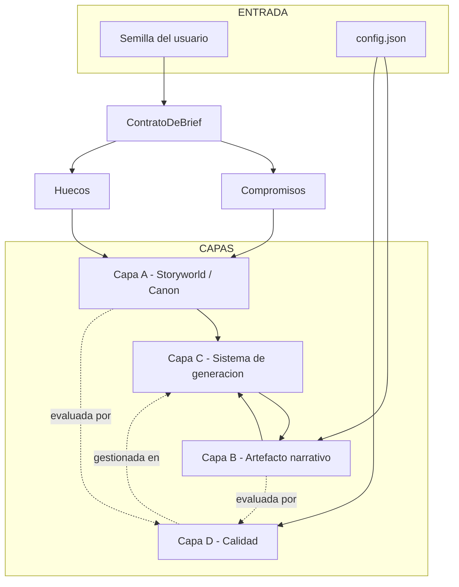
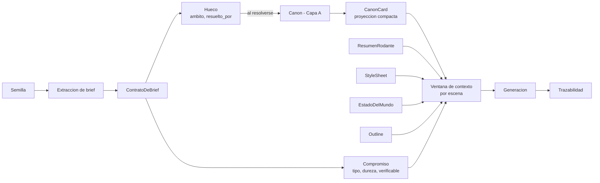
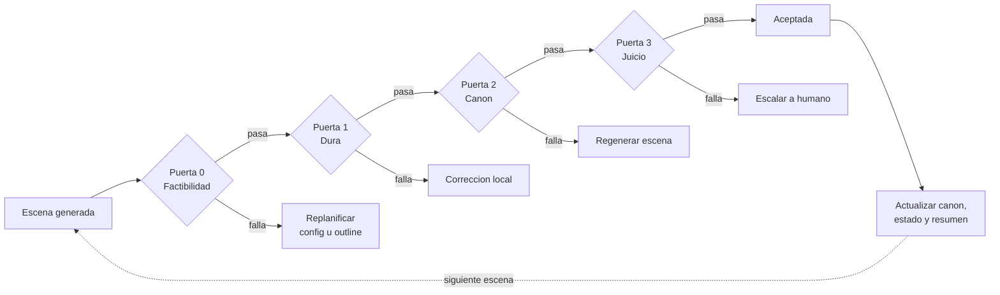
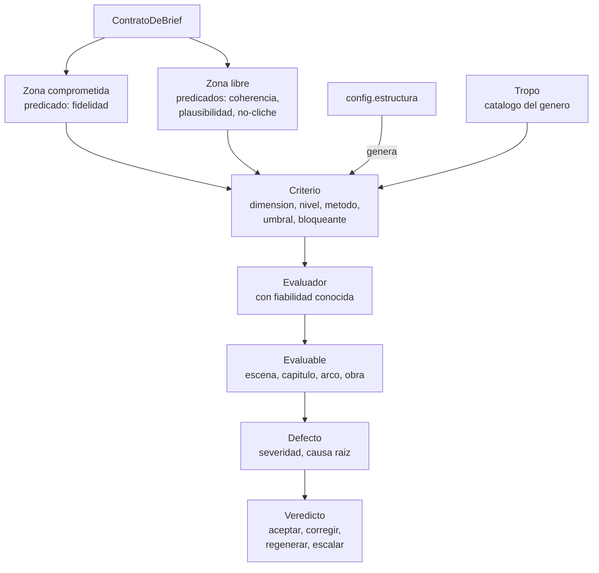
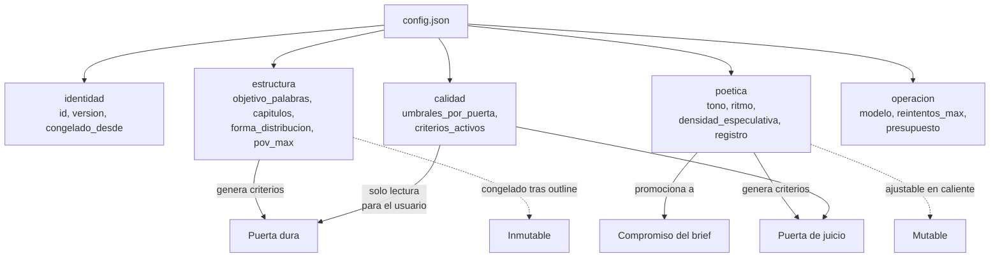
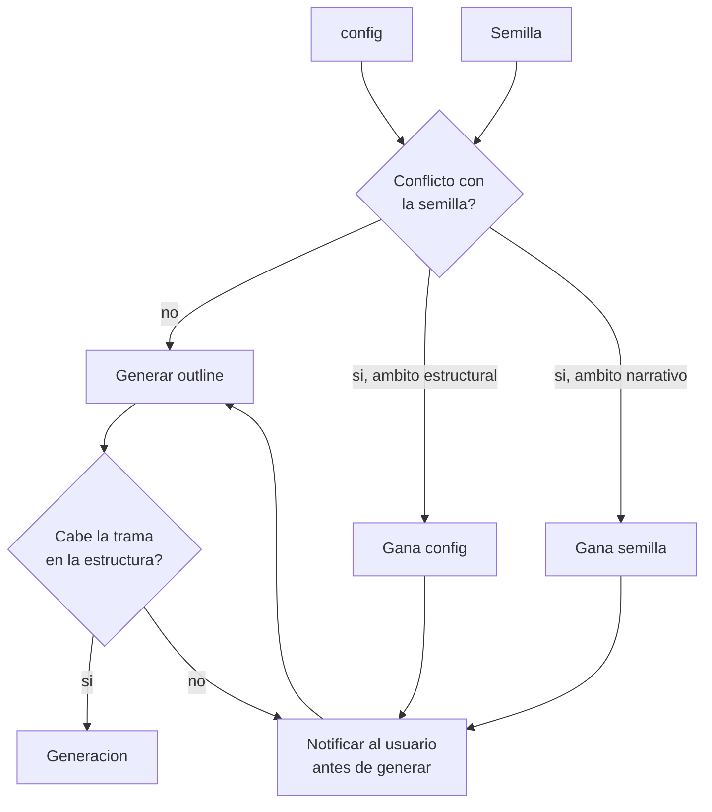
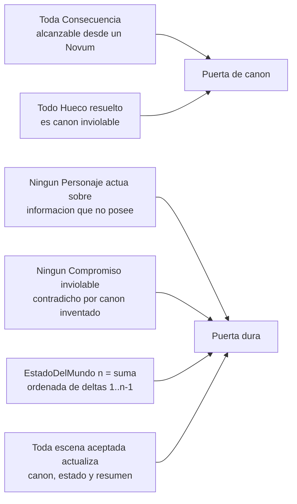

# architecture.md

Decisiones de diseño de la solución: cómo se separan las capas, cómo se gestiona el contexto, cómo se controla la calidad y cómo se configura. El vocabulario está en `definitions.md`; las razones de dominio, en `domain-knowledge.md`.

---

## 1. Separación en capas

### 1.1 Hay tres ontologías, no una

Confundirlas es la principal causa de arquitecturas confusas en este dominio.

| Capa | Qué modela | Pregunta que responde |
|---|---|---|
| **A. Storyworld** | El mundo ficticio y su canon | ¿Qué es verdad dentro de la ficción? |
| **B. Artefacto narrativo** | La novela como objeto estructurado | ¿Cómo está construido el texto? |
| **C. Sistema de generación** | Pipeline, contexto, agentes | ¿Cómo se produce? |

La **calidad (D)** no es una cuarta capa paralela: es un conjunto de predicados que se evalúan *sobre* A y B, y se gestionan *en* C.

### 1.2 Tres fuentes de restricción

Todo lo que condiciona la generación viene de una de estas tres, y conviene no mezclarlas:

- **Semilla / ContratoDeBrief** — la intención del usuario.
- **Canon** — la verdad ficcional ya establecida.
- **config** — los parámetros de forma y operación.

> **Test de frontera:** si el parámetro es una *afirmación sobre el mundo ficticio*, pertenece al ContratoDeBrief. Si no lo es, es config.
> «El protagonista es una IA» → brief. «12 capítulos» → config. «Tono sombrío» → vive en config, pero se *promociona* a Compromiso del contrato. El almacenamiento y la semántica no tienen por qué coincidir.

---

## 2. Extracción del ContratoDeBrief

La semilla es texto libre; el contrato es el objeto sobre el que el resto del sistema razona. La extracción convierte prosa en compromisos y huecos declarados.

Tres propiedades de diseño:

1. **La extracción no es fiable al 100 %.** Un modelo interpretando texto libre confundirá preferencias con requisitos. El contrato debe ser **visible y editable por el usuario antes de generar**: es barato de corregir ahí e imposible después.
2. **Los compromisos no verificables son el punto débil.** «Final ambiguo» no se comprueba con una regla. O se convierte en criterio de la puerta de juicio con rúbrica concreta, o se descarta explícitamente del contrato. Dejarlo dentro sin método de verificación es autoengaño.
3. **Los huecos son de un solo uso.** El contrato registra la intención inicial; el canon registra lo ya decidido. Son objetos distintos y no deben fusionarse.

---

## 3. Gestión de contexto

El patrón viable es **outline-first + recuperación selectiva + validación de deltas**, no «contexto máximo».

Activos de primera clase:

- **Outline** — contrato estable entre planificación y generación; es lo que evita la deriva.
- **CanonCards** — proyecciones compactas recuperadas por escena; nunca se vuelca el canon completo.
- **ResumenRodante** — comprimido acumulativo más las últimas N escenas en literal.
- **StyleSheet** — voz, registro, léxico prohibido, densidad de exposición.
- **EstadoDelMundo** — snapshot mutable, versionado por escena.
- **Trazabilidad** — cada fragmento debería poder apuntar a qué elementos lo justifican.

---

## 4. Marco de calidad

### 4.1 Las cuatro puertas

| Puerta | Método | Qué detecta | Coste |
|---|---|---|---|
| **0. Factibilidad** | Determinista | config inconsistente consigo mismo o con el brief; trama que no cabe en la estructura | Muy bajo |
| **1. Dura** | Determinista | Violación de Restriccion, contradicción temporal, estado epistémico imposible, atributo alterado, compromiso inviolable roto | Bajo |
| **2. Canon** | Recuperación + modelo | Incoherencia con el grafo causal, consecuencia sin premisa, invención que contradice invención previa | Medio |
| **3. Juicio** | Modelo + humano | Prosa, ritmo, disciplina de POV, infodump, cliché, plausibilidad especulativa | Alto |

> El orden es económico, no arbitrario: cada puerta es más cara que la anterior. Una escena que falla la puerta dura no debe consumir presupuesto de juicio. La mayoría de implementaciones invierte este orden y paga de más.

### 4.2 Estructura del marco

Dos reglas de diseño:

- **Todo Evaluador declara su fiabilidad conocida.** Un juez LLM sin calibración medida es ruido con formato de métrica.
- **Todo Defecto registra causa raíz.** Es lo que permite corregir el sistema y no solo el texto.

---

## 5. Configuración

### 5.1 Tres familias

| Familia | Ejemplos | Propiedad clave |
|---|---|---|
| **Estructural** | capítulos, escenas por capítulo, palabras máximas, nº de POVs | Verificable de forma determinista |
| **Poética** | tono, densidad especulativa, ritmo, tecnicismo, ambigüedad del final | Solo evaluable por juicio |
| **Operativa** | modelo, temperatura, reintentos, umbrales, presupuesto | Invisible para el usuario final |

Mezclarlas en un JSON plano funciona hasta la primera vez que el usuario necesita editar la poética sin tocar la operativa.

### 5.2 Reglas

1. **No sobredeterminar.** `capitulos`, `paginas_maximas` y `palabras_por_escena` no son independientes: fijar los tres permite configuraciones aritméticamente imposibles. Declarar **una variable de tamaño** más una **forma de distribución**, y derivar el resto. Un config donde el usuario puede escribir un estado inconsistente es un fallo de diseño, no de validación.
2. **Precedencia declarada.** config gana en lo estructural; la semilla gana en lo narrativo. Ninguna colisión se resuelve en silencio.
3. **Inmutabilidad post-outline.** Los campos estructurales se congelan al aprobar el outline; cambiarlos a mitad de obra invalida el plan y probablemente canon ya establecido. Los poéticos sí pueden ajustarse en caliente.
4. **Cada parámetro estructural genera un Criterio de la puerta dura.** `capitulos: 12` no es solo una instrucción de generación: es una aserción verificable sobre el artefacto final. Si no se materializa como criterio, el config es decorativo.
5. **`calidad` no lo edita el usuario final.** Permitirlo deja bajar los umbrales para que una historia mal configurada «pase», lo que invalida el marco entero. Solo lectura, o fichero de política separado.

---

## 6. Precedencia y conflictos

> Ningún conflicto se resuelve en silencio. El coste de detectar la infactibilidad en el capítulo 9 es el fallo más caro del pipeline; de ahí la puerta 0, que valida sobre el outline y no sobre el texto.

---

## 7. Invariantes y dónde se comprueban

1. Toda `Consecuencia` es alcanzable desde al menos un `Novum`.
2. Todo `Hueco` resuelto pasa a ser canon inviolable.
3. Ningún `Personaje` actúa sobre información ausente de su `EstadoEpistemico` de entrada.
4. Ningún `Compromiso` inviolable es contradicho por canon inventado.
5. El `EstadoDelMundo` en la escena *n* es la aplicación ordenada de todos los `DeltaDeEstado` de las escenas 1..n−1.
6. Toda escena aceptada actualiza canon, estado y resumen rodante antes de generar la siguiente.

---

## 8. Decisiones abiertas

### 8.1 Mecanismo de extracción del ContratoDeBrief

¿Modelo sobre texto libre, formulario guiado, o negociación conversacional con el usuario?

### 8.2 Umbrales por criterio y su calibración

Un criterio dice *qué* medir; el umbral dice *a partir de qué punto se rechaza*. Sin umbral, un criterio no es accionable: un evaluador que devuelve 0.34 de «densidad de infodump» no significa nada hasta fijar los cortes. Demasiado estrictos, el sistema regenera escenas aceptables y el coste se dispara; demasiado laxos, la puerta no filtra nada.

Método:

1. Generar un conjunto de 30–50 escenas variadas.
2. Etiquetado humano: aceptable / corregible / inaceptable. Es el trabajo real y no tiene atajo.
3. Pasar el evaluador y buscar los cortes que mejor reproducen el juicio humano.
4. Medir la concordancia. Baja concordancia no indica un umbral mal puesto, sino un criterio mal definido o un evaluador inservible.

Muchos criterios no sobreviven el paso 4, y eso es información valiosa: mejor tres criterios calibrados que quince inventados. Solo aplica a evaluadores por juicio; los deterministas son binarios.

### 8.3 Política ante conflicto irresoluble

Distinto del conflicto normal, que resuelve la precedencia. Aquí ninguna fuente puede ceder sin romper el resultado: p. ej. una saga de tres generaciones y cinco planetas en 8 capítulos y 40.000 palabras.

| Política | Comportamiento | Coste |
|---|---|---|
| **Bloquear** | Se detiene, explica el conflicto, exige cambio | Fricción; riesgo de abandono |
| **Degradar** | Genera lo posible, recorta ambición, avisa | El usuario percibe mala calidad sin saber que la causó su config |
| **Negociar** | Propone 2–3 ajustes concretos y deja elegir | Más trabajo de producto |

Es una decisión de producto, no técnica. Recomendación: negociar en el momento del outline, bloquear solo ante insistencia en una combinación imposible.

### 8.4 Origen del catálogo de Tropo

- **Fijo (curado):** preciso, explicable, controlable; no escala y envejece.
- **Aprendido (de la producción):** captura los sesgos del modelo propio; necesita volumen y puede confundir clichés con convenciones legítimas.
- **Ambos:** el fijo arranca el sistema, el aprendido lo corrige en producción.

En cualquier caso, el catálogo debe cruzarse con el ContratoDeBrief: un tropo en zona comprometida es intención; en zona libre, defecto.
