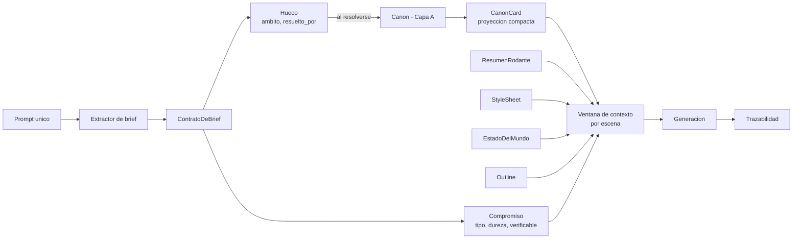
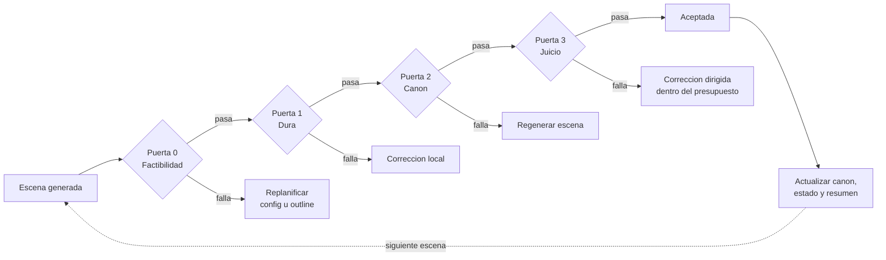
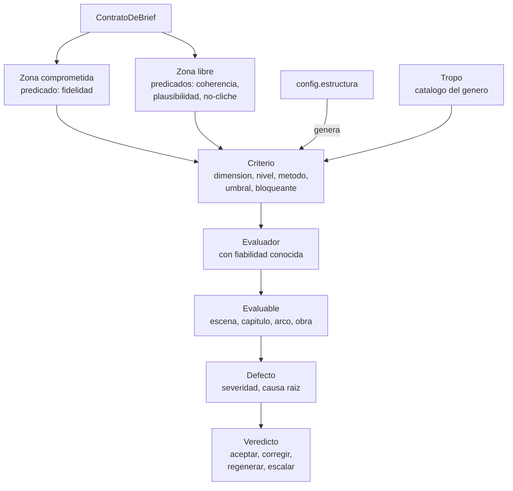
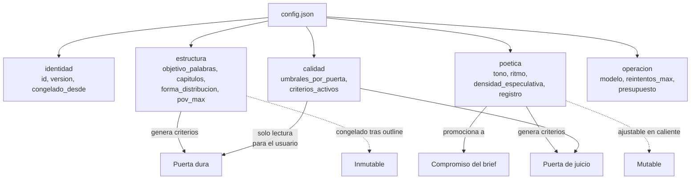
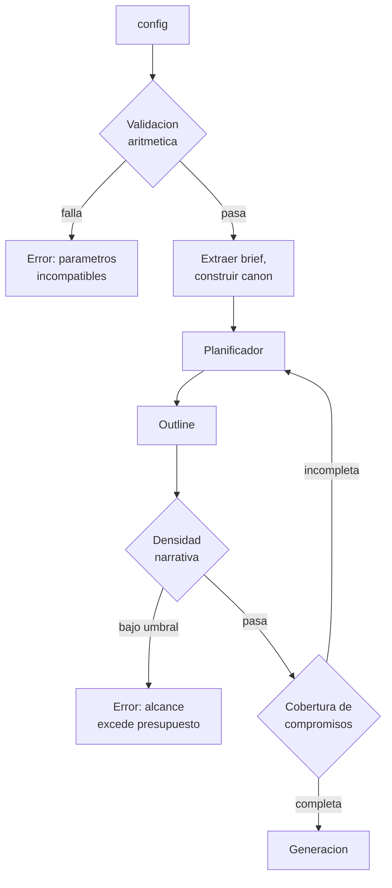
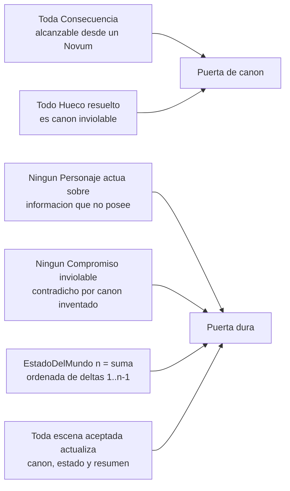
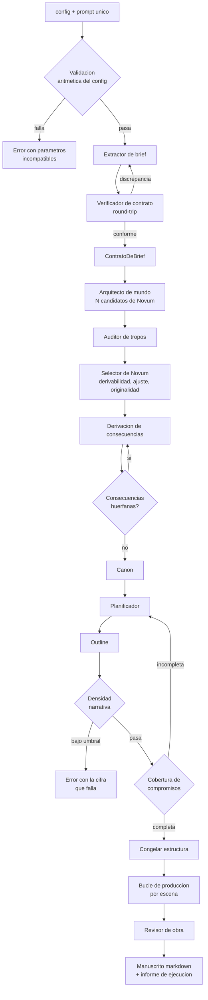
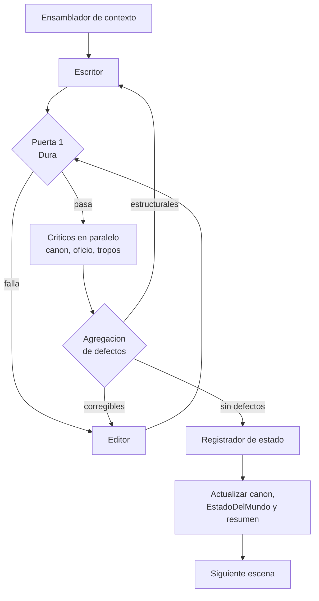
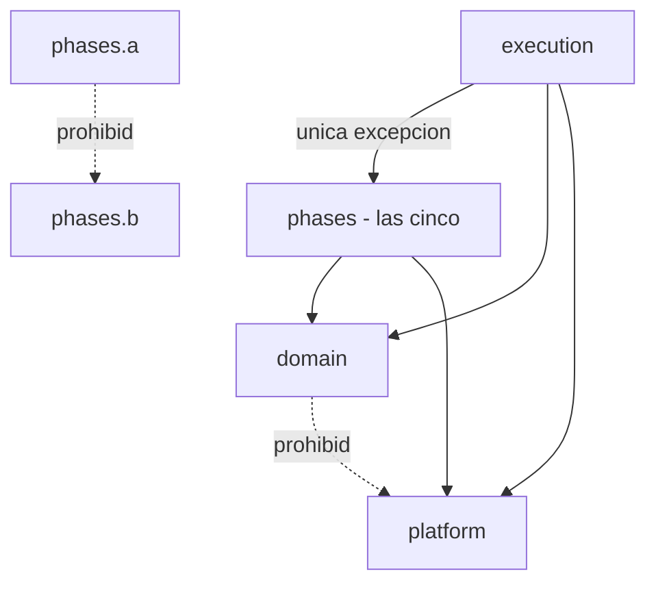

# architecture.md

Decisiones de diseño de la solución: cómo se separan las capas, cómo se gestiona el contexto, cómo se controla la calidad y cómo se configura. El vocabulario está en `definitions.md`; las razones de dominio, en `domain-knowledge.md`.

---

## 1. Separación en capas

### 1.1 Hay tres ontologías, no una

Confundirlas es la principal causa de arquitecturas confusas en este dominio.

| Capa | Qué modela | Pregunta que responde |
|---|---|---|
| **A. Storyworld** | El mundo ficticio y su canon | ¿Qué es verdad dentro de la ficción? |
| **B. Artefacto narrativo** | La novela como objeto estructurado | ¿Cómo está construido el texto? |
| **C. Sistema de generación** | Pipeline, contexto, agentes | ¿Cómo se produce? |

La **calidad (D)** no es una cuarta capa paralela: es un conjunto de predicados que se evalúan *sobre* A y B, y se gestionan *en* C.


### 1.2 Tres fuentes de restricción

Todo lo que condiciona la generación viene de una de estas tres, y conviene no mezclarlas:

- **Prompt / ContratoDeBrief** — la intención del usuario.
- **Canon** — la verdad ficcional ya establecida.
- **config** — los parámetros de forma y operación.

> **Test de frontera:** si el parámetro es una *afirmación sobre el mundo ficticio*, pertenece al ContratoDeBrief. Si no lo es, es config.
> «El protagonista es una IA» → brief. «12 capítulos» → config. «Tono sombrío» → vive en config, pero se *promociona* a Compromiso del contrato. El almacenamiento y la semántica no tienen por qué coincidir.

---

## 2. Extracción del ContratoDeBrief

El prompt del usuario es texto libre; el contrato es el objeto sobre el que el resto del sistema razona. La extracción convierte prosa en compromisos y huecos declarados.

Tres propiedades de diseño:

1. **La extracción no es fiable al 100 %.** Un modelo interpretando texto libre confundirá preferencias con requisitos. Al no haber revisión humana, la comprobación es el verificador de ida y vuelta (§8.10), y ante ambigüedad se clasifica como Hueco, no como Compromiso.
2. **Los compromisos no verificables son el punto débil.** «Final ambiguo» no se comprueba con una regla. O se convierte en criterio de la puerta de juicio con rúbrica concreta, o se descarta explícitamente del contrato. Dejarlo dentro sin método de verificación es autoengaño.
3. **Los huecos son de un solo uso.** El contrato registra la intención inicial; el canon registra lo ya decidido. Son objetos distintos y no deben fusionarse.

---

## 3. Gestión de contexto

El patrón viable es **outline-first + recuperación selectiva + validación de deltas**, no «contexto máximo».



Activos de primera clase:

- **Outline** — contrato estable entre planificación y generación; es lo que evita la deriva.
- **CanonCards** — proyecciones compactas recuperadas por escena; nunca se vuelca el canon completo.
- **ResumenRodante** — comprimido acumulativo más las últimas N escenas en literal.
- **StyleSheet** — voz, registro, léxico prohibido, densidad de exposición.
- **EstadoDelMundo** — snapshot mutable, versionado por escena.
- **Trazabilidad** — cada fragmento debería poder apuntar a qué elementos lo justifican.

---

## 4. Marco de calidad

### 4.1 Las cuatro puertas

| Puerta | Método | Qué detecta | Coste |
|---|---|---|---|
| **0. Factibilidad** | Determinista | config inconsistente consigo mismo; densidad narrativa por debajo del mínimo; compromisos sin cobertura en el outline | Muy bajo |
| **1. Dura** | Determinista | Violación de Restriccion, contradicción temporal, estado epistémico imposible, atributo alterado, compromiso inviolable roto | Bajo |
| **2. Canon** | Recuperación + modelo | Incoherencia con el grafo causal, consecuencia sin premisa, invención que contradice invención previa | Medio |
| **3. Juicio** | Modelo con rúbrica | Prosa, ritmo, disciplina de POV, infodump, cliché, plausibilidad especulativa | Alto |



> El orden es económico, no arbitrario: cada puerta es más cara que la anterior. Una escena que falla la puerta dura no debe consumir presupuesto de juicio. La mayoría de implementaciones invierte este orden y paga de más.

### 4.2 Estructura del marco



Dos reglas de diseño:

- **Todo Evaluador declara su fiabilidad conocida.** Un juez LLM sin calibración medida es ruido con formato de métrica.
- **Todo Defecto registra causa raíz.** Es lo que permite corregir el sistema y no solo el texto.

---

## 5. Configuración

### 5.1 Tres familias

| Familia | Ejemplos | Propiedad clave |
|---|---|---|
| **Estructural** | capítulos, escenas por capítulo, palabras máximas, nº de POVs | Verificable de forma determinista |
| **Poética** | tono, densidad especulativa, ritmo, tecnicismo, ambigüedad del final | Solo evaluable por juicio |
| **Operativa** | modelo, temperatura, reintentos, umbrales, presupuesto | Invisible para el usuario final |

Mezclarlas en un JSON plano funciona hasta la primera vez que el usuario necesita editar la poética sin tocar la operativa.



### 5.2 Reglas

1. **No sobredeterminar.** `capitulos`, `paginas_maximas` y `palabras_por_escena` no son independientes: fijar los tres permite configuraciones aritméticamente imposibles. Declarar **una variable de tamaño** más una **forma de distribución**, y derivar el resto. Un config donde el usuario puede escribir un estado inconsistente es un fallo de diseño, no de validación.
2. **Precedencia declarada.** config gana en lo estructural; el prompt gana en lo narrativo. Ninguna colisión se resuelve en silencio.
3. **Inmutabilidad post-outline.** Los campos estructurales se congelan al aprobar el outline; cambiarlos a mitad de obra invalida el plan y probablemente canon ya establecido. Los poéticos sí pueden ajustarse en caliente.
4. **Cada parámetro estructural genera un Criterio de la puerta dura.** `capitulos: 12` no es solo una instrucción de generación: es una aserción verificable sobre el artefacto final. Si no se materializa como criterio, el config es decorativo.
5. **`calidad` no lo edita el usuario final.** Permitirlo deja bajar los umbrales para que una historia mal configurada «pase», lo que invalida el marco entero. Solo lectura, o fichero de política separado.

---

## 6. Precedencia y conflictos

### 6.1 Precedencia ordinaria

config gana en lo estructural; el prompt gana en lo narrativo. Ninguna colisión se resuelve en silencio: toda resolución queda registrada en el informe de ejecución.

### 6.2 Los dos tipos de imposible

En operación autónoma no hay a quién preguntar, y se decidió **bloquear en ambos casos**. La degradación silenciosa queda descartada como mecanismo.

| Tipo | Ejemplo | Cuándo se detecta | Acción |
|---|---|---|---|
| **Aritmético** | 40 capítulos × 4 escenas × 800 palabras mínimas dentro de un objetivo de 40.000 | Validación de entrada, antes de ejecutar nada | Error inmediato, nombrando los parámetros incompatibles |
| **Densidad** | «tres generaciones, cinco planetas» en 40.000 palabras | Puerta 0, sobre el outline | Error, nombrando la cifra que falla |

### 6.3 Densidad narrativa

Para que el segundo caso sea bloqueable hace falta una métrica; bloquear por juicio de modelo es rechazo arbitrario.

```
densidad = objetivo_palabras / nº elementos estructurales
```

Donde los elementos estructurales son POVs, saltos temporales mayores, localizaciones principales e hilos argumentales. Por debajo de `config.calidad.densidad_minima`, se bloquea con un mensaje que nombra el número:

> «El prompt implica 14 elementos estructurales; con 40.000 palabras quedan 2.900 por elemento, por debajo del mínimo de 6.000. Reduzca el alcance o suba a 85.000 palabras.»

Un error que nombra la cifra es accionable; «no es posible» no lo es.



> Consecuencia de descartar la degradación: ya no hace falta un orden de prioridad entre compromisos, porque nunca hay que elegir qué sacrificar.

---

## 7. Invariantes y dónde se comprueban

1. Toda `Consecuencia` es alcanzable desde al menos un `Novum`.
2. Todo `Hueco` resuelto pasa a ser canon inviolable.
3. Ningún `Personaje` actúa sobre información ausente de su `EstadoEpistemico` de entrada.
4. Ningún `Compromiso` inviolable es contradicho por canon inventado.
5. El `EstadoDelMundo` en la escena *n* es la aplicación ordenada de todos los `DeltaDeEstado` de las escenas 1..n−1.
6. Toda escena aceptada actualiza canon, estado y resumen rodante antes de generar la siguiente.



---

## 8. Sistema de agentes

### 8.1 Premisas de operación

1. **Autonomía total.** No hay intervención humana en ningún punto de la ejecución.
2. **Entrada mínima.** Dos cosas: el `config` y un único prompt del usuario, con la información que él decida dar. No hay preguntas de aclaración ni pasos de confirmación.
3. **Generación secuencial.** Las escenas se producen en orden, porque cada una depende del estado que deja la anterior.

### 8.2 Principio de asignación: qué es y qué no es un agente

No todo paso del pipeline es un agente. Convertir cada puerta en uno paga latencia, coste y no determinismo por comprobaciones que son código. La asignación se hace por naturaleza de la tarea:

| Tipo | Cuándo | Cuántos |
|---|---|---|
| **Código** | La respuesta es calculable | 7 |
| **Modelo en un paso** | Requiere comprensión, no exploración | 6 |
| **Agente (bucle + herramientas)** | Requiere explorar, consultar canon y decidir en varios pasos | 5 |

### 8.3 Los cinco agentes

| Agente | Fase | Entrada | Salida |
|---|---|---|---|
| **Arquitecto de mundo** | 1 | ContratoDeBrief | N candidatos de Novum, Restricciones, grafo de Consecuencias |
| **Planificador** | 2 | Canon, contrato, config | Outline jerárquico |
| **Escritor** | 3 | Ventana de contexto | Texto de escena + delta pretendido |
| **Editor** | 3 | Escena + defectos | Escena corregida |
| **Revisor de obra** | 4 | Manuscrito completo | Defectos de nivel obra |

> **Escritor y editor se mantienen separados.** Podrían fusionarse en un agente con dos modos —el argumento anticomplacencia aplica a criticar, no a corregir—, pero mantenerlos distintos permite medir por separado la calidad de escritura y la de corrección.

### 8.4 Llamadas de modelo en un paso

| Componente | Fase | Función |
|---|---|---|
| **Extractor de brief** | 0 | Prompt → ContratoDeBrief |
| **Verificador de contrato** | 0 | Comprobación de ida y vuelta contra el prompt original |
| **Auditor de tropos** | 1 y 3 | Puntúa solapamiento con el catálogo |
| **Crítico de canon** | 3 | Defectos de coherencia contra el grafo causal |
| **Crítico de oficio** | 3 | Defectos de prosa, ritmo y POV |
| **Registrador de estado** | 3 | Extrae el DeltaDeEstado real del texto aceptado |

### 8.5 Componentes de código

Validador de config, orquestador, ensamblador de contexto, puerta dura, selector de novum, aplicador de estado y redactor del informe. Ninguno necesita un modelo.

### 8.6 Flujo por fases



### 8.7 Bucle de producción por escena



### 8.8 Reglas de interacción

1. **Separación escritor / críticos.** El mismo agente no escribe y se autoevalúa: ya posee el contexto que justificó sus decisiones y su autocrítica es complaciente. Los críticos reciben la escena y el canon, no el razonamiento del escritor.
2. **Los críticos no reescriben.** Devuelven `Defecto` tipados. Detectar y corregir son competencias distintas; fusionarlas impide medir la fiabilidad de la detección.
3. **Críticos en paralelo.** Canon, oficio y tropos son independientes. Encadenarlos en serie multiplica latencia sin mejorar cobertura.
4. **El estado se extrae, no se asume.** El escritor declara el delta que pretendía; el registrador lee el texto aceptado y extrae el delta real. Una divergencia entre ambos es un defecto de la puerta dura.
5. **Presupuesto de reintentos por escena.** Sin él, una escena imposible consume el presupuesto de la obra.
6. **Ningún agente escribe en canon directamente.** Solo el registrador, y solo tras un veredicto de aceptación. Es lo que impide que una escena rechazada contamine el estado.

### 8.9 Pase global (fase 4)

Hay defectos que no existen a nivel de escena y que ninguna evaluación local detecta:

- Ritmo y curva de tensión a lo largo de la obra.
- Cobertura de arcos: hilos abiertos sin cerrar.
- Repetición léxica y de estructuras entre escenas distantes.
- Deriva de voz entre el primer tercio y el último.
- Consecuencias del canon establecidas y nunca usadas.

El revisor de obra opera sobre el manuscrito completo y sus resúmenes, y sus defectos se resuelven con reescritura dirigida de escenas concretas, no con regeneración global.

### 8.10 Operación autónoma: qué sustituye a la supervisión

Cada punto donde intervendría una persona necesita un mecanismo propio.

**Contrato → verificación de ida y vuelta.** El riesgo es que el extractor confunda una preferencia con un requisito, o pierda uno. La comprobación es reconstructiva: a partir del `ContratoDeBrief`, un verificador independiente redacta una paráfrasis del prompt y la contrasta con el original. Lo que aparezca en el prompt y no en la paráfrasis es un compromiso perdido; lo que aparezca con más firmeza en la paráfrasis es una preferencia ascendida indebidamente. Ante ambigüedad irresoluble, la política por defecto es **clasificar como Hueco, no como Compromiso**: un compromiso inventado restringe toda la obra, un hueco solo la deja abierta.

**Novum → selección por puntuación.** El arquitecto genera N candidatos; pedirle uno solo garantiza el más obvio. El selector puntúa cada uno en derivabilidad (consecuencias de 2.º y 3.er orden que admite), ajuste a los compromisos, y distancia al catálogo de tropos. El tercer eje es el que evita la convergencia al cliché y **exige que el catálogo curado exista desde el primer día**: sin él, un novum trillado puntúa perfectamente en los otros dos ejes.

**Outline → dos comprobaciones deterministas.** Densidad narrativa y cobertura de compromisos. Un compromiso que no aparece en el plan no aparecerá en la novela.

**Supervisión → informe de ejecución.** El manuscrito se entrega acompañado de: compromisos cumplidos, compromisos no verificables, huecos resueltos y con qué, novum elegido y su puntuación, defectos no resueltos con su localización, y presupuesto consumido.

> Un sistema autónomo no es un sistema sin supervisión: es un sistema que produce su propia evidencia de lo que hizo. El informe no es documentación opcional, es el sustituto funcional del revisor.

### 8.11 El caso extremo: prompt casi vacío

Con una entrada del tipo «escribe una novela sobre IA», el contrato queda con cero compromisos y grado de libertad 1.0. El arquitecto trabaja sin ninguna restricción y el selector de novum es lo único que impide el cliché puro.

Es el caso que más se va a usar y el que menos margen deja. Debe probarse desde el primer día, no al final.

---

## 9. Stack e implicaciones

### 9.1 Elección

| Capa | Tecnología |
|---|---|
| Backend y orquestación | Python 3.12+ con FastAPI y Pydantic v2; dependencias con `uv` |
| Persistencia | SQLAlchemy 2 sobre SQLite |
| Frontend | Vite + React + TypeScript en modo estricto, Tailwind CSS; dependencias con `pnpm` |
| Salida | Markdown |

Verificación del stack (el método y su clase T/A/I/D/U viven en `verification.md`): Ruff en el backend; comprobación de tipos de TypeScript, ESLint y build de producción en el frontend; evaluadores en vivo declarados explícitamente; y un recorrido manual del flujo completo en el navegador.

Validación de NIF-IVA: estructura y dígito de control de la UE en local con `python-stdnum`; no se afirma consulta en vivo a VIES.

### 9.2 Reparto de responsabilidades

Todo el sistema de agentes vive en el backend. El frontend no orquesta nada.

| Componente del diseño | Dónde |
|---|---|
| Validador de config, orquestador, puertas, selector, aplicador de estado | Python, código puro |
| Agentes y llamadas de modelo | Python, servicios asíncronos |
| Canon, outline, estado del mundo, manuscrito | Persistencia del backend |
| Formulario de config, campo de prompt, progreso, visor del manuscrito e informe | React |

El frontend es deliberadamente delgado: al no haber revisión humana, no hay pantallas de aprobación, edición de contrato ni selección de novum. Recoge dos entradas, muestra progreso y presenta dos salidas.

#### Organización del backend: una slice por fase

El corte es vertical y sigue las fases de §8.6. Cada slice contiene todo lo que su fase necesita —su agente, sus llamadas de modelo en un paso, sus puertas, su persistencia y sus pruebas— y nada de lo que necesitan las demás.

```
backend/
  pyproject.toml
  src/story_maker/
    phases/
      brief_extraction/
      world_building/
      planning/
      scene_production/
      work_review/
    execution/
    domain/
    platform/
```

`execution` es la sexta slice y no es una fase: posee la superficie HTTP de §9.4, el estado del trabajo y el informe de ejecución. Por eso no cuelga de `phases/`.

**No hay `commons`, `shared` ni `utils`.** Una carpeta llamada «lo común» no declara ninguna responsabilidad, así que acaba aceptándolo todo. En su lugar, dos módulos con nombre y frontera declarada:

| Módulo | Contiene | No contiene |
|---|---|---|
| `domain` | Los datos del dominio —`ContratoDeBrief`, `Canon`, `Outline`, `EstadoDelMundo`, `ResumenRodante`, `Defecto`, la obra— y los seis invariantes de §7 como funciones puras | Nada de I/O: ni HTTP, ni SQL, ni llamadas de modelo |
| `platform` | Orquestador, worker, puerto del proveedor de modelo, persistencia, config | Ningún término de `definitions.md` |

#### Regla de dependencia



1. **Ninguna fase importa a otra fase.** Se comunican por artefacto persistido: una fase escribe su salida, el orquestador la encadena con la siguiente. El acoplamiento es el artefacto, no el módulo.
2. **Ninguna fase importa `execution`.** Una fase no sabe que existe una API ni un trabajo asíncrono.
3. **`execution` importa las cinco fases.** Es la única excepción, y está declarada: alguien tiene que invocarlas.
4. **`domain` no importa nada.** Ni `platform`, ni `phases`, ni `execution`. Es lo que lo mantiene puro y comprobable sin dobles.

Esta regla no es una convención: es un contrato comprobado en CI (`verification.md` §3.9).

#### Qué sale de una slice y qué se duplica

Algo abandona una slice solo si se cumplen **las dos** condiciones: lo usan dos fases o más, **y** tiene entrada en `definitions.md` o es un invariante de §7. Si falla cualquiera de las dos, se duplica.

Se comparten datos, no comportamiento. El catálogo de tropos es dato y vive en `domain`; el auditor de tropos es comportamiento y existe dos veces, una en `world_building` y otra en `scene_production`.

La frontera fina: **se duplica el juicio, no la regla.**

- El auditor de tropos *puntúa*, y puntúa cosas distintas en la fase 1 —originalidad de un novum candidato— y en la fase 3 —cliché en la prosa de una escena—. Dos juicios distintos con el mismo nombre; unificarlos crearía un parámetro para elegir cuál de los dos se quería.
- Un invariante de §7 *se cumple o no*, igual en toda fase. Si dos fases lo comprobaran de forma distinta, dejaría de ser un invariante. Los seis viven una sola vez, en `domain`.
- El comportamiento que no menciona ningún término de `definitions.md` —HTTP, SQL, reintentos, serialización— no se duplica nunca: va a `platform`.

Las pruebas viven dentro de cada slice. Una slice es una unidad que se puede leer entera, mover entera y borrar entera; separar sus pruebas rompe esa propiedad justo cuando más se necesita.

#### Nombres

Las carpetas y los módulos van en inglés. `definitions.md` sigue siendo la autoridad de nomenclatura: esta tabla no introduce sinónimos, declara la proyección de cada término a identificador. Fuera de esta tabla no se traduce nada por cuenta propia.

| Fase (§8.6) | Slice |
|---|---|
| Extracción de brief | `phases/brief_extraction` |
| Arquitectura de mundo | `phases/world_building` |
| Planificación | `phases/planning` |
| Producción por escena | `phases/scene_production` |
| Revisión de obra | `phases/work_review` |

| Término | Identificador | Término | Identificador |
|---|---|---|---|
| `Novum` | `novum` | `CanonCard` | `canon_card` |
| `Consecuencia` | `consequence` | `ResumenRodante` | `rolling_summary` |
| `Restriccion` | `constraint` | `StyleSheet` | `style_sheet` |
| `Personaje` | `character` | `EstadoDelMundo` | `world_state` |
| `Faccion` | `faction` | `EstadoEpistemico` | `epistemic_state` |
| `Localizacion` | `location` | `DeltaDeEstado` | `state_delta` |
| `Evento` | `event` | `Trazabilidad` | `traceability` |
| `LineaTemporal` | `timeline` | `Criterio` | `criterion` |
| `Obra` | `work` | `Evaluador` | `evaluator` |
| `Capitulo` | `chapter` | `Evaluable` | `evaluable` |
| `Escena` | `scene` | `Defecto` | `defect` |
| `Outline` | `outline` | `Veredicto` | `verdict` |
| `ContratoDeBrief` | `brief_contract` | `Tropo` | `trope` |
| `Compromiso` | `commitment` | `CatalogoDeTropos` | `trope_catalog` |
| `Hueco` | `gap` | `InformeDeEjecucion` | `execution_report` |

#### Frontend: Feature-Sliced Design

El frontend sigue **Feature-Sliced Design v2.1** con tres capas: `app`, `pages` y `shared`. En FSD las capas son opcionales y la regla es empezar por lo simple y extraer cuando haga falta, así que tres capas no son un subconjunto informal: son FSD aplicado a un cliente delgado.

```
frontend/
  src/
    app/       providers, router, tema, estilos globales
    pages/     new-run/   progress/   manuscript/
    shared/    api/  ui/  lib/  config/
```

| Capa | Responsabilidad |
|---|---|
| `app` | Inicialización: providers, enrutado, Tailwind global |
| `pages` | Composición por ruta. Cada página es dueña de su lógica, su obtención de datos y su UI |
| `shared` | Infraestructura sin reglas de negocio: cliente de API, kit de UI, utilidades. No tiene slices; se organiza por segmentos |

Reglas de FSD que se aplican:

1. **Solo se importa hacia capas inferiores:** `app` → `pages` → `shared`. Nunca hacia arriba, y dos slices de la misma capa no se importan entre sí.
2. **API pública:** una página se consume por su `index`; en `shared` la API pública es por segmento —`shared/api`, `shared/ui`—, no un `index` único de toda la capa.
3. **Lo que usa una sola página se queda en esa página.** Duplicar entre páginas es aceptable; extraer no lo es hasta que el bloque tenga consumidores reales y razón de cambio propia.
4. **`entities` y `features` no se crean vacías.** Se incorporan cuando aparezca reutilización real. `widgets` no se usa: la propia documentación de FSD lo desaconseja porque su frontera con `features` es ambigua.

`shared/api` contiene el **cliente generado** del esquema OpenAPI que FastAPI deriva de los modelos Pydantic de §9.4. Tres decisiones que van juntas:

- El esquema se exporta **en estático** desde la aplicación FastAPI, sin arrancar un servidor.
- El cliente generado **se commitea**, para que la comprobación de tipos y el build funcionen sin levantar el backend.
- **CI regenera y falla si hay diferencia** con lo commiteado (`verification.md` §3.10). Sin esa comprobación, generar es un paso opcional que alguien se salta, y los tipos vuelven a ser manuales por la vía de los hechos.

Tipos de transporte en `shared` son FSD válido; reglas de negocio, no. Y si el frontend deja de ser delgado —pantallas de aprobación, edición de contrato, selección de novum—, `entities` y `features` vuelven a evaluarse. Hoy no existe ninguna de esas pantallas, por decisión de §8.1.

> Esta estructura es el destino acordado, no un andamiaje que crear ahora. Ninguna carpeta se crea hasta que una spec la exija.


### 9.3 La ejecución no cabe en una petición HTTP

Una novela completa son decenas o cientos de escenas, cada una con generación, críticos y posible corrección. El tiempo total se mide en minutos u horas, no en segundos.

Consecuencias directas:

1. **La generación es un trabajo asíncrono, no un endpoint síncrono.** FastAPI recibe la petición, crea el trabajo y devuelve un identificador. La ejecución corre en un *worker* aparte.
2. **El progreso se transmite, no se espera.** Server-Sent Events para el avance en vivo, o *polling* sobre el estado del trabajo. SSE encaja mejor con FastAPI y es suficiente: el flujo es unidireccional.
3. **Hace falta punto de control por escena.** Si el proceso cae en la escena 80, reanudar desde cero es inaceptable. El `EstadoDelMundo` ya está versionado por escena en el diseño, así que el punto de control natural ya existe: basta con persistirlo.

### 9.4 Contrato de API mínimo

```
POST   /runs              { config, prompt }        -> { run_id }
GET    /runs/{id}                                   -> { estado, fase, escena_actual }
GET    /runs/{id}/stream                            -> SSE de progreso
GET    /runs/{id}/manuscript                        -> markdown
GET    /runs/{id}/report                            -> informe de ejecución
DELETE /runs/{id}                                   -> cancelar
```

Los errores de bloqueo (§6.2) se devuelven en el `POST` cuando son aritméticos —validación inmediata— y en el estado del trabajo cuando son de densidad, porque requieren haber construido el outline.

### 9.5 Lo que el stack decide por nosotros

**La persistencia deja de ser opcional.** Estaba aplazada como decisión abierta (reutilizar canon entre ejecuciones), pero la ejecución larga obliga a persistir el estado *dentro* de una misma ejecución. Una vez que existe ese almacén, reutilizar canon entre intentos pasa a ser casi gratis: queda como decisión de producto, no de arquitectura.

**Los agentes necesitan límites de tiempo propios.** Un agente con bucle y sin techo puede colgar el trabajo entero. Cada uno lleva su propio tiempo máximo, además del presupuesto de reintentos por escena.

**El frontend no debe cachear el manuscrito parcial como verdad.** Una escena mostrada durante el progreso puede ser regenerada por el revisor de obra en la fase 4. Solo el manuscrito final es definitivo.

---

## 10. Decisiones abiertas

### 10.1 Regla de conteo de elementos estructurales

La densidad narrativa se define sobre «elementos estructurales», pero decidir que «cinco planetas» son cinco localizaciones principales y no una es un juicio, no aritmética. Si lo hace un modelo, la validación deja de ser determinista.

Hay que fijar qué cuenta, qué no, y si se cuenta sobre el prompt o sobre el canon derivado. **Arranque:** puerta permisiva, endurecida con producción real.

### 10.2 Umbral de densidad y umbrales de los criterios de juicio

`densidad_minima` está sin calibrar; cualquier cifra hoy es inventada. Lo mismo aplica a los umbrales de la puerta 3.

Método para los criterios de juicio:

1. Generar un conjunto de 30–50 escenas variadas.
2. Etiquetado humano *offline*: aceptable / corregible / inaceptable. Es el trabajo real y no tiene atajo.
3. Pasar el evaluador y buscar los cortes que mejor reproducen ese juicio.
4. Medir la concordancia. Baja concordancia no indica un umbral mal puesto, sino un criterio mal definido o un evaluador inservible.

Muchos criterios no sobreviven el paso 4, y eso es información valiosa: mejor tres criterios calibrados que quince inventados.

Para la densidad, la calibración se hace contra novelas reales del género: contar sus elementos y su longitud.

### 10.3 Fragilidad del verificador de contrato

Riesgo asumido, no tarea. Un modelo comprobando a otro modelo puede compartir el mismo sesgo, y con un único prompt de entrada un fallo del extractor se propaga a la obra entera sin detección posterior: el resto del pipeline solo ve el contrato, nunca el prompt.

Mitigaciones parciales: usar un modelo distinto para verificar, o complementar el parafraseo con comprobaciones por reglas. Ninguna elimina el riesgo.

### 10.4 Reutilización de canon entre ejecuciones

La persistencia *dentro* de una ejecución ya no es opcional (§9.5). Lo que queda por decidir es si el usuario puede reintentar con el config corregido y aprovechar el mundo ya construido.

Si la respuesta es afirmativa, el arquitecto de mundo necesita un modo «reutilizar canon» que hoy no existe. Es ahora una decisión de producto, no de arquitectura: el almacén ya estará ahí.

### 10.5 Presupuesto global de ejecución

Hay presupuesto de reintentos por escena, pero no un techo de coste o tiempo para la ejecución completa. Sin él, una novela con muchas escenas difíciles puede dispararse.

---

## 11. Decisiones cerradas

Registro de lo acordado, para no reabrirlo sin motivo.

| Decisión | Valor |
|---|---|
| Supervisión | Ninguna; sistema autónomo de extremo a extremo |
| Entrada | `config` + un único prompt del usuario |
| Generación | Secuencial por escena |
| Formato de salida | Markdown, único formato soportado |
| Stack | Backend: Python 3.12+, FastAPI, Pydantic v2, SQLAlchemy 2, SQLite, `uv`. Frontend: Vite, React, TypeScript estricto, Tailwind CSS, `pnpm` |
| Modelo de ejecución | Trabajo asíncrono con punto de control por escena |
| Ante imposible | Bloquear con error accionable; nunca degradar |
| Criterio de bloqueo por alcance | Densidad narrativa |
| Orden de prioridad entre compromisos | No necesario, al descartarse la degradación |
| Agentes | 5; escritor y editor separados |
| Catálogo de tropos | Curado desde el día uno; extracción del modelo cruzada con 20–30 novums de prompt vacío |
| Organización del backend | Slice vertical por fase (§8.6) más `execution`; `domain` y `platform` con nombre propio; sin `commons` |
| Organización del frontend | Feature-Sliced Design v2.1 con `app`, `pages` y `shared`; `entities` y `features` diferidas, `widgets` descartada |
| Aislamiento entre slices | Ninguna fase importa a otra; `execution` → `phases` es la única excepción; contrato comprobado en CI |
| Tipos del cliente de API | Generados del esquema OpenAPI, commiteados, con comprobación de deriva en CI |
| Ubicación de las pruebas | Dentro de cada slice |
