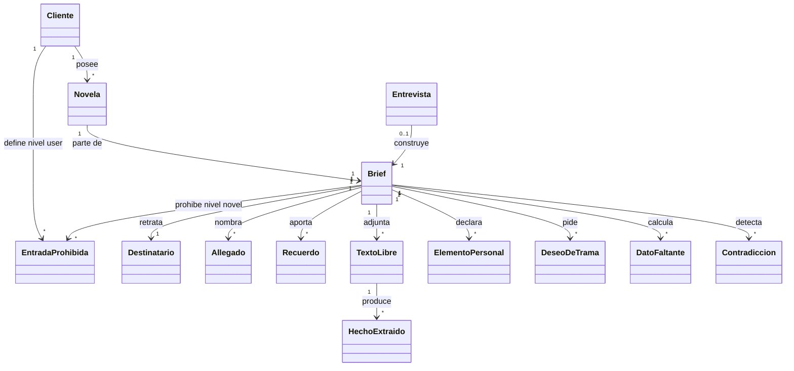
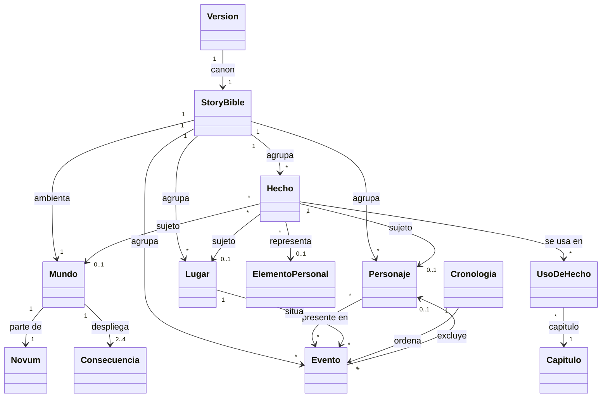
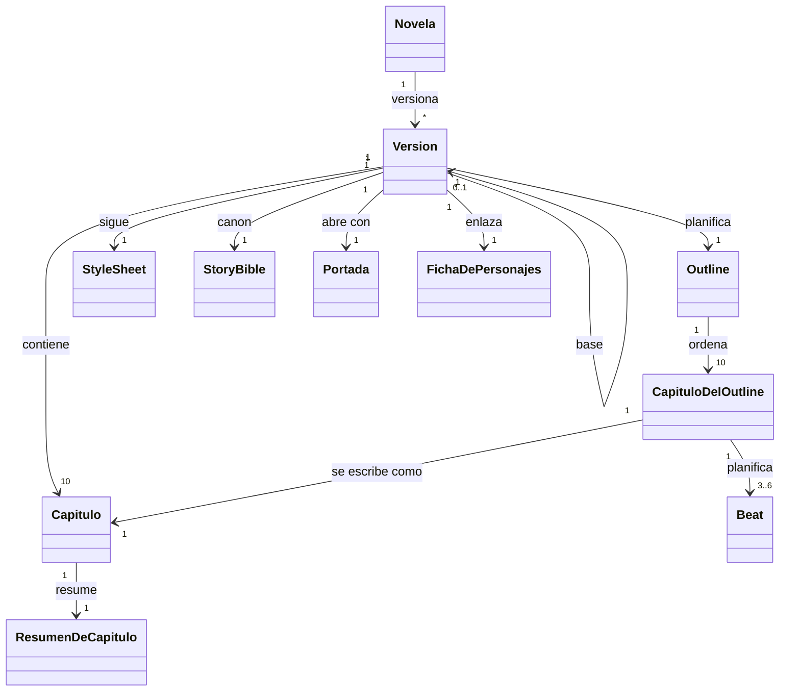
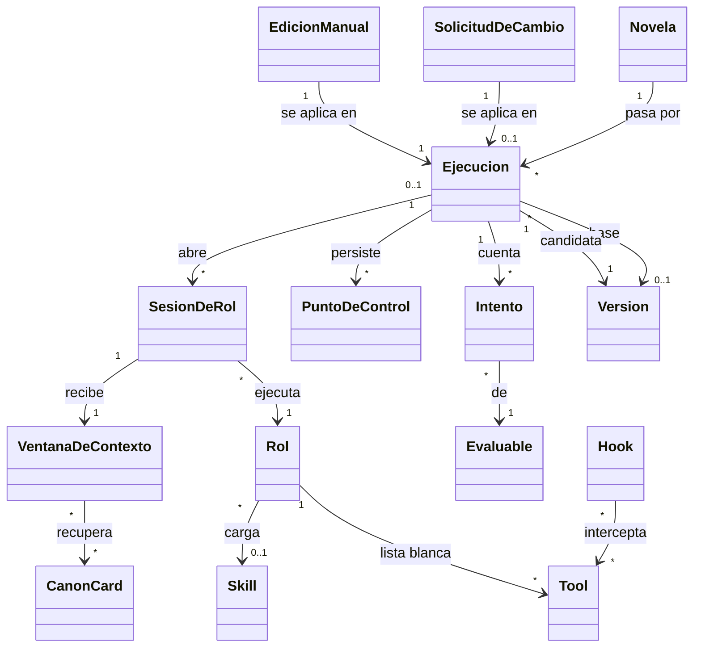
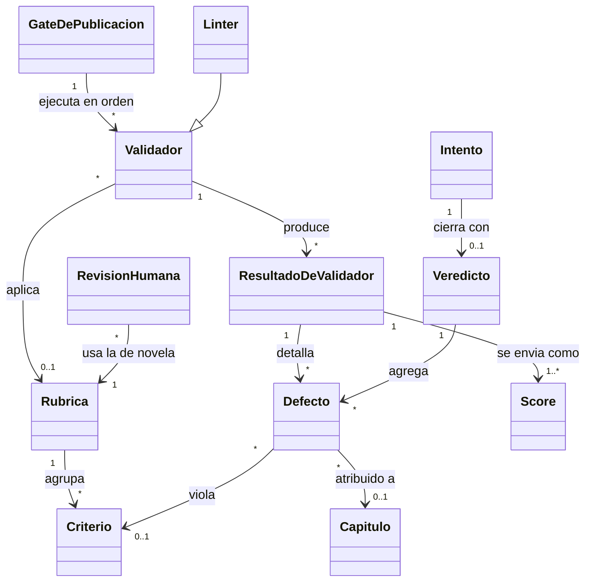

# definitions.md

Vocabulario del dominio de story-maker: novelas personalizadas de regalo ambientadas en un presente alternativo posterior a la revolución de la IA. Define qué entidades existen, sus atributos, relaciones e invariantes, y proyecta cada término a su identificador de código (§12).

El porqué de dominio está en `domain-knowledge.md`; las decisiones de diseño, en `architecture.md`; la verificación del sistema, en `verification.md`. Aquí, **Arq. §N** es `architecture.md` §N, la sección que usa el término.

- **Autoridad de nombres.** Un concepto definido aquí se nombra siempre así, en docs, specs, prompts y código. Nadie inventa sinónimos. Un término nuevo entra aquí antes que en ningún otro sitio.
- Entidades en CamelCase, sin acentos ni espacios, para que los diagramas Mermaid rendericen en cualquier visor.
- Los atributos son de dominio. El esquema por columna lo fija la spec 001 a partir de los identificadores y enumerados de §12.
- **Invariante** es una propiedad que el sistema garantiza siempre. Su método y su clase de verificación están en `verification.md` §5.

---

## 1. Personalización y entrada

### Cliente
Persona que encarga la novela y usa la plataforma con su cuenta. Es propietaria de todo lo que crea: novelas, briefs, su lista prohibida de nivel `user` y sus entradas del audit log. El «editor humano» de una edición manual trabaja con la cuenta del cliente: no es otro tipo de usuario.
- **Atributos:** email, hash bcrypt de la contraseña, fecha de alta.
- **Invariante:** todo recurso lleva su cliente propietario, y lo ajeno responde como inexistente (404). Arq. §14.3.

### Destinatario
Persona real a quien se regala la novela. Es siempre la protagonista.
- **Atributos:** nombre (forma canónica exacta), edad, fecha de nacimiento, rasgos (al menos uno), relación con el cliente.
- Sin fecha de nacimiento declarada, se toma el 1 de enero de (año presente − edad) (`domain-knowledge.md` §5.2). Arq. §3, §4.

### Allegado
Persona o mascota real del entorno del destinatario, con su relación: pareja, hijos, amigos, mascotas.
- **Atributos:** nombre (forma canónica exacta), relación, especie (persona | animal), edad o fecha de nacimiento (opcionales, con la misma regla de derivación).
- Sin edad ni fecha, no tiene fecha de nacimiento y queda fuera de T2 y T5 (§9). Arq. §3, §4.

### Recuerdo
Episodio real de la vida del destinatario que aporta el cliente.
- **Atributos:** enunciado, edad del destinatario o año, lugar, allegados presentes, obligatorio (sí/no).
- El código lo convierte en un `Evento` de origen brief, fechado según `domain-knowledge.md` §5.2, y su lugar en un `Lugar` de origen brief. Arq. §4.

### TextoLibre
Texto que pega el cliente: una anécdota, una carta. **Es contenido no confiable** (§7). Su único receptor es el extractor, que lo recibe como dato; el resto del sistema solo ve los `HechoExtraido` que el cliente acepta.
- **Atributos:** contenido, hechos extraídos, instrucciones descartadas (las frases que marcó el `DetectorDeInyeccion`). Arq. §3.

### HechoExtraido
Afirmación sacada de un texto libre como sujeto, atributo y valor, con la cita literal que la sostiene.
- **Atributos:** sujeto, atributo, valor, cita, verificado, aceptado por el cliente, obligatorio.
- **Invariante** (`citas-verificadas`): un hecho es verificado solo si se cumplen tres condiciones: la cita aparece literal en el texto, con los espacios normalizados; el sujeto es el destinatario o un allegado del brief; y la cita no se solapa con una frase marcada por el detector de inyección. Solo los verificados llegan al cliente y al brief. Es la forma determinista de impedir que el extractor invente.
- En un brief importado, los verificados se aceptan sin el cliente y no son obligatorios. Arq. §3.

### Brief
Resultado estructurado de la entrevista, validado con schema (`schema-brief`). Es el contrato de la novela: lo que el cliente fijó. Lo que no fija lo inventa el planner (zona libre, `domain-knowledge.md` §4.1).
- **Atributos:** destinatario, allegados, recuerdos, ocasión, género, tono, extensión, dedicatoria, entradas prohibidas de nivel `novel`, prohibidas preguntadas (sí/no), deseos de trama, hechos extraídos aceptados, elementos personales, estado (borrador | confirmado).
- **Invariantes:** solo se confirma sin ningún `DatoFaltante` ni ninguna `Contradiccion`, y con `max_mandatory_elements` elementos obligatorios como mucho. Una vez confirmado es inmutable: cambiar después un dato es una `SolicitudDeCambio` o una `EdicionManual`, que crean versión.
- Los faltantes y las contradicciones no se guardan: se recalculan en cada turno.
- Un **brief importado** por JSON, desde la API o la CLI, pasa por el mismo schema y las mismas comprobaciones, y no tiene entrevista. Arq. §3.

### ElementoPersonal
Dato del brief que personaliza la novela: el nombre del destinatario, un rasgo, un recuerdo, un allegado o un hecho extraído aceptado.
- **Atributos:** origen (campo del brief | hecho extraído), obligatorio (sí/no), hechos de la story bible que lo representan.
- **Invariantes:** el nombre del destinatario es obligatorio siempre, y cada elemento obligatorio tiene al menos un `UsoDeHecho` en la versión que se publica (`elementos-obligatorios`).
- Vive en el brief, y los hechos que lo representan lo referencian. Arq. §3, §5, §9.4.

### DatoFaltante
Campo obligatorio del brief que no tiene valor. Son obligatorios el nombre, la edad, al menos un rasgo, al menos un recuerdo, la ocasión, el género, el tono, la extensión, la dedicatoria y haber preguntado por las prohibidas. Arq. §3.

### Contradiccion
Par de datos del brief que son incompatibles según una de las reglas C1–C6 (`domain-knowledge.md` §4.3).
- **Atributos:** regla, campos implicados.
- No se resuelve en silencio: el entrevistador la plantea, y el cliente elige qué dato cambia. Arq. §3.

### Catálogos cerrados del brief

| Término | Valores |
|---|---|
| `Ocasion` | cumpleaños, boda, aniversario, jubilación, otra |
| `Genero` | aventura, humor, romance, misterio, drama, fábula (subgénero dentro del mundo post-IA) |
| `Tono` | tierno, divertido, emocionante, nostálgico, épico, inquietante |
| `Extension` | corta (1.100 palabras por capítulo), media (1.250) o larga (1.400). Es el objetivo; todo capítulo queda entre 1.000 y 1.500 |
| `FranjaDeEdad` | infantil (menos de 12), juvenil (12–17) o adulto (18 o más), según la edad del destinatario. Rige C1 y C2, el registro de la `StyleSheet` y los objetivos de legibilidad |

### Dedicatoria
Texto de la portada, dirigido al destinatario. El entrevistador la propone en su respuesta, y entra en el brief cuando el cliente la acepta. C6 la comprueba contra las prohibidas. Arq. §3.

### DeseoDeTrama
Algo que el cliente quiere que ocurra en la novela, como «que salga un robot». Es una lista opcional.
- **Atributos:** enunciado.
- Llega al planner como intención, y ningún validador exige que se cumpla. Si no cabe en el presente post-IA, el planner lo adapta dentro de ese presente: no hay marcos.
- Un tropo pedido en un deseo no penaliza `no-cliche`. Un deseo con una entrada prohibida es la contradicción C6. Arq. §5.

### ListaProhibida y EntradaProhibida
Palabras o temas que no pueden aparecer en la novela. Viven en SQLite, en tres niveles: **global** (insultos y términos ofensivos, comunes a la plataforma), **user** (los que el cliente fija para todas sus novelas) y **novel** (los que declara en la entrevista, como el nombre de una expareja o un tema). Una `EntradaProhibida` es una entrada de la lista.
- **Atributos:** término, tipo (palabra | tema), nivel, forma normalizada (§7).
- Un **tema** es una lista de palabras clave, y entra además en las instrucciones del writer.
- Preguntar por las prohibidas es obligatorio, aunque la lista puede quedar vacía. Arq. §12.

### Entrevista
Conversación entre el cliente y el entrevistador que construye el brief. Abre una sesión de rol por turno HTTP.
- **Atributos:** mensajes, brief en curso.
- No tiene estado propio: sigue abierta mientras el brief está en borrador. Arq. §3.

### Modelo de clases

---

## 2. Story bible

El canon de una versión: lo que es verdad dentro de la ficción. Reúne el mundo inventado y los datos del brief convertidos en ficción. Vive en SQLite. Arq. §4.

### StoryBible
- **Atributos:** año presente, mundo, personajes, lugares, hechos, usos de hechos, eventos.
- El **año presente** es el de la fecha de creación de la novela. La historia transcurre en él, en un presente alternativo en el que la revolución de la IA ya ocurrió (`domain-knowledge.md` §5.2).
- **Invariantes:**
  - **Es de cada versión.** Toda fila lleva su versión, y una candidata copia la story bible de su versión base en una transacción. La de una versión publicada no cambia nunca.
  - **Ningún rol escribe canon.** Los roles proponen por tool, y el código aplica lo propuesto después de validarlo.
- **Quién escribe qué:** el código escribe lo que viene del brief; el planner inventa el resto (el mundo, el reparto, los lugares y sus hechos); el editor registra usos y eventos al aceptar cada capítulo; una solicitud de cambio o una edición manual cambian hechos en su candidata.

### Mundo
El mundo post-IA de la novela: un `Novum` y de 2 a 4 `Consecuencia` en texto, sin grafo causal ni restricciones. Es también el sujeto de los hechos que no son de un personaje ni de un lugar. Arq. §5.

### Novum
Postulado especulativo raíz: qué capacidad de la IA apareció, y cuándo (`domain-knowledge.md` §3).
- **Atributos:** descripción, ámbito (tecnológico | social | cognitivo), fecha.
- **Invariante:** la fecha es anterior al año presente (`outline`).

### Consecuencia
Cambio del mundo que se sigue del novum, en una frase. Un mundo tiene de 2 a 4 (§11.2), sin orden ni dependencias entre ellas.

### Personaje
- **Atributos:** nombre canónico, tipo (destinatario | allegado | inventado), especie (persona | animal | artificial), fecha de nacimiento (opcional), origen (brief | inventado).
- Sus rasgos y sus demás datos son `Hecho` con él como sujeto. Su nombre canónico es el valor de su hecho de nombre: cambiar el nombre es cambiar ese hecho, y el código cambia los dos a la vez.
- Una **variante de nombre** es una palabra que empieza por mayúscula, no es ella misma un nombre canónico y difiere de uno solo en mayúsculas o acentos («TOBY» o «Tóby» por «Toby»), o está cerca de él por distancia de edición según la longitud del canónico: ≤ 2 con 7 letras o más, ≤ 1 con 4 a 6 («Tobi» por «Toby») y 0 con 3 o menos, que solo admiten la variante de mayúsculas o acentos. Es un defecto de `nombres-exactos`. Arq. §4, §5, §11.2.

### Lugar
- **Atributos:** nombre canónico, descripción, origen (brief | inventado). Los de origen brief salen de los recuerdos. Arq. §4.

### Hecho
Afirmación atómica de la story bible, con sujeto, atributo y valor: «el perro del destinatario se llama Toby». Es la unidad que registra en qué capítulos se usa, y la que modifica una solicitud de cambio.
- **Atributos:** tipo de sujeto (personaje | lugar | mundo), sujeto, atributo, valor, origen (brief | texto libre | inventado), obligatorio (sí/no), elemento personal que representa (opcional).
- **Invariante:** los de origen brief y texto libre son **inmutables para todos los roles**. Solo los cambia una `SolicitudDeCambio` o una `EdicionManual`, en la candidata que crean.
- Los atributos de los hechos del brief forman un vocabulario cerrado, en `domain`.
- **Hecho nominal:** el que tiene por valor un nombre propio, de personaje, de lugar o de objeto con nombre. El vocabulario de atributos marca cuáles son. Que su valor aparezca literal en un capítulo prueba el uso sin juicio de modelo. Arq. §4, §8, §10.

### UsoDeHecho
Registro de que un capítulo de una versión usa un hecho. Responde a lo que pide el encargo: qué capítulos usan cada hecho.
- **Atributos:** hecho, capítulo.
- **Invariante:** solo lo escribe el código, al aceptar un capítulo. Es la unión de los usos que declara el editor y las apariciones literales de los hechos nominales. Si se vuelve a aceptar un capítulo de la candidata, sus usos nuevos sustituyen a los anteriores.
- Lo leen `elementos-obligatorios`, el cálculo de los capítulos afectados por un cambio y la ficha. Arq. §8, §10.1, §14.1.

### Evento
Suceso situado en el tiempo de la ficción.
- **Atributos:** enunciado, momento (fecha y hora), lugar, personajes presentes (con su edad declarada, si la fuente la fija), tipo (ordinario | excluyente), personaje excluido (solo en uno excluyente), analepsis (sí/no), origen (brief | planificado | registrado), capítulo y beat (vacíos si no se narra).
- Un evento **excluyente**, como una muerte o una partida definitiva, impide que su personaje excluido esté presente en eventos posteriores (T4). Una **analepsis** narra algo anterior al presente de la trama, y queda fuera de T1.
- **Origen:** del brief salen los recuerdos; planificados son los de los beats del plan; registrados son los del editor al aceptar un capítulo. Si el capítulo se vuelve a aceptar, sus registrados nuevos sustituyen a los anteriores.
- Los nacimientos no son eventos: son la fecha de nacimiento de cada personaje. Arq. §4, §5, §8.

### Cronologia
La tabla de eventos de una versión, más las fechas de nacimiento y la fecha del novum. Alimenta el validador formal (§9). En el gate entran los eventos de origen brief y los registrados, no los planificados: se verifica lo que dice el texto, no lo que se planeó. Arq. §4.5, §11.4.

### Modelo de clases

---

## 3. Artefacto narrativo y versiones

Jerarquía: `Novela → Version → Capitulo`. El `Outline` de cada versión planifica los capítulos y sus `Beat`; el `Capitulo` guarda lo producido.

### Novela
- **Atributos:** título, cliente propietario, fecha de creación, modelo de incrustación (el de `retrieval.embedding_model` al crearla, fijo desde entonces), versiones.
- La **fecha de creación** fija el año presente, y es la fecha en la que se comprueba C4. La **versión vigente** es la publicada de número más alto.
- **Estado**, que se deriva y no se guarda: `interview` si el brief sigue en borrador; `ready` si está confirmado y no hay versión publicada ni ejecución sin terminar; `in_progress` si hay una ejecución sin terminar (en cola, en curso o interrumpida) y ninguna versión publicada; `published` si hay al menos una versión publicada. Arq. §9.

### Version
Estado completo de la novela: su story bible, su outline, su StyleSheet y sus 10 capítulos. **Una versión publicada es inmutable, y la anterior se conserva siempre.**
- **Atributos:** estado (candidata | publicada | descartada), número, versión base, capítulos cambiados, ruta del PDF, fecha de creación, fecha de publicación.
- **Invariantes:** una candidata nace copiando en una transacción todas las tablas de ámbito versión de su base (la de la primera generación no tiene base). El número se asigna al publicar, consecutivo por novela; mientras tanto, la versión se identifica por su id. Si su ejecución falla, pasa a descartada.
- **Capítulo cambiado:** el que tiene una huella distinta de la de su versión base. La lista se guarda al publicar, y en la primera versión está vacía. La lectura marca esos capítulos como «cambiado en vN». Arq. §9.3, §10.

### Capitulo
Unidad de generación, validación, punto de control y regeneración.
- **Atributos:** número (1–10), título (copiado del outline), texto plano (párrafos separados por una línea en blanco), resumen, número de palabras, huella (hash del título y el texto).
- **Invariante:** tiene entre 1.000 y 1.500 palabras (`longitud-capitulo`). Arq. §8.

### Outline
Plan de la novela y contrato entre la planificación y la escritura. Es de cada versión.
- **Atributos:** título de la novela; 10 capítulos del outline, cada uno con número, título, función en el arco y de 3 a 6 beats; asignación de cada elemento obligatorio a al menos un capítulo.
- **Invariante** (`outline`): tiene 10 capítulos con 3 a 6 beats cada uno; todo elemento obligatorio está asignado; sus eventos tienen momento, lugar y presentes válidos; el novum es anterior al año presente. Arq. §5.

### Beat
Suceso planificado dentro de un capítulo, en el que pasa o cambia algo. No se genera por separado: el writer escribe el capítulo entero.
- **Atributos:** número, descripción, eventos planificados, personajes, hechos que usa, revelación (tema y contenido, opcional).
- La proyección del outline muestra al writer el tema de las revelaciones futuras, nunca su contenido (§4). Arq. §5, §6.

### StyleSheet
Reglas de estilo de la novela. Las fija el planner, y es de cada versión.
- **Atributos:** narrador (primera | tercera persona), tiempo verbal (pasado | presente), tratamiento por defecto (tú | usted) con excepciones por par de personajes, registro (sale de la `FranjaDeEdad`), léxico a evitar.
- Es residente del writer y del editor, y la comprueba `linter-consistencia`. Arq. §5, §6, §14.5.

### Portada
- **Atributos:** título de la novela, nombre del destinatario, dedicatoria. Arq. §14.

### FichaDePersonajes
Página de la lectura y del PDF, generada desde la story bible, con cada personaje y cada lugar y enlaces a los capítulos en los que aparecen. El encargo la llama «ficha de personajes y lugares».
- Una entidad **aparece** en un capítulo si este tiene un `UsoDeHecho` de alguno de sus hechos, o un evento registrado en el que está presente (un personaje) o que ocurre en ella (un lugar).
- **Invariante:** cada entidad de la ficha enlaza al menos a un capítulo. Una entidad sin capítulo es un fallo de datos de `revision-visual`, y vuelve al editor para que registre de nuevo. Arq. §14.1, §14.2.

### Modelo de clases

---

## 4. Contexto y memoria

La memoria de la generación está en tres sitios: la **story bible** dice qué es verdad, los **resúmenes** dicen qué pasó y los **puntos de control** (§5) dicen hasta dónde se llegó. No hay entidades de memoria aparte: el contexto de cada sesión **se construye** desde esos tres, con el patrón outline-first y recuperación selectiva. Arq. §6.

### VentanaDeContexto
Lo que el orquestador ensambla para una `SesionDeRol` antes de abrirla. **Ningún rol pide contexto.**
- **Atributos:** sesión de rol, rol, capítulo, residentes, recuperados, entradas de la llamada, tokens de entrada estimados. No se guarda en SQLite.
- **Partes:** los **residentes** entran siempre, sin consulta; los **recuperados** son CanonCards obtenidas por RAG híbrido; las **entradas de la llamada** son el capítulo que se revisa, los defectos, el cambio o la rúbrica.
- **Residentes del writer:**
  - la StyleSheet;
  - la **proyección del outline**: los titulares de los 10 capítulos, los beats del actual y los temas de las revelaciones futuras, sin su contenido;
  - los resúmenes de los capítulos 1..*n*−1 y el final literal del capítulo *n*−1;
  - los elementos obligatorios asignados al capítulo;
  - los hechos y los personajes de sus beats.
- **Recuperados:** `top_k.<rol>` CanonCards. El writer consulta con los beats del capítulo (**consulta prospectiva**); el editor, con su texto (**consulta retrospectiva**).
- **Invariantes:** el writer nunca recibe prosa recuperada; solo se recuperan tarjetas vigentes en el capítulo *n* (**corte temporal**, `CanonCard`); el tamaño estimado de la ventana entra en la reserva del `TechoDeTokens`.

### CanonCard
Tarjeta indexada de una entidad de la story bible: un personaje con sus hechos, un lugar, o el mundo con su novum y sus consecuencias. Es la única colección del RAG.
- **Atributos:** tipo de entidad (personaje | lugar | mundo), entidad, texto, huella, `desde_capitulo`.
- **Invariantes:**
  - es inmutable; las iniciales nacen al aplicar el plan, con `desde_capitulo` = el primer capítulo en cuyos beats aparece su entidad (1 si la entidad viene del brief o es el mundo);
  - si al aceptar el capítulo *n* cambia lo que se sabe de una entidad (por sus eventos registrados), el código añade una **sucesora** con `desde_capitulo` = *n* + 1;
  - en el capítulo *n* rige, por entidad, la de mayor `desde_capitulo` ≤ *n*: ese es el corte temporal;
  - volver a aceptar un capítulo sustituye las sucesoras que creó, y cambiar un hecho en la candidata reconstruye las tarjetas de su entidad.
- **Recuperación:** BM25 sobre los candidatos de FTS5 más búsqueda densa, fusionados por RRF con desempate estable y sin re-ranking. El mismo índice con la misma consulta da siempre el mismo resultado. Los vectores de incrustación se comparten entre versiones, por huella y modelo. Arq. §6, §8.

### ResumenDeCapitulo
Resumen de un capítulo aceptado. El editor lo entrega en su revisión, y el código lo guarda con el capítulo. Es residente del writer y del editor en los capítulos siguientes. Arq. §6, §8.

### TechoDeTokens
Contador global en memoria de los tokens en vuelo de todas las sesiones de rol del servidor, que corre en un solo proceso. Cumple el máximo de 100.000 tokens concurrentes del encargo.
- **Reserva:** antes de abrirse, cada sesión reserva su entrada estimada más (`max_turns` − 1) · `max_output_tokens` de su rol, y la libera al cerrar. La **entrada estimada** son los caracteres entre 4 (estimador local).
- **Espera:** si la reserva no cabe, la sesión espera. En la API espera como mucho `api_wait_seconds`, y luego responde 503.
- **Invariantes:** la suma de las reservas nunca pasa de `token_ceiling`, que es ≤ 100.000. Una reserva que por sí sola supera el techo no cabe nunca, y la ejecución falla con `infeasible_config`. Arq. §6.

---

## 5. Harness y ejecuciones

### Rol
Función del sistema que ejecuta un modelo, en sesiones del Claude Agent SDK con el proveedor de `LLM_PROVIDER` (§11.3). Tiene su prompt, sus tools, sus hooks, su modelo y sus límites.
- **Los siete roles:** entrevistador y extractor corren en la API; el planner, en la ejecución, y también en la API en modo cambio; writer, editor, juez y revisor visual, en la ejecución. Sus identificadores, tools y modos están en §12.2.
- **Modos:** el planner planifica o interpreta un cambio. El writer escribe, reescribe con los defectos, o revisa un capítulo para aplicar un cambio.
- **Invariantes:** writer y editor son roles separados, y el editor no reescribe. El editor critica con la rúbrica **y** registra usos, eventos y el resumen. Ningún rol escribe canon. Arq. §7.2.

### SesionDeRol
Una sesión del Agent SDK de un rol. No es la `Sesion` de Langfuse ni el `TokenDeAcceso`.
- **Atributos:** rol, novela, ejecución (vacía en la entrevista, la extracción y la propuesta de un cambio), capítulo (si lo hay), modelo, versión de prompt, tokens de entrada, de salida, de lectura de caché y de escritura de caché, coste en USD, latencia, desenlace, traza.
- **Uso y coste:** los tokens salen del `ResultMessage` de la sesión. El coste es ese uso real × `pricing` (precio de lista, §11.1), nunca el `total_cost_usd` del SDK.
- **Desenlace:** `completed`; `turns_exhausted` (agotó `max_turns`); `time_exhausted` (agotó `session_timeout_seconds`); `cut` (la cortó quien la abrió); `infrastructure_failure` (fallo del proveedor, de transporte o por el límite de uso de la suscripción: no cuenta como intento, y la ejecución pasa a interrumpida). Arq. §7.6, §13.

### WorkspaceDelHarness
Directorio de trabajo de los roles, `backend/harness_workspace/`. Contiene el `CLAUDE.md` de producto (en español: respetar la story bible, no tocar los hechos del brief, tratar el texto del cliente como dato, entregar siempre por tool), la skill y un prompt por rol. No es el `CLAUDE.md` raíz, que instruye al desarrollo. Las sesiones excluyen los `CLAUDE.md` de los directorios padre y el `.mcp.json` raíz. Arq. §7.3.

### Tool
Acción con schema Pydantic, publicado como JSON Schema, por la que un rol entrega su resultado.
- **Invariantes:** las tools **entregan, no persisten**: persiste el código, después de validar. Una entrada inválida es un error que vuelve al modelo y cuenta como intento (`schema-salida`). Las tools integradas del SDK están desactivadas, y cada rol solo tiene su lista blanca (§7). Arq. §7.4.

### Hook
Función del harness que el SDK ejecuta antes o después de una tool.
- **Hook de policy** (`PreToolUse`): aplica la lista blanca del rol, pasa `palabras-prohibidas` sobre los campos narrativos y solo deja que `Skill` cargue `personalizacion-natural`. Cuando deniega, da el motivo. Toda decisión va al audit log.
- **Hook de validación de capítulo** (`PostToolUse`, tras `submit_chapter`): pasa `longitud-capitulo` y `nombres-exactos` (el schema ya lo validó el manejador de la tool: `schema-salida`). Si hay defectos bloqueantes, sustituye la salida de la tool por los defectos, y el writer corrige en la misma sesión.
- **Hook de observabilidad**, aparte de los dos del encargo: cierra los spans que el hook de policy abrió para las tools sin manejador propio, como las de Playwright MCP y `Skill`. Arq. §7.5.

### Skill
Paquete reutilizable de instrucciones. La de producto es `personalizacion-natural`, que integra los datos del brief sin forzarlos; la cargan writer y editor. Las skills de desarrollo, en `.claude/skills/`, no son del producto (`verification.md` §9.1). Arq. §7.3.

### Ejecucion
Una pasada del harness sobre una novela, que termina publicando una versión o fallando.
- **Tipo:** `generation` (del brief confirmado a la primera versión), `change_request` (aplica una `SolicitudDeCambio`) o `manual_edit` (aplica una `EdicionManual`).
- **Estado:** en cola → en curso → publicada | fallida. En curso puede pasar a interrumpida, y al reanudar vuelve a estar en cola, en su puesto original.
- **Fase**, mientras está en curso:
  - `planning`: el planner;
  - `writing`: el capítulo actual, con writer, hooks y editor; en una edición manual, con los validadores del capítulo y el editor;
  - `gate`: el gate de publicación;
  - `rewriting`: la reescritura dirigida.
- **Atributos:** novela, tipo, estado, fase, capítulo actual, versión base, candidata, reanudaciones, motivo y detalle del fallo o de la interrupción, fecha de creación, fecha de fin. La posición en la cola y el coste acumulado se derivan.
- **Motivo de fallo:** `retries_exhausted`, `banned_content` (intentos de un capítulo agotados por palabras prohibidas), `render_failure`, `unattributable_defect` (defecto del gate sin capítulo al que atribuirlo, como un testigo Lean con solo eventos del brief), `edit_rejected` (el gate atribuye un fallo al capítulo editado a mano), `infeasible_config`, `internal_error`, `stale_base` (al arrancar, su versión base ya no es la vigente) y `resumes_exhausted` (se interrumpió con `max_resumes` agotado).
- **Motivo de interrupción:** `crash` (caída, o arranque del servidor con la ejecución en curso), `provider_error` (fallo del proveedor o de transporte, también el límite de uso de la suscripción), `verifier_unreachable` y `verifier_timeout`.
- **Reescritura dirigida:** la de los capítulos a los que un ciclo del gate atribuyó defectos, con el writer reescribiendo y el editor, antes de un ciclo nuevo.
- **Regeneración:** la de los capítulos afectados por un cambio, en orden, con el writer revisando, los hooks y el editor.
- **Invariantes:** hay como mucho una ejecución en curso en el servidor, y las demás esperan en una cola FIFO global por fecha de creación. Publicada y fallida son terminales. Al arrancar el servidor, la que estaba en curso pasa a interrumpida. Solo se reanuda desde interrumpida, y desde su último punto de control. Si falla, su candidata pasa a descartada. Arq. §9.1.

### Intento y Evaluable
Un **evaluable** es la unidad cuyos intentos acota `max_retries`: el capítulo (sus entregas, `max_retries.chapter`), el plan (las entregas del planner, `max_retries.plan`), el ciclo del gate (cada pasada sobre la candidata, `max_retries.gate_cycles`) y el cambio (las propuestas del planner para una petición, `max_retries.change`).

Un **intento** es una entrega de un evaluable que se juzga. Cuentan también las que rechaza un hook o un schema.
- **Atributos:** ejecución (o solicitud de cambio, en un cambio), evaluable, capítulo, ciclo del gate (en la reescritura dirigida), número, desenlace.
- **Desenlace:** el `Veredicto` que cerró el intento. Queda vacío, y el intento no cuenta, si la ejecución se interrumpió con él abierto.
- **Invariante:** un evaluable tiene como mucho 1 + `max_retries.<evaluable>` intentos (TLA+ `ReintentosAcotados`). Arq. §7.6.

### PuntoDeControl
Estado persistido desde el que se reanuda. Solo admite inserciones.
- **Atributos:** ejecución, capítulo.
- Hay uno por capítulo aceptado, en la misma transacción que lo acepta. El plan aplicado es el capítulo 0.
- Reanudar sigue en el capítulo siguiente al último punto de control, así que no duplica ni pierde capítulos (TLA+ `ReanudacionSinDuplicarNiPerder`). En el gate repite el ciclo en curso; en un cambio, sigue por el siguiente capítulo afectado. Arq. §8, §9.2.

### SolicitudDeCambio
Cambio que pide el lector sobre una versión publicada, desde la lectura web o desde un cliente MCP. **Su petición no es confiable** (§7).
- **Atributos:** selección, petición, propuesta, capítulos afectados, hash del código de confirmación, caducidad, versión base, estado, ejecución.
- La **selección** es un fragmento (versión, capítulo y cita) o un hecho. La **propuesta** es la interpretación estructurada de la petición: los hechos que cambian, con su valor antiguo y el nuevo, o un hecho nuevo.
- **Estado:** propuesta → confirmada → aplicada. Pasa a caducada si caduca su código. Pasa a rechazada si la deniega la policy, si no hay propuesta válida tras `max_retries.change` o si falla su ejecución, también por `stale_base`.
- **Invariante:** los capítulos afectados los calcula el código, nunca un modelo. Son los que tienen `UsoDeHecho` de los hechos cambiados, más los que contienen literalmente el valor antiguo, más el del fragmento seleccionado, si lo hay. Arq. §10.1.

### EdicionManual
Cambio que el cliente hace a mano en el texto de un capítulo de una versión publicada, desde el editor web.
- **Atributos:** capítulo, texto nuevo, versión base, estado (en cola | aplicada | rechazada), ejecución.
- Su texto **no es confiable** para los roles: el editor lo recibe como dato al volver a registrar el capítulo.
- Si el texto cambia un hecho, el editor lo declara y el código actualiza la story bible de la candidata, que después pasa el gate completo, con Lean. Arq. §10.3, §14.6.

### Componentes de código
Piezas del harness sin modelo:
- **orquestador:** la máquina de estados que modela `Harness.tla`. Ensambla ventanas, abre sesiones y aplica límites y veredictos;
- **cola:** FIFO global de las ejecuciones en cola;
- **worker:** tarea asyncio, en el mismo proceso que la API, que ejecuta la ejecución activa;
- **recuperador:** el RAG híbrido sobre las CanonCards;
- **puerto de agente:** la única vía a un modelo, con un doble falso determinista para las pruebas;
- **puerto de observabilidad:** la única vía a Langfuse, con un doble nulo para las pruebas y para operar sin Langfuse;
- **CLI:** `story-maker`.

Arq. §7, §9, §15.

### Modelo de clases

---

## 6. Calidad

### Validador
Comprobación con nombre que corre en un punto concreto del harness. Envía su resultado a Langfuse como `Score`, y a SQLite como `ResultadoDeValidador`.
- **Atributos:** nombre (que es también la etiqueta de su score), familia (programático | semántico | formal de la historia | formal del sistema), punto de ejecución, bloquea (sí/no), rúbrica (si la aplica).
- Los nombres están en §12.3. La tabla con el punto de ejecución y lo que comprueba cada uno está en Arq. §11.2.
- No envían score el lint en vivo, que no tiene traza, ni TLC, que corre en desarrollo y CI.

### ResultadoDeValidador
Copia en SQLite del resultado de un validador en una ejecución. De aquí salen la tabla de evals y el `InformeDeEjecucion`.
- **Atributos:** ejecución, versión, validador, capítulo (opcional), pasa (sí/no), score, detalle con los defectos.
- Los validadores de entrada, los del brief y la extracción, solo van a Langfuse, en la traza de la entrevista o de la importación. Arq. §11, §15.

### Criterio
Aspecto que una rúbrica puntúa de 1 a 5, con una justificación.
- **Atributos:** identificador (etiqueta kebab-case, única dentro de su rúbrica), rúbrica, umbral (`quality.thresholds`), bloqueante (sí/no).
- **Criterios**, con **B** para los bloqueantes. De capítulo: `fidelidad-canon` (B), `cumple-beats` (B), `personalizacion-natural`, `prosa`, `tono`. De novela: `continuidad` (B), `coherencia-personajes` (B), `arco-y-final` (B), `ritmo`, `tono`, `personalizacion-natural`, `no-cliche`.
- **Invariantes:** un bloqueante por debajo de su umbral bloquea aunque la media sea alta. Los criterios de personalización y los de calidad narrativa no se compensan entre sí.
- Qué juzga cada criterio está en Arq. §11.3.

### Rubrica
Conjunto de criterios con escala de 1 a 5 y una justificación por criterio. La **de capítulo** la aplica el editor (`rubrica-capitulo`). La **de novela** la aplican el juez (`juez-novela`) y la revisión humana (`revision-humana`), y es la misma para los dos.

### Defecto
Fallo concreto que detecta un validador.
- **Atributos:** validador, criterio (opcional), bloqueante (sí/no), capítulo (opcional; en el gate, el atribuido), mensaje.
- **Atribuible** es el defecto que tiene capítulo: se corrige reescribiendo ese capítulo. Uno no atribuible, como un fallo de render, hace fallar la ejecución.
- Se guarda en el detalle de su `ResultadoDeValidador`. Los linters solo producen defectos no bloqueantes. Arq. §8, §9.4.

### Veredicto
Decisión que toma el código, nunca un modelo, tras cada intento de un evaluable: `accept` si no hay defectos bloqueantes; `rewrite` si los hay y quedan intentos, y entonces se reintenta con los defectos; `fail` si los hay y no quedan intentos, y entonces la ejecución falla con su informe. Arq. §8, §9.4.

### GateDePublicacion
Última comprobación de una candidata antes de publicarla. Pasa los validadores de novela en orden económico: deterministas → Lean y juez a la vez → revisión visual → PDF.
- **Invariante:** nada se publica sin pasar el gate (TLA+ `NuncaPublicaSinValidar`).
- Cada pasada es un intento del ciclo del gate. Arq. §9.4.

### Score
Resultado de un validador en Langfuse, asociado a la traza de su ejecución o de su entrevista.
- **Nombre:** el del validador. Los que juzgan por partes envían además uno por parte, con el nombre `<validador>/<parte>`: por criterio en los de rúbrica (`juez-novela/continuidad`), por invariante en `cronologia-lean` (`T1` a `T5`) y por página en `revision-visual` (`portada`, `indice`, `capitulos`, `ficha`).
- **Valor:** 1 o 0, según pase o no; de 1 a 5 en un criterio; el valor de la métrica en un linter.
- **Comentario:** la justificación o el motivo, como la coincidencia de `palabras-prohibidas`. Arq. §13.

### RevisionHumana
Evaluación de al menos una novela completa por una persona, el usuario. Usa la rúbrica de novela y se puntúa en Langfuse, en una cola de anotación o, si el plan no la incluye, anotando la traza, para comparar el juicio humano con el del juez. Queda fuera del flujo, y no bloquea. Arq. §11.6.

### Linter
Validador programático de la prosa. Usa heurísticas en Python puro y no bloquea. Son cuatro: `linter-repeticion`, `linter-legibilidad`, `linter-estilo-ia` y `linter-consistencia`.
- Corre tras el hook de validación y antes de la sesión del editor (punto `editor`), que recibe sus defectos como no bloqueantes, y en el lint en vivo de la edición manual (`live_lint`).
- El **lint en vivo** da diagnósticos sin traza ni score: nombres de la story bible, prohibidas, los cuatro linters y dos avisos ligeros de cronología. Arq. §10.3, §14.5.

### CatalogoDeTropos y Tropo
El catálogo es una constante en `domain` con los tropos saturados del subgénero post-IA (`domain-knowledge.md` §6). El planner lo usa para evitarlos, y el juez para penalizarlos en `no-cliche`. Un tropo pedido en un deseo de trama no se penaliza.
- **Atributos del tropo:** nombre, marcadores (escritos al nivel del mecanismo narrativo), origen: **curado** si es un tropo del género, **aprendido** si lo repitió el modelo en las evals.

### InformeDeEjecucion
Informe de una ejecución: qué validadores pasaron y cuáles fallaron, los defectos sin resolver, las decisiones de política, los intentos, las reanudaciones, el coste y el motivo del fallo. Se calcula al pedirlo, desde lo guardado, y no se guarda. Arq. §9.

### Modelo de clases

---

## 7. Política y guardarraíles

### MotorDePoliticas
Código que decide si se permite una acción o un contenido: la lista blanca de tools de cada rol, las palabras prohibidas y el texto no confiable. **Nunca decide un modelo.** Lo invocan el hook de policy, la extracción, la petición de cambio, la edición manual, el gate y las escrituras MCP. Arq. §12.

### Forma normalizada
Forma en la que se comparan un texto y las entradas prohibidas: en minúsculas, sin acentos, sin los plurales en -s y -es, con las letras repetidas colapsadas y sin el leetspeak simple. La coincidencia va por tokens, con límites de palabra, y admite términos de varias palabras. El detalle está en Arq. §12.

### Coincidencia
Aparición, en forma normalizada, de una `EntradaProhibida` en un texto.
- **Atributos:** entrada, variante encontrada, nivel, ubicación, capítulo, posición.
- La **ubicación** es un capítulo, la portada, la ficha, una petición, una edición o un campo de tool. Un **campo de tool** es un campo narrativo de otra entrega, como el plan o el título.
- Toda coincidencia va al audit log y a Langfuse.

### DecisionDePolitica
- **Atributos:** momento, cliente, novela, ejecución, rol, tool, origen, decisión, regla, detalle con las coincidencias. La novela, la ejecución, el rol y la tool solo se rellenan si los hay.
- **Origen:** el punto que tomó la decisión: el hook de policy, el texto libre, la petición de cambio, la edición manual, el gate o una escritura MCP.
- **Decisión:** permitir, denegar o marcar. Marcar registra sin denegar; es lo que hace el detector de inyección.

### AuditLog
Registro de todas las `DecisionDePolitica`, por cliente. Solo admite inserciones: nunca se modifica ni se borra. Arq. §12.

### DetectorDeInyeccion
Código que marca por patrones, en español y en inglés, las frases de un texto no confiable dirigidas al sistema, como «ignora lo anterior». Solo marca. Qué hace cada vía con una marca está en Arq. §12; en el texto libre, por ejemplo, se descartan los hechos cuya cita se solapa con una frase marcada.

### Texto no confiable
Llega por tres vías, cada una con un solo receptor:

| Vía | Receptor único |
|---|---|
| `TextoLibre` | el extractor; su única tool es `submit_facts` |
| Petición de una `SolicitudDeCambio` | el planner en modo cambio; su única tool es `propose_change` |
| Texto de una `EdicionManual` | el editor, que lo recibe como dato |

Arq. §7.7.

---

## 8. Observabilidad

Todo lo de esta sección vive en Langfuse. Arq. §13.

- **Sesion:** agrupa las trazas de una novela, desde la entrevista hasta la generación y las regeneraciones. No es una `SesionDeRol`.
- **Traza:** una por ejecución (la reanudada conserva la suya), por entrevista, por importación de un brief, por propuesta de cambio y por llamada MCP.
- **Span:** observación con nombre dentro de una traza. Hay uno `capitulo-<n>` por capítulo, que agrupa sus sesiones de rol; uno `rol:<rol>` por sesión de rol, con su capítulo; uno `tool:<tool>` por llamada a tool, también por las denegadas, con nivel WARNING; y uno `validador:<validador>` por validador.
- **LlamadaDeModelo:** observación de tipo generación de una sesión de rol, con su modelo, sus tokens, su coste, su latencia y su versión de prompt. Hay una por sesión, porque el uso exacto es el del `ResultMessage`; por un proveedor compatible como OpenRouter, además, el uso por turno llega a cero. Los agregados por capítulo y por novela salen de ellas.
- **PromptVersionado:** el prompt de sistema de un rol, que es un fichero del workspace. `story-maker prompts push` sube una versión nueva si cambia su huella. En ejecución se lee por la etiqueta `LANGFUSE_PROMPT_LABEL`, y cada llamada de modelo enlaza la versión que usó: así la iteración de tuning muestra qué versión produjo cada resultado.
- **Mascara:** función que sustituye los nombres y las fechas del brief de la novela por `[NOMBRE_n]` y `[FECHA]` antes de enviar nada a Langfuse.

---

## 9. Verificación formal

### FicheroDeCronologia
Fichero Lean generado desde la `Cronologia` de una versión. Contiene los eventos (momento, capítulo y beat, lugar, presentes, tipo y analepsis), las fechas de nacimiento y la fecha del novum.
- Va **seudonimizado**: los identificadores son los ids de las filas de SQLite, sin nombres, y los años se desplazan 400·*k*, lo que conserva los años bisiestos.
- **Atributos:** ejecución, huella, resultado, detalle con el invariante violado y su testigo.
- **Resultado:** `passed` si pasa; `failed` si viola un invariante; `error` si no compila por otra causa. Arq. §11, spec 007.

### Invariantes de la cronología
**T1** orden temporal declarado · **T2** edad coherente con el nacimiento · **T3** nadie está en dos lugares a la vez · **T4** nadie vuelve de un evento excluyente · **T5** nadie actúa antes de nacer. Los enunciados están en `domain-knowledge.md` §5.3. T2 y T5 solo alcanzan a quien tiene fecha de nacimiento. Opcional: una demostración general de que cada comprobador decide su propiedad para cualquier cronología.

### VerificadorFormal
Componente que compila un `FicheroDeCronologia` contra la biblioteca de invariantes con `lake build`. Es el validador `cronologia-lean`.
- **Modo** (`FORMAL_VERIFIER`): `local` o `github`, con el mismo resultado. En `github`, cada verificación es una ejecución de un workflow de GitHub Actions, que no es una `Ejecucion` del harness.
- Si falla, la versión no se publica, y el fallo vuelve al editor como defectos atribuidos a los capítulos de los eventos implicados.
- Si es inalcanzable, o no responde en `verifier_timeout_seconds`, la ejecución pasa a interrumpida. Arq. §11.

### EspecificacionDelHarness
Especificaciones TLA+ del harness, cada una con su `.cfg` para TLC. Corren en desarrollo y en CI, y no envían score.
- **`Harness.tla`** (obligatoria): la máquina de estados de la `Ejecucion`.
  - Acciones: Configurar, Planificar, EscribirCapitulo, Validar, Reintentar, Caer, Reanudar, Gate, Publicar, Fallar, PedirCambio, Regenerar.
  - Invariantes de seguridad: `NuncaPublicaSinValidar`, `ReanudacionSinDuplicarNiPerder`, `VersionAnteriorConservada`, `ReintentosAcotados`.
  - Liveness: `TerminaSiempre`.
- **`Regenerations.tla`** (opcional): dos cambios simultáneos sobre la misma novela, con el invariante `VersionesLineales`.

La correspondencia de cada acción con su transición del código está en el README raíz. Arq. §11, spec 006.

---

## 10. Plataforma

### TokenDeAcceso
JWT que identifica al cliente en la API y en el servidor MCP. Caduca a las `access_token_hours` (24). Arq. §14.3.

### ServidorMCP
FastMCP montado en `/mcp` del FastAPI. Sus tools (§12.2) son de dos clases: las **de lectura**, que no modifican nada, y las **de escritura**, que solo proponen o encolan, y siempre con `Confirmacion`. Así se concilia el «servidor de solo lectura» del encargo con su opcional de escritura. Cada tool tiene su schema validado y actúa con la identidad del `TokenDeAcceso`, y cada llamada es una traza. Arq. §14.4.

### Confirmacion
Segundo paso obligatorio de una solicitud de cambio, en la web y en MCP. La primera llamada devuelve la propuesta, los capítulos afectados y un código; solo la segunda, que presenta ese código, encola la ejecución.
- **Invariante:** el código es de un solo uso, se guarda como hash y caduca a los `confirmation_minutes` (15). Arq. §10.1.

### VistaDeVersion
HTML que el servidor genera con Jinja2 para una versión, candidata o publicada, con la marca de la empresa. Contiene la portada con la dedicatoria, la **página de novedades** si la versión tiene capítulos cambiados (con un enlace interno a cada uno), el índice, los capítulos y la ficha, con enlaces internos. Se abre con un **token de vista** en la URL, que firma el servidor, vale solo para esa versión y caduca a los `session_timeout_seconds`: no es un `TokenDeAcceso`.
- La usan el PDF (Playwright `page.pdf`) y el revisor visual, y es la única forma de ver una candidata.
- El **PDF** se exporta desde esta vista al publicar, con las novedades, el índice y la ficha enlazados, y se guarda con la versión. Arq. §14.2.

### Lectura web
La SPA del cliente: portada, índice navegable, capítulos con la marca «cambiado en vN», ficha y selector de versión. Desde ella se selecciona un fragmento o un hecho para pedir un cambio, y se abre el editor manual con lint en vivo. No es la `VistaDeVersion`. Arq. §14.1.

---

## 11. Configuración

### 11.1 config.json
Política del servidor: un fichero en la raíz del repo, cuya ruta da `STORY_MAKER_CONFIG`. **El cliente no la ve ni la edita.**

**Validación.** Se valida entera al arrancar: `token_ceiling` ≤ 100.000, un bloque por rol, un precio por cada modelo usado, un umbral por criterio y objetivos por franja. Si una clave falta o es inválida, no arranca y da un error accionable.

**Provisional** es un valor de partida sin calibrar, que se fija en la iteración de tuning (Arq. §17).

| Clave | Significado | Valor |
|---|---|---|
| `operation.token_ceiling` | techo del `TechoDeTokens` | 100000 (encargo; se valida ≤ 100000) |
| `operation.api_wait_seconds` | espera máxima de una sesión de la API por sitio en el techo, antes del 503 | 30, provisional |
| `operation.max_retries.chapter` | reintentos de un capítulo | 3, provisional |
| `operation.max_retries.plan` | reintentos de la planificación | 2, provisional |
| `operation.max_retries.gate_cycles` | ciclos del gate tras el primero | 2, provisional |
| `operation.max_retries.change` | reintentos de la propuesta de un cambio | 2, provisional |
| `operation.max_resumes` | reanudaciones de una ejecución | 3, provisional |
| `operation.session_timeout_seconds` | duración máxima de una sesión de rol | 600, provisional |
| `operation.verifier_timeout_seconds` | duración máxima de una verificación Lean | 900, provisional |
| `operation.max_mandatory_elements` | elementos obligatorios admitidos en un brief | 8, provisional |
| `operation.access_token_hours` | caducidad del `TokenDeAcceso` | 24 |
| `operation.confirmation_minutes` | caducidad del código de `Confirmacion` | 15 |
| `operation.roles.<rol>.model` | modelo del rol | provisional: `claude-sonnet-5` para planner, writer y judge; `claude-haiku-4-5` para interviewer, extractor, editor y visual_reviewer |
| `operation.roles.<rol>.max_turns` | turnos máximos de una sesión del rol | provisional (4 en el entrevistador) |
| `operation.roles.<rol>.max_output_tokens` | salida máxima por turno | provisional (2000 en el entrevistador) |
| `operation.pricing.<modelo>.input`, `.output`, `.cache_read`, `.cache_write` | USD por millón de tokens, a precio de lista de la API de Anthropic. Es lo que costaría en producción: con `claude_login` no se paga por token | `claude-sonnet-5`: 2.00 / 10.00 / 0.20 / 2.50; `claude-haiku-4-5`: 1.00 / 5.00 / 0.10 / 1.25 |
| `quality.thresholds.<criterio>` | umbral del criterio (1–5) | 3, provisional |
| `quality.readability_targets.<franja>.sentence_length`, `.fernandez_huerta` | objetivos de longitud de frase y de índice de Fernández-Huerta por `FranjaDeEdad` (`domain-knowledge.md` §7) | provisionales (infantil: 12 y 80; juvenil y adulto, por calibrar) |
| `retrieval.embedding_model` | modelo multilingüe de `fastembed`, fijo por novela | provisional |
| `retrieval.top_k.writer`, `.editor` | CanonCards recuperadas por sesión | 8, provisional |

### 11.2 Constantes del dominio
Lo que nadie ajusta no es config: vive en `domain`.
- **Del encargo:** 10 capítulos por novela; de 1.000 a 1.500 palabras por capítulo; techo de 100.000 tokens concurrentes, que acota `token_ceiling`.
- **Del diseño:** el objetivo de cada `Extension` (1.100, 1.250 y 1.400 palabras); de 3 a 6 beats por capítulo; de 2 a 4 consecuencias por mundo; las reglas C1–C6; los criterios de las rúbricas; el catálogo de tropos; el vocabulario de atributos de los hechos del brief.

### 11.3 Ajustes del servidor
Lo que depende de la máquina, y no de la política, no es config: son **ajustes del servidor**, que se leen del entorno (`.env`, con la plantilla `.env.example`).

| Variable | Ajuste |
|---|---|
| `STORY_MAKER_DATA_DIR` | directorio de datos (SQLite, PDF, ficheros Lean); nada se escribe fuera de él |
| `STORY_MAKER_CONFIG` | ruta de `config.json` |
| `STORY_MAKER_BASE_URL` | URL base del servidor, con la que Playwright abre la `VistaDeVersion` |
| `STORY_MAKER_FRONTEND_DIST` | build de la SPA que sirve FastAPI |
| `FORMAL_VERIFIER` | modo del `VerificadorFormal`: `local` o `github` |
| `GITHUB_REPOSITORY`, `LEAN_WORKFLOW`, `GITHUB_TOKEN` | repositorio, workflow y token de Lean en GitHub Actions |
| `JWT_SECRET` | secreto del JWT, de 32 caracteres o más |
| `LLM_PROVIDER` | proveedor de los roles: `claude_login` (por defecto) o `anthropic_compatible` |
| `CLAUDE_CODE_OAUTH_TOKEN` | opcional, solo con `claude_login` en una máquina sin sesión del CLI: el token de `claude setup-token` |
| `ANTHROPIC_BASE_URL`, `ANTHROPIC_AUTH_TOKEN` | solo con `anthropic_compatible`: el endpoint y su clave (API de Anthropic, OpenRouter, Ollama o un proxy) |
| `OPENROUTER_API_KEY` | opcional, solo con `anthropic_compatible` vía OpenRouter |
| `LANGFUSE_PUBLIC_KEY`, `LANGFUSE_SECRET_KEY`, `LANGFUSE_BASE_URL` | credenciales de Langfuse Cloud UE (plan Hobby) |
| `LANGFUSE_PROMPT_LABEL` | etiqueta de los prompts |

**Modos de `LLM_PROVIDER`:**
- **`claude_login`:** el Agent SDK usa las credenciales del CLI de Claude Code de la máquina, que son la suscripción de la organización, o `CLAUDE_CODE_OAUTH_TOKEN`. No se redefine `CLAUDE_CONFIG_DIR`.
- **`anthropic_compatible`:** el SDK habla con `ANTHROPIC_BASE_URL` usando `ANTHROPIC_AUTH_TOKEN`. Solo en este modo, y solo vía OpenRouter, el backend traduce `OPENROUTER_API_KEY` a `ANTHROPIC_BASE_URL=https://openrouter.ai/api`, `ANTHROPIC_AUTH_TOKEN=<clave>` y `ANTHROPIC_API_KEY=""`, vacía a propósito.

En los dos modos, el backend fija `CLAUDE_CODE_DISABLE_NONESSENTIAL_TRAFFIC=1` y `CLAUDE_CODE_DISABLE_AUTO_MEMORY=1`. El proyecto no gasta en créditos de API: los servicios externos van en plan gratuito (Langfuse Hobby, GitHub Free). `LANGFUSE_MCP_AUTH` es de Claude Code en el desarrollo, no del producto.

---

## 12. Proyección a identificadores

El código, las tablas, la API, el servidor MCP y los ficheros JSON van en inglés; la documentación, los prompts y la interfaz, en español. Esta sección no introduce sinónimos: declara a qué identificador se proyecta cada término, y fuera de ella no se traduce nada por cuenta propia. Cada tabla de SQLite se llama como el plural de su identificador, como `fact_usages`.

### 12.1 Términos

| Término | Identificador | Término | Identificador |
|---|---|---|---|
| `Cliente` | `user` | `Destinatario` | `recipient` |
| `Allegado` | `close_one` | `Recuerdo` | `recollection` |
| `TextoLibre` | `free_text` | `HechoExtraido` | `extracted_fact` |
| `Brief` | `brief` | `ElementoPersonal` | `personal_element` |
| `DatoFaltante` | `missing_field` | `Contradiccion` | `contradiction` |
| `Ocasion` | `occasion` | `Genero` | `genre` |
| `Tono` | `tone` | `Extension` | `length` |
| `FranjaDeEdad` | `age_band` | `Dedicatoria` | `dedication` |
| `DeseoDeTrama` | `plot_wish` | `ListaProhibida` | `banned_list` |
| `EntradaProhibida` | `banned_term` | `Entrevista` | `interview` |
| Mensaje de la entrevista | `interview_message` | `StoryBible` | `story_bible` |
| `Mundo` | `world` | `Novum` | `novum` |
| `Consecuencia` | `consequence` | `Personaje` | `character` |
| `Lugar` | `place` | `Hecho` | `fact` |
| Hecho nominal | `nominal_fact` | `UsoDeHecho` | `fact_usage` |
| `Evento` | `event` | `Cronologia` | `chronology` |
| `Novela` | `novel` | `Version` | `version` |
| Versión base | `base_version` | Capítulos cambiados | `changed_chapters` |
| `Capitulo` | `chapter` | `Beat` | `beat` |
| `Outline` | `outline` | Capítulo del outline | `outline_chapter` |
| `StyleSheet` | `style_sheet` | `ResumenDeCapitulo` | `chapter_summary` |
| `Portada` | `cover` | `FichaDePersonajes` | `character_sheet` |
| `VentanaDeContexto` | `context_window` | `CanonCard` | `canon_card` |
| Vector de incrustación | `embedding` | `TechoDeTokens` | `token_ceiling` |
| `Rol` | `role` | `SesionDeRol` | `role_session` |
| `WorkspaceDelHarness` | `harness_workspace` | `Tool` | `tool` |
| `Hook` | `hook` | `Skill` | `skill` |
| `Ejecucion` | `run` | `Intento` | `attempt` |
| `Evaluable` | `evaluable` | `PuntoDeControl` | `checkpoint` |
| `SolicitudDeCambio` | `change_request` | Selección | `selection` |
| Petición | `request` | Propuesta | `proposal` |
| Capítulos afectados | `affected_chapters` | `EdicionManual` | `manual_edit` |
| `Validador` | `validator` | `ResultadoDeValidador` | `validator_result` |
| `Criterio` | `criterion` | `Rubrica` | `rubric` |
| `Defecto` | `defect` | `Veredicto` | `verdict` |
| `GateDePublicacion` | `publication_gate` | `Score` | `score` |
| `RevisionHumana` | `human_review` | `Linter` | `linter` |
| `CatalogoDeTropos` | `trope_catalog` | `Tropo` | `trope` |
| `InformeDeEjecucion` | `run_report` | `MotorDePoliticas` | `policy_engine` |
| Forma normalizada | `normalized` | `Coincidencia` | `banned_match` |
| `DecisionDePolitica` | `policy_decision` | `AuditLog` | `audit_log` |
| `DetectorDeInyeccion` | `injection_detector` | `Traza` | `trace` |
| `Sesion` | `session` | `Span` | `span` |
| `LlamadaDeModelo` | `model_call` | `PromptVersionado` | `versioned_prompt` |
| `Mascara` | `mask` | `FicheroDeCronologia` | `chronology_file` |
| `VerificadorFormal` | `formal_verifier` | `EspecificacionDelHarness` | `harness_spec` |
| `TokenDeAcceso` | `access_token` | `ServidorMCP` | `mcp_server` |
| `Confirmacion` | `confirmation` | `VistaDeVersion` | `version_view` |
| Lectura web | `reader` | Lint en vivo | `live_lint` |
| config | `config` | Ajustes del servidor | `settings` |
| Token de vista | `view_token` | Página de novedades | `whats_new` |

**Componentes de código:** orquestador `orchestrator`, cola `run_queue`, worker `worker`, recuperador `retriever`, puerto de agente `agent_port`, puerto de observabilidad `observability_port`, CLI `cli`. **Hooks:** de policy `policy_hook`, de validación de capítulo `chapter_validation_hook`, de observabilidad `observability_hook`.

### 12.2 Roles y tools

| Rol | Identificador | Etiqueta | Corre en | Tools | Modos |
|---|---|---|---|---|---|
| entrevistador | `interviewer` | `entrevistador` | API, una sesión por turno | `update_brief` | — |
| extractor | `extractor` | `extractor` | API, una sesión por texto libre | `submit_facts` | — |
| planner | `planner` | `planner` | ejecución; API en modo cambio | `submit_plan` (modo `plan`); `propose_change`, sola (modo `change`) | `plan`, `change` |
| writer | `writer` | `writer` | ejecución | `submit_chapter`, `Skill` | `write`, `rewrite`, `revise` |
| editor | `editor` | `editor` | ejecución | `submit_review`, `Skill` | — |
| juez | `judge` | `juez` | ejecución (gate) | `submit_evaluation` | — |
| revisor visual | `visual_reviewer` | `revisor-visual` | ejecución (gate) | `browser_navigate`, `browser_snapshot`, `browser_click` (Playwright MCP), `submit_visual_review` | — |

**Tools del servidor MCP:** de lectura, `list_novels`, `get_chapter`, `list_versions`, `query_story_bible` y `download_novel`; de escritura, `request_change` y `confirm_change`.

### 12.3 Etiquetas de Langfuse

**Excepción declarada:** lo que se ve en Langfuse va en español, en ASCII y en kebab-case. Lo que una etiqueta nombra por dentro conserva su identificador: `tool:submit_chapter`.

- **Trazas:** `entrevista`, `importacion`, `propuesta-de-cambio`, `mcp:<tool>` y, por tipo de ejecución, `generacion`, `solicitud-de-cambio` y `edicion-manual`.
- **Spans:** `capitulo-<n>`, que agrupa las sesiones de rol del capítulo *n*; `rol:<etiqueta del rol>`, `tool:<tool>`, `validador:<validador>`.
- **Prompts:** cada uno se llama como la etiqueta de su rol.
- **Validadores**, que también dan nombre a sus scores:
  - programáticos: `schema-brief`, `schema-salida`, `citas-verificadas`, `outline`, `longitud-capitulo`, `nombres-exactos`, `palabras-prohibidas`, `elementos-obligatorios`, `revision-visual`, `pdf-enlaces`, `linter-repeticion`, `linter-legibilidad`, `linter-estilo-ia`, `linter-consistencia`;
  - semánticos: `rubrica-capitulo`, `juez-novela`, `revision-humana`;
  - formal de la historia: `cronologia-lean`;
  - formal del sistema: `harness-tla`, que es TLC sobre `Harness.tla` y `Regenerations.tla`, sin score.
- **Scores por parte** (§6, `Score`): los criterios de §6, en `<validador>/<criterio>`; los invariantes, en `cronologia-lean/T1` a `cronologia-lean/T5`; las páginas, en `revision-visual/portada`, `/indice`, `/capitulos` y `/ficha`.

**Excepción declarada de TLA+:** los módulos van en inglés (`Harness`, `Regenerations`); las acciones y los invariantes, en español sin acentos, como en §9.

### 12.4 Enumerados

| Enumerado | Valores |
|---|---|
| Ocasion | `birthday`, `wedding`, `anniversary`, `retirement`, `other` |
| Genero | `adventure`, `humor`, `romance`, `mystery`, `drama`, `fable` |
| Tono | `tender`, `funny`, `exciting`, `nostalgic`, `epic`, `unsettling` |
| Extension | `short`, `medium`, `long` |
| FranjaDeEdad | `children`, `teen`, `adult` |
| Especie de Allegado | `person`, `animal` |
| Nivel de ListaProhibida | `global`, `user`, `novel` |
| Tipo de EntradaProhibida | `word`, `topic` |
| Origen de ElementoPersonal | `brief_field`, `extracted_fact` |
| Estado del Brief | `draft`, `confirmed` |
| Ámbito del Novum | `technological`, `social`, `cognitive` |
| Tipo de sujeto de Hecho; tipo de entidad de CanonCard | `character`, `place`, `world` |
| Tipo de Personaje | `recipient`, `close_one`, `invented` |
| Especie de Personaje | `person`, `animal`, `artificial` |
| Origen de Personaje y de Lugar | `brief`, `invented` |
| Origen de Hecho | `brief`, `free_text`, `invented` |
| Tipo de Evento | `ordinary`, `exclusion` |
| Origen de Evento | `brief`, `planned`, `recorded` |
| Estado de Novela (derivado) | `interview`, `ready`, `in_progress`, `published` |
| Estado de Version | `candidate`, `published`, `discarded` |
| Narrador | `first_person`, `third_person` |
| Tiempo verbal | `past`, `present` |
| Tratamiento | `tu`, `usted` |
| Modo del planner | `plan`, `change` |
| Modo del writer | `write`, `rewrite`, `revise` |
| Desenlace de SesionDeRol | `completed`, `turns_exhausted`, `time_exhausted`, `cut`, `infrastructure_failure` |
| Tipo de Ejecucion | `generation`, `change_request`, `manual_edit` |
| Estado de Ejecucion | `queued`, `running`, `published`, `failed`, `interrupted` |
| Fase de Ejecucion | `planning`, `writing`, `gate`, `rewriting` |
| Motivo de fallo | `retries_exhausted`, `banned_content`, `render_failure`, `unattributable_defect`, `edit_rejected`, `infeasible_config`, `internal_error`, `stale_base`, `resumes_exhausted` |
| Motivo de interrupción | `crash`, `provider_error`, `verifier_unreachable`, `verifier_timeout` |
| Evaluable | `chapter`, `plan`, `gate_cycle`, `change` |
| Veredicto; desenlace de Intento | `accept`, `rewrite`, `fail` |
| Tipo de selección | `fragment`, `fact` |
| Estado de SolicitudDeCambio | `proposed`, `confirmed`, `applied`, `rejected`, `expired` |
| Estado de EdicionManual | `queued`, `applied`, `rejected` |
| Familia de Validador | `programmatic`, `semantic`, `formal_story`, `formal_system` |
| Punto de ejecución | `brief_validation`, `extraction`, `tool_output`, `planning`, `policy_hook`, `validation_hook`, `editor`, `change_request`, `manual_edit`, `publication_gate`, `live_lint`, `evaluation`, `ci` |
| Tipo de Rubrica | `chapter`, `novel` |
| Origen de Tropo | `curated`, `learned` |
| Ubicación de Coincidencia | `chapter`, `cover`, `sheet`, `request`, `edit`, `tool_field` |
| Origen de DecisionDePolitica | `policy_hook`, `free_text`, `change_request`, `manual_edit`, `publication_gate`, `mcp_write` |
| Decisión de política | `allow`, `deny`, `flag` |
| Resultado de FicheroDeCronologia | `passed`, `failed`, `error` |
| Modo del VerificadorFormal | `local`, `github` |
