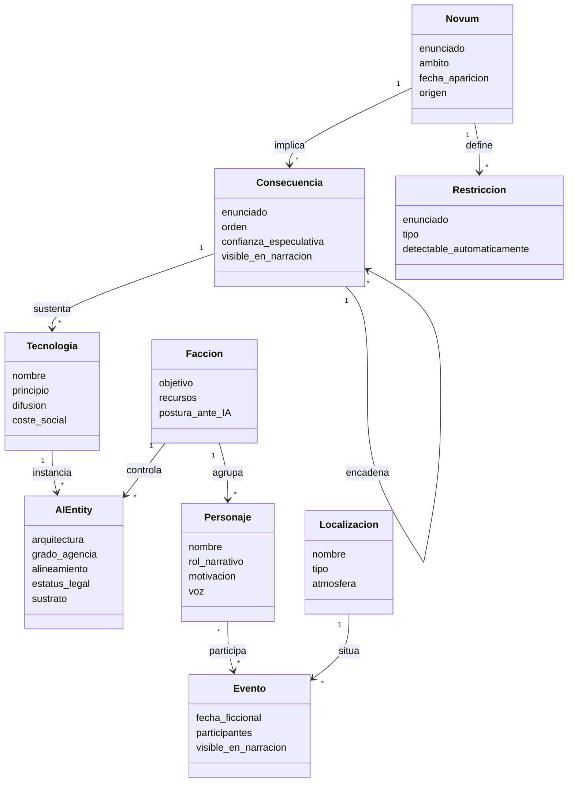
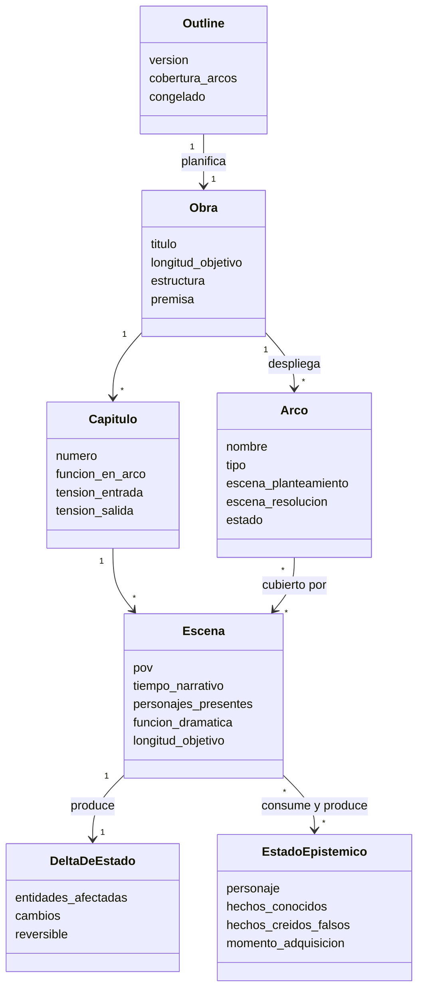
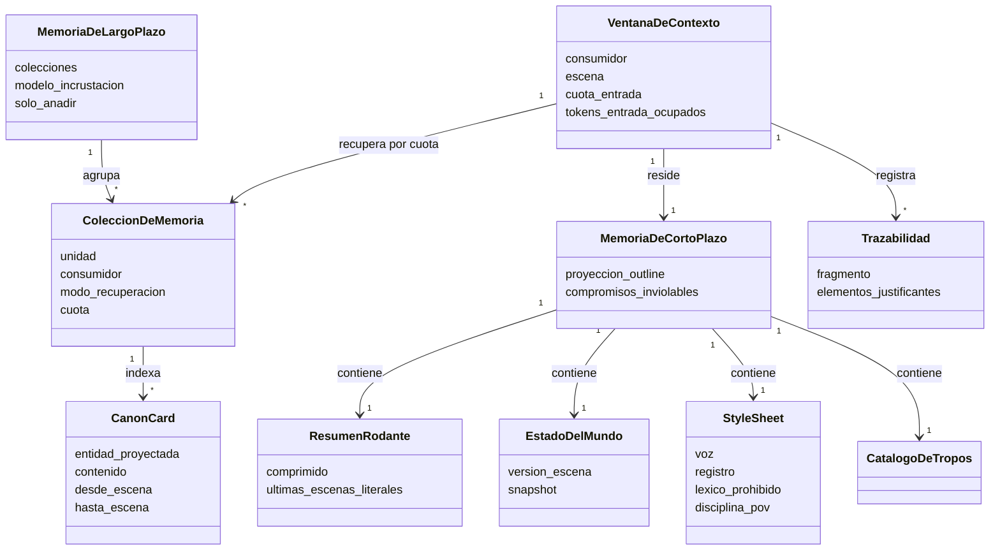
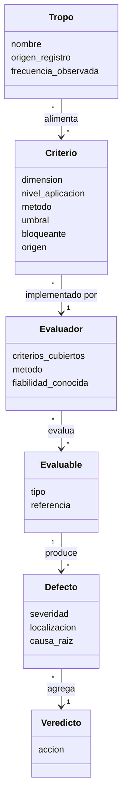

# definitions.md

Vocabulario del dominio de una solución de IA que genera novelas de ciencia ficción sobre el mundo posterior a la revolución de la IA.

Este documento define **qué entidades existen, qué atributos tienen y cómo se relacionan**. Las justificaciones de dominio están en `domain-knowledge.md`; las decisiones de diseño, en `architecture.md`.

Convención: los identificadores van sin acentos ni espacios, para que los diagramas rendericen en cualquier visor de Mermaid.

---

## 1. Storyworld (canon)

### Novum

Postulado especulativo raíz de la obra. El elemento novedoso que separa el mundo de la ficción del mundo real y del cual se deriva todo lo demás.

- **Atributos:** enunciado, ámbito (tecnológico / político / económico / cognitivo), fecha de aparición, origen (prompt o invención).
- **Relaciones:** `implica` → Consecuencia; `define` → Restriccion.

### Consecuencia

Derivación causal de un Novum o de otra Consecuencia.

- **Atributos:** enunciado, orden (1.º, 2.º, 3.er), confianza especulativa, visible en la narración (sí/no).
- **Relaciones:** `deriva_de` → Novum | Consecuencia; `sustenta` → RegimenGobernanza, RegimenEconomico, NormaSocial, Tecnologia.

### Restriccion

Regla inviolable del mundo: lo que no puede ocurrir.

- **Atributos:** enunciado, tipo (físico / legal / tecnológico / social), detectable automáticamente (sí/no).

### AIEntity

Entidad artificial con relevancia narrativa o estructural.

- **Atributos:** arquitectura, grado de agencia, alineamiento, estatus legal, sustrato, opacidad para los humanos.
- **Relaciones:** `instancia_de` → Tecnologia; `participa_en` → Evento; `miembro_de` → Faccion.

### Tecnologia

Artefacto o capacidad técnica existente en el mundo.

- **Atributos:** nombre, principio de funcionamiento, difusión, coste social.

### RegimenGobernanza / RegimenEconomico / NormaSocial

Estructuras derivadas de Consecuencias.

- **Atributos:** descripción, ámbito geográfico, vigencia temporal.
- **Relaciones:** `deriva_de` → Consecuencia.

### Faccion

Grupo con agencia colectiva: estado, corporación, culto, red informal.

- **Atributos:** objetivo, recursos, postura respecto a la IA.
- **Relaciones:** `agrupa` → Personaje, AIEntity.

### Personaje

- **Atributos:** nombre, rol narrativo, motivación, voz, atributos físicos fijos.
- **Relaciones:** `miembro_de` → Faccion; `conoce` → EstadoEpistemico; `participa_en` → Evento; `protagoniza` → Arco.

### Localizacion

- **Atributos:** nombre, tipo, atmósfera, régimen aplicable.

### Evento

Hecho situado en el tiempo del mundo.

- **Atributos:** fecha ficcional, participantes, consecuencias, visible en la narración (sí/no).

### LineaTemporal

Ordenación de Eventos. Incluye eventos de trasfondo nunca narrados.

### Modelo de clases



---

## 2. Artefacto narrativo

Jerarquía: `Obra → Capitulo → Escena`

`Arco` no es un nivel de esta jerarquía: la atraviesa.

### Obra

- **Atributos:** título, longitud objetivo, estructura, premisa, resolución.

### Capitulo

- **Atributos:** número, función en el arco, tensión de entrada y de salida, longitud objetivo.

### Arco

Hilo narrativo con planteamiento y resolución que atraviesa varias escenas, normalmente varios capítulos. Un arco sin resolver al terminar la obra es un hilo abierto.

- **Atributos:** nombre, tipo (de personaje / de trama / temático), escena de planteamiento, escena de resolución, estado (abierto | resuelto).
- **Relaciones:** `protagonizado_por` → Personaje; `cubierto_por` → Escena.

### Escena

Unidad mínima de generación y evaluación.

- **Atributos:** POV, tiempo narrativo, localización, personajes presentes, función dramática (setup / conflicto / giro / resolución), longitud objetivo.
- **Relaciones:** `produce` → DeltaDeEstado; `consume` y `produce` → EstadoEpistemico.

### DeltaDeEstado

Qué cambia en el mundo al terminar una escena.

- **Atributos:** entidades afectadas, cambios, reversible (sí/no).

### EstadoEpistemico

Qué sabe cada personaje al entrar y al salir de una escena.

- **Atributos:** personaje, hechos conocidos, hechos creídos falsamente, momento de adquisición.

### Outline

Plan jerárquico de la obra; contrato entre planificación y generación.

- **Atributos:** versión, jerarquía de capítulos y escenas, cobertura de arcos, congelado (sí/no).

### Modelo de clases



---

## 3. Entrada e intención del usuario

### Prompt

Entrada libre del usuario, en un único mensaje. Longitud y especificidad variables.

### ContratoDeBrief

Objeto derivado del Prompt que declara qué es obligación y qué es espacio de invención.

- **Atributos:** lista de Compromisos, lista de Huecos, grado de libertad (0–1).

### Compromiso

Afirmación explícita o fuertemente implícita del usuario.

- **Atributos:** enunciado, tipo (premisa / tono / personaje / final / …), dureza (inviolable | preferencia), verificable (sí/no).

### Hueco

Decisión no especificada que el sistema debe resolver.

- **Atributos:** ámbito, resuelto por, canon resultante.

---

## 4. Memoria y contexto de generación

La generación no tiene una memoria, tiene dos, y una tercera cosa que resulta de juntarlas. Se distinguen por cómo llegan a una llamada: lo que está siempre, lo que se recupera por consulta, y lo ensamblado para esa llamada concreta.

### MemoriaDeLargoPlazo

El índice de la ejecución. Agrupa las `ColeccionDeMemoria` y es la única memoria de la que se recupera por consulta.

- **Atributos:** colecciones, identificador del modelo de incrustación, escritura (solo añadir).
- **Relaciones:** `agrupa` → ColeccionDeMemoria.

### ColeccionDeMemoria

Conjunto homogéneo dentro de la `MemoriaDeLargoPlazo`. No es un compartimento arbitrario: cada colección tiene su propia unidad, y unidades distintas no se comparan entre sí.

- **Atributos:** unidad, consumidor, modo de recuperación, cuota.
- **Relaciones:** `pertenece_a` → MemoriaDeLargoPlazo.

### MemoriaDeCortoPlazo

Lo residente y secuencial: está en la ventana siempre, sin consulta de por medio y sin estar indexado.

- **Atributos:** `ResumenRodante`, `EstadoDelMundo`, proyección acotada del `Outline`, `StyleSheet`, `Compromiso`s inviolables, `CatalogoDeTropos`.

### VentanaDeContexto

Lo ensamblado para una llamada concreta: la `MemoriaDeCortoPlazo` residente más las cuotas recuperadas de la `MemoriaDeLargoPlazo`.

- **Atributos:** consumidor, escena, residentes, recuperados por colección, cuota de entrada de la etapa, tokens de entrada ocupados.
- **Relaciones:** `reside` → MemoriaDeCortoPlazo; `recupera_de` → ColeccionDeMemoria; `registra` → Trazabilidad.

### Componentes de las memorias

Las cinco entidades siguientes no son memorias: son los componentes de las anteriores.

#### CanonCard

Proyección compacta de una entidad de storyworld. Es la unidad de la colección de CanonCards. **Inmutable:** un cambio en la entidad proyectada cierra la tarjeta vigente y añade otra.

- **Atributos:** entidad proyectada, contenido, desde_escena, hasta_escena.

#### ResumenRodante

Comprimido acumulativo de lo ya narrado, más las últimas N escenas en literal. Componente de la `MemoriaDeCortoPlazo`.

#### StyleSheet

Voz, registro, léxico prohibido, densidad de exposición, disciplina de POV. Componente de la `MemoriaDeCortoPlazo`.

#### EstadoDelMundo

Snapshot mutable, versionado por escena, construido aplicando Deltas. Componente de la `MemoriaDeCortoPlazo`.

#### Trazabilidad

Vínculo entre un fragmento generado y los elementos de canon, compromiso y config que lo justifican. Es el registro de qué aportó la `VentanaDeContexto` con la que se generó ese fragmento.

### Modelo de clases



---

## 5. Calidad

### Evaluable

Unidad sujeta a evaluación: Escena, Capitulo, Arco u Obra.

### Criterio

Predicado evaluable.

- **Atributos:** dimensión, nivel de aplicación, método (determinista / modelo / humano), umbral, bloqueante (sí/no), origen (config / brief / política).

### Evaluador

Implementación de uno o varios Criterios: validador programático o juez LLM con rúbrica. No hay revisor humano en ejecución.

- **Atributos:** criterios cubiertos, método, fiabilidad conocida.

### Defecto

Instancia de violación de un Criterio.

- **Atributos:** criterio, severidad, localización, causa raíz (contexto ausente / canon contradictorio / deriva de estilo / fallo de outline / config infactible / presupuesto excedido).

> **`presupuesto excedido`** se refiere a la **cuota de ventana** de la etapa, no al techo en dinero de la ejecución. Se registra cuando el conteo de entrada propio y el del proveedor divergen por encima de `umbral_deriva_conteo` (`architecture.md` §3.15); no bloquea.

### Veredicto

Resultado agregado por Evaluable.

- **Atributos:** evaluable, defectos, acción (aceptar | corregir | regenerar | escalar).

### Tropo

Patrón saturado del género, registrado para su detección.

- **Atributos:** nombre, descripción, marcadores, origen del registro (curado | aprendido), frecuencia observada.

### CatalogoDeTropos

Colección de Tropos contra la que se puntúa la originalidad de un Novum o de una escena.

- **Atributos:** entradas, versión, cobertura declarada.

### InformeDeEjecucion

Documento que acompaña al manuscrito y registra qué hizo el sistema y por qué. Sustituye funcionalmente a la supervisión humana.

- **Atributos:** compromisos cumplidos, compromisos no verificables, huecos resueltos y con qué, novum elegido y su puntuación, defectos no resueltos y su localización, presupuesto consumido, causas raíz registradas.

> Las causas raíz llegan aquí también cuando **no** producen un `Defecto`: `contexto ausente` por recorte de ventana y `presupuesto excedido` por deriva del conteo de entrada (`architecture.md` §3.13 y §3.15).

### Modelo de clases



---

## 6. Configuración

### config

Fichero de parámetros de forma y operación, ajeno a la verdad ficcional.

```
config
├── identidad     { id, version, congelado_desde }
├── estructura    { objetivo_palabras, capitulos, forma_distribucion, pov_max }
├── poetica       { tono, ritmo, densidad_especulativa, registro }
├── calidad       { umbrales_por_puerta, criterios_activos, densidad_minima }
└── operacion     { modelo, reintentos_max, presupuesto, techo_ventana,
                    umbral_deriva_conteo, formato_salida }
```

- **estructura** — parámetros verificables de forma determinista.
- **poetica** — parámetros solo evaluables por juicio.
- **calidad** — umbrales y criterios activos; no editable por el usuario final.
- **operacion** — parámetros de ejecución, invisibles para el usuario final. `presupuesto` es un techo **en dinero** por ejecución. `techo_ventana` es el techo de tokens **de entrada**, y se aplica a la **suma de las llamadas en vuelo de una misma etapa**, no a una llamada suelta; la salida no lleva techo en tokens (`architecture.md` §3.13). `umbral_deriva_conteo` es la divergencia tolerada entre el conteo de entrada propio y el del proveedor antes de registrar `presupuesto excedido` (§3.15); está sin valor (§10.2). `formato_salida` es markdown; es el único formato soportado.

La entrada completa del sistema son dos cosas: este fichero y un único prompt del usuario. No hay más interacción.
