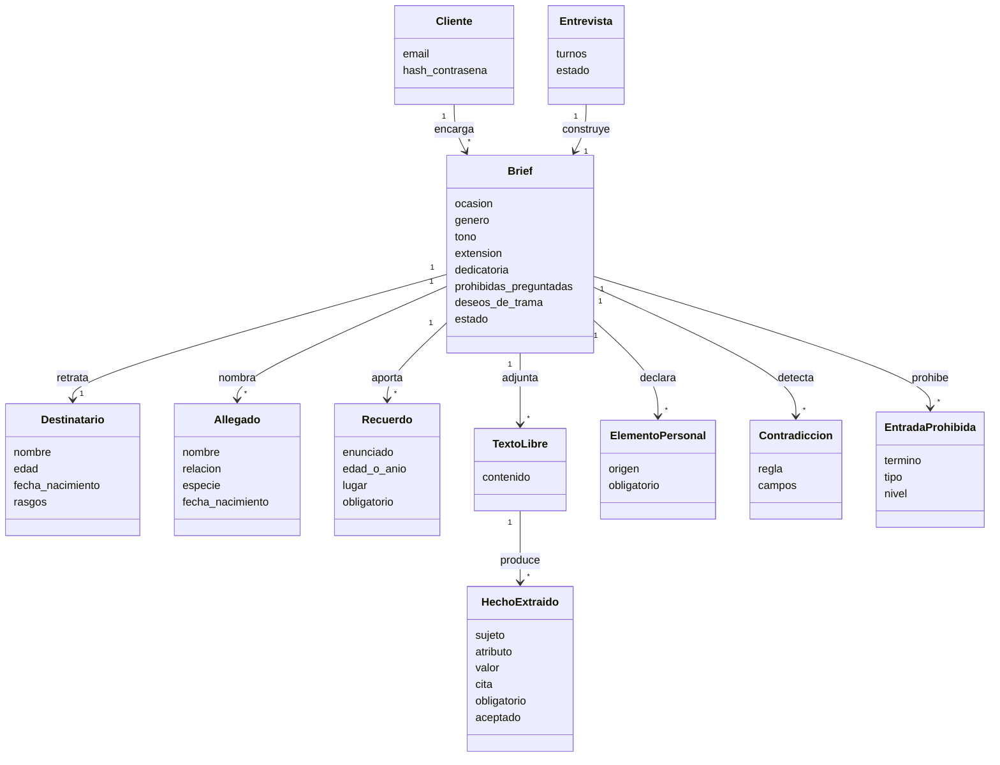
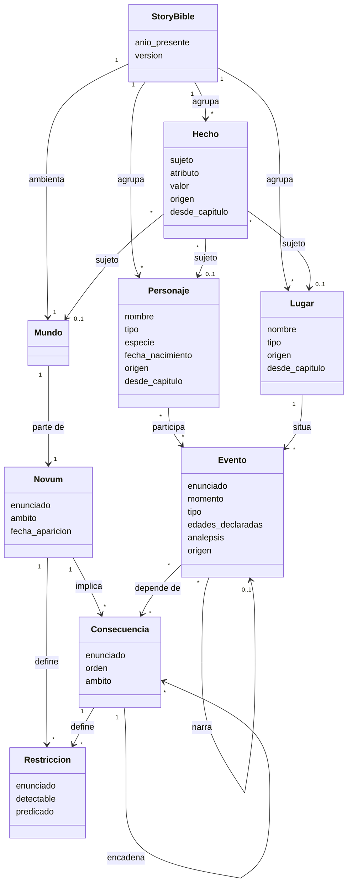
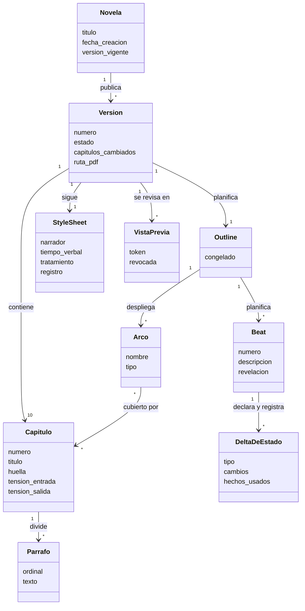
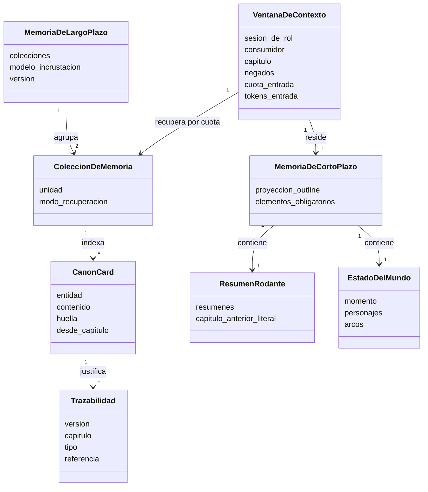
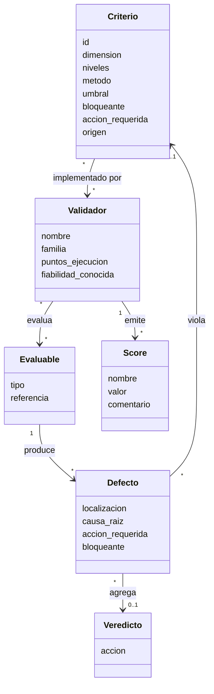

# definitions.md

Vocabulario del dominio de una solución de IA que genera **novelas personalizadas de regalo ambientadas en el mundo posterior a la revolución de la IA**.

Este documento define qué entidades existen, qué atributos tienen y cómo se relacionan, y proyecta cada término al identificador que usa el código (§12). Las justificaciones de dominio están en `domain-knowledge.md`; las decisiones de diseño, en `architecture.md`.

Convención: los nombres de entidad van sin acentos ni espacios, para que los diagramas rendericen en cualquier visor de Mermaid.

---

## 1. Personalización y entrada

### Cliente

Persona que encarga la novela y usa la plataforma con su cuenta. Es propietaria de todo lo que crea: novelas, briefs, listas prohibidas y entradas del audit log.

- **Atributos:** email, hash de la contraseña, fecha de alta.
- **Relaciones:** `posee` → Novela; `define` → ListaProhibida de nivel cliente.

> La «configuración» que el encargo asocia a cada usuario es su brief. El «editor humano» de la edición manual trabaja con la cuenta del cliente: no es otro tipo de usuario.

### Destinatario

Persona real a quien se regala la novela. Es siempre la protagonista.

- **Atributos:** nombre (forma canónica exacta), edad, fecha de nacimiento (declarada, o derivada del año presente y la edad), rasgos, relación con el cliente.

### Allegado

Persona o animal cercano al destinatario que el cliente nombra: pareja, hijos, amigos, mascotas.

- **Atributos:** nombre (forma canónica exacta), relación, especie (persona | animal), edad o fecha de nacimiento si se conocen.

> Si solo se conoce su edad, su fecha de nacimiento es el 1 de enero de (año presente − edad), la misma regla que la del destinatario (`domain-knowledge.md` §5.2). Sin edad ni fecha, no tiene fecha de nacimiento.

### Recuerdo

Episodio real de la vida del destinatario que el cliente aporta para que la novela lo incorpore.

- **Atributos:** enunciado, edad del destinatario o año en que ocurrió, allegados presentes, lugar, obligatorio (sí/no).

### TextoLibre

Texto pegado por el cliente —una anécdota, una carta— del que se extraen hechos. **Es contenido no confiable:** ningún rol lo recibe literal salvo el extractor, y el resto del sistema solo ve sus `HechoExtraido`.

- **Atributos:** contenido, hechos extraídos, instrucciones descartadas.

### HechoExtraido

Afirmación sacada de un `TextoLibre` como sujeto, atributo y valor, acompañada de la cita literal que la sostiene.

- **Atributos:** sujeto, atributo, valor, cita, obligatorio (sí/no), aceptado por el cliente (sí/no).

> Solo se guardan los hechos **verificados**, los que tienen su cita literal en el texto. Se descartan tres: el que no la tiene, que es la forma determinista de impedir que el extractor invente; el de sujeto desconocido, que no es el destinatario ni un allegado del brief; y el que tiene una cita que se solapa con una frase marcada por el detector de inyección.

### Brief

Objeto estructurado y validado con schema que resulta de la entrevista. Es el contrato de la novela: lo que el cliente fijó y lo que deja al sistema.

- **Atributos:** destinatario, allegados, ocasión, recuerdos, género, tono, extensión, dedicatoria, entradas prohibidas, prohibidas preguntadas (sí/no), deseos de trama, textos libres con sus hechos, elementos personales, estado (borrador | confirmado).

> Las entradas prohibidas son obligatorias de preguntar, aunque la lista puede quedar vacía si el cliente responde «ninguna». Los **deseos de trama** son una lista opcional de lo que el cliente quiere que ocurra, como «que salga un robot». Llegan al planner, y un tropo pedido en ellos no se penaliza (`CatalogoDeTropos`).
>
> Los datos faltantes, las contradicciones y los huecos no se guardan: se calculan en cada turno de la entrevista.
>
> Un brief confirmado es inmutable. Cambiar después un dato de la novela es una `SolicitudDeCambio`, no una edición del brief.

### ElementoPersonal

Dato del brief que la novela incorpora: el nombre del destinatario, un rasgo, un recuerdo, un allegado o un hecho extraído aceptado.

- **Atributos:** origen (campo del brief o hecho extraído), obligatorio (sí/no), hechos de la story bible que lo representan.

> Un elemento **obligatorio** debe aparecer en al menos un capítulo, y se comprueba contra `UsoDeHecho`. El nombre del destinatario es obligatorio siempre.

### Hueco

Lo que el brief no fija y el sistema tiene que inventar: el novum, la trama, los personajes y lugares secundarios.

> Un hueco es de un solo uso: en cuanto el sistema lo resuelve, el resultado entra en la story bible y deja de ser libre.

### DatoFaltante

Campo obligatorio del brief que no tiene valor. Mientras quede alguno, el brief no se puede confirmar.

### Contradiccion

Par de datos del brief que son incompatibles según una regla del catálogo de contradicciones (`domain-knowledge.md` §4.3).

- **Atributos:** regla, campos implicados.

> Mientras quede alguna, el brief no se puede confirmar. Desaparece cuando el cliente cambia uno de sus datos.

### Ocasion

Motivo del regalo: cumpleaños, boda, aniversario, jubilación u otra.

### Genero

Subgénero narrativo dentro del mundo post-IA, de un catálogo cerrado: aventura, humor, romance, misterio, drama, fábula.

### Tono

De un catálogo cerrado: tierno, divertido, emocionante, nostálgico, épico, inquietante.

### Extension

Longitud objetivo de cada capítulo: corta (1.100 palabras), media (1.250) o larga (1.400). La novela tiene siempre 10 capítulos, y cada uno queda entre 1.000 y 1.500 palabras sea cual sea su objetivo.

### FranjaDeEdad

Intervalo de edad del destinatario: infantil (0–12), juvenil (13–17) o adulto (18 o más). De ella dependen las reglas de contradicción, el registro de la `StyleSheet` y los objetivos de legibilidad.

### Dedicatoria

Texto de la portada, dirigido al destinatario.

### ListaProhibida

Palabras o temas que no pueden aparecer en la novela.

- **Atributos:** nivel (global | cliente | novela), entradas.

Los tres niveles:

- **Global:** insultos y términos ofensivos, comunes a toda la plataforma.
- **Cliente:** los que un cliente fija para todas sus novelas.
- **Novela:** los que el cliente declara en el brief, como el nombre de una expareja o un tema que no quiere.

### EntradaProhibida

- **Atributos:** término, tipo (palabra | tema), nivel.

> El guardarraíl compara términos normalizados (`architecture.md` §11.1). Un tema entra además en las instrucciones del writer y en la rúbrica del crítico, porque un tema no se agota en sus palabras.

### Entrevista

Conversación entre el cliente y el entrevistador que construye el brief.

- **Atributos:** turnos, brief en curso, coste acumulado, estado (abierta | confirmada).

> Tiene su propio `Presupuesto`.

### Modelo de clases



---

## 2. Mundo post-IA y story bible

La story bible es el canon de la novela: lo que es verdad dentro de la ficción. Reúne el mundo post-IA inventado y los datos personales del brief convertidos en ficción. Vive en SQLite.

### StoryBible

- **Atributos:** año presente, mundo, personajes, lugares, hechos, cronología.

> El **año presente** es el de la fecha de creación de la novela. La historia transcurre en un presente alternativo en el que la revolución de la IA ya ocurrió (`domain-knowledge.md` §5.2).
>
> **La story bible es de cada versión.** Toda fila lleva su versión, y una candidata nueva copia la de la versión vigente en una sola transacción. La de una versión publicada no cambia.

### Mundo

El mundo post-IA de la novela: el `Novum`, sus `Consecuencia` y sus `Restriccion`. Es además el sujeto de los hechos que no son de un personaje ni de un lugar.

### Novum

Postulado especulativo raíz: qué capacidad de la IA apareció, cuándo, y qué dejó de ser cierto desde entonces.

- **Atributos:** enunciado, ámbito (tecnológico | social | cognitivo), fecha de aparición (anterior al año presente).
- **Relaciones:** `implica` → Consecuencia; `define` → Restriccion.

### Consecuencia

Derivación causal del Novum o de otra Consecuencia.

- **Atributos:** enunciado, orden, ámbito (tecnología | gobierno | economía | norma social | entidad artificial).
- **Relaciones:** `deriva_de` → Novum | Consecuencia; `define` → Restriccion.

> El **orden** es la profundidad desde el novum: 1 si deriva de él directamente, y como mucho 3.

### Restriccion

Regla inviolable del mundo: lo que no puede ocurrir. La define el novum o una consecuencia.

- **Atributos:** enunciado, detectable automáticamente (sí/no), predicado (si es detectable).

> Una restricción es **detectable** cuando se escribe con uno de tres predicados cerrados: `inmutable(tipo, atributo)`, `prohibido(tipo, atributo, valor)` u `obligado(sujeto, atributo, valor)`. El tipo es el de un sujeto: personaje, lugar o mundo. La comprueban sobre el delta los validadores `delta-declarado` y `delta-real`. Lo que no cabe en esos tres lo juzga el crítico.

### Personaje

- **Atributos:** nombre (forma canónica exacta), tipo (destinatario | allegado | inventado), especie (persona | animal | entidad artificial), rasgos, fecha de nacimiento (opcional), origen (brief | inventado), capítulo desde el que existe.
- **Relaciones:** `participa_en` → Evento; `protagoniza` → Arco.

> El nombre se escribe desde su **hecho de nombre**, así que cambiar el nombre es cambiar ese hecho. Una **variante de nombre** es un texto con la misma forma normalizada que un nombre canónico y otra forma literal, como «toby» por «Toby»: `nombres-exactos` la marca como defecto. Un personaje sin fecha de nacimiento queda fuera de los invariantes T2 y T5 (`domain-knowledge.md` §5.3). Existe desde el capítulo 0 si viene del brief o de la planificación, y desde el capítulo que lo introduce si lo registra el registrador.

### Lugar

- **Atributos:** nombre (forma canónica exacta), tipo, descripción, origen (brief | inventado), capítulo desde el que existe.

### Hecho

Afirmación atómica de la story bible, formada por sujeto, atributo y valor: «el perro del destinatario se llama Toby». Es la unidad que registra en qué capítulos se usa y la que modifica una solicitud de cambio.

- **Atributos:** sujeto (personaje, lugar o mundo), atributo, valor, origen (brief | texto libre | inventado), capítulo desde el que rige.
- **Relaciones:** `se_usa_en` → Capitulo, vía UsoDeHecho; `representa` → ElementoPersonal.

> **Solo admite inserciones.** Un cambio no reescribe la fila: añade la sucesora, con su capítulo de inicio. En el capítulo *n* rige la de mayor capítulo de inicio ≤ *n* y, si empatan, la última insertada. La única excepción es volver a registrar un capítulo de la candidata, que reemplaza los hechos que había escrito su registro anterior (`architecture.md` §8.3).
>
> **Los de origen brief y los de origen texto libre son inmutables para todos los roles.** Solo los cambia una solicitud de cambio o una edición manual del cliente.
>
> Los atributos de los hechos de origen brief forman un vocabulario cerrado, definido en `domain` (`architecture.md` §4.1).

### UsoDeHecho

Registro de que un capítulo de una versión usa un hecho. Solo lo escribe el registrador; los usos que declara el writer viven en su delta declarado.

- **Atributos:** hecho, capítulo, versión.

### Evento

Suceso situado en el tiempo de la ficción.

- **Atributos:** enunciado, momento (AAAA-MM-DDTHH:MM), personajes presentes, lugar, tipo (ordinario | excluyente), personaje excluido (en un evento excluyente), edades declaradas (personaje → edad, cuando la fuente la fija), consecuencias de las que depende, capítulo y beat que lo narran (vacíos en el trasfondo), analepsis (sí/no), evento que narra, origen (brief | planificado | registrado).

> Un evento **excluyente** —muerte, partida definitiva— impide que su personaje excluido esté presente en eventos posteriores. Una **analepsis** narra un evento anterior al presente de la trama, como un recuerdo; no rompe el orden narrativo. Si cuenta un evento de trasfondo que ya existe, lo referencia como **evento que narra** en vez de duplicarlo, y la cronología lo cuenta una sola vez. Un evento **depende de una consecuencia** cuando no podría ocurrir sin ella, como una conversación con un tutor artificial; por eso no puede ser anterior al novum.
>
> El **origen** dice de dónde sale. Del brief salen los recuerdos. El planner pone los eventos de los beats del outline y los antecedentes, que son eventos planificados sin beat. Del registrador sale lo que extrajo de los capítulos aceptados. Los nacimientos no son eventos: son la fecha de nacimiento de cada `Personaje`.

### Cronologia

Ordenación de los eventos de una versión: los recuerdos, los antecedentes y la trama. Alimenta el validador formal de la historia. Las fechas de nacimiento y la fecha del novum no son eventos, pero entran con ellos en el `FicheroDeCronologia`.

Se verifican **dos cronologías**:

- la **planificada**, con los eventos de origen brief y los planificados, al congelar el outline;
- la **registrada**, con los de origen brief, los planificados sin beat y los registrados, en el gate.

### Modelo de clases



---

## 3. Artefacto narrativo

Jerarquía: `Novela → Version → Capitulo → Parrafo`. El `Outline` de cada versión planifica los capítulos y sus `Beat`; el `Capitulo` guarda lo producido. `Arco` no es un nivel de la jerarquía: la atraviesa.

### Novela

- **Atributos:** título, destinatario, cliente propietario, fecha de creación, versión vigente.

> La **fecha de creación** fija el año presente, y en ella se comprueba la regla C4 (`domain-knowledge.md` §4.3).
>
> Su **estado** se deriva y no se guarda:
>
> - **entrevista** — el brief sigue en borrador;
> - **lista** — el brief está confirmado, y no hay versión publicada ni generación sin terminar;
> - **en curso** — hay una generación sin terminar y todavía ninguna versión publicada;
> - **publicada** — tiene al menos una versión publicada.

### Version

Estado completo y publicable de la novela. **Una versión publicada es inmutable, y la anterior se conserva siempre.**

- **Atributos:** número, estado (candidata | publicada | rechazada), ejecución que la produjo, capítulos, capítulos cambiados, fecha de publicación, ruta del PDF.

> El **número** se asigna al publicar. Una candidata o una rechazada no tiene número: se identifica por su id. Si la versión es de generación, de cambio o de edición lo dice el tipo de su `Ejecucion`.
>
> Cada versión tiene su copia de los 10 capítulos, cada uno con una **huella** de su título y su texto. Un capítulo **cambiado** es el que tiene una huella distinta de la de la última versión publicada. La lista se guarda al publicar.
>
> El PDF se genera al publicar (`architecture.md` §9.7), y la versión guarda su ruta.

### Capitulo

Unidad de generación, de validación, de punto de control y de regeneración. Guarda solo lo producido; lo planificado vive en el `Outline`.

- **Atributos:** número (1–10), título (copiado del outline), texto, huella, resumen, tensión de entrada y de salida medidas (de 1 a 5).

### Parrafo

Párrafo de un capítulo de una versión: la unidad de la colección de prosa y de la edición dirigida.

- **Atributos:** versión, capítulo, ordinal, texto.

> El texto de un capítulo es plano, y sus párrafos se separan con una línea en blanco.

### Beat

Suceso planificado dentro de un capítulo, en el que pasa o cambia algo. Es la unidad de cambio de estado y de cronología, pero no se genera por separado: el writer escribe el capítulo entero.

- **Atributos:** número, descripción, evento, hechos que usa, revelación (tema y contenido, si revela algo).
- **Relaciones:** `declara` y `registra` → DeltaDeEstado.

> Su evento lleva todos los atributos de `Evento`.

### Arco

Hilo narrativo con planteamiento y resolución que atraviesa varios capítulos. Un arco sin resolver al terminar la novela es un hilo abierto.

- **Atributos:** nombre, tipo (de personaje | de trama | temático), capítulo de planteamiento, capítulo de resolución.
- **Relaciones:** `protagonizado_por` → Personaje; `cubierto_por` → Capitulo.

> Su **estado** —abierto o resuelto— se deriva de los deltas reales de la versión y no se guarda: está resuelto si algún delta real lo declara resuelto.

### Outline

Plan de la novela y contrato entre planificación y escritura. Es de cada versión: una versión de cambio o de edición copia el de la vigente.

- **Atributos:** título de la novela, capítulos (título, función en el arco, tensión planificada de entrada y de salida de 1 a 5, beats), arcos, asignación de los elementos obligatorios a capítulos, congelado (sí/no).

### DeltaDeEstado

Qué cambia en la story bible al terminar un beat.

- **Atributos:** tipo (declarado | real), cambios (sujeto, atributo, valor), eventos, hechos usados, hechos nuevos, arcos resueltos.

> El writer declara el delta que pretendía; el registrador extrae el real del texto aceptado. Son dos filas del mismo concepto, no dos conceptos.

### StyleSheet

Reglas de estilo de la novela. Las fija el planner y se congelan con el outline. Es de cada versión, igual que el outline.

- **Atributos:** narrador (primera | tercera persona), tiempo verbal (pasado | presente), tratamiento (tú | usted) entre cada par de personajes, registro, tono, género, léxico a evitar.

> El **registro** sale de la `FranjaDeEdad` del destinatario.

### ResumenDeCapitulo

Resumen de un capítulo aceptado. Lo escribe el registrador y construye el contexto de los capítulos siguientes.

### PuntoDeControl

Estado persistido del que parte una reanudación. Solo admite inserciones.

- **Atributos:** ejecución, capítulo.

> Queda una fila por capítulo aceptado, y reanudar parte de la última. Hay además puntos de control de fase:
>
> - el outline congelado con el canon inicial es el capítulo 0;
> - en el gate, reanudar repite el ciclo en curso;
> - en un cambio o una edición, reanudar rehace los capítulos afectados que aún no se registraron.

### Portada

- **Atributos:** título, nombre del destinatario, dedicatoria.

### FichaDePersonajes

Página de la lectura, generada desde la story bible, con cada personaje y cada lugar y enlaces a los capítulos donde aparecen. El encargo la llama «ficha de personajes y lugares».

### VistaPrevia

Vista de una candidata en la lectura web, la única por la que se ve una versión sin publicar. La usan el revisor visual y la exportación del PDF.

- **Atributos:** candidata, token, revocada (sí/no).

> El worker emite el token. La primera carga lo canjea por una cookie limitada a esa candidata, que se revoca al terminar el gate. La **ruta de impresión** es la página de la lectura que la exportación imprime a PDF, y también se abre con esa cookie. Lo que el lector recibe antes de confirmar un cambio, en la web o en MCP, no es una vista previa: es la **propuesta** (`SolicitudDeCambio`).

### Modelo de clases



---

## 4. Memoria y contexto de generación

La generación tiene dos memorias y una tercera cosa que resulta de juntarlas. Se distinguen por cómo llegan a una sesión de rol: lo que está siempre, lo que se recupera por consulta y lo ensamblado para esa sesión concreta.

### MemoriaDeLargoPlazo

El índice de una versión. Agrupa las `ColeccionDeMemoria` y es la única memoria de la que se recupera por consulta.

- **Atributos:** colecciones, identificador del modelo de incrustación, versión, escritura (solo añadir, salvo el reemplazo de un registro repetido: `architecture.md` §8.3).
- **Relaciones:** `agrupa` → ColeccionDeMemoria.

> Cada versión tiene su copia del índice, y las copias comparten los vectores por huella de contenido.

### ColeccionDeMemoria

Conjunto homogéneo dentro de la `MemoriaDeLargoPlazo`. Cada colección tiene su propia unidad, y unidades distintas no se comparan entre sí.

- **Atributos:** unidad, consumidores, modo de recuperación.
- **Colecciones:** **CanonCards**, cuya unidad es la tarjeta de una entidad de la story bible, y **Prosa**, cuya unidad es el `Parrafo` de un capítulo aceptado.

### Consumidor

Rol o componente que recibe unidades recuperadas: writer, crítico, editor y linter de repetición.

> La **cuota** no es atributo de la colección: `config.retrieval.quotas` la declara para cada par (colección, consumidor), y `0` significa que esa colección no entra en la ventana de ese consumidor (`architecture.md` §6.5).

### MemoriaDeCortoPlazo

Lo residente: está en la ventana siempre, sin consulta de por medio y sin estar indexado.

- **Atributos:** `StyleSheet`, elementos obligatorios, proyección del `Outline`, `EstadoDelMundo`, `ResumenRodante` y `CatalogoDeTropos`. Cada consumidor recibe su subconjunto (`architecture.md` §6.4).

> El capítulo, los defectos, la propuesta de un cambio y la rúbrica no son residentes: son **entradas de la llamada**.

### VentanaDeContexto

Lo ensamblado para una `SesionDeRol`: la `MemoriaDeCortoPlazo` residente, lo recuperado de la `MemoriaDeLargoPlazo` por cuota y las entradas de la llamada. Se guarda una por sesión de rol.

- **Atributos:** sesión de rol, consumidor, capítulo, residentes, entradas de la llamada, recuperados por colección, **negados**, cuota de entrada, tokens de entrada ocupados.
- **Relaciones:** `reside` → MemoriaDeCortoPlazo; `recupera_de` → ColeccionDeMemoria.

> **Negados** son las unidades que la recuperación encontró y la ventana no entregó, por cuota agotada o por recorte. Sin ellas no se distingue «el modelo falló» de «el modelo no vio la tarjeta».

### Componentes de las memorias

Las entidades siguientes no son memorias: son sus componentes.

#### CanonCard

Proyección compacta de una entidad de la story bible y unidad de la colección de CanonCards. **Inmutable:** un cambio en la entidad añade una tarjeta sucesora. Volver a registrar un capítulo de la candidata reemplaza las tarjetas de su registro anterior, como los hechos.

- **Atributos:** entidad proyectada, contenido, huella, `desde_capitulo`, versión.

> `hasta_capitulo` no se guarda: es el `desde_capitulo` de la tarjeta sucesora de la misma entidad en esa versión. Cada versión tiene su copia de las tarjetas, y las copias comparten los vectores por huella.

#### ResumenRodante

Los resúmenes de los capítulos 1..*n*−2 más el capítulo *n*−1 literal. Componente de la `MemoriaDeCortoPlazo`.

#### EstadoDelMundo

Instantánea compacta de la story bible al empezar un capítulo, construida aplicando en orden los deltas reales de los anteriores. Componente de la `MemoriaDeCortoPlazo`.

- **Contenido:** el momento actual de la historia; por personaje, su último lugar, si está excluido y los hechos que cambió algún delta real; y el estado de los arcos.

> Pesa unos cientos de tokens. El detalle estable de cada entidad no va aquí: llega por las `CanonCard` recuperadas.

#### Trazabilidad

Vínculo entre un capítulo generado y los elementos que lo justificaron.

- **Atributos:** versión, capítulo, tipo (hecho | CanonCard | elemento obligatorio), referencia.

> Lo que la ventana negó queda en la `VentanaDeContexto` guardada de la sesión que generó el capítulo.

### Modelo de clases



---

## 5. Harness

### Rol

Función del sistema de generación que ejecuta un modelo. Cada rol trabaja en sesiones de rol del Claude Agent SDK, con sus instrucciones, sus tools, sus hooks, su modelo y sus límites.

- **Roles:** entrevistador, extractor, planner, writer, crítico, editor, registrador, juez y revisor visual (`architecture.md` §7.2).

### SesionDeRol

Una sesión del Claude Agent SDK de un rol, con su ventana. No es la `Sesion` de Langfuse ni la sesión de autenticación, que es el `TokenDeAcceso`.

- **Atributos:** rol, ejecución (vacía en la entrevista y en la interpretación de un cambio), evaluable e intento, ventana, tokens de entrada, de salida y de caché, coste, duración.

### WorkspaceDelHarness

Directorio de trabajo de los roles, `backend/harness_workspace/`. Contiene su `CLAUDE.md`, con las reglas de producto que cargan todos, sus skills y los ficheros de sus prompts. No es el `CLAUDE.md` de la raíz del repositorio, que instruye al desarrollo.

### Tool

Acción con schema validado que un rol puede invocar: entregar un capítulo, entregar defectos, actualizar el brief. **El contexto no se pide por tool:** lo ensambla el código (`architecture.md` §6).

### Hook

Función del harness que se ejecuta antes o después de una tool.

- **Hook de validación de capítulo:** después de que el writer o el editor entreguen texto; ejecuta los validadores programáticos del capítulo.
- **Hook de policy:** antes de cada tool; aplica la lista blanca de tools del rol y las palabras prohibidas sobre los campos de texto narrativo, y registra la decisión en el audit log.

Hay además un **hook de observabilidad**, fuera de los dos del encargo: cierra el span de las tools de Playwright MCP, que no tienen manejador propio (`architecture.md` §7.5).

### Skill

Paquete reutilizable de instrucciones que cargan varios roles.

### Componentes de código

Piezas del harness que son código, sin modelo:

- **Orquestador** — encadena las fases de una ejecución, abre cada sesión de rol con su ventana ya cerrada, aplica los límites y comprueba las aserciones.
- **Guardián de ventana** — antes de cada sesión, decide qué entra en su ventana dentro de su cuota y qué se recorta.
- **Recuperador** — consulta el índice con el corte temporal y la cuota de cada par (colección, consumidor).
- **Detector de inyección** — marca por patrones las frases dirigidas al sistema en un texto no confiable. No deniega.
- **Worker** — el proceso del sistema operativo que ejecuta la ejecución activa.
- **Cola** — las ejecuciones `created`, en orden de llegada y comunes a todo el servidor.
- **CLI** — la línea de órdenes del backend: reproduce el brief de ejemplo, lanza las evals, sube los prompts a Langfuse y mueve su etiqueta.

### Ejecucion

Una pasada del harness sobre una novela: la generación inicial, la aplicación de una solicitud de cambio o la de una edición manual.

- **Atributos:** tipo (generación | solicitud de cambio | edición manual), estado, fase, capítulo actual, candidata, versión base, posición en la cola, intentos por evaluable, reanudaciones, coste acumulado, motivo de bloqueo, PID y hora de arranque del worker, marca de cancelación, y la copia de la config y de las listas prohibidas y el commit del código de cada tramo.
- **Estados:** creada, en curso, terminada, bloqueada, cancelada, interrumpida (`architecture.md` §9.1).
- **Fases**, según el tipo:
  - generación: planificación, producción de capítulos, publicación;
  - solicitud de cambio: revalidación, edición, publicación;
  - edición manual: registro, propagación, publicación.
- **Motivo de bloqueo:** intentos agotados, presupuesto excedido, config infactible, fallo de render, contenido prohibido, error interno.

> Hay una sola ejecución activa en todo el servidor; las demás esperan en la cola. Solo `finished` y `cancelled` son terminales. Una ejecución `blocked` se reanuda igual que una `interrupted`: desde su punto de control, con intentos nuevos para el evaluable que la bloqueó y dentro de `max_resumes`. Un **tramo** es lo que corre entre dos reanudaciones, y cada uno parte con la config y las listas prohibidas vigentes al empezarlo. La candidata solo se rechaza al cancelar.

### SolicitudDeCambio

Cambio que el lector pide desde la lectura o desde un cliente MCP. **Su texto no es de confianza.**

- **Atributos:** selección, petición, propuesta, código de confirmación, versión base, estado (propuesta | confirmada | rechazada | caducada | aplicada), ejecución, versión resultante.

> La **selección** es un fragmento, `{versión, capítulo, cita}`, o un hecho, `{hecho}`. La **propuesta** es la interpretación estructurada de la petición: los hechos que cambian, con su valor antiguo y el nuevo, y los capítulos afectados. El lector la ve antes de confirmar, igual en la web que en MCP, y confirma presentando el código (`Confirmacion`).

### EdicionManual

Cambio del texto de un capítulo que hace a mano el cliente, o un editor humano con su cuenta.

- **Atributos:** versión base, capítulo, texto nuevo, hechos cambiados, estado (en cola | aplicada | rechazada), ejecución, versión resultante.

> Su texto es **contenido no confiable** en cuanto llega al registrador.

### Presupuesto

Techo en dinero, en USD, de cada ejecución y de cada entrevista (`config.operation.budget`). El coste de una sesión de rol es su uso exacto de tokens por el precio de su modelo en `operation.pricing`.

---

## 6. Calidad

### Evaluable

Unidad sujeta a evaluación, a la que `max_retries` cuenta los intentos:

- **capítulo** — las entregas de un capítulo, al producirlo o al editarlo por un cambio o una propagación;
- **regeneración de respaldo** — la del writer sobre un capítulo afectado por un cambio o una propagación que el editor no consiguió dejar válido;
- **outline** — las planificaciones;
- **ciclo del gate** — cada pasada del gate sobre una candidata;
- **interpretación de un cambio** — las propuestas del planner para una petición.

### Criterio

Predicado evaluable.

- **Atributos:** identificador, dimensión, niveles (capítulo, novela o los dos), método (determinista | modelo | humano | formal), umbral, bloqueante (sí/no), acción requerida (corregir | regenerar | volver a registrar | bloquear), origen (encargo | brief | catálogo), parámetros, rúbrica si lo juzga un modelo o una persona.

> El identificador de un criterio es único en todo el catálogo. Un criterio puede implementarlo más de un validador, y entonces comparte su umbral. Un criterio de los dos niveles tiene un solo identificador y un solo umbral. La **dimensión** es una etiqueta del catálogo, no un enumerado. Los criterios de los validadores de entrada —el brief, el texto libre, la salida de una tool— no tienen nivel. Cada métrica de un linter es un criterio determinista con su identificador. El tema prohibido es un criterio fijo que recibe los temas del brief como parámetro.

### CatalogoDeCriterios

Conjunto curado de criterios, versionado con el código en `domain` (`architecture.md` §10.3). La config activa los de rúbrica y fija los umbrales; los programáticos están siempre activos.

### Rubrica

Criterios con escala que aplican el crítico, el juez y la revisión humana. Cada criterio recibe una puntuación y una justificación; la lista está en `architecture.md` §10.3.

### Validador

Implementación de uno o varios criterios en uno o varios puntos del harness.

- **Atributos:** nombre, familia (programático | semántico | formal de la historia | formal del sistema), puntos de ejecución, criterios, fiabilidad conocida.
- **Puntos de ejecución:** validación del brief, extracción, salida de una tool, hook de validación, hook de policy, petición de cambio, crítico, registro, congelación del outline, entrega del mundo, gate de publicación, exportación del PDF, edición manual, linter en vivo, evaluación y CI.

> Un validador bloquea cuando lo hace alguno de sus criterios. Todo validador del producto envía su resultado a Langfuse como `Score`, salvo cuando no hay traza: en el linter en vivo y en el acto de guardar una edición manual. `harness-tla`, que juzga el sistema en CI, tampoco envía ninguno. Un juez sin fiabilidad medida es ruido con formato de métrica.

### Linter

Validador programático de la prosa: repeticiones y muletillas, legibilidad según la franja de edad del destinatario, clichés y giros de texto generado, y consistencia de tiempo verbal, narrador y tratamiento. Cada métrica es un criterio determinista.

### Defecto

Instancia de violación de un Criterio, o de una causa raíz que no tiene criterio.

- **Atributos:** criterio (opcional), localización, causa raíz, acción requerida, bloqueante.
- **Causa raíz** (conjunto cerrado): contexto ausente, canon contradictorio, cronología incoherente, deriva de estilo, fallo de outline, personalización ausente, contenido prohibido, fallo de render, config infactible, presupuesto excedido, deriva del conteo.

> `presupuesto excedido` es el techo en dinero (`Presupuesto`). La **deriva del conteo** se registra cuando el conteo de entrada propio y el del proveedor divergen por encima de `count_drift_threshold` (`architecture.md` §6.10); no bloquea.

### Veredicto

Resultado agregado por Evaluable.

- **Atributos:** evaluable, defectos, acción (aceptar | corregir | regenerar | volver a registrar | bloquear | escalar).

### GateDePublicacion

Última comprobación antes de publicar una versión: la versión solo se publica si pasa todos sus validadores bloqueantes. Termina exportando el PDF.

### Score

Resultado de un validador, enviado a Langfuse y copiado en SQLite. Hay uno por criterio, con el nombre `<validador>/<criterio>`, y uno agregado con el nombre del validador, que vale 1 si pasa y 0 si no. Un validador de un solo criterio lo nombra igual y envía un solo score.

- **Atributos:** nombre, valor, comentario, traza u observación a la que se asocia.

### RevisionHumana

Evaluación de una novela completa por una persona, con la misma rúbrica que el juez, para comparar los dos juicios.

### Tropo

Patrón saturado del subgénero post-IA, registrado para evitarlo.

- **Atributos:** nombre, descripción, marcadores, origen (curado | aprendido).

> **Curado** es un tropo del género, que se escribe a mano; **aprendido**, uno del modelo, que se repitió en las evals (`domain-knowledge.md` §6).

### CatalogoDeTropos

Colección curada de Tropos. El planner la usa para evitarlos, y el crítico y el juez, para penalizarlos. Un tropo que el cliente pidió en los deseos de trama no se penaliza.

- **Atributos:** entradas, versión.

### InformeDeEjecucion

Documento de una ejecución: qué validadores pasaron y cuáles fallaron, defectos no resueltos, decisiones de política, reintentos, reanudaciones, coste, causas raíz y motivo de bloqueo. No se guarda: se calcula al pedirlo, desde los scores, los veredictos y los defectos guardados.

### Modelo de clases



---

## 7. Política y guardarraíles

### MotorDePoliticas

Código que decide si se permite una acción o un contenido: las tools de cada rol, las palabras prohibidas y el tratamiento del texto no confiable. Lo invocan el hook de policy y el código, sobre la petición de cambio, la edición manual y el gate. Nunca decide un modelo.

### Coincidencia

Aparición de una `EntradaProhibida` en un texto.

- **Atributos:** término, variante encontrada, nivel, tipo de ubicación (capítulo | portada | ficha | petición | edición | campo de tool), capítulo (si lo hay), desplazamiento.

> **Campo de tool** es un campo de texto narrativo de otra entrega que la policy escanea: el mundo, el reparto, el outline, un título o la dedicatoria.

### DecisionDePolitica

- **Atributos:** momento, cliente, novela, ejecución, rol, tool, origen, decisión (permitir | denegar | marcar), código de motivo, detalle.

> El cliente es obligatorio; la ejecución, el rol y la tool, solo cuando los hay. El **origen** es el punto que la tomó: el hook de policy, el texto libre, la petición de cambio, la edición manual, el gate o una escritura MCP. **Marcar** es lo que hace el detector de inyección: registrar sin denegar. Las coincidencias van en el detalle.

### AuditLog

Registro de todas las `DecisionDePolitica`, incluidas las detecciones de inyección y las escrituras MCP. Solo se añade: nunca se modifica ni se borra.

---

## 8. Observabilidad

### Traza

Registro en Langfuse de una entrevista, de la importación de un brief, de la interpretación de un cambio, de una ejecución o de una llamada MCP. Una ejecución reanudada conserva la suya.

### Sesion

Agrupa en Langfuse las trazas de una novela, desde la entrevista hasta las regeneraciones posteriores. No es una `SesionDeRol`.

### Span

Observación con nombre dentro de una traza: un rol, una tool, un capítulo o un validador.

### LlamadaDeModelo

Observación de una sesión de rol, con su modelo, sus tokens, su coste, su latencia y el prompt versionado que usó.

### PromptVersionado

Prompt de sistema de un rol. Es un fichero del workspace del harness. Un comando lo sube a Langfuse como versión nueva cuando cambia su huella, y en ejecución se lee de Langfuse por la etiqueta de los prompts, que es un ajuste del servidor.

### Mascara

Función que sustituye por etiquetas los datos personales antes de enviar nada a Langfuse. Es de cada novela: cubre los datos personales de su brief y los hechos de origen brief de todas sus versiones.

---

## 9. Verificación formal

### FicheroDeCronologia

Fichero Lean generado desde una cronología de una versión, con las fechas de nacimiento y la fecha del novum. Va **seudonimizado**:

- los identificadores son los de las filas de SQLite, sin nombres, así que no hace falta una tabla de seudónimos;
- las fechas son de calendario —año, mes, día, hora y minuto— con el año desplazado un múltiplo de 400, que conserva los años bisiestos.

Se guarda con su resultado y su testigo.

### VerificadorFormal

Componente que compila el `FicheroDeCronologia` contra la biblioteca de invariantes. Tiene dos modos con el mismo resultado: local, con `lake build`, y github, con GitHub Actions. Devuelve un JSON con el invariante violado y su primer testigo.

> En modo github, cada verificación es una **ejecución del workflow** de GitHub Actions. No es una `Ejecucion` del harness.

### EspecificacionDelHarness

Especificaciones TLA+ del harness, cada una con su configuración de TLC (`.cfg`): `Harness.tla`, la máquina de estados; `Regenerations.tla`, la concurrencia entre regeneraciones; y `Confirmation.tla`, el código de confirmación. Los nombres de módulo van en inglés.

---

## 10. Plataforma

### TokenDeAcceso

JWT que identifica al cliente en la API y en el servidor MCP. Caduca a las 24 horas y lleva `exp`, `aud` e `iss`.

### ServidorMCP

Superficie MCP de la plataforma. Las tools de lectura no modifican nada, y las de escritura solo encolan, y siempre con `Confirmacion`. Así se concilia el «servidor de solo lectura» que pide el encargo con su opcional de escritura.

### Confirmacion

Segundo paso obligatorio de una solicitud de cambio, en la web y en MCP. La primera llamada devuelve la propuesta y un código; solo la segunda, que presenta ese código, encola la ejecución. El código es de un solo uso y caduca a los 15 minutos.

---

## 11. Configuración

### config

Política del servidor: parámetros de calidad, recuperación y operación, ajenos a la verdad ficcional. **El cliente no la ve ni la edita.** Se valida entera al arrancar el servidor, y cada ejecución guarda una copia en cada tramo: al arrancar y al reanudar.

```
config
├── quality     { active_criteria, thresholds, readability_targets }
├── retrieval   { embedding_model, quotas }
└── operation   { roles, pricing, max_retries, max_agent_seconds, max_verifier_seconds,
                  max_resumes, max_tool_output, budget, window_ceiling,
                  count_drift_threshold, max_mandatory_elements,
                  access_token_hours, confirmation_minutes }
```

- **quality:**
  - `active_criteria`: lista de identificadores de los criterios de rúbrica activos. Los programáticos no se pueden desactivar.
  - `thresholds`: mapa del identificador de cada criterio a su umbral.
  - `readability_targets`: por `FranjaDeEdad`, el objetivo de longitud de frase (`sentence_length`) y de índice de Fernández-Huerta (`fernandez_huerta`).
- **retrieval:**
  - `embedding_model`: el modelo de incrustación, que se congela al crear la novela y viaja con el índice.
  - `quotas`: la tabla de plazas por par (colección, consumidor). Hay una entrada por par, un entero ≥ 0, y `0` significa que esa colección no entra en la ventana de ese consumidor.
- **operation:**
  - `roles`: por rol, su modelo (`model`), su salida máxima (`max_output`) y sus turnos máximos (`max_turns`).
  - `pricing`: por modelo, el precio en USD por millón de tokens de entrada (`input`), de salida (`output`), de lectura de caché (`cache_read`) y de escritura de caché (`cache_write`), copiado de OpenRouter.
  - `max_retries`: intentos por evaluable.
  - `max_agent_seconds`: tiempo máximo de una sesión de rol.
  - `max_verifier_seconds`: tiempo máximo de una verificación del `VerificadorFormal`.
  - `max_resumes`: reanudaciones máximas de una ejecución.
  - `max_tool_output`: cota de la salida de una tool, que entra en la reserva de turnos.
  - `budget`: techo en USD de cada ejecución y de cada entrevista.
  - `window_ceiling`: techo de tokens **de entrada** de una ejecución, que se reparten sus sesiones en vuelo; una sesión que no pertenece a una ejecución lo respeta ella sola. Al arrancar se valida que no pase de 100.000.
  - `count_drift_threshold`: proporción de divergencia tolerada entre el conteo propio y el del proveedor.
  - `max_mandatory_elements`: elementos obligatorios admitidos en un brief.
  - `access_token_hours`: caducidad del `TokenDeAcceso`, 24.
  - `confirmation_minutes`: caducidad del código de `Confirmacion`, 15.

Las cifras sin calibrar no tienen valor (`architecture.md` §15.2): el código las lee de config y falla de forma accionable si faltan.

> **Constantes del dominio.** Lo que nadie ajusta no es config: vive en `domain`. Son los 10 capítulos por novela, de 1.000 a 1.500 palabras; el objetivo de cada `Extension`; los 3 a 6 beats por capítulo; y el orden de una consecuencia, como mucho 3.

### Ajustes del servidor

Lo que depende de la máquina y no de la política no es config: son **ajustes del servidor**, leídos del entorno.

| Ajuste | Variable |
|---|---|
| Directorio de datos | `STORY_MAKER_DATA_DIR` |
| Ruta de `config.json` | `STORY_MAKER_CONFIG` |
| Modo del `VerificadorFormal` (`local` o `github`) | `FORMAL_VERIFIER` |
| Secreto del JWT | `JWT_SECRET` |
| Repositorio, workflow y token de Lean en GitHub Actions | `GITHUB_REPOSITORY`, `LEAN_WORKFLOW`, `GITHUB_TOKEN` |
| Etiqueta de los prompts en Langfuse | `LANGFUSE_PROMPT_LABEL` |
| Credenciales de Langfuse | `LANGFUSE_PUBLIC_KEY`, `LANGFUSE_SECRET_KEY`, `LANGFUSE_BASE_URL` |
| Clave de OpenRouter | `OPENROUTER_API_KEY` |

El backend traduce la clave de OpenRouter al entorno del Agent SDK: `ANTHROPIC_BASE_URL=https://openrouter.ai/api`, `ANTHROPIC_AUTH_TOKEN=<clave>` y `ANTHROPIC_API_KEY=""`, vacía a propósito.

---

## 12. Proyección a identificadores

El código, las tablas, la API, el servidor MCP y los ficheros JSON van en inglés; la documentación, los prompts y la interfaz, en español. Esta tabla no introduce sinónimos: declara la proyección de cada término a su identificador, y fuera de ella no se traduce nada por cuenta propia.

| Término | Identificador | Término | Identificador |
|---|---|---|---|
| `Cliente` | `user` | `Destinatario` | `recipient` |
| `Allegado` | `close_one` | `Recuerdo` | `recollection` |
| `TextoLibre` | `free_text` | `HechoExtraido` | `extracted_fact` |
| `Brief` | `brief` | `ElementoPersonal` | `personal_element` |
| `Hueco` | `gap` | `DatoFaltante` | `missing_field` |
| `Contradiccion` | `contradiction` | `Ocasion` | `occasion` |
| `Genero` | `genre` | `Tono` | `tone` |
| `Extension` | `length` | `FranjaDeEdad` | `age_band` |
| `Dedicatoria` | `dedication` | `ListaProhibida` | `banned_list` |
| `EntradaProhibida` | `banned_term` | `Entrevista` | `interview` |
| `StoryBible` | `story_bible` | `Mundo` | `world` |
| `Novum` | `novum` | `Consecuencia` | `consequence` |
| `Restriccion` | `constraint` | `Personaje` | `character` |
| `Lugar` | `place` | `Hecho` | `fact` |
| `UsoDeHecho` | `fact_usage` | `Evento` | `event` |
| `Cronologia` | `chronology` | `Novela` | `novel` |
| `Version` | `version` | `Capitulo` | `chapter` |
| `Parrafo` | `paragraph` | `Beat` | `beat` |
| `Arco` | `arc` | `Outline` | `outline` |
| `DeltaDeEstado` | `state_delta` | `StyleSheet` | `style_sheet` |
| `ResumenDeCapitulo` | `chapter_summary` | `PuntoDeControl` | `checkpoint` |
| `Portada` | `cover` | `FichaDePersonajes` | `character_sheet` |
| `VistaPrevia` | `preview` | `MemoriaDeLargoPlazo` | `long_term_memory` |
| `ColeccionDeMemoria` | `memory_collection` | `Consumidor` | `consumer` |
| `MemoriaDeCortoPlazo` | `short_term_memory` | `VentanaDeContexto` | `context_window` |
| `CanonCard` | `canon_card` | `ResumenRodante` | `rolling_summary` |
| `EstadoDelMundo` | `world_state` | `Trazabilidad` | `traceability` |
| `Rol` | `role` | `SesionDeRol` | `role_session` |
| `WorkspaceDelHarness` | `harness_workspace` | `Tool` | `tool` |
| `Hook` | `hook` | `Skill` | `skill` |
| `Ejecucion` | `run` | `SolicitudDeCambio` | `change_request` |
| Propuesta | `proposal` | `EdicionManual` | `manual_edit` |
| `Presupuesto` | `budget` | `Evaluable` | `evaluable` |
| `Criterio` | `criterion` | `CatalogoDeCriterios` | `criteria_catalog` |
| `Rubrica` | `rubric` | `Validador` | `validator` |
| `Linter` | `linter` | `Defecto` | `defect` |
| `Veredicto` | `verdict` | `GateDePublicacion` | `publication_gate` |
| `Score` | `score` | `RevisionHumana` | `human_review` |
| `Tropo` | `trope` | `CatalogoDeTropos` | `trope_catalog` |
| `InformeDeEjecucion` | `run_report` | `MotorDePoliticas` | `policy_engine` |
| `Coincidencia` | `banned_match` | `DecisionDePolitica` | `policy_decision` |
| `AuditLog` | `audit_log` | `Traza` | `trace` |
| `Sesion` | `session` | `Span` | `span` |
| `LlamadaDeModelo` | `model_call` | `PromptVersionado` | `versioned_prompt` |
| `Mascara` | `mask` | `FicheroDeCronologia` | `chronology_file` |
| `VerificadorFormal` | `formal_verifier` | `EspecificacionDelHarness` | `harness_spec` |
| `TokenDeAcceso` | `access_token` | `ServidorMCP` | `mcp_server` |
| `Confirmacion` | `confirmation` | `config` | `config` |
| Intento | `attempt` | Turno de la entrevista | `interview_message` |
| Capítulo del outline | `outline_chapter` | Asignación de un elemento obligatorio | `element_assignment` |
| Vector de incrustación | `embedding` | | |

**Roles:** entrevistador `interviewer`, extractor `extractor`, planner `planner`, writer `writer`, crítico `critic`, editor `editor`, registrador `recorder`, juez `judge`, revisor visual `visual_reviewer`. **Consumidores:** los mismos identificadores, más linter de repetición `repetition_linter`. **Colecciones:** CanonCards `canon_cards`, Prosa `prose`. **Componentes de código:** orquestador `orchestrator`, guardián de ventana `window_guard`, recuperador `retriever`, detector de inyección `injection_detector`, worker `worker`, cola `run_queue`, CLI `cli`. **Tramo** de una ejecución: `run_segment`. **Tools:** las de los roles y las del servidor MCP son identificadores de código; las nombran `architecture.md` §7.2 y §13.2. **Páginas del frontend:** acceso `login`, mis novelas `novels`, entrevista `interview`, progreso `progress`, lectura `reader`, estado de un cambio `change`, vista previa `preview`, ruta de impresión `print`. **Campos de una solicitud de cambio:** selección `selection`, petición `request`, propuesta `proposal`. **Ajustes del servidor:** `settings`, con las variables de §11.

**Excepción declarada: las etiquetas de Langfuse.** Los nombres de validador, de criterio, de span y de prompt se ven en Langfuse, así que son etiquetas en español, en ASCII y en kebab-case: `palabras-prohibidas`, `capitulo-3`. La etiqueta de un rol es su nombre sin acentos (`critico`, `registrador`, `revisor-visual`). Lo que una etiqueta nombra por dentro conserva su identificador: `tool:submit_chapter`. Los nombres de validador están en `architecture.md` §10.2, los de criterio en §10.3, y los de span y prompt en §12.

**Valores de los enumerados**, en el orden en que los define este documento:

| Enumerado | Valores |
|---|---|
| Ocasion | `birthday`, `wedding`, `anniversary`, `retirement`, `other` |
| Genero | `adventure`, `humor`, `romance`, `mystery`, `drama`, `fable` |
| Tono | `tender`, `funny`, `exciting`, `nostalgic`, `epic`, `unsettling` |
| Extension | `short`, `medium`, `long` |
| FranjaDeEdad | `children`, `teen`, `adult` |
| Nivel de ListaProhibida | `global`, `user`, `novel` |
| Tipo de EntradaProhibida | `word`, `topic` |
| Origen de ElementoPersonal | `brief_field`, `extracted_fact` |
| Estado de Entrevista | `open`, `confirmed` |
| Estado del Brief | `draft`, `confirmed` |
| Ámbito del Novum | `technological`, `social`, `cognitive` |
| Orden de Consecuencia | `1`, `2`, `3` |
| Ámbito de Consecuencia | `technology`, `government`, `economy`, `social_norm`, `artificial_entity` |
| Predicado de Restriccion | `immutable`, `forbidden`, `required` |
| Tipo de sujeto, de Hecho y de Restriccion | `character`, `place`, `world` |
| Tipo de Personaje | `recipient`, `close_one`, `invented` |
| Especie | `person`, `animal`, `artificial` |
| Origen de Personaje y de Lugar | `brief`, `invented` |
| Origen de un Hecho | `brief`, `free_text`, `invented` |
| Tipo de Evento | `ordinary`, `exclusion` |
| Origen de un Evento | `brief`, `planned`, `recorded` |
| Estado de Novela | `interview`, `ready`, `in_progress`, `published` |
| Estado de Version | `candidate`, `published`, `rejected` |
| Tipo de Arco | `character`, `plot`, `theme` |
| Estado de Arco | `open`, `resolved` |
| Tipo de DeltaDeEstado | `declared`, `real` |
| Narrador | `first_person`, `third_person` |
| Tiempo verbal | `past`, `present` |
| Tratamiento | `tu`, `usted` |
| Tipo de Trazabilidad | `fact`, `canon_card`, `mandatory_element` |
| Tipo de Ejecucion | `generation`, `change_request`, `manual_edit` |
| Estado de Ejecucion | `created`, `running`, `finished`, `blocked`, `cancelled`, `interrupted` |
| Fase de Ejecucion | `planning`, `chapter_production`, `revalidation`, `editing`, `recording`, `propagation`, `publication` |
| Motivo de bloqueo | `retries_exhausted`, `budget_exceeded`, `infeasible_config`, `render_failure`, `banned_content`, `internal_error` |
| Estado de SolicitudDeCambio | `proposed`, `confirmed`, `rejected`, `expired`, `applied` |
| Estado de EdicionManual | `queued`, `applied`, `rejected` |
| Evaluable | `chapter`, `fallback_regeneration`, `outline`, `gate_cycle`, `change_interpretation` |
| Nivel de Criterio | `chapter`, `novel` |
| Método de Criterio | `deterministic`, `model`, `human`, `formal` |
| Acción requerida | `correct`, `regenerate`, `re_record`, `block` |
| Origen de Criterio | `assignment`, `brief`, `catalog` |
| Familia de Validador | `programmatic`, `semantic`, `formal_story`, `formal_system` |
| Punto de ejecución | `brief_validation`, `extraction`, `tool_output`, `validation_hook`, `policy_hook`, `change_request`, `critic`, `recording`, `outline_freeze`, `world_submission`, `publication_gate`, `pdf_export`, `manual_edit`, `live_lint`, `evaluation`, `ci` |
| Causa raíz | `missing_context`, `canon_conflict`, `chronology_violation`, `style_drift`, `outline_failure`, `missing_personalization`, `banned_content`, `render_failure`, `infeasible_config`, `budget_exceeded`, `count_drift` |
| Acción de Veredicto | `accept`, `correct`, `regenerate`, `re_record`, `block`, `escalate` |
| Origen de Tropo | `curated`, `learned` |
| Tipo de ubicación de Coincidencia | `chapter`, `cover`, `sheet`, `request`, `edit`, `tool_field` |
| Origen de DecisionDePolitica | `policy_hook`, `free_text`, `change_request`, `manual_edit`, `publication_gate`, `mcp_write` |
| Decisión de política | `allow`, `deny`, `flag` |
| Modo del VerificadorFormal | `local`, `github` |
