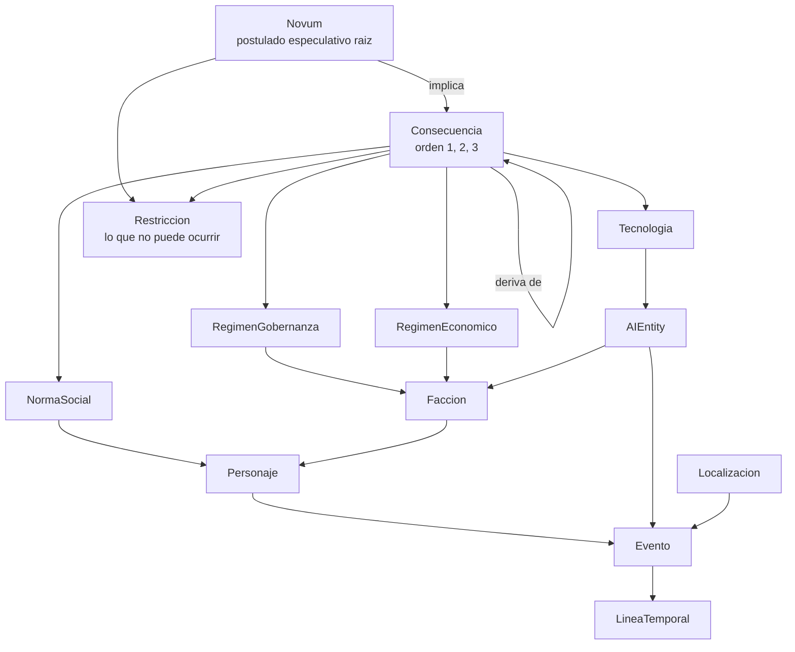

# domain-knowledge.md

Lo que hay que entender del dominio —ciencia ficción especulativa y narrativa de largo aliento— con independencia de cómo se construya el sistema. Las entidades se definen en `definitions.md`; las decisiones de diseño, en `architecture.md`.

---

## 1. Qué hace distinto a este dominio

Generar una novela de ciencia ficción sobre el mundo post-IA no es generar texto largo con un tema. Tiene tres exigencias que no aparecen en otros dominios de generación:

1. **Coherencia especulativa.** El mundo inventado debe sostenerse causalmente. Un lector de ciencia ficción detecta una consecuencia que no se deriva de nada antes de detectar una frase floja.
2. **Continuidad de estado a lo largo de decenas de miles de palabras.** Ningún modelo mantiene esto solo con contexto.
3. **Un espacio de tropos extraordinariamente saturado.** El subgénero post-IA está entre los más explorados de la literatura reciente.

---

## 2. El novum y la coherencia especulativa

### 2.1 Qué es

*Novum* («lo nuevo») es un término de la teoría literaria de la ciencia ficción, acuñado por Darko Suvin en los años setenta. Designa el elemento novedoso —tecnológico, social o cognitivo— que separa el mundo de la obra del mundo real, y del cual se deriva todo lo demás.

Ejemplos canónicos:

- *La mano izquierda de la oscuridad*: una especie humana sin sexo fijo.
- *Neuromante*: una red neural habitable como espacio.
- *El problema de los tres cuerpos*: contacto con una civilización sujeta a un sistema físico caótico.

Para Suvin, el novum es lo que distingue la ciencia ficción de la fantasía: es **cognitivamente plausible**, se puede razonar sobre él. De ahí que la ciencia ficción se preste a la derivación causal y la fantasía menos.

### 2.2 Por qué es la clase raíz

Sin un novum declarado, un generador produce afirmaciones sueltas sobre el mundo —«hay renta básica», «los tribunales son automáticos», «la gente no trabaja»— y no existe forma de distinguir un mundo coherente de una acumulación de tópicos.

Con él, toda afirmación debe poder responder a: *¿de qué novum se deriva, y en cuántos pasos?* Eso convierte una pregunta irrespondible («¿es plausible este futuro?») en una verificable sobre un grafo («¿es alcanzable esta consecuencia desde algún novum declarado?»).

### 2.3 El grafo causal

La coherencia especulativa de una obra es un grafo dirigido, no una lista de rasgos del mundo. La relación `Consecuencia → Consecuencia` es lo que diferencia esta ontología de un *story bible* genérico.



### 2.4 El riesgo específico de este producto

Cuando la semilla no especifica el novum, el sistema debe inventarlo. Es el punto de mayor exposición al cliché de todo el pipeline: el modelo tenderá a producir «superinteligencia + colapso laboral + vigilancia total» con muy poca variación.

Además, «la IA lo cambió todo» es demasiado vago para derivar nada. El valor del novum está en forzar la concreción: qué capacidad apareció, cuándo, y qué dejó de ser cierto a partir de ahí.

---

## 3. Los tropos del subgénero post-IA

Patrones saturados que aparecerán por defecto si nadie los controla:

- Singularidad redentora o apocalíptica.
- Rebelión de las máquinas.
- IA que desarrolla conciencia o descubre el amor.
- Último humano con empleo.
- Renta básica distópica.
- Vigilancia total.
- Dilema del tranvía algorítmico.

**Un tropo no es siempre un defecto.** «IA que desarrolla conciencia» es un cliché si aparece porque al modelo no se le ocurrió otra cosa, y una elección legítima si el usuario lo pidió. La distinción depende de la intención declarada, no del tropo en sí.

Conviene además separar dos orígenes distintos del catálogo:

- **Tropos del género** — los que un lector reconocería. Se curan a mano; son precisos y explicables, pero no escalan y envejecen.
- **Tropos del modelo** — los que el generador propio repite sin que estén en ningún manual (una lluvia en toda escena de revelación, un mismo tipo de final). Solo se descubren midiendo la producción real.

---

## 4. Especificidad variable de la entrada

El producto acepta desde «una novela sobre IA» hasta tres páginas de especificación. Esto tiene una consecuencia de fondo sobre qué significa «calidad»:

> No existe un criterio único de fidelidad. Una semilla corta y una larga generan obligaciones distintas.

De ahí la partición en dos zonas:

- **Zona comprometida** — lo que el usuario fijó. El predicado es *fidelidad* y es casi binario.
- **Zona libre** — lo que el sistema rellenó. Los predicados son *coherencia interna*, *plausibilidad especulativa* y *no-cliché*. La fidelidad no aplica.

### Asimetría de la libertad

El usuario puede dejar libertad al inicio; el sistema no puede mantenerla después. En cuanto el sistema resuelve una decisión abierta, el resultado entra en canon y deja de ser libre para el resto de la obra.

### Ejemplo

Semilla: *«Una novela sobre una abogada que descubre que los tribunales llevan años siendo automatizados en secreto. Quiero un final ambiguo.»*

```
compromisos:
  - protagonista: abogada                    [inviolable, verificable]
  - trama: descubrimiento del encubrimiento  [inviolable, verificable]
  - final: ambiguo                           [inviolable, NO verificable]
huecos:
  - novum concreto y su fecha
  - régimen político
  - escala (ciudad / país / global)
  - antagonista
  - tono
grado_de_libertad: 0.7
```

Si la novela termina con una resolución nítida, es un defecto de fidelidad. Si el régimen político resulta ser una tecnocracia, no lo es: era un hueco.

---

## 5. Continuidad narrativa

### 5.1 Estado epistémico

El fallo de continuidad más frecuente y más difícil de detectar en narrativa larga no es geográfico ni temporal: es **un personaje actuando sobre información que todavía no debería tener**.

Un lector lo detecta de inmediato; una comprobación textual, no. Requiere modelar explícitamente, por escena y por personaje, qué sabe, qué cree falsamente y cuándo lo adquirió.

### 5.2 Deriva

En generación secuencial larga, el texto se aleja progresivamente del plan aunque cada paso individual sea razonable: la voz cambia, el ritmo se aplana, los hilos secundarios se pierden. No es un fallo de ninguna escena en particular, y por eso no se detecta evaluando escenas aisladas.

Requiere un plan estable contra el que contrastar (outline) y evaluación en niveles superiores a la escena.

### 5.3 Niveles de evaluación

Los criterios no son los mismos en cada nivel. El ritmo, la tensión y la cobertura de arcos no existen a nivel de escena; solo emergen de capítulo hacia arriba. Evaluar todo a nivel de escena deja fuera precisamente lo que distingue una novela de una colección de escenas correctas.

---

## 6. Por qué el rigor especulativo no se evalúa directamente

Preguntar a un juez automático «¿es plausible este futuro post-IA?» produce puntuaciones con poca varianza y poca señal: es un juicio estético disfrazado de métrica.

La alternativa que funciona es no evaluar la plausibilidad en abstracto, sino la **trazabilidad dentro del grafo causal propio de la obra**: ¿esta consecuencia deriva de algún novum declarado? Es una pregunta verificable y su respuesta correlaciona razonablemente con lo que un lector percibe como un mundo bien construido.
