# explanation-architecture.md

**Documento derivado, no autoridad.** Es una explicación simplificada de `architecture.md` para entender el proyecto de un vistazo, escrita para alguien que abre el repositorio por primera vez. No introduce términos ni decisiones nuevas: si algo de aquí contradice a `architecture.md`, `definitions.md` o `verification.md`, mandan ellos.

Cada término del dominio se explica en una frase la primera vez que aparece. La definición formal está siempre en `definitions.md`.

---

## 1. Qué hace el sistema

Le das **un prompt en texto libre y un fichero de configuración**. Te devuelve **una novela completa en español** sobre el mundo posterior a la revolución de la IA, más un **informe de ejecución**: qué decidió, qué cumplió y qué no pudo resolver.

No hay preguntas por el camino. La ejecución es autónoma de principio a fin: nadie revisa nada a mitad.

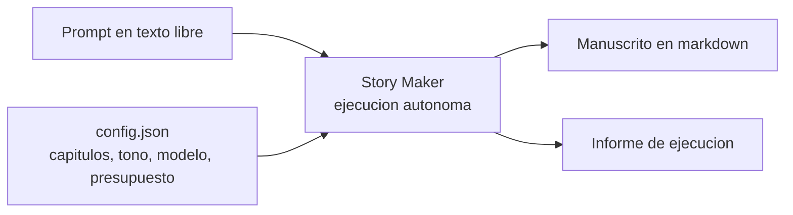

Tres apuestas sostienen todo lo demás:

| Apuesta | En una frase |
|---|---|
| **Outline primero** | Se planifica la obra entera antes de escribir una línea y ese plan se congela. Es lo que evita que la novela se vaya desviando. |
| **Memoria selectiva** | Ninguna llamada al modelo recibe «todo el contexto»: recibe una ventana armada a propósito para ella. |
| **Puertas de calidad** | Ninguna escena entra en el canon sin pasar filtros, ordenados de más barato a más caro. |

> **Canon:** el conjunto de lo que ya es verdad dentro de la ficción. Una vez algo entra en el canon, el resto de la novela no puede contradecirlo.

---

## 2. Las cuatro fases de una ejecución

Toda ejecución recorre siempre el mismo camino.

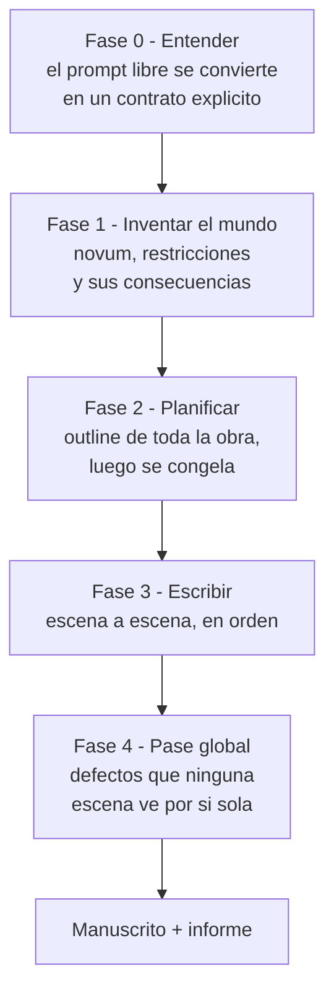

**Fase 0 — Entender.** Tu prosa se convierte en un **ContratoDeBrief**: la lista de lo que has pedido de verdad. Se parte en dos:

- **Compromisos** — lo que el sistema está obligado a cumplir.
- **Huecos** — lo que dejas libre y el sistema decidirá por su cuenta.

Ante la duda, Hueco. Un compromiso inventado restringe la obra entera; un hueco solo la deja abierta.

**Fase 1 — Inventar el mundo.** El arquitecto propone varios **novum** candidatos —el postulado especulativo raíz, lo que separa este mundo del real— y un selector elige uno puntuando tres ejes: cuántas consecuencias admite, cuánto encaja con el contrato y cuánto se aleja del catálogo de tópicos del género. Del novum elegido se derivan consecuencias encadenadas: eso es el canon inicial.

**Fase 2 — Planificar.** Se escribe el **outline**, el plan jerárquico de capítulos y escenas. Se comprueba que los elementos comprometidos aparecen lo suficiente y que ningún compromiso se ha quedado fuera; entonces la estructura se congela.

**Fase 3 — Escribir.** El bucle por escena (sección 5). Es secuencial, porque cada escena depende del estado que deja la anterior.

**Fase 4 — Pase global.** Cuatro comprobaciones sobre la obra entera (sección 6). Lo que encuentran se arregla reescribiendo escenas concretas, nunca regenerando la novela.

---

## 3. Quién hace cada cosa

No todo paso es un agente. Solo lo es lo que necesita explorar, consultar y decidir en varios pasos. El resto es código normal o una llamada de modelo de un solo paso, que es más barato y más predecible.

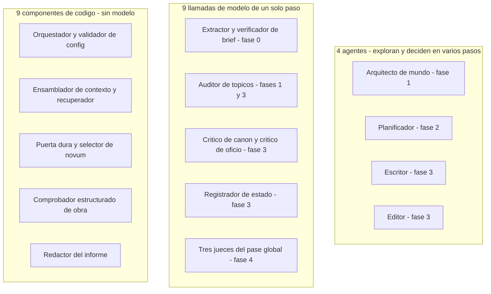

Dos reglas de reparto que explican el resto del diseño:

- **Quien escribe no se evalúa a sí mismo.** Un agente que critica su propio texto ya tiene el contexto que justificó sus decisiones, así que se da la razón.
- **Quien critica no corrige.** Los críticos devuelven defectos tipados; corregir es trabajo del editor. Separarlos permite medir por separado si la detección funciona.

---

## 4. Memoria y contexto

El problema de fondo: una novela entera no cabe en la ventana de un modelo. La solución no es una ventana mayor, es **decidir qué entra en cada llamada**.

Hay dos memorias, y se distinguen por **cómo llegan a una llamada**.

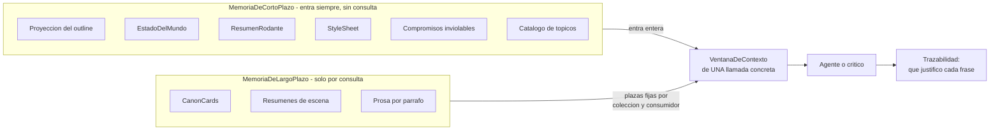

Qué es cada pieza residente:

- **Proyección del outline** — no el outline entero, sino los títulos de toda la obra, las escenas del capítulo actual y la lista de lo que aún no puede revelarse. Así el tamaño de la ventana deja de depender del tamaño de la novela.
- **EstadoDelMundo** — foto mutable de la situación, versionada escena a escena.
- **ResumenRodante** — comprimido de lo ya narrado más las últimas escenas en literal.
- **StyleSheet** — voz, registro, léxico prohibido, disciplina de punto de vista.

### 4.1 Cómo se recupera de la memoria de largo plazo

La memoria de largo plazo es un índice que **nace vacío y crece con el canon aceptado de la propia ejecución**. No es un almacén único: son tres colecciones separadas, cada una con su unidad y su cliente.

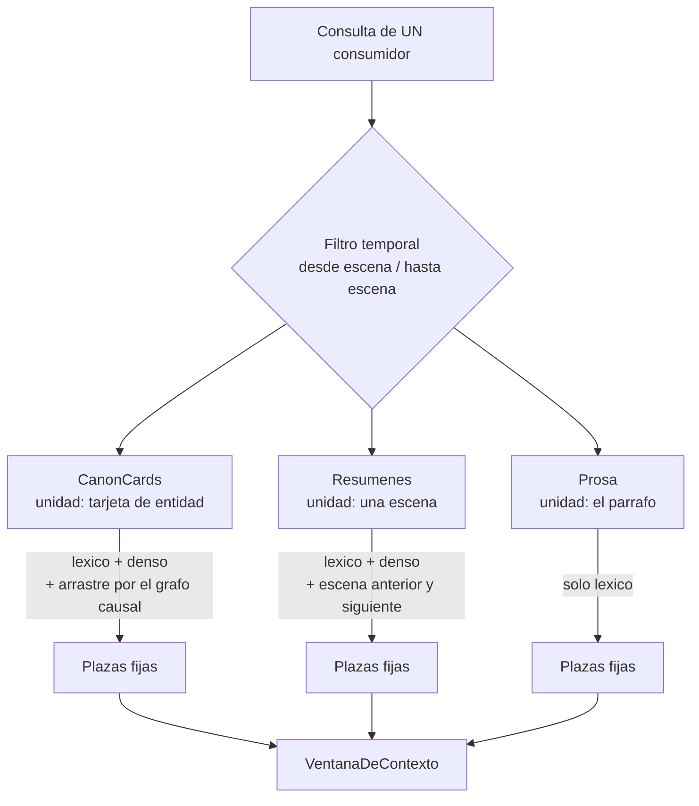

Las reglas que importan, y por qué:

- **Corte temporal.** Las `CanonCard` son inmutables y llevan desde qué escena y hasta qué escena son válidas. Al evaluar la escena 12 nadie ve la verdad de la escena 60; si no, el crítico inventa contradicciones que aún no existían.
- **Plazas fijas por par (colección, consumidor), sin préstamos.** La ventana deja de ser un montón y pasa a ser una tabla legible, y cada celda se puede probar por separado.
- **La prosa solo la ve el crítico de oficio.** Si el escritor leyera prosa lejana la imitaría, y eso empeoraría justo el defecto que la fase 4 existe para detectar.
- **Consultas distintas para escritor y crítico.** El escritor consulta mirando hacia delante, desde el outline de la escena que va a escribir; el crítico de canon consulta hacia atrás, desde el texto ya escrito. Con una consulta compartida ambos tendrían el mismo punto ciego.
- **Nada de reordenar con un modelo.** Renunciar a eso es lo que permite probar la recuperación entera sin llamar a ningún modelo: la misma escena siempre produce la misma ventana.
- **Si no cabe, se recorta y se sigue.** El orden es declarado, no calculado: `prosa → resúmenes → CanonCards → ResumenRodante`. Queda anotado en el informe; nunca bloquea.

### 4.2 Quién decide cuánto cabe

El presupuesto de ventana lo hace cumplir **el orquestador, que es código, nunca el modelo**.

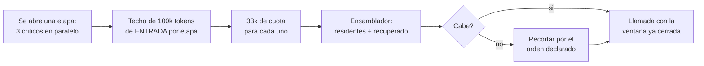

Tres matices que se confunden con facilidad:

- El techo es **por etapa de llamadas simultáneas, no por llamada**. Tres críticos a la vez se reparten los 100k.
- **Cuenta solo la entrada.** La salida no tiene techo en tokens: no se puede acotar antes de generarla. Lo único que la controla es el presupuesto en dinero.
- Lo que no cabe **se niega antes de construir el prompt**. El agente nunca razona sobre contexto que luego no va a ver.

---

## 5. Las puertas de calidad y el bucle por escena

Cuatro puertas, ordenadas de más barato a más caro. Una escena que falla lo barato no gasta presupuesto en lo caro.

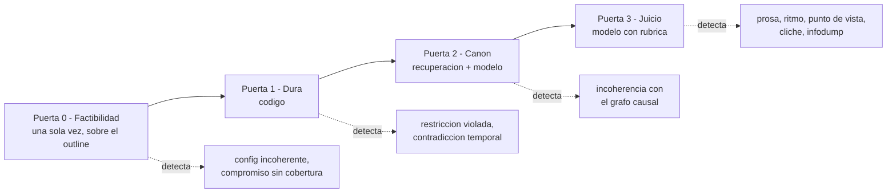

Las puertas 2 y 3 no son pasos aparte del bucle: **son los críticos**. Así se ve:

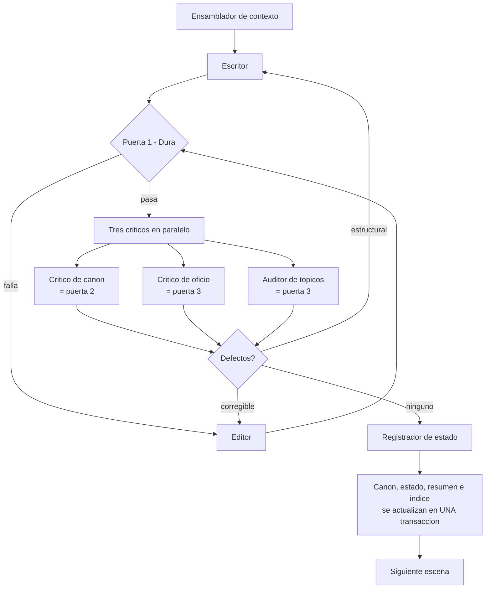

Cuatro ideas dentro de este diagrama:

1. **El enrutado va por naturaleza del defecto**, no por la puerta que lo encontró: lo corregible al editor, lo estructural de vuelta al escritor.
2. **Solo el registrador escribe en canon**, y solo después de aceptar la escena. Así una escena rechazada no contamina el estado.
3. **El estado se extrae, no se asume.** El escritor declara el cambio que pretendía; el registrador lee el texto aceptado y extrae el cambio real. Si difieren, es un defecto.
4. **Canon e índice se escriben juntos**, en la misma transacción. Nunca existe un instante en el que discrepen, y por eso se puede reanudar desde un punto de control sin reconstruir nada.

### Los tres techos

| Techo | Se mide en | Al agotarse |
|---|---|---|
| **Ventana** | tokens de **entrada** de las llamadas simultáneas de una etapa | recorta y sigue |
| **Reintentos por escena** | intentos | escala y lo deja anotado en el informe |
| **Ejecución** | **dinero** | bloquea |

El presupuesto de la obra se mide en dinero y no en tokens porque un token de indexación y uno de generación se diferencian en órdenes de magnitud de coste; el dinero es la única unidad en la que ambos son comparables.

---

## 6. El pase global

Hay defectos que no existen a escala de escena: el ritmo de la obra, un hilo que se abre y nunca se cierra, la misma imagen repetida en las escenas 8 y 74, la voz que se desvía del principio al final.

El manuscrito completo no cabe en la ventana, así que el pase global **no es un agente que lea la novela entera**. Se descompone por tipo de defecto, y de los cinco solo uno necesita recuperación.

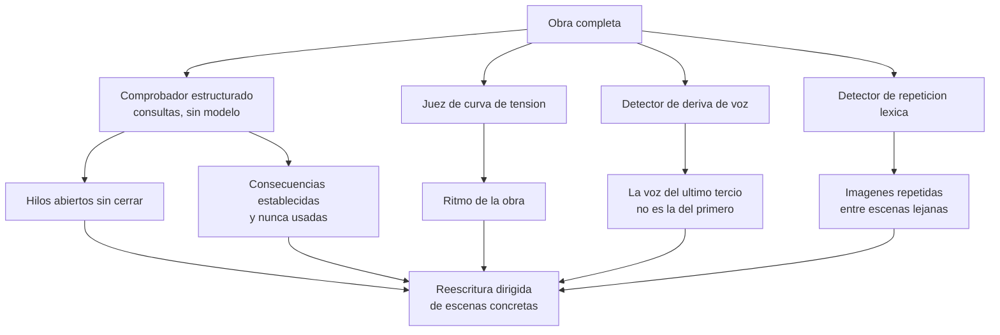

Los dos primeros son consultas exactas a la base de datos, no problemas de similitud: un hilo abierto es un arco cuyo estado sigue abierto, y una consecuencia sin usar es una fila sin ninguna referencia de trazabilidad.

---

## 7. Cómo se ejecuta por fuera

Una novela son decenas o cientos de escenas; el tiempo total se mide en minutos u horas. No cabe en una petición HTTP.

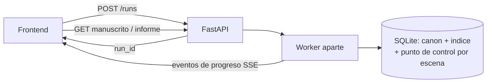

- El progreso **se transmite, no se espera**: eventos en vivo desde el servidor.
- Hay **punto de control por escena**. Si el proceso cae en la escena 80, se reanuda desde ahí.
- El frontend **no debe dar por buena una escena mostrada durante el progreso**: el pase global puede reescribirla. Solo el manuscrito final es definitivo.

---

## 8. Dónde está el proyecto ahora

El trabajo recorre siempre cinco capas en este orden, y nunca se salta hacia arriba.

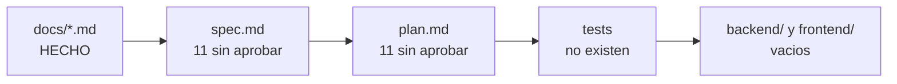

Qué dice cada capa:

- **`docs/`** — qué es verdad del dominio y por qué el diseño es así. Es la autoridad.
- **`spec.md`** — qué comportamiento observable tiene una feature: requisitos comprobables, cada uno con su clase de verificación. Una carpeta por feature en `specs/`, con su `plan.md` al lado.
- **`plan.md`** — el plan de esa spec: un paso por requisito, en orden de implementación.
- **tests y código** — se escriben test primero, caso a caso.

Ahora mismo **solo la primera capa está hecha**; las specs del backend V1 y sus planes (`001-base` a `011-out-salidas`) están escritos y sin aprobar. Lo siguiente, en orden:

1. **Aprobar cada spec y su plan**, empezando por `001-base`.
2. **Orquestación del trabajo** — estados, reanudación desde punto de control, cancelación y reparto del presupuesto en dinero. Es la pieza de diseño que falta (`architecture.md` §12.1).
3. **Código por TDD** desde esas specs. Ninguna carpeta se crea hasta que una spec la exija.
