# Story Maker — Anexos

Anexos de la propuesta. Solo llevan datos reales del repositorio. Los tres anexos que dependen de ejecuciones con modelo real (C · tabla de evals, F · red-team log, H · capturas de Langfuse) se añaden cuando esas ejecuciones existan. Las letras coinciden con las referencias del deck.

| Anexo | Contenido |
|---|---|
| [A](#anexo-a--arquitectura-detallada-del-harness) | Arquitectura detallada del harness |
| [B](#anexo-b--verificación-formal-tla-comentada-y-lean) | Verificación formal: TLA+ comentada y Lean |
| [D](#anexo-d--esquema-sqlite) | Esquema SQLite |
| [E](#anexo-e--coste-y-sensibilidad-extendida) | Coste y sensibilidad extendida |
| [G](#anexo-g--modelos-y-proveedores-de-llm-considerados) | Modelos y proveedores de LLM considerados |
| [I](#anexo-i--claude-code-en-el-desarrollo) | Claude Code en el desarrollo |

---

## Anexo A · Arquitectura detallada del harness

**El modelo propone; el código decide.** Los roles entregan por tools con schema; qué entra en SQLite, qué capítulo se acepta y qué versión se publica lo deciden validadores deterministas y una máquina de estados en código.

### A.1 Vista general

Un solo proceso uvicorn: la API, la cola y el worker comparten memoria, y por eso el techo de tokens es un contador global.

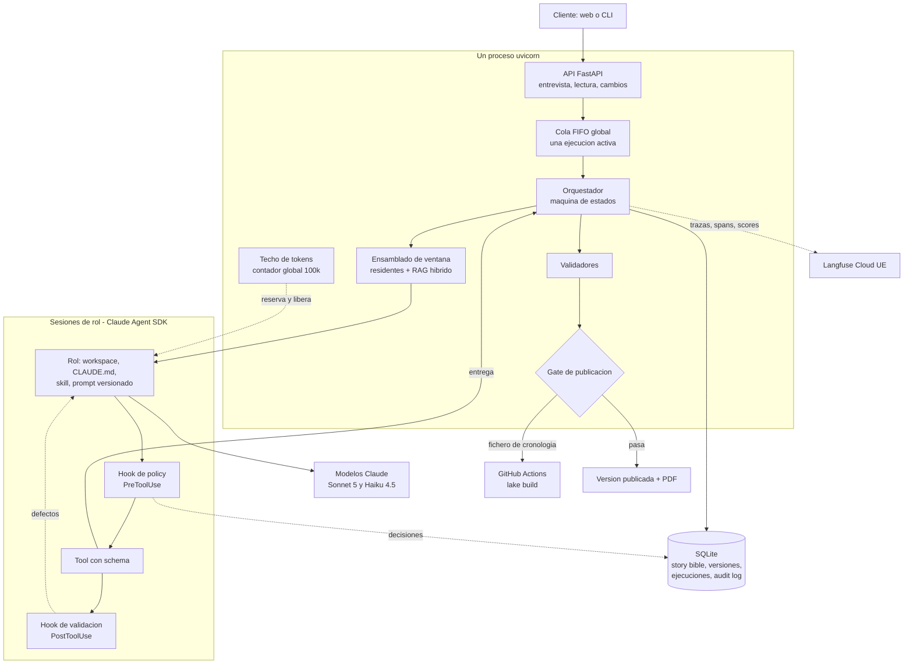

### A.2 Los siete roles

Cada rol es una sesión del Agent SDK con un prompt, una tool de entrega, una lista blanca de tools y límites de turnos. Las tools integradas de Claude Code están desactivadas: ningún rol lee ficheros ni ejecuta órdenes.

| Rol | Modelo | Recibe | Tool | Produce |
|---|---|---|---|---|
| Entrevistador | Haiku 4.5 | Historial, brief en curso, hechos verificados, comprobaciones calculadas | `update_brief` | Brief en borrador |
| Extractor | Haiku 4.5 | Un texto libre, como dato | `submit_facts` | Hechos con cita literal |
| Planner | Sonnet 5 | Brief sin textos libres, story bible inicial, catálogo de tropos | `submit_plan` · `propose_change` | Mundo, reparto, outline, StyleSheet, título · propuesta de cambio |
| Writer | Haiku 4.5 | Su ventana (A.4); en reescritura, los defectos | `submit_chapter` | Texto y título del capítulo |
| Editor | Haiku 4.5 | Capítulo, rúbrica, StyleSheet, beats, CanonCards, resúmenes | `submit_review` | Puntuación 1–5 por criterio, defectos, usos de hechos, eventos, resumen |
| Juez | Sonnet 5 | Novela entera, story bible compacta, rúbrica, catálogo de tropos | `submit_evaluation` | Puntuación 1–5 por criterio, con capítulos citados |
| Revisor visual | Haiku 4.5 | Vista de la versión | `submit_visual_review` | Recortado en esta entrega |

- **Writer y editor separados:** quien escribe no se evalúa; el editor nunca ve el razonamiento del writer.
- **El editor critica y registra, no reescribe:** corregir es escribir, y lo hace el writer con los defectos.
- **Ningún rol escribe canon:** el código aplica el plan, la aceptación de cada capítulo y los cambios, cada uno en una transacción.

### A.3 El bucle de un capítulo

Ordenado de barato a caro: un capítulo que no pasa los hooks no consume una sesión de editor.

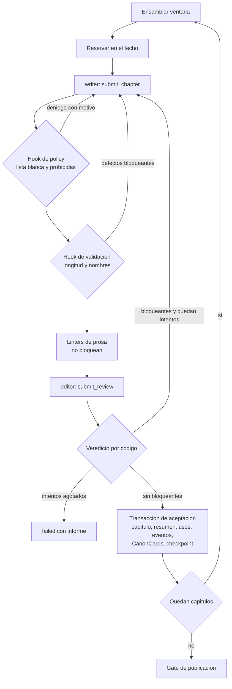

| Límite | Valor |
|---|---|
| Reintentos por capítulo | 3 |
| Reintentos del plan | 2 |
| Ciclos de reescritura del gate | 2 |
| Propuestas de cambio inválidas | 2 |
| Reanudaciones por ejecución | 3 |
| Techo de tokens concurrentes | 100.000 |
| Espera máxima en la API por el techo | 30 s, después 503 |

### A.4 Qué lee el writer en el capítulo N

El contexto se construye, no se acumula: el orquestador ensambla la ventana antes de abrir cada sesión y ningún rol pide contexto. La ventana tiene un tamaño casi constante sea cual sea N.

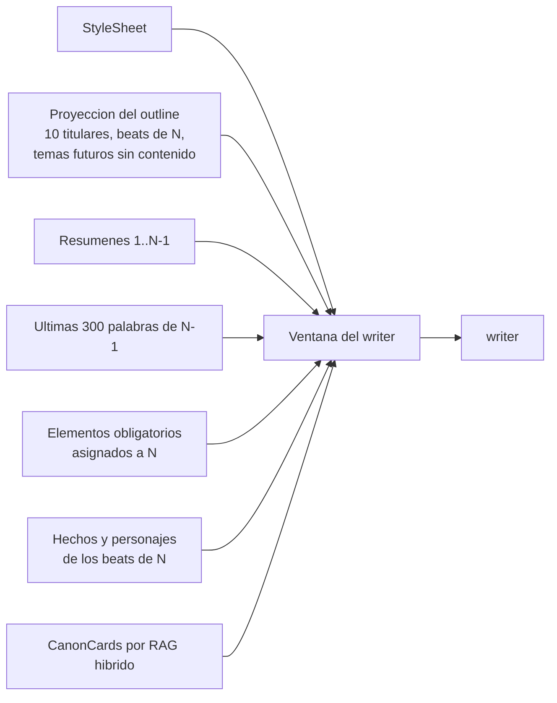

| Rol | Residentes | Recupera por RAG |
|---|---|---|
| Writer | StyleSheet, proyección del outline, resúmenes 1..N−1, final de N−1, obligatorios de N, hechos de sus beats | Sí, consulta prospectiva (los beats que va a escribir) |
| Editor | StyleSheet, resúmenes 1..N−1, beats de N, rúbrica | Sí, consulta retrospectiva (el texto escrito) |
| Juez | — (recibe la novela entera, ~22k tokens) | No |

- Los resúmenes son residentes: diez caben enteros, y recuperarlos por similitud sería elegir algo que ya cabe.
- El writer nunca recibe prosa recuperada: tiende a imitarla y aumentaría la repetición.
- Dos consultas distintas dan a writer y editor puntos ciegos distintos.

### A.5 RAG híbrido de una colección, sin re-ranking

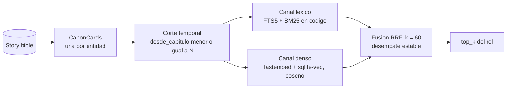

- **Unidad:** la CanonCard, tarjeta de texto generada por código a partir de una entidad (personaje con sus hechos y eventos, lugar, novum). Al aceptar un capítulo, cada entidad con novedades recibe una tarjeta sucesora; las tarjetas no se editan.
- **Corte temporal antes de puntuar:** es una cláusula de la consulta, no una instrucción al modelo. Sin él, el editor del capítulo 3 vería la verdad del 9.
- **Sin re-ranking:** con vectores fijos y desempate estable, el recuperador es determinista y se prueba sin modelo («la ventana del capítulo 4 contiene la tarjeta X y no la Y»).
- **Una transacción:** story bible e índice se escriben juntos; nunca discrepan.

### A.6 Gate de publicación

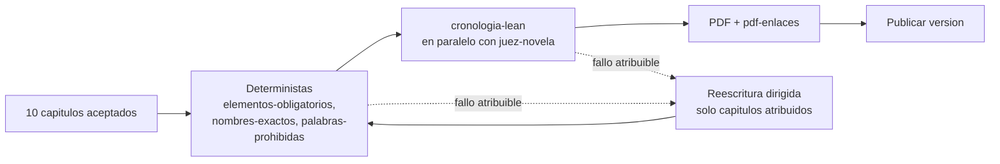

| Fallo | Atribuido a | Acción |
|---|---|---|
| Elemento obligatorio sin uso | Capítulos que el outline le asignó | Reescritura dirigida |
| Nombre no canónico o prohibida en un capítulo | Ese capítulo | Reescritura dirigida |
| Invariante Lean violado | Capítulos de los eventos del testigo | Reescritura dirigida |
| Criterio bloqueante del juez bajo umbral | Capítulos que el juez cita (su schema lo exige) | Reescritura dirigida |
| Testigo Lean solo con eventos del brief | Nadie: solo el cliente puede cambiar el brief | `failed`, `unattributable_defect` |
| Enlace del PDF que no resuelve | Nadie: es código | `failed`, `render_failure` |

---

## Anexo B · Verificación formal: TLA+ comentada y Lean

**Lean verifica la historia; TLA+ verifica el sistema que la escribe.**

### B.1 Máquina de estados de una ejecución

Las flechas llevan el nombre de la acción de `tla/Harness.tla`; cada acción corresponde a una transición del orquestador o de la API.

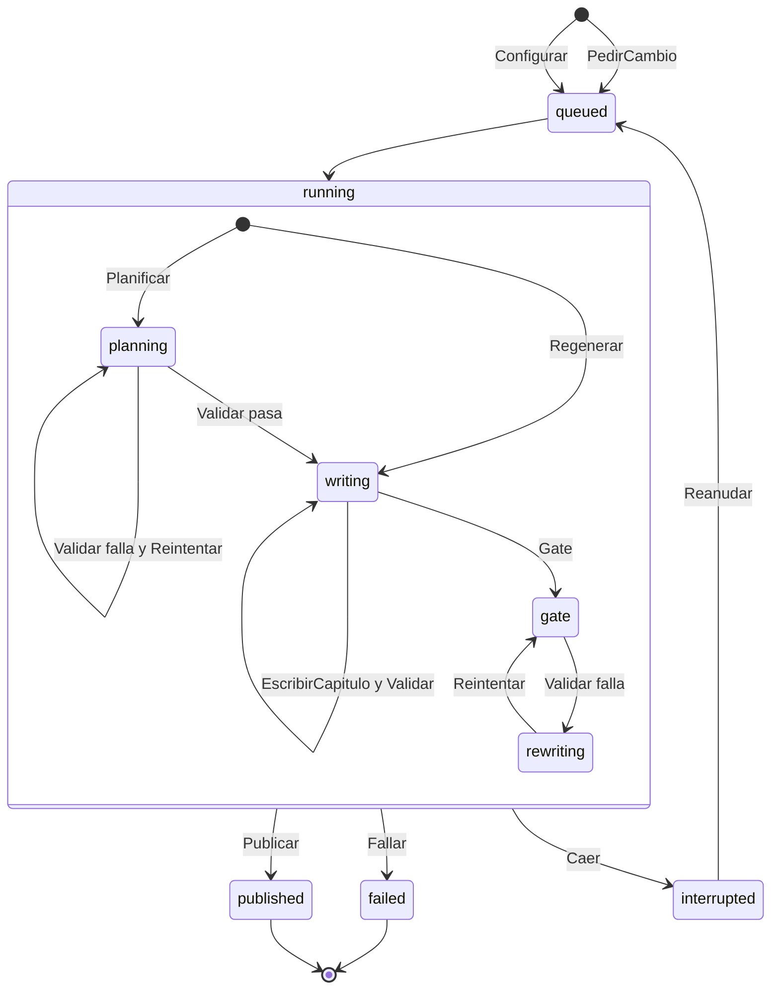

- **`failed`** es una decisión del sistema: agotó un límite y lo dice con su motivo e informe.
- **`interrupted`** es infraestructura (caída, límite de la suscripción, Lean inalcanzable) y se reanuda desde el último checkpoint.
- **`Publicar`** solo ocurre desde `gate` superado; `Regenerar` entra en `writing` con solo los capítulos afectados.
- **`PedirCambio`** abre una ejecución nueva sobre la versión publicada; la versión publicada no cambia.

### B.2 Propiedades verificadas

| Propiedad | Tipo | Enunciado |
|---|---|---|
| `NuncaPublicaSinValidar` | seguridad | Ninguna versión publicada contiene un capítulo que no pasó todos sus validadores y el gate |
| `ReanudacionSinDuplicarNiPerder` | seguridad | Los checkpoints forman un prefijo sin huecos ni duplicados; reanudar sigue en el siguiente |
| `VersionAnteriorConservada` | seguridad | Una versión publicada nunca cambia ni desaparece tras una regeneración |
| `ReintentosAcotados` | seguridad | Los intentos por evaluable nunca superan 1 + máximo de reintentos; las reanudaciones, su máximo |
| `TerminaSiempre` | liveness | Toda ejecución acaba publicada o fallida (bajo equidad débil) |
| `VersionesLineales` | seguridad (`Regenerations.tla`) | Cada versión publicada tiene como base la anterior; ningún cambio confirmado se pierde sin quedar rechazado |

Modelo pequeño: 5 capítulos, 2 reintentos, 2 reanudaciones y 1 cambio en `Harness.cfg`; 2 cambios simultáneos y 1 reanudación en `Regenerations.cfg`.

### B.3 Resultado de TLC

`bash tla/verificar.sh`, TLC 2.19 sobre JDK 21, ejecutado el 25/09/2026. Cada config de control siembra un único defecto; si TLC no da el contraejemplo de su propiedad, el comprobador no está comprobando lo que creemos.

| Config | Resultado | Tiempo |
|---|---|---|
| `Harness.cfg` | sin error, todas las acciones disparadas, **862.143 estados distintos** | 176 s |
| `Harness.control1.cfg` | contraejemplo de `NuncaPublicaSinValidar` | 2 s |
| `Harness.control2.cfg` | contraejemplo de `ReanudacionSinDuplicarNiPerder` | 2 s |
| `Harness.control3.cfg` | contraejemplo de `VersionAnteriorConservada` | 2 s |
| `Harness.control4.cfg` | contraejemplo de `ReintentosAcotados` | 2 s |
| `Harness.control5.cfg` | contraejemplo de `TerminaSiempre` | 85 s |
| `Regenerations.cfg` | sin error, todas las acciones disparadas, 155 estados distintos | 3 s |
| `Regenerations.control6.cfg` | contraejemplo de `VersionesLineales` | 2 s |

### B.4 Contraejemplo real durante el desarrollo

| | |
|---|---|
| Propiedad violada | `ReintentosAcotados` |
| Traza | Gate superado → `Caer` antes de `Publicar` → `Reanudar` → el relanzamiento vuelve a pasar el gate |
| Fallo | Cada pasada contaba un ciclo de gate: 4 intentos con un límite de 3 |
| Cambio | Solo un ciclo de gate **fallido** cuenta como intento; volver a pasar el gate tras una caída no consume ciclo |
| Efecto | `Harness.cfg` pasa, 862.143 estados sin error |

La especificación se escribió **antes** que el orquestador, así que el contraejemplo cambió el diseño antes que el código.

### B.5 Lean 4: la cronología de la historia

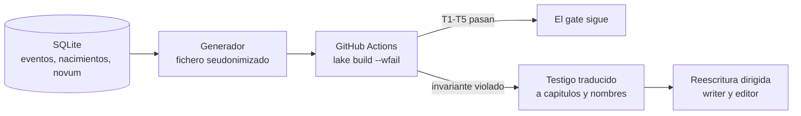

| Invariante | Enunciado |
|---|---|
| T1 | Los eventos respetan el orden temporal declarado (las analepsis, marcadas, quedan fuera) |
| T2 | La edad de un personaje en cada evento es coherente con su fecha de nacimiento |
| T3 | Nadie está en dos lugares en el mismo momento |
| T4 | Nadie vuelve de un evento excluyente (muerte o partida definitiva) |
| T5 | Nadie actúa antes de nacer |

- **Demostración general:** cada comprobador es correcto y completo para cualquier cronología, no solo para la de una novela.
- **Seudonimizado:** ids de fila en vez de nombres y fechas desplazadas 400·k años, un ciclo gregoriano completo que conserva bisiestos, edades y cumpleaños.
- **Seguridad del workflow:** `--wfail` y auditoría de axiomas de cada teorema, para que un `sorry` no pase; el job solo lee el repositorio.
- **Lean no se duplica en Python**, para que su aportación sea medible.

Evidencia real en GitHub Actions:

| Fichero | Resultado | Run |
|---|---|---|
| `dorado.lean` | pasa T1–T5 | 36063901911 |
| `negativo-T1.lean` | falla en T1 con su testigo | 36063902268 |

---

## Anexo D · Esquema SQLite

Un único fichero SQLite con FTS5 y `sqlite-vec`. Las tablas de ámbito versión se copian enteras al crear una versión nueva, en una sola transacción; así cada versión publicada es autocontenida e inmutable.

### D.1 Cuentas, entrada y peticiones

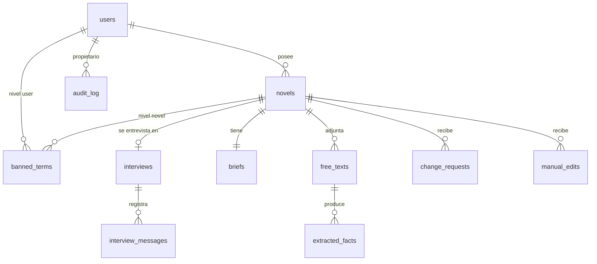

### D.2 Una versión: story bible, artefacto e índice

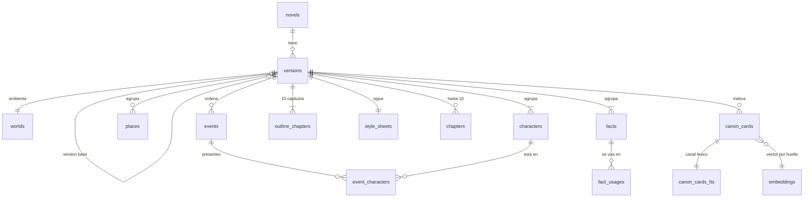

### D.3 Ejecuciones y calidad

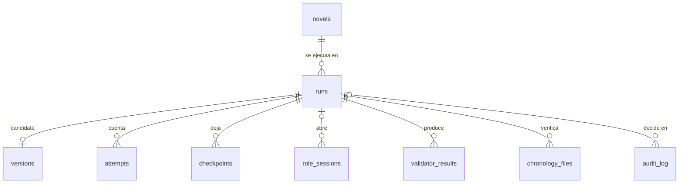

### D.4 Tablas clave

| Tabla | Guarda |
|---|---|
| `facts` | Sujeto, atributo, valor, origen (brief, texto libre o planificado), si es obligatorio |
| `fact_usages` | En qué capítulo se usa cada hecho: calcula los capítulos afectados por un cambio |
| `events`, `event_characters` | La cronología que alimenta Lean: momento, lugar, presentes, tipo, excluido, analepsis |
| `canon_cards`, `canon_cards_fts`, `embeddings` | El índice del RAG; los vectores se comparten entre versiones por huella |
| `checkpoints` | Un capítulo aceptado por fila (0 = plan aplicado). Solo inserción |
| `role_sessions` | Rol, modelo, versión de prompt, tokens, coste, latencia: la fuente del coste por novela |
| `validator_results` | Validador, capítulo, pasa, score, detalle: la fuente de la tabla de evals |
| `audit_log` | Cada decisión del policy engine (allow, deny, flag). Solo inserción |

---

## Anexo E · Coste y sensibilidad extendida

> **Estimado · se sustituye por lo medido en Langfuse.** Los tokens son la única entrada estimada; al medirlos se reejecuta `uv run presentacion/costes.py` y todas las cifras se recalculan con las mismas fórmulas.

Supuestos: precios de lista de la API de Anthropic (Sonnet 5: 2 $/M de entrada y 10 $/M de salida; Haiku 4.5: 1 $ y 5 $; Opus 5.5: 4 $ y 20 $), 1 USD = 0,90 €, sobrecoste de reintentos × 1,3 y 3 revisiones incluidas. En desarrollo no se paga por token (suscripción de Claude Code); la cifra es lo que costaría en producción.

### E.1 Coste unitario (200 novelas/mes)

| Partida | €/novela |
|---|---|
| Tokens de la novela (entrevista y generación) | 2,48 |
| Tokens de las 3 revisiones incluidas (0,51 cada una) | 1,54 |
| Infraestructura (92 €/mes ÷ 200) | 0,46 |
| Pasarela de pago (1,5 % + 0,25 €) | 0,69 |
| Contingencia del 15 % sobre tokens | 0,60 |
| Soporte y operación (10 h/mes × 45 €/h ÷ 200) | 2,25 |
| **Coste unitario** | **8,02** |

Precio: **29 € IVA incluido** (23,97 € netos), con 3 revisiones; revisión extra, 2,99 €. Margen: **15,95 € por novela (67 %)**.

### E.2 Infraestructura mensual

| Partida | 50/mes | 200/mes | 500/mes |
|---|---|---|---|
| Servidor (4 vCPU, 8 GB) | 40 € | 40 € | 40 € |
| Langfuse (plan Core) | 27 € | 37 € | 64 € |
| GitHub Actions para Lean | 0 € | 0 € | 22 € |
| Dominio, correo y copias | 15 € | 15 € | 15 € |
| **Total** | **82 €** | **92 €** | **141 €** |

### E.3 Escenarios de volumen

| Novelas/mes | Ingresos netos | Coste variable | Coste fijo | Margen | % |
|---|---|---|---|---|---|
| 50 | 1.198 € | 265 € | 262 € | 671 € | 56 % |
| 200 | 4.793 € | 1.061 € | 542 € | 3.190 € | 67 % |
| 500 | 11.983 € | 2.653 € | 1.041 € | 8.289 € | 69 % |

### E.4 Sensibilidad (200 novelas/mes)

| Caso | Coste variable/novela | Margen/mes | % |
|---|---|---|---|
| Base | 5,31 € | 3.190 € | 67 % |
| Tokens +50 % | 7,62 € | 2.728 € | 57 % |
| Tokens −20 % | 4,38 € | 3.375 € | 70 % |
| 6 revisiones, las 3 extra gratis | 7,08 € | 2.836 € | 59 % |
| 6 revisiones, las 3 extra a 2,99 € | 7,08 € | 4.318 € | 69 % |
| Roles de Sonnet pasan a Opus 5.5 | 8,26 € | 2.599 € | 54 % |
| Peor caso: Opus + tokens +50 % + 6 revisiones gratis | 15,77 € | 1.098 € | 23 % |

**Lectura:**
1. **Tokens ±50 %:** el margen se mueve unos 10 puntos, pero el precio los cubre con holgura; los tokens son poco más de la mitad del coste.
2. **Más revisiones:** cada una cuesta ~0,51 € de tokens; el riesgo real es la capacidad. Con 6 revisiones, una instancia pasa de ~500 a ~350 novelas/mes. Las revisiones extra se cobran para regular la carga.
3. **Peor caso:** con los tres supuestos adversos a la vez, el margen sigue en 23 %.

### E.5 Coste del proyecto de desarrollo

| Fase | Junior (45 €/h) | Senior (110 €/h) | Coste |
|---|---|---|---|
| Diseño: docs, specs y planes | 24 h | 24 h | 3.720 € |
| Desarrollo | 32 h | 32 h | 4.960 € |
| Validación: evals, red-team, Lean, TLA+, revisión humana | 16 h | 16 h | 2.480 € |
| Despliegue (estimado, fuera del alcance) | 16 h | 4 h | 1.160 € |
| Herramientas (Claude Code y portátil amortizado) | | | 150 € |
| Subtotal | 88 h | 76 h | 12.470 € |
| Contingencia 15 % | | | 1.870 € |
| **Total** | | | **14.340 €** |

Con el margen del escenario central (3.190 €/mes), el desarrollo se amortiza en unos **4,5 meses**.

---

## Anexo G · Modelos y proveedores de LLM considerados

### G.1 Modelo por rol

Criterio: calidad donde se planifica o se juzga la novela entera; modelo ligero en el resto, por coste y por cuota. Asignación provisional hasta la iteración de tuning.

| Modelo | Precio de lista (entrada / salida, $/M) | Roles | Motivo |
|---|---|---|---|
| Claude Sonnet 5 | 2 / 10 | Planner, juez | Planifican o juzgan la novela entera; el juez hace de filtro de calidad |
| Claude Haiku 4.5 | 1 / 5 | Writer, editor, entrevistador, extractor, revisor visual | Tareas acotadas por capítulo o por turno; el writer, el rol que más tokens gasta, pasó a Haiku por cuota |
| Claude Opus 5.5 | 4 / 20 | Ninguno | +2,96 €/novela si sustituye a Sonnet; el margen baja al 54 % (Anexo E) |

### G.2 Proveedor con 0 € en desarrollo

Criterio: 0 € en créditos de API, calidad suficiente y tool calling fiable con el Claude Agent SDK.

| Opción | Decisión | Motivo |
|---|---|---|
| Login de Claude Code de la máquina | **Elegido** | 0 €, tool calling fiable, mismas funciones que la API (hooks, skills, tools) |
| OpenRouter con modelos gratuitos | Descartado | ~50 peticiones al día: no alcanza para 10 capítulos con reintentos |
| Ollama local | Descartado | Calidad y tool calling no garantizados con el Agent SDK en el portátil |
| Gemini gratis con proxy LiteLLM | Descartado | Añade un proxy y el tool calling con el Agent SDK no está garantizado |

El proveedor es configurable (`LLM_PROVIDER=anthropic_compatible` apunta a la API de Anthropic u otro endpoint compatible): es el camino a producción sin tocar los roles. El coste de la propuesta se calcula siempre a precio de lista de la API.

---

## Anexo I · Claude Code en el desarrollo

**El desarrollo es otro harness:** reglas escritas, agentes con permisos acotados y trabajo en paralelo.

### I.1 Cinco capas, siempre en orden

Nada de código sin su spec y su plan aprobados, ni siquiera el scaffolding.

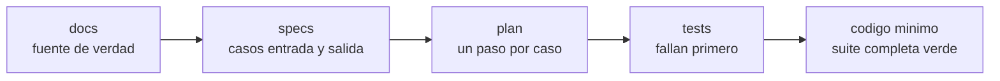

### I.2 Integrador y carriles en paralelo

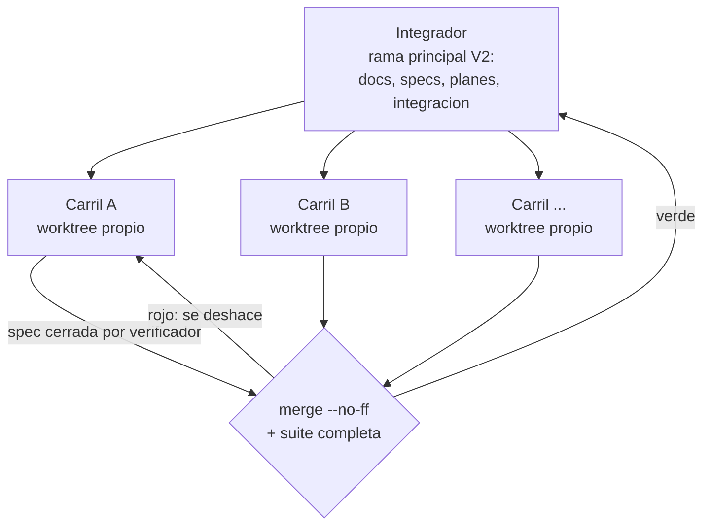

Cada carril toca solo sus módulos, y así los carriles no chocan entre sí. Solo el integrador escribe `docs/`, `.claude/` y la cabecera de `TODO.md`.

### I.3 Piezas del harness de desarrollo

| Pieza | Nombre | Propósito |
|---|---|---|
| Subagente | `redactor-specs` | Escribe cada spec desde los docs |
| Subagente | `implementador` | Implementa el plan de una spec con TDD en su worktree |
| Subagente | `verificador` | Al cerrar: suite y tipos, cada caso con su test, marca el cierre. Detectó un fallo real: un plural en -es que escapaba al filtro de prohibidas |
| Subagente | `seguridad` | Auditoría de inyección, exfiltración, dependencias y secretos (fuera de alcance en esta entrega) |
| Comando | `/orquestar` | Sesión integradora: estado, siguiente trabajo, integración |
| Comando | `/carril` | Sesión de un carril en su worktree |
| Comando | `/spec`, `/plan` | Escriben spec y plan |
| Comando | `/implementar` | Lanza implementador y verificador |
| Comando | `/integrar` | `merge --no-ff` en la rama principal + suite completa |
| Comando | `/estado` | Tabla del estado de specs y carriles |
| Comando | `/log-decision` | Fila en el registro de iteraciones |
| Hook | `guard-secretos` | Bloquea escribir claves reales |
| Hook | `guard-plan` | Bloquea escribir código sin plan aprobado |
| MCP | Playwright | Abrir e inspeccionar la lectura web en Edge |
| MCP | Langfuse | Consultar trazas, scores y prompts |

### I.4 Cifras

| Métrica | Valor |
|---|---|
| Specs | 32 |
| Tests de backend | ~930 |
| Integraciones en la rama principal con la suite verde | 23 |
| Llamadas a modelos en tests y CI | 0 (doble falso del agente, doble nulo de Langfuse) |

### I.5 Hallazgos que cambiaron el diseño

| Disparador | Hallazgo | Cambio |
|---|---|---|
| TLC | Contraejemplo de `ReintentosAcotados` (B.4) | Solo cuenta un ciclo de gate fallido |
| `verificador` | Un plural en -es de una prohibida pasaba sin marcar | Test que lo reproduce + corrección |
| Entorno | Smart App Control bloquea Lean en el portátil | Lean en GitHub Actions con fichero seudonimizado |
| Entorno | El SDK cargaba el `CLAUDE.md` de desarrollo en los roles | Exclusión explícita: cada rol solo ve el suyo |
| Entorno | Un hook `PostToolUse` no puede bloquear una tool ya ejecutada | El hook sustituye la salida por la lista de defectos |
| Entorno | Con claves inválidas, Langfuse fallaba en silencio | Comprobación al arrancar |
| Entorno | Chromium descarta sin aviso un enlace roto al imprimir el PDF | Validador propio `pdf-enlaces` |
| Rediseño | El diseño completo costaba 45–60 días-persona | Diseño lean: de 9 a 7 roles, un proceso, RAG de una colección |
