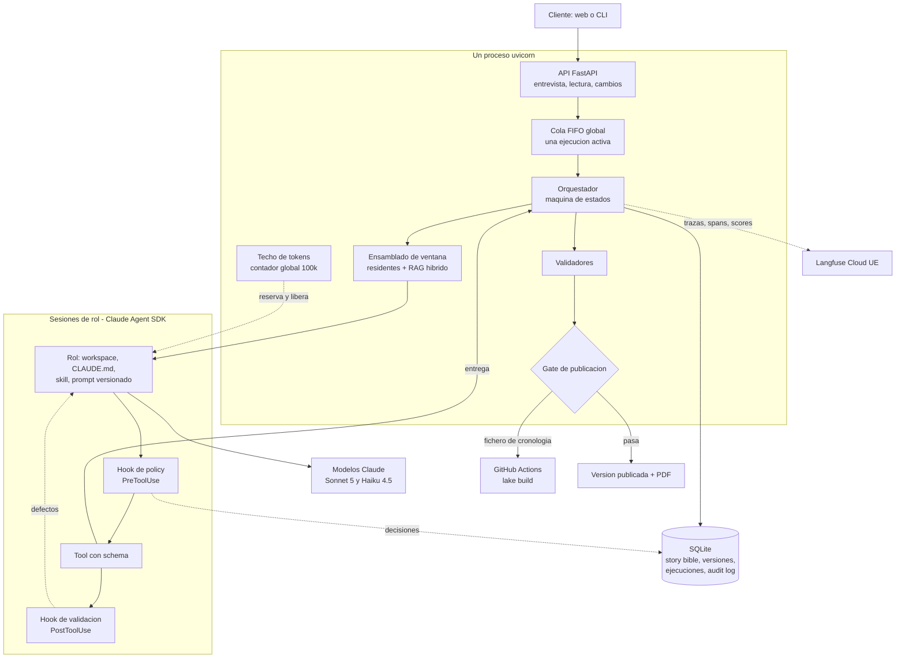
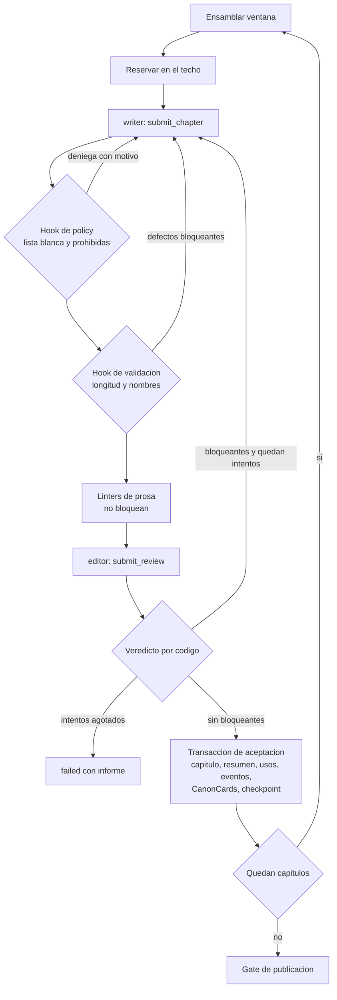
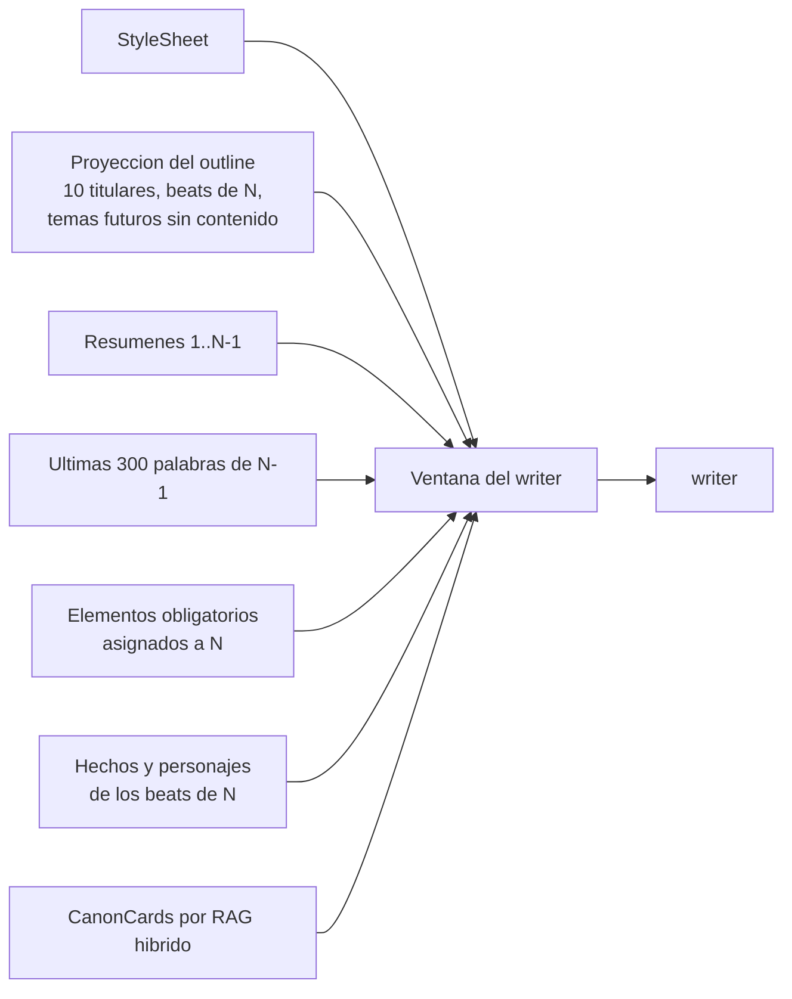
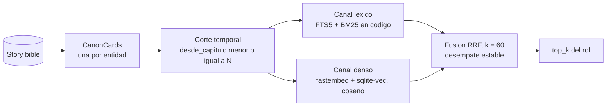
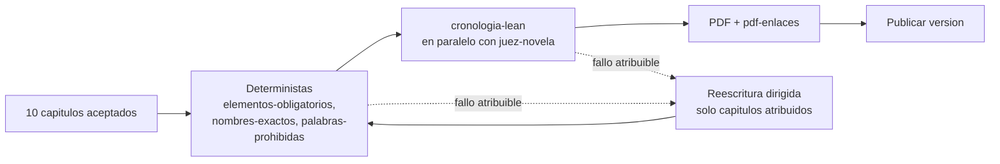

# Anexo A · Arquitectura detallada del harness

**El modelo propone; el código decide.** Los roles entregan por tools con schema; qué entra en SQLite, qué capítulo se acepta y qué versión se publica lo deciden validadores deterministas y una máquina de estados en código.

## A.1 Vista general

Un solo proceso uvicorn: la API, la cola y el worker comparten memoria, y por eso el techo de tokens es un contador global.

## A.2 Los siete roles

Cada rol es una sesión del Agent SDK con un prompt, una tool de entrega, una lista blanca de tools y límites de turnos. Las tools integradas de Claude Code están desactivadas: ningún rol lee ficheros ni ejecuta órdenes.

| Rol | Modelo | Recibe | Tool | Produce |
|---|---|---|---|---|
| Entrevistador | Haiku 4.5 | Historial, brief en curso, hechos verificados, comprobaciones calculadas | `update_brief` | Brief en borrador |
| Extractor | Haiku 4.5 | Un texto libre, como dato | `submit_facts` | Hechos con cita literal |
| Planner | Sonnet 5 | Brief sin textos libres, story bible inicial, catálogo de tropos | `submit_plan` · `propose_change` | Mundo, reparto, outline, StyleSheet, título · propuesta de cambio |
| Writer | Haiku 4.5 | Su ventana (A.4); en reescritura, los defectos | `submit_chapter` | Texto y título del capítulo |
| Editor | Haiku 4.5 | Capítulo, rúbrica, StyleSheet, beats, CanonCards, resúmenes | `submit_review` | Puntuación 1–5 por criterio, defectos, usos de hechos, eventos, resumen |
| Juez | Sonnet 5 | Novela entera, story bible compacta, rúbrica, catálogo de tropos | `submit_evaluation` | Puntuación 1–5 por criterio, con capítulos citados |
| Revisor visual | Haiku 4.5 | Vista de la versión | `submit_visual_review` | Recortado en esta entrega |

- **Writer y editor separados:** quien escribe no se evalúa; el editor nunca ve el razonamiento del writer.
- **El editor critica y registra, no reescribe:** corregir es escribir, y lo hace el writer con los defectos.
- **Ningún rol escribe canon:** el código aplica el plan, la aceptación de cada capítulo y los cambios, cada uno en una transacción.

## A.3 El bucle de un capítulo

Ordenado de barato a caro: un capítulo que no pasa los hooks no consume una sesión de editor.

| Límite | Valor |
|---|---|
| Reintentos por capítulo | 3 |
| Reintentos del plan | 2 |
| Ciclos de reescritura del gate | 2 |
| Propuestas de cambio inválidas | 2 |
| Reanudaciones por ejecución | 3 |
| Techo de tokens concurrentes | 100.000 |
| Espera máxima en la API por el techo | 30 s, después 503 |

## A.4 Qué lee el writer en el capítulo N

El contexto se construye, no se acumula: el orquestador ensambla la ventana antes de abrir cada sesión y ningún rol pide contexto. La ventana tiene un tamaño casi constante sea cual sea N.

| Rol | Residentes | Recupera por RAG |
|---|---|---|
| Writer | StyleSheet, proyección del outline, resúmenes 1..N−1, final de N−1, obligatorios de N, hechos de sus beats | Sí, consulta prospectiva (los beats que va a escribir) |
| Editor | StyleSheet, resúmenes 1..N−1, beats de N, rúbrica | Sí, consulta retrospectiva (el texto escrito) |
| Juez | — (recibe la novela entera, ~22k tokens) | No |

- Los resúmenes son residentes: diez caben enteros, y recuperarlos por similitud sería elegir algo que ya cabe.
- El writer nunca recibe prosa recuperada: tiende a imitarla y aumentaría la repetición.
- Dos consultas distintas dan a writer y editor puntos ciegos distintos.

## A.5 RAG híbrido de una colección, sin re-ranking

- **Unidad:** la CanonCard, tarjeta de texto generada por código a partir de una entidad (personaje con sus hechos y eventos, lugar, novum). Al aceptar un capítulo, cada entidad con novedades recibe una tarjeta sucesora; las tarjetas no se editan.
- **Corte temporal antes de puntuar:** es una cláusula de la consulta, no una instrucción al modelo. Sin él, el editor del capítulo 3 vería la verdad del 9.
- **Sin re-ranking:** con vectores fijos y desempate estable, el recuperador es determinista y se prueba sin modelo («la ventana del capítulo 4 contiene la tarjeta X y no la Y»).
- **Una transacción:** story bible e índice se escriben juntos; nunca discrepan.

## A.6 Gate de publicación

| Fallo | Atribuido a | Acción |
|---|---|---|
| Elemento obligatorio sin uso | Capítulos que el outline le asignó | Reescritura dirigida |
| Nombre no canónico o prohibida en un capítulo | Ese capítulo | Reescritura dirigida |
| Invariante Lean violado | Capítulos de los eventos del testigo | Reescritura dirigida |
| Criterio bloqueante del juez bajo umbral | Capítulos que el juez cita (su schema lo exige) | Reescritura dirigida |
| Testigo Lean solo con eventos del brief | Nadie: solo el cliente puede cambiar el brief | `failed`, `unattributable_defect` |
| Enlace del PDF que no resuelve | Nadie: es código | `failed`, `render_failure` |

---
