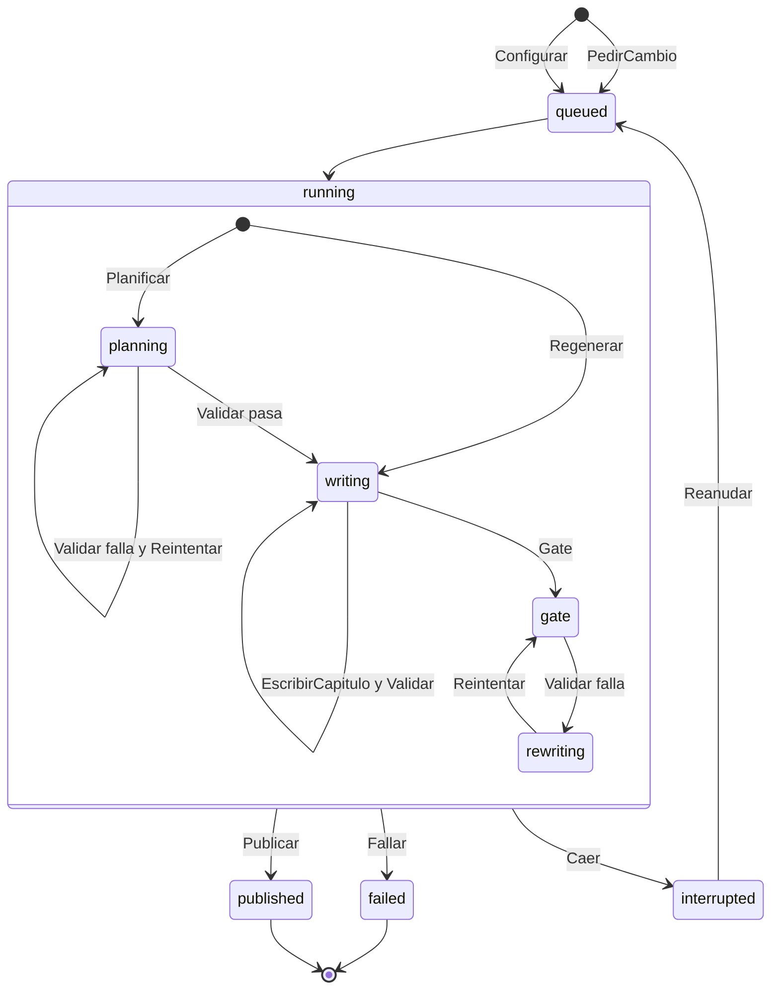
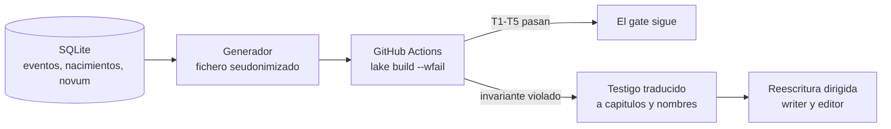

# Anexo B · Verificación formal: TLA+ comentada y Lean

**Lean verifica la historia; TLA+ verifica el sistema que la escribe.**

## B.1 Máquina de estados de una ejecución

Las flechas llevan el nombre de la acción de `tla/Harness.tla`; cada acción corresponde a una transición del orquestador o de la API.

- **`failed`** es una decisión del sistema: agotó un límite y lo dice con su motivo e informe.
- **`interrupted`** es infraestructura (caída, límite de la suscripción, Lean inalcanzable) y se reanuda desde el último checkpoint.
- **`Publicar`** solo ocurre desde `gate` superado; `Regenerar` entra en `writing` con solo los capítulos afectados.
- **`PedirCambio`** abre una ejecución nueva sobre la versión publicada; la versión publicada no cambia.

## B.2 Propiedades verificadas

| Propiedad | Tipo | Enunciado |
|---|---|---|
| `NuncaPublicaSinValidar` | seguridad | Ninguna versión publicada contiene un capítulo que no pasó todos sus validadores y el gate |
| `ReanudacionSinDuplicarNiPerder` | seguridad | Los checkpoints forman un prefijo sin huecos ni duplicados; reanudar sigue en el siguiente |
| `VersionAnteriorConservada` | seguridad | Una versión publicada nunca cambia ni desaparece tras una regeneración |
| `ReintentosAcotados` | seguridad | Los intentos por evaluable nunca superan 1 + máximo de reintentos; las reanudaciones, su máximo |
| `TerminaSiempre` | liveness | Toda ejecución acaba publicada o fallida (bajo equidad débil) |
| `VersionesLineales` | seguridad (`Regenerations.tla`) | Cada versión publicada tiene como base la anterior; ningún cambio confirmado se pierde sin quedar rechazado |

Modelo pequeño: 5 capítulos, 2 reintentos, 2 reanudaciones y 1 cambio en `Harness.cfg`; 2 cambios simultáneos y 1 reanudación en `Regenerations.cfg`.

## B.3 Resultado de TLC

`bash tla/verificar.sh`, TLC 2.19 sobre JDK 21, ejecutado el 25/09/2026. Cada config de control siembra un único defecto; si TLC no da el contraejemplo de su propiedad, el comprobador no está comprobando lo que creemos.

| Config | Resultado | Tiempo |
|---|---|---|
| `Harness.cfg` | sin error, todas las acciones disparadas, **862.143 estados distintos** | 176 s |
| `Harness.control1.cfg` | contraejemplo de `NuncaPublicaSinValidar` | 2 s |
| `Harness.control2.cfg` | contraejemplo de `ReanudacionSinDuplicarNiPerder` | 2 s |
| `Harness.control3.cfg` | contraejemplo de `VersionAnteriorConservada` | 2 s |
| `Harness.control4.cfg` | contraejemplo de `ReintentosAcotados` | 2 s |
| `Harness.control5.cfg` | contraejemplo de `TerminaSiempre` | 85 s |
| `Regenerations.cfg` | sin error, todas las acciones disparadas, 155 estados distintos | 3 s |
| `Regenerations.control6.cfg` | contraejemplo de `VersionesLineales` | 2 s |

## B.4 Contraejemplo real durante el desarrollo

| | |
|---|---|
| Propiedad violada | `ReintentosAcotados` |
| Traza | Gate superado → `Caer` antes de `Publicar` → `Reanudar` → el relanzamiento vuelve a pasar el gate |
| Fallo | Cada pasada contaba un ciclo de gate: 4 intentos con un límite de 3 |
| Cambio | Solo un ciclo de gate **fallido** cuenta como intento; volver a pasar el gate tras una caída no consume ciclo |
| Efecto | `Harness.cfg` pasa, 862.143 estados sin error |

La especificación se escribió **antes** que el orquestador, así que el contraejemplo cambió el diseño antes que el código.

## B.5 Lean 4: la cronología de la historia

| Invariante | Enunciado |
|---|---|
| T1 | Los eventos respetan el orden temporal declarado (las analepsis, marcadas, quedan fuera) |
| T2 | La edad de un personaje en cada evento es coherente con su fecha de nacimiento |
| T3 | Nadie está en dos lugares en el mismo momento |
| T4 | Nadie vuelve de un evento excluyente (muerte o partida definitiva) |
| T5 | Nadie actúa antes de nacer |

- **Demostración general:** cada comprobador es correcto y completo para cualquier cronología, no solo para la de una novela.
- **Seudonimizado:** ids de fila en vez de nombres y fechas desplazadas 400·k años, un ciclo gregoriano completo que conserva bisiestos, edades y cumpleaños.
- **Seguridad del workflow:** `--wfail` y auditoría de axiomas de cada teorema, para que un `sorry` no pase; el job solo lee el repositorio.
- **Lean no se duplica en Python**, para que su aportación sea medible.

Evidencia real en GitHub Actions:

| Fichero | Resultado | Run |
|---|---|---|
| `dorado.lean` | pasa T1–T5 | 36063901911 |
| `negativo-T1.lean` | falla en T1 con su testigo | 36063902268 |

---
