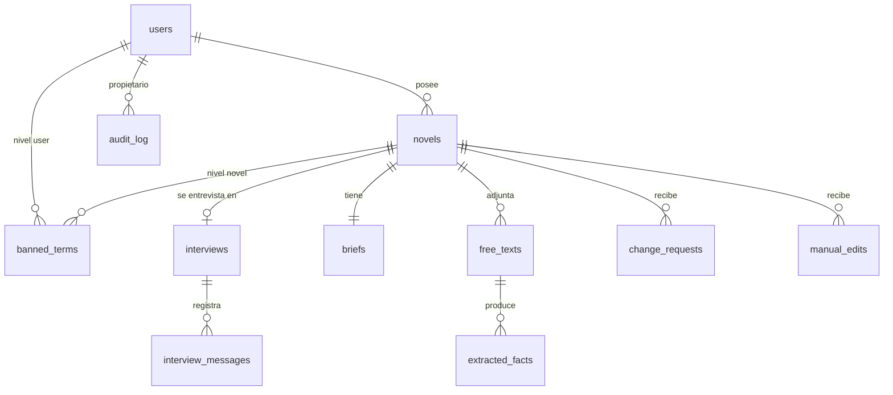
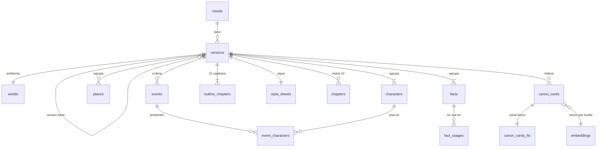
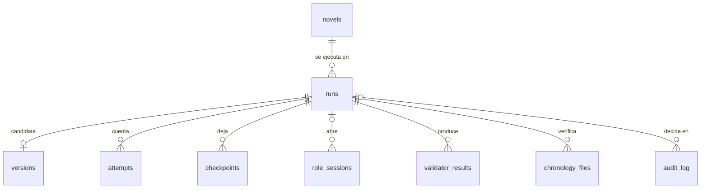

# Anexo D · Esquema SQLite

Un único fichero SQLite con FTS5 y `sqlite-vec`. Las tablas de ámbito versión se copian enteras al crear una versión nueva, en una sola transacción; así cada versión publicada es autocontenida e inmutable.

## D.1 Cuentas, entrada y peticiones

## D.2 Una versión: story bible, artefacto e índice

## D.3 Ejecuciones y calidad

## D.4 Tablas clave

| Tabla | Guarda |
|---|---|
| `facts` | Sujeto, atributo, valor, origen (brief, texto libre o planificado), si es obligatorio |
| `fact_usages` | En qué capítulo se usa cada hecho: calcula los capítulos afectados por un cambio |
| `events`, `event_characters` | La cronología que alimenta Lean: momento, lugar, presentes, tipo, excluido, analepsis |
| `canon_cards`, `canon_cards_fts`, `embeddings` | El índice del RAG; los vectores se comparten entre versiones por huella |
| `checkpoints` | Un capítulo aceptado por fila (0 = plan aplicado). Solo inserción |
| `role_sessions` | Rol, modelo, versión de prompt, tokens, coste, latencia: la fuente del coste por novela |
| `validator_results` | Validador, capítulo, pasa, score, detalle: la fuente de la tabla de evals |
| `audit_log` | Cada decisión del policy engine (allow, deny, flag). Solo inserción |

---
