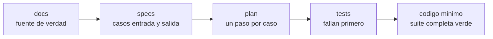
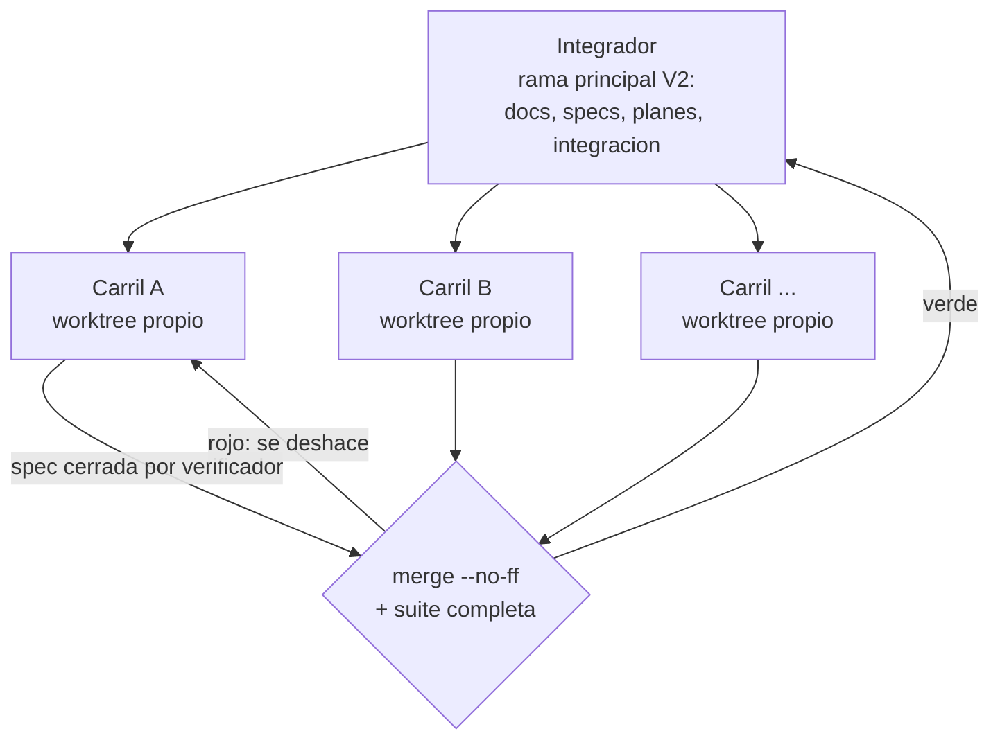

# Anexo I · Claude Code en el desarrollo

**El desarrollo es otro harness:** reglas escritas, agentes con permisos acotados y trabajo en paralelo.

## I.1 Cinco capas, siempre en orden

Nada de código sin su spec y su plan aprobados, ni siquiera el scaffolding.

## I.2 Integrador y carriles en paralelo

Cada carril toca solo sus módulos, y así los carriles no chocan entre sí. Solo el integrador escribe `docs/`, `.claude/` y la cabecera de `TODO.md`.

## I.3 Piezas del harness de desarrollo

| Pieza | Nombre | Propósito |
|---|---|---|
| Subagente | `redactor-specs` | Escribe cada spec desde los docs |
| Subagente | `implementador` | Implementa el plan de una spec con TDD en su worktree |
| Subagente | `verificador` | Al cerrar: suite y tipos, cada caso con su test, marca el cierre. Detectó un fallo real: un plural en -es que escapaba al filtro de prohibidas |
| Subagente | `seguridad` | Auditoría de inyección, exfiltración, dependencias y secretos (fuera de alcance en esta entrega) |
| Comando | `/orquestar` | Sesión integradora: estado, siguiente trabajo, integración |
| Comando | `/carril` | Sesión de un carril en su worktree |
| Comando | `/spec`, `/plan` | Escriben spec y plan |
| Comando | `/implementar` | Lanza implementador y verificador |
| Comando | `/integrar` | `merge --no-ff` en la rama principal + suite completa |
| Comando | `/estado` | Tabla del estado de specs y carriles |
| Comando | `/log-decision` | Fila en el registro de iteraciones |
| Hook | `guard-secretos` | Bloquea escribir claves reales |
| Hook | `guard-plan` | Bloquea escribir código sin plan aprobado |
| MCP | Playwright | Abrir e inspeccionar la lectura web en Edge |
| MCP | Langfuse | Consultar trazas, scores y prompts |

## I.4 Cifras

| Métrica | Valor |
|---|---|
| Specs | 32 |
| Tests de backend | ~930 |
| Integraciones en la rama principal con la suite verde | 23 |
| Llamadas a modelos en tests y CI | 0 (doble falso del agente, doble nulo de Langfuse) |

## I.5 Hallazgos que cambiaron el diseño

| Disparador | Hallazgo | Cambio |
|---|---|---|
| TLC | Contraejemplo de `ReintentosAcotados` (B.4) | Solo cuenta un ciclo de gate fallido |
| `verificador` | Un plural en -es de una prohibida pasaba sin marcar | Test que lo reproduce + corrección |
| Entorno | Smart App Control bloquea Lean en el portátil | Lean en GitHub Actions con fichero seudonimizado |
| Entorno | El SDK cargaba el `CLAUDE.md` de desarrollo en los roles | Exclusión explícita: cada rol solo ve el suyo |
| Entorno | Un hook `PostToolUse` no puede bloquear una tool ya ejecutada | El hook sustituye la salida por la lista de defectos |
| Entorno | Con claves inválidas, Langfuse fallaba en silencio | Comprobación al arrancar |
| Entorno | Chromium descarta sin aviso un enlace roto al imprimir el PDF | Validador propio `pdf-enlaces` |
| Rediseño | El diseño completo costaba 45–60 días-persona | Diseño lean: de 9 a 7 roles, un proceso, RAG de una colección |
