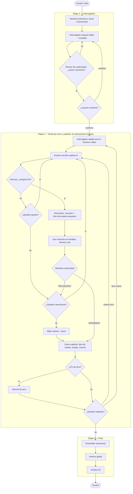
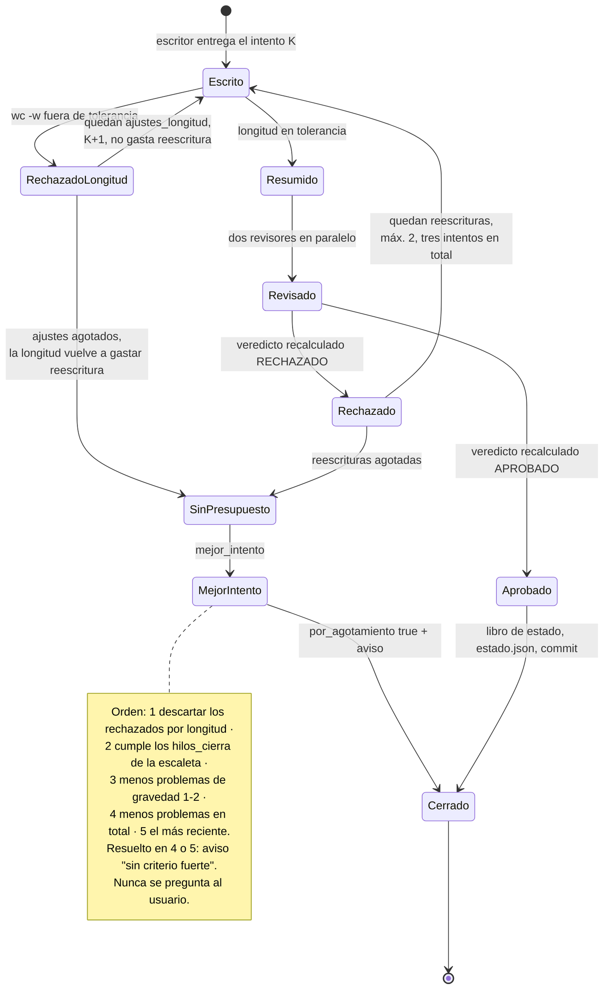
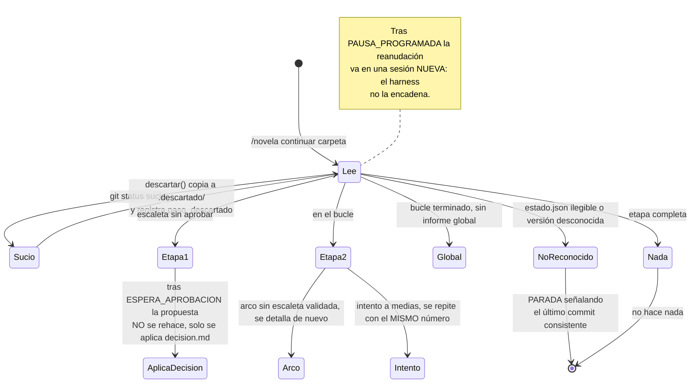
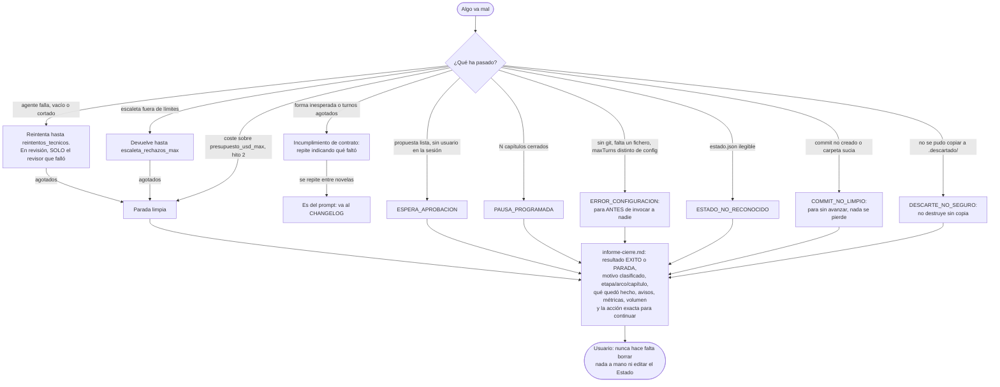
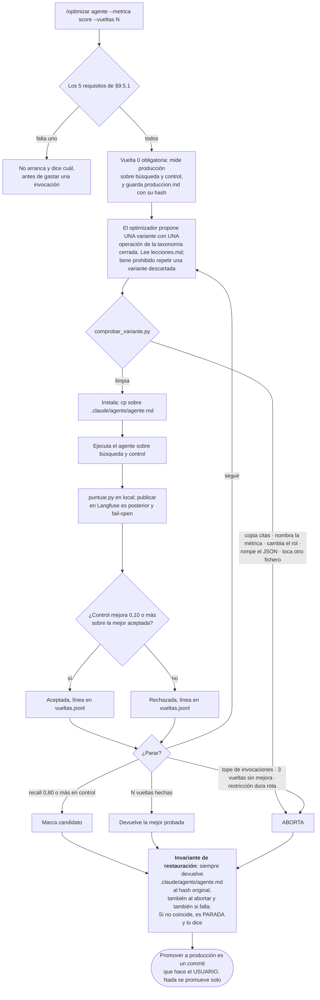
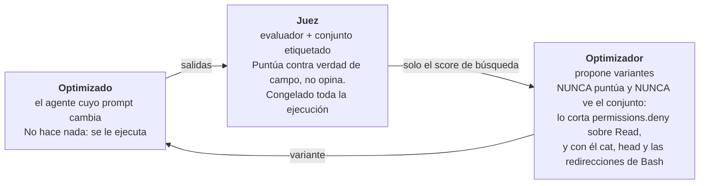
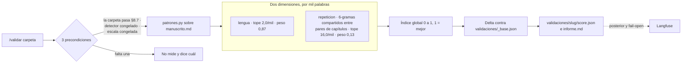
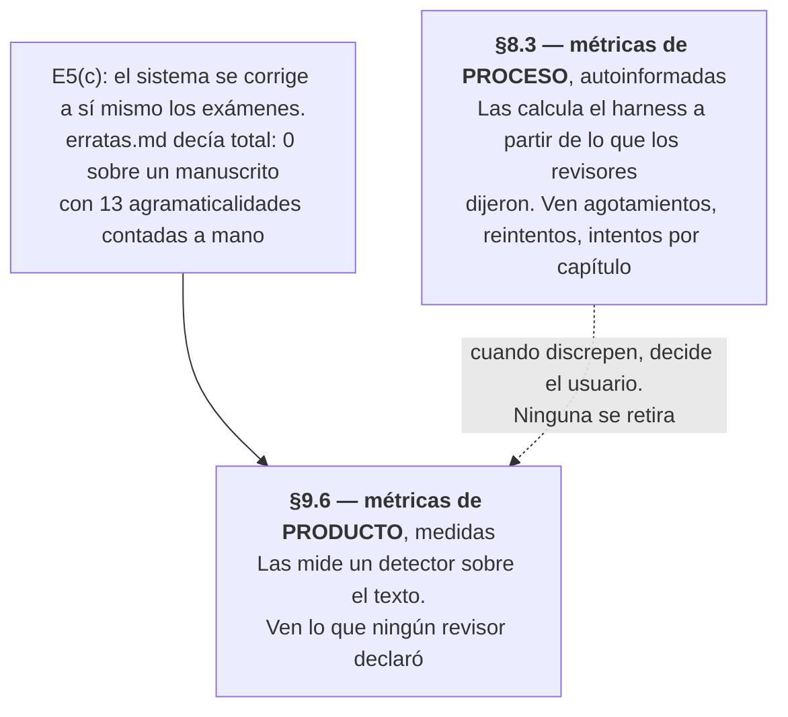
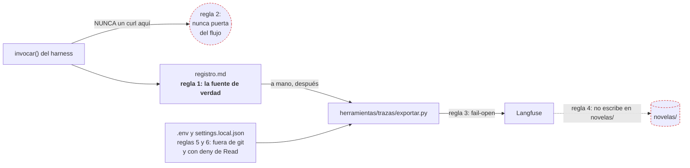

# story-maker — Arquitectura en diagramas

Vista visual de lo que [functional.md](functional.md) (§0–§8, §10) y [technical.md](technical.md) (§9) fijan en prosa. **Este documento es descriptivo, no normativo**: si un diagrama y la spec funcional discrepan, gana la spec y el diagrama se corrige. Cada sección enlaza el punto de la spec que la sostiene.

Índice:

1. [Flujo completo de una novela](#1-flujo-completo-de-una-novela) — las tres etapas
2. [Estados de un intento de capítulo](#2-estados-de-un-intento-de-capítulo) — longitud, veredicto, agotamiento
3. [Reanudación](#3-reanudación) — cómo se retoma una carpeta a medias
4. [Paradas y fallos](#4-paradas-y-fallos)
5. [Herramientas fuera del harness](#5-herramientas-fuera-del-harness) — `/optimizar`, `/validar`, observabilidad

---

## 1. Flujo completo de una novela

Spec: §4. Es el mismo diagrama que la spec funcional trae en §4, reproducido aquí para que este documento se lea solo. **Si los dos difieren, el de §4 manda.**

La etapa 2 **no tiene intervención humana** (§4.2, §9.4): no hay botón de reescribir, aprobar intento ni cambiar la biblia. El usuario solo puede interrumpir; se reanuda desde disco.

---

## 2. Estados de un intento de capítulo

Spec: §4.2 (decisión, mejor intento), §6.3 (límites). Los dos presupuestos —reescrituras y ajustes de longitud— son **independientes**, y ese es el detalle que el diagrama de flujo general no deja ver.

---

## 3. Reanudación

Spec: §6.2. Siempre `/novela continuar <carpeta>`; el punto de retorno sale de `estado.json`, no de la sesión.

---

## 4. Paradas y fallos

Spec: §6.5. El principio es que **nunca muere en silencio ni deja el estado a medias**: toda ejecución acaba con informe de cierre.

---

## 5. Herramientas fuera del harness

Spec: technical.md §9.2–§9.6. Todas comparten estatus: **manuales, borrables, nunca dentro de `/novela`**.

### 5.1 El bucle `/optimizar` (§9.5)

Decide qué prompt usará un agente **la próxima vez**, no si un capítulo se aprueba. Los tres papeles no se mezclan.

Los tres papeles, que **nunca se mezclan**:

**La decisión de aceptar se toma siempre en control**; búsqueda solo alimenta al optimizador. El `split` se fija por caso y no por defecto: si dos defectos del mismo capítulo cayeran en lados distintos, el optimizador habría visto en búsqueda el mismo texto con el que se decide en control.

### 5.2 El validador `/validar` (§9.6)

No es un bucle: mide una vez y devuelve un número reproducible **sobre el texto**, no sobre lo que los revisores declararon.

Con `n=1` por configuración no se puede separar el efecto de la config del azar de esa generación: el informe lo escribe siempre y **ninguna mejora se declara establecida**.

### 5.3 Proceso frente a producto

§8.3 y §9.6 conviven con nombres distintos, y esa distinción es la razón de ser de `/validar`.

### 5.4 Observabilidad: por qué nunca bloquea

Spec: technical.md §9.3. Las seis reglas en una imagen.

---

## Cómo mantener este documento

- Cada diagrama lleva el `§` de la spec que lo sostiene. Si cambias la spec, busca aquí ese `§`.
- El diagrama de la sección 1 es **copia** del de functional.md §4: se actualizan a la vez, o se borra de aquí.
- Este fichero no introduce reglas nuevas. Si al dibujar aparece una decisión que la spec no tiene, va a la spec primero (§10.4: «si algo no funciona en ella, se cambia aquí primero»).
