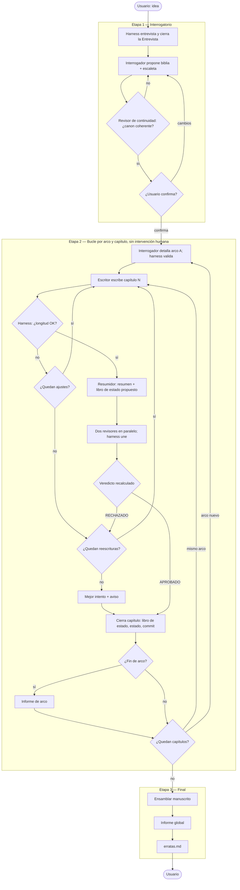

# story-maker — Especificación funcional

Generador agéntico de novelas en castellano sobre **cómo será el mundo tras la revolución de la IA**. El usuario aporta una idea; cinco agentes (interrogador, escritor, resumidor, revisor de encargo y revisor de continuidad) coordinados por un **harness** la convierten en una novela completa.

El proyecto tiene **dos hitos** y este documento vale para los dos:

1. **Hito 1 — Claude Code, modelos caros.** El orquestador es la sesión de Claude Code con **Opus**; los cinco agentes son subagentes con **Haiku**. El harness es una skill orquestadora, cinco agentes y un conjunto de reglas, todo en Markdown dentro del repositorio.
2. **Hito 2 — Cáscara contra OpenRouter, modelo barato.** El **mismo** Markdown, ejecutado por un orquestador LLM barato servido por OpenRouter dentro de una **cáscara** propia (§10) que espeja lo que Claude Code da hoy: herramientas, permisos, hook y subagentes. Los agentes van en Haiku u otros modelos baratos. Esta decisión, tomada el 2026-09-18, **revierte** el "runner en código" de la 0.4.0 (consolidación §5).

Vocabulario: **hito** = fase del proyecto. **Etapa** = fase del flujo de una novela (1 interrogatorio, 2 bucle por capítulo, 3 final). No se usa "fase".

La carpeta de la novela es el único estado, en los dos hitos. Este documento es **normativo**: dice qué hace el sistema y quién lo impone. El **porqué** con sus datos vive en [hallazgos.md](hallazgos.md) (evidencias `E-n`). Lo **sin decidir** vive en [consolidacion-2026-09-18.md](consolidacion-2026-09-18.md) (preguntas `A-n`); una regla marcada `→ A-n` está en discusión y no debe implementarse hasta que se decida.

### Cómo leer las marcas

Cada regla lleva al final dos marcas entre corchetes: **quién la impone**, por orden de fiabilidad, y **dónde funciona**.

| Marca | Quién impone la regla |
|---|---|
| `hook` | Código que corta la acción antes de ocurrir (`inmutables.sh`, `permissions.deny`) |
| `cáscara` | La plataforma que ejecuta al orquestador: hoy Claude Code (`maxTurns`, `permissions`, herramienta `Agent`); en el hito 2, la cáscara de §10 |
| `harness` | Prosa de SKILL.md o de un procedimiento, ejecutada por el orquestador. **Es un modelo leyendo instrucciones**: puede olvidarse (E3) |
| `prompt` | Contrato de un agente en `.claude/agents/`. Solo se cumple si el modelo lo cumple |
| `guion` | Código determinista fuera del bucle (`herramientas/`). Impone lo que el harness le pide y, a diferencia de la prosa, no puede olvidarse (E3); pero solo actúa si alguien lo llama |
| `ninguno` | Declarado en la spec y no impuesto por nada |
| `pendiente` | Declarado en la spec 0.8.0 y **no implementado** (→ A2). El harness hoy hace otra cosa |

| Marca | Dónde funciona hoy |
|---|---|
| `ambos` | Se porta al hito 2 sin cambios: es Markdown, `config.json`, la carpeta o un guion |
| `CC` | Solo funciona en Claude Code. La cáscara de §10 tiene que reimplementarlo |

Todo lo marcado `harness`, `prompt` o `ninguno` es la lista de lo que puede derivar sin que nadie se entere.

---

## 0. Glosario

Términos con sentido preciso. Si una palabra aparece aquí, significa esto en la spec, la skill, los agentes y la cáscara.

### 0.1 El proyecto

| Término | Qué es | Para qué sirve |
|---|---|---|
| **Harness** | El orquestador: llama a los agentes en orden, guarda el estado, impone los límites y toma todas las decisiones de flujo. Es la skill `/novela` leída por un modelo: Opus en Claude Code (hito 1), un LLM barato en la cáscara (hito 2) | Convierte cinco prompts en un sistema que produce una novela completa sin supervisión y reanudable |
| **Cáscara** | La plataforma que ejecuta al harness: le da herramientas (`Read`, `Write`, `Edit`, `Bash`, `Agent`), impone permisos y hooks, corre los subagentes y habla con el estudio. Hito 1: Claude Code. Hito 2: programa propio (§10). Antes llamada *runner* | Es lo único que cambia entre hitos. Todo lo demás es el mismo Markdown |
| **Agente** | Un prompt con contrato (entradas, salida, debe, no debe) ejecutado con un modelo. Cinco: interrogador, escritor, resumidor, revisor de encargo, revisor de continuidad | Cada uno hace una sola cosa; se les da distinto modelo y contexto y se juzgan por separado |
| **Revisor de encargo** | Contesta *¿se escribió lo que se pidió?* contra la entrada de escaleta y la voz de la biblia (criterios 2 y 4, §5.4) | Separar "lo pedido" de "lo coherente" reduce a la mitad contexto y criterios (E1) |
| **Revisor de continuidad** | Contesta *¿se contradice algo?* contra biblia, libro de estado y resúmenes (criterios 1 y 5, §5.5); revisa además el canon, cada arco y la novela completa | Las contradicciones a distancia son el fallo dominante de las novelas largas (E1, E2) |
| **Visor** | La parte de `frontend/` que solo lee (§9.2) | Cruza los seis ficheros de una novela a medias |
| **Estudio** | La parte de `frontend/` que recoge inputs y lanza el harness (§9.4). Fachada sobre `/novela`: no invoca agentes, no decide, no escribe en `novelas/` | Encargar sin terminal, sin llegar a nada a lo que no se llegue por terminal |
| **Encargo** | Lo que el usuario rellena antes de que exista la novela, en `encargos/<slug>/` | Separa lo que escribe el usuario de lo que escribe el harness |
| **Entrevista precargada** | Respuestas dadas por adelantado que entran como punto de partida del grilling (§9.4) | Un formulario no repregunta; precargar conserva las rondas |
| **Protocolo de sesión** | El subconjunto de `stream-json` con el que el estudio habla con la cáscara (§10.3) | Hace que el estudio funcione contra los dos hitos sin saber cuál es |
| **Observabilidad** | Trazas en una herramienta externa (Langfuse, §9.3). Nunca fuente de verdad ni puerta del flujo | Ver y comparar ejecuciones sin cruzar ficheros a mano |
| **Evaluador** | Un juez, determinista o LLM, que corre en Langfuse **fuera del bucle** sobre observaciones ya exportadas y mide a los revisores (§9.3.1) | Es la única fuente de defectos que no es el propio bucle (E5) |
| **Contrato** | Lo que un agente recibe, devuelve y tiene prohibido (§5) | Se porta sin cambios y el harness lo verifica en cada invocación |
| **Invocación** | Una llamada a un agente con unas entradas, que termina en salida o fallo | Unidad que se registra, reintenta y mide |
| **Hito / Etapa** | Ver arriba | El Estado guarda la etapa para reanudar |
| **Perfil** | Tamaño de la novela: `relato`, `novela_corta`, `novela`, `saga` | Cambiar `perfil_activo` escala el proyecto |
| **Escalado (de modelo)** | Subir a un modelo mejor en reescrituras, último intento, reintento tras fallo, revisiones de arco y global | Gastar el caro solo donde compensa |
| **Modo de prueba** | Entrevista desde fichero y escaleta aprobada sola | Verificar el harness sin persona delante |
| **Caso de referencia** | Idea y entrevista fijas en `pruebas/referencia/` | Comparar configuraciones sobre la misma historia |
| **Evidencia (E-n)** | Un hallazgo numerado de [hallazgos.md](hallazgos.md) con su dato | Que cada regla apunte a lo que la motivó sin repetirlo aquí |

### 0.2 Los artefactos de una novela

Todo vive en `novelas/<slug>/`. Por orden de aparición:

| Término | Qué es | Para qué sirve |
|---|---|---|
| **Idea** | Una o dos frases del usuario | Semilla; se guarda literal |
| **Entrevista** | Preguntas del harness y respuestas, marcando qué eligió el usuario y qué dejó en "decide tú" | Fija las decisiones antes de escribir. Única entrada del interrogador junto a la idea |
| **Biblia** | Premisa, tono y estilo, el mundo post-IA de esta historia, personajes con arco, motivación y voz, **canon** y **reglas inviolables** | Es la ley. Inmutable tras la aprobación |
| **Canon** | Sección «Cronología y datos fijos» de la biblia: año de arranque, edades con año de referencia, fechas, geometría del escenario | Una biblia que se contradice envenena todos los capítulos y es invisible a la revisión por capítulo (E1). Declarado en tabla, comprobarlo es restar |
| **Escaleta de alto nivel** | Tres actos divididos en arcos; por arco: rango, objetivo, sucesos clave, hilos que abre y cierra; total de capítulos | Lo que aprueba el usuario y queda inmutable |
| **Acto** | Planteamiento, nudo, desenlace | Estructura mínima |
| **Arco** | Tramo de como mucho `capitulos_por_arco` capítulos con objetivo propio | Unidad de planificación detallada y revisión intermedia |
| **Escaleta de arco** | Una entrada por capítulo del arco: título provisional, objetivo, sucesos, personajes, gancho, longitud objetivo | Orden de trabajo del escritor y vara del revisor de encargo |
| **Entrada / Gancho / Hilo** | Ficha de un capítulo · última nota prevista que empuja a seguir · línea argumental que se abre y debe cerrarse | Los hilos se registran con origen y cierre previsto: un hilo sin cerrar es el síntoma principal de incoherencia larga |
| **Capítulo / Intento / Reescritura** | Unidad del bucle · cada versión (máx. 3) · intento nuevo con el informe de rechazo como entrada | Se conservan todos los intentos |
| **Ajuste de longitud** | Intento pedido **solo** por salirse del margen de palabras, con presupuesto propio | Un rechazo por longitud no corrige nada; si consumiera reescritura se llevaría las correcciones pendientes (E1) |
| **Resumen** | Los **hechos** de un capítulo aprobado, acotados a `memoria.resumen_max_palabras`, con frontmatter de hilos, fechas de ficción, plazos y objetos | Memoria a corto plazo. El **estado** no va aquí (E2) |
| **Libro de estado** | Foto de la novela tras el último capítulo aprobado: personajes, hilos abiertos y cerrados, objetos, lugares, datos, reglas en vigor | Memoria a largo plazo de tamaño constante; vara del revisor de continuidad |
| **Hoja de continuidad** | Ficha corta que **compone el harness** antes de invocar a escritor y revisor de continuidad: fechas, días transcurridos, edades a la fecha, objetos y poseedores, plazos, hilos a cerrar | 7 de 9 contradicciones graves de la referencia eran aritmética que estaba en el contexto diluida (E2). Calcularlo es del harness |
| **Informe (de capítulo)** | Veredicto APROBADO/RECHAZADO con problemas concretos | Decide si se avanza y es la entrada de la reescritura |
| **Veredicto** | Cada revisor propone; el que vale es el que **recalcula el harness** sobre la unión (§7.5) | Que la decisión no dependa del humor del modelo |
| **Gravedad** | 1 contradicción · 2 incumple escaleta · 3 longitud (harness) · 4 voz/tono · 5 resumen infiel | Regla de veredicto numérica |
| **Aceptación por agotamiento** | Sin reescrituras y sin aprobado, el harness se queda con el mejor intento y sigue | Que la novela no se bloquee; su frecuencia es métrica |
| **Informe de arco / global** | Revisión de continuidad sobre el arco cerrado / la novela completa. Informativos | Detectan lo que no se ve capítulo a capítulo. Nadie reescribe a partir de ellos |
| **Manuscrito** | Título, índice y capítulos aprobados en orden | Producto final |
| **Erratas** | Arreglos de una línea que propone el informe global. El harness los escribe; nadie los aplica | Reescribir un capítulo cerrado invalidaría su resumen y todos los libros de estado posteriores |
| **Estado / Registro / Informe de cierre** | `estado.json` · `registro.md` (una fila por invocación y decisión, con volumen) · resultado de la ejecución con métricas y acción para continuar | Reanudar · trazabilidad · que el programa nunca termine en silencio |
| **Parada limpia** | Terminar sin nada a medias marcado como válido, Estado actualizado, motivo explicado | Siempre se reanuda con el mismo comando |
| **Slug** | Nombre de carpeta derivado de la idea | Identificador estable |

---

## 1. Alcance

### 1.1 Objetivo

A partir de una idea, producir una novela completa —biblia, escaleta, capítulos aprobados y manuscrito— con continuidad interna verificada, sin intervención humana desde la aprobación de la escaleta hasta el final.

### 1.2 Decisiones fijas

| Aspecto | Decisión |
|---|---|
| Género / universo / idioma | Ficción especulativa post-IA; cada novela inventa su mundo, sin canon compartido; castellano en todo |
| Interacción | Conversacional en la etapa 1, solo progreso después. Igual en los dos hitos: el estudio o la terminal hablan con la cáscara por el protocolo de sesión (§10.3) |
| Ejecución | Hito 1: Claude Code con subagentes, sin programas propios en el núcleo. Hito 2: la misma skill y los mismos agentes dentro de la cáscara de §10. **El orquestador es un modelo en los dos hitos** |
| **Quién escribe en disco** | **Solo el harness.** Los agentes devuelven su salida en el mensaje final `[prompt+cáscara · ambos]` |
| **Control determinista** | Todo lo decidible sin modelo (contar, recalcular veredicto, validar forma, actualizar estado, elegir mejor intento) lo hace el harness con herramientas mecánicas, nunca un agente. **Limitación:** en los dos hitos el harness es un modelo, así que "mecánico" significa "el modelo se acordó de ejecutar `wc -w`" (E3) `[harness · ambos]` → A3 |
| Escala | Hito 1: `relato` (5 capítulos). Hito 2: hasta 200 (`saga`), una sola novela con una trama |

### 1.3 No objetivos

- Formatos distintos de Markdown y JSON. El visor pinta Markdown; no produce ficheros.
- Código propio **en el núcleo del hito 1**: orquestador y agentes son Markdown. Excepciones declaradas: el hook `inmutables.sh` (§3.1), el visor (§9.2) y el estudio (§9.4); las dos primeras prescindibles, la tercera no genera ni decide. En el hito 2 la cáscara es código, **el orquestador no**. Guiones mecánicos en `herramientas/` llamados desde la skill: → A3.
- Coste en dinero en el hito 1 (Claude Code no lo expone). Sí volumen (§6.6). En el hito 2 OpenRouter devuelve tokens y coste.
- Interfaz de la que el harness **dependa**: `/novela nueva` desde terminal produce la misma novela sin `frontend/`.
- Ilustraciones, otros idiomas, series encadenadas (`saga` es una novela larga), modo de prueba como uso normal, volver atrás a un capítulo aprobado, reescritura automática tras arco o global, avisos externos.
- Ni portada, ni traducciones, ni una novela **corregida**: los informes se entregan tal cual.

---

## 2. Actores

| Actor | Tipo | Responsabilidad |
|---|---|---|
| **Usuario** | Persona | Idea, entrevista, aprobación de la escaleta, decidir qué hacer con los informes |
| **Harness** | La skill `/novela` leída por el orquestador (Opus en Claude Code; LLM barato en la cáscara) | Orquesta, invoca, **escribe todos los ficheros**, guarda estado, impone límites, comprueba longitud y forma, reanuda, ensambla |
| **Interrogador** | Agente | Idea + entrevista → biblia y escaleta de alto nivel; al empezar cada arco, su escaleta |
| **Escritor** | Agente | Escribe cada capítulo. Solo el capítulo |
| **Resumidor** | Agente | Del texto del capítulo y el libro de estado vigente, resumen y libro de estado propuesto |
| **Revisor de encargo** | Agente | ¿Cumple su entrada de escaleta y el tono? Nunca edita |
| **Revisor de continuidad** | Agente | ¿Contradice canon, libro de estado o resúmenes? Revisa además canon, arco y novela completa. Nunca edita |

Los agentes son **prompts con contrato**, no piezas de Claude Code. Ningún agente escribe ficheros ni habla con el usuario `[prompt+cáscara · ambos]`.

Por qué el resumen no lo escribe el escritor: resume lo que quiso escribir, no lo que quedó (E1). Por qué la revisión está partida: el revisor único recibía 19.000 palabras con cinco criterios y se le escaparon cuatro contradicciones a distancia (E1).

---

## 3. Artefactos

Todos en `novelas/<slug>/`, único estado del sistema. **Todo lo escribe el harness**; "Contenido de" dice qué agente produjo el contenido. "DdH" = definición de hecho: cuándo el artefacto está bien. Esta tabla es también el **inventario** que `/novela verificar` comprueba (§8.7) y la definición de "misma salida" para la cáscara (§10.4).

| Artefacto | Fichero | Cuántos | Contenido de | Lo leen | DdH |
|---|---|---|---|---|---|
| Idea | `idea.md` | 1 | Usuario | Todos | Literal, sin reinterpretar |
| Configuración | `config.json` | 1 | Harness | Harness, interrogador | `version: 4`; perfil resuelto con `nombre`; `proveedor`, `formato`, `modelos`, `limites`, `veredicto`, `memoria`, `calidad`, `origen`; sin `perfiles` (§7) |
| Entrevista | `entrevista.md` | 1 | Usuario vía grilling o fichero | Interrogador | `cerrada: true`, `origen: grilling \| fichero \| formulario+grilling`; cada decisión marcada [usuario], [recomendación aceptada] o [decide tú] |
| Biblia | `biblia.md` | 1 | Interrogador | Todos | `aprobada: true`; premisa, mundo, **3–7 reglas inviolables numeradas**, tono/PDV/estilo, personajes, **«Cronología y datos fijos» con contenido** |
| Escaleta (alto nivel) | `escaleta.md` | 1 | Interrogador | Todos | `aprobada: true`; `capitulos` en límites; `arcos` que cubren 1..N sin huecos ni solapes, ninguno > `capitulos_por_arco`, cada uno con `acto, objetivo, sucesos_clave, hilos_abre, hilos_cierra`; tres actos; sección Hilos |
| Escaleta de arco | `arcos/arco-AA.md` | 1 por arco | Interrogador | Todos | `validada: true`; una entrada por capítulo del rango con `n, titulo, objetivo, sucesos, personajes, gancho, palabras_objetivo` en límites; todos los `sucesos_clave` del arco asignados |
| Capítulo N, intento K | `capitulos/NN/intento-K.md` | 1–3 por capítulo | Escritor | Todos | Sin frontmatter: `# <título>` y texto. El aprobado cumple su entrada y está en tolerancia (`wc -w`) |
| Resumen N, K | `capitulos/NN/resumen-K.md` | 1 por intento que pasó la longitud | Resumidor | Todos | Frontmatter `capitulo, intento, hilos_abiertos, hilos_cerrados, personajes` (+ `fecha_ficcion_inicio, fecha_ficcion_fin, plazos, objetos` `[pendiente]`); secciones Hechos, Cambios en personajes, Elementos introducidos, Enlace |
| Libro de estado propuesto N, K | `capitulos/NN/libro-estado-K.md` | ídem | Resumidor | Harness | El libro de estado tal como quedaría si se aprueba K |
| Informe N, K | `capitulos/NN/informe-K.md` | 1 por intento | Harness, uniendo los dos revisores (o solo harness si longitud) | Todos | `veredicto` recalculado sobre la unión; `origen: revisores \| harness`; cada problema con `gravedad ∈ {1..5}, origen ∈ {encargo, continuidad, harness}, donde, que, por_que` |
| Libro de estado | `libro-estado.md` | 1 | Resumidor, adoptado por el harness | Escritor, resumidor, revisor | `hasta_capitulo` = último aprobado; copia exacta del `libro-estado-K.md` aprobado; secciones Personajes, Hilos abiertos, Hilos cerrados, Elementos, Reglas en vigor |
| Informe de arco | `arcos/informe-arco-AA.md` | 1 por arco, **solo con más de un arco** | Revisor de continuidad | Usuario | `capitulo: arco-AA`; informativo; problemas con la forma de §5.6 |
| Estado | `estado.json` | 1 | Harness | Harness | `version: 4`; último punto consistente; `etapa: completa` al terminar; `capitulos[N]` con `aprobado, por_agotamiento, intentos, reescrituras, ajustes_longitud`; `arcos[A].escaleta_validada`; `invocaciones` por agente |
| Registro | `registro.md` | 1 | Harness | Usuario, exportador | Una fila por evento (plantilla); cada `invocacion` con `modelo, pal_entrada, pal_salida` y `tok_*`, `coste_usd` si existen. Un intento revisado produce **dos** filas `invocacion`. En Claude Code cada invocación deja además una fila `resultado: pendiente` → A9 |
| Manuscrito | `manuscrito.md` | 1 | Harness | Usuario | Título, índice, capítulos aprobados en orden; nota final si alguno fue por agotamiento |
| Informe global | `informe-global.md` | 1 | Revisor de continuidad | Usuario | `capitulo: global`; `base: manuscrito \| resumenes`; informativo. Vacío de problemas es posible |
| Erratas | `erratas.md` | 1 | Harness | Usuario | Problemas del global que se arreglan en una línea, con ruta, cita literal presente en el manuscrito y cambio. `aplicadas: 0` siempre |
| Informe de cierre | `informe-cierre.md` | 1, reescrito cada ejecución | Harness | Usuario | `resultado: EXITO \| PARADA` con motivo, qué quedó hecho, volumen, métricas CUMPLE/NO CUMPLE, inventario, acción para continuar |
| Commits | git | ≥ 3 + 1 por capítulo + 2 por arco extra | Harness | — | `novela <slug>: carpeta creada · escaleta aprobada · arco AA detallado · cap NN cerrado (intento K) · arco AA revisado · novela completa · PARADA <motivo>` |

Un capítulo rechazado por longitud tiene `intento-K.md` e `informe-K.md` pero no resumen ni libro de estado. Con `relato`: mínimo 20 ficheros de capítulo, máximo 60. Varios intentos no son un fallo: son el bucle funcionando.

### 3.1 Reglas de escritura

- **Solo el harness escribe.** Los agentes se definen con `tools: Read, Glob, Grep` `[cáscara · ambos: la cáscara de §10 respeta el mismo frontmatter]`.
- **Nada aprobado se modifica**: biblia y escaleta de alto nivel tras la aprobación, escaleta de arco tras validarla, capítulo tras APROBADO o agotamiento, libro de estado salvo por el harness al cerrar capítulo. Cada uno se crea con una escritura completa; nunca se edita en sitio. Lo impone `.claude/hooks/inmutables.sh` como `PreToolUse` sobre `Edit` y `Write` dentro de `novelas/`, registrado en `.claude/settings.json` `[hook · ambos: la cáscara ejecuta el mismo hook, §10.2]`:
  - `Edit` bloquea **siempre** sobre `biblia.md`, `escaleta.md`, `arco-*.md`, `informe-arco-*.md`, `intento-*.md`, `libro-estado.md`, `libro-estado-*.md`, `manuscrito.md`.
  - `Write` **por aprobación** para `biblia.md`, `escaleta.md`, `arco-*.md`: el hook lee el frontmatter del fichero existente y bloquea con `aprobada: true` / `validada: true`. Sin la marca deja pasar: una propuesta se reescribe a propósito en cada vuelta, y aprobar es reescribir con la marca (§4.1).
  - `Write` **por existencia** para `intento-*.md`, `libro-estado-*.md`, `informe-arco-*.md`, `manuscrito.md`: el primero es el harness creándolo; el segundo, el error.
  - `libro-estado.md`: su `Write` siempre pasa (se sustituye al cerrar cada capítulo); su `Edit` no.
  - El hook **falla en abierto** si no entiende su entrada. **Limitación conocida:** no cubre Bash (`cp`, `cat >`, `sed -i`); el criterio 6 de §8.2 lo demuestra a posteriori con git.
- Estado, Registro y Libro de estado son exclusivos del harness `[harness · ambos]`.
- **Escritura atómica** (temporal + renombrado) `[cáscara · hito 2: la herramienta `Write` de la cáscara]`.
- Reglas de permisos del repositorio (`.claude/settings.json`): `Edit(/novelas/**)` y `Edit(/comparativa/**)` son las que autorizan `Write` sobre esas carpetas (en Claude Code las reglas `Edit(ruta)` cubren `Write`; una regla `Write(ruta)` no se consulta). `git` acotado a `novelas/`, sin `push`, `--amend`, `reset --hard` ni `rebase`. `deny` de `Read(.env)` y `Read(.claude/settings.local.json)` `[hook · ambos: la cáscara lee el mismo fichero]`.

### 3.2 Cuánto texto, por perfil

| Perfil | Capítulos | Palabras/cap | Arcos | Manuscrito | Páginas (250 p/pág) | Ficheros de capítulo |
|---|---|---|---|---|---|---|
| `relato` | 5 | 1.500 | 1 | ~7.500 | ~30 | 20–60 |
| `novela_corta` | 12 | 2.000 | 1 | ~24.000 | ~96 | 48–144 |
| `novela` | 30 | 2.500 | 2 | ~75.000 | ~300 | 120–360 |
| `saga` | 100 (hasta 200) | 2.500 | 7 (hasta 14) | ~250.000 (hasta ~500.000) | ~1.000 (hasta ~2.000) | 400–1.200 (hasta 800–2.400) |

A partir de `novela` la revisión global se hace sobre resúmenes e informes de arco (`limites.revision_global_max_palabras`).

---

## 4. Flujo



### 4.1 Etapa 1 — Interrogatorio

1. El harness crea la carpeta y guarda la idea `[harness · ambos]`.
2. **Entrevista** en rondas sucesivas sin límite fijo, con la skill `grilling` `[harness · CC: la skill es un plugin de Claude Code → A17]`. Con `entrevista: <ruta>` la toma cerrada de fichero y no pregunta; con `precarga: <carpeta>` las respuestas del estudio son el punto de partida y el grilling sigue (§9.4). Resultado: `entrevista.md`.
3. **Propuesta.** Interrogador con idea, entrevista y límites → biblia, escaleta de alto nivel (y la del arco si es único) y propuesta de cierre. El harness valida contra los límites `[harness · ambos]`.
4. **Validación del canon.** Antes de enseñar nada, revisor de continuidad en modo `canon` sobre biblia y escaleta. Problemas → al interrogador, hasta `escaleta_rechazos_max`; después se presentan al usuario junto con la propuesta `[harness · ambos]`. Que compruebe también reglas inviolables contra la escaleta: → A4.
5. El usuario **confirma** o **pide cambios**; el interrogador corrige solo eso y el canon se revalida. Sin usuario en la sesión (`estado.encargo` no nulo): parada `ESPERA_APROBACION` y decisión en `encargos/<slug>/decision.md` (§9.4) `[harness · ambos]`.
6. Con la confirmación, biblia y escaleta se reescriben con `aprobada: true` `[harness+hook · ambos]`.

**Escaleta por arcos.** La de alto nivel divide en arcos de ≤ `capitulos_por_arco`; la de cada arco se genera al llegar a él con biblia, alto nivel, libro de estado e informe del arco anterior. Con total ≤ `capitulos_por_arco` hay un solo arco y el interrogador la devuelve entera en la propuesta.

**El canon, explícito.** Sección obligatoria «Cronología y datos fijos». Regla derivada: si una fecha no está en el canon, el texto no la ata a un día de la semana `[prompt · ambos]`. Evidencia: E1.

Restricciones del perfil (§7.1): capítulos entre `min` y `max`; longitud entre suelo y techo; arcos sin huecos ni solapes, cada uno ≤ `capitulos_por_arco`. Violación → al interrogador con motivo, hasta `escaleta_rechazos_max`, después presentar (propuesta) o parar (arco) `[harness · ambos]`.

### 4.2 Etapa 2 — Bucle por arco y capítulo

**Inicio de arco A.** Si `arcos/arco-AA.md` no existe: interrogador en modo arco. El harness comprueba rango exacto, longitudes y que todos los sucesos clave están asignados; si no, devuelve hasta `escaleta_rechazos_max`, después parada limpia. Validada: `validada: true` y commit. Sin confirmación del usuario `[harness · ambos]`.

Para cada capítulo N:

**Hoja de continuidad (harness, sin modelo).** Ficha de ≤ `memoria.hoja_continuidad_max_palabras` (200) con: fecha de ficción del fin de N−1 y la prevista para N, días transcurridos; edad de cada personaje presente a esa fecha desde el canon; objetos con poseedor y lugar; plazos en curso; hilos que N debe cerrar. Solo copia y resta; dato ausente → `desconocido`. Se pasa al escritor y al revisor de continuidad `[pendiente → A2]`. Evidencia: E2.

**Escritura.** El escritor recibe: hoja de continuidad `[pendiente]`, biblia, escaleta de alto nivel, escaleta del arco con la entrada N destacada, libro de estado, últimos `resumenes_completos_ultimos` resúmenes, capítulo N−1 íntegro si `capitulo_anterior_integro`, y en reescritura el informe y el texto rechazado. Devuelve el capítulo; el harness lo escribe en `intento-K.md` `[harness · ambos]`.

**Comprobación de longitud (harness, sin modelo).** `wc -w` del cuerpo. Fuera de `tolerancia_longitud`: el harness escribe él mismo `informe-K.md` con un problema de gravedad 3 y trata el intento como RECHAZADO **sin invocar a nadie más** `[harness · ambos]`. Un rechazo por longitud consume un **ajuste de longitud** (`limites.ajustes_longitud`), no reescritura; K sigue avanzando; el informe de contenido pendiente se pasa junto con el de longitud. Agotados los ajustes, vuelve a consumir reescritura `[harness · ambos]`. El prompt del escritor lleva siempre el recuento del intento anterior y suelo y techo **en palabras absolutas**, con la instrucción de que corregir no alarga `[harness · ambos]`. Evidencia: E1. Sesgo de longitud opuesto por modelo (E3): → A11.

**Resumen.** El resumidor recibe **solo** el texto, el libro de estado vigente y las plantillas. Devuelve resumen y libro de estado propuesto; el harness escribe ambos `[harness · ambos]`. El harness cuenta el resumen; si supera `memoria.resumen_max_palabras`, reinvoca **una sola vez** con el tope en palabras absolutas; si vuelve a pasarse, acepta con aviso. No rechaza el capítulo `[pendiente → A2]`. Evidencia: E2.

**Revisión.** Dos agentes en paralelo `[cáscara · ambos: dos llamadas `Agent` en el mismo mensaje]`:
- **Encargo** (§5.4): capítulo, escaleta de alto nivel, escaleta del arco (entrada N y posteriores), biblia.
- **Continuidad** (§5.5): hoja `[pendiente]`, capítulo, su resumen, biblia, libro de estado, los mismos resúmenes que el escritor.

El harness valida los dos JSON, **une** problemas y observaciones, **recalcula el veredicto** con §7.5 y escribe un único `informe-K.md` con el origen de cada problema. Veredicto propuesto ≠ recalculado → `discrepancia_veredicto`. Mismo problema en los dos → se conserva el de mayor gravedad y se anota duplicado `[harness · ambos]`. Que un revisor falle no invalida al otro: se reintenta solo ese (§6.5).

**Decisión del harness** `[harness · ambos]`:
- APROBADO → `libro-estado-K.md` sobre `libro-estado.md`, Estado, commit, N+1.
- RECHAZADO con reescrituras → escritor con el informe (máx. `reescrituras_max`, 2: tres intentos).
- RECHAZADO sin reescrituras → **mejor intento**, aviso con informe en Registro y Estado, N+1.

**Mejor intento** `[harness · ambos]`, por orden: (1) descartar los rechazados por longitud si alguno llegó a revisores; si todos lo fueron, el más cercano al objetivo y fin; (2) **cumple los cierres que la escaleta manda para N** (`hilos_cierra` de la escaleta contra `hilos_cerrados` del resumen), a igualdad el que más cierre; (3) menos problemas de gravedad 1–2; (4) menos problemas en total; (5) el más reciente. Resuelto en (4) o (5): aviso «mejor intento elegido sin criterio fuerte». No se pregunta al usuario. Evidencia: E1. Sin ejercitar aún en ninguna ejecución (E3).

**Fin de arco.** Revisor de continuidad con todos los capítulos del arco, escaletas, biblia y libro de estado → `informe-arco-AA.md`, informativo; alimenta la escaleta del arco siguiente. Con un solo arco, arco y global son la misma pasada `[harness · ambos]`.

**Progreso visible.** Una línea por evento (§6.4). El usuario puede interrumpir; se reanuda desde disco (§6.2).

### 4.3 Etapa 3 — Final

1. Ensamblar el **manuscrito** `[harness · ambos]`.
2. **Revisión global.** Si el manuscrito ≤ `revision_global_max_palabras`, una pasada sobre la novela completa; si no, sobre biblia, escaleta de alto nivel, libro de estado final, todos los resúmenes y los informes de arco, y el informe lo dice. No reescribe nada `[harness · ambos]`.
3. **Erratas.** El harness separa del informe global lo que se arregla en una línea y lo escribe en `erratas.md` con ruta, cita exacta y cambio. **No aplica ninguna** `[harness · ambos]`. Pulido de lengua fuera del bucle: → A28.
4. Métricas de calidad (§8.3) e informe de cierre (§6.5). Recuento de volumen **desde `registro.md`**, no desde los contadores de `estado.json`: → A10 (E3).

---

## 5. Contratos de los agentes

Reglas comunes: reciben exactamente las entradas de su contrato; devuelven su salida **en el mensaje final** con la forma fijada, sin texto antes ni después; no escriben ficheros; no hablan con el usuario; no deciden flujo `[prompt · ambos]`. Un mensaje final sin la forma esperada es **incumplimiento de contrato** (§6.5) y el harness repite indicando qué faltó `[harness · ambos]`.

**Bloques de documento** (interrogador, escritor, resumidor): cada documento entre `=== ARCHIVO: <ruta relativa> ===` y `=== FIN ===`. Los revisores devuelven solo JSON (§5.6). Tolerancia de formato (valla de código alrededor, ruido tras el delimitador): hoy improvisada por el orquestador (E3) → A8.

Definición en `.claude/agents/`: `tools: Read, Glob, Grep`, `maxTurns` = `limites.turnos_por_invocacion`, `model` = `modelos.<agente>`, **sin** `memory` (una memoria persistente crearía el canon compartido que §1.2 prohíbe) `[cáscara · ambos: la cáscara lee el mismo frontmatter]`. `maxTurns` y `model` son estáticos; `comprobar_entorno` comprueba que coinciden con `config.json` `[harness · ambos]`. El modelo que manda es el parámetro `model` de la llamada `Agent` (escalado, §7.3); el del frontmatter es red de seguridad.

**Modos de fallo observados** (E1, E3, E4): tabla al final de cada contrato. Es lo que hace que un prompt mejore en vez de crecer.

### 5.1 Interrogador

| | |
|---|---|
| **Entrada (propuesta)** | Idea; entrevista cerrada; límites; en segunda vuelta, el motivo |
| **Entrada (arco)** | Biblia; escaleta de alto nivel con el arco destacado; libro de estado; informe del arco anterior; límites; motivo si hay |
| **Salida** | Biblia, escaleta de alto nivel y, si hay un arco, su escaleta; propuesta de cierre. En modo arco, la escaleta del arco. Bloques con ruta destino |
| **Debe** | Respetar lo elegido en la entrevista; decidir lo "decide tú" y anotarlo; escribir «Cronología y datos fijos» y comprobar que cuadra; tamaños en límites; tres actos; objetivo propio por capítulo; en modo arco asignar todos los sucesos clave y recoger lo pendiente del informe anterior; en segunda vuelta corregir solo lo indicado |
| **No debe** | Escribir prosa de la novela; preguntar; modificar biblia o alto nivel en modo arco; marcar nada como aprobado |

| Fallo visto | Dónde |
|---|---|
| Salida sin bloques `=== ARCHIVO ===` (describe el fichero en vez de emitirlo); arcos duplicados en `escaleta.md` | 3 reintentos, haiku (E3) |
| Canon con plantas descuadradas y un final en una planta que el canon no declaraba | 2 rechazos de canon, haiku (E3) — el mecanismo funcionó |
| Llave entregada en un año incompatible con edad y oficio; ascensor con menos paradas que plantas | Biblia de referencia, opus, antes del canon explícito (E1) |

### 5.2 Escritor

| | |
|---|---|
| **Entrada** | Hoja de continuidad `[pendiente]`; biblia; escaleta de alto nivel; escaleta del arco con N destacada; libro de estado; resúmenes según `memoria`; capítulo anterior íntegro si procede; en reescritura, informe y texto rechazado |
| **Salida** | Capítulo N en un único bloque, con título |
| **Debe** | Cumplir objetivo, sucesos y gancho de N; tomar de la hoja fechas, edades, plazos y poseedores sin recalcular `[pendiente]`; respetar biblia, libro de estado y resúmenes; longitud en tolerancia; voz del capítulo anterior; en reescritura corregir cada problema sin introducir otros |
| **No debe** | Producir resumen ni notas; adelantar sucesos; resolver hilos que deben quedar abiertos; contradecir el libro de estado |

| Fallo visto | Dónde |
|---|---|
| Se pasa de largo (+10,5 %, 11 de 13 por encima) con opus; se queda corto (−22,7 %, 9 de 9 por debajo) con haiku | E1, E3 |
| Salida sin bloques o bloque sin `=== FIN ===` | 3 reintentos, haiku (E3) |
| Ampliar por longitud triplica el motivo repetido («treinta años»: 1 → 3) | Cap. 5 de B (E4, E5) |
| Aritmética de fechas, edades y plazos, y estado de objetos: 7 de 9 graves | E2 |
| Castellano roto («la agua», «La conocimiento», «hubiese trovado»), verosimilitud técnica, mundo post-IA ausente, escenas repetidas | E4, E5 — **ningún criterio los cubre** → A4 |

### 5.3 Resumidor

| | |
|---|---|
| **Entrada** | Texto del capítulo N intento K; libro de estado vigente; plantillas |
| **Salida** | Dos bloques: resumen N (frontmatter `hilos_abiertos`, `hilos_cerrados` y `[pendiente]` `fecha_ficcion_inicio`, `fecha_ficcion_fin`, `plazos`, `objetos`; cuerpo de hechos dentro de `resumen_max_palabras`) y libro de estado actualizado completo |
| **Debe** | Registrar **solo lo que está en el texto**. Reparto estricto: hechos y frontmatter en el resumen; estado en el libro de estado, actualizando lo afectado y conservando lo demás; origen de cada hilo; mover a cerrados lo que el texto cierra; fecha de ficción vacía si el texto no la dice `[pendiente el reparto → A2]` |
| **No debe** | Inferir lo que el autor quiso decir; añadir hechos; juzgar calidad; **repetir el libro de estado en el resumen**; pasarse del tope; consultar escaleta ni biblia |

| Fallo visto | Dónde |
|---|---|
| Resumen del 110 % del capítulo que resume (1.785 palabras de media), por duplicar el libro de estado | E2 |
| Copia un error de hecho del texto («50 años en el barrio», «mujer mayor») | E4 |
| Salida sin bloques; `**` sobrantes en viñetas | E3 |

### 5.4 Revisor de encargo

Contesta **¿está escrito lo que se pidió?**

| | |
|---|---|
| **Entrada** | Capítulo N; escaleta de alto nivel; escaleta del arco (N y posteriores); biblia |
| **Salida** | JSON de §5.6 |
| **Debe** | Juzgar solo contra **(2)** incumple la entrada N (suceso que falta, objetivo no logrado, gancho distinto) o adelanta sucesos o resuelve hilos que debían quedar abiertos; **(4)** ruptura de voz, PDV o tono. Recorrer la entrada suceso por suceso. Cada problema concreto y accionable |
| **No debe** | Editar; juzgar contradicciones con libro de estado o capítulos anteriores; **contar palabras**; rechazar por gusto; añadir criterios |

Solo modo capítulo.

| Fallo visto | Dónde |
|---|---|
| Aprobó un capítulo que no cumple un suceso («Marisa ignora el mensaje») y otro cuyo título («La 4ª planta») no tiene referente en el texto | B, haiku (E4) → A12 |
| No ve repetición de escena entre capítulos ni ausencia del mundo post-IA: no son sus criterios | E5 → A4 |

### 5.5 Revisor de continuidad

Contesta **¿se contradice algo?** a cuatro escalas: biblia consigo misma, capítulo, arco, novela.

| | |
|---|---|
| **Entrada (canon)** | Biblia y escaleta de alto nivel antes de aprobarse |
| **Entrada (capítulo)** | Hoja de continuidad `[pendiente]`; capítulo N; resumen N; biblia; libro de estado; resúmenes según `memoria` |
| **Entrada (arco)** | Capítulos del arco; escaletas; biblia; libro de estado |
| **Entrada (global)** | Manuscrito, o si no cabe biblia, escaleta, libro de estado final, resúmenes e informes de arco |
| **Salida** | JSON de §5.6 |
| **Debe** | Juzgar solo contra **(1)** contradice biblia, canon, libro de estado o resúmenes; **(5)** el resumen no refleja el capítulo. En `canon`, cuadrar los números de «Cronología y datos fijos» entre sí y con el resto. Contrastar cada afirmación absoluta («nadie», «siempre») con el libro de estado |
| **No debe** | Editar; juzgar escaleta ni tono; **contar palabras**; rechazar por gusto |

En `canon` los problemas son gravedad 1 contra la biblia. En arco y global el informe es informativo.

| Fallo visto | Dónde |
|---|---|
| Degrada a **observación** un salto de tres días sin justificar y unas fotos que nadie tomó («es compresión narrativa»); cierra con «Coherencia interna total» sobre un manuscrito con tres contradicciones | B, haiku (E4) → A12 |
| Con opus, la global encuentra 4–5 graves que ninguna revisión de capítulo vio | E1 |
| La frontera problema/observación no está definida en ningún sitio | E5 → A4 |

### 5.6 Forma del informe de los revisores

```json
{
  "veredicto": "RECHAZADO",
  "problemas": [
    { "gravedad": 1, "donde": "párrafo 14, escena del taller",
      "que": "Marta usa el implante que perdió en el capítulo 2",
      "por_que": "libro de estado, Personajes › Marta: 'sin implante desde el cap. 2'" }
  ],
  "observaciones": ["El diálogo del final se alarga; no obliga a reescribir"]
}
```

`problemas` puede ser vacío. `gravedad` ∈ {1, 2, 4, 5} y **cada revisor solo emite las suyas** (encargo 2 y 4; continuidad 1 y 5); otra es incumplimiento `[harness · ambos]`. El harness rechaza como incumplimiento lo que no sea JSON válido con exactamente esas tres claves `[harness · ambos]`. JSON y no YAML porque los modelos baratos rompen el YAML. Campo `cita` obligatorio verificado con `grep`, y definición comprobable de problema frente a observación: → A4.

**Regla de veredicto** sobre la **unión**: RECHAZADO si hay ≥ `veredicto.rechaza_con_gravedad_1` de gravedad 1, o ≥ `rechaza_con_gravedad_2` de gravedad 2, o ≥ `rechaza_con_leves` de gravedad 3–5 `[pendiente → A2: hoy `config.json`, `capitulo.md` y `plantillas/informe.md` aplican `rechaza_con_graves` sobre {1,2} juntas]`.

---

## 6. Contrato del harness

### 6.1 Responsabilidades `[harness · ambos]`

Crear y gestionar la carpeta · invocar con exactamente las entradas del contrato · **esperar la salida de cada agente antes de seguir** (única concurrencia: los dos revisores de un intento) · validar la forma y **escribir** · comprobar longitud del capítulo y del resumen · componer la hoja de continuidad `[pendiente]` · decidir todo el flujo · unir problemas, recalcular veredicto, elegir mejor intento · mantener el libro de estado · escribir el Estado **tras cada decisión** · registrar todo · imponer límites · ensamblar y calcular métricas · mostrar progreso.

**Primero se cuenta, después se registra**, para toda fila del registro; hoy es nota local de `comprobar_longitud` y ha fallado en el resumidor (E3) → A10.

### 6.2 Reanudación `[harness · ambos]`

Relanzar sobre una carpeta existente continúa donde se quedó: escaleta sin aprobar → interrogatorio (tras `ESPERA_APROBACION`, la propuesta no se rehace, solo se aplica la decisión); en el bucle → arco, capítulo e intento del Estado, un intento a medias se repite con el mismo número, un arco sin escaleta validada se detalla de nuevo; bucle terminado sin global → solo eso; completa → no hace nada. Siempre `/novela continuar <carpeta>`. Un paso a medias (`git status` sucio) se descarta con `descartar()` y se registra `paso_descartado`; conservar lo descartado en `.descartado/`: → A21.

Tras `PAUSA_PROGRAMADA` la reanudación va **en una sesión nueva**; el harness no la encadena `[harness · ambos]`.

### 6.3 Límites

| Límite | Comportamiento | Variable · defecto | Marca |
|---|---|---|---|
| Reescrituras por capítulo | Agotadas, mejor intento con aviso | `limites.reescrituras_max` · 2 | harness · ambos |
| Ajustes de longitud | Presupuesto aparte; agotado, la longitud vuelve a gastar reescritura | `limites.ajustes_longitud` · 2 | harness · ambos |
| Capítulos / palabras / capítulos por arco | Escaleta que lo viole vuelve al interrogador | perfil · `formato.capitulos_por_arco` · 15 | harness · ambos |
| Turnos por invocación | Agente que no entrega en N turnos incumple; resultado parcial = incumplimiento. Debe coincidir con `maxTurns` o `ERROR_CONFIGURACION` | `limites.turnos_por_invocacion` · 40 | cáscara · ambos (la cáscara aplica el mismo `maxTurns`) |
| Fallo técnico | Reintentos del mismo paso; después parada limpia | `limites.reintentos_tecnicos` · 3 | harness · ambos |
| Tamaño de la revisión global | Por encima, sobre resúmenes | `limites.revision_global_max_palabras` · 60.000 | harness · ambos |
| Presupuesto | Al superarlo, parada limpia. `null` desactiva | `limites.presupuesto_usd_max` · `null` | harness · **hito 2** (necesita coste real) |
| Pausa programada | Cada N capítulos, parada limpia para soltar contexto; se reanuda en sesión nueva | `limites.pausa_cada_capitulos` · 3 | harness · **ambos** (decisión 2026-09-18; compactación en la cáscara → A23) |

"Parada limpia": nada a medias marcado como válido, Estado con motivo, mensaje de cómo reanudar.

### 6.4 Progreso `[harness · ambos]`

Una línea por evento: arco y capítulo en curso y totales, intento, veredicto con motivo resumido y desglose por revisor, y cualquier aviso (longitud, agotamiento, discrepancia, incumplimiento). Publicar en el informe de cierre problemas por revisor y reparto problema/observación: → A5.

### 6.5 Fallos `[harness · ambos]`

Principio: **nunca muere en silencio ni deja el estado a medias.** Toda ejecución acaba con informe de cierre (mostrado y guardado): resultado, motivo clasificado, etapa/arco/capítulo, qué quedó hecho, avisos, métricas (§8.3), volumen (§6.6) y **la acción exacta para continuar**. `/novela estado <carpeta>` resume el Estado sin abrir ficheros.

| Motivo | Qué ha pasado | Qué hace el harness | Usuario |
|---|---|---|---|
| Fallo técnico transitorio | Agente falla, vacío o cortado | Hasta `reintentos_tecnicos`; en revisión, **solo el revisor que falló** | Nada |
| Fallo técnico persistente | Todos los reintentos fallan | Parada limpia con el error | `/novela continuar` |
| Agente incumple contrato | Forma inesperada o turnos agotados | Como fallo técnico, indicando el incumplimiento. Si se repite entre novelas, es del prompt y va al CHANGELOG | Relanzar |
| Escaleta fuera de límites | Propuesta o arco fuera de límites | Devolver hasta `escaleta_rechazos_max`; después parada | Relajar límites o idea |
| `ESPERA_APROBACION` | Propuesta lista sin usuario en la sesión | Parada con biblia y escaleta sin `aprobada: true` | Decidir (estudio o `decision.md`) y continuar |
| `PAUSA_PROGRAMADA` | N capítulos cerrados | Parada limpia | Continuar en sesión nueva |
| Presupuesto agotado (hito 2) | Coste > `presupuesto_usd_max` | Parada tras cerrar el paso | Subir y relanzar |
| Error de configuración | Sin git, faltan ficheros, `maxTurns`/`model` ≠ config, `version` distinta | Parada antes de invocar a nadie | Corregir |
| `ESTADO_NO_RECONOCIDO` | `estado.json` ilegible o versión desconocida | Parada señalando el último commit consistente | Revisar |
| Interrupción del usuario | Corte | Paso en curso descartado | Relanzar |

Nunca hace falta borrar nada a mano ni editar el Estado.

### 6.6 Volumen: el dato para decidir el modelo

Cada fila `invocacion` lleva `modelo`, `pal_entrada`, `pal_salida`, `tok_entrada`, `tok_salida`, `coste_usd`; se rellena lo disponible `[harness · ambos]`:
- **Hito 1**: `pal_*` con `wc -w` (ficheros que el prompt manda leer; lo entregado). La herramienta `Agent` **no devuelve tokens** ni coste `[CC]`. `modelo` registra el **pedido**, no el que atendió: `Agent` no lo dice; defensas: `model` del frontmatter y `comprobar_entorno` `[CC]`.
- **Hito 2**: la respuesta de OpenRouter trae tokens, coste y modelo que respondió; la cáscara los devuelve en el resultado de `Agent` (§10.2) y el harness los copia. `pal_*` se sigue rellenando para comparar.

En el informe de cierre, suma por agente y modelo, **recontada desde `registro.md`** → A10. Referencias: 403.727 / 77.066 palabras en la referencia con opus; 164.426 / 33.742 con haiku (E1, E3).

---

## 7. Variables configurables — `config.json`

Todo lo ajustable vive en [`config.json`](../config.json), único fichero que el usuario edita. Al crear una novela se **congela** en `novelas/<slug>/config.json` con el perfil resuelto. Tamaños bloqueados al aprobar la escaleta; el resto cambiable al reanudar con `<clave>=<valor>` `[harness · ambos]`.

`config.json` está en la **versión 4**; `nueva` y `continuar` la exigen; `estado` y `verificar` aceptan también la 3 `[harness · ambos]`. Subirla a 5 con el arrastre de la 0.8.0: → A1, A2.

### 7.1 Perfil activo y tamaño

| Perfil | Capítulos (obj · min–max) | Palabras/cap | Arcos |
|---|---|---|---|
| `relato` | 5 · 3–8 | 1.500 | 1 |
| `novela_corta` | 12 · 8–15 | 2.000 | 1 |
| `novela` | 30 · 20–40 | 2.500 | 2–3 |
| `saga` | 100 · 60–200 | 2.500 | 4–14 |

Campos: `capitulos_objetivo`, `capitulos_min/max` (límites duros), `palabras_por_capitulo` (variable por capítulo entre suelo y techo), `paginas_objetivo` (alternativa: `capitulos = redondeo(paginas × palabras_por_pagina ÷ palabras_por_capitulo)`; nunca usada → A20), `resumenes_completos_ultimos` (`null` en `relato` y `novela_corta`, 10 en `novela` y `saga`; **hoy está en `memoria`, no en el perfil** `[pendiente → A2]`), `descripcion`.

### 7.2 Formato

| Variable | Defecto | Qué hace |
|---|---|---|
| `formato.palabras_por_pagina` | 250 | Conversión páginas ↔ palabras |
| `formato.palabras_min_capitulo` / `max` | 800 / 5.000 | Suelo y techo absolutos |
| `formato.tolerancia_longitud` | 0.2 | Margen del harness (±20 %). A `0` fuerza rechazos deterministas (criterio 3 de §8.2). Asimétrica → A11 |
| `formato.capitulos_por_arco` | 15 | Tamaño máximo de arco |

### 7.3 Proveedor y modelos

`proveedor`: `"claude-code"` (hito 1) u `"openrouter"` (hito 2). Con `claude-code`, `modelos.*` son alias de `Agent` (`opus`, `sonnet`, `haiku`, `fable`); con `openrouter`, identificadores de OpenRouter, y hace falta una **tabla de alias** para que el `model` del frontmatter siga cuadrando con `config.json` → A16.

| Variable | Defecto | Qué hace |
|---|---|---|
| `modelos.interrogador/escritor/resumidor/revisor_encargo/revisor_continuidad` | `haiku` | Modelo de cada agente. Subir `escritor` cambia la prosa; `revisor_continuidad`, la coherencia; `resumidor`, la memoria |
| `modelos.temperatura.*` | escritor 0.9 · interrogador 0.7 · resto 0.0 | **Hito 2 solo**: `Agent` no la expone `[CC no; cáscara sí]` |
| `modelos.escalado.activo/modelo/escritor_desde_intento/revisor_desde_intento/tras_fallo_tecnico/revision_arco_y_global` | `false` · `opus` · 2 · 3 · `true` · `true` | Subir de modelo donde compensa. En `false` se ignora todo |
| `modelos.orquestador` | — | **Hito 2 solo, no existe aún**: modelo del orquestador LLM en la cáscara. En Claude Code el orquestador es la sesión y **no se configura aquí** → A16 |

Cada `modelos.<agente>` está escrito dos veces (aquí y en el frontmatter); `comprobar_entorno` compara y para si difieren. Para una sola ejecución, sobreescritura por comando.

Configuraciones de referencia: **mínima** = cinco en `haiku`, escalado apagado (defecto, hito 1). **Con red** = ídem con `escalado.activo: true`. **Validación** = cinco en `opus`, escalado apagado (línea base, E1). La evidencia hoy (E4): con haiku como revisor las métricas no discriminan; escritor barato con revisor caro es la combinación por probar → A19.

### 7.4 Límites

`limites.reescrituras_max` 2 · `ajustes_longitud` 2 · `reintentos_tecnicos` 3 · `escaleta_rechazos_max` 3 · `turnos_por_invocacion` 40 · `revision_global_max_palabras` 60000 · `presupuesto_usd_max` `null` (hito 2) · `pausa_cada_capitulos` 3 (`null` desactiva) · `entrada_max_palabras_invocacion` 25000 `[pendiente]`. Comportamiento en §6.3.

### 7.5 Regla de veredicto

| Variable | Defecto | Qué hace | Marca |
|---|---|---|---|
| `veredicto.rechaza_con_gravedad_1` | 1 | Contradicciones que bastan para RECHAZADO | pendiente → A2 |
| `veredicto.rechaza_con_gravedad_2` | 2 | Incumplimientos de escaleta que bastan | pendiente → A2 |
| `veredicto.rechaza_con_leves` | 2 | Problemas de gravedad 3–5 que bastan | harness · ambos |

Hoy `config.json` tiene `rechaza_con_graves: 1` sobre {1,2}. Motivo del cambio: una contradicción entra en el libro de estado y envenena lo que sigue; un suceso a medias se queda en su capítulo y `erratas.md` le da salida (E2). Lo que **no** arregla: el 0 de 5 de aprobados al primer intento (E2). No calibrar con informes de haiku hasta saber si haiku discrimina (E3, E4) → A19.

### 7.6 Memoria

| Variable | Defecto | Qué hace | Marca |
|---|---|---|---|
| `resumenes_completos_ultimos` | por perfil | Resúmenes íntegros para escritor y revisor de continuidad | pendiente (hoy `memoria.resumenes_completos_ultimos: null`) |
| `memoria.resumen_max_palabras` | 350 | Techo del resumen, `wc -w` | pendiente |
| `memoria.hoja_continuidad_max_palabras` | 200 | Techo de la hoja | pendiente |
| `memoria.capitulo_anterior_integro` | `true` | Capítulo anterior completo al escritor | harness · ambos |
| `memoria.libro_estado_max_palabras` | 4000 | Techo orientativo; el harness avisa | harness · ambos |
| `limites.entrada_max_palabras_invocacion` | 25000 | `comprobar_entorno` proyecta la entrada del último capítulo y **avisa**, no para | pendiente |

Evidencia: E2 (sin tope, la entrada del escritor se multiplica por 3,7 en cinco capítulos; `saga` es inviable por el resumidor, no por el modelo).

### 7.7 Calidad

| Variable | Defecto | Métrica |
|---|---|---|
| `calidad.max_graves_por_10_capitulos` | 2 | Graves en arco y global por 10 capítulos |
| `calidad.max_agotamiento_pct` | 20 | % capítulos por agotamiento |
| `calidad.max_hilos_previstos_sin_cerrar` | 0 | Hilos previstos abiertos al final |
| `calidad.min_aprobados_primer_intento_pct` | 40 | % aprobados en el intento 1 (suelo provisional) |
| `calidad.max_rechazos_voz_pct` | 20 | % intentos con gravedad 4 |

Recalibrados con la referencia (E1): a 5 capítulos, 1 y 10 exigían cero. **Limitación declarada:** cuatro de las seis métricas dependen de lo que el revisor declare; un revisor peor sube la nota (E4: B saca 5/5 y es peor novela). Miden el harness, no la novela → A5. Recalibrar con la segunda ejecución controlada → A22.

### 7.8 Escalar el proyecto

| Paso | Qué | Configuración | Estado |
|---|---|---|---|
| 1. Validar el diseño | `relato`, agentes en `opus` | `modelos.*: opus` | **Hecho** (E1) |
| 2. Abaratar | Mismo caso, cinco en `haiku`; comparar con 1 | defecto | **Ejecutado, no decidido**: B pasa las métricas y no la lectura; la comparación no está controlada (spec v3 frente a v4) (E4) → A19 |
| 3. Cáscara | Ejecutar el mismo harness en la cáscara de §10 con `proveedor: openrouter` | `modelos.*` con ids de OpenRouter, `modelos.orquestador` | **Pendiente**; diseño en §10 |
| 4. Crecer | `novela_corta` → `novela` en la cáscara; arcos y memoria | `perfil_activo`, `memoria.*` | Configuración |
| 5. `saga` | 100–200 capítulos | `perfil_activo: saga` | Configuración |

---

## 8. Verificación

### 8.1 Modo de prueba y caso de referencia `[harness · ambos]`

`entrevista: <ruta>` toma una entrevista cerrada; el usuario sigue confirmando. `modo-prueba: <carpeta>` toma idea y entrevista y **aprueba la escaleta sola** si cumple los límites; solo para verificar; el Registro lo anota. `pruebas/referencia/` es la entrada fija de toda comparación; cambiarla invalida las anteriores y va al CHANGELOG.

### 8.2 Criterios de aceptación

Los ejecuta el orquestador sobre el caso de referencia en modo de prueba y comprueba leyendo la carpeta.

1. **Novela completa** con ÉXITO y todos los artefactos de §3; cada capítulo aprobado en tolerancia (`wc -w`).
2. **Interrogatorio** en modo de prueba sin preguntar; escaleta en límites y fiel a la entrevista.
3. **Rechazo y reescritura** con `tolerancia_longitud: 0`: rechazo sin invocar a nadie; los dos primeros consumen ajuste, los siguientes reescritura; al agotarse, mejor intento (el más cercano) con aviso.
4. **Reanudación** tras interrumpir en el capítulo 2: capítulo 1 y libro de estado idénticos byte a byte (git); novela completa al final.
5. **Turnos agotados**: `maxTurns` bajo → 3 reintentos, parada INCUMPLE CONTRATO, continuar termina. `maxTurns` ≠ config → ERROR_CONFIGURACION antes de invocar.
6. **Inmutabilidad** comprobada con git: biblia, escaleta y capítulos aprobados idénticos; libro de estado solo cambia en cierres.
7. **Registro**: reconstruible por capítulo; invocaciones = Estado.
8. **Reanudación tras parada**: nada aprobado se regenera.
9. **Comando de estado** coherente con el Estado.
10. **Salida mal formada** de un revisor → incumplimiento y repetición; ningún informe inválido en disco.
11. **Arcos** con `capitulos_por_arco: 2`: 3 arcos, detalle al llegar, informe por arco, el arco 2 recibe el informe del 1.
12. **Dos revisores**: dos invocaciones por intento con entradas distintas; unión con origen; reintento solo del que falla.
13. **Validación del canon**: biblia sembrada con una edad que no cuadra → señalada, devuelta, la aprobada no la contiene.
14. **Mejor intento por cierres**: entre dos empatados en graves, gana el que cierra el hilo previsto; el Registro dice que decidió el paso 2.
15. **Erratas**: existen con cita literal presente; ningún capítulo aprobado cambia (git).
16. **Hoja de continuidad** verificable campo a campo contra sus fuentes; `desconocido` si falta el dato `[pendiente]`.
17. **Tope del resumen**: ninguno lo supera salvo aviso; una sola reinvocación `[pendiente]`.
18. **Proyección de entrada**: `novela` con `null` → aviso y la ejecución **continúa** `[pendiente]`.

Estado real: ninguno se ejecuta de forma automatizada; 3, 4, 5, 10, 11, 13, 14 y 16–18 no se han ejercitado nunca (E3 confirma que 14 no se llegó a evaluar). Guion de comprobación → A3.

### 8.3 Métricas de calidad — de **proceso** `[harness · ambos]`

**Autoinformadas**: se calculan solo de informes y Estado, es decir, de lo que los revisores declararon. Cuatro de las seis dependen de eso (E5c), y por eso pueden dar `6/6 CUMPLE` sobre un manuscrito con 30 defectos reales. Miden cómo fue el proceso, no cómo quedó el texto: para eso está el validador de **producto** de §9.6, que lee el manuscrito. Las dos conviven y ninguna manda sobre la otra; cada informe dice de dónde sale su número.

"Suficientemente buena" = **coherente**, **cohesionada**, **fiel a lo pedido**:

| Métrica | Cómo | Mide |
|---|---|---|
| Graves por 10 capítulos | Gravedad 1 en arco y global ÷ capítulos × 10 | Coherencia |
| Aceptados por agotamiento | % con `por_agotamiento` | Adherencia |
| Hilos previstos sin cerrar | `hilos_cierra` de la escaleta abiertos en el libro de estado final | Cohesión |
| Aprobados en el primer intento | % con `aprobado: 1` | Adherencia |
| Rechazos por voz | % intentos con gravedad 4 | Voz |
| Desviación de longitud | Media de \|palabras − objetivo\| ÷ objetivo sobre aprobados | Adherencia |
| Desviación **con signo** | Media de (palabras − objetivo) ÷ objetivo sobre todos los intentos | Sesgo del escritor. **Falta en `final.md`** → A10 |

Cada una contra su umbral (§7.7): CUMPLE / NO CUMPLE. Regla de comparación: una novela barata "aguanta" si cumple todas las que cumplió la de referencia; **vacía cuando la referencia cumple cero** (E4) → A6.

Señales sin umbral que conviene mirar: graves que aparecen en el intento 1 y desaparecen en el 2; pocas `discrepancia_veredicto`; tres hechos del capítulo 1 comprobados en el libro de estado final. Métrica informativa de lengua (errores por mil palabras): → A5.

### 8.4 Comparar dos ejecuciones

`/novela comparar <caso>` sobre `comparativa/caso-NN-<slug>/` que referencia dos novelas del mismo caso de referencia. Bloque **medible** y bloque de **lectura** con cita obligatoria; termina en cambios accionables; nada se estima. Reglas de justicia en [comparativa/README.md](../comparativa/README.md). Precondición nueva de misma `config.version` y `config.calidad`, y commit del harness en el registro: → A7. Se mantiene: es la herramienta que produjo E4 (consolidación §4).

### 8.5 La ejecución de referencia

Movida a [hallazgos.md → E1](hallazgos.md#e1). Léela antes de tocar las reglas de §4.2.

### 8.6 Diagnóstico de volumen

Movido a [hallazgos.md → E2](hallazgos.md#e2).

### 8.7 Comprobar que una ejecución está completa `[harness · ambos]`

Lo ejecuta `/novela verificar <carpeta>`, de lo barato a lo caro (antes `inventario.md` §4):

1. `informe-cierre.md` dice `resultado: EXITO`.
2. `estado.json`: `version: 4`, `etapa: completa`, `informe_global: true`, una entrada por capítulo de `escaleta.md`, `escaleta_validada` en todos los arcos.
3. Existen `biblia.md` y `escaleta.md` con `aprobada: true`, un `arco-AA.md` con `validada: true` por arco, `libro-estado.md` con `hasta_capitulo` = total, `manuscrito.md`, `informe-global.md`, `erratas.md`; con más de un arco, un `informe-arco-AA.md` por arco. La biblia tiene «Cronología y datos fijos» con contenido.
4. Por capítulo N: `intento-K`, `resumen-K`, `libro-estado-K` e `informe-K` para la K aprobada, con `veredicto: APROBADO` o `por_agotamiento: true`.
5. `wc -w` de cada aprobado en tolerancia.
6. `git log -- novelas/<slug>` con los commits esperados y `git status --porcelain` vacío.

Después, si completa, `calcular_metricas`. Si algo falla, `informe-cierre.md` dice motivo y acción; nunca se repara a mano. Vale igual para una carpeta generada por la cáscara.

---

## 9. Dónde está implementado

| Qué | Dónde |
|---|---|
| Variables (§7) | [config.json](../config.json) |
| Reglas globales | [CLAUDE.md](../CLAUDE.md) |
| Permisos y registro del hook | [.claude/settings.json](../.claude/settings.json) |
| Hook de inmutabilidad | [.claude/hooks/inmutables.sh](../.claude/hooks/inmutables.sh) |
| Orquestador | [SKILL.md](../.claude/skills/novela/SKILL.md) |
| Etapa 1 · arco · capítulo · final · invocar · cierre · comparar | [procedimientos/](../.claude/skills/novela/procedimientos/) |
| Formato de artefactos | [plantillas/](../.claude/skills/novela/plantillas/) |
| Contratos | [.claude/agents/](../.claude/agents/) |
| Caso de referencia | [pruebas/referencia/](../pruebas/referencia/) |
| Comparativa | [comparativa/](../comparativa/README.md) |
| Visor y estudio | [frontend/](../frontend/) · `encargos/<slug>/` |
| Observabilidad y evaluadores | [herramientas/trazas/](../herramientas/trazas/) · [herramientas/evaluadores/](../herramientas/evaluadores/) |
| Bucle de optimización (§9.5) | [.claude/skills/optimizar/](../.claude/skills/optimizar/SKILL.md) · [.claude/agents/optimizador.md](../.claude/agents/optimizador.md) · [herramientas/optimizacion/](../herramientas/optimizacion/) · `optimizaciones/` |
| Validador de manuscrito (§9.6) | [.claude/skills/validar/](../.claude/skills/validar/SKILL.md) · [herramientas/validacion/](../herramientas/validacion/) · `validaciones/` |
| Evidencia y transición | [hallazgos.md](hallazgos.md) · [consolidacion-2026-09-18.md](consolidacion-2026-09-18.md) |

### 9.1 Cómo se escribe el orquestador

SKILL.md es **pseudocódigo numerado con nombres de función estables**; cada procedimiento implementa una o varias. En el hito 2 **el mismo texto** lo ejecuta el orquestador LLM de la cáscara: no se traduce a código (decisión 2026-09-18; SKILL.md e `invocar.md` aún dicen lo contrario → consolidación §6).

`comprobar_entorno` · `crear_novela` · `resolver_perfil` · `entrevistar` · `proponer_escaleta` · `validar_canon` · `detallar_arco` · `escribir_capitulo` · `comprobar_longitud` · `resumir` · `revisar` · `decidir` · `mejor_intento` · `cerrar_capitulo` · `revisar_arco` · `ensamblar` · `revisar_global` · `escribir_erratas` · `calcular_metricas` · `cerrar` · `reanudar` · `invocar` · `elegir_modelo` · `descartar`. Dónde vive cada una: SKILL.md §0–§9 y los procedimientos.

### 9.2 El visor (`frontend/`)

Aplicación web local que cruza los ficheros de una novela. **Solo lee**; no es parte del harness (borrar `frontend/` no cambia nada); no inventa datos (las métricas las muestra de `informe-cierre.md` o dice que no las hay). Servidor local sin dependencias que interpreta §3 y sirve JSON; la web pinta. Funciona sobre carpetas de los dos hitos. Reglas de código: [frontend/CLAUDE.md](../frontend/CLAUDE.md).

### 9.3 Observabilidad (Langfuse)

Mismo estatus que el visor: **fuera del harness, solo lectura, borrable**. Reglas por orden `[harness · ambos]`:
1. **Nunca fuente de verdad**: manda `registro.md`.
2. **Nunca puerta del flujo**: ni un `curl` dentro de `invocar()`.
3. **Fail-open**.
4. **No escribe en `novelas/`**.
5. **Credenciales fuera del repositorio**: `.claude/settings.local.json` y `.env`, ignorados.
6. **Credenciales no legibles desde la sesión**: `deny` de `Read` sobre ambos `[hook · ambos]`.

| Nivel | Qué | Cómo | Marca |
|---|---|---|---|
| Traza de sesión | Cada prompt y herramienta del orquestador, tokens del orquestador; subagentes sin tokens | Hook `Stop` fuera del repositorio, `TRACE_TO_LANGFUSE` | **CC**. En la cáscara, instrumentación nativa |
| Traza de dominio | novela › capítulo › intento › invocación desde `registro.md` | `herramientas/trazas/exportar.py`, después, a mano | ambos |

**Estado del exportador a 2026-09-18** (E6): `input`/`output` a `null` en todas las generaciones; `metadata.resultado` siempre `desconocido` (busca `"resultado ok"` y el registro escribe `resultado: ok`); filas `pendiente` exportadas como generaciones (+22 %); fila de corrección exportada como agente; `trace_id` no determinista (cuatro trazas para dos novelas); todas las observaciones con el instante de la exportación. Lectura de vuelta: la API legada responde 410; `GET /api/public/v2/observations` con `fields=core,io,metadata`, sin `name`, con retardo de ingesta (~45 s) y 30 peticiones/minuto. Arreglos → A13; ninguno toca el harness.

#### 9.3.1 Evaluadores (estado a 2026-09-18)

Siete evaluadores creados en Langfuse por `herramientas/evaluadores/crear.py`, fuera del harness, que **miden a los revisores**, no a la novela (E5):

| Score | Tipo | Sobre |
|---|---|---|
| `lengua_erratas` · `verosimilitud_dominio` · `coherencia_interna` · `mundo_presente` | Juez LLM | `output` del escritor (+ contexto) |
| `cita_verificable` | Código | Informe + capítulo |
| `redundancia_resumen` | Código | Resumen N + N−1 |
| `recall_revisor` | Código, experimento | Dataset etiquetado + informe; **sin regla** |

**Las tres reglas están DESACTIVADAS** (`enabled: false`): activarlas puntuaría el vacío mientras el exportador mande `input`/`output` a `null` y `resultado` mal calculado. Filtros por `metadata.agente`, `metadata.modo starts with capitulo`, `metadata.resultado = ok`. El juez configurado es `openrouter/free`, que **incumple** la regla "el juez nunca es el modelo que escribió" → A14. El dataset de 30 defectos etiquetados **no está en el repositorio** → A24. Circuito **diseñado en §9.5** (2026-09-18): Langfuse es el laboratorio; un prompt calibrado **asciende** a producción. Los evaluadores **nunca** entran en el bucle de la novela.

### 9.4 El estudio (`frontend/`)

Recoge los inputs y arranca el harness. **Fachada, no camino alternativo**: compone texto, ejecuta el mismo `/novela` y enseña lo que el harness escribe.

| Puede | No puede |
|---|---|
| Escribir `encargos/<slug>/` (idea, `entrevista-previa.md`, `decision.md`, `sesion.json`) | Escribir, borrar o mover nada en `novelas/` |
| Lanzar `/novela nueva … precarga:` y `/novela continuar` | Invocar un agente |
| Enseñar lo que el harness pregunta y mandar la respuesta | Contestar o aprobar por el usuario |
| Leer artefactos para pintar progreso | Calcular métricas, elegir intento, recalcular veredicto |
| Relanzar solo tras `PAUSA_PROGRAMADA` | Relanzar tras otra parada sin que el usuario lo pida |

- **`encargos/`** existe porque `novelas/` es del harness en exclusiva y el hook no distingue quién escribe `[harness+hook · ambos]`.
- **Entrevista precargada**: el formulario precarga el grilling, que sigue; `entrevista.md` sale con `origen: formulario+grilling`. Es un camino nuevo en `entrevistar`, distinto de `entrevista:` que cierra `[harness · ambos]`.
- **`ESPERA_APROBACION`**: sin nadie en la sesión, biblia y escaleta se escriben sin marca y el harness para; el estudio pinta, el usuario decide, `decision.md` en `encargos/<slug>/`, `/novela continuar` retoma `proponer_escaleta` sin rehacer la propuesta `[harness · ambos]`. Igual para la cáscara.
- **Cómo lanza el harness**: `harness.mjs` ejecuta `claude --print --input-format stream-json --output-format stream-json --verbose --permission-prompts none --disallowed-tools AskUserQuestion [--resume <id>]`, guarda el `session_id` en `sesion.json`, y traduce intenciones (`empezar`, `responder`, `continuar`) a comandos. Nunca `bypassPermissions` `[cáscara · CC en el binario; el protocolo es ambos, §10.3]`.
- **Qué no cambia**: la etapa 2 sin intervención humana; ningún botón de reescribir, aprobar intento o cambiar biblia.
- Congelar el estudio hasta la prueba de punta a punta: → A18.

### 9.5 El bucle de optimización de prompts

**Estado a 2026-09-18: diseñado y no ejecutado.** Es el «circuito previsto» que §9.3.1 dejaba sin diseñar: Langfuse es el laboratorio y un prompt calibrado **asciende** a producción. Nace de E5(c) —el sistema se corrige a sí mismo los exámenes— y su única razón de ser es romper ese lazo.

**Mismo estatus que el visor (§9.2) y la observabilidad (§9.3): fuera del harness, borrable, nunca dentro de `/novela`.** Se invoca a mano con `/optimizar`. No lee ni escribe `novelas/`. Decide qué prompt usará un agente **la próxima vez**, no si un capítulo se aprueba: por eso las seis reglas de §9.3 siguen en pie sin excepción, y en particular la 2 —Langfuse nunca es puerta del flujo—, porque el prompt de producción se sirve de `.claude/agents/`, no de Langfuse.

**Tres papeles, y no se mezclan** `[harness · ambos]`:

| Papel | Quién | Qué hace |
|---|---|---|
| Optimizado | el agente cuyo prompt cambia | nada: se le ejecuta |
| Juez | evaluador de `herramientas/evaluadores/` + conjunto etiquetado | puntúa contra verdad de campo; no opina |
| Optimizador | agente `optimizador` | propone variantes; **nunca** puntúa, y **nunca ve el conjunto etiquetado** |

Que el optimizador no vea el conjunto no es prosa: `permissions.deny` corta `Read` sobre la carpeta del conjunto, y con él `cat`, `head` y las redirecciones de Bash `[cáscara · ambos]`.

#### 9.5.1 TRIGGER

`/optimizar <agente> --metrica <score> --vueltas N [--tope-invocaciones M]`. Manual, nunca dentro de `/novela`, nunca automático.

Cinco requisitos. Si falta uno, el bucle **no arranca** y dice cuál, antes de gastar una invocación `[harness+guion · ambos]`:

| # | Requisito | Cómo se comprueba |
|---|---|---|
| 1 | Conjunto etiquetado con **≥ 30 defectos puntuables para ese agente**, repartidos en **casos**, y `split` por caso (≈ 2/3 búsqueda, 1/3 control) escrito en el propio fichero y versionado en git | `preparar.py --comprobar` |
| 2 | La métrica existe en `herramientas/evaluadores/` y su exactitud contra el conjunto está medida y escrita | `calibracion.md` del evaluador |
| 3 | El prompt vive en `.claude/agents/<agente>.md` y el árbol de git está limpio | `git status --porcelain` |
| 4 | Modelo del juez distinto del optimizado. **N/A si la métrica es de código** | tipo del evaluador |
| 5 | Presupuesto declarado: tope de vueltas y tope de invocaciones | argumentos |

**Dos unidades, y no se confunden.** Un **caso** es una invocación del agente sobre un capítulo; un **defecto** es una etiqueta dentro de un caso. El recall se calcula sobre defectos, pero el `split` se fija **por caso**: si dos defectos del mismo capítulo cayeran en lados distintos, el optimizador habría visto en búsqueda el mismo texto con el que se decide en control, y el control dejaría de ser independiente. El reparto 20/10 es la proporción objetivo de defectos, no un recuento de casos.

**«Defectos puntuables para ese agente» y no «defectos»**: cada revisor solo emite sus gravedades (§5.6), así que un defecto de gravedad 1 no puede contar contra el revisor de encargo. El conjunto guarda los treinta y la puntuación filtra por contrato. Con el conjunto de E5, los puntuables para `revisor-encargo` son **1 de 30** (A7, título huérfano) y el requisito 1 falla: es el comportamiento correcto, no un fallo del bucle.

**El tope es de invocaciones, no de dinero** `[harness · CC]`. En el hito 1 la herramienta `Agent` no devuelve tokens de subagente (§9.3), así que un tope en dólares no es comprobable. En el hito 2 sí, porque la cáscara devuelve `coste_usd` (§10.2), y entonces el tope pasa a ser de coste.

#### 9.5.2 GOAL

**Un objetivo por ejecución, con restricciones.** Nunca varios objetivos: con dos, cualquier resultado es defendible.

```
maximizar   recall_revisor   del agente revisor-encargo
sujeto a    cita_verificable >= 0,90
            palabras_prompt  <= 1,3 x línea base
```

Cada restricción tapa un camino barato: sin la primera, subir el recall se consigue inventando problemas; sin la segunda, con un prompt de tres mil palabras. **Se miden palabras (`wc -w`) y no tokens**, porque el harness no tiene tokenizador; es una aproximación declarada, no un descuido.

**Vuelta 0 obligatoria.** Antes de la primera variante se mide el prompt de producción sobre los dos splits. Sin línea base, «mejora ≥ 0,10» no tiene contra qué medirse.

#### 9.5.3 VERIFY

| Regla | Por qué |
|---|---|
| La decisión de aceptar se toma **siempre** en control; búsqueda solo alimenta al optimizador | Un prompt ajustado a los casos que vio no ha mejorado: los ha memorizado |
| Se acepta si control mejora **≥ 0,10** absoluto sobre la mejor aceptada hasta ahora | Con 10 ítems, 0,05 es un ítem: es ruido |
| El juez se congela toda la ejecución: ni el evaluador ni el conjunto ni el split cambian | Cambiarlo a mitad hace incomparables las vueltas anteriores |
| Cada vuelta deja un experiment run en Langfuse, y antes una línea en `vueltas.jsonl` | Para ver la curva y abrir el caso concreto que falló |

**La puntuación se calcula en local y después se publica** `[harness+guion · ambos]`. `puntuar.py` importa el emparejamiento de `herramientas/evaluadores/<metrica>.py` —una sola fuente de verdad para esa lógica— y escribe el resultado en disco; la subida a Langfuse es posterior y **fail-open**: si Langfuse no responde, el bucle sigue y solo se pierde la curva. Es la regla 3 de §9.3 aplicada aquí.

**Control se consulta en todas las vueltas** (decisión del usuario, 2026-09-18). Limitación conocida y aceptada: con 10 ítems y hasta 10 consultas, la variante ganadora puede estar ajustada a esos 10 casos. El informe de cierre lo declara siempre, con el número de consultas gastadas.

**La «segunda semilla» no está**: los revisores corren a `temperatura: 0.0` (§7.3) y repetir a temperatura 0 no es una muestra independiente. La regla queda en el umbral solo.

#### 9.5.4 STOP

Dos paradas, que dejan resultado:

1. `recall_revisor >= 0,80` en control → la versión se marca `candidato`.
2. N vueltas hechas → devuelve la mejor probada.

Tres abortos, que **no** son lo mismo:

- tope de invocaciones agotado;
- 3 vueltas seguidas sin mejora en control;
- una variante incumple una restricción dura o rompe el formato de salida.

**Nada se promueve solo** `[harness · ambos]`. El bucle deja un `candidato` y un informe; mover el prompt a producción es un commit que hace el usuario.

**Invariante de restauración** `[harness+guion · ambos]`: el bucle instala cada variante copiando sobre `.claude/agents/<agente>.md` y **restaura siempre** el original, también al abortar y también si falla. Al arrancar guarda `produccion.md` con su hash; al terminar comprueba que el fichero del repositorio vuelve a tener ese hash y lo escribe en el informe. Si no coincide, es PARADA y lo dice: un repositorio con una variante instalada generaría novelas con un prompt que nadie aprobó.

#### 9.5.5 MEMORY

**Una operación por vuelta**, de una taxonomía cerrada, para saber qué causó el cambio:

| # | Operación |
|---|---|
| 1 | añadir un criterio nuevo, con definición y un ejemplo |
| 2 | convertir una instrucción vaga en procedimiento enumerado |
| 3 | añadir una regla de exclusión: qué **no** cuenta |
| 4 | endurecer el formato de salida (campo obligatorio, cita obligatoria) |
| 5 | borrar una instrucción que no se activó en ningún caso |

Prohibido, y **comprobado por `comprobar_variante.py` antes de instalar**, no confiado al modelo `[harness+guion · ambos]`:

| Prohibición | Por qué | Comprobación |
|---|---|---|
| Copiar citas del conjunto en el prompt | Es memorizar el examen | `grep -F` de cada cita del conjunto sobre la variante |
| Nombrar la métrica o el evaluador | Si el agente sabe cómo lo puntúan, optimiza al juez | `grep -iE` de los nombres de score |
| Cambiar el rol o la pregunta del agente | Es cambio de contrato, y lo decide el usuario | frontmatter idéntico + frase de contrato literal |
| Romper el esquema JSON de §5.6 | El harness no sabría leer el informe | tres claves y gravedades del contrato presentes |
| Tocar cualquier otro fichero | Un bucle que edita a un tercero deja de ser comparable | `git status --porcelain` acotado a un solo fichero |

Dónde vive cada cosa:

| Qué | Dónde | Marca |
|---|---|---|
| Prompt en producción | `.claude/agents/<agente>.md`, en git | fuente de verdad `[cáscara · ambos]` |
| Variantes y candidatos | `optimizaciones/<agente>-<fecha>/variante-NN.md` y Langfuse Prompt Management, etiqueta `candidato` | archivo `[ninguno · ambos]` |
| Resultado por vuelta | `optimizaciones/<agente>-<fecha>/vueltas.jsonl`: operación, score búsqueda, score control, aceptada, motivo, invocaciones | `[harness+guion · ambos]` |
| Memoria acumulada entre ejecuciones | `optimizaciones/<agente>/lecciones.md`, una línea por variante probada | `[harness · ambos]` |
| Conjunto etiquetado | `herramientas/optimizacion/conjuntos/<nombre>.jsonl`, espejo en Langfuse | `[cáscara · ambos]` |

**Langfuse archiva, git manda.** El candidato se publica en Prompt Management para tener el historial junto a los scores, pero ningún agente lo lee nunca en ejecución: eso convertiría a Langfuse en fuente de verdad y en puerta del flujo, y rompería además §10.1, que porta los contratos byte a byte desde `.claude/agents/`.

**El optimizador lee `lecciones.md` antes de proponer y tiene prohibido repetir una variante ya descartada.** Es lo único que impide que el bucle dé vueltas sobre la misma idea cuando el modelo no recuerda las vueltas anteriores.

#### 9.5.6 Qué es solo del hito 1

| Pieza | Hito 1 | Hito 2 |
|---|---|---|
| Ejecutar una variante | `cp` sobre `.claude/agents/<agente>.md` + herramienta `Agent`, porque `Agent` lee el contrato del disco y no admite un prompt inyectado | La cáscara pasa el system prompt al subagente; no hace falta tocar el repositorio ni restaurar |
| Presupuesto | Tope de invocaciones: no hay tokens de subagente | Tope de coste, con `coste_usd` de §10.2 |
| Todo lo demás | Markdown, JSONL y guiones | Idéntico |

### 9.6 El validador de manuscrito

**Estado a 2026-09-18: implementado y ejecutado.** Puntúa el **texto producido**, no lo que los revisores declararon. Nace del mismo hallazgo que §9.5 pero por el otro lado: E5(c) dice que cuatro de las seis métricas de §8.3 dependen de lo que el revisor declare, y `erratas.md` de la novela B dice `total: 0` sobre el manuscrito donde E5 contó 13 agramaticalidades a mano.

**Mismo estatus que §9.2–§9.5: fuera del harness, borrable, nunca dentro de `/novela`.** Se invoca a mano con `/validar`. Solo lee `novelas/`; escribe en `validaciones/`.

**No es un bucle.** Mide una vez y devuelve un número: no tiene condiciones de parada ni vectores de mejora, y eso es una decisión, no un olvido. Si algún día se itera sobre `config.json` usando esto como juez, ese bucle traerá su propio STOP.

**§8.3 y §9.6 conviven, con nombres distintos** `[harness · ambos]`. §8.3 son métricas de **proceso**, y quedan declaradas como **autoinformadas**: las calcula el harness a partir de lo que los revisores dijeron. §9.6 son métricas de **producto**, medidas sobre el texto. Cada informe dice de dónde sale cada número; cuando discrepen, decide el usuario. Ninguna se retira: §8.3 ve cosas que el texto no muestra (agotamientos, reintentos) y §9.6 ve cosas que ningún revisor declaró.

#### 9.6.1 TRIGGER

`/validar <carpeta> [--congelar-base] [--publicar]`. Manual, nunca automático. Tres precondiciones; si falta una, no mide y dice cuál `[harness+guion · ambos]`:

| # | Requisito | Por qué |
|---|---|---|
| 1 | La carpeta pasa §8.7: `etapa: completa` y `manuscrito.md` | Un manuscrito a medias no se compara con uno entero |
| 2 | El **detector** está congelado: su hash coincide con el de la línea base | Un delta entre dos detectores distintos mide el detector, no el texto |
| 3 | La **escala** está congelada: misma versión de topes y pesos | Ídem |

#### 9.6.2 GOAL

Un número **reproducible** sobre el texto. Dos dimensiones, ambas por mil palabras —los manuscritos miden 8.145 y 6.391 palabras y sin normalizar el más largo saldría penalizado por serlo—, ambas normalizadas a 0–1 con 1 = mejor, más un índice global ponderado:

| Dimensión | Qué cuenta | Tope 0,0 | Peso |
|---|---|---:|---:|
| `lengua` | Aciertos del detector de agramaticalidades | 2,0 /mil | 0,87 |
| `repeticion` | 6-gramas compartidos entre pares de capítulos | 16,0 /mil | 0,13 |

**Ni los pesos ni los topes son intuición.** Los pesos salen del recuento de E5: de los 15 defectos que caen en estas dos dimensiones, 13 son de lengua y 2 de cohesión. Los topes salen de la regla «el doble de la peor tasa observada vale 0,0», aplicada a las tasas que midió el propio guion. Todo declarado con su dato en `herramientas/validacion/escala.json`. Con dos manuscritos la regla de topes es débil y se revisa con el tercero.

#### 9.6.3 VERIFY

Delta contra una **línea base congelada** en `validaciones/_base.json`. Eje declarado por ejecución; todo lo demás igual.

La medición es determinista: re-puntuar el mismo manuscrito da el mismo número. **El ruido no está en la medición, está en la generación.** Con `n=1` por configuración no se puede separar el efecto de la config del azar de esa generación, así que el informe lo escribe siempre y **ninguna mejora se declara establecida** `[harness · ambos]`.

#### 9.6.4 STOP — no aplica

No itera. Declarado aquí para que no se rellene por inercia.

#### 9.6.5 MEMORY

No hay vectores de mejora, por lo mismo. Lo que sí hay son reglas y sitio:

| Regla | Cómo se impone |
|---|---|
| Ningún patrón puede llevar dentro **tres palabras seguidas** de una cita del etiquetado | `comprobar_patrones.py`, sale 1. Una palabra suelta del léxico sí vale: es miembro de la clase, no la instancia |
| Cada clase viaja con ejemplos **positivos y negativos inventados**, que no están en ningún manuscrito | Ídem: el patrón debe casar los positivos y respetar los negativos |
| Cambiar `patrones.py` o `escala.json` obliga a re-puntuar la línea base | El hash y la versión viajan en cada resultado; la precondición 2 y 3 lo cortan |

Es la misma regla que §9.5.5 impone al optimizador —quien escribe el examen no copia las respuestas— y la misma que §9.5.3 impone al juez: congelado durante toda la comparación.

**Dónde vive**: `herramientas/validacion/` (detector, escala, calibración, etiquetado) y `validaciones/<slug>/` (`score.json`, `informe.md`), versionado en git. Publicación en Langfuse posterior y **fail-open**.

#### 9.6.6 Alcance declarado de la v1

| Medida | Valor | Qué significa |
|---|---:|---|
| Precisión | **1,000** | De lo que marca, todo es un error real: 6 de 6 |
| Recall | **0,462** | De los 13 defectos etiquetados, ve 6 |
| Recall sobre el techo | **1,000** | De los 6 que alguna clase del v1 puede expresar, los ve todos |

Los 7 que no ve están declarados uno a uno en el etiquetado: tres son palabras inexistentes (exigen un léxico), dos son tiempo verbal y uno concordancia compleja (exigen análisis morfosintáctico), uno es laísmo idiomático. Subir ese recall exige spaCy o language-tool, y eso ata la línea base a una versión externa que al actualizarse cambiaría los números.

**Fuera de la v1**: las clases A, B y C de E5 —coherencia interna, verosimilitud técnica, mundo post-IA, 13 de los 30 defectos— porque no son contables y exigen un juez LLM independiente, que hoy no existe (`openrouter/free` no garantiza qué modelo contesta → A14).

#### 9.6.7 Primera medición (2026-09-18)

| | Lengua | Repetición | Global |
|---|---:|---:|---:|
| **A** (opus, 8.145 palabras) — línea base | 0,00 /mil → 1,000 | 8,10 /mil → 0,494 | **0,934** |
| **B** (haiku, 6.391 palabras) | 0,94 /mil → 0,531 | 2,82 /mil → 0,824 | **0,569** |
| Delta | −0,469 | **+0,330** | −0,365 |

Dos lecturas que ninguna métrica anterior daba. La primera: **la novela de opus pierde en repetición**, y por bastante; sus capítulos 3 y 4 comparten muchas secuencias literales. §8.3 le da CUMPLE y no lo ve. La segunda: el delta global de −0,365 **no autoriza a decir «haiku escribe peor»**, con n=1 y sin poder separar config de azar; autoriza a decir que esta novela de haiku puntuó 0,365 menos que esta novela de opus.

---

## 10. Hito 2 — La cáscara contra OpenRouter

Decisión del 2026-09-18: el hito 2 **no es un runner en código** que reimplemente SKILL.md; es un **orquestador LLM** (barato, servido por OpenRouter) leyendo **el mismo SKILL.md**, dentro de una cáscara propia que le da lo que Claude Code le da hoy. Revierte la 0.4.0 (consolidación §5). Consecuencia aceptada: el riesgo "lo mecánico lo hace un modelo con cuidado" (E3) **no desaparece y se agrava** con un orquestador barato; la mitigación compatible es que lo mecánico sea guiones que SKILL.md llama por Bash en los dos hitos → A3.

### 10.1 Qué se porta byte a byte

| Pieza | Dónde | En la cáscara |
|---|---|---|
| `SKILL.md` y `procedimientos/` | `.claude/skills/novela/` | El system prompt del orquestador es el mismo texto. Las referencias a herramientas (`Read`, `Write`, `Edit`, `Bash`, `Agent`) resuelven contra las de la cáscara |
| Contratos de los agentes | `.claude/agents/*.md` | System prompt de cada subagente; `tools`, `maxTurns`, `model` se leen del mismo frontmatter |
| Plantillas | `plantillas/` | Idénticas |
| `config.json` y perfiles | raíz | Idéntico; `proveedor: openrouter`, `modelos.*` con ids de OpenRouter vía alias (→ A16), `modelos.orquestador` nuevo |
| Permisos y hooks | `.claude/settings.json`, `.claude/hooks/inmutables.sh` | La cáscara lee `permissions.allow/deny` y `hooks.PreToolUse` del mismo fichero y ejecuta el mismo guion con el mismo JSON por stdin. Exige `sh` |
| Carpeta de la novela, Estado, Registro, motivos de parada | plantillas, `cierre.md` | Idénticos: `/novela estado`, `verificar`, `comparar`, el visor y el exportador funcionan sin saber quién generó |
| Estudio salvo el lanzamiento | `frontend/` | Idéntico; `harness.mjs` cambia el binario que arranca |
| Exportador y evaluadores | `herramientas/` | Idénticos |

### 10.2 Qué implementa la cáscara

| Pieza | Cómo lo hace Claude Code | La cáscara |
|---|---|---|
| Bucle agéntico del orquestador | La sesión | Conversación con `modelos.orquestador` vía OpenRouter: system = SKILL.md + CLAUDE.md, herramientas abajo, hasta que el modelo termina el turno |
| `Read`, `Glob`, `Grep` | Nativas | Mismos nombres y semántica sobre la raíz del repositorio |
| `Write`, `Edit` | Nativas + hook | Mismos nombres; **escritura atómica** (temporal + renombrado); antes de ejecutar, pasa por `PreToolUse` (abajo) |
| `Bash` | Nativa, con `permissions` | Ejecuta en la raíz; solo comandos que casen con `permissions.allow` (prefijos) y no con `deny`; lo demás se deniega y el harness para limpio. Sin prompts de permiso |
| `Agent` | Subagentes | Lee `.claude/agents/<name>.md`; bucle propio con `Read/Glob/Grep`, `maxTurns` del frontmatter, `model` del parámetro (o del frontmatter si falta), `temperatura` de `config.json`; devuelve el mensaje final **más** `tok_entrada`, `tok_salida`, `coste_usd` y `modelo_respondido` de OpenRouter, para que el harness los copie al registro (§6.6). Siempre bloqueante: no existe segundo plano, así que la fila `pendiente` (→ A9) desaparece |
| `PreToolUse` | `settings.json` → `inmutables.sh` | Mismo matcher `Edit\|Write`, mismo comando, mismo JSON (`tool_name`, `tool_input.file_path`), mismo código de salida 2 = bloqueo. Falla en abierto igual |
| `permissions.deny` de `Read` | Nativo | Mismas rutas, sobre `Read` y sobre Bash |
| `maxTurns` | Frontmatter | Ídem; resultado parcial marcado como tal |
| Sesión y `--resume` | Nativo | Transcript de la conversación del orquestador en `encargos/<slug>/` o en un directorio propio; `--resume <id>` la retoma. Solo hace falta para la entrevista a medias: el resto se reanuda desde disco |
| `AskUserQuestion` | Denegada por el estudio | No existe: el orquestador pregunta en texto |
| Skill `grilling` | Plugin de Claude Code | **No está**: → A17 |
| Git | Bash | Bash |
| Contexto | `pausa_cada_capitulos` | Igual (§6.3). Compactación propia → A23 |
| Observabilidad | Hook `Stop` + exportador | Instrumentación nativa con el SDK de Langfuse (tokens y coste por invocación, atribuidos) + el mismo exportador. Fuera del bucle, fail-open |
| Lenguaje y librerías | — | **Sin decidir** → A15 |

### 10.3 Protocolo de sesión

La cáscara habla con el estudio (y con cualquier terminal) por **NDJSON en stdin/stdout**, con el subconjunto de `stream-json` que `harness.mjs` consume hoy, para que el estudio funcione contra los dos hitos cambiando solo el binario:

| Dirección | Mensaje | Campos que el estudio usa |
|---|---|---|
| salida | `{"type":"system","subtype":"init","session_id":"…"}` | `session_id`, que el estudio persiste para `--resume` |
| salida | `{"type":"assistant","message":{"content":[{"type":"text","text":"…"},{"type":"tool_use","name":"…"}]}}` | texto para el usuario; nombre de herramienta para el progreso |
| salida | `{"type":"result","subtype":"ok\|…"}` | fin de turno: si estaba entrevistando, toca al usuario; si generando, paró o acabó (lo dice `estado.json`) |
| entrada | `{"type":"user","message":{"role":"user","content":[{"type":"text","text":"…"}]}}` | el comando `/novela …` o la respuesta del usuario |
| flags | `--print --input-format stream-json --output-format stream-json --verbose --permission-prompts none --disallowed-tools AskUserQuestion [--resume <id>]` | Los mismos que hoy |

Todo lo que no esté en esta tabla el estudio lo ignora o lo pinta como `crudo`. `stderr` → `aviso`.

### 10.4 Contrato de la cáscara

La cáscara está bien si, sobre el caso de referencia:
1. Con **los mismos ficheros** de `.claude/`, `config.json` (`proveedor: openrouter`) y plantillas, produce `novelas/<slug>/` que pasa §8.7 sin adaptación.
2. `/novela estado`, `verificar` y `comparar` desde Claude Code, el visor y el exportador funcionan sobre esa carpeta.
3. Los criterios de §8.2 se cumplen; los de sesión (5, interrupción) se traducen a `maxTurns` propio y señal de parada.
4. `inmutables.sh` bloquea exactamente los mismos 28 casos que en Claude Code (E7), ejecutado por la cáscara.
5. El estudio arranca y dialoga con ella por §10.3 sin cambiar nada salvo el binario.
6. `registro.md` lleva `tok_*`, `coste_usd` y el modelo que respondió en cada `invocacion`, y `presupuesto_usd_max` para de verdad.
7. Con la misma configuración de agentes que el paso 2 de §7.8, las métricas de §8.3 quedan dentro de los mismos umbrales **y** la lectura (§8.4) no empeora.

Lo que **no** se decide aquí: lenguaje (A15), modelo del orquestador y alias (A16), sustituto de `grilling` (A17), compactación (A23). Lo que sí queda fijado: la cáscara no altera ningún contrato de este documento; si algo no funciona en ella, se cambia aquí primero.
