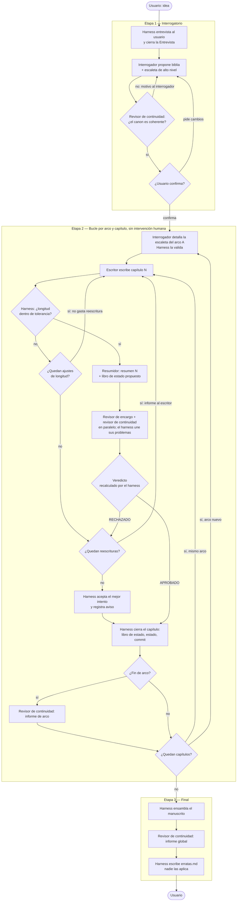

# story-maker — Especificación funcional

Generador agéntico de novelas en castellano sobre **cómo será el mundo tras la revolución de la IA**. El usuario aporta una idea; cinco agentes (interrogador, escritor, resumidor, revisor de encargo y revisor de continuidad) coordinados por un **harness** la convierten en una novela completa.

El proyecto tiene **dos hitos** y este documento vale para los dos:

1. **Hito 1 — Validar el diseño en Claude Code, con el modelo caro.** El harness es una skill orquestadora, cinco subagentes y un conjunto de reglas, todo en Markdown dentro del repositorio; no hay programas propios. Claude ejecuta el flujo en la sesión cuando el usuario lanza `/novela`. Se prueba con historias pequeñas (perfil `relato`, 5 capítulos) para ver qué da el diseño cuando el modelo no es el cuello de botella.
2. **Hito 2 — Llevar ese mismo diseño a un runner propio contra OpenRouter, con un modelo barato,** para generar novelas de 100–200 capítulos sin sesión interactiva. El runner es código (§10); los contratos, artefactos, límites y configuración son **los mismos** que aquí. Lo que se valida en el hito 1 es lo que se porta en el 2.

Vocabulario: **hito** = fase del proyecto (1: Claude Code, 2: runner). **Etapa** = fase del flujo de una novela (1: interrogatorio, 2: bucle por capítulo, 3: final). No se usa la palabra "fase" en este documento para evitar la confusión.

La carpeta de la novela es el único estado, en los dos hitos. Este documento describe **qué** hace el sistema y cómo se comportan sus partes. Dónde está implementada cada pieza: §9. Qué puedes ajustar sin tocar nada del harness: §7 y [`config.json`](../config.json). Qué hay que reimplementar para el hito 2 y qué no: §10.

Historial de cambios y motivos: [CHANGELOG.md](../CHANGELOG.md).

---

## 0. Glosario

Términos que este documento usa con un sentido preciso. Si una palabra aparece aquí, en el resto de la spec, en la skill, en los agentes y en el runner significa exactamente esto.

### 0.1 El proyecto

| Término | Qué es | Para qué sirve |
|---|---|---|
| **Harness** | El orquestador: la pieza que llama a los agentes en orden, guarda el estado, impone los límites y toma todas las decisiones de flujo. En el hito 1 es Claude ejecutando la skill `/novela`; en el hito 2 es un programa | Es lo que convierte cuatro prompts sueltos en un sistema que produce una novela completa sin supervisión y que se puede reanudar |
| **Agente** | Un prompt con un contrato (entradas, salida, debe, no debe) que se ejecuta con un modelo. Hay cinco: interrogador, escritor, resumidor, revisor de encargo y revisor de continuidad | Cada uno hace una sola cosa. Separarlos permite darles distinto modelo, distinto contexto y juzgarlos por separado |
| **Revisor de encargo** | El agente que contesta *¿se escribió lo que se pidió?*: juzga el capítulo contra su entrada de escaleta y contra el tono y la voz de la biblia (criterios 2 y 4 de §5.4) | Separar «lo pedido» de «lo coherente» reduce a la mitad el contexto y los criterios de cada juicio. Con modelos baratos, un agente con dos trabajos hace mal los dos |
| **Revisor de continuidad** | El agente que contesta *¿se contradice algo?*: juzga contra la biblia, el libro de estado y los resúmenes (criterios 1 y 5 de §5.5), y es además el que revisa el canon, el arco y la novela completa | Las contradicciones a distancia son el fallo dominante de las novelas largas y no se ven sin el libro de estado delante. Este agente no hace otra cosa |
| **Observabilidad** | Las trazas de una ejecución en una herramienta externa (§9.3). Nunca es fuente de verdad ni puerta del flujo | Permite ver y comparar ejecuciones sin cruzar ficheros a mano. Si falla, la novela sigue igual |
| **Contrato** | Lo que un agente recibe, lo que devuelve y con qué forma, y lo que tiene prohibido hacer (§5) | Es lo que se porta sin cambios al runner y lo que el harness verifica en cada invocación |
| **Invocación** | Una llamada a un agente con unas entradas concretas, que termina con una salida o con un fallo | Es la unidad que se registra, se reintenta y cuyo volumen se mide |
| **Hito** | Fase del proyecto. Hito 1: validar el diseño en Claude Code con el modelo caro. Hito 2: runner propio contra OpenRouter con un modelo barato | Separa "¿funciona el diseño?" de "¿aguanta el modelo barato?" |
| **Etapa** | Fase del flujo de una novela. Etapa 1: interrogatorio. Etapa 2: bucle por arco y capítulo. Etapa 3: final | Es lo que guarda el Estado para saber dónde reanudar |
| **Runner** | El programa del hito 2 que implementa el harness en código contra OpenRouter | Permite el bucle desatendido de 100–200 capítulos que una sesión de Claude Code no puede sostener |
| **Perfil** | Un conjunto de valores de tamaño de la novela: capítulos, palabras por capítulo. Hay cuatro: `relato`, `novela_corta`, `novela`, `saga` | Cambiar `perfil_activo` es lo que escala el proyecto sin tocar nada más |
| **Escalado (de modelo)** | Subir a un modelo mejor en situaciones concretas: reescritura tras rechazo, último intento, reintento tras fallo, revisiones de arco y global | Gastar el modelo caro solo donde compensa |
| **Modo de prueba** | Ejecución en la que las respuestas de la entrevista salen de un fichero y la escaleta se aprueba sola | Verificar el harness sin una persona delante |
| **Caso de referencia** | Una idea y una entrevista fijas en `pruebas/referencia/` | Comparar configuraciones distintas sobre la misma historia; sin él, cada comparación sería entre historias distintas |

### 0.2 Los artefactos de una novela

Todo lo que se genera vive en `novelas/<slug>/`. Por orden de aparición:

| Término | Qué es | Para qué sirve |
|---|---|---|
| **Idea** | Una o dos frases del usuario con el punto de partida | Es la semilla; se guarda literal para saber qué se pidió |
| **Entrevista** | Las preguntas del harness al usuario y sus respuestas, con lo que eligió él y lo que dejó en "decide tú" | Fija las decisiones que cambian la novela antes de escribir nada. Es la única entrada del interrogador junto a la idea |
| **Biblia** | El documento de referencia de la novela: premisa, tono y estilo, cómo es el mundo post-IA de esta historia y qué reglas rigen, personajes con arco, motivación y voz, el **canon** y las reglas internas que la historia no puede romper | Es la ley. Todos los agentes la reciben y el revisor juzga contra ella. Inmutable tras la aprobación del usuario. El nombre viene del "show bible" de las series de televisión |
| **Canon** | La sección «Cronología y datos fijos» de la biblia: los números que la historia no puede cambiar (año en que arranca, edades con su año de referencia, fechas clave, geometría del escenario). Declarados de forma explícita, no dispersos en la prosa | Una biblia que se contradice a sí misma envenena todos los capítulos y es invisible a la revisión por capítulo, porque el revisor usa la biblia como vara de medir y no mide la vara. Declarado así, comprobarlo es comparar números (§4.1) |
| **Escaleta** | El plan de la novela, capítulo a capítulo, antes de escribirla. Aquí tiene dos niveles: la de **alto nivel** y la de cada **arco** | Da a cada capítulo un objetivo propio y evita que el escritor invente la trama sobre la marcha. El nombre es el término del guion audiovisual para el esquema de escenas |
| **Escaleta de alto nivel** | Tres actos, divididos en arcos. Para cada arco: rango de capítulos, objetivo, sucesos clave que deben ocurrir y hilos que abre y cierra. Total de capítulos | Es lo que aprueba el usuario y lo que queda inmutable. Cabe en una lectura aunque la novela tenga 200 capítulos |
| **Acto** | Cada una de las tres partes clásicas: planteamiento, nudo y desenlace | Estructura mínima que garantiza que la historia arranca, se complica y se resuelve |
| **Arco** | Un tramo de la novela de como mucho `capitulos_por_arco` capítulos (15 por defecto), con objetivo propio dentro de un acto. Una novela de 5 capítulos tiene un solo arco; una de 100, siete o más | Es la unidad de planificación detallada y de revisión intermedia. Permite que el detalle del arco 9 conozca lo que realmente pasó en los arcos 1 a 8 |
| **Escaleta de arco** | Una entrada por capítulo del arco: título provisional, objetivo, sucesos clave, personajes, gancho de cierre y longitud objetivo | Es lo que recibe el escritor para saber qué debe pasar en el capítulo N y qué no debe adelantar. Se genera al llegar al arco |
| **Entrada (de escaleta)** | La ficha de un capítulo concreto dentro de la escaleta de arco | Es la "orden de trabajo" del escritor y la vara de medir del revisor de encargo (criterio 2) |
| **Gancho** | La última nota de un capítulo, prevista en la escaleta, que empuja a leer el siguiente | Mantiene la tensión entre capítulos y da al revisor de encargo algo concreto que comprobar |
| **Hilo** | Una línea argumental, pregunta o promesa que la novela abre y debe cerrar más adelante: un misterio, un conflicto, una relación | El principal síntoma de incoherencia en novelas largas es un hilo abierto que nadie cierra. Por eso se registran con capítulo de origen y cierre previsto |
| **Capítulo** | Unidad de texto de la novela, de la longitud que fija su entrada de escaleta | Es la unidad del bucle: se escribe, se resume, se revisa y se aprueba de uno en uno |
| **Intento** | Cada versión de un capítulo. El intento 1 es el original; los siguientes, reescrituras tras un rechazo. Máximo 3 por defecto | Se conservan todos; el aprobado se marca en el Estado. Permite comparar qué cambió entre versiones |
| **Reescritura** | Un intento nuevo del mismo capítulo, hecho con el informe de rechazo del anterior como entrada | Es el mecanismo de corrección. Cuando se agotan, se acepta el mejor intento |
| **Ajuste de longitud** | Un intento nuevo pedido **solo** porque el anterior se salió del margen de palabras. Tiene presupuesto propio (`limites.ajustes_longitud`) y no gasta reescrituras | Un rechazo por longitud no corrige nada: si consumiera reescritura, se llevaría por delante las correcciones pendientes. Pasó en el capítulo 3 de la ejecución de referencia (§8.5) |
| **Resumen** | Los **hechos** de un capítulo aprobado, en lista y acotados a `memoria.resumen_max_palabras`, más un frontmatter con hilos, fechas de ficción, plazos y objetos | Es la memoria a corto plazo: el escritor recibe los últimos N en vez de los capítulos completos. Lo escribe el resumidor a partir solo del texto. El **estado** no va aquí, va en el libro de estado: un resumen que repite el libro de estado hace crecer la entrada sin tope, y es lo que midió §8.6 |
| **Libro de estado** | La foto de la novela tras el último capítulo aprobado: dónde está cada personaje, qué sabe, en qué estado queda; hilos abiertos y cerrados; objetos, lugares y datos introducidos; reglas del mundo en vigor | Es la memoria a largo plazo. Tiene tamaño constante aunque la novela tenga 200 capítulos, y es contra lo que el revisor de continuidad comprueba las contradicciones (criterio 1) |
| **Hoja de continuidad** | Una ficha corta que **compone el harness** —no un agente— antes de cada invocación del escritor y del revisor de continuidad: fecha de ficción del capítulo anterior y del actual, días transcurridos, edad de cada personaje presente en esa fecha, objetos con quién los tiene y dónde, plazos en curso y hilos que este capítulo debe cerrar | Los datos ya están en el canon, en el libro de estado y en el frontmatter de los resúmenes, pero diluidos en miles de palabras. Siete de las nueve contradicciones de gravedad 1 de la ejecución de referencia eran aritmética de fechas o estado de un objeto (§8.6): cosas que no se juzgan, se calculan. Calcularlas es del harness (regla 4 de CLAUDE.md) |
| **Informe (de capítulo)** | El veredicto sobre un intento, APROBADO o RECHAZADO, con la lista de problemas concretos: dónde, qué, por qué | Es lo que decide si se avanza o se reescribe, y lo que el escritor recibe para corregir |
| **Veredicto** | APROBADO o RECHAZADO. Cada revisor propone el suyo sobre lo que ha visto, pero el que vale es el que **recalcula el harness** sobre la unión de los problemas de los dos, con la regla de §7.5 | Que la decisión no dependa del humor del modelo sino de una regla fija |
| **Gravedad** | Número del 1 al 5 que clasifica cada problema: 1 contradicción con biblia o estado, 2 incumple la escaleta, 3 longitud (lo pone el harness), 4 voz o tono, 5 resumen infiel | Permite que la regla de veredicto sea numérica (§7.5): una contradicción (1) rechaza sola, porque entra en el libro de estado y contamina lo que viene detrás; de las de escaleta (2) y de las leves hacen falta dos |
| **Aceptación por agotamiento** | Cuando se agotan las reescrituras y ningún intento fue aprobado, el harness se queda con el mejor y sigue adelante, dejándolo anotado | Que la novela no se bloquee por un desacuerdo entre agentes. Su frecuencia es una métrica de calidad |
| **Informe de arco** | Revisión de continuidad sobre todos los capítulos de un arco al cerrarse. Informativo | Detecta lo que no se ve capítulo a capítulo y alimenta la escaleta del arco siguiente |
| **Manuscrito** | La novela ensamblada: título, índice y los capítulos aprobados en orden | Es el producto final para el lector |
| **Informe global** | Revisión de continuidad sobre la novela completa al final. Informativo | Detecta hilos sin cerrar y contradicciones lejanas. Nadie reescribe a partir de él; es para el usuario |
| **Erratas** | La lista de arreglos concretos, de una línea cada uno, que el informe global propone sobre capítulos ya cerrados. El harness la escribe; nadie la aplica | Da salida útil a lo que la revisión global encuentra sin tocar nada aprobado. Reescribir un capítulo cerrado invalidaría su resumen y todos los libros de estado posteriores |
| **Estado** | `estado.json`: etapa, arco, capítulo e intento en curso, capítulos aprobados, invocaciones, motivo de parada | Es lo que permite reanudar exactamente donde se quedó. Solo lo escribe el harness |
| **Registro** | `registro.md`: una fila por invocación y por decisión del harness, con modelo y volumen | Trazabilidad: reconstruir qué pasó, y datos para estimar el coste con otro modelo |
| **Informe de cierre** | Resultado de una ejecución: ÉXITO o PARADA, motivo, qué quedó hecho, métricas de calidad y qué hacer para continuar | Que el programa nunca termine en silencio |
| **Parada limpia** | Terminar sin dejar nada a medias marcado como válido, con el Estado actualizado y el motivo explicado | Garantiza que siempre se puede reanudar con el mismo comando |
| **Slug** | Nombre de carpeta de la novela derivado de la idea: minúsculas, sin acentos, con guiones | Identificador estable de la novela en disco y en los commits |

---

## 1. Alcance

### 1.1 Objetivo

A partir de una idea inicial del usuario, producir una novela completa —biblia, escaleta, capítulos aprobados y manuscrito ensamblado— con continuidad interna verificada, sin intervención humana desde la aprobación de la escaleta hasta el final.

### 1.2 Decisiones fijas

| Aspecto | Decisión |
|---|---|
| Género | Fijo: ficción especulativa sobre el mundo posterior a la revolución de la IA |
| Universo | Cada novela inventa su propio mundo post-IA. No existe canon compartido entre novelas |
| Idioma | Castellano, en todo: interrogatorio, artefactos internos y novela |
| Interacción | Hito 1: sesión de Claude Code, comando `/novela`; conversacional durante el interrogatorio, solo progreso después. Hito 2: el runner toma la entrevista de un fichero y corre desatendido (§10) |
| Ejecución | Hito 1: Claude Code con subagentes, sin programas ni librerías propias. Hito 2: runner propio contra OpenRouter que implementa este mismo contrato |
| **Quién escribe en disco** | **Solo el harness.** Los agentes devuelven su salida en el mensaje final y el harness la escribe en la ruta que corresponde. Es igual en los dos hitos; así los contratos de los agentes (§5) se portan sin cambios |
| **Control determinista** | Todo lo que puede decidirse sin un modelo (contar palabras, recalcular el veredicto, validar la forma de una salida, actualizar el estado, elegir el mejor intento) lo hace el harness, nunca un agente. En el hito 1 el harness es Claude, pero usa herramientas mecánicas (`wc`, comparación de campos) para esas tareas |
| Escala | Hito 1: perfil `relato` (5 capítulos). Hito 2: hasta 200 capítulos (perfil `saga`), una sola novela con una sola trama, lo que exige la memoria de §7.6 y la escaleta por arcos de §4.1 |

### 1.3 No objetivos

Quedan explícitamente fuera:

- Formatos de salida distintos de Markdown (sin PDF, DOCX, EPUB ni HTML): **el sistema no escribe ningún artefacto que no sea Markdown o JSON**. El usuario convierte el manuscrito con la herramienta que prefiera. Que el visor (§9.2) pinte ese Markdown en un navegador no es un formato de salida: no produce ficheros.
- Código propio **en el hito 1**: programas, scripts, librerías. En el hito 2 el runner es código, pero ninguna parte del hito 1 lo requiere. Dos excepciones, y ninguna de las dos es una pieza del harness: el hook de inmutabilidad de `.claude/hooks/inmutables.sh`, unas cuarenta líneas de shell que `.claude/settings.json` registra para proteger los artefactos aprobados (§3.1), y el visor de `frontend/` (§9.2), que solo lee. El hito 1 funciona igual sin ninguno de los dos.
- Medición del coste en **dinero en el hito 1**: Claude Code no lo expone. Sí se mide el **volumen** (§6.6). En el hito 2 el runner sí registra el coste real que devuelve OpenRouter y `presupuesto_usd_max` pasa a ser un límite.
- Interfaz web o gráfica **como parte del harness**. Ninguna pieza del sistema depende de una interfaz para funcionar, ni en el hito 1 ni en el 2. Sí se admite un **visor** externo de solo lectura sobre `novelas/` ([frontend/](../frontend/), §9.2): no genera, no decide, no escribe, y borrarlo entero no cambia lo que el harness produce.
- Ilustraciones.
- Otros idiomas.
- Canon o universo compartido entre novelas. Series de novelas encadenadas: `saga` es una novela larga, no varias.
- Uso del modo de prueba (§8.1) como forma normal de generar novelas: existe solo para verificación.
- Volver atrás a un capítulo anterior ya aprobado y regenerar desde ahí.
- Reescritura automática tras las revisiones de arco o global.
- Avisos externos (email, webhook) al terminar o fallar.

---

## 2. Actores

| Actor | Tipo | Responsabilidad |
|---|---|---|
| **Usuario** | Persona | Aporta la idea, responde al interrogatorio, aprueba la escaleta, observa el progreso, decide qué hacer con los informes finales |
| **Harness** | Hito 1: Claude Code ejecutando la skill orquestadora `/novela`. Hito 2: el runner (§10) | Orquesta el flujo, invoca a los agentes, **escribe todos los ficheros**, guarda el estado, impone límites, comprueba longitudes y formatos, reanuda, ensambla |
| **Agente interrogador** | Hito 1: subagente de Claude Code. Hito 2: una llamada al modelo con el mismo prompt | Convierte la idea y la entrevista cerrada en biblia y escaleta de alto nivel; al empezar cada arco, detalla la escaleta de ese arco |
| **Agente escritor** | Ídem | Escribe cada capítulo. Solo el capítulo |
| **Agente resumidor** | Ídem | A partir **únicamente del texto del capítulo** y del libro de estado vigente, produce el resumen del capítulo y la propuesta de libro de estado actualizado |
| **Agente revisor de encargo** | Ídem | Juzga si el capítulo cumple su entrada de escaleta y el tono de la biblia. Nunca edita |
| **Agente revisor de continuidad** | Ídem | Juzga si el capítulo contradice el canon, el libro de estado o los resúmenes, y si el resumen es fiel. Revisa además el canon de la biblia, cada arco al cerrarse y la novela completa. Nunca edita |

Los cinco agentes son **prompts con un contrato** (§5), no piezas de Claude Code: por eso son lo primero que se porta al runner sin cambios. Ningún agente escribe ficheros ni habla con el usuario.

Por qué el resumen no lo escribe el escritor: el escritor resume lo que quiso escribir, no lo que quedó en la página. En la ejecución de validación 0.4.0 el resumen del capítulo 1 afirmaba un hecho que el texto no mostraba. A 200 capítulos los resúmenes y el libro de estado son la única memoria del sistema; un error ahí se propaga a todo lo que viene después.

Por qué la revisión está partida en dos agentes: son dos preguntas distintas —*¿está lo que se pidió?* y *¿se contradice algo?*— que necesitan entradas distintas y se estorban en un mismo prompt. En la ejecución de referencia (§8.5) el revisor único recibía 19.000 palabras para juzgar un capítulo de 1.700 con cinco criterios a la vez, y se le escaparon cuatro contradicciones a distancia que la revisión global sí vio. Partido, cada agente recibe la mitad del contexto y tiene la mitad de los criterios; el harness une sus dos listas de problemas y aplica la regla de veredicto de §7.5 sin cambiarla. En el hito 1 se invocan en paralelo.

---

## 3. Artefactos

Todos los artefactos de una novela viven en **una carpeta propia de esa novela**, `novelas/<slug>/`. Son el único estado del sistema: no hay nada en memoria que no esté también en disco tras cada paso completado.

| Artefacto | Fichero | Contenido | Lo produce | Lo leen |
|---|---|---|---|---|
| **Idea** | `idea.md` | Texto libre inicial del usuario | Harness (al arrancar) | Todos |
| **Configuración** | `config.json` | Copia congelada de la configuración raíz con el perfil ya resuelto y los valores efectivos de esta novela (§7) | Harness (al crear la novela) | Harness, interrogador |
| **Entrevista** | `entrevista.md` | Todas las decisiones de la etapa 1 en forma pregunta → respuesta, marcando cuáles eligió el usuario y cuáles quedaron en "decide tú". Cerrada antes de lanzar al interrogador | Harness (tras la entrevista) | Interrogador |
| **Biblia** | `biblia.md` | Premisa; tono y estilo; el mundo post-IA de esta novela (qué pasó, qué reglas rigen, qué ha cambiado); personajes con arco, motivación y voz; reglas internas que la historia no puede romper | Interrogador | Todos |
| **Escaleta (alto nivel)** | `escaleta.md` | Tres actos (planteamiento, nudo, desenlace). **Arcos**: cada uno con rango de capítulos, objetivo narrativo, sucesos clave que deben ocurrir en él, hilos que abre y cierra. Número total de capítulos. Con pocos capítulos (§4.1) hay un único arco que cubre toda la novela | Interrogador | Todos |
| **Escaleta de arco A** | `arcos/arco-AA.md` | Una entrada por capítulo del arco: título provisional, objetivo narrativo, sucesos clave, personajes presentes, gancho de cierre, **longitud objetivo en palabras** | Interrogador (al empezar el arco) | Todos |
| **Capítulo N, intento K** | `capitulos/NN/intento-K.md` | Texto del capítulo. Se conservan todos los intentos; el aprobado se marca en el Estado | Escritor | Todos |
| **Resumen N, intento K** | `capitulos/NN/resumen-K.md` | Hechos ocurridos; cambios de estado de cada personaje; hilos abiertos y cerrados; objetos, lugares o datos introducidos que condicionan el futuro | Resumidor | Todos |
| **Libro de estado propuesto N, K** | `capitulos/NN/libro-estado-K.md` | El libro de estado tal como quedaría si este intento se aprueba | Resumidor | Harness |
| **Informe N, intento K** | `capitulos/NN/informe-K.md` | Veredicto APROBADO / RECHAZADO y lista de problemas concretos (§5.4, §5.5). Uno por intento, con la **unión** de los problemas de los dos revisores. Los rechazos por longitud los genera el harness sin invocar a nadie | Harness, a partir de los dos JSON de los revisores o de su propia comprobación | Todos |
| **Libro de estado** | `libro-estado.md` | **La memoria de la novela.** Personajes: dónde están, qué saben, en qué estado físico y emocional quedan, qué relaciones han cambiado. Hilos abiertos: capítulo de origen y capítulo o arco previsto de cierre según la escaleta. Hilos cerrados. Objetos, lugares y datos introducidos. Reglas del mundo en vigor y excepciones establecidas. Siempre refleja el último capítulo aprobado | Harness, copiando `libro-estado-K.md` del intento aprobado | Escritor, resumidor, revisor |
| **Informe de arco A** | `arcos/informe-arco-AA.md` | Revisión de continuidad sobre los capítulos del arco completo. Informativo | Harness, a partir del JSON del revisor de continuidad | Usuario |
| **Estado** | `estado.json` | Etapa actual; arco y capítulo en curso; intento en curso; capítulos aprobados con su intento y si fue por agotamiento; invocaciones realizadas; motivo de parada si la hubo | Solo el harness | Harness |
| **Registro (log)** | `registro.md` | Cada invocación a un agente: quién, cuándo, modelo, con qué entradas, volumen (§6.6), resultado; cada decisión del harness | Solo el harness | Usuario |
| **Manuscrito** | `manuscrito.md` | Novela ensamblada en Markdown: título, índice, capítulos aprobados en orden | Harness (al final) | Usuario |
| **Informe global** | `informe-global.md` | Resultado de la revisión final sobre la novela completa (§4.3). Informativo | Harness, a partir del JSON del revisor de continuidad | Usuario |
| **Erratas** | `erratas.md` | Los problemas del informe global que se arreglan cambiando una línea, con su ruta, la cita exacta y el cambio propuesto. El harness lo escribe; **nadie lo aplica** (§4.3) | Harness | Usuario |
| **Informe de cierre** | `informe-cierre.md` | Resultado de la última ejecución: ÉXITO o PARADA, motivo, qué quedó completado, métricas de calidad (§8.3), acción para continuar (§6.5) | Solo el harness | Usuario |

### 3.1 Reglas de escritura

- **Solo el harness escribe.** Cada agente devuelve su salida en el mensaje final con la forma que fija su contrato (§5). El harness valida la forma y la escribe en la ruta que le corresponde. Un agente no tiene, ni necesita, herramientas de escritura. En el hito 1 los subagentes se definen con `tools: Read, Glob, Grep`.
- **Nada aprobado se modifica**: ni la biblia ni la escaleta de alto nivel tras la aprobación del usuario, ni la escaleta de un arco tras validarla el harness, ni un capítulo tras el veredicto APROBADO (o la aceptación por agotamiento), ni el libro de estado salvo por el harness al cerrar un capítulo. El harness crea cada uno de esos ficheros con una escritura completa, una sola vez (o una por versión, en la biblia y la escaleta antes de aprobarse); nunca los edita en sitio. En el hito 1 lo impone un hook `PreToolUse` sobre `Edit` y `Write` ([`.claude/hooks/inmutables.sh`](../.claude/hooks/inmutables.sh), registrado en `.claude/settings.json`), que cubre `biblia.md`, `escaleta.md`, `arco-*.md`, `informe-arco-*.md`, `intento-*.md`, `libro-estado.md`, `libro-estado-*.md` y `manuscrito.md` dentro de `novelas/`. Bloquea **siempre** `Edit`, porque todos se sustituyen enteros y ninguno se edita nunca en sitio. Bloquea `Write` solo cuando el fichero **ya existe**, que es lo que distingue al harness creando el artefacto —legítimo— del harness sobrescribiendo lo aprobado. `libro-estado.md` es la excepción declarada: su `Write` siempre pasa, porque el harness lo sustituye entero al cerrar cada capítulo. El hook falla en abierto: si no logra leer la ruta de su entrada, deja pasar, porque uno que bloquea sin entender su entrada pararía el bucle sin motivo. El criterio 6 de §8.2 sigue comprobando la inmutabilidad con git a posteriori: el hook previene, el criterio demuestra. En el hito 2 la inmutabilidad es código.
- El **Estado**, el **Registro** y el **Libro de estado** son exclusivos del harness. Un agente nunca decide qué capítulo va ahora ni si algo está aprobado.
- **Escritura atómica** (hito 2): cada fichero se escribe en un temporal y se renombra, para que una interrupción no deje un artefacto a medias con nombre definitivo.

---

## 4. Flujo



### 4.1 Etapa 1 — Interrogatorio

1. El harness crea la carpeta de la novela y guarda la idea.
2. **Entrevista.** El harness pregunta al usuario en **rondas sucesivas, sin límite fijo** (en Claude Code, con la skill `grilling`; en el runner, la entrevista llega ya cerrada en un fichero, §10.2). Pregunta lo que cambia la novela: protagonista y antagonismo, qué versión del mundo post-IA, tono, punto de vista, tipo de final, temas que tocar o evitar, extensión deseada. El resultado se escribe en la **Entrevista**, marcando qué eligió el usuario y qué dejó en "decide tú".
3. **Propuesta.** El harness lanza al interrogador con la idea, la entrevista y los límites. El interrogador devuelve la biblia y la escaleta de alto nivel y **propone el cierre** con un resumen. El harness las escribe y valida la escaleta contra los límites (abajo).
4. **Validación del canon.** Antes de enseñarle nada al usuario, el harness lanza al revisor de continuidad en modo `canon` (§5.5) sobre la biblia y la escaleta de alto nivel. Busca una sola cosa: que la biblia **no se contradiga a sí misma**. Si devuelve problemas, se los pasa al interrogador con el motivo, hasta `limites.escaleta_rechazos_max` veces; después, se le presentan al usuario junto con la propuesta en vez de parar, porque quien aprueba la biblia es él. El harness presenta entonces la propuesta.
5. El usuario **confirma** o **pide cambios**. Si pide cambios, el harness los pasa al interrogador, que corrige solo eso y vuelve a proponer (y el canon se vuelve a validar).
6. Con la confirmación, el harness marca la biblia y la escaleta de alto nivel como aprobadas e inmutables, y pasa a la etapa 2.

Los agentes **no hablan con el usuario**: toda la conversación pasa por el harness. Así la etapa 1 es la misma en Claude Code y en el runner; solo cambia de dónde salen las respuestas.

**Escaleta por arcos.** Ningún modelo produce de una vez 200 entradas de capítulo con objetivo, sucesos y gancho propios, y tampoco puede revisar lo que produjo. Por eso la escaleta tiene dos niveles:

- La **escaleta de alto nivel** divide la novela en arcos de como mucho `formato.capitulos_por_arco` capítulos (15 por defecto). Es lo que aprueba el usuario y lo que queda inmutable.
- La **escaleta de cada arco** se genera al llegar a él (§4.2, "Inicio de arco"), con la biblia, la escaleta de alto nivel, el libro de estado y el informe del arco anterior como entradas. Así el detalle del arco 9 conoce lo que realmente pasó en los arcos 1–8, no solo lo que estaba previsto.

Si el total de capítulos no supera `capitulos_por_arco`, hay **un solo arco** y el interrogador devuelve su escaleta detallada en la misma propuesta que la de alto nivel. El perfil `relato` funciona así; el mecanismo es el mismo, degradado.

**El canon, explícito.** La biblia lleva una sección obligatoria, **«Cronología y datos fijos»**, con los números que la historia no puede cambiar: año en que arranca la novela; edad de cada personaje con su año de referencia y, si procede, el año en que empezó en lo suyo; fechas concretas que la trama menciona; geometría del escenario (plantas, paradas, distancias) cuando la trama la use. No es documentación: es lo que hace comprobable la coherencia interna. Con los datos dispersos en la prosa, una biblia puede afirmar que un personaje tiene 52 años y 26 de oficio —lo que sitúa su inicio hacia 2023— y a la vez que recibió una llave en 2011, y ningún revisor de capítulo lo verá, porque para él la biblia es la ley. Declarados en una tabla, comprobarlo es restar. Con un modelo barato importa el doble: el escritor no infiere el canon leyendo la biblia entera, lo consulta.

Regla derivada, que la biblia debe recoger: **si una fecha concreta no está en el canon, el texto no la ata a un día de la semana.** Calcular en qué día cae una fecha no es algo que un modelo haga con fiabilidad, y es una contradicción que la revisión global sí caza.

Restricciones que el interrogador debe respetar, tomadas del perfil activo de `config.json` (§7.1): número de capítulos entre `capitulos_min` y `capitulos_max`; longitud objetivo de cada capítulo entre `formato.palabras_min_capitulo` y `palabras_max_capitulo`; los arcos cubren todos los capítulos, sin huecos ni solapes; cada arco cabe en `capitulos_por_arco`. Si la propuesta viola un límite, el harness la devuelve al interrogador con el motivo, hasta `limites.escaleta_rechazos_max` veces, antes de presentársela al usuario o, en un arco, antes de parar.

### 4.2 Etapa 2 — Bucle por arco y capítulo

**Inicio de arco A.** Si `arcos/arco-AA.md` no existe, el harness lanza al interrogador en modo arco con: biblia, escaleta de alto nivel (con el arco A destacado), libro de estado, informe del arco anterior si lo hay. El interrogador devuelve la escaleta del arco; el harness comprueba que tiene exactamente los capítulos del rango, que las longitudes están en límites y que los sucesos clave del arco de alto nivel aparecen asignados a algún capítulo. Si no, la devuelve con el motivo, hasta `escaleta_rechazos_max`; después, parada limpia. Validada, se escribe y se commitea. No hay confirmación del usuario: la etapa 2 corre sin intervención humana.

Para cada capítulo N del arco, en orden:

**Hoja de continuidad (harness, sin modelo).** Antes de invocar al escritor, el harness compone una ficha de como mucho `memoria.hoja_continuidad_max_palabras` (200 por defecto) con campos fijos:

- **fecha de ficción** del final del capítulo N−1 y la que la escaleta fija para N, y los **días transcurridos** entre las dos;
- **edad de cada personaje** que aparece en la entrada N, calculada a la fecha de N a partir del canon (§4.1);
- **objetos** que la trama usa, con quién los tiene y dónde, tomados del libro de estado;
- **plazos en curso** con su vencimiento (un fraguado de 36 horas, un plazo de tres días, una cita);
- **hilos que N debe cerrar**, copiados de la escaleta.

Todo sale de campos que ya existen —el canon de la biblia, el libro de estado y el frontmatter de los resúmenes— y el harness solo copia y resta. **No interviene ningún modelo**: es aritmética, igual que el recuento de palabras (regla 4 de CLAUDE.md), y por eso se porta al runner sin cambios. Si un campo no se puede calcular porque falta el dato, la hoja dice `desconocido`; no se inventa ni se le pide a un agente.

Motivo, medido en §8.6: siete de las nueve contradicciones de gravedad 1 de la ejecución de referencia eran aritmética de fechas, edades y plazos, o el estado de un objeto. El escritor tenía esa información delante —en el libro de estado y en los resúmenes— y aun así falló, porque estaba diluida en 17.000 palabras. Un dato calculado y puesto arriba no es lo mismo que un dato deducible.

La misma hoja se le pasa al revisor de continuidad, para que los dos juzguen contra los mismos números.

**Escritura.** El escritor recibe:
- la **hoja de continuidad**,
- la biblia completa,
- la escaleta de alto nivel y la escaleta del arco A (con la entrada de N destacada),
- el **libro de estado**,
- los resúmenes de los últimos `memoria.resumenes_completos_ultimos` capítulos aprobados,
- el **texto íntegro del capítulo N−1** aprobado si `memoria.capitulo_anterior_integro` (para mantener voz y enlace),
- en caso de reescritura, el informe de rechazo del intento anterior y el texto rechazado.

Devuelve el texto del capítulo. El harness lo escribe en `intento-K.md`.

**Comprobación de longitud (harness, sin modelo).** El harness cuenta las palabras del cuerpo (`wc -w` o equivalente). Si la desviación respecto a la longitud objetivo supera `formato.tolerancia_longitud`, el harness genera él mismo el informe K con un único problema de gravedad 3 (palabras contadas, objetivo, margen) y trata el intento como RECHAZADO **sin invocar al resumidor ni a los revisores**.

Un rechazo por longitud **no consume reescritura**: consume un **ajuste de longitud**, con presupuesto propio (`limites.ajustes_longitud`, 2 por defecto). El número de intento K sigue avanzando —es el nombre del fichero—, pero el presupuesto de corrección de contenido no se toca, y el informe de contenido que estuviera pendiente de corregir se vuelve a pasar al escritor junto con el de longitud. Agotados los ajustes, un rechazo por longitud vuelve a consumir reescritura como cualquier otro, de modo que el bucle siempre termina.

Motivo: un rechazo por longitud no corrige nada. En la ejecución de referencia (§8.5) el capítulo 3 perdió sus dos reescrituras por pasarse del margen por 79 y 140 palabras, y con ellas se perdió la corrección de la contradicción de cronología que el revisor había señalado: el texto que quedó cerrado fue el intento 1, con el problema dentro. El patrón es estructural, no mala suerte: cada reescritura añade texto para corregir y el margen no da de sí.

El prompt del escritor lleva **siempre** —en el primer intento y en cada reescritura— el recuento de palabras del intento anterior si lo hay, y el suelo y el techo **en palabras absolutas**, no en porcentaje, más la instrucción de que corregir no puede alargar: si añade en un sitio, corta en otro. Un modelo pequeño maneja mucho peor «±20 %» que «entre 1.200 y 1.800».

**Resumen.** El resumidor recibe **solo** el texto del capítulo, el libro de estado vigente y la plantilla de resumen. No recibe la escaleta ni la biblia: su trabajo es decir qué hay en la página, no qué debía haber. Devuelve el resumen N y el libro de estado tal como quedaría si el capítulo se aprueba. El harness escribe ambos como `resumen-K.md` y `libro-estado-K.md`.

**El harness cuenta las palabras del resumen** igual que las del capítulo. Si se pasa de `memoria.resumen_max_palabras`, reinvoca al resumidor una sola vez con el recuento y el tope en palabras absolutas; si el segundo también se pasa, acepta el que salga y lo anota como aviso. No es un rechazo del capítulo: el texto no tiene la culpa del tamaño de su resumen, y un bucle de reintentos por esto costaría más de lo que ahorra.

Motivo: el resumen es el **único término de la entrada que crece sin tope**. En la ejecución de referencia pesaba 1.785 palabras de media para capítulos de 1.629 —el 110 % del capítulo que resumía— porque repetía el estado que ya lleva el libro de estado, y suponía el 44 % de lo que leía el escritor en el capítulo 5. Acotado a 350 palabras, la entrada por invocación del escritor baja un 36 % a 5 capítulos y un 71 % a 30 (§8.6).

**Revisión.** Dos agentes, cada uno con su pregunta, sus criterios y sus entradas; en el hito 1 se invocan **en paralelo**, en el hito 2 en dos llamadas concurrentes:

- **Revisor de encargo** (§5.4) — *¿está escrito lo que se pidió?* Recibe el capítulo N, la escaleta de alto nivel, la escaleta del arco (la entrada N y las posteriores, para detectar adelantos) y la biblia. Criterios 2 y 4.
- **Revisor de continuidad** (§5.5) — *¿se contradice algo?* Recibe el capítulo N, su resumen, la biblia, el libro de estado vigente y los mismos resúmenes que recibió el escritor. Criterios 1 y 5.

Cada uno devuelve su JSON. El harness valida las dos formas, **une** las dos listas de `problemas` y de `observaciones`, **recalcula el veredicto** sobre la unión con la regla de §7.5 y escribe un único `informe-K.md` con el veredicto recalculado y el origen de cada problema. Si el veredicto propuesto por alguno de los dos no coincide con el recalculado, lo registra como `discrepancia_veredicto`. Si los dos señalan el mismo problema, el harness conserva el de mayor gravedad y anota el otro como duplicado en el registro; los criterios son disjuntos, así que debería ser raro.

Que un revisor falle técnicamente no invalida al otro: el harness reintenta solo el que falló (§6.5).

**Decisión del harness.**
- APROBADO → copia `libro-estado-K.md` sobre `libro-estado.md`, marca el intento como aprobado en el Estado, commitea, avanza a N+1.
- RECHAZADO con reescrituras disponibles → lanza al escritor con el informe. Máximo `limites.reescrituras_max` reescrituras (2 por defecto: 3 intentos en total).
- RECHAZADO sin reescrituras disponibles → **acepta el mejor intento**, no el último (regla abajo). Registra el aviso con el informe adjunto en el log y en el Estado, adopta su libro de estado, avanza a N+1. La novela no se bloquea por un desacuerdo entre agentes.

**Mejor intento.** El harness elige entre los intentos del capítulo, leyendo sus informes y sus resúmenes, por este orden:

1. Descarta los rechazados por longitud (`origen: harness`) si alguno llegó a los revisores. Si todos fueron rechazados por longitud, gana el más cercano a la longitud objetivo y aquí acaba.
2. **Cumple los cierres que la escaleta manda para este capítulo**: gana el intento cuyo `resumen-K.md` registra en `hilos_cerrados` todos los hilos que la escaleta de alto nivel y la del arco marcan como cerrados en N. A igualdad, el que cierre más de ellos.
3. Menos problemas de gravedad 1–2.
4. Menos problemas en total.
5. El más reciente.

El paso 2 es el que decide, y va **antes** que el recuento de problemas. Motivo: contar problemas premia sistemáticamente al texto que hace menos. Un capítulo que omite un suceso obligatorio genera un problema; uno que lo incluye y falla en un detalle genera dos, y gana el que lo omitió. En la ejecución de referencia (§8.5) eso cerró el capítulo 5 con un intento que dejaba abierto el hilo que la escaleta mandaba cerrar, descartando otro que lo cerraba, tenía los cinco sucesos de su entrada y además acertaba la fecha que el intento ganador erraba. Un hilo sin cerrar en el último capítulo es irreparable y cuenta en las métricas; una contradicción de detalle es una línea que se arregla desde `erratas.md` (§4.3).

El paso 2 lo calcula el harness comparando campos, no un modelo: `hilos_cierra` de la escaleta contra `hilos_cerrados` del frontmatter del resumen.

Cuando el desempate se resuelve en el paso 4 o el 5 —es decir, sin una razón fuerte—, el harness lo anota como aviso en el Estado y en el informe de cierre: *«mejor intento elegido sin criterio fuerte»*. No pregunta al usuario. La etapa 2 corre sin intervención humana (es lo que hace posible el bucle desatendido del hito 2), así que un empate se resuelve siempre con la regla y se deja por escrito para revisarlo después.

**Fin de arco.** Tras cerrar el último capítulo del arco, el revisor de continuidad recibe el texto de todos los capítulos del arco, la escaleta del arco, la escaleta de alto nivel, la biblia y el libro de estado, y devuelve el **informe de arco**: hilos que el arco debía cerrar y no cerró, contradicciones entre capítulos del arco, personajes desaparecidos, cambios de reglas. Es informativo: nada se reescribe. Se escribe en `arcos/informe-arco-AA.md` y alimenta la escaleta del arco siguiente, que puede compensar lo que faltó. Con un solo arco, este informe y el global de §4.3 son la misma pasada y se hace una sola vez.

**Progreso visible.** El usuario ve una línea por evento: arco detallado, capítulo N escrito, rechazado por longitud, rechazado (motivo resumido), aprobado, aceptado por agotamiento, informe de arco. Puede interrumpir cuando quiera; el estado en disco permite reanudar (§6.2).

### 4.3 Etapa 3 — Final

1. El harness ensambla el **manuscrito** con los capítulos aprobados.
2. **Revisión global.** Si el manuscrito no supera `limites.revision_global_max_palabras` (60.000 por defecto), el revisor de continuidad hace **una única pasada sobre la novela completa** buscando lo que no puede verse capítulo a capítulo ni arco a arco: hilos prometidos y nunca cerrados, contradicciones entre capítulos lejanos, personajes que desaparecen sin explicación, cambios de reglas del mundo. Si lo supera, el manuscrito no cabe en ningún contexto: la pasada global se hace sobre la **biblia, la escaleta de alto nivel, el libro de estado final, todos los resúmenes y todos los informes de arco**, y el informe global lo dice. Emite el **informe global**. No reescribe nada.
3. **Erratas.** De los problemas del informe global, el harness separa los que se arreglan cambiando una línea —una fecha, un número, una frase que contradice un hecho— y los escribe en `erratas.md`: capítulo y ruta, la cita exacta tal como está en el manuscrito, el cambio propuesto y contra qué choca. Un problema que exija reescribir una escena no es una errata: se queda solo en el informe global.

   **El harness no aplica ninguna.** Reescribir un capítulo cerrado invalidaría su resumen y, en cascada, todos los libros de estado posteriores: el libro de estado dejaría de ser cierto, que es lo único que sostiene una novela de 200 capítulos. Por eso §1.3 descarta la reescritura automática desde las revisiones de arco o global, y `erratas.md` es la alternativa: el valor de lo que la pasada global encuentra, sin tocar nada aprobado. Qué hacer con ellas es del usuario.

4. El harness calcula las **métricas de calidad** (§8.3) y emite el **informe de cierre** (§6.5) con la ruta del manuscrito, del informe global y de las erratas. Qué hacer con los informes es decisión del usuario, fuera del alcance del sistema.

---

## 5. Contratos de los agentes

Reglas comunes a los cinco: reciben exactamente las entradas de su contrato; devuelven su salida **en el mensaje final**, con la forma que fija el contrato, sin texto antes ni después; no escriben ficheros; no hablan con el usuario; no deciden nada del flujo. Un mensaje final que no tenga la forma esperada es un **incumplimiento de contrato** (§6.5) y el harness repite la invocación indicando qué faltó.

Forma de los bloques de documento (interrogador, escritor, resumidor): cada documento va entre una línea `=== ARCHIVO: <ruta relativa a la carpeta de la novela> ===` y una línea `=== FIN ===`. El harness extrae cada bloque y lo escribe en su ruta. Los dos revisores no usan bloques: devuelven solo JSON, con la misma forma (§5.6).

En el hito 1 los cinco se definen en `.claude/agents/` con `tools: Read, Glob, Grep` (sin escritura), `maxTurns` igual a `limites.turnos_por_invocacion`, `model` igual a `modelos.<agente>` y **sin** el campo `memory`: los agentes son amnésicos entre novelas, porque una memoria persistente crearía el canon compartido que §1.2 prohíbe.

`maxTurns` y `model` son **estáticos**: el frontmatter no lee `config.json`, así que el valor está escrito dos veces y `comprobar_entorno` comprueba al arrancar que ambas copias coinciden (§6.2). El modelo que manda en cada llamada es el que el harness pasa en el parámetro `model` de la herramienta `Agent` (`invocar.md`), que es lo que permite el escalado de §7.3; el del frontmatter es la red de seguridad para que una llamada a la que se le olvide el parámetro caiga en el modelo declarado y no en el de la sesión.

### 5.1 Agente interrogador

| | |
|---|---|
| **Entrada (propuesta)** | Idea del usuario; Entrevista cerrada; límites de tamaño de la configuración; en una segunda vuelta, el motivo (fuera de límites o cambios pedidos por el usuario) |
| **Entrada (arco)** | Biblia; escaleta de alto nivel con el arco destacado; libro de estado; informe del arco anterior si existe; límites; en una segunda vuelta, el motivo |
| **Salida (propuesta)** | Biblia, escaleta de alto nivel y, si hay un solo arco, su escaleta detallada; propuesta de cierre. Cada documento en un bloque delimitado con la ruta destino como etiqueta |
| **Salida (arco)** | Escaleta del arco, en un bloque |
| **Debe** | Respetar al pie de la letra lo que el usuario eligió en la entrevista; decidir lo que quedó en "decide tú" y anotarlo como decisión propia en la biblia; escribir la sección **«Cronología y datos fijos»** de la biblia (§4.1) con el año de arranque, la edad de cada personaje con su año de referencia, las fechas que la trama menciona y la geometría del escenario, y comprobar que esos números no se contradicen entre sí ni con el resto de la biblia; fijar número de capítulos, arcos y longitudes dentro de los límites; garantizar que la escaleta cubre los tres actos y que cada capítulo tiene un objetivo narrativo propio; en modo arco, asignar a capítulos concretos todos los sucesos clave del arco y recoger lo que el informe del arco anterior dejó pendiente; en una segunda vuelta, corregir solo lo indicado |
| **No debe** | Escribir prosa de la novela; preguntar nada (la entrevista ya está cerrada); modificar la biblia o la escaleta de alto nivel en modo arco; marcar nada como aprobado |

### 5.2 Agente escritor

| | |
|---|---|
| **Entrada** | **Hoja de continuidad** (§4.2, la primera de todas); biblia; escaleta de alto nivel; escaleta del arco con la entrada N destacada; libro de estado; últimos resúmenes según `memoria`; capítulo anterior íntegro si `memoria` lo indica; en reescritura, informe y texto rechazado |
| **Salida** | Texto del capítulo N, en un único bloque, con título |
| **Debe** | Cumplir el objetivo, los sucesos y el gancho de la entrada N; **tomar de la hoja de continuidad todas las fechas, edades, plazos y poseedores de objetos, sin recalcularlos ni inferirlos del resto del contexto**; respetar biblia, libro de estado y resúmenes; ajustarse a la longitud objetivo dentro de la tolerancia; mantener la voz del capítulo anterior; en reescritura, corregir cada problema del informe sin introducir otros |
| **No debe** | Producir resumen ni notas; adelantar sucesos asignados a capítulos posteriores; resolver hilos que la escaleta deja abiertos para más adelante; contradecir el libro de estado |

### 5.3 Agente resumidor

| | |
|---|---|
| **Entrada** | Texto del capítulo N (intento K); libro de estado vigente; plantillas de resumen y de libro de estado |
| **Salida** | Dos bloques: el resumen N —frontmatter con `hilos_abiertos`, `hilos_cerrados`, `fecha_ficcion_inicio`, `fecha_ficcion_fin`, `plazos` y `objetos` (objeto, quién lo tiene, dónde), y cuerpo con los hechos, dentro de `memoria.resumen_max_palabras`— y el libro de estado actualizado completo |
| **Debe** | Registrar **solo lo que está en el texto**. El reparto entre los dos bloques es estricto: en el **resumen**, los hechos del capítulo y los campos del frontmatter, nada más; en el **libro de estado**, todo lo demás —estado de cada personaje, objetos, lugares, datos y reglas—, actualizando las entradas afectadas y conservando intactas las otras, marcando el capítulo de origen de cada hilo abierto y moviendo a cerrados lo que el texto cierra. Si el texto no dice la fecha de ficción, dejar el campo vacío en vez de deducirla |
| **No debe** | Inferir lo que el autor "quiso decir"; añadir hechos que el texto no muestra; juzgar la calidad; **repetir en el resumen el contenido del libro de estado** (es lo que hacía crecer la entrada sin tope, §8.6); pasarse de `memoria.resumen_max_palabras`; consultar la escaleta ni la biblia (no las recibe, para que no rellene huecos con lo previsto en lugar de con lo escrito) |

Los criterios de gravedad están repartidos entre los dos revisores y **no se solapan**. La numeración es la de siempre (§0.2, *Gravedad*): 1 contradicción, 2 incumple la escaleta, 3 longitud (solo el harness), 4 voz o tono, 5 resumen infiel.

### 5.4 Agente revisor de encargo

Contesta una sola pregunta: **¿está escrito lo que se pidió?**

| | |
|---|---|
| **Entrada (por capítulo)** | Capítulo N; escaleta de alto nivel; escaleta del arco (la entrada N y las posteriores, para detectar adelantos); biblia |
| **Salida** | Informe en JSON con la forma de §5.6 |
| **Debe** | Juzgar exclusivamente contra dos criterios: **(2)** no cumple la entrada N de la escaleta —falta un suceso clave, no logra el objetivo, el gancho no es el previsto— o **adelanta** sucesos de capítulos posteriores o resuelve hilos que debían quedar abiertos; **(4)** ruptura de voz, punto de vista o tono respecto a la biblia. Recorrer la entrada N suceso por suceso y decir de cada uno si está o no. Cada problema debe ser **concreto y accionable** (dónde, qué, por qué) |
| **No debe** | Editar el texto; juzgar contradicciones con el libro de estado o con capítulos anteriores (no los recibe: son del revisor de continuidad); **contar palabras ni juzgar la longitud**; rechazar por gusto sin señalar un criterio; añadir criterios propios |

Solo tiene modo capítulo: al cerrar un arco y al terminar la novela no queda nada que comprobar contra una entrada de escaleta que no se haya comprobado ya.

### 5.5 Agente revisor de continuidad

Contesta una sola pregunta: **¿se contradice algo?** Es el agente que vigila la coherencia a las cuatro escalas: la biblia consigo misma, el capítulo, el arco y la novela.

| | |
|---|---|
| **Entrada (canon)** | Biblia y escaleta de alto nivel, antes de que el usuario las apruebe (§4.1) |
| **Entrada (por capítulo)** | **Hoja de continuidad**; capítulo N; resumen N; biblia; libro de estado vigente; últimos resúmenes según `memoria` |
| **Entrada (arco)** | Texto de los capítulos del arco; escaleta del arco y de alto nivel; biblia; libro de estado |
| **Entrada (global)** | Manuscrito completo, o si no cabe (§4.3) biblia, escaleta de alto nivel, libro de estado final, todos los resúmenes y todos los informes de arco |
| **Salida** | Informe en JSON con la forma de §5.6 |
| **Debe** | Juzgar exclusivamente contra dos criterios: **(1)** contradice la biblia, su canon, el libro de estado o los resúmenes previos —regla del mundo rota, personaje que sabe, tiene o está donde no debería, hecho incompatible con un capítulo anterior—; **(5)** el resumen no refleja el capítulo. En modo `canon`, comprobar que los números de «Cronología y datos fijos» cuadran entre sí (edades contra años, fechas contra la línea temporal, geometría contra lo que la trama necesita) y con el resto de la biblia y de la escaleta. Contrastar cada afirmación absoluta del texto («nadie», «siempre», «nunca») con el libro de estado: es donde se esconden las contradicciones a distancia |
| **No debe** | Editar el texto; juzgar si el capítulo cumple su entrada de escaleta ni si el tono es el previsto (eso es del revisor de encargo); **contar palabras**; rechazar por gusto sin señalar un criterio |

En modo `canon` sus problemas son de gravedad 1 y van contra la biblia, no contra un capítulo: el `donde` es la sección de la biblia o la entrada de la escaleta. En modo arco y global el informe es **informativo**: nadie reescribe a partir de él (§4.2, §4.3).

### 5.6 Forma del informe de los revisores

La misma para los dos agentes y en todos sus modos:

```json
{
  "veredicto": "RECHAZADO",
  "problemas": [
    {
      "gravedad": 1,
      "donde": "párrafo 14, escena del taller",
      "que": "Marta usa el implante que perdió en el capítulo 2",
      "por_que": "libro de estado, Personajes › Marta: 'sin implante desde el cap. 2 (redada)'"
    }
  ],
  "observaciones": ["El diálogo del final se alarga; no obliga a reescribir"]
}
```

`problemas` puede ser una lista vacía. `gravedad` es un entero en {1, 2, 4, 5}, y **cada revisor solo puede emitir las suyas**: el de encargo, 2 y 4; el de continuidad, 1 y 5. Una gravedad que no le toca es un incumplimiento de contrato. El harness rechaza como incumplimiento cualquier salida que no sea JSON válido con exactamente esas tres claves. Se usa JSON y no YAML porque los modelos baratos rompen el YAML con más facilidad y porque en el hito 2 se valida con un esquema y, donde el modelo lo admita, se pide salida estructurada.

El veredicto de cada revisor es una **propuesta sobre lo que él ha visto**; el que vale es el que recalcula el harness sobre la **unión** de los problemas de los dos (§4.2). Un informe es **RECHAZADO** si esa unión tiene al menos `veredicto.rechaza_con_gravedad_1` problemas de gravedad 1, o al menos `veredicto.rechaza_con_gravedad_2` de gravedad 2, o al menos `veredicto.rechaza_con_leves` de gravedad 3–5 (los de gravedad 3 solo los genera el harness). En otro caso es **APROBADO**, con observaciones menores que no obligan a reescribir.

---

## 6. Contrato del harness

### 6.1 Responsabilidades

- Crear y gestionar la carpeta de la novela.
- Invocar a cada agente con exactamente las entradas de su contrato; ni más (ahorro de contexto) ni menos.
- **Esperar la salida de cada agente antes de seguir.** El bucle es secuencial: el harness no puede decidir nada sobre un capítulo hasta tener el texto delante. La única concurrencia permitida es la de los dos revisores de un mismo intento, que se lanzan a la vez y se esperan los dos (§6.5).
- Validar la forma de cada salida y **escribirla en disco**. Ningún agente escribe.
- Comprobar la longitud de cada capítulo antes de revisarlo, y la del resumen antes de darlo por bueno.
- **Componer la hoja de continuidad** antes de cada invocación del escritor y del revisor de continuidad, calculándola del canon, del libro de estado y del frontmatter de los resúmenes. Es aritmética y copia de campos: no interviene ningún modelo.
- Tomar todas las decisiones de flujo: aprobar, reescribir, aceptar por agotamiento, avanzar, detallar arco, parar.
- Unir los problemas de los dos revisores, recalcular el veredicto y elegir el mejor intento con reglas fijas.
- Mantener el libro de estado.
- Escribir el Estado tras **cada** decisión, no al final.
- Registrar todo (§3, Registro).
- Imponer los límites (§6.3).
- Ensamblar el manuscrito y calcular las métricas de calidad.
- Mostrar el progreso al usuario.

### 6.2 Reanudación

Relanzar el programa sobre una carpeta de novela existente **continúa donde se quedó**:

- Si la escaleta de alto nivel no está aprobada → vuelve al interrogatorio, con lo ya respondido como contexto.
- Si está en el bucle → retoma en el arco, capítulo e intento indicados en el Estado. Nada aprobado se regenera. Un intento a medias (escrito sin cerrar) se considera no existente y se repite con el mismo número. Un arco sin escaleta validada se detalla de nuevo.
- Si el bucle terminó pero falta el informe global → ejecuta solo eso.
- Si la novela está completa → lo indica y no hace nada.

Reanudar es siempre **el mismo comando sobre la misma carpeta** (`/novela continuar <carpeta>`). El usuario no tiene que decir desde dónde: lo sabe el Estado.

Tras una `PAUSA_PROGRAMADA` la reanudación va **en una sesión nueva**, y el harness no la encadena por su cuenta: la pausa existe para soltar el contexto de la sesión, así que continuar dentro de la misma sesión gasta el paso sin recuperar nada y deja el bucle exactamente donde estaba. Es el único motivo de parada con esa condición; en los demás, reanudar en la misma sesión es correcto.

### 6.3 Límites

Todos salen de `config.json` (§7); aquí el comportamiento y el valor por defecto.

| Límite | Comportamiento | Variable · por defecto |
|---|---|---|
| Reescrituras por capítulo | Al agotarse, aceptación del mejor intento con aviso | `limites.reescrituras_max` · 2 |
| **Ajustes de longitud por capítulo** | Presupuesto aparte para los rechazos que solo son de longitud (§4.2). No gastan reescritura. Al agotarse, un rechazo por longitud vuelve a gastar reescritura | `limites.ajustes_longitud` · 2 |
| Capítulos | La escaleta que lo viole se devuelve al interrogador | perfil activo · 3–8 (`relato`) |
| Palabras por capítulo (objetivo) | Ídem, acotado además por el suelo y techo absolutos | perfil activo · 1.500 (`relato`) |
| Capítulos por arco | Un arco más largo se devuelve al interrogador | `formato.capitulos_por_arco` · 15 |
| **Turnos por invocación** de agente | Un agente que no entrega su salida en ese número de turnos incumple el contrato (reintento; parada si persiste). En el hito 1 lo impone Claude Code con `maxTurns` en el frontmatter de cada subagente; el harness comprueba al arrancar que ese valor coincide con el de `config.json` y, si no, `ERROR_CONFIGURACION`. Un resultado marcado como parcial por Claude Code es un incumplimiento. En el hito 2 es el número máximo de llamadas por paso más un tiempo máximo por llamada | `limites.turnos_por_invocacion` · 40 |
| Fallo técnico de un agente (error, respuesta vacía o que no cumple el contrato) | Reintentos del mismo paso; si persiste, parada limpia con el error en el Registro y en el Estado | `limites.reintentos_tecnicos` · 3 |
| Tamaño de la revisión global | Por encima, la pasada global se hace sobre resúmenes, libro de estado e informes de arco (§4.3) | `limites.revision_global_max_palabras` · 60.000 |
| Presupuesto | Hito 2 solo: al superarlo, parada limpia con el acumulado en el informe de cierre. `null` desactiva | `limites.presupuesto_usd_max` · `null` |
| Pausa programada | Cada N capítulos cerrados, parada limpia opcional para no agotar el contexto de la sesión. **Se reanuda en una sesión nueva**: continuar en la misma sesión no recupera contexto y anula la pausa. Hito 1 solo | `limites.pausa_cada_capitulos` · 3 |

"Parada limpia" significa: ningún artefacto a medias marcado como válido, Estado actualizado con el motivo, mensaje claro al usuario de cómo reanudar.

### 6.4 Progreso

Durante la etapa 2 el harness muestra, como mínimo: arco y capítulo en curso y totales, intento, veredicto de cada revisión con motivo resumido, y cualquier aviso (rechazo por longitud, aceptación por agotamiento, discrepancia de veredicto, incumplimiento de contrato).

### 6.5 Fallos: cómo se entera el usuario y cómo se resuelve

Principio: **el programa nunca muere en silencio ni deja el estado a medias.** Toda ejecución, termine bien o mal, acaba con un informe de cierre.

**Cómo se entera el usuario**

1. **Informe de cierre** mostrado en la sesión y guardado en la carpeta de la novela. Contiene: resultado (ÉXITO / PARADA), motivo clasificado (tabla siguiente), etapa, arco y capítulo en que se detuvo, qué quedó completado y aprobado, avisos acumulados, métricas de calidad (§8.3), volumen (§6.6) y **la acción exacta para continuar**.
2. **Comando de estado** (`/novela estado <carpeta>`): resume etapa, arco, capítulo, intento, aprobados, invocaciones y último informe de cierre, sin que el usuario abra ficheros.
3. Durante la ejecución, cada problema recuperable aparece en el progreso en el momento en que ocurre.

**Clasificación de motivos y cómo se resuelve cada uno**

| Motivo | Qué ha pasado | Qué hace el harness solo | Qué tiene que hacer el usuario |
|---|---|---|---|
| **Fallo técnico transitorio** | El agente falla, devuelve vacío o se corta | Hasta `reintentos_tecnicos` reintentos del mismo paso. Si alguno funciona, no hay parada. En la revisión, se reintenta **solo el revisor que falló**: el otro ya entregó | Nada |
| **Fallo técnico persistente** | Todos los reintentos fallan | Parada limpia. Registra el error completo | **Relanzar sobre la misma carpeta** (`/novela continuar`) |
| **Agente incumple contrato** | La salida no tiene la forma esperada (JSON inválido, falta un bloque, capítulo vacío) o agota los turnos | Se trata como fallo técnico: reintento del paso con la indicación exacta del incumplimiento | Si persiste: relanzar. Si se repite en varias novelas, es un problema de la definición del agente y se anota como incidencia en el CHANGELOG |
| **Escaleta fuera de límites** | El interrogador propone algo fuera de los límites, en la propuesta o en un arco | Se devuelve con el motivo, hasta `escaleta_rechazos_max` veces; después parada limpia | Relajar los límites o ajustar la idea, y relanzar |
| **Presupuesto agotado** (hito 2) | El coste acumulado supera `presupuesto_usd_max` | Parada limpia tras cerrar el paso en curso | Subir el presupuesto y relanzar |
| **Error de configuración** | La carpeta no es válida, el repositorio no está bajo git, faltan ficheros del harness, o el `maxTurns` o el `model` del frontmatter de un agente no coinciden con `config.json` | Parada inmediata antes de invocar a ningún agente, indicando qué falta | Corregir y relanzar |
| **Interrupción del usuario** | Corta la sesión o el comando | El paso en curso se descarta; el Estado queda en el último punto consistente | Relanzar cuando quiera |

Nunca se requiere borrar nada a mano ni editar el Estado para continuar. Si una carpeta quedara en un estado que el harness no reconoce, el informe de cierre lo dice explícitamente y señala el último punto consistente, en lugar de intentar adivinar.

Ya no existe el motivo "escritura fuera de zona": como los agentes no escriben, no puede ocurrir.

### 6.6 Volumen: el dato para decidir el modelo

La decisión que motiva el hito 2 —pasar a un modelo más barato— es económica. El Registro lleva en cada fila `invocacion` las columnas `modelo`, `pal_entrada`, `pal_salida`, `tok_entrada`, `tok_salida` y `coste_usd`, y se rellenan las que estén disponibles:

- **Hito 1**: `pal_entrada` (palabras de los ficheros que el prompt manda leer al agente) y `pal_salida` (palabras de lo que entregó), contadas con `wc -w`. La herramienta de subagentes de Claude Code no devuelve tokens en el resultado; si una invocación en segundo plano los expone en su notificación, se anotan en `tok_*`. `coste_usd` queda vacío.
- **Hito 2**: `tok_*` y `coste_usd` reales de la respuesta de la API. `pal_*` se siguen rellenando para poder comparar con el hito 1.

**Limitación conocida del hito 1**: la columna `modelo` registra el modelo que el harness **pidió** (`elegir_modelo`), no el que atendió la llamada, porque la herramienta `Agent` no devuelve esa información. Las dos defensas contra una divergencia silenciosa son el `model` del frontmatter (§2) y la comprobación de arranque; la verificación a posteriori solo es posible fuera del repositorio, en los transcripts de subagente de Claude Code, y no forma parte del harness. En el hito 2 desaparece: la respuesta de la API dice qué modelo respondió, y esa es la que se registra.

Las mismas cifras se publican además como trazas en una herramienta de observabilidad (§9.3), que no las sustituye: el Registro sigue siendo la fuente de verdad.

En el informe de cierre: la suma por agente y por modelo. Con eso, tras la novela de 5 capítulos se puede proyectar el coste de 100 o 200 en cualquier modelo, y tras dos novelas con la misma idea y distinto modelo (`/novela comparar`, §8.4) se puede decidir con números si el barato aguanta.

---

## 7. Variables configurables — `config.json`

Todo el comportamiento ajustable del harness vive en **[`config.json`](../config.json)**, en la raíz del repositorio. Es el único fichero que el usuario necesita editar: no hay que tocar la skill, los agentes ni esta especificación.

Al crear una novela, el harness **congela** la configuración efectiva en `novelas/<slug>/config.json`, con el perfil ya resuelto. A partir de ahí esa novela usa su copia, aunque después se edite el fichero raíz. Las variables de tamaño (capítulos, palabras, arcos) quedan además bloqueadas al aprobar la escaleta; el resto (proveedor, modelos, reintentos, reescrituras, memoria, límites, calidad) sí pueden cambiarse al reanudar con `/novela continuar <carpeta> <clave>=<valor>`.

`config.json` está en la **versión 4**. Los comandos que generan (`nueva`, `continuar`) exigen esa versión; los de solo lectura (`estado`, `verificar`) aceptan también la 3, para que las novelas generadas con el harness anterior se sigan pudiendo consultar.

### 7.1 Perfil activo y tamaño de la historia

`perfil_activo` elige uno de los `perfiles`. **Cambiar esa única cadena es lo que escala el proyecto**, de un relato de prueba a una novela larga.

| Perfil | Capítulos (objetivo · min–max) | Palabras/capítulo | Arcos | Páginas aprox. |
|---|---|---|---|---|
| `relato` | 5 · 3–8 | 1.500 | 1 | ~30 |
| `novela_corta` | 12 · 8–15 | 2.000 | 1 | ~96 |
| `novela` | 30 · 20–40 | 2.500 | 2–3 | ~300 |
| `saga` | 100 · 60–200 | 2.500 | 4–14 | ~1.000 (hasta ~2.000) |

Campos de cada perfil:

| Variable | Qué hace |
|---|---|
| `capitulos_objetivo` | Cuántos capítulos debe proponer el interrogador si nada indica otra cosa |
| `capitulos_min` / `capitulos_max` | Límites duros. Una escaleta fuera de rango se devuelve al interrogador (§4.1) |
| `palabras_por_capitulo` | Longitud objetivo de cada capítulo. El interrogador puede variarla por capítulo dentro de `formato.palabras_min_capitulo`–`palabras_max_capitulo` |
| `paginas_objetivo` | **Alternativa a `capitulos_objetivo`.** Si no es `null`, manda: el harness calcula `capitulos = redondeo(paginas × formato.palabras_por_pagina ÷ palabras_por_capitulo)` y comprueba que cae entre `capitulos_min` y `capitulos_max`; si no, para con `ESCALETA_FUERA_LIMITES` antes de empezar |
| `resumenes_completos_ultimos` | Ventana de resúmenes de este perfil (§7.6). `null` en `relato` y `novela_corta`, 10 en `novela` y `saga`. Está aquí y no en `memoria` porque es el campo que decide si el perfil es viable, y ningún perfil debería poder estrenarse con el valor de otro |
| `descripcion` | Texto para el usuario; el harness la ignora |

Para añadir un perfil propio basta con añadir una entrada al objeto `perfiles` y apuntar `perfil_activo` a ella.

### 7.2 Formato

| Variable | Por defecto | Qué hace |
|---|---|---|
| `formato.palabras_por_pagina` | 250 | Conversión páginas ↔ palabras. Solo se usa si un perfil fija `paginas_objetivo` y para informar del tamaño |
| `formato.palabras_min_capitulo` | 800 | Suelo absoluto por capítulo, por encima de lo que diga el perfil |
| `formato.palabras_max_capitulo` | 5.000 | Techo absoluto por capítulo |
| `formato.tolerancia_longitud` | 0.2 | Margen que acepta el **harness** sobre la longitud objetivo (±20 %). Ponerlo a `0` fuerza rechazos deterministas: sirve para probar el bucle de reescritura (§8.2, criterio 3) |
| `formato.capitulos_por_arco` | 15 | Tamaño máximo de un arco. Con total ≤ este valor hay un solo arco y la escaleta se detalla entera en la propuesta (§4.1) |

### 7.3 Proveedor y modelos

`proveedor` indica quién ejecuta los agentes: `"claude-code"` (hito 1: subagentes con la herramienta `Agent`) u `"openrouter"` (hito 2: llamadas a la API). Es la única clave que distingue los dos hitos; todo lo demás es común.

Qué modelo usa cada agente, y cuál se usa **cuando algo va mal**. Con `claude-code`, los valores son los alias que acepta la herramienta `Agent`: `"opus"`, `"sonnet"`, `"haiku"`, `"fable"`. Con `openrouter`, identificadores de modelo de OpenRouter. El orquestador pasa el modelo en cada invocación, así que puede cambiar entre un intento y el siguiente del mismo capítulo.

Los valores por defecto son los del **abaratamiento** (§7.8, paso 2): los cinco agentes en `haiku` y el escalado apagado. El paso 1 (todo en `opus`) ya está ejecutado y su resultado está en §8.5; sus cifras son la línea base contra la que se compara. El objetivo declarado del proyecto es que el harness sea lo bastante bueno para que la novela salga con el modelo barato, así que el barato es el caso por defecto y el caro es el que hay que justificar.

| Variable | Por defecto | Qué hace |
|---|---|---|
| `modelos.interrogador` | `haiku` | Modelo del agente que construye biblia y escaletas |
| `modelos.escritor` | `haiku` | Modelo por defecto del que escribe los capítulos |
| `modelos.resumidor` | `haiku` | Modelo del que resume y actualiza el libro de estado. Es la tarea más mecánica: la última candidata a subir de modelo |
| `modelos.revisor_encargo` | `haiku` | Modelo del que comprueba que está escrito lo que se pidió |
| `modelos.revisor_continuidad` | `haiku` | Modelo del que busca contradicciones. Es el que más contexto maneja y el que valida el canon: el primer candidato a subir si la coherencia falla |
| `modelos.temperatura.*` | escritor 0.9 · interrogador 0.7 · resumidor 0.0 · revisores 0.0 | Temperatura por agente. **Hito 2 solo**: la herramienta `Agent` no la expone. Escribir necesita variedad; resumir y juzgar necesitan lo contrario |
| `modelos.escalado.activo` | `false` | Interruptor general del escalado. En `false` se ignora todo lo demás de esta sección |
| `modelos.escalado.modelo` | `opus` | Modelo al que se sube cuando se cumple alguna condición de abajo |
| `modelos.escalado.escritor_desde_intento` | 2 | A partir de ese intento, el escritor usa el modelo escalado. Con 2: el primer intento es barato; si lo rechazan, la reescritura la hace el modelo bueno |
| `modelos.escalado.revisor_desde_intento` | 3 | Ídem para **los dos revisores**. Con 3: el juicio del último intento, el que puede acabar aceptado por agotamiento, lo hace el modelo bueno |
| `modelos.escalado.tras_fallo_tecnico` | `true` | Si un agente falla o incumple el contrato, el reintento se hace con el modelo escalado |
| `modelos.escalado.revision_arco_y_global` | `true` | La validación del canon, los informes de arco y la pasada final usan el modelo escalado |

Cada `modelos.<agente>` está escrito dos veces: aquí y en el `model` del frontmatter del agente (§2), porque el frontmatter no puede leer este fichero. `comprobar_entorno` compara ambos y para si difieren. Para cambiar de modelo **en una sola ejecución** sin tocar los seis ficheros, use la sobreescritura del comando (`modelos.escritor=opus`), que se aplica después de esa comprobación.

**El orquestador no está aquí, y es deliberado.** En el hito 1 el harness es la sesión de Claude Code: el modelo que cuenta palabras, une los informes, recalcula veredictos y elige el mejor intento es el de la sesión, no uno de `config.json`. `modelos.*` gobierna solo a los agentes. La recomendación es lanzar `/novela` desde una sesión con el modelo bueno aunque los agentes vayan en `haiku`: el orquestador es prosa interpretada y un error suyo corrompe el estado, mientras que un error de un agente lo caza el contrato. La pregunta «¿aguanta el modelo barato?» se responde de verdad en el hito 2, donde el orquestador es código y solo los agentes son modelos.

Configuraciones de referencia: **mínima** = los cinco en `haiku`, escalado apagado (la de por defecto). **Con red** = los cinco en `haiku`, `escalado.activo: true` con `escalado.modelo: opus`. **Validación** = los cinco en `opus`, escalado apagado; es la que produjo la línea base de §8.5. Subir `modelos.escritor` es lo que más cambia la calidad de la prosa; subir `modelos.revisor_continuidad` es lo que más cambia la coherencia; subir `modelos.resumidor` es lo que más cambia la fiabilidad de la memoria a largo plazo.

### 7.4 Límites

| Variable | Por defecto | Qué hace |
|---|---|---|
| `limites.reescrituras_max` | 2 | **Correcciones de contenido máximas** de un capítulo. Agotadas, se acepta el mejor intento con aviso (§4.2) |
| `limites.ajustes_longitud` | 2 | Rechazos **solo por longitud** que no gastan reescritura (§4.2). Agotados, un rechazo por longitud vuelve a gastarla, de modo que el bucle siempre termina |
| `limites.reintentos_tecnicos` | 3 | **Retries** por invocación de agente ante fallo o incumplimiento de contrato. Agotados, parada limpia |
| `limites.escaleta_rechazos_max` | 3 | Veces que se devuelve una escaleta (de alto nivel o de arco) al interrogador por salirse de los límites antes de parar |
| `limites.turnos_por_invocacion` | 40 | Turnos máximos de un agente por invocación (§6.3). En el hito 1 debe coincidir con `maxTurns` en `.claude/agents/*.md` |
| `limites.revision_global_max_palabras` | 60000 | Por encima, la revisión global no lee el manuscrito sino resúmenes, libro de estado e informes de arco (§4.3) |
| `limites.presupuesto_usd_max` | `null` | Hito 2 solo. Coste acumulado que fuerza parada limpia. `null` = sin límite |
| `limites.pausa_cada_capitulos` | 3 | Hito 1 solo. Cada cuántos capítulos cerrados el harness hace `PAUSA_PROGRAMADA` para no agotar el contexto de la sesión, que se reanuda **en una sesión nueva**. `null` desactiva |

### 7.5 Regla de veredicto

Traduce a números la regla de §5.6, para poder endurecerla o relajarla sin tocar a los agentes:

| Variable | Por defecto | Qué hace |
|---|---|---|
| `veredicto.rechaza_con_gravedad_1` | 1 | Nº de **contradicciones** (gravedad 1) que bastan para RECHAZADO |
| `veredicto.rechaza_con_gravedad_2` | 2 | Nº de **incumplimientos de escaleta** (gravedad 2) que bastan para RECHAZADO |
| `veredicto.rechaza_con_leves` | 2 | Nº de problemas de gravedad 3, 4 o 5 que bastan para RECHAZADO |

`rechaza_con_graves` desaparece: juntaba dos cosas que no cuestan lo mismo. Una contradicción (1) entra en el libro de estado y envenena todos los capítulos siguientes; un suceso de escaleta a medias (2) es un daño que se queda en su capítulo, y `erratas.md` (§4.3) le da salida. Por eso la gravedad 1 sigue rechazando a la primera y la 2 necesita dos.

**Lo que este cambio no arregla, y conviene saberlo.** Reprocesar los informes de la ejecución de referencia con la regla nueva (§8.6) da **el mismo 0 de 5 en aprobados al primer intento**: los cinco primeros intentos traían al menos una contradicción de gravedad 1, así que ningún umbral razonable los habría aprobado. El ahorro está en los últimos intentos —el tercero del capítulo 5, rechazado por una sola gravedad 2, son 43.625 palabras de entrada, el 10,8 % de la ejecución—, no en los primeros. La tasa de aprobación al primer intento se sube con la hoja de continuidad (§4.2), que ataca la causa; no con el umbral.

### 7.6 Memoria (lo que hace posible escalar)

Controla qué recibe el escritor (y el revisor de continuidad) en cada capítulo (§4.2). El **libro de estado** es lo que da contexto de tamaño constante: sea el capítulo 8 o el 180, el escritor recibe biblia, escaletas, libro de estado, N resúmenes y un capítulo. Los resúmenes recientes dan la textura de lo inmediato; el libro de estado, la verdad acumulada.

| Variable | Por defecto | Qué hace |
|---|---|---|
| `memoria.resumenes_completos_ultimos` | por perfil | Cuántos resúmenes previos reciben íntegros el escritor y el revisor de continuidad. Vive **dentro de cada perfil** (§7.1): `null` (todos) en `relato` y `novela_corta`, 10 en `novela` y `saga`. Lo que queda fuera de la ventana está representado en el libro de estado |
| `memoria.resumen_max_palabras` | 350 | Techo del resumen de un capítulo, comprobado por el harness con `wc -w` (§4.2). Es el único término de la entrada que crece con el número de capítulos, así que es el que decide si el perfil `saga` es viable |
| `memoria.hoja_continuidad_max_palabras` | 200 | Techo de la hoja de continuidad que compone el harness (§4.2) |
| `memoria.capitulo_anterior_integro` | `true` | Si el escritor recibe el texto completo del capítulo anterior (mantiene voz y empalme). Ponerlo a `false` ahorra contexto a costa de continuidad de estilo |
| `memoria.libro_estado_max_palabras` | 4000 | Techo orientativo del libro de estado que se le indica al resumidor. Si lo supera, el harness lo avisa en el progreso; el resumidor debe condensar entradas cerradas, no borrar hechos |
| `limites.entrada_max_palabras_invocacion` | 25000 | Techo de la entrada proyectada para el **último** capítulo del perfil. Al arrancar, `comprobar_entorno` la proyecta con los valores de `memoria` —bloque fijo + libro de estado + (N−1) × `resumen_max_palabras` + capítulo anterior— y **avisa** si lo supera. No para la ejecución: la decisión sigue siendo del usuario, pero deja de tomarse a ciegas |

La combinación perfil/memoria dejaba de ser una nota y pasa a ser un número comprobable porque la nota no impedía nada: la ejecución de referencia corrió con `null` y la entrada por invocación del escritor se multiplicó por 3,7 en cinco capítulos (§8.6).

### 7.7 Calidad

Umbrales con los que el harness califica una novela en el informe de cierre y con los que `/novela comparar` decide si el modelo barato "aguanta" (§8.3). **Recalibrados con la ejecución de referencia** (§8.5); los valores anteriores eran conjeturas previas a tener un solo dato.

| Variable | Por defecto | Métrica |
|---|---|---|
| `calidad.max_graves_por_10_capitulos` | 2 | Problemas de gravedad 1 en informes de arco y global, por cada 10 capítulos (coherencia) |
| `calidad.max_agotamiento_pct` | 20 | Porcentaje de capítulos aceptados por agotamiento (adherencia) |
| `calidad.max_hilos_previstos_sin_cerrar` | 0 | Hilos que la escaleta de alto nivel manda cerrar y el libro de estado final tiene abiertos (cohesión) |
| `calidad.min_aprobados_primer_intento_pct` | 40 | Porcentaje de capítulos aprobados en el intento 1 (adherencia) |
| `calidad.max_rechazos_voz_pct` | 20 | Porcentaje de intentos rechazados con algún problema de gravedad 4 (cohesión de voz) |

**Por qué cambiaron tres de los cinco.** Con `relato` (5 capítulos) la resolución de estas métricas es gruesa: un solo problema de gravedad 1 vale 2,0 puntos de `graves_por_10`, y un solo capítulo aceptado por agotamiento vale 20 puntos de `agotamiento_pct`. Los umbrales de 1 y de 10 exigían, literalmente, **cero** de cada cosa; no eran exigentes, eran inalcanzables por construcción en la escala en la que se valida. Los nuevos valores significan «como mucho uno» en una novela corta. `min_aprobados_primer_intento_pct` baja de 60 a 40 por un motivo distinto y más discutible: con la regla de veredicto de §7.5 y dos revisores buscando en frentes distintos, que tres de cada cinco capítulos salgan limpios a la primera es un objetivo, no una línea base. Queda como suelo provisional, y §8.6 matiza de dónde viene ese número: no del umbral, sino de que los primeros intentos traen contradicciones de verdad.

`max_hilos_previstos_sin_cerrar` se queda en 0 y no se toca: es la única que mide un daño irreparable, y desde §4.2 la regla de mejor intento la protege de forma explícita.

Estos umbrales se vuelven a calibrar tras la primera ejecución con `haiku`. La señal que decide de verdad no es el valor absoluto sino la **comparación entre dos ejecuciones del mismo caso de referencia** (§8.4): una novela barata aguanta si cumple todas las métricas que cumplió la de referencia con el modelo caro.

### 7.8 Escalar el proyecto

El plan va de una historia pequeña con el modelo caro a 100–200 capítulos con un modelo barato, validando en cada paso contra la **misma idea y la misma entrevista** (`pruebas/referencia/`, §8.1). Cada paso cambia **solo configuración**, salvo el marcado como trabajo de harness.

| Paso | Qué se hace | Configuración | Qué se aprende | Estado |
|---|---|---|---|---|
| 1. **Validar el diseño** | `relato` (5 capítulos de 1.500 palabras) en Claude Code, los agentes con el modelo caro, escalado apagado, con la idea de referencia | `modelos.*: opus` | Si el diseño produce una historia que se lee y cumple el contrato (§8.2) cuando el modelo no es el problema. Fija la línea base de las métricas de §7.7 y la primera proyección de coste (§6.6) | **Hecho.** Resultado y consecuencias en §8.5 |
| 2. **Abaratar** | Misma referencia, los cinco agentes en `haiku`. Se compara con el paso 1 (`/novela comparar`, §8.4) | La de por defecto | Si la novela barata pasa los umbrales de `calidad` y qué agente es el que más pierde. Es la prueba de la tesis del proyecto: un harness lo bastante bueno para que el modelo barato baste | **Siguiente.** Por ejecutar sobre las reglas de flujo corregidas en §8.5 |
| 3. **Portar al runner** | Reimplementar el orquestador como código contra OpenRouter (§10) siguiendo SKILL.md función a función, con los mismos prompts, plantillas, `config.json` y estructura de carpeta. Se valida con la referencia y `/novela comparar` frente al paso 2 | `proveedor: openrouter`, `modelos.*` con identificadores de OpenRouter | Que el runner produce una carpeta que pasa el mismo inventario (`specs/inventario.md`) y umbrales que la de Claude Code | **Trabajo de harness pendiente** |
| 4. **Crecer** | `novela_corta` (12) → `novela` (30) en el runner. Aparecen los arcos y se fija `memoria.resumenes_completos_ultimos` | `perfil_activo`, `memoria.*` | Si la escaleta por arcos aguanta y si los informes de arco detectan contradicciones a media distancia | Configuración |
| 5. **`saga`** (100–200) | Novela larga en el runner | `perfil_activo: saga`, `pausa_cada_capitulos: null` | La novela larga. Si el libro de estado se mantiene fiel a 100 capítulos | Configuración |

---

## 8. Verificación

### 8.1 Modo de prueba y caso de referencia

**Entrevista desde fichero.** `/novela nueva "<idea>" entrevista: <ruta>` toma una entrevista ya cerrada en vez de entrevistar al usuario en la sesión; el usuario sigue confirmando la escaleta. Es el mismo mecanismo con el que el runner recibe la entrevista (§10.2).

**Modo de prueba.** Existe **solo para verificar el harness**, no para uso normal. `/novela nueva modo-prueba: <carpeta>` toma `idea.md` y `entrevista.md` de esa carpeta y **aprueba la escaleta automáticamente** si cumple los límites. Todo lo demás se comporta exactamente igual que en uso normal. El Registro deja constancia de que la ejecución fue en modo de prueba.

**Caso de referencia.** `pruebas/referencia/` contiene una idea y una entrevista **fijas**. Todas las ejecuciones que se comparan entre sí (§7.8) usan esta entrada. Sin una entrada fija, comparar dos configuraciones es comparar dos historias distintas. Cambiar el caso de referencia invalida las comparaciones anteriores y se anota en el CHANGELOG.

### 8.2 Criterios de aceptación

Los ejecuta **Claude Code** sobre el caso de referencia en modo de prueba, y comprueba el resultado leyendo la carpeta. El usuario solo lee la novela al final.

1. **Novela completa.** La ejecución termina con ÉXITO y existen: biblia, escaleta de alto nivel, escaleta del arco, 5 capítulos aprobados con resumen, libro de estado propuesto e informe APROBADO (o aceptación por agotamiento registrada), libro de estado final, manuscrito, informe global e informe de cierre con métricas. Cada capítulo aprobado está dentro de la tolerancia de su longitud objetivo, medido con `wc -w`.
2. **Interrogatorio.** En modo de prueba, el harness toma la entrevista del caso de referencia sin preguntar nada, el interrogador propone el cierre por iniciativa propia y la escaleta resultante respeta los límites y refleja la entrevista (p. ej. el número de capítulos pedido).
3. **Rechazo y reescritura.** Con `formato.tolerancia_longitud: 0`, cada capítulo se rechaza por longitud sin invocar al resumidor ni a los revisores; los dos primeros rechazos consumen **ajuste de longitud** y no reescritura, y el Registro lo refleja; agotados los ajustes, los siguientes consumen reescritura; al agotarse todo, el harness acepta el mejor intento (el más cercano a la longitud objetivo) y el aviso figura en el progreso, el Registro y el informe de cierre.
4. **Reanudación.** Interrumpiendo el proceso durante el capítulo 2, al relanzar `/novela continuar` sobre la misma carpeta el capítulo 1 y el libro de estado conservan su contenido byte a byte (comprobable con git) y el capítulo 2 se retoma; el resultado final es una novela completa.
5. **Turnos agotados.** Con `maxTurns` deliberadamente bajo en un subagente, el agente no entrega, el harness reintenta 3 veces, hace parada limpia y el informe de cierre dice INCUMPLE CONTRATO con la acción de continuar. Al relanzar con el tope normal, termina con ÉXITO. Además: con `maxTurns` distinto de `limites.turnos_por_invocacion`, el harness para con ERROR_CONFIGURACION antes de invocar a nadie.
6. **Inmutabilidad.** Biblia y escaleta de alto nivel son idénticas antes y después del bucle; cada capítulo aprobado es idéntico al final; el libro de estado solo cambia en los commits de cierre de capítulo.
7. **Registro.** Para cualquier capítulo se puede reconstruir desde el Registro qué agentes se invocaron, cuántas veces, con qué modelo y con qué veredicto, y el número de invocaciones coincide con el del Estado.
8. **Reanudación tras parada.** Tras cualquier parada limpia (criterio 5), el Estado sigue siendo reanudable y `/novela continuar` no regenera nada aprobado.
9. **Comando de estado.** Sobre una novela a medias, `/novela estado` devuelve etapa, arco, capítulo, intento, aprobados e invocaciones coherentes con el Estado.
10. **Salida mal formada.** Si un revisor devuelve algo que no es el JSON del contrato (provocado en la prueba con una instrucción deliberada), el harness lo registra como incumplimiento y repite la invocación; ningún fichero de informe se escribe con contenido inválido.
11. **Arcos.** Con `formato.capitulos_por_arco: 2` sobre el caso de referencia, la escaleta de alto nivel tiene 3 arcos, cada arco se detalla al llegar a él, cada cierre de arco produce su informe, y la escaleta del arco 2 recibe el informe del arco 1.
12. **Dos revisores.** Cada intento revisado produce dos invocaciones, una por revisor, con entradas distintas y registradas por separado; `informe-K.md` contiene la unión de sus problemas con el origen de cada uno; el veredicto es el recalculado sobre la unión. Si se fuerza el fallo de uno solo, el harness reintenta ese y no el otro.
13. **Validación del canon.** Con una biblia sembrada a propósito de una incoherencia numérica (una edad que no cuadra con una fecha), el revisor de continuidad en modo `canon` la señala, el harness devuelve la propuesta al interrogador y la biblia aprobada ya no la contiene.
14. **Mejor intento por cierres de escaleta.** Construida una situación con dos intentos empatados en problemas de gravedad 1–2 donde solo uno cierra el hilo que la escaleta manda cerrar en ese capítulo, `mejor_intento` elige ese, y el Registro deja escrito que decidió el paso 2 de la regla.
15. **Erratas.** Tras la revisión global, `erratas.md` existe, cada entrada lleva capítulo, ruta, cita literal presente en el manuscrito y cambio propuesto, y **ningún capítulo aprobado ha cambiado** (comprobable con git).
16. **Hoja de continuidad.** La hoja que recibe el escritor en el capítulo N existe, cabe en su tope, y cada uno de sus campos es verificable contra el canon, el libro de estado o el frontmatter de los resúmenes: los días transcurridos son la resta de dos fechas que están escritas, cada edad cuadra con el año de referencia del canon, y cada objeto aparece con el poseedor que dice el libro de estado. Ningún campo procede de un modelo. Con un dato ausente, la hoja dice `desconocido` y la ejecución sigue.
17. **Tope del resumen.** Ningún `resumen-K.md` aprobado supera `memoria.resumen_max_palabras` medido con `wc -w`, salvo que el Registro contenga el aviso de que el segundo intento del resumidor también se pasó. Forzando un tope absurdamente bajo, el harness reinvoca **una sola vez** y después acepta con aviso: nunca entra en bucle.
18. **Proyección de entrada.** Con `perfil_activo: novela` y `resumenes_completos_ultimos: null`, `comprobar_entorno` avisa de que la entrada proyectada del último capítulo supera `limites.entrada_max_palabras_invocacion`, y la ejecución **continúa**: es un aviso, no una parada.

Qué ficheros debe haber al final, uno a uno, y cómo comprobar que una ejecución está completa: [`specs/inventario.md`](inventario.md). El inventario vale igual para el runner del hito 2: es la definición de "misma salida".

### 8.3 Métricas de calidad

El usuario define "suficientemente buena" como: **coherente** (no se contradice), **cohesionada** (los hilos se cierran, la voz se mantiene, nadie desaparece) y **fiel a lo que se le pidió** (biblia, escaleta, longitudes). El harness lo traduce a números en cada informe de cierre, calculados solo a partir de los informes y el Estado, sin juicio adicional:

| Métrica | Cómo se calcula | Mide |
|---|---|---|
| Graves por 10 capítulos | Problemas de gravedad 1 en informes de arco y global ÷ capítulos × 10 | Coherencia |
| Aceptados por agotamiento | % de capítulos con `por_agotamiento: true` | Adherencia |
| Hilos previstos sin cerrar | Hilos que la escaleta de alto nivel marca como "cierra" y siguen abiertos en el libro de estado final | Cohesión |
| Aprobados en el primer intento | % de capítulos con `aprobado: 1` | Adherencia |
| Rechazos por voz | % de intentos con algún problema de gravedad 4 | Cohesión de voz |
| Desviación de longitud | Media de |palabras − objetivo| ÷ objetivo sobre los aprobados | Adherencia |
| Desviación de longitud **con signo** | Media de (palabras − objetivo) ÷ objetivo sobre **todos** los intentos medidos | Sesgo del escritor |

La desviación con signo se publica junto a la absoluta porque la absoluta esconde justo lo accionable. En la ejecución de referencia la absoluta dio 9,3 % y parecía ruido; con signo son **+10,5 % con 11 de 13 intentos por encima del objetivo**, que es un sesgo en una sola dirección y explica los dos intentos muertos por pasarse del techo. Un número sin signo no dice si hay que pedir menos o pedir mejor.

Cada métrica se compara con su umbral de `calidad` (§7.7) y el informe de cierre dice **CUMPLE** o **NO CUMPLE** por métrica. Una novela barata "aguanta" si cumple todas las que cumplió la de referencia con el modelo caro.

### 8.4 Comparar dos ejecuciones

Para decidir el paso 2 y validar el 3 (§7.8) hace falta comparar dos novelas generadas con el **mismo caso de referencia** y distinta configuración: modelo caro frente a barato, o Claude Code frente al runner. Es lo que hace `/novela comparar <caso>` sobre una carpeta `comparativa/caso-NN-<slug>/` que referencia las dos novelas (no las copia: viven en `novelas/` con su historial).

La comparación tiene un bloque **medible** —las métricas de §8.3, palabras, artefactos presentes, invocaciones, volumen y coste por modelo— y un bloque de **lectura** donde cada juicio exige una cita concreta. Termina con una lista de cambios accionables para el harness. Ningún dato se estima: lo que no está disponible se escribe `desconocido`. Detalles: [`comparativa/README.md`](../comparativa/README.md).

### 8.5 La ejecución de referencia: qué salió y qué cambió por ella

El paso 1 de §7.8 se ejecutó sobre `pruebas/referencia/` con el perfil `relato`, un solo arco y los agentes en `opus`: `novelas/tecnica-ascensores-peticion-ia/`. Es la línea base del proyecto y el origen de buena parte de las reglas de §4.2. Conviene leerla entera antes de cambiar nada de esas reglas.

**Qué funcionó.** 37 invocaciones, **cero** fallos técnicos, **cero** incumplimientos de contrato y **cero** discrepancias de veredicto. La capa de contratos (§5) y la de invocación (§6) aguantaron enteras. Novela completa: 5 de 5 capítulos, manuscrito de 8.271 palabras, revisión global hecha sobre el texto completo.

**Qué falló: las reglas de flujo, no los agentes.** Tres defectos, los tres corregidos en esta versión de la spec:

| Qué pasó | Por qué | Dónde se corrige |
|---|---|---|
| El capítulo 3 quedó cerrado con una contradicción de cronología que el revisor había señalado y que nadie llegó a corregir | Sus dos reescrituras se gastaron en rechazos por longitud (por 140 y 79 palabras sobre el techo). Cada reescritura añade texto para corregir y el margen no da de sí: es un patrón estructural, no mala suerte | §4.2, ajustes de longitud con presupuesto propio y recuento en el prompt del escritor |
| El capítulo 5 se cerró con un intento que dejaba abierto el hilo que la escaleta mandaba cerrar, descartando otro que sí lo cerraba, tenía los cinco sucesos de su entrada y acertaba una fecha que el elegido erraba | Empatados a un problema grave, desempató «menos problemas en total». Esa regla premia al texto que hace menos: omitir un suceso genera un problema, incluirlo y fallar en un detalle genera dos | §4.2, mejor intento por cierres de escaleta antes que por recuento |
| La revisión global encontró cuatro problemas de gravedad 1 que ninguna revisión de capítulo vio, tres de ellos contradicciones a distancia | El revisor único recibía 19.000 palabras para juzgar un capítulo de 1.700 con cinco criterios a la vez | §2 y §5.4–5.5, revisión partida en dos agentes con la mitad del contexto y la mitad de los criterios cada uno |

**Dos incoherencias venían de la biblia, no de los capítulos**: una llave entregada en un año incompatible con la edad y los años de oficio de quien la recibe, y un ascensor descrito con menos paradas que plantas tienen los vecinos que lo usan. El interrogador las dejó sin fijar y cada capítulo tropezó con ellas; ninguna revisión de capítulo podía verlas, porque para el revisor la biblia es la vara de medir. De ahí el canon explícito y su validación (§4.1, §5.5).

**Las métricas dieron 0 de 5, y eso hay que leerlo con cuidado.** Dos de los fallos tienen causa mecánica —`agotamiento_pct` viene del capítulo 3 y `hilos_sin_cerrar` del capítulo 5, es decir de los dos defectos de la tabla— y tres de los umbrales eran inalcanzables por construcción a 5 capítulos (§7.7). El resultado honesto de esta ejecución no es «el harness saca 0 de 5»: es que ya hay línea base, tres reglas de flujo tienen arreglo conocido y los umbrales están recalibrados.

**Lo que no se midió: el coste.** Las 37 invocaciones registran 403.727 palabras de entrada y 77.066 de salida, y ni un solo token, porque la herramienta `Agent` no los devuelve (§6.6). La proporción de 49 palabras de entrada por cada palabra de novela es el dato que hace atractivo el modelo barato, y es lo que la observabilidad de §9.3 existe para cuantificar.

### 8.6 Diagnóstico de volumen: a dónde se va la entrada

Segunda lectura de la misma ejecución de referencia, esta vez con la traza de Langfuse (§9.3) y los informes en la mano, para contestar una pregunta que §8.5 dejó abierta: **de las 403.727 palabras de entrada, cuáles sobraban**. Los números salen de `registro.md`, que es la fuente de verdad; la traza solo los agrupa.

**1. El 58,4 % de la entrada se gastó en reintentos.** 235.763 palabras de 403.727. No es el coste de escribir la novela: es el coste de volver a escribirla.

| | Entrada (palabras) | |
|---|---:|---|
| Primeros intentos | 143.664 | lo que cuesta escribir la novela una vez |
| Reintentos | 235.763 | **58,4 %** |
| Interrogatorio y revisión global | 24.300 | |

**2. El umbral de veredicto no es la causa.** Reprocesados los trece informes con reglas distintas, los capítulos aprobados al primer intento son **0 de 5 con las tres**: la actual, `graves ≥ 2`, y la que separa gravedad 1 de gravedad 2. Los cinco primeros intentos traían al menos una contradicción de gravedad 1, y ninguna regla defendible aprueba eso. Donde sí ahorra separar 1 de 2 es al final del ciclo: el tercer intento del capítulo 5, rechazado por una sola gravedad 2, costó 43.625 palabras (10,8 % de la ejecución). Relajar hasta `graves ≥ 2` ahorraría además el tercero del capítulo 4, pero dando por bueno un intento cuya gravedad 1 contradecía el libro de estado: eso es comprar 38.190 palabras a cambio de contaminar los capítulos siguientes.

**3. La causa real de los reintentos es mecánica.** De los nueve problemas de gravedad 1 de la ejecución, **siete** son aritmética temporal o estado de un objeto:

| Clase | Casos | Ejemplo |
|---|---:|---|
| Fechas, edades, plazos y cuentas | 5 | «desde el noventa y ocho» contra los 52 años de la protagonista en 2049; «dos semanas» cuando habían pasado seis días; una resina atornillada antes de cumplirse sus 36 horas de fraguado |
| Estado de un objeto | 2 | la voz sonando por un altavoz cuyo fusible nadie repuso; el cuadro de maniobra operado sin la llave, que tenía otra persona |
| Regla del mundo | 1 | el registro de trabajo de la protagonista dentro de una red que la biblia dice que no lo tiene |
| Trama | 1 | |

Ninguno es de estilo ni de criterio. Son datos que estaban en el contexto —libro de estado y resúmenes— y que el escritor tenía que **deducir** de 17.000 palabras. De ahí la hoja de continuidad de §4.2: calcularlos y ponerlos arriba cuesta cero invocaciones.

**4. El resumen no resume.** Media de 1.785 palabras para capítulos de 1.629: **el 110 % del capítulo que resume**. La causa está en el contrato viejo del resumidor, que le pedía hechos, estado de cada personaje, objetos, lugares y datos, es decir, lo mismo que el libro de estado. La información se pagaba dos veces y una de las dos copias crecía con cada capítulo.

Composición de las 16.875 palabras que leyó el escritor en el capítulo 5:

| Bloque | Palabras | Crece con la novela |
|---|---:|---|
| Resúmenes acumulados | 7.373 | **sí, sin tope** |
| Libro de estado | 3.138 | no (tope 4.000) |
| Biblia + escaleta + arco | 4.378 | no |
| Capítulo anterior íntegro | 1.612 | no |

**5. Lo que eso proyecta.** Con el resumen actual, la entrada por invocación del escritor sale de 4.594 palabras en el capítulo 1 y llega a 16.875 en el 5: se multiplica por 3,7 en cinco capítulos. Extrapolando solo el término que crece:

| Capítulo | Resumen como está | Resumen de 350 palabras |
|---|---:|---:|
| 5 | 16.306 | 10.366 (−36 %) |
| 12 | 28.801 | 12.466 (−57 %) |
| 30 | 60.931 | 17.866 (−71 %) |
| 200 | 364.381 | 68.866 (−81 %) |

El perfil `novela` (30 capítulos) es donde el problema deja de ser económico y pasa a ser de viabilidad; `saga` es imposible con el resumen actual, y no por el modelo sino por el contrato del resumidor. Es lo que justifica `memoria.resumen_max_palabras` y el aviso de proyección de §7.6.

**6. Sesgo de longitud.** Trece mediciones, objetivo 1.500: media 1.657, **11 por encima del objetivo**, dos por encima del techo. La métrica publicada, en valor absoluto, daba 9,3 % y parecía ruido. Con signo es +10,5 % en una sola dirección (§8.3).

**Lo que este diagnóstico corrige de §8.5.** §8.5 explicaba el 0 % de aprobados al primer intento como un problema de umbral. Los informes reprocesados dicen que no: el umbral no cambia ese número. La palanca es la hoja de continuidad, y el umbral solo recorta la cola del ciclo.

---

## 9. Dónde está implementado

El harness son estos ficheros; cada uno documenta su parte. El harness se está **reconstruyendo** sobre esta versión de la spec: la implementación anterior (0.4.0) sigue en el historial de git como referencia.

| Qué | Dónde |
|---|---|
| **Variables que puedes editar** (§7) | [config.json](../config.json) |
| Reglas globales y cómo se usa | [CLAUDE.md](../CLAUDE.md) |
| Permisos para que el bucle corra sin confirmaciones y registro del hook (§3.1) | [.claude/settings.json](../.claude/settings.json) |
| Hook de inmutabilidad de los artefactos aprobados (§3.1) | [.claude/hooks/inmutables.sh](../.claude/hooks/inmutables.sh) |
| Orquestador: comandos (`nueva`, `continuar`, `estado`, `verificar`, `comparar`), etapas, reanudación | [.claude/skills/novela/SKILL.md](../.claude/skills/novela/SKILL.md) |
| Etapa 1 (entrevista con grilling + interrogador) | [procedimientos/interrogatorio.md](../.claude/skills/novela/procedimientos/interrogatorio.md) |
| Inicio y cierre de arco | [procedimientos/arco.md](../.claude/skills/novela/procedimientos/arco.md) |
| Etapa 2 (un capítulo) | [procedimientos/capitulo.md](../.claude/skills/novela/procedimientos/capitulo.md) |
| Etapa 3 (manuscrito + informe global + erratas + métricas) | [procedimientos/final.md](../.claude/skills/novela/procedimientos/final.md) |
| Invocar un agente, validar su salida y escribirla | [procedimientos/invocar.md](../.claude/skills/novela/procedimientos/invocar.md) |
| Informe de cierre y motivos de parada | [procedimientos/cierre.md](../.claude/skills/novela/procedimientos/cierre.md) |
| Formato de cada artefacto de la novela | [plantillas/](../.claude/skills/novela/plantillas/) |
| Contratos de los cinco agentes | [.claude/agents/](../.claude/agents/) — `interrogador.md`, `escritor.md`, `resumidor.md`, `revisor-encargo.md`, `revisor-continuidad.md` |
| Caso de referencia (idea y entrevista fijas), también entrada del modo de prueba | [pruebas/referencia/](../pruebas/referencia/) |
| Qué produce una ejecución completa y cómo comprobarlo (§8) | [specs/inventario.md](inventario.md) |
| Comparar dos ejecuciones (§8.4) | [procedimientos/comparar.md](../.claude/skills/novela/procedimientos/comparar.md) · [comparativa/](../comparativa/README.md) |
| Novelas generadas | `novelas/<slug>/` |
| Visor de novelas (fuera del harness, §9.2) | [frontend/](../frontend/) |
| Observabilidad: trazas de la ejecución (fuera del harness, §9.3) | [herramientas/trazas/](../herramientas/trazas/) · `.claude/settings.local.json` |

### 9.1 Cómo se escribe el orquestador

El runner del hito 2 lo escribirá Claude Code **a partir de SKILL.md y los procedimientos**. Para que el porte sea traducción y no interpretación, la skill se redacta como **pseudocódigo numerado con nombres de función estables**, y cada procedimiento implementa una o varias de esas funciones. El runner conserva los nombres. Funciones del harness:

| Función | Qué hace | Dónde |
|---|---|---|
| `comprobar_entorno(config)` | Git, ficheros del harness, `maxTurns` = `turnos_por_invocacion` | SKILL.md |
| `crear_novela(idea, sobreescrituras) → carpeta` | Slug, carpeta, plantillas, `resolver_perfil`, commit | SKILL.md |
| `resolver_perfil(config_raiz, sobreescrituras) → config` | Perfil activo, páginas → capítulos, recortes a límites | SKILL.md |
| `entrevistar(carpeta) → entrevista` | Grilling, o entrevista tomada de fichero (`entrevista:` / `modo-prueba:`) | interrogatorio.md |
| `proponer_escaleta(carpeta) → biblia, escaleta[, arco 1]` | Invocar interrogador, validar límites, `validar_canon`, presentar, iterar cambios, aprobar | interrogatorio.md |
| `validar_canon(carpeta) → problemas` | Invocar al revisor de continuidad en modo `canon` sobre biblia y escaleta; devolver al interrogador hasta `escaleta_rechazos_max` (§4.1) | interrogatorio.md |
| `detallar_arco(carpeta, A) → escaleta_arco` | Invocar interrogador en modo arco, validar, commit | arco.md |
| `escribir_capitulo(carpeta, N, K) → texto` | Invocar escritor con las entradas de §5.2, escribir `intento-K.md` | capitulo.md |
| `comprobar_longitud(texto, objetivo, tolerancia) → informe \| ok` | `wc -w`, informe de gravedad 3 si falla | capitulo.md |
| `resumir(carpeta, N, K) → resumen, libro_estado_propuesto` | Invocar resumidor, escribir ambos | capitulo.md |
| `revisar(carpeta, N, K) → informe` | Invocar a los dos revisores en paralelo, validar los dos JSON, unir problemas, recalcular veredicto, escribir | capitulo.md |
| `decidir(carpeta, N, K, informe) → aprobar \| reescribir \| ajustar \| agotar` | Regla de §4.2, distinguiendo reescritura de ajuste de longitud | capitulo.md |
| `mejor_intento(carpeta, N) → K` | Los cinco pasos de §4.2, con los cierres de escaleta antes que el recuento | capitulo.md |
| `cerrar_capitulo(carpeta, N, K)` | Libro de estado, Estado, commit, progreso | capitulo.md |
| `revisar_arco(carpeta, A) → informe_arco` | Invocar revisor en modo arco, escribir | arco.md |
| `ensamblar(carpeta) → manuscrito` | Capítulos aprobados en orden | final.md |
| `revisar_global(carpeta) → informe_global` | Según tamaño (§4.3) | final.md |
| `escribir_erratas(carpeta, informe_global) → erratas.md` | Separar del informe global lo que se arregla en una línea (§4.3). No aplica ninguna | final.md |
| `calcular_metricas(carpeta) → metricas` | §8.3 | final.md |
| `cerrar(carpeta, resultado, motivo)` | Informe de cierre, Estado, commit | cierre.md |
| `reanudar(carpeta)` | §6.2 | SKILL.md |
| `invocar(agente, modo, modelo, entradas) → salida` | Una invocación con reintentos, validación de forma, registro de volumen | invocar.md |
| `elegir_modelo(agente, K, intento_tecnico, modo) → modelo` | §7.3 | invocar.md |

### 9.2 El visor (`frontend/`)

Una novela a medias está repartida en `estado.json`, `registro.md`, un `informe-K.md` por intento y un fichero por capítulo. Leerla con un editor obliga a cruzar todo eso a mano. El **visor** es una aplicación web local que hace ese cruce y lo enseña.

Qué es y qué no es:

- **Solo lee.** No invoca agentes, no decide nada del flujo y no escribe un solo byte en `novelas/`. Todo lo que muestra lo escribió el harness.
- **No es parte del harness.** Ni el hito 1 ni el hito 2 lo necesitan. Si se borra la carpeta `frontend/` entera, la generación de novelas funciona igual. Por eso no aparece en el inventario de [`specs/inventario.md`](inventario.md) ni en los criterios de aceptación de §8.2.
- **No inventa datos.** Las métricas de calidad (§8.3) las calcula el harness y viven en `informe-cierre.md`: el visor las muestra si existen y, si no, dice que aún no las hay. No las recalcula, para que no pueda haber dos cifras distintas para la misma novela. Sí muestra lo que el Estado ya afirma (qué capítulo está aprobado y en qué intento) y el recuento de palabras de cada intento frente a su longitud objetivo.

Cómo obtiene los datos: un servidor local de solo lectura (`frontend/server/`) conoce la estructura de `novelas/<slug>/` descrita en §3, la interpreta y la sirve como JSON; la web solo pinta. La estructura de carpeta es la misma la genere Claude Code o el runner (§10.1), así que el visor funciona sobre las dos sin saber quién la escribió, igual que `/novela estado` (§10.3, punto 2).

Qué muestra, por novela: el texto para leerlo, el progreso (estado, capítulos con sus intentos, veredictos y problemas por gravedad), los documentos de referencia (biblia, escaletas, libro de estado) y el registro de invocaciones.

Reglas de su código y de sus dependencias: [frontend/CLAUDE.md](../frontend/CLAUDE.md).

### 9.3 Observabilidad (Langfuse)

`registro.md` contesta qué pasó, pero contestarlo obliga a leer a mano una tabla de cien filas, y no lleva tokens ni coste porque la herramienta `Agent` no los devuelve (§6.6). La **observabilidad** publica esa misma información en una herramienta externa —Langfuse— donde se navega, se filtra y se compara entre ejecuciones.

Tiene exactamente el mismo estatus que el visor (§9.2): **fuera del harness, solo lectura, borrable sin consecuencias.** Reglas, en orden de importancia:

1. **Nunca es fuente de verdad.** `registro.md`, `estado.json` y los informes son lo que vale. Langfuse es una proyección de ellos. Si las dos cosas discrepan, miente Langfuse.
2. **Nunca es puerta del flujo.** El harness no llama a Langfuse durante la generación: ni un `curl` dentro de `invocar()`. Añadiría turnos y, sobre todo, un modo de fallo nuevo —la red— en un bucle cuyo mérito medido es tener cero (§8.5). Todo lo que sube a Langfuse sube *después*, desde ficheros ya escritos.
3. **Fail-open siempre.** Cualquier error de la capa de trazas se traga y se sigue. Que Langfuse esté caído no puede detener una novela.
4. **No escribe en `novelas/`.** Como el visor, solo lee.
5. **Las credenciales no entran en el repositorio.** Van en `.claude/settings.local.json`, que está en `.gitignore`. **No** en `.claude/settings.json`, que sí se versiona porque lleva los permisos del harness y el hook de inmutabilidad (§3.1): sacarlo del repositorio sería sacar la configuración del harness.

Dos niveles, que no se sustituyen:

| Nivel | Qué captura | Cómo | Para qué sirve |
|---|---|---|---|
| **Traza de sesión** | La sesión del orquestador: cada prompt, cada llamada a herramienta con su entrada y su salida, tiempos y tokens del propio orquestador. Cada invocación de agente aparece como un span con el prompt que se le pasó y su mensaje final | Hook `Stop` de Claude Code, fuera del repositorio (`~/.claude/hooks/`), activado por `TRACE_TO_LANGFUSE` | Ver la ejecución mientras ocurre y depurar el orquestador, que es la pieza frágil por ser prosa interpretada |
| **Traza de dominio** | La estructura del problema: traza = novela, span = capítulo, span = intento, generación = invocación, con `agente`, `modo`, `modelo`, `veredicto`, gravedades, palabras de entrada y salida y decisión del harness | Un exportador de solo lectura (`herramientas/trazas/`) que proyecta `registro.md`, después de cada commit de cierre de capítulo o en bloque al terminar | Entender y comparar ejecuciones: dónde se va el volumen, qué agente rechaza más, en qué cambia una configuración respecto a otra (§8.4) |

**Limitación conocida del hito 1**, hermana de la de §6.6: el hook de sesión lee únicamente el transcript de la sesión principal. Los subagentes corren en transcripts propios que no abre, así que sus tokens internos no se atribuyen a la invocación. Se obtiene la estructura completa y el volumen en palabras, pero **no el coste por agente**. Los transcripts de subagente existen en disco y podrían leerse, pero dependen de rutas y de un formato interno que Claude Code no garantiza —motivo por el que el CHANGELOG 0.5.1 ya descartó apoyarse en ellos—, y esto no vale la deuda: en el hito 2 la respuesta de la API da tokens y coste reales por llamada y el problema desaparece.

**Portabilidad al hito 2.** El exportador de dominio lee la estructura de carpeta, que §10.1 declara idéntica en los dos hitos: funciona sobre una novela del runner sin saber quién la generó. El runner, además, puede emitir las mismas trazas en vivo con el SDK, ya con tokens y coste reales. Nada de esto es parte del harness en ninguno de los dos hitos.

**Consultarlo desde Claude Code.** El servidor MCP de Langfuse y su skill oficial (`.claude/skills/langfuse/`) permiten preguntar por las trazas sin salir de la sesión. Son herramientas del entorno de trabajo, no del harness: el sistema genera novelas igual sin ninguna de las dos.

---

---

## 10. Hito 2 — El runner contra OpenRouter

El destino del proyecto es generar novelas de 100–200 capítulos con un modelo barato, desatendido. Eso no puede hacerlo una sesión de Claude Code: necesita un **runner** propio (un programa) que hable con OpenRouter. Esta sección fija qué se porta tal cual, qué hay que reimplementar y qué contrato debe cumplir el runner para que todo lo anterior siga valiendo.

### 10.1 Qué se porta sin cambios

| Pieza | Dónde está hoy | En el runner |
|---|---|---|
| Contratos de los cinco agentes (§5): entradas, salidas, debe/no debe, forma del mensaje final | [.claude/agents/](../.claude/agents/) | Son el *system prompt* de cada llamada. Se copian literalmente; solo se quita la línea de herramientas de lectura |
| Plantillas de artefactos (§3) | [plantillas/](../.claude/skills/novela/plantillas/) | Idénticas. El runner las rellena y las valida con los mismos campos |
| Prompts de invocación (qué se le da a cada agente en cada paso) | [procedimientos/](../.claude/skills/novela/procedimientos/) | Mismo texto; el runner sustituye "lee la ruta X" por el contenido de X en el mensaje, porque el modelo no tiene sistema de ficheros |
| Configuración y perfiles (§7) | [config.json](../config.json) | El mismo fichero, mismo `config.json` congelado por novela. `proveedor: openrouter`, `modelos.*` con identificadores de OpenRouter |
| Estructura de la carpeta de la novela, `estado.json`, `registro.md`, motivos de parada (§6.5) | [plantillas/](../.claude/skills/novela/plantillas/), [cierre.md](../.claude/skills/novela/procedimientos/cierre.md) | Idénticos. Es lo que permite que `/novela estado`, `/novela comparar` y el inventario funcionen sobre una novela generada por el runner |
| Regla de veredicto (§7.5), límites (§6.3), memoria (§7.6), métricas (§8.3), mejor intento y ajustes de longitud (§4.2), validación del canon (§4.1), erratas (§4.3) | spec + config | Mismas reglas, en código |
| **Quién escribe** | El harness, en los dos hitos | Sin cambios: ya es así en el hito 1 |

### 10.2 Qué hay que reimplementar

| Pieza | Cómo lo hace Claude Code | Cómo lo hará el runner |
|---|---|---|
| Orquestador (etapas, bucle, decisiones, reanudación) | La skill `/novela` leída por Claude en la sesión | Las funciones de §9.1, con los mismos nombres, en código |
| Invocar a un agente | Herramienta `Agent` con subagentes | Una llamada a la API de OpenRouter con el contrato como *system* y el prompt de invocación con los ficheros incrustados; `temperatura` por agente; salida estructurada para los revisores donde el modelo lo admita; validación con esquema JSON. Los dos revisores de un mismo intento se lanzan concurrentes |
| Entrevista (etapa 1) | Skill `grilling` en la sesión, o `entrevista: <ruta>` | El runner solo admite la segunda forma: toma `entrevista.md` ya cerrada (escrita a mano, con Claude Code, o la del caso de referencia). No hace preguntas |
| Confirmación de la escaleta | Pregunta en la sesión | Parada limpia con `escaleta.md` en `aprobada: false`; el usuario la aprueba editando el frontmatter o con una opción del runner, y relanza |
| Commits | El orquestador commitea en `novelas/` | Ídem, con git desde el runner. Es lo que da la reanudación y la trazabilidad |
| Turnos por invocación | `maxTurns` del subagente | Tiempo máximo por llamada y número máximo de llamadas por paso |
| Pausa programada | `pausa_cada_capitulos` por el contexto de sesión | Innecesaria: `null`. El contexto lo controla `memoria.*` |
| Volumen y coste (§6.6) | Palabras contadas por el orquestador | Tokens y coste reales de la respuesta de la API en las mismas columnas; `presupuesto_usd_max` activo |
| Observabilidad (§9.3) | Hook de sesión de Claude Code + exportador de `registro.md` | El exportador vale igual. La traza de sesión la sustituye la instrumentación nativa del runner, que además sí atribuye tokens y coste por invocación. Sigue fuera del harness y sigue siendo fail-open |
| Escritura de ficheros | El orquestador escribe con sus herramientas | Escritura atómica: temporal + renombrado |

### 10.3 Contrato del runner

El runner está bien si, sobre el caso de referencia:

1. Produce una carpeta `novelas/<slug>/` que pasa la comprobación de completitud de [`specs/inventario.md`](inventario.md) sin ninguna adaptación.
2. `/novela estado` y `/novela comparar` desde Claude Code funcionan sobre esa carpeta sin saber quién la generó.
3. Los criterios de aceptación de §8.2 se cumplen (los que dependen de la sesión —turnos, interrupción manual— se traducen a su equivalente: timeout de llamada, señal de parada).
4. Con la misma configuración de modelos que el paso 2 de §7.8, las métricas de §8.3 quedan dentro de los mismos umbrales.

Lo que **no** se decide aquí: lenguaje, librerías y estructura interna del runner. Se decide cuando se llegue al paso 3 de §7.8 y se anota en el CHANGELOG. Lo que sí queda fijado es que el runner no altera ninguno de los contratos de este documento: si algo del diseño no funciona en el runner, se cambia el diseño aquí primero y después en las dos implementaciones.
