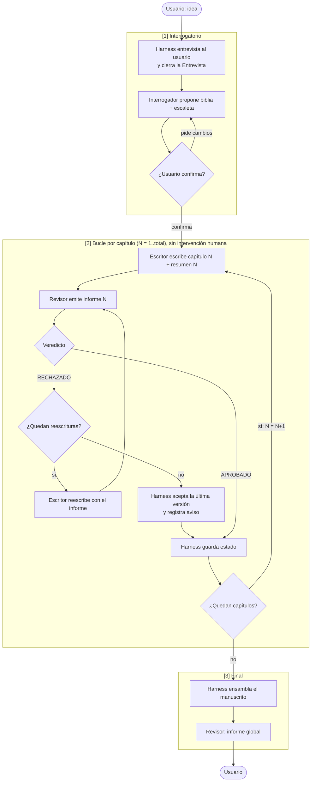

# story-maker — Especificación funcional

Generador agéntico de novelas en castellano sobre **cómo será el mundo tras la revolución de la IA**. El usuario aporta una idea; tres agentes (interrogador, escritor, revisor) coordinados por un **harness** la convierten en una novela completa.

El proyecto tiene **dos fases** y este documento vale para las dos:

1. **Validar el diseño en Claude Code, con el modelo caro.** En esta fase **no hay código**: el harness es una skill orquestadora, tres subagentes y un conjunto de reglas, todo en Markdown dentro del repositorio. Claude ejecuta el flujo en la sesión cuando el usuario lanza `/novela`. Se prueba con historias pequeñas (3 capítulos) para ver qué da el diseño cuando el modelo no es el cuello de botella.
2. **Llevar ese mismo diseño a un runner propio contra OpenRouter, con un modelo barato,** para generar novelas de 100–200 capítulos sin sesión interactiva. El runner es código (§10); los contratos, artefactos, límites y configuración son **los mismos** que aquí. Lo que se valida en la fase 1 es lo que se porta en la 2.

La carpeta de la novela es el único estado, en las dos fases. Este documento describe **qué** hace el sistema y cómo se comportan sus partes. Dónde está implementada cada pieza: §9. Qué puedes ajustar sin tocar nada del harness: §7 y [`harness.config.json`](../harness.config.json). Qué hay que reimplementar para la fase 2 y qué no: §10.

Boceto original del flujo: [novela-agentica.drawio](../novela-agentica.drawio). Historial de cambios y motivos: [CHANGELOG.md](../CHANGELOG.md).

---

## 1. Alcance

### 1.1 Objetivo

A partir de una idea inicial del usuario, producir una novela completa —biblia, escaleta, capítulos aprobados y manuscrito ensamblado— con continuidad interna verificada, sin intervención humana desde la aprobación de la escaleta hasta el final.

### 1.2 Decisiones fijas

| Aspecto | Decisión |
|---|---|
| Género | Fijo: ficción especulativa sobre el mundo posterior a la revolución de la IA |
| Universo | Cada novela inventa su propio mundo post-IA. No existe canon compartido entre novelas |
| Idioma | Castellano, en todo: interrogatorio, artefactos internos y novela |
| Interacción | Fase 1: sesión de Claude Code, comando `/novela`; conversacional durante el interrogatorio, solo progreso después. Fase 2: el runner toma la entrevista de un fichero y corre desatendido (§10) |
| Ejecución | Fase 1: Claude Code con subagentes, sin programas ni librerías propias. Fase 2: runner propio contra OpenRouter que implementa este mismo contrato |
| Escala | Fase 1: perfil `relato` (3 capítulos). Fase 2: hasta 200 capítulos (perfil `saga`), lo que exige la memoria por ventana de §7.6 |

### 1.3 No objetivos

Quedan explícitamente fuera:

- Formatos de salida distintos de Markdown (sin PDF, DOCX, EPUB ni HTML). El usuario convierte el manuscrito con la herramienta que prefiera.
- Código propio **en la fase 1**: programas, scripts, librerías, hooks con comandos. En la fase 2 el runner es código, pero ninguna parte de la fase 1 lo requiere.
- Medición del coste en **dinero**: Claude Code no lo expone. Sí se mide el **volumen** (palabras de entrada y salida por invocación, §6.6), que es lo que permite estimar el coste con la tarifa de cualquier modelo.
- Interfaz web o gráfica.
- Ilustraciones.
- Otros idiomas.
- Canon o universo compartido entre novelas.
- Uso del modo de prueba (§8.1) como forma normal de generar novelas: existe solo para verificación.
- Volver atrás a un capítulo anterior ya aprobado y regenerar desde ahí.
- Reescritura automática tras la revisión global final.
- Avisos externos (email, webhook) al terminar o fallar.

---

## 2. Actores

| Actor | Tipo | Responsabilidad |
|---|---|---|
| **Usuario** | Persona | Aporta la idea, responde al interrogatorio, aprueba la escaleta, observa el progreso, decide qué hacer con el informe final |
| **Harness** | Fase 1: Claude Code ejecutando la skill orquestadora `/novela`. Fase 2: el runner (§10) | Orquesta el flujo, invoca a los subagentes, guarda el estado, impone límites, verifica zonas de escritura, reanuda, ensambla |
| **Agente interrogador** | Fase 1: subagente de Claude Code. Fase 2: una llamada al modelo con el mismo prompt | Convierte la idea y la entrevista cerrada en biblia y escaleta |
| **Agente escritor** | Ídem | Escribe cada capítulo y su resumen |
| **Agente revisor** | Ídem | Juzga cada capítulo y, al final, la novela completa. Nunca edita |

Los tres agentes son **prompts con un contrato** (§5), no piezas de Claude Code: por eso son lo primero que se porta al runner sin cambios.

---

## 3. Artefactos

Todos los artefactos de una novela viven en **una carpeta propia de esa novela**. Son el único estado del sistema: no hay nada en memoria que no esté también en disco tras cada paso completado.

| Artefacto | Contenido | Lo escribe | Lo leen |
|---|---|---|---|
| **Idea** | Texto libre inicial del usuario | Harness (al arrancar) | Todos |
| **Configuración** | Copia congelada de `harness.config.json` con los valores efectivos de esta novela (§7) | Harness (al crear la novela) | Harness, interrogador |
| **Entrevista** | Todas las decisiones de la fase 1 en forma pregunta → respuesta, marcando cuáles eligió el usuario y cuáles quedaron en "decide tú". Cerrada antes de lanzar al interrogador | Harness (tras la entrevista) | Interrogador |
| **Biblia** | Premisa; tono y estilo; el mundo post-IA de esta novela (qué pasó, qué reglas rigen, qué ha cambiado); personajes con arco, motivación y voz; reglas internas que la historia no puede romper | Interrogador | Todos |
| **Escaleta** | Estructura en tres actos (planteamiento, nudo, desenlace). Una entrada por capítulo: título provisional, acto al que pertenece, objetivo narrativo, sucesos clave, personajes presentes, gancho de cierre, **longitud objetivo en palabras**. Número total de capítulos | Interrogador | Todos |
| **Capítulo N** | Texto del capítulo. Se conservan todas las versiones (intento 1, 2, 3), marcada la aprobada | Escritor (solo el suyo) | Todos |
| **Resumen N** | Hechos ocurridos; cambios de estado de cada personaje; hilos abiertos y cerrados; objetos, lugares o datos introducidos que condicionan el futuro | Escritor (junto con el capítulo) | Todos |
| **Informe N** | Veredicto APROBADO / RECHAZADO y lista de problemas concretos (ver §5.3). Uno por intento | **Harness**, a partir del YAML que el revisor devuelve en su mensaje. El revisor no escribe el fichero: así el veredicto que queda en disco es el que recalcula el harness (§7.5), no el que diga el agente | Todos |
| **Estado** | Fase actual; capítulo en curso; intento en curso; capítulos aprobados; invocaciones realizadas; motivo de parada si la hubo | **Solo el harness** | Harness |
| **Registro (log)** | Cada invocación a un subagente: quién, cuándo, modelo, con qué entradas, **palabras de entrada y de salida** (§6.6), resultado; cada decisión del harness (aprobar, reintentar, aceptar por agotamiento, revertir escritura fuera de zona, parar) | **Solo el harness** | Usuario |
| **Manuscrito** | Novela ensamblada en Markdown: título, índice, capítulos aprobados en orden | Harness (al final) | Usuario |
| **Informe global** | Resultado de la revisión de continuidad sobre la novela completa | **Harness**, a partir del YAML del revisor (igual que el Informe N) | Usuario |
| **Informe de cierre** | Resultado de la última ejecución: ÉXITO o PARADA, motivo, qué quedó completado, acción para continuar (§6.5) | **Solo el harness** | Usuario |

### 3.1 Reglas de escritura

- Cada agente escribe **únicamente en su zona** (columna "Lo escribe"). Los agentes tienen herramientas de lectura y escritura de ficheros, pero el harness restringe la escritura a esa zona.
- **Nada aprobado se modifica**: ni la biblia ni la escaleta tras la aprobación del usuario, ni un capítulo tras el veredicto APROBADO (o la aceptación por agotamiento).
- El **Estado** y el **Registro** son exclusivos del harness. Un agente nunca decide qué capítulo va ahora ni si algo está aprobado.

---

## 4. Flujo

### 4.1 Fase 1 — Interrogatorio

1. El harness crea la carpeta de la novela y guarda la idea.
2. **Entrevista.** El harness pregunta al usuario en **rondas sucesivas, sin límite fijo** (en Claude Code, con la skill `grilling`; en el runner, la entrevista llega ya cerrada en un fichero, §10.2). Pregunta lo que cambia la novela: protagonista y antagonismo, qué versión del mundo post-IA, tono, punto de vista, tipo de final, temas que tocar o evitar, extensión deseada. El resultado se escribe en la **Entrevista**, marcando qué eligió el usuario y qué dejó en "decide tú".
3. **Propuesta.** El harness lanza al interrogador con la idea, la entrevista y los límites. El interrogador escribe la biblia y la escaleta y **propone el cierre** con un resumen. El harness valida la escaleta contra los límites (abajo) y se la presenta al usuario.
4. El usuario **confirma** o **pide cambios**. Si pide cambios, el harness los pasa al interrogador, que corrige solo eso y vuelve a proponer. Nada se aprueba hasta que hay confirmación explícita.
5. Con la confirmación, el harness marca la biblia y la escaleta como aprobadas e inmutables, y pasa a la fase 2.

Los subagentes **no hablan con el usuario**: toda la conversación pasa por el harness. Así la fase 1 es la misma en Claude Code y en el runner; solo cambia de dónde salen las respuestas.

Restricciones que el interrogador debe respetar al proponer la escaleta, tomadas del perfil activo de `harness.config.json` (§7.1). Con el perfil por defecto (`relato`): 3–5 capítulos de ~1.500 palabras.

Si la escaleta propuesta viola un límite, el harness la devuelve al interrogador con el motivo, hasta `limites.escaleta_rechazos_max` veces, antes de presentársela al usuario.

### 4.2 Fase 2 — Bucle por capítulo

Para cada capítulo N, en orden:

**Escritura.** El escritor recibe:
- la biblia completa,
- la escaleta completa (con la entrada de N destacada),
- los resúmenes de todos los capítulos aprobados anteriores,
- el **texto íntegro del capítulo N−1** aprobado (para mantener voz y enlace),
- en caso de reescritura, el informe de rechazo del intento anterior y el texto rechazado.

Entrega el capítulo N y su resumen N.

**Revisión.** El revisor recibe el capítulo N, su resumen, la biblia, la escaleta y los resúmenes previos. Emite el informe N (§5.3).

**Decisión del harness.**
- APROBADO → marca el intento como aprobado, actualiza el estado, avanza a N+1.
- RECHAZADO con reescrituras disponibles → lanza al escritor con el informe. **Máximo 2 reescrituras** (3 intentos en total).
- RECHAZADO sin reescrituras disponibles → **acepta la última versión**, registra el aviso con el informe adjunto en el log y en el estado, avanza a N+1. La novela no se bloquea por un desacuerdo entre agentes.

**Progreso visible.** El usuario ve una línea por evento: capítulo N escrito, rechazado (motivo resumido), aprobado, aceptado por agotamiento. Puede interrumpir cuando quiera; el estado en disco permite reanudar (§6.2).

### 4.3 Fase 3 — Final

1. El harness ensambla el **manuscrito** con los capítulos aprobados.
2. El revisor hace **una única pasada sobre la novela completa** buscando solo lo que no puede verse capítulo a capítulo: hilos prometidos y nunca cerrados, contradicciones entre capítulos lejanos, personajes que desaparecen sin explicación, cambios de reglas del mundo. Emite el **informe global**. No reescribe nada.
3. El harness emite el **informe de cierre** (§6.5) con la ruta del manuscrito y del informe global. Qué hacer con el informe global es decisión del usuario, fuera del alcance del sistema.

---

## 5. Contratos de los agentes

### 5.1 Agente interrogador

| | |
|---|---|
| **Entrada** | Idea del usuario; Entrevista cerrada (§4.1); límites de tamaño de la configuración; en una segunda vuelta, el motivo (fuera de límites o cambios pedidos por el usuario) |
| **Salida** | Biblia y escaleta (§3); propuesta de cierre en su mensaje final |
| **Puede escribir** | Biblia, escaleta (solo mientras no estén aprobadas) |
| **Debe** | Respetar al pie de la letra lo que el usuario eligió en la entrevista; decidir lo que quedó en "decide tú" y anotarlo como decisión propia en la biblia; fijar número de capítulos y longitud objetivo dentro de los límites; garantizar que la escaleta cubre los tres actos y que cada capítulo tiene un objetivo narrativo propio; en una segunda vuelta, corregir solo lo indicado |
| **No debe** | Escribir prosa de la novela; hablar con el usuario ni preguntar nada (la entrevista ya está cerrada); marcar nada como aprobado |

### 5.2 Agente escritor

| | |
|---|---|
| **Entrada** | Biblia; escaleta; resúmenes previos; capítulo anterior íntegro; en reescritura, informe y texto rechazado |
| **Salida** | Capítulo N; resumen N |
| **Puede escribir** | Capítulo N (intento en curso) y resumen N. Nada más |
| **Debe** | Cumplir el objetivo, los sucesos y el gancho de la entrada N de la escaleta; respetar biblia y resúmenes previos; ajustarse a la longitud objetivo (±20 %); mantener la voz del capítulo anterior; en reescritura, corregir cada problema del informe sin introducir otros |
| **No debe** | Tocar capítulos, resúmenes o informes anteriores; modificar la biblia o la escaleta; adelantar sucesos asignados a capítulos posteriores; resolver hilos que la escaleta deja abiertos para más adelante |

El resumen N lo escribe el escritor **en la misma entrega** que el capítulo. Si el capítulo se rechaza, su resumen se descarta con él.

### 5.3 Agente revisor

| | |
|---|---|
| **Entrada (por capítulo)** | Capítulo N; resumen N; biblia; escaleta; resúmenes previos |
| **Entrada (global)** | Manuscrito completo; biblia; escaleta; todos los resúmenes |
| **Salida** | Informe con veredicto y lista de problemas |
| **Puede escribir** | Nada: devuelve el informe como YAML en su mensaje final y el harness lo guarda. Como mucho, un fichero de notas de trabajo en la ruta que le indique el harness |
| **Debe** | Juzgar exclusivamente contra estos criterios, en este orden de gravedad: (1) contradice la biblia o los resúmenes previos; (2) no cumple la entrada N de la escaleta (objetivo, sucesos, gancho) o adelanta sucesos futuros; (3) longitud fuera de ±20 % del objetivo; (4) ruptura de voz, punto de vista o tono; (5) el resumen no refleja el capítulo. Cada problema debe ser **concreto y accionable** (dónde, qué, por qué) |
| **No debe** | Editar el texto; rechazar por gusto sin señalar un criterio; añadir criterios propios |

Un informe es **RECHAZADO** si tiene al menos un problema de gravedad 1 o 2, o dos o más de gravedad 3-5. En otro caso es **APROBADO** (puede llevar observaciones menores que no obligan a reescribir).

---

## 6. Contrato del harness

### 6.1 Responsabilidades

- Crear y gestionar la carpeta de la novela.
- Invocar a cada agente con exactamente las entradas de su contrato; ni más (ahorro de contexto) ni menos.
- Restringir la zona de escritura de cada agente (§3.1).
- Tomar todas las decisiones de flujo: aprobar, reescribir, aceptar por agotamiento, avanzar, parar.
- Escribir el Estado tras **cada** decisión, no al final.
- Registrar todo (§3, Registro).
- Imponer los límites (§6.3).
- Ensamblar el manuscrito.
- Mostrar el progreso al usuario.

### 6.2 Reanudación

Relanzar el programa sobre una carpeta de novela existente **continúa donde se quedó**:

- Si la escaleta no está aprobada → vuelve al interrogatorio, con lo ya respondido como contexto.
- Si está en el bucle → retoma en el capítulo y el intento indicados en el Estado. Nada aprobado se regenera. Un intento a medias (escrito sin revisar) se considera no existente y se repite.
- Si el bucle terminó pero falta el informe global → ejecuta solo eso.
- Si la novela está completa → lo indica y no hace nada.

Reanudar es siempre **el mismo comando sobre la misma carpeta** (`/novela continuar <carpeta>`). El usuario no tiene que decir desde dónde: lo sabe el Estado.

### 6.3 Límites

Todos salen de `harness.config.json` (§7); aquí el comportamiento y el valor por defecto.

| Límite | Comportamiento | Variable · por defecto |
|---|---|---|
| Reescrituras por capítulo | Al agotarse, aceptación de la última versión con aviso | `limites.reescrituras_max` · 2 |
| Capítulos | La escaleta que lo viole se devuelve al interrogador | perfil activo · 3–5 (`relato`) |
| Palabras por capítulo (objetivo) | Ídem, acotado además por el suelo y techo absolutos | perfil activo · 1.500 (`relato`) |
| **Turnos por invocación** de subagente | Un subagente que no entrega su salida en ese número de turnos se considera que incumple el contrato (reintento; parada si persiste) | `limites.turnos_por_invocacion` · 40 |
| Fallo técnico de un subagente (error, respuesta vacía o que no cumple el contrato) | Reintentos del mismo paso; si persiste, parada limpia con el error en el Registro y en el Estado | `limites.reintentos_tecnicos` · 3 |
| Pausa programada | Cada N capítulos cerrados, parada limpia opcional para no agotar el contexto de la sesión | `limites.pausa_cada_capitulos` · 5 |

No hay presupuesto en dinero: Claude Code no expone el coste. Lo que acota el trabajo total son los topes de capítulos, reescrituras, reintentos y turnos, más la elección de modelo por agente (§7.3). Lo que sí se mide es el volumen (§6.6).

"Parada limpia" significa: ningún artefacto a medias marcado como válido, Estado actualizado con el motivo, mensaje claro al usuario de cómo reanudar.

### 6.4 Progreso

Durante la fase 2 el harness muestra, como mínimo: capítulo en curso y total, intento, veredicto de cada revisión con motivo resumido, y cualquier aviso (aceptación por agotamiento, escritura fuera de zona revertida).

### 6.5 Fallos: cómo se entera el usuario y cómo se resuelve

Principio: **el programa nunca muere en silencio ni deja el estado a medias.** Toda ejecución, termine bien o mal, acaba con un informe de cierre.

**Cómo se entera el usuario**

1. **Informe de cierre** mostrado en la sesión y guardado en la carpeta de la novela. Contiene: resultado (ÉXITO / PARADA), motivo clasificado (tabla siguiente), fase y capítulo en que se detuvo, qué quedó completado y aprobado, avisos acumulados (aceptaciones por agotamiento, escrituras revertidas) y **la acción exacta para continuar**.
2. **Comando de estado** (`/novela estado <carpeta>`): resume fase, capítulo, intento, aprobados, invocaciones y último informe de cierre, sin que el usuario abra ficheros.
3. Durante la ejecución, cada problema recuperable (reintento, rechazo, escritura revertida) aparece en el progreso en el momento en que ocurre.

**Clasificación de motivos y cómo se resuelve cada uno**

| Motivo | Qué ha pasado | Qué hace el harness solo | Qué tiene que hacer el usuario |
|---|---|---|---|
| **Fallo técnico transitorio** | El subagente falla, devuelve vacío o se corta | Hasta 3 reintentos del mismo paso. Si alguno funciona, no hay parada | Nada |
| **Fallo técnico persistente** | Los 3 reintentos fallan | Parada limpia. Registra el error completo | **Relanzar sobre la misma carpeta** (`/novela continuar`) |
| **Agente incumple contrato** | La salida no tiene la forma esperada (sin veredicto, sin resumen, capítulo vacío) o agota los turnos | Se trata como fallo técnico: reintento del paso con la indicación del incumplimiento | Si persiste: relanzar. Si se repite en varias novelas, es un problema de la definición del subagente y se anota como incidencia |
| **Escritura fuera de zona** | Un subagente ha modificado un fichero que no le corresponde | El harness lo detecta al volver el subagente comparando con git, **revierte** ese fichero, registra el incidente y repite la invocación como incumplimiento de contrato | Nada, salvo que persista (relanzar) |
| **Escaleta fuera de límites** | El interrogador propone más capítulos o longitudes de las permitidas | Se devuelve al interrogador con el motivo, hasta 3 veces; después parada limpia | Relajar los límites o ajustar la idea, y relanzar |
| **Error de configuración** | La carpeta no es válida, el repositorio no está bajo git, o faltan los ficheros del harness | Parada inmediata antes de invocar a ningún subagente, indicando qué falta | Corregir y relanzar |
| **Interrupción del usuario** | Corta la sesión o el comando | El paso en curso se descarta; el Estado queda en el último punto consistente | Relanzar cuando quiera |

Nunca se requiere borrar nada a mano ni editar el Estado para continuar. Si una carpeta quedara en un estado que el harness no reconoce, el informe de cierre lo dice explícitamente y señala el último punto consistente, en lugar de intentar adivinar.

### 6.6 Volumen: el dato para decidir el modelo

La decisión que motiva la fase 2 —pasar a un modelo más barato— es económica, y Claude Code no da el coste. Lo que sí puede dar el harness es el **volumen**, que multiplicado por la tarifa de cualquier modelo da el coste:

- En cada fila `invocacion` del Registro: el **modelo** usado, las **palabras de entrada** (suma de los ficheros que el prompt manda leer al subagente) y las **palabras de salida** (lo que entregó). Recuentos aproximados; lo importante es que estén en todas las filas.
- En el informe de cierre: la suma por subagente y por modelo.

Con eso, tras la novela de 3 capítulos se puede proyectar el coste de 100 o 200 en cualquier modelo, y tras dos novelas con la misma idea y distinto modelo (`/novela comparar`, §8.3) se puede decidir con números si el barato aguanta.

---

## 7. Variables configurables — `harness.config.json`

Todo el comportamiento ajustable del harness vive en **[`harness.config.json`](../harness.config.json)**, en la raíz del repositorio. Es el único fichero que el usuario necesita editar: no hay que tocar la skill, los subagentes ni esta especificación.

Al crear una novela, el harness **congela** la configuración efectiva en `novelas/<slug>/config.json`. A partir de ahí esa novela usa su copia, aunque después se edite el fichero global. Las variables de tamaño (capítulos, palabras) quedan además bloqueadas al aprobar la escaleta; el resto (modelos, reintentos, reescrituras, memoria) sí pueden cambiarse al reanudar con `/novela continuar <carpeta> <clave>=<valor>`.

### 7.1 Perfil activo y tamaño de la historia

`perfil_activo` elige uno de los `perfiles`. **Cambiar esa única cadena es lo que escala el proyecto**, de un relato de prueba a una novela larga.

| Perfil | Capítulos (objetivo · min–max) | Palabras/capítulo | Páginas aprox. |
|---|---|---|---|
| `relato` | 3 · 3–5 | 1.500 | ~18 |
| `novela_corta` | 12 · 8–15 | 2.000 | ~96 |
| `novela` | 30 · 20–40 | 2.500 | ~300 |
| `saga` | 100 · 60–200 | 2.500 | ~1.000 (hasta ~2.000) |

Campos de cada perfil:

| Variable | Qué hace |
|---|---|
| `capitulos_objetivo` | Cuántos capítulos debe proponer el interrogador si nada indica otra cosa |
| `capitulos_min` / `capitulos_max` | Límites duros. Una escaleta fuera de rango se devuelve al interrogador (§4.1) |
| `palabras_por_capitulo` | Longitud objetivo de cada capítulo. El interrogador puede variarla por capítulo dentro de `formato.palabras_min_capitulo`–`palabras_max_capitulo` |
| `paginas_objetivo` | **Alternativa a `capitulos_objetivo`.** Si no es `null`, manda: el harness calcula `capitulos = redondeo(paginas × formato.palabras_por_pagina ÷ palabras_por_capitulo)` y comprueba que cae entre `capitulos_min` y `capitulos_max`; si no, para con `ESCALETA_FUERA_LIMITES` antes de empezar |
| `descripcion` | Texto para el usuario; el harness la ignora |

Para añadir un perfil propio basta con añadir una entrada al objeto `perfiles` y apuntar `perfil_activo` a ella.

### 7.2 Formato

| Variable | Por defecto | Qué hace |
|---|---|---|
| `formato.palabras_por_pagina` | 250 | Conversión páginas ↔ palabras. Solo se usa si un perfil fija `paginas_objetivo` y para informar del tamaño |
| `formato.palabras_min_capitulo` | 800 | Suelo absoluto por capítulo, por encima de lo que diga el perfil |
| `formato.palabras_max_capitulo` | 5.000 | Techo absoluto por capítulo |
| `formato.tolerancia_longitud` | 0.2 | Margen que acepta el revisor sobre la longitud objetivo (±20 %). Ponerlo a `0` fuerza rechazos: sirve para probar el bucle de reescritura (§8.2, criterio 3) |

### 7.3 Modelos

Qué modelo usa cada subagente, y cuál se usa **cuando algo va mal**. Valores admitidos en la fase 1: `"opus"`, `"sonnet"`, `"haiku"`, `"fable"` (los alias que acepta la herramienta `Agent` de Claude Code). En la fase 2 el runner admite además identificadores de modelo de OpenRouter (§10). El orquestador pasa el modelo en cada invocación, así que puede cambiar entre un intento y el siguiente del mismo capítulo.

Los valores por defecto corresponden a la **fase de validación** (§7.7, paso 1): todo con el modelo caro y el escalado apagado, para medir el techo del diseño. Para la fase de abaratamiento (paso 2) se baja el modelo base y se enciende el escalado, sin tocar nada más.

| Variable | Por defecto | Qué hace |
|---|---|---|
| `modelos.interrogador` | `opus` | Modelo del subagente que construye biblia y escaleta |
| `modelos.escritor` | `opus` | Modelo por defecto del que escribe los capítulos |
| `modelos.revisor` | `opus` | Modelo por defecto del que juzga |
| `modelos.escalado.activo` | `false` | Interruptor general del escalado. En `false` se ignora todo lo demás de esta sección. Se enciende en el paso 2 |
| `modelos.escalado.modelo` | `opus` | Modelo al que se sube cuando se cumple alguna condición de abajo |
| `modelos.escalado.escritor_desde_intento` | 2 | A partir de ese intento, el escritor usa el modelo escalado. Con 2: el primer intento es barato; si lo rechazan, la reescritura la hace el modelo bueno |
| `modelos.escalado.revisor_desde_intento` | 3 | Ídem para el revisor. Con 3: el juicio del último intento, el que puede acabar aceptado por agotamiento, lo hace el modelo bueno |
| `modelos.escalado.tras_fallo_tecnico` | `true` | Si un subagente falla o incumple el contrato, el reintento se hace con el modelo escalado |
| `modelos.escalado.revision_global` | `true` | La pasada final sobre la novela completa (§4.3) usa el modelo escalado |

Configuraciones de referencia: **validación** = los tres en `opus`, `escalado.activo: false` (la de por defecto). **Abaratamiento** = los tres en `haiku` o `sonnet`, `escalado.activo: true` con `escalado.modelo: opus`. **Mínima** = los tres en `haiku`, escalado apagado. Subir `modelos.escritor` es lo que más cambia la calidad de la prosa; subir `modelos.revisor` es lo que más cambia la fiabilidad del veredicto.

### 7.4 Límites

| Variable | Por defecto | Qué hace |
|---|---|---|
| `limites.reescrituras_max` | 2 | **Modificaciones máximas** de un capítulo. Con 2 hay 3 intentos; agotados, se acepta la última versión con aviso (§4.2) |
| `limites.reintentos_tecnicos` | 3 | **Retries** por invocación de subagente ante fallo o incumplimiento de contrato. Agotados, parada limpia |
| `limites.escaleta_rechazos_max` | 3 | Veces que se devuelve la escaleta al interrogador por salirse de los límites antes de parar |
| `limites.turnos_por_invocacion` | 40 | Acciones máximas que se le piden a un subagente en una invocación (§6.3) |
| `limites.pausa_cada_capitulos` | 5 | Cada cuántos capítulos cerrados el harness puede hacer `PAUSA_PROGRAMADA` para no agotar el contexto de la sesión. `null` desactiva la pausa |

### 7.5 Regla de veredicto

Traduce a números la regla de §5.3, para poder endurecerla o relajarla sin tocar el subagente:

| Variable | Por defecto | Qué hace |
|---|---|---|
| `veredicto.rechaza_con_graves` | 1 | Nº de problemas de gravedad 1 o 2 que bastan para RECHAZADO |
| `veredicto.rechaza_con_leves` | 2 | Nº de problemas de gravedad 3, 4 o 5 que bastan para RECHAZADO |

### 7.6 Memoria (lo que hace posible escalar)

Controla cuánto contexto recibe el escritor en cada capítulo (§4.2). Es la variable crítica para llegar a 100 capítulos: con resúmenes ilimitados, el contexto crece sin techo.

| Variable | Por defecto | Qué hace |
|---|---|---|
| `memoria.resumenes_completos_ultimos` | `null` | Cuántos resúmenes previos recibe íntegros el escritor. `null` = todos (correcto hasta ~15 capítulos). Con un número N, recibe los N últimos |
| `memoria.capitulo_anterior_integro` | `true` | Si el escritor recibe el texto completo del capítulo anterior (mantiene voz y empalme). Ponerlo a `false` ahorra contexto a costa de continuidad de estilo |
| `memoria.digesto_por_acto` | `false` | Si además recibe un digesto por acto de los capítulos que quedan fuera de la ventana. **Todavía no implementado**: hasta que lo esté, `resumenes_completos_ultimos` distinto de `null` pierde información de los capítulos antiguos |

### 7.7 Escalar el proyecto

El plan va de una historia pequeña con el modelo caro a 100–200 capítulos con un modelo barato, validando en cada paso. Cada paso cambia **solo configuración**, salvo los dos que están marcados como trabajo de harness.

| Paso | Qué se hace | Configuración | Qué se aprende | Estado |
|---|---|---|---|---|
| 1. **Validar el diseño** | `relato` (3 capítulos) en Claude Code, los tres agentes con el modelo caro, escalado apagado | La de por defecto | Si el diseño produce una historia que se lee y cumple el contrato (§8.2) cuando el modelo no es el problema. El volumen (§6.6) da la primera proyección de coste | Listo para ejecutar |
| 2. **Abaratar** | Misma idea, mismo harness, `modelos.*` en `haiku` o `sonnet` con escalado a `opus`. Se compara con la del paso 1 (`/novela comparar`, §8.3) | `modelos.*`, `escalado.activo: true` | Qué pierde la historia con el modelo barato y si el escalado lo compensa. Con números: volumen por modelo, capítulos aceptados por agotamiento, problemas del informe global | Listo para ejecutar |
| 3. **Portar al runner** | Reimplementar el orquestador como código contra OpenRouter (§10), usando los mismos prompts, plantillas, `config.json` y estructura de carpeta. Se valida generando la misma idea del paso 1 y comparándola | `modelos.*` con identificadores de OpenRouter | Que el runner produce una carpeta que pasa el mismo inventario (`specs/inventario.md` §4) que la de Claude Code | **Trabajo de harness pendiente** |
| 4. **Crecer** | `novela_corta` (12) → `novela` (30) en el runner. A partir de ~15 capítulos hay que fijar `memoria.resumenes_completos_ultimos` | `perfil_activo`, `memoria.*` | Si la escaleta aguanta y si el revisor detecta contradicciones a media distancia | Configuración |
| 5. **`saga`** (100–200) | **Requiere implementar antes `memoria.digesto_por_acto`**: sin él, el escritor del capítulo 80 no sabe nada del capítulo 5 | `perfil_activo: saga` | La novela larga | **Trabajo de harness pendiente** |

`pausa_cada_capitulos` existe para la fase 1 (el contexto de una sesión de Claude Code se agota); en el runner se pone a `null` y el bucle corre solo. Los dos trabajos pendientes están anotados en el [CHANGELOG](../CHANGELOG.md).

---

## 8. Verificación

### 8.1 Modo de prueba

Existe **solo para verificar el harness**, no para uso normal. Activa dos cosas:

- El interrogatorio toma las respuestas de un **fichero de respuestas** en vez de preguntar al usuario en la sesión. Si el interrogador hace una pregunta sin respuesta prevista, el orquestador responde "decide tú lo que mejor sirva a la historia" y lo registra.
- La escaleta se **aprueba automáticamente** si cumple los límites.

Todo lo demás (subagentes, revisor, límites, reanudación) se comporta exactamente igual que en uso normal. El Registro deja constancia de que la ejecución fue en modo de prueba.

### 8.2 Criterios de aceptación

Los ejecuta **Claude Code** sobre una novela corta (3 capítulos de 1.500 palabras, el mínimo permitido) en modo de prueba, y comprueba el resultado leyendo la carpeta. El usuario solo lee la novela al final.

1. **Novela completa.** La ejecución termina con ÉXITO y existen: biblia, escaleta, 3 capítulos aprobados con resumen e informe APROBADO (o aceptación por agotamiento registrada), manuscrito, informe global e informe de cierre. Cada capítulo aprobado está dentro del ±20 % de su longitud objetivo.
2. **Interrogatorio.** En modo de prueba, el interrogador consume las respuestas del fichero, propone el cierre por iniciativa propia y la escaleta resultante respeta los límites y refleja las respuestas dadas (p. ej. el número de capítulos pedido).
3. **Rechazo y reescritura.** Con una configuración que fuerce el rechazo (tolerancia de longitud del 0 %), cada capítulo llega a 3 intentos, el harness acepta la última versión, y el aviso figura en el progreso, el Registro y el informe de cierre.
4. **Reanudación.** Interrumpiendo el proceso durante el capítulo 2, al relanzar `/novela continuar` sobre la misma carpeta el capítulo 1 conserva su contenido byte a byte (comprobable con git) y el capítulo 2 se retoma; el resultado final es una novela completa.
5. **Turnos agotados.** Con un tope de turnos por invocación deliberadamente bajo, el subagente no entrega, el harness reintenta 3 veces, hace parada limpia y el informe de cierre dice INCUMPLE CONTRATO con la acción de continuar. Al relanzar con el tope normal, termina con ÉXITO.
6. **Permisos.** Biblia y escaleta son idénticas antes y después del bucle; cada capítulo aprobado es idéntico al final; una escritura deliberada fuera de zona (provocada en la prueba dando al escritor la instrucción de tocar la biblia) se detecta, se revierte y queda registrada.
7. **Registro.** Para cualquier capítulo se puede reconstruir desde el Registro qué subagentes se invocaron, cuántas veces y con qué veredicto, y el número de invocaciones coincide con el del Estado.
8. **Reanudación tras parada.** Tras cualquier parada limpia (criterios 5 o 6), el Estado sigue siendo reanudable y `/novela continuar` no regenera nada aprobado.
9. **Comando de estado.** Sobre una novela a medias, `/novela estado` devuelve fase, capítulo, intento, aprobados e invocaciones coherentes con el Estado.

Estas comprobaciones son las que Claude Code ejecuta por sí mismo para dar por construido el harness (ver §9 para dónde está cada pieza). Qué ficheros debe haber al final, uno a uno, y cómo comprobar en seis pasos que una ejecución está completa: [`specs/inventario.md`](inventario.md). El inventario vale igual para el runner de la fase 2: es la definición de "misma salida".

### 8.3 Comparar dos ejecuciones

Para decidir el paso 2 y validar el 3 (§7.7) hace falta comparar dos novelas generadas con la **misma idea** y distinta configuración: modelo caro frente a barato, o Claude Code frente al runner. Es lo que hace `/novela comparar <caso>` sobre una carpeta `comparativa/caso-NN-<slug>/` que referencia las dos novelas (no las copia: viven en `novelas/` con su historial).

La comparación tiene un bloque **medible** —palabras, capítulos completos, artefactos presentes, invocaciones, volumen por modelo, aceptados por agotamiento, problemas del informe global— y un bloque de **lectura** donde cada juicio exige una cita concreta. Termina con una lista de cambios accionables para el harness. Ningún dato se estima: lo que no está disponible se escribe `desconocido`. Detalles: [`comparativa/README.md`](../comparativa/README.md).

---

## 9. Dónde está implementado

El harness son estos ficheros; cada uno documenta su parte:

| Qué | Dónde |
|---|---|
| **Variables que puedes editar** (§7) | [harness.config.json](../harness.config.json) |
| Reglas globales y cómo se usa | [CLAUDE.md](../CLAUDE.md) |
| Orquestador: comandos, fases, reanudación, estado | [.claude/skills/novela/SKILL.md](../.claude/skills/novela/SKILL.md) |
| Fase 1 (entrevista con grilling + subagente interrogador) | [procedimientos/interrogatorio.md](../.claude/skills/novela/procedimientos/interrogatorio.md) |
| Fase 2 (un capítulo) | [procedimientos/capitulo.md](../.claude/skills/novela/procedimientos/capitulo.md) |
| Fase 3 (manuscrito + informe global) | [procedimientos/final.md](../.claude/skills/novela/procedimientos/final.md) |
| Invocar subagente + verificar zona con git | [procedimientos/verificar-zona.md](../.claude/skills/novela/procedimientos/verificar-zona.md) |
| Informe de cierre y motivos de parada | [procedimientos/cierre.md](../.claude/skills/novela/procedimientos/cierre.md) |
| Formato de cada artefacto de la novela | [plantillas/](../.claude/skills/novela/plantillas/) |
| Contratos de los tres subagentes | [.claude/agents/](../.claude/agents/) |
| Fichero de respuestas del modo de prueba | [pruebas/respuestas-prueba.md](../pruebas/respuestas-prueba.md) |
| Qué produce una ejecución completa y cómo comprobarlo (§8) | [specs/inventario.md](inventario.md) |
| Comparar dos ejecuciones (§8.3) | [procedimientos/comparar.md](../.claude/skills/novela/procedimientos/comparar.md) · [comparativa/](../comparativa/README.md) |

Historial de cambios del harness y sus motivos: [CHANGELOG.md](../CHANGELOG.md).

---

## 10. Fase 2 — El runner contra OpenRouter

El destino del proyecto es generar novelas de 100–200 capítulos con un modelo barato, desatendido. Eso no puede hacerlo una sesión de Claude Code: necesita un **runner** propio (un programa) que hable con OpenRouter. Esta sección fija qué se porta tal cual, qué hay que reimplementar y qué contrato debe cumplir el runner para que todo lo anterior siga valiendo.

### 10.1 Qué se porta sin cambios

| Pieza | Dónde está hoy | En el runner |
|---|---|---|
| Contratos de los tres agentes (§5): entradas, salidas, debe/no debe, formato del mensaje final | [.claude/agents/](../.claude/agents/) | Son el *system prompt* de cada llamada. Se copian literalmente; solo se quita la referencia a herramientas de Claude Code |
| Plantillas de artefactos (§3) | [plantillas/](../.claude/skills/novela/plantillas/) | Idénticas. El runner las rellena y las valida con los mismos campos |
| Prompts de invocación (qué rutas se le dan a cada agente en cada paso) | [procedimientos/](../.claude/skills/novela/procedimientos/) | Mismo texto; el runner sustituye "lee la ruta X" por el contenido de X en el mensaje, porque el modelo no tiene sistema de ficheros |
| Configuración y perfiles (§7) | [harness.config.json](../harness.config.json) | El mismo fichero, mismo `config.json` congelado por novela. `modelos.*` admite además identificadores de OpenRouter |
| Estructura de la carpeta de la novela, `estado.json`, `registro.md`, motivos de parada (§6.5) | [plantillas/](../.claude/skills/novela/plantillas/), [cierre.md](../.claude/skills/novela/procedimientos/cierre.md) | Idénticos. Es lo que permite que `/novela estado`, `/novela comparar` y el inventario funcionen sobre una novela generada por el runner |
| Regla de veredicto (§7.5), límites (§6.3), memoria (§7.6) | spec + config | Mismas reglas, en código |

### 10.2 Qué hay que reimplementar

| Pieza | Cómo lo hace Claude Code | Cómo lo hará el runner |
|---|---|---|
| Orquestador (fases, bucle, decisiones, reanudación) | La skill `/novela` leída por Claude en la sesión | Un bucle en código que sigue [SKILL.md](../.claude/skills/novela/SKILL.md) y los procedimientos paso a paso. La skill es la especificación del runner |
| Invocar a un agente | Herramienta `Agent` con subagentes | Una llamada a la API de OpenRouter con el contrato como *system* y el prompt de invocación con los ficheros incrustados |
| Zona de escritura | Los agentes escriben ficheros; el orquestador lo verifica con git | Los agentes **no escriben nada**: devuelven el contenido en su respuesta y el runner lo escribe en las rutas de la zona. La verificación con git deja de ser necesaria (se puede conservar como comprobación) |
| Entrevista (fase 1) | Skill `grilling` en la sesión | El runner toma `entrevista.md` ya cerrada (escrita a mano o con Claude Code) o el fichero de respuestas del modo de prueba. No hace preguntas |
| Confirmación de la escaleta | Pregunta en la sesión | Parada limpia con `escaleta.md` en `aprobada: false`; el usuario la aprueba editando el frontmatter o con una opción del runner, y relanza |
| Commits | El orquestador commitea en `novelas/` | Ídem, con git desde el runner. Es lo que da la reanudación y la trazabilidad |
| Pausa programada | `pausa_cada_capitulos` por el contexto de sesión | Innecesaria: `null`. El contexto lo controla `memoria.*` |
| Volumen (§6.6) | Palabras contadas por el orquestador | Tokens reales de la respuesta de la API, que es más preciso. Se guardan en las mismas columnas del registro |

### 10.3 Contrato del runner

El runner está bien si, sobre la misma idea y la misma `entrevista.md`:

1. Produce una carpeta `novelas/<slug>/` que pasa la comprobación de completitud de [`specs/inventario.md`](inventario.md) §4 sin ninguna adaptación.
2. `/novela estado` y `/novela comparar` desde Claude Code funcionan sobre esa carpeta sin saber quién la generó.
3. Los criterios de aceptación de §8.2 se cumplen (los que dependen de la sesión —turnos, interrupción manual— se traducen a su equivalente: timeout de llamada, señal de parada).

Lo que **no** se decide aquí: lenguaje, librerías y estructura del runner. Se decide cuando se llegue al paso 3 de §7.7 y se anota en el CHANGELOG. Lo que sí queda fijado es que el runner no altera ninguno de los contratos de este documento: si algo del diseño no funciona en el runner, se cambia el diseño aquí primero y después en las dos implementaciones.
