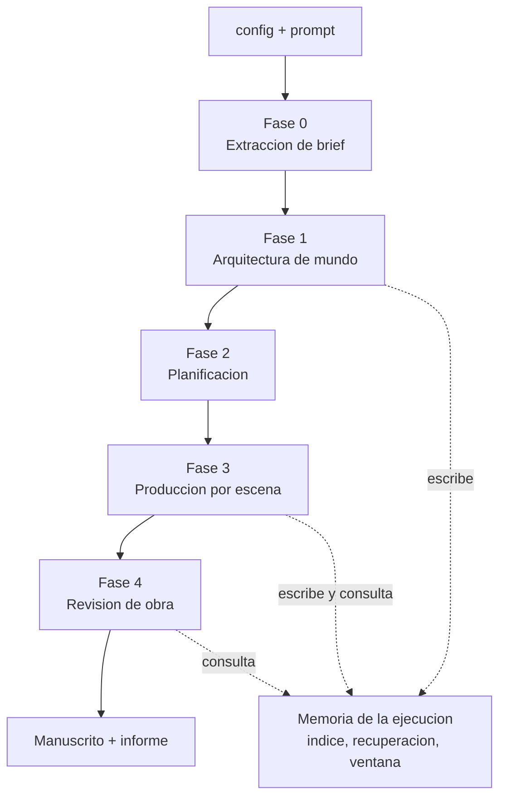

# SRS — Story Maker, backend V1

Especificación de requisitos de software del backend. Documento único: cubre desde la entrada del usuario hasta el manuscrito y su informe.

**Qué es y qué no es.** Es la referencia para construir la primera versión del backend. No es fuente de verdad del dominio ni del diseño: eso vive en `docs/*.md`, y donde este documento y un doc discrepen, manda el doc. Cada requisito lleva su origen en §10.

---

## 1. Introducción

### 1.1 Propósito

Definir qué debe hacer el backend de Story Maker en su primera versión: un servicio que recibe una configuración y un único prompt en lenguaje natural y devuelve, sin ninguna intervención humana intermedia, una novela completa en español sobre el mundo posterior a la revolución de la IA, acompañada de un informe que declara qué hizo el sistema y por qué.

### 1.2 Alcance del producto

Dentro de V1:

- Validación de la configuración y creación de la ejecución.
- Extracción del `ContratoDeBrief` desde el prompt, con verificación de ida y vuelta.
- Arquitectura de mundo: candidatos de `Novum`, selección por puntuación, derivación de consecuencias, canon inicial, y promoción del canon a la biblioteca al terminar.
- Planificación: `Outline` jerárquico y puerta de factibilidad.
- Memoria de la ejecución: índice híbrido, recuperación determinista y ensamblado de la `VentanaDeContexto`.
- Bucle de producción por escena con sus cuatro puertas y su enrutado de defectos.
- Pase global sobre la obra terminada y reescritura dirigida.
- Manuscrito en Markdown e `InformeDeEjecucion`.
- Superficie HTTP con progreso en vivo y cancelación.

Fuera de V1, en §9.

### 1.3 Definiciones

El vocabulario del dominio es `definitions.md` y este documento no introduce sinónimos. La proyección de cada término a identificador de código está en `architecture.md` §9.2 y se usa tal cual: `Novum` → `novum`, `CanonCard` → `canon_card`, `VentanaDeContexto` → `context_window`, y así con el resto.

Abreviaturas propias de este documento: **RF** requisito funcional, **RNF** requisito no funcional, **T/A/I/D/U** las clases de verificación de `verification.md` §2.

### 1.4 Referencias

| Documento | Qué aporta |
|---|---|
| `docs/definitions.md` | Entidades, atributos y relaciones. Autoridad de nomenclatura |
| `docs/domain-knowledge.md` | Por qué el género exige novum, grafo causal y catálogo de tropos |
| `docs/architecture.md` | Pipeline, memoria, puertas, agentes, stack, API. §10 abierto, §11 cerrado |
| `docs/verification.md` | Clases T/A/I/D/U, cobertura por elemento, riesgo aceptado |

### 1.5 Convenciones

- Los requisitos se numeran `RF-<MÓDULO>-<n>` y `RNF-<n>`, en el orden lógico del módulo. Un requisito nuevo se inserta donde le toca y renumera los que van detrás; el renumerado se propaga a `TODO.md` y a la matriz de relación en el mismo commit. Un requisito retirado deja su hueco.
- **Obligatorio** es requisito de V1. **Deseable** puede quedar fuera sin invalidar la entrega.
- Cada requisito declara su clase de verificación. Solo la clase T se convierte en prueba automática; A es tipado y análisis estático, I es revisión, D es ejecución demostrativa, U es riesgo aceptado por escrito.
- Las cifras sin calibrar se escriben como tales y nunca se inventan aquí (§2.5).

---

## 2. Descripción general

### 2.1 Perspectiva del producto

El backend es el sistema entero: toda la orquestación y todos los agentes viven en él. El frontend es un cliente delgado que recoge dos entradas, muestra progreso y presenta dos salidas.

La ejecución atraviesa cinco fases en orden, encadenadas por artefacto persistido y nunca por llamada directa entre fases.



### 2.2 Funciones principales

1. Validar la entrada y rechazar lo imposible antes de gastar nada.
2. Convertir prosa libre en un contrato de compromisos y huecos declarados.
3. Inventar un mundo derivable de un novum y no trillado.
4. Planificar la obra y comprobar que el alcance comprometido cabe en la longitud pedida.
5. Producir cada escena con el contexto justo, evaluarla en cuatro puertas y aceptarla o corregirla.
6. Detectar los defectos que solo existen a escala de obra y repararlos por reescritura dirigida.
7. Entregar el manuscrito y la evidencia de lo que se hizo.

### 2.3 Características de los usuarios

Un único perfil en V1: quien lanza la ejecución. No hay rol de revisor, ni de editor, ni de administrador. Nadie aprueba nada durante la ejecución, por decisión de `architecture.md` §8.1.

### 2.4 Restricciones

| # | Restricción | Origen |
|---|---|---|
| R1 | Autonomía total: ninguna pausa, pregunta de aclaración ni pantalla de aprobación | §8.1 |
| R2 | Entrada mínima: `config` más un único prompt. No hay más interacción | §8.1, `definitions.md` §6 |
| R3 | Generación secuencial por escena; cada una depende del estado que deja la anterior | §8.1 |
| R4 | Python 3.12+, FastAPI, Pydantic v2, SQLAlchemy 2, SQLite, dependencias con `uv` | §9.1, §11 |
| R5 | Índice en el mismo fichero SQLite que el canon, con `sqlite-vec` y FTS5 | §3.14 |
| R6 | Vectores producidos por `fastembed`, local y sin servicio | §3.14 |
| R7 | Salida en Markdown, único formato soportado | §11 |
| R8 | Ninguna fase importa a otra; `domain` no importa nada | §9.2 |
| R9 | Entorno de desarrollo Windows sin privilegios de administrador y sin VC++ Redistributable: el runtime de Visual C++ se resuelve en espacio de usuario y los enlaces simbólicos de la caché de modelos se desactivan | §3.14 |

### 2.5 Supuestos y dependencias

Estas cifras existen como campo y **no tienen valor acordado** (`architecture.md` §10.2). El código las lee de configuración y falla de forma accionable si faltan; ningún requisito de este documento inventa un número:

`densidad_minima`, umbrales de la puerta de juicio, techo de elementos estructurales del arquitecto, cuotas por (colección, consumidor), `umbral_deriva_conteo`, techo de dinero por ejecución, techo de reanudaciones.

Dependencias externas: un proveedor de modelo de lenguaje accesible por red, y la descarga inicial del modelo de incrustación.

---

## 3. Requisitos funcionales

### 3.1 CFG — Configuración y creación de la ejecución

| # | Requisito | Prioridad | Clase |
|---|---|---|---|
| RF-CFG-1 | El sistema valida la aritmética de `config.estructura` antes de ejecutar nada, y rechaza las combinaciones imposibles nombrando los parámetros incompatibles | Obligatorio | T, A |
| RF-CFG-2 | La sobredeterminación es inexpresable: `config.estructura` declara `objetivo_palabras`, `capitulos` y `forma_distribucion`, y el resto se deriva. No existe campo para escribir un estado inconsistente | Obligatorio | A |
| RF-CFG-3 | El sistema valida `config.recuperacion` al crear la ejecución: tabla de cuotas completa, una entrada por par (colección, consumidor), enteros ≥ 0, y `modelo_incrustacion` con valor | Obligatorio | T |
| RF-CFG-4 | Una entrada ausente de la tabla de cuotas impide crear la ejecución, con error que nombra el par que falta | Obligatorio | T |
| RF-CFG-5 | Una cuota negativa o no entera impide crear la ejecución | Obligatorio | T |
| RF-CFG-6 | Una colección o un consumidor desconocidos impiden crear la ejecución | Obligatorio | T |
| RF-CFG-7 | Prosa con cuota mayor que 0 para el escritor o para el crítico de canon impide crear la ejecución. La prosa es del crítico de oficio y de nadie más | Obligatorio | T |
| RF-CFG-8 | Una cuota de 0 es válida y significa que esa colección no entra en la ventana de ese consumidor | Obligatorio | T |
| RF-CFG-9 | No existen cuotas por defecto en el código: sin tabla, no se arranca | Obligatorio | T |
| RF-CFG-10 | El sistema valida que `config.operacion` declara directorio de ejecuciones y ruta de la biblioteca de canon. Sin ellas no se crea la ejecución, con error que nombra la que falta. No existen rutas por defecto en el código | Obligatorio | T |
| RF-CFG-11 | `config.calidad` y `config.recuperacion` no son editables por el usuario final | Obligatorio | A |
| RF-CFG-12 | Los campos estructurales se congelan al aprobar el outline; los poéticos admiten ajuste en caliente | Obligatorio | T |
| RF-CFG-13 | El identificador del modelo de incrustación se congela al crear la ejecución y viaja con el índice. Cambiarlo después en configuración no afecta a una ejecución ya creada | Obligatorio | T |
| RF-CFG-14 | El identificador del modelo de lenguaje declarado en `config.operacion` se congela al crear la ejecución. Cambiarlo después no afecta a una ejecución ya creada: el cambio se ignora y queda anotado en el informe como resolución de conflicto | Obligatorio | T |
| RF-CFG-15 | Cada parámetro estructural genera un `Criterio` de la puerta dura | Obligatorio | T |

### 3.2 RUN — Ciclo de vida de la ejecución

| # | Requisito | Prioridad | Clase |
|---|---|---|---|
| RF-RUN-1 | `POST /runs` crea la ejecución, devuelve su identificador y no espera a que termine | Obligatorio | T |
| RF-RUN-2 | La ejecución corre en un worker aparte del proceso que atiende HTTP | Obligatorio | D |
| RF-RUN-3 | El estado de la ejecución es consultable en todo momento: estado, fase y escena actual | Obligatorio | T |
| RF-RUN-4 | El progreso se emite por Server-Sent Events mientras la ejecución avanza | Obligatorio | T, D |
| RF-RUN-5 | Existe punto de control por escena: el estado persistido basta para reanudar sin repetir escenas aceptadas | Obligatorio | T |
| RF-RUN-6 | Cancelar conserva el manuscrito parcial y el estado; no destruye lo producido | Obligatorio | T |
| RF-RUN-7 | Los errores aritméticos de bloqueo se devuelven en el `POST`; los de densidad, en el estado del trabajo, porque exigen haber construido el outline | Obligatorio | T |
| RF-RUN-8 | Cada agente con bucle lleva su propio tiempo máximo, además del presupuesto de reintentos por escena | Obligatorio | T |
| RF-RUN-9 | Los estados del trabajo y sus transiciones legales están declarados y son los únicos posibles | Obligatorio | A |

> La reanudación automática desde punto de control y su techo de reanudaciones dependen del diseño de orquestación que `architecture.md` §12.1 declara sin escribir. V1 implementa el punto de control (RF-RUN-5) y deja la política de reanudación para cuando ese diseño exista.

### 3.3 BRF — Extracción del contrato de brief

| # | Requisito | Prioridad | Clase |
|---|---|---|---|
| RF-BRF-1 | El sistema deriva del prompt un `ContratoDeBrief` con sus `Compromiso`s, sus `Hueco`s y un grado de libertad entre 0 y 1 | Obligatorio | T |
| RF-BRF-2 | Cada `Compromiso` declara dureza —inviolable o preferencia— y si es verificable | Obligatorio | T |
| RF-BRF-3 | Un verificador independiente redacta una paráfrasis del contrato y la contrasta con el prompt original | Obligatorio | T, I |
| RF-BRF-4 | Lo que aparece en el prompt y no en la paráfrasis se trata como compromiso perdido y vuelve a extracción | Obligatorio | T |
| RF-BRF-5 | Ante ambigüedad irresoluble, se clasifica como `Hueco` y nunca como `Compromiso` | Obligatorio | T |
| RF-BRF-6 | Un compromiso no verificable, o se convierte en criterio con rúbrica, o se declara como no verificado en el informe. Nunca se deja dentro sin método | Obligatorio | T |
| RF-BRF-7 | Los parámetros poéticos de `config` se promocionan a `Compromiso` del contrato | Obligatorio | T |
| RF-BRF-8 | Un prompt casi vacío produce un contrato con cero compromisos y grado de libertad 1.0, y la ejecución continúa | Obligatorio | T |

### 3.4 WLD — Arquitectura de mundo

| # | Requisito | Prioridad | Clase |
|---|---|---|---|
| RF-WLD-1 | El arquitecto recibe como restricción de entrada un techo de elementos estructurales inventables | Obligatorio | T |
| RF-WLD-2 | El arquitecto produce N candidatos de `Novum`, nunca uno solo | Obligatorio | T |
| RF-WLD-3 | El auditor de tropos puntúa el solapamiento de cada candidato con el `CatalogoDeTropos` | Obligatorio | T, I |
| RF-WLD-4 | El selector puntúa cada candidato en derivabilidad, ajuste a los compromisos y distancia al catálogo, y elige por puntuación | Obligatorio | T |
| RF-WLD-5 | El catálogo de tropos existe curado desde la primera ejecución; sin él no se puede puntuar originalidad | Obligatorio | T |
| RF-WLD-6 | Las consecuencias se derivan hasta que no queda ninguna huérfana: toda `Consecuencia` es alcanzable desde al menos un `Novum` | Obligatorio | T |
| RF-WLD-7 | El orden de una `Consecuencia` se limita a 1.º, 2.º o 3.º | Obligatorio | A |
| RF-WLD-8 | Al cerrar la fase, el arquitecto escribe el canon inicial y su índice en la misma transacción | Obligatorio | T |
| RF-WLD-9 | El arquitecto admite el modo «reutilizar canon», que parte de un storyworld de la biblioteca en vez de inventarlo | Deseable | T |
| RF-WLD-10 | La biblioteca de canon guarda entidades, aristas y vigencias, nunca vectores | Obligatorio | T |
| RF-WLD-11 | Una ejecución que termina y entrega manuscrito promueve su canon a la biblioteca como versión nueva que apunta a la anterior. Ninguna versión se sobrescribe | Obligatorio | T |

### 3.5 PLN — Planificación y puerta de factibilidad

| # | Requisito | Prioridad | Clase |
|---|---|---|---|
| RF-PLN-1 | El planificador produce un `Outline` jerárquico de capítulos y escenas a partir del canon, el contrato y `config` | Obligatorio | T |
| RF-PLN-2 | El outline declara la cobertura de arcos y el estado de cada `Arco` | Obligatorio | T |
| RF-PLN-3 | La puerta 0 calcula la densidad narrativa como `objetivo_palabras` entre el número de elementos estructurales **comprometidos**, y solo cuenta los derivados del `ContratoDeBrief` | Obligatorio | T, A |
| RF-PLN-4 | Por debajo de `densidad_minima`, la ejecución se bloquea con un mensaje que nombra las tres cifras: elementos comprometidos, palabras por elemento y mínimo exigido | Obligatorio | T |
| RF-PLN-5 | La puerta 0 comprueba que todo compromiso tiene cobertura en el outline; si falta alguno, vuelve a planificación | Obligatorio | T |
| RF-PLN-6 | Con cero compromisos, la puerta 0 pasa por construcción y la ejecución continúa | Obligatorio | T |
| RF-PLN-7 | La puerta 0 corre una sola vez, sobre el outline, antes de congelar la estructura, y no forma parte del bucle por escena | Obligatorio | T |
| RF-PLN-8 | Superada la puerta 0, la estructura se congela | Obligatorio | T |

### 3.6 MEM — Memoria de la ejecución

Este módulo absorbe íntegro el comportamiento que se especificó como feature propia: escritura del índice, proyección, consultas, recuperación, cuotas, recorte y trazabilidad. Todo él es determinista y no llama a ningún modelo de lenguaje.

#### Escritura

| # | Requisito | Prioridad | Clase |
|---|---|---|---|
| RF-MEM-1 | Cada entidad del canon inicial produce una `CanonCard` con `desde_escena` = 1 y `hasta_escena` abierto, consultable de inmediato | Obligatorio | T |
| RF-MEM-2 | Al aceptar una escena, su delta se indexa en la misma transacción que el canon. No existe instante observable en que canon e índice discrepen | Obligatorio | T |
| RF-MEM-3 | Una escena rechazada no deja rastro: el índice queda idéntico al anterior a generarla | Obligatorio | T |
| RF-MEM-4 | Un cambio en una entidad cierra la tarjeta vigente y añade otra. Ninguna tarjeta se modifica ni se borra: el índice es append-only | Obligatorio | T |
| RF-MEM-5 | Aceptar una escena escribe su resumen y una fila por párrafo, cada una con su escena y su capítulo | Obligatorio | T |
| RF-MEM-6 | Un vector almacenado nunca se recalcula | Obligatorio | T |
| RF-MEM-7 | Solo dos componentes escriben en el índice: el arquitecto de mundo en la fase 1 y el registrador de estado en la fase 3 | Obligatorio | A |
| RF-MEM-8 | El índice es función pura del canon aceptado: reconstruirlo desde el canon produce el mismo contenido | Obligatorio | T |

#### Residentes y proyección

| # | Requisito | Prioridad | Clase |
|---|---|---|---|
| RF-MEM-9 | La ventana lleva siempre los residentes que existan: proyección del outline, `EstadoDelMundo`, `ResumenRodante`, `StyleSheet`, compromisos inviolables y `CatalogoDeTropos` | Obligatorio | T |
| RF-MEM-10 | Los residentes no se indexan nunca | Obligatorio | A |
| RF-MEM-11 | La proyección del outline contiene los capitulares de toda la obra, las escenas del capítulo actual y la lista explícita de lo que aún no puede revelarse | Obligatorio | T |
| RF-MEM-12 | La proyección no contiene las escenas de otros capítulos, ni siquiera resumidas | Obligatorio | T |
| RF-MEM-13 | La lista de lo no revelable nombra los hechos de outline posteriores a la escena actual, sin exponer su contenido | Obligatorio | T |
| RF-MEM-14 | Una escena que no existe en el outline produce ventana sin proyección de capítulo, con causa raíz `contexto ausente`, sin bloquear | Obligatorio | T |

#### Consultas y recuperación

| # | Requisito | Prioridad | Clase |
|---|---|---|---|
| RF-MEM-15 | El escritor consulta de forma prospectiva, desde la entrada de outline de la escena que va a escribir | Obligatorio | T |
| RF-MEM-16 | El crítico de canon consulta de forma retrospectiva, desde el texto que el escritor acaba de producir | Obligatorio | T |
| RF-MEM-17 | Las dos consultas sobre la misma escena son distintas; ninguna reutiliza la otra | Obligatorio | T |
| RF-MEM-18 | El corte temporal filtra antes de puntuar: para la escena *n* solo son candidatas las unidades con `desde_escena` ≤ *n* < `hasta_escena` | Obligatorio | T |
| RF-MEM-19 | Cada colección se puntúa por separado. Ningún ranking mezcla unidades de dos colecciones | Obligatorio | T |
| RF-MEM-20 | `CanonCards` y resúmenes se recuperan por canal léxico y canal denso, fundidos por rango recíproco dentro de la colección | Obligatorio | T |
| RF-MEM-21 | La prosa se recupera solo por canal léxico, sin incrustaciones, y su unidad es el párrafo | Obligatorio | T |
| RF-MEM-22 | No existe re-ranking por modelo en ninguna colección | Obligatorio | A |
| RF-MEM-23 | Los empates se desempatan por identificador, de forma estable entre ejecuciones | Obligatorio | T |
| RF-MEM-24 | Una `Consecuencia` recuperada arrastra sus ancestros hasta el `Novum` como enunciado de una línea, sin consumir cuota y sin entrar como tarjeta completa | Obligatorio | T |
| RF-MEM-25 | Un resumen recuperado arrastra el anterior y el siguiente, y consume tres plazas | Obligatorio | T |
| RF-MEM-26 | El arrastre temporal respeta el corte: no arrastra resúmenes de escenas posteriores a la actual | Obligatorio | T |
| RF-MEM-27 | Recuperación vacía o escasa no bloquea: se genera con lo que haya y se registra causa raíz `contexto ausente` | Obligatorio | T |

#### Cuotas, ensamblado y tope

| # | Requisito | Prioridad | Clase |
|---|---|---|---|
| RF-MEM-28 | Cada par (colección, consumidor) entrega como mucho sus plazas; el sobrante se registra como negado | Obligatorio | T |
| RF-MEM-29 | Las plazas sobrantes no se prestan entre colecciones | Obligatorio | T |
| RF-MEM-30 | Con cuota 0, esa colección no se consulta ni aparece en la ventana de ese consumidor | Obligatorio | T |
| RF-MEM-31 | El escritor nunca recibe prosa recuperada; el crítico de oficio sí | Obligatorio | T |
| RF-MEM-32 | El orden de las piezas en la ventana es declarado y estable: mismas entradas, misma ventana, pieza por pieza | Obligatorio | T |
| RF-MEM-33 | La cuota de entrada de la etapa la calcula el orquestador dividiendo el techo entre las llamadas realmente en vuelo | Obligatorio | T |
| RF-MEM-34 | El guardián de presupuesto lo invoca el código, nunca el modelo. El agente no ve su presupuesto ni decide qué pedir | Obligatorio | A |
| RF-MEM-35 | Lo ensamblado nunca supera la cuota de entrada de la etapa | Obligatorio | T |
| RF-MEM-36 | Si no cabe, se recorta en el orden declarado: prosa, resúmenes de escena, `CanonCards`, `ResumenRodante`; dentro de cada colección, por rango inverso | Obligatorio | T |
| RF-MEM-37 | Residentes y arrastres no se recortan, salvo el `ResumenRodante`, que es la última válvula | Obligatorio | T |
| RF-MEM-38 | Si lo intocable ya supera la cuota, se recorta el `ResumenRodante` y se entrega igual, con causa raíz `contexto ausente`. No hay bloqueo por esta vía | Obligatorio | T |
| RF-MEM-39 | Lo negado se descuenta antes de cerrar la ventana y no llega al consumidor de ninguna forma | Obligatorio | T |
| RF-MEM-40 | El conteo de entrada usa el tokenizador del modelo congelado al crear la ejecución | Obligatorio | T |
| RF-MEM-41 | Se registra además el uso de entrada real del proveedor; si diverge por encima de `umbral_deriva_conteo`, se anota causa raíz `presupuesto excedido`, que no bloquea ni reintenta | Deseable | T |

#### Trazabilidad

| # | Requisito | Prioridad | Clase |
|---|---|---|---|
| RF-MEM-42 | La ventana registra qué entró y qué quedó fuera: identificador de cada residente y de cada unidad recuperada, más los negados con su motivo —cuota o recorte— | Obligatorio | T |
| RF-MEM-43 | Todo fragmento generado registra las `CanonCard` que lo justificaron, derivadas de la ventana con la que se generó | Obligatorio | T |

### 3.7 SCN — Producción por escena

| # | Requisito | Prioridad | Clase |
|---|---|---|---|
| RF-SCN-1 | Las escenas se producen en orden; ninguna empieza antes de que la anterior esté aceptada y registrada | Obligatorio | T |
| RF-SCN-2 | El escritor recibe una `VentanaDeContexto` y produce texto de escena más el delta que pretendía | Obligatorio | T |
| RF-SCN-3 | La puerta dura comprueba, sin modelo: violación de `Restriccion`, contradicción temporal, atributo de canon alterado, y los predicados deterministas de los invariantes 3 y 4 | Obligatorio | T |
| RF-SCN-4 | El predicado determinista del invariante 3 se comprueba sobre el delta **declarado** por el escritor, no sobre el real, que todavía no existe | Obligatorio | T |
| RF-SCN-5 | Superada la puerta dura, crítico de canon, crítico de oficio y auditor de tropos corren en paralelo | Obligatorio | T, D |
| RF-SCN-6 | Los críticos devuelven `Defecto` tipados y no reescriben nunca | Obligatorio | T |
| RF-SCN-7 | Los críticos no reciben el razonamiento del escritor ni su ventana | Obligatorio | A |
| RF-SCN-8 | Todo `Defecto` registra severidad, localización y causa raíz | Obligatorio | T |
| RF-SCN-9 | La causa raíz de un `Defecto` pertenece a un conjunto cerrado de seis valores. Una causa raíz fuera de ese conjunto es salida inválida del crítico: se rechaza y consume reintento del presupuesto de la escena | Obligatorio | T, A |
| RF-SCN-10 | El enrutado es uno solo y por naturaleza del defecto: los corregibles al editor, los estructurales al escritor. Nunca por la puerta que lo encontró | Obligatorio | T |
| RF-SCN-11 | La escena corregida por el editor vuelve a entrar por la puerta dura | Obligatorio | T |
| RF-SCN-12 | Agotado el presupuesto de reintentos de una escena, el veredicto es `escalar` y el defecto queda en el informe | Obligatorio | T |
| RF-SCN-13 | El registrador extrae el `DeltaDeEstado` real del texto aceptado; la divergencia con el declarado es un defecto de la puerta dura | Obligatorio | T |
| RF-SCN-14 | Al aceptar una escena se actualizan canon, `EstadoDelMundo`, `ResumenRodante` e índice en una sola transacción, antes de generar la siguiente | Obligatorio | T |
| RF-SCN-15 | Al aceptar una escena se escribe el `EstadoEpistemico` de cada `Personaje` **cuyo conocimiento cambia** en ella, en la misma transacción; el de los demás se arrastra del estado anterior | Obligatorio | T |
| RF-SCN-16 | Ningún agente escribe en canon durante el bucle; solo el registrador, y solo tras veredicto de aceptación | Obligatorio | A |
| RF-SCN-17 | El `EstadoDelMundo` en la escena *n* es la aplicación ordenada de los deltas de las escenas 1..*n*−1 | Obligatorio | T |
| RF-SCN-18 | Todo `Hueco` resuelto pasa a ser canon inviolable | Obligatorio | T |

### 3.8 GLB — Revisión de obra

| # | Requisito | Prioridad | Clase |
|---|---|---|---|
| RF-GLB-1 | El pase global no lee el manuscrito entero: se descompone en cuatro comprobaciones por tipo de defecto | Obligatorio | A |
| RF-GLB-2 | Hilos abiertos: consulta estructurada de `Arco` con estado abierto | Obligatorio | T |
| RF-GLB-3 | Consecuencias establecidas y nunca usadas: consulta estructurada de `Consecuencia` sin ningún vínculo de trazabilidad | Obligatorio | T |
| RF-GLB-4 | Ritmo y curva de tensión: juicio sobre la tabla de tensiones de capítulo, construida por código | Obligatorio | T, I |
| RF-GLB-5 | Deriva de voz: muestreo de tercios contrastado con el `StyleSheet` | Obligatorio | I |
| RF-GLB-6 | Repetición léxica entre escenas distantes: único uso de recuperación de todo el pase global, sobre la colección de prosa | Obligatorio | T, I |
| RF-GLB-7 | Los defectos de obra se resuelven por reescritura dirigida de escenas concretas, nunca por regeneración global | Obligatorio | T |
| RF-GLB-8 | Una escena reescrita vuelve a pasar las puertas del bucle por escena | Obligatorio | T |

### 3.9 OUT — Salidas

| # | Requisito | Prioridad | Clase |
|---|---|---|---|
| RF-OUT-1 | El manuscrito se entrega en Markdown | Obligatorio | T |
| RF-OUT-2 | El informe de ejecución declara: compromisos cumplidos, compromisos no verificables, huecos resueltos y con qué, novum elegido y su puntuación, defectos no resueltos con su localización, presupuesto consumido y causas raíz registradas | Obligatorio | T |
| RF-OUT-3 | `GET /runs/{id}/report` entrega el `InformeDeEjecucion` al terminar o al cancelar. Mientras la ejecución sigue corriendo devuelve conflicto, nombrando el estado actual | Obligatorio | T |
| RF-OUT-4 | El informe de una ejecución cancelada tiene la misma estructura, con los campos que no llegaron a evaluarse declarados como no evaluados y la fase en que se canceló | Obligatorio | T |
| RF-OUT-5 | El informe recoge las causas raíz que no producen defecto: `contexto ausente` por recorte y `presupuesto excedido` por deriva de conteo | Obligatorio | T |
| RF-OUT-6 | Toda resolución de conflicto entre config y prompt queda registrada en el informe; ninguna se resuelve en silencio | Obligatorio | T |
| RF-OUT-7 | El manuscrito parcial es accesible durante la ejecución, marcado como no definitivo | Obligatorio | T |

### 3.10 BUD — Presupuestos y techos

| # | Requisito | Prioridad | Clase |
|---|---|---|---|
| RF-BUD-1 | Existen tres techos distintos y no se confunden: ventana en tokens de entrada, reintentos por escena, y ejecución en dinero | Obligatorio | A |
| RF-BUD-2 | El techo de ventana cuenta solo entrada y se aplica a la suma de las llamadas en vuelo de una etapa, no a una llamada suelta | Obligatorio | T |
| RF-BUD-3 | La salida no lleva techo en tokens | Obligatorio | A |
| RF-BUD-4 | Agotado el presupuesto en dinero, la ejecución bloquea | Obligatorio | T |
| RF-BUD-5 | El coste consumido se acumula por llamada y es consultable durante la ejecución | Obligatorio | T |

---

## 4. Requisitos no funcionales

| # | Requisito | Clase |
|---|---|---|
| RNF-1 | **Determinismo de la memoria.** Con el mismo índice, la misma configuración y la misma escena, la ventana es idéntica pieza por pieza, sin ninguna llamada a modelo | T |
| RNF-2 | **Reproducibilidad de los vectores.** El modelo de incrustación se congela por ejecución; los vectores se guardan y no se recalculan. Una ejecución cuyo modelo ya no exista no se reanuda sin reconstruir el índice | T |
| RNF-3 | **Ejecución larga.** El tiempo total se mide en minutos u horas; ninguna operación de usuario espera a que termine | D |
| RNF-4 | **Punto de control.** Una caída no pierde más de una escena de trabajo | T |
| RNF-5 | **Tipado estricto.** Anotaciones en todo el backend y comprobador estricto; modelos validados en tiempo de ejecución en los bordes: entrada HTTP y salida de modelo | A |
| RNF-6 | **Análisis estático.** Ruff sobre todo el backend; escaneo de secretos, de construcción dinámica de consultas y de manejo de rutas al escribir el manuscrito | A |
| RNF-7 | **Aislamiento de módulos.** La regla de dependencia de §7 se comprueba en CI, no por convención | A |
| RNF-8 | **Reparto del recuperador.** Las reglas puras en `domain`, los clientes de incrustación, FTS5 y `sqlite-vec` en `platform`, la política de consulta en cada fase. No existen `commons`, `shared` ni `utils`. Se comprueba en CI | A |
| RNF-9 | **Puerto del proveedor de modelo.** La interfaz vive en `platform` y ninguna fase importa un cliente concreto. Existe además un doble determinista que devuelve respuestas fijas con su uso de entrada y salida y su coste | A |
| RNF-10 | **Observabilidad.** Toda llamada a modelo registra agente, fase, escena, tokens de entrada declarados y reales, y coste | T |
| RNF-11 | **Sin servicios añadidos.** El índice vive en el mismo fichero SQLite que el canon; no se introduce ningún servicio externo de vectores | A |
| RNF-12 | **Un fichero por ejecución.** Cada ejecución vive en su propio fichero SQLite con canon, artefacto narrativo, estado e índice. La biblioteca de canon vive en un fichero compartido aparte. Las dos rutas salen de `config.operacion` | T |
| RNF-13 | **Portabilidad del entorno de desarrollo.** El backend arranca en Windows sin privilegios de administrador, con el runtime de Visual C++ resuelto en espacio de usuario | D |
| RNF-14 | **Pruebas junto al código.** Las pruebas viven dentro de cada slice | I |
| RNF-15 | **Esquema OpenAPI exportable en estático**, sin arrancar servidor, para generar el cliente del frontend | T |

---

## 5. Interfaces externas

### 5.1 API HTTP

| Método y ruta | Entrada | Salida | Notas |
|---|---|---|---|
| `POST /runs` | `{ config, prompt }` | `{ run_id }` | Valida aritmética y `config.recuperacion`; rechaza en el acto lo imposible |
| `GET /runs/{id}` | — | `{ estado, fase, escena_actual }` | Incluye el error de densidad cuando lo hay |
| `GET /runs/{id}/stream` | — | SSE de progreso | Flujo unidireccional |
| `GET /runs/{id}/manuscript` | — | Markdown | Parcial mientras la ejecución no termine |
| `GET /runs/{id}/report` | — | `InformeDeEjecucion` | Disponible al terminar o al cancelar; mientras corre, conflicto |
| `DELETE /runs/{id}` | — | — | Cancela conservando lo producido |

Los modelos de entrada y salida son Pydantic v2, y el esquema OpenAPI derivado de ellos es la fuente del cliente del frontend.

### 5.2 Proveedor de modelo de lenguaje

Puerto declarado en `platform`, con implementación intercambiable. Toda llamada devuelve, además del texto, el uso de entrada y salida y el coste imputado. El modelo se declara en `config.operacion` y se congela al crear la ejecución (RF-CFG-14). El puerto y su doble determinista son RNF-9.

### 5.3 Proveedor de incrustaciones

`fastembed`, en proceso y sin red tras la descarga inicial del modelo. El identificador del modelo sale de `config.recuperacion.modelo_incrustacion`. Dos condiciones del entorno, ya comprobadas: el runtime de Visual C++ debe estar disponible en espacio de usuario, y los enlaces simbólicos de la caché de modelos se desactivan por variable de entorno.

### 5.4 Persistencia

Dos ficheros SQLite, con las rutas declaradas en `config.operacion` y sin valor por defecto en el código (RF-CFG-10, RNF-12):

- **Fichero de ejecución**, uno por ejecución: canon, artefacto narrativo, estado e índice. Las extensiones `sqlite-vec` y FTS5 se cargan sobre esa misma conexión.
- **Fichero compartido**: la biblioteca de canon, común a todas las ejecuciones. No lleva índice de ningún tipo —ni vectores (RF-WLD-10) ni FTS5— y se consulta por identificador y por atributos.

El `CatalogoDeTropos` no vive en ninguno de los dos: es dato curado en `domain`, versionado con el código (`architecture.md` §9.2).

---

## 6. Modelo de datos

Nombres en inglés según la proyección de `architecture.md` §9.2. El esquema es orientativo en tipos y obligatorio en estructura: lo que no puede cambiar es qué es inmutable, qué es append-only y qué se escribe en la misma transacción.

```sql
-- Ejecución y entrada
CREATE TABLE runs (
  id                TEXT PRIMARY KEY,
  created_at        TEXT NOT NULL,
  status            TEXT NOT NULL,     -- máquina de estados de RF-RUN-9
  phase             TEXT NOT NULL,
  current_scene     INTEGER,
  prompt            TEXT NOT NULL,
  config_json       TEXT NOT NULL,     -- config congelada de esta ejecución
  embedding_model   TEXT NOT NULL,     -- congelado, RF-CFG-13
  language_model    TEXT NOT NULL,   -- congelado, RF-CFG-14
  money_spent       REAL NOT NULL DEFAULT 0
);

-- Contrato de brief
CREATE TABLE brief_contracts (run_id TEXT PRIMARY KEY REFERENCES runs(id), freedom_degree REAL NOT NULL);
CREATE TABLE commitments (
  id TEXT PRIMARY KEY, run_id TEXT NOT NULL REFERENCES runs(id),
  statement TEXT NOT NULL, kind TEXT NOT NULL,
  hardness TEXT NOT NULL CHECK (hardness IN ('inviolable','preference')),
  verifiable INTEGER NOT NULL
);
CREATE TABLE gaps (
  id TEXT PRIMARY KEY, run_id TEXT NOT NULL REFERENCES runs(id),
  scope TEXT NOT NULL, resolved_by TEXT, resulting_canon TEXT
);

-- Canon: entidades y aristas del grafo causal
CREATE TABLE canon_entities (
  id TEXT PRIMARY KEY, run_id TEXT NOT NULL REFERENCES runs(id),
  kind TEXT NOT NULL,                  -- novum, consequence, constraint, character, faction, ...
  payload_json TEXT NOT NULL,
  created_at_scene INTEGER NOT NULL
);
CREATE TABLE canon_edges (
  id TEXT PRIMARY KEY, run_id TEXT NOT NULL REFERENCES runs(id),
  source_id TEXT NOT NULL REFERENCES canon_entities(id),
  target_id TEXT NOT NULL REFERENCES canon_entities(id),
  relation TEXT NOT NULL,              -- implies, derives_from, sustains, defines, ...
  order_n INTEGER CHECK (order_n BETWEEN 1 AND 3)
);

-- Artefacto narrativo
CREATE TABLE outlines (run_id TEXT PRIMARY KEY REFERENCES runs(id), version INTEGER NOT NULL, frozen INTEGER NOT NULL DEFAULT 0);
CREATE TABLE chapters (
  id TEXT PRIMARY KEY, run_id TEXT NOT NULL REFERENCES runs(id),
  number INTEGER NOT NULL, arc_function TEXT, tension_in REAL, tension_out REAL, target_words INTEGER
);
CREATE TABLE scenes (
  id TEXT PRIMARY KEY, run_id TEXT NOT NULL REFERENCES runs(id),
  chapter_id TEXT NOT NULL REFERENCES chapters(id),
  number INTEGER NOT NULL, pov TEXT, dramatic_function TEXT, target_words INTEGER,
  status TEXT NOT NULL,                -- planned, drafted, accepted, rewritten
  text TEXT
);
CREATE TABLE arcs (
  id TEXT PRIMARY KEY, run_id TEXT NOT NULL REFERENCES runs(id),
  name TEXT NOT NULL, kind TEXT NOT NULL,
  setup_scene INTEGER, resolution_scene INTEGER,
  state TEXT NOT NULL CHECK (state IN ('open','resolved'))
);

-- Estado
CREATE TABLE state_deltas (
  id TEXT PRIMARY KEY, scene_id TEXT NOT NULL REFERENCES scenes(id),
  kind TEXT NOT NULL CHECK (kind IN ('declared','real')),
  payload_json TEXT NOT NULL, reversible INTEGER NOT NULL
);
CREATE TABLE world_states (run_id TEXT NOT NULL, scene_number INTEGER NOT NULL, snapshot_json TEXT NOT NULL, PRIMARY KEY (run_id, scene_number));
CREATE TABLE epistemic_states (
  id TEXT PRIMARY KEY, scene_id TEXT NOT NULL REFERENCES scenes(id),
  character_id TEXT NOT NULL, side TEXT NOT NULL CHECK (side IN ('in','out')),
  known_json TEXT NOT NULL, falsely_believed_json TEXT NOT NULL
);
CREATE TABLE rolling_summaries (run_id TEXT NOT NULL, scene_number INTEGER NOT NULL, compressed TEXT NOT NULL, literal_tail TEXT NOT NULL, PRIMARY KEY (run_id, scene_number));
CREATE TABLE style_sheets (run_id TEXT PRIMARY KEY REFERENCES runs(id), payload_json TEXT NOT NULL);

-- Memoria de largo plazo: tres colecciones, append-only
CREATE TABLE canon_cards (
  id TEXT PRIMARY KEY, run_id TEXT NOT NULL REFERENCES runs(id),
  entity_id TEXT NOT NULL REFERENCES canon_entities(id),
  content TEXT NOT NULL,
  from_scene INTEGER NOT NULL,
  to_scene INTEGER                      -- NULL = vigente; se cierra, nunca se borra
);
CREATE TABLE scene_summaries (id TEXT PRIMARY KEY, run_id TEXT NOT NULL, scene_number INTEGER NOT NULL, content TEXT NOT NULL);
CREATE TABLE prose_paragraphs (id TEXT PRIMARY KEY, run_id TEXT NOT NULL, scene_number INTEGER NOT NULL, chapter_number INTEGER NOT NULL, content TEXT NOT NULL);

-- Canal léxico y canal denso
CREATE VIRTUAL TABLE memory_fts USING fts5(unit_id, collection, content, tokenize='unicode61');
CREATE VIRTUAL TABLE memory_vec USING vec0(unit_id TEXT PRIMARY KEY, collection TEXT, embedding FLOAT[384]);

-- Calidad y evidencia
CREATE TABLE defects (
  id TEXT PRIMARY KEY, run_id TEXT NOT NULL, scene_id TEXT,
  criterion TEXT NOT NULL, severity TEXT NOT NULL, location TEXT,
  root_cause TEXT NOT NULL CHECK (root_cause IN (   -- conjunto cerrado, RF-SCN-9
    'contexto ausente','canon contradictorio','deriva de estilo',
    'fallo de outline','config infactible','presupuesto excedido'))
);
CREATE TABLE verdicts (id TEXT PRIMARY KEY, evaluable_kind TEXT NOT NULL, evaluable_id TEXT NOT NULL, action TEXT NOT NULL);
CREATE TABLE traceability (
  id TEXT PRIMARY KEY, fragment_id TEXT NOT NULL, element_id TEXT NOT NULL,
  role TEXT NOT NULL CHECK (role IN ('justifying','denied')),
  denial_reason TEXT CHECK (denial_reason IN ('quota','trim'))   -- RF-MEM-42
);
CREATE TABLE model_calls (
  id TEXT PRIMARY KEY, run_id TEXT NOT NULL, agent TEXT NOT NULL, phase TEXT NOT NULL,
  scene_number INTEGER, input_tokens_counted INTEGER, input_tokens_reported INTEGER,
  output_tokens INTEGER, cost REAL
);

-- Biblioteca de canon (fichero compartido, sin índice) --------------------------
CREATE TABLE library_storyworlds (
  id TEXT PRIMARY KEY,
  version INTEGER NOT NULL,
  parent_id TEXT REFERENCES library_storyworlds(id),  -- versión de la que deriva
  promoted_from_run TEXT NOT NULL,
  promoted_at TEXT NOT NULL
);
CREATE TABLE library_entities (
  id TEXT PRIMARY KEY, storyworld_id TEXT NOT NULL REFERENCES library_storyworlds(id),
  kind TEXT NOT NULL, payload_json TEXT NOT NULL
);
CREATE TABLE library_edges (
  id TEXT PRIMARY KEY, storyworld_id TEXT NOT NULL REFERENCES library_storyworlds(id),
  source_id TEXT NOT NULL, target_id TEXT NOT NULL, relation TEXT NOT NULL,
  order_n INTEGER CHECK (order_n BETWEEN 1 AND 3)
);
```

Tres reglas del esquema que son requisito y no detalle:

1. `canon_cards` no admite `UPDATE` ni `DELETE`. Un cambio cierra la tarjeta poniendo `to_scene` y añade otra fila (RF-MEM-4).
2. `canon_cards`, `scene_summaries`, `prose_paragraphs`, `memory_fts` y `memory_vec` se escriben en la misma transacción que el canon que las origina (RF-MEM-2).
3. `traceability` guarda lo entregado y lo negado en la misma tabla, distinguidos por `role` (RF-MEM-42).
4. `epistemic_states` solo recibe fila por `Personaje` cuyo conocimiento cambia en la escena; el resto se arrastra (RF-SCN-15). El `EstadoEpistemico` viaja al escritor dentro del `EstadoDelMundo` residente, no como pieza aparte de la ventana.
5. `library_storyworlds` es append-only: promover nunca sobrescribe, añade versión que apunta a la anterior (RF-WLD-11).

Las tablas `library_*` viven en el fichero compartido; todas las demás, en el fichero de la ejecución.

---

## 7. Estructura de módulos

```
backend/
  pyproject.toml
  src/story_maker/
    phases/
      brief_extraction/
      world_building/
      planning/
      scene_production/
      work_review/
    execution/          # API HTTP, estado del trabajo, informe
    domain/             # datos del dominio e invariantes, sin I/O
    platform/           # orquestador, worker, proveedores, persistencia, índice
```

Reglas de dependencia, comprobadas en CI:

1. Ninguna fase importa a otra fase. Se comunican por artefacto persistido.
2. Ninguna fase importa `execution`.
3. `execution` importa las cinco fases. Es la única excepción.
4. `domain` no importa nada: ni `platform`, ni `phases`, ni `execution`.

Reparto del recuperador, que atraviesa las tres capas: las reglas puras —modelo de colección, fusión por rango recíproco, filtro temporal, arrastre— en `domain`; cliente de incrustación, FTS5, `sqlite-vec` y almacén de vectores en `platform`; la política de consulta —prospectiva, retrospectiva, por tipo de defecto— en cada fase, duplicada a propósito.

Algo sale de una slice solo si lo usan dos fases o más **y** tiene entrada en `definitions.md` o es un invariante. Si falla cualquiera de las dos, se duplica. No hay `commons`, `shared` ni `utils`.

---

## 8. Verificación

El método por elemento y su clase están en `verification.md` §5; aquí solo el resumen de qué exige este SRS.

| Bloque de requisitos | Método principal | Clase |
|---|---|---|
| CFG | Unitarias sobre el validador, más ejecución simbólica en la aritmética de factibilidad | T, A |
| RUN | Integración con dobles, más comprobación de modelos sobre la máquina de estados | T, A |
| BRF | Eval de conjunto dorado para el extractor; eval adversaria para el verificador | T, I |
| WLD | Eval del selector contra el catálogo de tropos, más inspección | T, I |
| PLN | Propiedades sobre densidad y cobertura | T, A |
| MEM | Pruebas doradas sobre índice de fixture con vectores almacenados, sin llamada a modelo. La cuota entra como dato del caso y los costes en tokens los declara el propio caso | T |
| SCN | Propiedades y mutación en la puerta dura; eval de juez calibrada en los críticos | T, I |
| GLB | Consultas estructuradas por prueba; juicios por eval | T, I |
| OUT / BUD | Guardarraíles y trazas; demostración de extremo a extremo con prompt casi vacío | T, D |

Riesgo aceptado que este SRS hereda y no resuelve (`verification.md` §6): la plausibilidad especulativa no se verifica sino que se aproxima por alcanzabilidad en el grafo; la calidad literaria depende de un juez imperfecto; la doble consulta reduce el punto ciego compartido pero no lo elimina; y el alcance de lo inventado no lo caza ninguna puerta determinista.

**Límite conocido del módulo MEM:** sus pruebas demuestran que la recuperación hace lo decidido, no que lo decidido sea lo acertado. La elección de cuotas se mide por eval del crítico de canon, clase I, y ninguna prueba del recuperador la cubre.

---

## 9. Fuera de alcance de V1

| Qué | Por qué |
|---|---|
| Reanudación automática desde punto de control, con techo de reanudaciones | El diseño de orquestación está declarado sin escribir (`architecture.md` §12.1). V1 deja el punto de control persistido y listo |
| Promoción de canon a la biblioteca **al cancelar** | Depende del mismo diseño. Promover al terminar bien sí entra en V1 (RF-WLD-11) |
| Calibración de umbrales, cuotas y techos | `architecture.md` §10.2: fijarlos hoy sería inventarlos |
| Frontend | Cliente delgado, fuera de este documento |
| Multiusuario, autenticación y cuotas por usuario | No hay más perfil que quien lanza la ejecución |
| Formatos de salida distintos de Markdown | Decisión cerrada en §11 |
| Re-ranking de la recuperación y expansión de consulta | Cuestan el determinismo que mantiene la memoria en clase T |

---

## 10. Trazabilidad a los documentos de referencia

| Módulo | Origen |
|---|---|
| CFG | `architecture.md` §3.6, §5, §6.2; `definitions.md` §6 |
| RUN | `architecture.md` §9.3, §9.4, §9.5, §12.1 |
| BRF | `architecture.md` §2, §8.10, §8.11; `definitions.md` §3 |
| WLD | `architecture.md` §6.3, §8.3, §8.6, §9.5; `domain-knowledge.md` §2, §3 |
| PLN | `architecture.md` §4.1, §6.3, §8.6; `definitions.md` §2 |
| MEM | `architecture.md` §3.1–§3.15, §7; `definitions.md` §4 |
| SCN | `architecture.md` §4.1, §7.1, §8.7, §8.8; `definitions.md` §2, §5 |
| GLB | `architecture.md` §8.9; `definitions.md` §2, §5 |
| OUT | `architecture.md` §6.1, §8.10; `definitions.md` §5 |
| BUD | `architecture.md` §3.13, §8.12 |
| RNF | `architecture.md` §3.11, §3.14, §9.1, §9.2; `verification.md` §3 |
